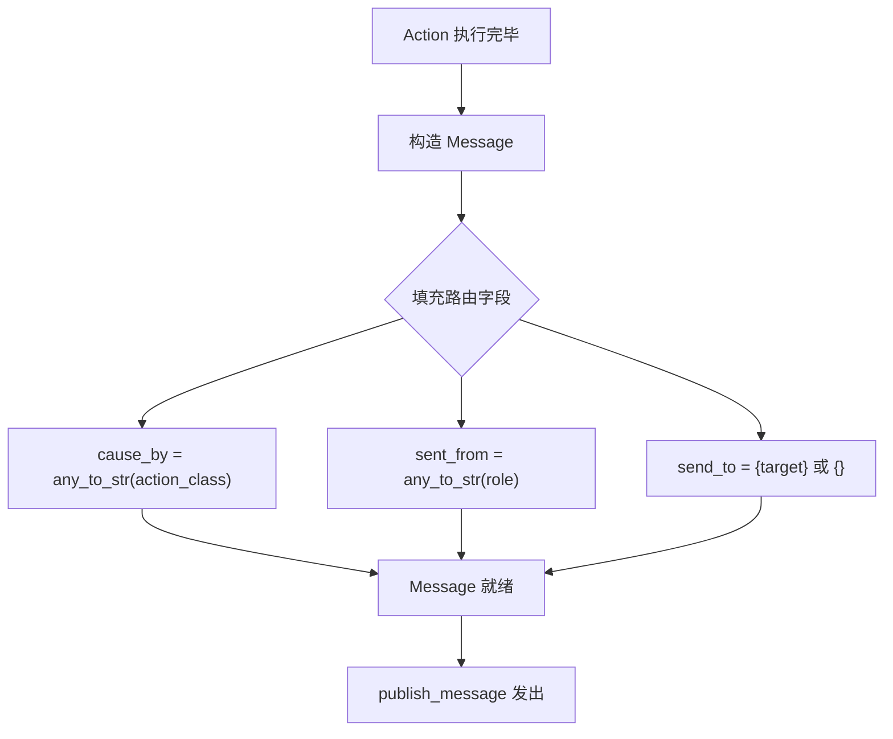
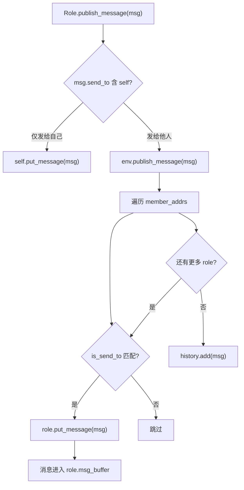
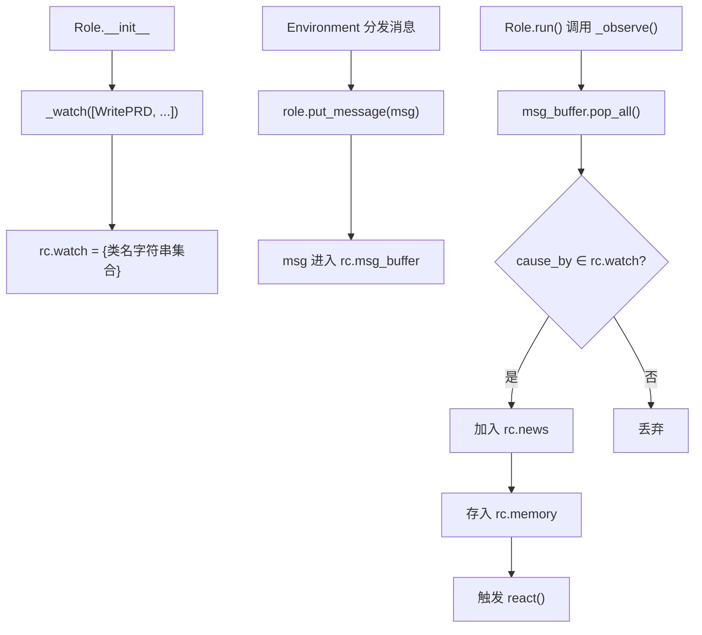

# PD-120.01 MetaGPT — 基于标签的消息路由与订阅通信

> 文档编号：PD-120.01
> 来源：MetaGPT `metagpt/schema.py` `metagpt/roles/role.py` `metagpt/environment/base_env.py` `metagpt/subscription.py`
> GitHub：https://github.com/FoundationAgents/MetaGPT.git
> 问题域：PD-120 消息路由与通信 Message Routing & Communication
> 状态：可复用方案

---

## 第 1 章 问题与动机

### 1.1 核心问题

在多 Agent 协作系统中，Agent 之间需要高效、松耦合地传递消息。核心挑战包括：

1. **寻址问题**：消息如何找到正确的接收者？硬编码接收者名称会导致 Agent 间强耦合
2. **订阅过滤**：每个 Agent 只关心特定类型的消息，如何避免信息过载？
3. **异步缓冲**：消息产生和消费速率不同步，如何保证不丢失、不阻塞？
4. **广播与定向**：有些消息需要广播给所有人，有些只发给特定角色，如何统一处理？
5. **触发器驱动**：外部事件（定时、webhook）如何融入消息流？

传统做法是 Agent 之间直接调用方法（`agent_b.handle(msg)`），这导致调用者必须知道接收者的具体类型和接口，违反开闭原则。当 Agent 数量增长时，N×N 的直接依赖关系变得不可维护。

### 1.2 MetaGPT 的解法概述

MetaGPT 实现了一套完整的**标签路由 + 观察者订阅**消息系统，核心设计：

1. **Message 携带路由三元组**：每条消息自带 `send_to`（目标地址集合）、`cause_by`（产生该消息的 Action 类名）、`sent_from`（发送者类名），路由信息与消息内容解耦（`metagpt/schema.py:232-241`）
2. **Environment 作为消息总线**：`Environment.publish_message()` 遍历 `member_addrs` 字典，按地址匹配将消息分发到对应 Role 的私有缓冲区（`metagpt/environment/base_env.py:175-195`）
3. **Role._watch() 订阅机制**：Role 通过 `_watch([ActionClass])` 声明关注哪些 Action 的输出，`_observe()` 阶段按 `cause_by` 标签过滤消息（`metagpt/roles/role.py:284-291`）
4. **MessageQueue 异步缓冲**：基于 `asyncio.Queue` 的非阻塞消息队列，支持 push/pop/pop_all/序列化（`metagpt/schema.py:713-782`）
5. **SubscriptionRunner 触发器模式**：独立于 Environment 的订阅运行器，支持 AsyncGenerator 触发器 + 回调模式（`metagpt/subscription.py:11-101`）

### 1.3 设计思想

| 设计原则 | 具体实现 | 理由 | 替代方案 |
|----------|----------|------|----------|
| 标签路由而非直接引用 | `cause_by` 存储 Action 类名字符串，`_watch` 订阅 Action 类型 | Agent 间零耦合，只依赖 Action 类型约定 | 直接方法调用（强耦合）、事件名字符串（易拼错） |
| 地址集合多路分发 | `send_to` 是 `set[str]`，支持多目标 + `<all>` 广播 | 一条消息可同时发给多个角色，广播是特殊情况 | 单目标字段 + 广播标志位（不够灵活） |
| 私有消息缓冲区 | 每个 Role 有独立 `msg_buffer: MessageQueue` | 解耦消息接收与处理时机，支持异步 | 全局共享队列（竞争条件）、同步回调（阻塞） |
| 类名字符串化 | `any_to_str()` 将 Action 类/实例统一转为类名字符串 | 序列化友好，跨进程可比较 | 直接用类引用（不可序列化） |
| 环境作为中介者 | Environment 持有 `member_addrs` 映射，负责路由 | 中介者模式，Role 不需要知道其他 Role 的存在 | 点对点通信（N×N 连接） |

---

## 第 2 章 源码实现分析

### 2.1 架构概览

MetaGPT 的消息路由系统由四层组成：

```
┌─────────────────────────────────────────────────────────────┐
│                    SubscriptionRunner                        │
│         (外部触发器驱动的独立订阅模式)                          │
├─────────────────────────────────────────────────────────────┤
│                      Environment                             │
│    publish_message() → member_addrs 路由 → put_message()     │
├──────────────┬──────────────┬──────────────┬────────────────┤
│   Role A     │   Role B     │   Role C     │   Role D       │
│ msg_buffer   │ msg_buffer   │ msg_buffer   │ msg_buffer     │
│ _watch([X])  │ _watch([Y])  │ _watch([X,Z])│ _watch([Y])    │
├──────────────┴──────────────┴──────────────┴────────────────┤
│                      MessageQueue                            │
│           asyncio.Queue 封装，push/pop/序列化                 │
├─────────────────────────────────────────────────────────────┤
│                       Message                                │
│    content + cause_by + send_to + sent_from + metadata       │
└─────────────────────────────────────────────────────────────┘
```

消息生命周期：
1. Role._act() 执行 Action，产出 Message（自动填充 `cause_by` 和 `sent_from`）
2. Role.publish_message() 将消息交给 Environment
3. Environment.publish_message() 遍历 member_addrs，匹配 send_to 地址
4. 匹配的 Role 通过 put_message() 将消息放入私有 msg_buffer
5. Role._observe() 从 msg_buffer 取出消息，按 cause_by ∈ watch 过滤
6. 过滤后的消息存入 Role.rc.memory，触发 _think() → _act() 循环

### 2.2 核心实现

#### 2.2.1 Message 路由三元组



对应源码 `metagpt/schema.py:232-279`：

```python
class Message(BaseModel):
    """list[<role>: <content>]"""
    id: str = Field(default="", validate_default=True)
    content: str
    instruct_content: Optional[BaseModel] = Field(default=None, validate_default=True)
    role: str = "user"
    cause_by: str = Field(default="", validate_default=True)
    sent_from: str = Field(default="", validate_default=True)
    send_to: set[str] = Field(default={MESSAGE_ROUTE_TO_ALL}, validate_default=True)
    metadata: Dict[str, Any] = Field(default_factory=dict)

    @field_validator("cause_by", mode="before")
    @classmethod
    def check_cause_by(cls, cause_by: Any) -> str:
        return any_to_str(cause_by if cause_by else
            import_class("UserRequirement", "metagpt.actions.add_requirement"))

    @field_validator("send_to", mode="before")
    @classmethod
    def check_send_to(cls, send_to: Any) -> set:
        return any_to_str_set(send_to if send_to else {MESSAGE_ROUTE_TO_ALL})
```

关键设计：`cause_by` 和 `send_to` 的 validator 自动将 Action 类/实例转为字符串，确保序列化一致性。默认 `send_to={<all>}` 实现广播语义。

#### 2.2.2 Environment 消息分发



对应源码 `metagpt/environment/base_env.py:175-195`：

```python
def publish_message(self, message: Message, peekable: bool = True) -> bool:
    """
    Distribute the message to the recipients.
    In accordance with the Message routing structure design in Chapter 2.2.1
    of RFC 116, the routing information in the Message is only responsible for
    specifying the message recipient, without concern for where the message
    recipient is located.
    """
    logger.debug(f"publish_message: {message.dump()}")
    found = False
    for role, addrs in self.member_addrs.items():
        if is_send_to(message, addrs):
            role.put_message(message)
            found = True
    if not found:
        logger.warning(f"Message no recipients: {message.dump()}")
    self.history.add(message)
    return True
```

路由匹配逻辑 `metagpt/utils/common.py:423-431`：

```python
def is_send_to(message: "Message", addresses: set):
    """Return whether it's consumer"""
    if MESSAGE_ROUTE_TO_ALL in message.send_to:
        return True
    for i in addresses:
        if i in message.send_to:
            return True
    return False
```

#### 2.2.3 Role 订阅与观察



对应源码 `metagpt/roles/role.py:284-291` 和 `399-427`：

```python
def _watch(self, actions: Iterable[Type[Action]] | Iterable[Action]):
    """Watch Actions of interest. Role will select Messages caused by these
    Actions from its personal message buffer during _observe."""
    self.rc.watch = {any_to_str(t) for t in actions}

async def _observe(self) -> int:
    """Prepare new messages for processing from the message buffer."""
    news = []
    if self.recovered and self.latest_observed_msg:
        news = self.rc.memory.find_news(observed=[self.latest_observed_msg], k=10)
    if not news:
        news = self.rc.msg_buffer.pop_all()
    old_messages = [] if not self.enable_memory else self.rc.memory.get()
    # 双重过滤：cause_by 匹配 watch 集合 OR 名字在 send_to 中
    self.rc.news = [
        n for n in news
        if (n.cause_by in self.rc.watch or self.name in n.send_to)
        and n not in old_messages
    ]
    ...
    return len(self.rc.news)
```

### 2.3 实现细节

**地址注册机制**：Role 加入 Environment 时，通过 `set_env()` → `env.set_addresses(self, self.addresses)` 将自身地址集合注册到 `member_addrs` 字典。默认地址包含类名和角色名（`metagpt/roles/role.py:211-213`）：

```python
@model_validator(mode="after")
def check_addresses(self):
    if not self.addresses:
        self.addresses = {any_to_str(self), self.name} if self.name else {any_to_str(self)}
    return self
```

**MessageQueue 序列化**：支持 `dump()` / `load()` 实现队列持久化，用于 Role 状态恢复（`metagpt/schema.py:748-782`）。dump 时逐个取出消息序列化后再放回，保证队列不丢失。

**SubscriptionRunner 触发器模式**：独立于 Environment 的订阅机制，适用于外部事件驱动场景（`metagpt/subscription.py:40-65`）：

```python
async def subscribe(self, role: Role, trigger: AsyncGenerator[Message, None],
                    callback: Callable[[Message], Awaitable[None]]):
    loop = asyncio.get_running_loop()
    async def _start_role():
        async for msg in trigger:
            resp = await role.run(msg)
            await callback(resp)
    self.tasks[role] = loop.create_task(_start_role(), name=f"Subscription-{role}")
```

**自发消息处理**：`MESSAGE_ROUTE_TO_SELF = "<self>"` 特殊标签允许 Role 给自己发消息，`publish_message` 中检测到后直接放入自身 `msg_buffer`，不经过 Environment（`metagpt/roles/role.py:429-440`）。

**实际使用示例** — 软件公司工作流中的消息链：

```
ProductManager._watch([UserRequirement])     → 收到用户需求，输出 PRD
Architect._watch([WritePRD])                 → 收到 PRD，输出系统设计
ProjectManager._watch([WriteDesign])         → 收到设计，输出任务分解
Engineer._watch([WriteTasks, ...])           → 收到任务，输出代码
QAEngineer._watch([SummarizeCode, ...])      → 收到代码摘要，输出测试
```

每个 Role 只声明关注的 Action 类型，完全不知道上游是谁，实现了真正的松耦合流水线。

---

## 第 3 章 迁移指南

### 3.1 迁移清单

**阶段 1：消息模型（1 个文件）**
- [ ] 定义 `Message` 数据类，包含 `content`、`cause_by`、`send_to`、`sent_from` 字段
- [ ] 实现 `any_to_str()` 工具函数，将 Action 类/实例统一转为字符串标识
- [ ] 定义路由常量：`ROUTE_TO_ALL = "<all>"`、`ROUTE_TO_SELF = "<self>"`

**阶段 2：消息队列（1 个文件）**
- [ ] 实现 `MessageQueue`，封装 `asyncio.Queue`，提供 `push`/`pop`/`pop_all`
- [ ] 添加 `dump()`/`load()` 序列化支持（可选，用于状态恢复）

**阶段 3：环境路由（1 个文件）**
- [ ] 实现 `Environment` 类，持有 `member_addrs: Dict[Role, Set[str]]`
- [ ] 实现 `publish_message()`：遍历 member_addrs，按 `is_send_to` 匹配分发
- [ ] 实现 `add_role()` / `set_addresses()`：注册角色地址

**阶段 4：角色订阅（集成到 Role 基类）**
- [ ] 在 Role 基类中添加 `msg_buffer: MessageQueue` 和 `watch: Set[str]`
- [ ] 实现 `_watch(actions)` 方法
- [ ] 实现 `_observe()` 方法：从 buffer 取消息 → 按 cause_by 过滤 → 存入 memory
- [ ] 实现 `put_message()` 和 `publish_message()` 方法

**阶段 5：触发器订阅（可选）**
- [ ] 实现 `SubscriptionRunner`，支持 AsyncGenerator 触发器 + 回调

### 3.2 适配代码模板

以下是一个最小可运行的消息路由系统实现：

```python
"""最小消息路由系统 — 从 MetaGPT 提取的核心模式"""
import asyncio
from asyncio import Queue, QueueEmpty
from dataclasses import dataclass, field
from typing import Any, Set, Dict, List, Optional, Type
from abc import ABC, abstractmethod

# ── 常量 ──
ROUTE_TO_ALL = "<all>"

# ── 工具函数 ──
def action_to_str(val: Any) -> str:
    """将 Action 类或实例转为类名字符串"""
    if isinstance(val, str):
        return val
    if isinstance(val, type):
        return f"{val.__module__}.{val.__qualname__}"
    return f"{type(val).__module__}.{type(val).__qualname__}"

def action_to_str_set(val) -> set:
    if isinstance(val, (list, set, tuple)):
        return {action_to_str(v) for v in val}
    return {action_to_str(val)}

def is_send_to(message: "Message", addresses: set) -> bool:
    if ROUTE_TO_ALL in message.send_to:
        return True
    return bool(addresses & message.send_to)

# ── 消息模型 ──
@dataclass
class Message:
    content: str
    cause_by: str = ""
    sent_from: str = ""
    send_to: Set[str] = field(default_factory=lambda: {ROUTE_TO_ALL})
    metadata: Dict[str, Any] = field(default_factory=dict)

# ── 消息队列 ──
class MessageQueue:
    def __init__(self):
        self._queue: Queue = Queue()

    def push(self, msg: Message):
        self._queue.put_nowait(msg)

    def pop(self) -> Optional[Message]:
        try:
            item = self._queue.get_nowait()
            self._queue.task_done()
            return item
        except QueueEmpty:
            return None

    def pop_all(self) -> List[Message]:
        msgs = []
        while True:
            msg = self.pop()
            if not msg:
                break
            msgs.append(msg)
        return msgs

    def empty(self) -> bool:
        return self._queue.empty()

# ── Action 基类 ──
class Action(ABC):
    @abstractmethod
    async def run(self, *args, **kwargs) -> str:
        ...

# ── Role 基类 ──
class Role(ABC):
    def __init__(self, name: str):
        self.name = name
        self.addresses: Set[str] = {action_to_str(type(self)), name}
        self.msg_buffer = MessageQueue()
        self._watch_set: Set[str] = set()
        self._env: Optional["Environment"] = None
        self.memory: List[Message] = []

    def watch(self, actions: list[Type[Action]]):
        self._watch_set = {action_to_str(a) for a in actions}

    def put_message(self, msg: Message):
        self.msg_buffer.push(msg)

    def observe(self) -> List[Message]:
        news = self.msg_buffer.pop_all()
        relevant = [
            n for n in news
            if n.cause_by in self._watch_set or self.name in n.send_to
        ]
        self.memory.extend(relevant)
        return relevant

    def publish_message(self, msg: Message):
        if not msg.sent_from:
            msg.sent_from = action_to_str(type(self))
        if self._env:
            self._env.publish_message(msg)

    @abstractmethod
    async def react(self, messages: List[Message]) -> Optional[Message]:
        ...

    async def run(self) -> Optional[Message]:
        news = self.observe()
        if not news:
            return None
        return await self.react(news)

# ── Environment ──
class Environment:
    def __init__(self):
        self.roles: Dict[str, Role] = {}
        self.member_addrs: Dict[Role, Set[str]] = {}

    def add_role(self, role: Role):
        self.roles[role.name] = role
        self.member_addrs[role] = role.addresses
        role._env = self

    def publish_message(self, message: Message) -> bool:
        found = False
        for role, addrs in self.member_addrs.items():
            if is_send_to(message, addrs):
                role.put_message(message)
                found = True
        return found

    async def run(self, rounds: int = 1):
        for _ in range(rounds):
            tasks = [role.run() for role in self.roles.values()]
            await asyncio.gather(*tasks)
```

### 3.3 适用场景

| 场景 | 适用度 | 说明 |
|------|--------|------|
| 多 Agent 流水线协作 | ⭐⭐⭐ | 最佳场景：PM→Architect→Engineer 链式传递 |
| 事件驱动微服务 | ⭐⭐⭐ | cause_by 标签天然适合事件溯源 |
| 动态 Agent 组合 | ⭐⭐ | 需要运行时修改 watch 集合 |
| 跨进程分布式 Agent | ⭐ | 当前实现基于内存队列，需替换为 Redis/MQ |
| 高吞吐实时系统 | ⭐ | asyncio.Queue 单进程，不适合高并发 |

---

## 第 4 章 测试用例

```python
"""测试 MetaGPT 消息路由核心机制"""
import asyncio
import pytest
from typing import List, Optional, Type

# 假设已导入上述迁移模板中的类

# ── 测试用 Action ──
class WriteRequirement(Action):
    async def run(self, *args, **kwargs) -> str:
        return "requirement content"

class WritePRD(Action):
    async def run(self, *args, **kwargs) -> str:
        return "PRD content"

class WriteDesign(Action):
    async def run(self, *args, **kwargs) -> str:
        return "design content"

# ── 测试用 Role ──
class TestRole(Role):
    def __init__(self, name: str):
        super().__init__(name)
        self.received: List[Message] = []

    async def react(self, messages: List[Message]) -> Optional[Message]:
        self.received.extend(messages)
        return None


class TestMessageRouting:
    """测试消息路由三元组"""

    def test_message_default_broadcast(self):
        """默认 send_to 为广播"""
        msg = Message(content="hello")
        assert ROUTE_TO_ALL in msg.send_to

    def test_message_targeted_send(self):
        """定向发送"""
        msg = Message(content="hello", send_to={"Architect"})
        assert "Architect" not in msg.send_to or ROUTE_TO_ALL not in msg.send_to

    def test_action_to_str_class(self):
        """Action 类转字符串"""
        s = action_to_str(WritePRD)
        assert "WritePRD" in s

    def test_action_to_str_string_passthrough(self):
        """字符串直接透传"""
        assert action_to_str("my_action") == "my_action"

    def test_is_send_to_broadcast(self):
        """广播消息匹配所有地址"""
        msg = Message(content="hi")
        assert is_send_to(msg, {"anyone"})

    def test_is_send_to_targeted(self):
        """定向消息只匹配目标地址"""
        msg = Message(content="hi", send_to={"RoleA"})
        assert is_send_to(msg, {"RoleA", "RoleB"})
        assert not is_send_to(msg, {"RoleC"})


class TestMessageQueue:
    """测试异步消息队列"""

    def test_push_pop(self):
        q = MessageQueue()
        msg = Message(content="test")
        q.push(msg)
        assert not q.empty()
        result = q.pop()
        assert result.content == "test"
        assert q.empty()

    def test_pop_empty(self):
        q = MessageQueue()
        assert q.pop() is None

    def test_pop_all(self):
        q = MessageQueue()
        for i in range(5):
            q.push(Message(content=f"msg-{i}"))
        msgs = q.pop_all()
        assert len(msgs) == 5
        assert q.empty()


class TestEnvironmentRouting:
    """测试 Environment 消息分发"""

    def test_broadcast_reaches_all(self):
        env = Environment()
        r1 = TestRole("Alice")
        r2 = TestRole("Bob")
        env.add_role(r1)
        env.add_role(r2)

        msg = Message(content="broadcast", cause_by=action_to_str(WritePRD))
        env.publish_message(msg)

        assert not r1.msg_buffer.empty()
        assert not r2.msg_buffer.empty()

    def test_targeted_reaches_only_target(self):
        env = Environment()
        r1 = TestRole("Alice")
        r2 = TestRole("Bob")
        env.add_role(r1)
        env.add_role(r2)

        msg = Message(content="for alice", send_to={"Alice"})
        env.publish_message(msg)

        assert not r1.msg_buffer.empty()
        assert r2.msg_buffer.empty()


class TestWatchSubscription:
    """测试 _watch 订阅过滤"""

    def test_watch_filters_by_cause_by(self):
        role = TestRole("Architect")
        role.watch([WritePRD])

        # 匹配的消息
        msg1 = Message(content="prd", cause_by=action_to_str(WritePRD),
                       send_to={"Architect"})
        # 不匹配的消息
        msg2 = Message(content="design", cause_by=action_to_str(WriteDesign),
                       send_to={"Architect"})

        role.put_message(msg1)
        role.put_message(msg2)
        news = role.observe()

        assert len(news) == 1
        assert news[0].content == "prd"

    def test_watch_allows_name_in_send_to(self):
        """即使 cause_by 不匹配，send_to 包含角色名也能收到"""
        role = TestRole("Engineer")
        role.watch([WritePRD])

        msg = Message(content="direct", cause_by=action_to_str(WriteDesign),
                      send_to={"Engineer"})
        role.put_message(msg)
        news = role.observe()

        assert len(news) == 1
```

---

## 第 5 章 跨域关联

| 关联域 | 关系类型 | 说明 |
|--------|----------|------|
| PD-02 多 Agent 编排 | 依赖 | 消息路由是多 Agent 编排的通信基础设施；MetaGPT 的 Environment.run() 并行执行所有 Role，依赖消息路由协调执行顺序 |
| PD-06 记忆持久化 | 协同 | Role.rc.memory 存储已处理消息，MessageQueue.dump()/load() 支持队列持久化，两者共同实现状态恢复 |
| PD-10 中间件管道 | 协同 | publish_message 可视为管道的一个环节；MetaGPT 的 `__setattr__` 拦截器对路由字段自动转换类似中间件行为 |
| PD-114 异步队列处理 | 协同 | MessageQueue 基于 asyncio.Queue 实现异步缓冲，与 PD-114 的事件驱动队列模式互补；MetaGPT 是内存队列，PD-114 侧重持久化队列 |
| PD-01 上下文管理 | 协同 | _observe() 的消息过滤机制本质上是上下文裁剪——只让相关消息进入 Role 的工作记忆，避免信息过载 |

---

## 第 6 章 来源文件索引

| 文件 | 行范围 | 关键实现 |
|------|--------|----------|
| `metagpt/schema.py` | L232-L317 | Message 类定义：路由三元组 cause_by/send_to/sent_from、field_validator 自动字符串化 |
| `metagpt/schema.py` | L713-L782 | MessageQueue 类：asyncio.Queue 封装、push/pop/pop_all/dump/load |
| `metagpt/environment/base_env.py` | L124-L248 | Environment 类：member_addrs 路由表、publish_message 分发、add_role 注册 |
| `metagpt/roles/role.py` | L92-L123 | RoleContext：msg_buffer、watch 集合、memory |
| `metagpt/roles/role.py` | L284-L291 | _watch() 方法：订阅 Action 类型 |
| `metagpt/roles/role.py` | L399-L427 | _observe() 方法：从 buffer 取消息、按 cause_by 过滤、存入 memory |
| `metagpt/roles/role.py` | L429-L453 | publish_message/put_message：消息发送与接收 |
| `metagpt/roles/role.py` | L211-L213 | check_addresses：默认地址 = {类名, 角色名} |
| `metagpt/subscription.py` | L11-L101 | SubscriptionRunner：AsyncGenerator 触发器 + 回调订阅模式 |
| `metagpt/utils/common.py` | L395-L431 | any_to_str/any_to_str_set/is_send_to 工具函数 |
| `metagpt/const.py` | L77-L83 | 路由常量：MESSAGE_ROUTE_TO_ALL/NONE/SELF/CAUSE_BY/FROM/TO |

---

## 第 7 章 横向对比维度

```json comparison_data
{
  "project": "MetaGPT",
  "dimensions": {
    "路由模式": "标签路由：cause_by + send_to 双维度匹配，Environment 中介者分发",
    "订阅机制": "Role._watch() 声明式订阅 Action 类型，_observe() 按 cause_by 过滤",
    "消息缓冲": "每 Role 独立 asyncio.Queue，支持 dump/load 序列化",
    "广播语义": "send_to 默认 <all> 广播，支持 <self> 自发消息",
    "触发器支持": "SubscriptionRunner 支持 AsyncGenerator 外部触发器 + 回调"
  }
}
```

### 域元数据补充

```json domain_metadata
{
  "solution_summary": "MetaGPT 用 cause_by/send_to 标签三元组 + Environment 中介者模式实现多 Agent 松耦合消息路由，Role._watch() 声明式订阅 Action 输出",
  "description": "标签路由与中介者分发模式下的多 Agent 消息通信架构",
  "sub_problems": [
    "自发消息处理（<self> 标签绕过 Environment）",
    "触发器驱动的外部事件订阅",
    "消息队列序列化与状态恢复"
  ],
  "best_practices": [
    "类名字符串化确保路由标签可序列化可比较",
    "Environment 中介者模式消除 Agent 间 N×N 直接依赖",
    "双重过滤（cause_by ∈ watch OR name ∈ send_to）兼顾订阅和定向"
  ]
}
```
