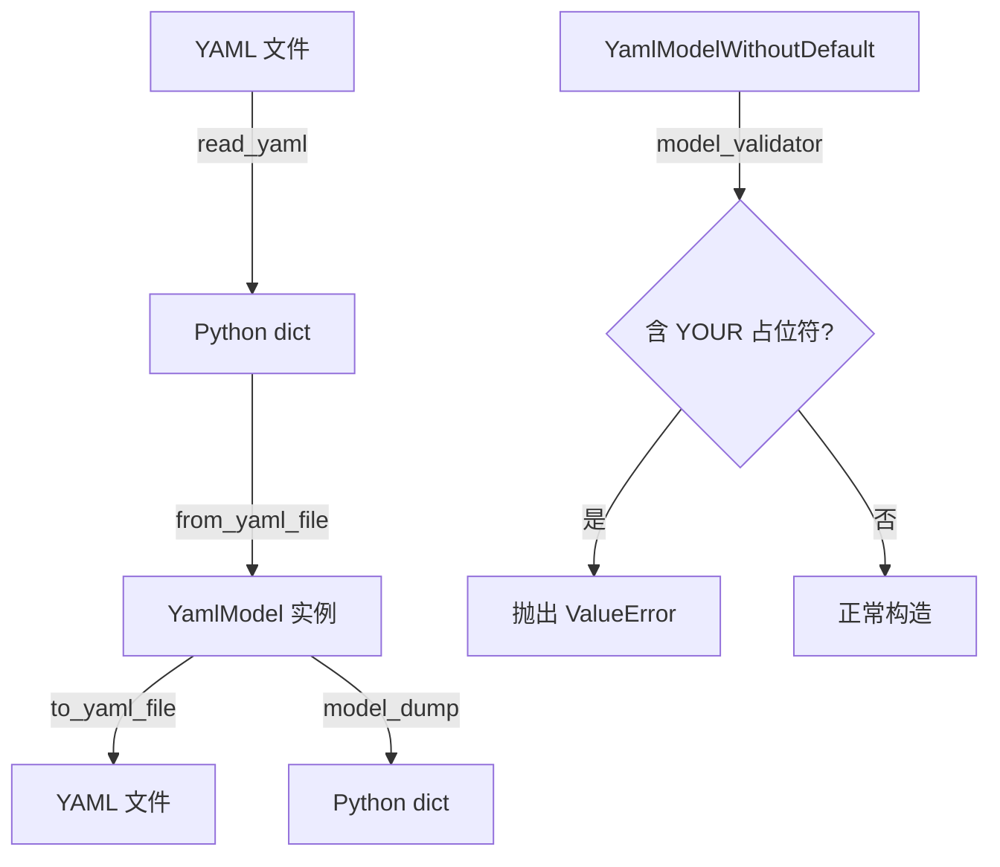
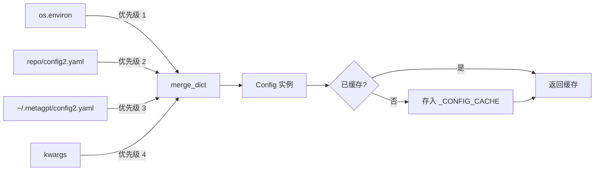
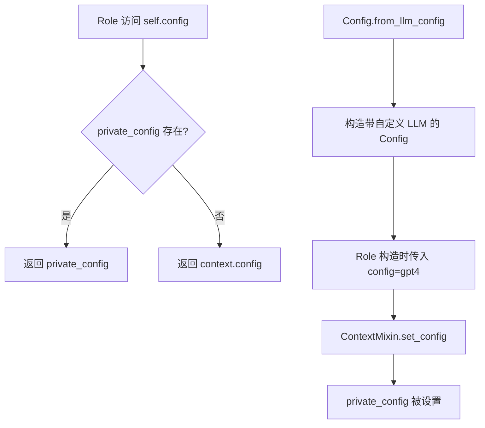

# PD-121.01 MetaGPT — Pydantic + YAML 分层配置与按角色定制

> 文档编号：PD-121.01
> 来源：MetaGPT `metagpt/config2.py`, `metagpt/configs/llm_config.py`, `metagpt/utils/yaml_model.py`
> GitHub：https://github.com/FoundationAgents/MetaGPT.git
> 问题域：PD-121 配置管理 Configuration Management
> 状态：可复用方案

---

## 第 1 章 问题与动机

### 1.1 核心问题

多 Agent 系统的配置管理面临三重挑战：

1. **多源覆盖**：环境变量、YAML 文件、CLI 参数需要按优先级合并，开发/测试/生产环境各有不同配置源
2. **模块爆炸**：一个 Agent 框架涉及 LLM、Embedding、Search、Browser、Redis、S3、Mermaid 等 10+ 子系统，每个子系统有独立的配置结构
3. **角色级定制**：不同 Agent 角色（Architect、Engineer、QA）可能需要不同的 LLM 模型和参数，全局配置无法满足精细化需求

传统做法是用一个巨大的 dict 或 dataclass 管理所有配置，缺乏类型校验、无法按模块拆分、不支持运行时覆盖。MetaGPT 用 Pydantic BaseModel 继承链 + YAML 序列化 + 模块缓存解决了这些问题。

### 1.2 MetaGPT 的解法概述

1. **YamlModel 基类**：`metagpt/utils/yaml_model.py:15` — 所有配置类继承自 `YamlModel(BaseModel)`，自带 `read_yaml` / `from_yaml_file` / `to_yaml_file` 三件套
2. **三级覆盖合并**：`metagpt/config2.py:110-123` — `Config.default()` 按 `env < repo_config < home_config < kwargs` 优先级合并
3. **15+ 独立配置模块**：每个子系统（LLMConfig、SearchConfig、BrowserConfig 等）是独立的 Pydantic 模型，通过组合嵌入 Config 主类
4. **角色级 LLM 定制**：`metagpt/configs/role_custom_config.py:12` — `RoleCustomConfig` 允许按角色类名指定不同 LLM 配置
5. **全局缓存**：`metagpt/config2.py:181` — `_CONFIG_CACHE` 字典避免重复加载和解析

### 1.3 设计思想

| 设计原则 | 具体实现 | 理由 | 替代方案 |
|----------|----------|------|----------|
| 组合优于继承 | Config 组合 15+ 独立 XxxConfig 模块 | 每个模块可独立演进、独立测试 | 单一巨型 Config 类 |
| 类型安全 | 所有配置字段有 Pydantic 类型注解 + validator | 启动时即发现配置错误，不等到运行时 | dict + 手动校验 |
| 约定优于配置 | 所有模块有合理默认值，只需覆盖差异项 | 零配置即可启动，降低上手门槛 | 强制填写所有字段 |
| 缓存避免重复 | `_CONFIG_CACHE` 以路径元组为 key 缓存实例 | 多处 `Config.default()` 调用不重复解析 YAML | 每次调用重新加载 |
| 私有覆盖公共 | ContextMixin 的 `private_config > context.config` | 角色/Action 可覆盖全局配置而不影响其他组件 | 全局单例无法覆盖 |

---

## 第 2 章 源码实现分析

### 2.1 架构概览

MetaGPT 的配置系统由四层组成：

```
┌─────────────────────────────────────────────────────────┐
│                    ContextMixin                          │
│  private_config > context.config（角色级覆盖）            │
├─────────────────────────────────────────────────────────┤
│                    Config (主配置类)                      │
│  ┌──────────┬──────────┬──────────┬──────────┐          │
│  │LLMConfig │SearchCfg │BrowserCfg│ RedisCfg │ ...×15   │
│  └──────────┴──────────┴──────────┴──────────┘          │
├─────────────────────────────────────────────────────────┤
│                    YamlModel (基类)                       │
│  read_yaml / from_yaml_file / to_yaml_file              │
├─────────────────────────────────────────────────────────┤
│              Pydantic BaseModel + YAML                   │
└─────────────────────────────────────────────────────────┘

数据流：
  env vars ──┐
  repo YAML ─┼─→ merge_dict() ──→ Config(**final) ──→ _CONFIG_CACHE
  home YAML ─┤                                            ↓
  kwargs ────┘                              Context.config (共享)
                                                          ↓
                                            ContextMixin.config (可覆盖)
                                                          ↓
                                            Role / Action 消费配置
```

### 2.2 核心实现

#### 2.2.1 YamlModel 基类 — Pydantic 与 YAML 的桥梁



对应源码 `metagpt/utils/yaml_model.py:15-48`：

```python
class YamlModel(BaseModel):
    """Base class for yaml model"""
    extra_fields: Optional[Dict[str, str]] = None

    @classmethod
    def read_yaml(cls, file_path: Path, encoding: str = "utf-8") -> Dict:
        if not file_path.exists():
            return {}
        with open(file_path, "r", encoding=encoding) as file:
            return yaml.safe_load(file)

    @classmethod
    def from_yaml_file(cls, file_path: Path) -> "YamlModel":
        return cls(**cls.read_yaml(file_path))

    def to_yaml_file(self, file_path: Path, encoding: str = "utf-8") -> None:
        with open(file_path, "w", encoding=encoding) as file:
            yaml.dump(self.model_dump(), file)

class YamlModelWithoutDefault(YamlModel):
    @model_validator(mode="before")
    @classmethod
    def check_not_default_config(cls, values):
        if any(["YOUR" in v for v in values]):
            raise ValueError("Please set your config in config2.yaml")
        return values
```

关键设计：`YamlModelWithoutDefault` 用于 Redis/S3 等敏感配置，强制用户填写真实值，防止带着占位符启动。

#### 2.2.2 Config.default() — 三级覆盖合并



对应源码 `metagpt/config2.py:109-123`：

```python
@classmethod
def default(cls, reload: bool = False, **kwargs) -> "Config":
    """Load default config
    - Priority: env < default_config_paths
    - Inside default_config_paths, the latter one overwrites the former one
    """
    default_config_paths = (
        METAGPT_ROOT / "config/config2.yaml",
        CONFIG_ROOT / "config2.yaml",
    )
    if reload or default_config_paths not in _CONFIG_CACHE:
        dicts = [dict(os.environ), *(Config.read_yaml(path) for path in default_config_paths), kwargs]
        final = merge_dict(dicts)
        _CONFIG_CACHE[default_config_paths] = Config(**final)
    return _CONFIG_CACHE[default_config_paths]
```

`merge_dict` (`config2.py:173-178`) 实现简洁的后者覆盖前者策略：

```python
def merge_dict(dicts: Iterable[Dict]) -> Dict:
    result = {}
    for dictionary in dicts:
        result.update(dictionary)
    return result
```

#### 2.2.3 ContextMixin — 角色级配置覆盖



对应源码 `metagpt/context_mixin.py:17-101`：

```python
class ContextMixin(BaseModel):
    private_context: Optional[Context] = Field(default=None, exclude=True)
    private_config: Optional[Config] = Field(default=None, exclude=True)
    private_llm: Optional[BaseLLM] = Field(default=None, exclude=True)

    @property
    def config(self) -> Config:
        """Role config: role config > context config"""
        if self.private_config:
            return self.private_config
        return self.context.config

    def set_config(self, config: Config, override=False):
        self.set("private_config", config, override)
        if config is not None:
            _ = self.llm  # init llm
```

使用示例（`config2.py:126-137`）：

```python
@classmethod
def from_llm_config(cls, llm_config: dict):
    """user config llm
    example:
    llm_config = {"api_type": "xxx", "api_key": "xxx", "model": "xxx"}
    gpt4 = Config.from_llm_config(llm_config)
    A = Role(name="A", profile="Democratic candidate",
             goal="Win the election", actions=[a1], watch=[a2], config=gpt4)
    """
    llm_config = LLMConfig.model_validate(llm_config)
    dicts = [dict(os.environ)]
    dicts += [{"llm": llm_config}]
    final = merge_dict(dicts)
    return Config(**final)
```

### 2.3 实现细节

**模块化配置组合**：Config 类通过 Pydantic 字段组合 15+ 独立配置模块（`config2.py:49-99`）：

| 模块 | 类 | 文件 | 用途 |
|------|----|------|------|
| LLM | `LLMConfig` | `configs/llm_config.py:52` | 27 种 LLM 提供商 + 推理参数 |
| Embedding | `EmbeddingConfig` | `configs/embedding_config.py:16` | 向量嵌入配置 |
| Search | `SearchConfig` | `configs/search_config.py:25` | 6 种搜索引擎 |
| Browser | `BrowserConfig` | `configs/browser_config.py:25` | Playwright/Selenium |
| Redis | `RedisConfig` | `configs/redis_config.py:11` | 缓存连接 |
| S3 | `S3Config` | `configs/s3_config.py:11` | 对象存储 |
| Mermaid | `MermaidConfig` | `configs/mermaid_config.py:13` | 图表渲染引擎 |
| Workspace | `WorkspaceConfig` | `configs/workspace_config.py:18` | 工作目录 + UID |
| ExpPool | `ExperiencePoolConfig` | `configs/exp_pool_config.py:13` | 经验池检索 |
| RoleZero | `RoleZeroConfig` | `configs/role_zero_config.py:6` | 长期记忆 |
| OmniParse | `OmniParseConfig` | `configs/omniparse_config.py:4` | 文档解析 |
| Compress | `CompressType` | `configs/compress_msg_config.py:4` | 消息压缩策略 |
| RoleCustom | `RoleCustomConfig` | `configs/role_custom_config.py:12` | 按角色定制 LLM |

**LLMConfig 的 27 种提供商枚举**（`configs/llm_config.py:19-49`）：通过 `LLMType` 枚举统一管理 OpenAI、Anthropic、Gemini、Ollama、Bedrock、DashScope 等，`__missing__` 方法默认回退到 OPENAI。

**API Key 校验**（`configs/llm_config.py:116-131`）：`@field_validator("api_key")` 在构造时即检查 key 是否为占位符，并给出精确的配置文件路径提示。

**WorkspaceConfig 的自动 UID**（`configs/workspace_config.py:31-38`）：`@model_validator(mode="after")` 在 `use_uid=True` 时自动生成时间戳+随机后缀的唯一工作目录，并自动创建。


---

## 第 3 章 迁移指南

### 3.1 迁移清单

**阶段 1：基础层（YamlModel）**
- [ ] 创建 `YamlModel` 基类，继承 Pydantic `BaseModel`，添加 `read_yaml` / `from_yaml_file` / `to_yaml_file`
- [ ] 创建 `YamlModelWithoutDefault` 子类，添加占位符检测 validator

**阶段 2：模块化配置**
- [ ] 为每个子系统创建独立的 `XxxConfig(YamlModel)` 类
- [ ] 在主 `Config` 类中通过 Pydantic 字段组合所有子配置
- [ ] 为每个字段设置合理默认值（约定优于配置）

**阶段 3：多源合并**
- [ ] 实现 `merge_dict` 函数（后者覆盖前者）
- [ ] 实现 `Config.default()` 工厂方法，按优先级合并 env → repo YAML → home YAML → kwargs
- [ ] 添加 `_CONFIG_CACHE` 全局缓存

**阶段 4：角色级覆盖**
- [ ] 实现 `ContextMixin`，提供 `private_config` 覆盖机制
- [ ] 实现 `Config.from_llm_config()` 工厂方法
- [ ] 实现 `RoleCustomConfig`，支持按角色类名指定 LLM

### 3.2 适配代码模板

以下是一个可直接复用的分层配置系统骨架：

```python
"""可复用的分层配置系统模板 — 基于 MetaGPT 模式"""
import os
from pathlib import Path
from typing import Dict, Iterable, Optional
import yaml
from pydantic import BaseModel, Field, model_validator

# ---- 第 1 层：YamlModel 基类 ----

class YamlModel(BaseModel):
    @classmethod
    def read_yaml(cls, file_path: Path) -> Dict:
        if not file_path.exists():
            return {}
        with open(file_path, "r", encoding="utf-8") as f:
            return yaml.safe_load(f) or {}

    @classmethod
    def from_yaml_file(cls, file_path: Path) -> "YamlModel":
        return cls(**cls.read_yaml(file_path))

    def to_yaml_file(self, file_path: Path) -> None:
        with open(file_path, "w", encoding="utf-8") as f:
            yaml.dump(self.model_dump(), f, default_flow_style=False)

# ---- 第 2 层：模块化子配置 ----

class LLMConfig(YamlModel):
    api_type: str = "openai"
    api_key: str = ""
    model: str = "gpt-4"
    temperature: float = 0.0
    max_tokens: int = 4096
    timeout: int = 600

class SearchConfig(YamlModel):
    engine: str = "duckduckgo"
    api_key: str = ""

class StorageConfig(YamlModel):
    backend: str = "local"  # local / s3 / redis
    path: str = "./data"

# ---- 第 3 层：主配置 + 多源合并 ----

def merge_dicts(dicts: Iterable[Dict]) -> Dict:
    result = {}
    for d in dicts:
        result.update(d)
    return result

_CONFIG_CACHE: Dict = {}

class AppConfig(YamlModel):
    llm: LLMConfig = Field(default_factory=LLMConfig)
    search: SearchConfig = Field(default_factory=SearchConfig)
    storage: StorageConfig = Field(default_factory=StorageConfig)
    language: str = "English"

    @classmethod
    def default(cls, reload: bool = False, **kwargs) -> "AppConfig":
        config_paths = (
            Path("config/default.yaml"),
            Path.home() / ".myapp" / "config.yaml",
        )
        cache_key = config_paths
        if reload or cache_key not in _CONFIG_CACHE:
            sources = [dict(os.environ)]
            sources += [cls.read_yaml(p) for p in config_paths]
            sources.append(kwargs)
            _CONFIG_CACHE[cache_key] = cls(**merge_dicts(sources))
        return _CONFIG_CACHE[cache_key]

    @classmethod
    def from_llm_config(cls, llm_config: dict) -> "AppConfig":
        """为特定角色创建带自定义 LLM 的配置"""
        validated = LLMConfig.model_validate(llm_config)
        sources = [dict(os.environ), {"llm": validated}]
        return cls(**merge_dicts(sources))

# ---- 第 4 层：角色级覆盖 Mixin ----

class ConfigMixin(BaseModel):
    _private_config: Optional[AppConfig] = None
    _shared_config: Optional[AppConfig] = None

    @property
    def config(self) -> AppConfig:
        if self._private_config:
            return self._private_config
        if self._shared_config:
            return self._shared_config
        return AppConfig.default()

    def set_config(self, config: AppConfig):
        self._private_config = config
```

### 3.3 适用场景

| 场景 | 适用度 | 说明 |
|------|--------|------|
| 多 Agent 框架 | ⭐⭐⭐ | 每个角色需要不同 LLM/工具配置，角色级覆盖是刚需 |
| 单 Agent + 多工具 | ⭐⭐⭐ | 模块化配置让每个工具独立管理自己的参数 |
| CLI 工具 | ⭐⭐ | 三级覆盖（env → file → CLI）是 CLI 工具的标准模式 |
| 微服务配置 | ⭐⭐ | 可用但缺少热更新和配置中心集成 |
| 简单脚本 | ⭐ | 过度设计，直接用 env 或 argparse 即可 |

---

## 第 4 章 测试用例

```python
"""基于 MetaGPT 配置系统真实接口的测试用例"""
import os
import tempfile
from pathlib import Path
import pytest
import yaml

# 假设已按 3.2 模板实现了配置系统
from config import YamlModel, LLMConfig, AppConfig, merge_dicts, ConfigMixin


class TestYamlModel:
    def test_read_yaml_existing_file(self, tmp_path):
        """正常路径：读取存在的 YAML 文件"""
        config_file = tmp_path / "test.yaml"
        config_file.write_text("api_key: sk-test\nmodel: gpt-4\n")
        result = YamlModel.read_yaml(config_file)
        assert result == {"api_key": "sk-test", "model": "gpt-4"}

    def test_read_yaml_missing_file(self, tmp_path):
        """边界情况：文件不存在返回空 dict"""
        result = YamlModel.read_yaml(tmp_path / "nonexistent.yaml")
        assert result == {}

    def test_roundtrip_yaml(self, tmp_path):
        """正常路径：YAML 序列化/反序列化往返"""
        config = LLMConfig(api_key="sk-test", model="gpt-4", temperature=0.5)
        file_path = tmp_path / "llm.yaml"
        config.to_yaml_file(file_path)
        loaded = LLMConfig.from_yaml_file(file_path)
        assert loaded.api_key == "sk-test"
        assert loaded.temperature == 0.5


class TestMergeDict:
    def test_later_overwrites_earlier(self):
        """核心行为：后者覆盖前者"""
        result = merge_dicts([{"a": 1}, {"a": 2, "b": 3}])
        assert result == {"a": 2, "b": 3}

    def test_empty_dicts(self):
        """边界情况：空 dict 列表"""
        assert merge_dicts([]) == {}
        assert merge_dicts([{}, {}]) == {}


class TestAppConfig:
    def test_default_values(self):
        """正常路径：默认配置有合理值"""
        config = AppConfig()
        assert config.llm.api_type == "openai"
        assert config.llm.temperature == 0.0
        assert config.language == "English"

    def test_from_llm_config(self):
        """正常路径：从 LLM 配置创建角色专属 Config"""
        config = AppConfig.from_llm_config({
            "api_type": "anthropic",
            "api_key": "sk-ant-test",
            "model": "claude-3"
        })
        assert config.llm.api_type == "anthropic"
        assert config.llm.model == "claude-3"

    def test_cache_returns_same_instance(self):
        """缓存行为：多次调用返回同一实例"""
        c1 = AppConfig.default()
        c2 = AppConfig.default()
        assert c1 is c2

    def test_reload_bypasses_cache(self):
        """降级行为：reload=True 强制重新加载"""
        c1 = AppConfig.default()
        c2 = AppConfig.default(reload=True)
        assert c1 is not c2


class TestConfigMixin:
    def test_private_config_overrides_shared(self):
        """核心行为：私有配置覆盖共享配置"""
        mixin = ConfigMixin()
        custom = AppConfig(language="Chinese")
        mixin.set_config(custom)
        assert mixin.config.language == "Chinese"

    def test_fallback_to_default(self):
        """降级行为：无私有配置时回退到默认"""
        mixin = ConfigMixin()
        assert mixin.config.llm.api_type == "openai"
```


---

## 第 5 章 跨域关联

| 关联域 | 关系类型 | 说明 |
|--------|----------|------|
| PD-01 上下文管理 | 协同 | `LLMConfig.compress_type` 和 `context_length` 直接控制上下文压缩策略 |
| PD-02 多 Agent 编排 | 依赖 | `RoleCustomConfig` 让不同角色使用不同 LLM，编排层依赖配置系统分发角色配置 |
| PD-03 容错与重试 | 协同 | `LLMConfig.timeout` 和 `Config.repair_llm_output` 控制超时和输出修复行为 |
| PD-04 工具系统 | 依赖 | SearchConfig、BrowserConfig、MermaidConfig 等工具配置全部由 Config 统一管理 |
| PD-06 记忆持久化 | 协同 | `RoleZeroConfig` 管理长期记忆路径和检索参数，`ExperiencePoolConfig` 管理经验池 |
| PD-08 搜索与检索 | 依赖 | `SearchConfig` 定义搜索引擎类型和 API Key，搜索模块从 Config 读取 |
| PD-11 可观测性 | 协同 | `LLMConfig.calc_usage` 控制是否计算 token 用量，Context 中的 CostManager 依赖此配置 |

---

## 第 6 章 来源文件索引

| 文件 | 行范围 | 关键实现 |
|------|--------|----------|
| `metagpt/utils/yaml_model.py` | L15-L48 | YamlModel 基类 + YamlModelWithoutDefault 占位符校验 |
| `metagpt/config2.py` | L49-L99 | Config 主类，组合 15+ 子配置模块 |
| `metagpt/config2.py` | L109-L123 | Config.default() 三级覆盖合并 + 缓存 |
| `metagpt/config2.py` | L125-L137 | Config.from_llm_config() 角色级 LLM 配置工厂 |
| `metagpt/config2.py` | L173-L181 | merge_dict() + _CONFIG_CACHE 全局缓存 |
| `metagpt/configs/llm_config.py` | L19-L49 | LLMType 枚举（27 种提供商） |
| `metagpt/configs/llm_config.py` | L52-L137 | LLMConfig 完整定义 + API Key 校验 |
| `metagpt/configs/role_custom_config.py` | L12-L19 | RoleCustomConfig 按角色定制 LLM |
| `metagpt/configs/search_config.py` | L16-L41 | SearchConfig + 6 种搜索引擎枚举 |
| `metagpt/configs/workspace_config.py` | L18-L38 | WorkspaceConfig + 自动 UID 生成 |
| `metagpt/configs/exp_pool_config.py` | L13-L26 | ExperiencePoolConfig 经验池配置 |
| `metagpt/configs/role_zero_config.py` | L6-L11 | RoleZeroConfig 长期记忆配置 |
| `metagpt/context_mixin.py` | L17-L101 | ContextMixin 角色级配置覆盖机制 |
| `metagpt/context.py` | L58-L100 | Context 共享配置 + LLM 实例化 |
| `metagpt/const.py` | L38-L41 | CONFIG_ROOT / METAGPT_ROOT 路径常量 |

---

## 第 7 章 横向对比维度

```json comparison_data
{
  "project": "MetaGPT",
  "dimensions": {
    "配置基类": "YamlModel(BaseModel) 统一 YAML 读写 + Pydantic 校验",
    "覆盖策略": "env < repo YAML < home YAML < kwargs 四级 merge_dict",
    "模块化程度": "15+ 独立 XxxConfig 类，每个子系统独立 Pydantic 模型",
    "角色级定制": "RoleCustomConfig + ContextMixin.private_config 双层覆盖",
    "缓存机制": "_CONFIG_CACHE 以路径元组为 key，支持 reload 强制刷新",
    "类型安全": "Pydantic field_validator + model_validator 启动时校验",
    "提供商覆盖": "LLMType 枚举 27 种提供商，__missing__ 默认回退 OPENAI"
  }
}
```

### 域元数据补充

```json domain_metadata
{
  "solution_summary": "MetaGPT 用 YamlModel(Pydantic) 基类统一 15+ 子配置模块，Config.default() 四级合并 + _CONFIG_CACHE 缓存，ContextMixin 实现角色级 private_config 覆盖",
  "description": "多 Agent 框架中按角色粒度定制配置的组合式架构",
  "sub_problems": [
    "按角色/Agent 粒度定制 LLM 配置",
    "配置缓存与强制刷新",
    "敏感配置占位符检测"
  ],
  "best_practices": [
    "ContextMixin 私有配置覆盖共享配置实现角色级定制",
    "YamlModelWithoutDefault 强制校验敏感配置非占位符",
    "_CONFIG_CACHE 以路径元组为 key 避免重复加载"
  ]
}
```

