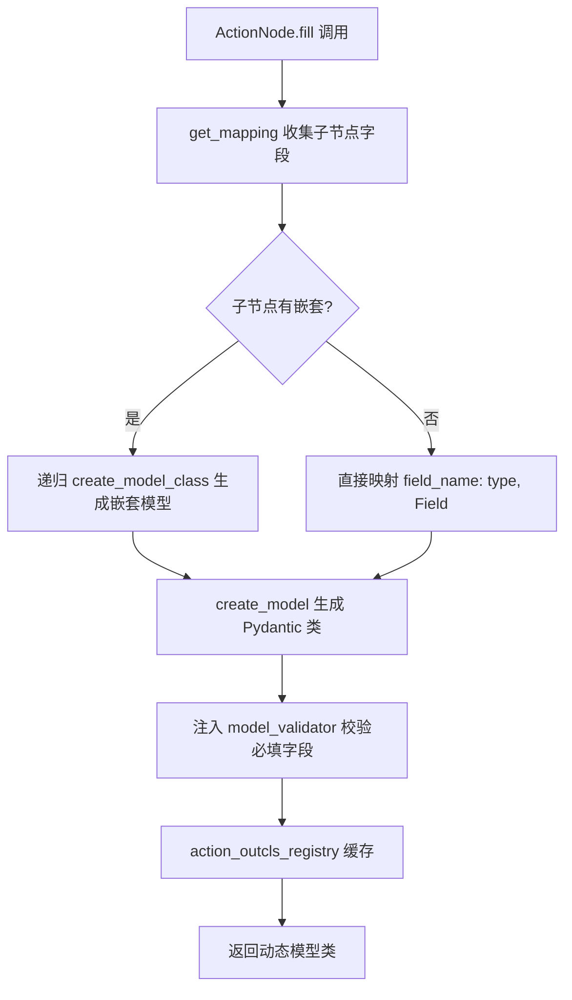
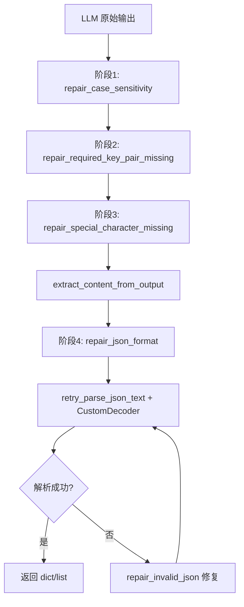

# PD-122.01 MetaGPT — ActionNode 树形结构化输出系统

> 文档编号：PD-122.01
> 来源：MetaGPT `metagpt/actions/action_node.py`
> GitHub：https://github.com/FoundationAgents/MetaGPT.git
> 问题域：PD-122 LLM 输出结构化 LLM Output Structuring
> 状态：可复用方案

---

## 第 1 章 问题与动机

### 1.1 核心问题

LLM 的输出本质上是自由文本流，但 Agent 系统需要将其转化为可编程操作的结构化数据。这个问题在多 Agent 协作场景中尤为严重：上游 Agent 的输出是下游 Agent 的输入，任何格式偏差都会导致整条流水线崩溃。

核心挑战包括：
- **类型安全**：LLM 输出的 JSON 字段类型可能与预期不符（字符串 vs 列表）
- **格式漂移**：不同 LLM（尤其是开源模型）对格式指令的遵循程度差异巨大
- **嵌套结构**：复杂业务场景需要多层嵌套的结构化输出
- **容错解析**：即使格式有误，也要尽可能提取有效信息而非直接报错

### 1.2 MetaGPT 的解法概述

MetaGPT 设计了一套以 ActionNode 为核心的树形结构化输出系统，关键要点：

1. **动态 Pydantic 模型生成**：通过 `create_model` 从 ActionNode 树结构动态生成 Pydantic v2 模型类，实现运行时类型约束（`action_node.py:248-282`）
2. **CONTENT 标签包裹协议**：用 `[CONTENT]...[/CONTENT]` 标签对包裹 LLM 输出，提供明确的提取边界（`action_node.py:43,53`）
3. **多模式填充策略**：支持 JSON/Markdown/XML/Code/Raw 五种填充模式，适配不同场景（`action_node.py:46-49,597-663`）
4. **四阶段后处理修复管道**：大小写修复 → 标签对补全 → 特殊字符修复 → JSON 格式修复，逐层容错（`base_postprocess_plugin.py:18-34`）
5. **双层重试机制**：外层 `_aask_v1` 重试 6 次 + 内层 `retry_parse_json_text` 重试 3 次，每次重试间自动修复（`action_node.py:423-427`, `repair_llm_raw_output.py:287-306`）

### 1.3 设计思想

| 设计原则 | 具体实现 | 理由 | 替代方案 |
|----------|----------|------|----------|
| 声明式约束 | ActionNode 树定义 key/type/instruction/example | 将输出结构从代码逻辑中解耦，可组合可复用 | 硬编码 prompt 模板 |
| 运行时类型生成 | `pydantic.create_model` 动态创建模型类 | 避免为每个 Action 手写 Pydantic 类，减少样板代码 | 静态 Pydantic 模型 |
| 渐进式修复 | 4 阶段修复管道，每阶段独立可插拔 | 不同 LLM 的错误模式不同，分层处理覆盖面更广 | 单一正则修复 |
| 标签边界协议 | `[CONTENT][/CONTENT]` 包裹 | 比 markdown 代码块更可靠，LLM 不易混淆 | ````json` 代码块 |
| 模型类缓存 | `action_outcls_registry` 装饰器缓存已创建的模型类 | 相同结构不重复创建，保证类型一致性 | 每次重新创建 |

---

## 第 2 章 源码实现分析

### 2.1 架构概览

MetaGPT 的 LLM 输出结构化系统由四个核心模块组成：

```
┌─────────────────────────────────────────────────────────────────┐
│                        ActionNode 树                            │
│  ┌──────────┐  ┌──────────┐  ┌──────────┐                     │
│  │ key: str  │  │ key: str  │  │ key: str  │  ← 子节点定义      │
│  │ type: Type│  │ type: Type│  │ type: Type│    字段名/类型/指令 │
│  │ instr: str│  │ instr: str│  │ instr: str│                    │
│  └──────────┘  └──────────┘  └──────────┘                     │
│         │              │             │                          │
│         └──────────────┼─────────────┘                          │
│                        ▼                                        │
│              create_model_class()                                │
│              动态生成 Pydantic 模型                               │
└────────────────────────┬────────────────────────────────────────┘
                         │
                    fill() 调用
                         │
                         ▼
┌────────────────────────────────────────────────────────────────┐
│                    compile() 编译 Prompt                        │
│  context + example(JSON/MD) + instruction + constraint         │
│  → 包含 [CONTENT] 标签的完整 prompt                             │
└────────────────────────┬───────────────────────────────────────┘
                         │
                    LLM aask()
                         │
                         ▼
┌────────────────────────────────────────────────────────────────┐
│              llm_output_postprocess 后处理管道                   │
│  ┌──────────┐  ┌──────────┐  ┌──────────┐  ┌──────────┐      │
│  │ 大小写   │→│ 标签对   │→│ 特殊字符 │→│ JSON     │      │
│  │ 修复     │  │ 补全     │  │ 修复     │  │ 格式修复 │      │
│  └──────────┘  └──────────┘  └──────────┘  └──────────┘      │
│                        │                                       │
│                        ▼                                       │
│              retry_parse_json_text (CustomDecoder)              │
│              宽松 JSON 解析 + 重试修复                           │
└────────────────────────┬───────────────────────────────────────┘
                         │
                         ▼
              Pydantic 模型实例化 & 校验
```

### 2.2 核心实现

#### 2.2.1 动态 Pydantic 模型生成

ActionNode 的核心能力是将树形节点结构转化为 Pydantic 模型类。每个子节点定义一个字段的 key、type、instruction 和 example。



对应源码 `metagpt/actions/action_node.py:246-282`：

```python
@classmethod
@register_action_outcls
def create_model_class(cls, class_name: str, mapping: Dict[str, Tuple[Type, Any]]):
    """基于pydantic v2的模型动态生成，用来检验结果类型正确性"""

    def check_fields(cls, values):
        all_fields = set(mapping.keys())
        required_fields = set()
        for k, v in mapping.items():
            type_v, field_info = v
            if ActionNode.is_optional_type(type_v):
                continue
            required_fields.add(k)

        missing_fields = required_fields - set(values.keys())
        if missing_fields:
            raise ValueError(f"Missing fields: {missing_fields}")

        unrecognized_fields = set(values.keys()) - all_fields
        if unrecognized_fields:
            logger.warning(f"Unrecognized fields: {unrecognized_fields}")
        return values

    validators = {"check_missing_fields_validator": model_validator(mode="before")(check_fields)}

    new_fields = {}
    for field_name, field_value in mapping.items():
        if isinstance(field_value, dict):
            nested_class_name = f"{class_name}_{field_name}"
            nested_class = cls.create_model_class(nested_class_name, field_value)
            new_fields[field_name] = (nested_class, ...)
        else:
            new_fields[field_name] = field_value

    new_class = create_model(class_name, __validators__=validators, **new_fields)
    return new_class
```

关键设计点：
- `@register_action_outcls` 装饰器（`action_outcls_registry.py:11-42`）通过序列化参数生成 `outcls_id`，缓存已创建的模型类，避免重复创建导致类型比较失败
- `model_validator(mode="before")` 在 Pydantic 解析前校验必填字段，区分 Optional 和 Required
- 嵌套结构递归处理：当 `field_value` 是 dict 时，递归调用 `create_model_class` 生成子模型

#### 2.2.2 四阶段后处理修复管道

LLM 输出经常包含格式错误，MetaGPT 设计了一条四阶段修复管道来逐步修正。



对应源码 `metagpt/provider/postprocess/base_postprocess_plugin.py:18-34`：

```python
def run_repair_llm_output(self, output: str, schema: dict, req_key: str = "[/CONTENT]") -> Union[dict, list]:
    """
    repair steps
        1. repair the case sensitive problem using the schema's fields
        2. extract the content from the req_key pair( xx[REQ_KEY]xxx[/REQ_KEY]xx )
        3. repair the invalid json text in the content
        4. parse the json text and repair it according to the exception with retry loop
    """
    output_class_fields = list(schema["properties"].keys())

    content = self.run_repair_llm_raw_output(output, req_keys=output_class_fields + [req_key])
    content = self.run_extract_content_from_output(content, right_key=req_key)
    content = self.run_repair_llm_raw_output(content, req_keys=[None], repair_type=RepairType.JSON)
    parsed_data = self.run_retry_parse_json_text(content)

    return parsed_data
```

各阶段的具体修复逻辑（`repair_llm_raw_output.py`）：

- **阶段 1 — 大小写修复**（`repair_llm_raw_output.py:24-41`）：LLM 可能将 `"Original Requirements"` 输出为 `"Original requirements"`，通过 `lower()` 比较定位并替换
- **阶段 2 — 标签对补全**（`repair_llm_raw_output.py:67-105`）：检测 `[CONTENT]` 是否缺少配对的 `[/CONTENT]`，自动在尾部补全
- **阶段 3 — 特殊字符修复**（`repair_llm_raw_output.py:44-64`）：处理 `[CONTENT]xx[CONTENT]` 缺少 `/` 的情况，在最后一个出现位置补上
- **阶段 4 — JSON 格式修复**（`repair_llm_raw_output.py:108-140`）：修复多余的 `[{`、`}]`、行内注释等常见 JSON 格式问题

### 2.3 实现细节

#### CustomDecoder 宽松 JSON 解析

MetaGPT 实现了自定义的 `CustomDecoder`（`metagpt/utils/custom_decoder.py:273-297`），继承 `json.JSONDecoder` 并重写了 `parse_object`、`parse_string` 和 `scan_once`。核心能力是支持单引号字符串和三引号字符串（`'''` 和 `"""`），这是标准 JSON 解析器不支持但 LLM 经常输出的格式。

#### 双层重试机制

外层重试在 `_aask_v1`（`action_node.py:423-427`）：
```python
@retry(
    wait=wait_random_exponential(min=1, max=20),
    stop=stop_after_attempt(6),
    after=general_after_log(logger),
)
async def _aask_v1(self, prompt, output_class_name, output_data_mapping, ...):
```

内层重试在 `retry_parse_json_text`（`repair_llm_raw_output.py:287-306`）：
```python
@retry(
    stop=repair_stop_after_attempt,  # 3 次（repair 开启时）
    wait=wait_fixed(1),
    after=run_after_exp_and_passon_next_retry(logger),  # 每次重试前自动修复
)
def retry_parse_json_text(output: str) -> Union[list, dict]:
    parsed_data = CustomDecoder(strict=False).decode(output)
    return parsed_data
```

`run_after_exp_and_passon_next_retry`（`repair_llm_raw_output.py:245-280`）是关键：它在每次重试前捕获异常信息，调用 `repair_invalid_json` 根据错误行号和列号精确修复 JSON，然后通过 `retry_state.kwargs["output"]` 将修复后的内容传递给下一次重试。

#### 多模式填充（FillMode）

`fill()` 方法（`action_node.py:597-663`）支持五种模式：
- `json`/`markdown`：通过 `simple_fill` → `compile` → `_aask_v1` 完整管道
- `code_fill`：用 `sanitize()` 提取代码块，基于 tree-sitter 做 AST 级别的代码清洗（`sanitize.py:124-183`）
- `xml_fill`：用 XML 标签 `<field>content</field>` 包裹，正则提取并类型转换（`action_node.py:553-594`）
- `single_fill`：直接返回 LLM 原始输出，不做结构化解析

---

## 第 3 章 迁移指南

### 3.1 迁移清单

**阶段 1：核心结构化能力（必须）**

- [ ] 实现 `StructuredNode` 类，支持 key/type/instruction/example 四元组定义
- [ ] 实现 `create_model_class` 方法，基于 `pydantic.create_model` 动态生成模型
- [ ] 实现 `[CONTENT][/CONTENT]` 标签包裹的 prompt 编译
- [ ] 实现 `extract_content_from_output` 正则提取

**阶段 2：容错修复管道（推荐）**

- [ ] 实现大小写修复（case sensitivity repair）
- [ ] 实现标签对补全（required key pair missing repair）
- [ ] 实现 JSON 格式修复（去注释、修复多余括号）
- [ ] 实现 CustomDecoder 支持单引号 JSON

**阶段 3：高级特性（可选）**

- [ ] 实现模型类缓存注册表（避免重复创建）
- [ ] 实现 XML 填充模式
- [ ] 实现 Review/Revise 自动校正循环
- [ ] 实现 code_fill 模式（tree-sitter AST 清洗）

### 3.2 适配代码模板

以下是一个可直接运行的最小化实现，提取了 MetaGPT ActionNode 的核心结构化能力：

```python
"""
Minimal structured output system inspired by MetaGPT ActionNode.
Requires: pydantic>=2.0, tenacity
"""
import json
import re
import copy
from typing import Any, Dict, List, Optional, Tuple, Type, Union
from pydantic import BaseModel, Field, create_model, model_validator
from tenacity import retry, stop_after_attempt, wait_fixed

TAG = "CONTENT"
FORMAT_CONSTRAINT = f"Format: output wrapped inside [{TAG}][/{TAG}] like format example, nothing else."

# --- 阶段 1: 动态模型生成 ---

def create_structured_model(class_name: str, fields: Dict[str, Tuple[Type, Any]]) -> Type[BaseModel]:
    """从字段映射动态生成 Pydantic 模型类"""
    def check_fields(cls, values):
        required = {k for k, (t, f) in fields.items()
                    if not (hasattr(t, '__origin__') and type(None) in getattr(t, '__args__', ()))}
        missing = required - set(values.keys())
        if missing:
            raise ValueError(f"Missing fields: {missing}")
        return values

    validators = {"check_fields": model_validator(mode="before")(check_fields)}
    return create_model(class_name, __validators__=validators, **fields)


# --- 阶段 2: 标签提取 ---

def extract_content(text: str, tag: str = "CONTENT") -> str:
    """从 [TAG]...[/TAG] 中提取内容"""
    pattern = rf"\[{tag}\]([\s\S]*)\[/{tag}\]"
    match = re.search(pattern, text, re.DOTALL)
    if match:
        return match.group(1).strip()
    return text.strip()


# --- 阶段 3: 修复管道 ---

def repair_case_sensitivity(output: str, req_key: str) -> str:
    if req_key in output:
        return output
    lower_out, lower_key = output.lower(), req_key.lower()
    if lower_key in lower_out:
        idx = lower_out.find(lower_key)
        source = output[idx:idx + len(lower_key)]
        output = output.replace(source, req_key)
    return output

def repair_tag_pair(output: str, req_key: str = "[/CONTENT]") -> str:
    sc = "/"
    if req_key.startswith("[") and req_key.endswith("]"):
        left_key = req_key.replace(sc, "")
        right_key = req_key
        if left_key not in output:
            output = left_key + "\n" + output
        if right_key not in output and (output.strip().endswith("}") or output.strip().endswith("]")):
            output = output + "\n" + right_key
    return output

def repair_json_format(output: str) -> str:
    output = output.strip()
    if output.startswith("[{"):
        output = output[1:]
    elif output.endswith("}]"):
        output = output[:-1]
    # 去除行内注释
    lines = []
    for line in output.split("\n"):
        for m in re.finditer(r'(".*?"|\'.*?\')|(#|//)', line):
            if m.group(2):
                line = line[:m.start(2)].rstrip()
                break
        lines.append(line)
    return "\n".join(lines)


# --- 阶段 4: 解析 + 重试 ---

@retry(stop=stop_after_attempt(3), wait=wait_fixed(1))
def parse_json_with_retry(text: str) -> Union[dict, list]:
    return json.loads(text)


def structured_output_pipeline(
    raw_output: str,
    schema_fields: Dict[str, Tuple[Type, Any]],
    class_name: str = "Output"
) -> BaseModel:
    """完整的结构化输出管道：提取 → 修复 → 解析 → 校验"""
    # Step 1: 修复标签
    output = repair_tag_pair(raw_output)
    # Step 2: 提取内容
    content = extract_content(output)
    # Step 3: 修复 JSON
    content = repair_json_format(content)
    # Step 4: 解析
    parsed = parse_json_with_retry(content)
    # Step 5: Pydantic 校验
    model_cls = create_structured_model(class_name, schema_fields)
    return model_cls(**parsed)


# --- 使用示例 ---
if __name__ == "__main__":
    # 定义输出结构
    fields = {
        "task_name": (str, Field(description="任务名称")),
        "priority": (int, Field(default=1, description="优先级 1-5")),
        "subtasks": (List[str], Field(default=[], description="子任务列表")),
    }

    # 模拟 LLM 输出（带格式问题）
    llm_output = """
    [CONTENT]
    {
        "task_name": "实现用户认证",
        "priority": 3,
        "subtasks": ["设计数据库", "实现 API", "编写测试"]
    }
    [/CONTENT]
    """

    result = structured_output_pipeline(llm_output, fields, "TaskOutput")
    print(result.model_dump())
```

### 3.3 适用场景

| 场景 | 适用度 | 说明 |
|------|--------|------|
| 多 Agent 流水线（上下游数据传递） | ⭐⭐⭐ | ActionNode 树天然适合定义 Agent 间的数据契约 |
| 开源 LLM 适配（格式遵循差） | ⭐⭐⭐ | 四阶段修复管道专为开源模型设计 |
| 复杂嵌套结构输出 | ⭐⭐⭐ | 递归 create_model 支持任意深度嵌套 |
| 代码生成场景 | ⭐⭐ | code_fill + tree-sitter 清洗适合代码提取 |
| 简单单字段输出 | ⭐ | 过度设计，直接用 prompt + regex 更简单 |

---

## 第 4 章 测试用例

```python
"""
Tests for MetaGPT-style structured output system.
Requires: pytest, pydantic>=2.0
"""
import json
import pytest
from typing import List, Optional
from pydantic import Field


class TestCreateStructuredModel:
    """测试动态 Pydantic 模型生成"""

    def test_basic_model_creation(self):
        """正常路径：基本字段映射生成模型"""
        fields = {
            "name": (str, Field(default="test", description="名称")),
            "count": (int, Field(default=0, description="数量")),
        }
        model_cls = create_structured_model("BasicModel", fields)
        instance = model_cls(name="hello", count=42)
        assert instance.name == "hello"
        assert instance.count == 42

    def test_missing_required_field(self):
        """边界情况：缺少必填字段应抛出 ValueError"""
        fields = {
            "name": (str, ...),  # required
            "age": (int, ...),   # required
        }
        model_cls = create_structured_model("StrictModel", fields)
        with pytest.raises(Exception):
            model_cls(name="test")  # missing age

    def test_optional_field(self):
        """边界情况：Optional 字段可以缺省"""
        fields = {
            "name": (str, ...),
            "bio": (Optional[str], Field(default=None)),
        }
        model_cls = create_structured_model("OptModel", fields)
        instance = model_cls(name="test")
        assert instance.bio is None


class TestExtractContent:
    """测试标签提取"""

    def test_normal_extraction(self):
        text = "[CONTENT]\n{\"key\": \"value\"}\n[/CONTENT]"
        result = extract_content(text)
        assert result == '{"key": "value"}'

    def test_no_tags_fallback(self):
        """降级行为：无标签时返回原文"""
        text = '{"key": "value"}'
        result = extract_content(text)
        assert result == '{"key": "value"}'

    def test_nested_content_tags(self):
        """边界情况：嵌套 CONTENT 标签"""
        text = "[CONTENT]\n[CONTENT]\n{\"a\": 1}\n[/CONTENT]\n[/CONTENT]"
        result = extract_content(text)
        assert '"a"' in result


class TestRepairPipeline:
    """测试修复管道"""

    def test_case_sensitivity_repair(self):
        output = '{"original requirements": "test"}'
        fixed = repair_case_sensitivity(output, '"Original Requirements"')
        assert '"Original Requirements"' in fixed

    def test_tag_pair_completion(self):
        output = '[CONTENT]\n{"key": "value"}'
        fixed = repair_tag_pair(output)
        assert "[/CONTENT]" in fixed

    def test_json_comment_removal(self):
        output = '{\n  "key": "value"  # this is a comment\n}'
        fixed = repair_json_format(output)
        assert "#" not in fixed

    def test_full_pipeline(self):
        """集成测试：完整管道"""
        raw = '[content]\n{"name": "test", "count": 5}\n[/content]'
        fields = {
            "name": (str, Field(default="")),
            "count": (int, Field(default=0)),
        }
        # 注意：此测试需要 repair_case_sensitivity 先修复标签大小写
        content = repair_case_sensitivity(raw, "[CONTENT]")
        content = repair_case_sensitivity(content, "[/CONTENT]")
        content = repair_tag_pair(content)
        extracted = extract_content(content)
        parsed = json.loads(extracted)
        model_cls = create_structured_model("TestModel", fields)
        result = model_cls(**parsed)
        assert result.name == "test"
        assert result.count == 5
```

---

## 第 5 章 跨域关联

| 关联域 | 关系类型 | 说明 |
|--------|----------|------|
| PD-03 容错与重试 | 强依赖 | 双层重试机制（`_aask_v1` 6次 + `retry_parse_json_text` 3次）是结构化输出可靠性的核心保障，`run_after_exp_and_passon_next_retry` 在重试间自动修复 JSON |
| PD-04 工具系统 | 协同 | ActionNode 的 `code_fill` 模式通过 `sanitize()` 对 LLM 生成的代码做 AST 级清洗，可视为工具输出的结构化后处理 |
| PD-07 质量检查 | 协同 | ActionNode 内置 `review()` + `revise()` 循环：先用 LLM 自动审查输出是否符合 instruction，再自动修正不合格字段，形成 Generator-Critic 模式 |
| PD-01 上下文管理 | 间接 | `compile()` 方法将 context + example + instruction + constraint 编译为完整 prompt，prompt 长度直接影响上下文窗口占用 |
| PD-10 中间件管道 | 类似 | `BasePostProcessPlugin` 的四阶段修复管道本质上是一个微型中间件链，每个阶段可独立替换或扩展 |

---

## 第 6 章 来源文件索引

| 文件 | 行范围 | 关键实现 |
|------|--------|----------|
| `metagpt/actions/action_node.py` | L135-877 | ActionNode 核心类：树结构、动态模型生成、fill/review/revise 全流程 |
| `metagpt/actions/action_node.py` | L246-282 | `create_model_class`：Pydantic v2 动态模型生成 + 嵌套递归 |
| `metagpt/actions/action_node.py` | L382-421 | `compile`：prompt 编译（context + example + instruction + constraint） |
| `metagpt/actions/action_node.py` | L423-452 | `_aask_v1`：LLM 调用 + 后处理 + 6 次重试 |
| `metagpt/actions/action_node.py` | L553-594 | `xml_fill`：XML 标签模式填充 + 类型转换 |
| `metagpt/actions/action_node.py` | L597-663 | `fill`：五种填充模式入口（json/markdown/code/xml/single） |
| `metagpt/utils/repair_llm_raw_output.py` | L24-41 | `repair_case_sensitivity`：大小写修复 |
| `metagpt/utils/repair_llm_raw_output.py` | L44-64 | `repair_special_character_missing`：特殊字符补全 |
| `metagpt/utils/repair_llm_raw_output.py` | L67-105 | `repair_required_key_pair_missing`：标签对补全 |
| `metagpt/utils/repair_llm_raw_output.py` | L108-140 | `repair_json_format`：JSON 格式修复（去注释、修复括号） |
| `metagpt/utils/repair_llm_raw_output.py` | L184-242 | `repair_invalid_json`：基于错误行号列号的精确 JSON 修复 |
| `metagpt/utils/repair_llm_raw_output.py` | L245-306 | `run_after_exp_and_passon_next_retry` + `retry_parse_json_text`：重试间自动修复 |
| `metagpt/utils/repair_llm_raw_output.py` | L309-339 | `extract_content_from_output`：CONTENT 标签正则提取 |
| `metagpt/provider/postprocess/base_postprocess_plugin.py` | L15-69 | `BasePostProcessPlugin`：四阶段修复管道编排 |
| `metagpt/provider/postprocess/llm_output_postprocess.py` | L10-20 | `llm_output_postprocess`：后处理入口（插件路由） |
| `metagpt/utils/custom_decoder.py` | L273-297 | `CustomDecoder`：宽松 JSON 解析器（支持单引号/三引号） |
| `metagpt/utils/sanitize.py` | L124-183 | `sanitize`：tree-sitter AST 代码清洗 |
| `metagpt/actions/action_outcls_registry.py` | L8-42 | `register_action_outcls`：动态模型类缓存注册表 |
| `metagpt/utils/common.py` | L73-199 | `OutputParser`：Markdown 块解析 + 代码提取 + 类型映射 |

---

## 第 7 章 横向对比维度

```json comparison_data
{
  "project": "MetaGPT",
  "dimensions": {
    "约束方式": "ActionNode 树声明式定义 + [CONTENT] 标签包裹 + Pydantic 动态模型校验",
    "解析策略": "四阶段修复管道 + CustomDecoder 宽松解析（支持单引号/三引号 JSON）",
    "修复能力": "大小写修复 → 标签对补全 → 特殊字符修复 → JSON 格式修复 → 行级精确修复",
    "重试机制": "双层重试：外层 _aask_v1 指数退避 6 次 + 内层 parse 固定间隔 3 次，重试间自动修复",
    "多模式支持": "五种填充模式：JSON / Markdown / XML / Code(tree-sitter) / Single",
    "类型系统": "运行时 create_model 动态生成 Pydantic v2 模型，支持嵌套递归 + Optional 检测",
    "自校正能力": "内置 review + revise 循环：LLM 自动审查输出合规性并修正不合格字段"
  }
}
```

### 域元数据补充

```json domain_metadata
{
  "solution_summary": "MetaGPT 用 ActionNode 树声明式定义输出结构，create_model 动态生成 Pydantic 模型，四阶段修复管道 + 双层重试 + CustomDecoder 宽松解析实现高容错结构化输出",
  "description": "运行时动态类型生成与多层容错解析的工程实践",
  "sub_problems": [
    "动态类型生成与模型缓存",
    "多模式填充策略选择（JSON/XML/Code/Markdown）",
    "LLM 自校正循环（Review-Revise）"
  ],
  "best_practices": [
    "双层重试 + 重试间自动修复（外层 LLM 重调 + 内层 JSON 精确修复）",
    "CustomDecoder 宽松解析兼容单引号/三引号等非标准 JSON",
    "模型类缓存注册表避免重复 create_model 导致类型比较失败"
  ]
}
```
