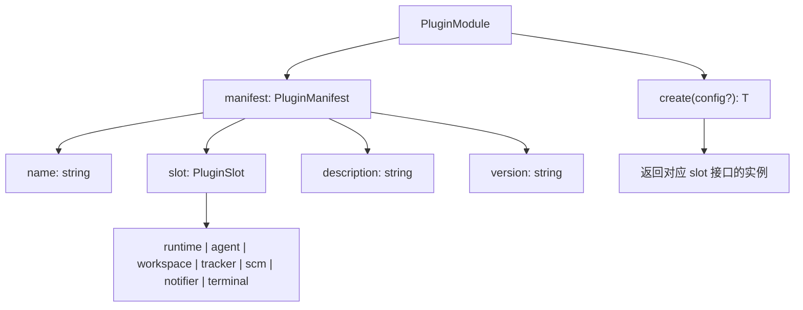
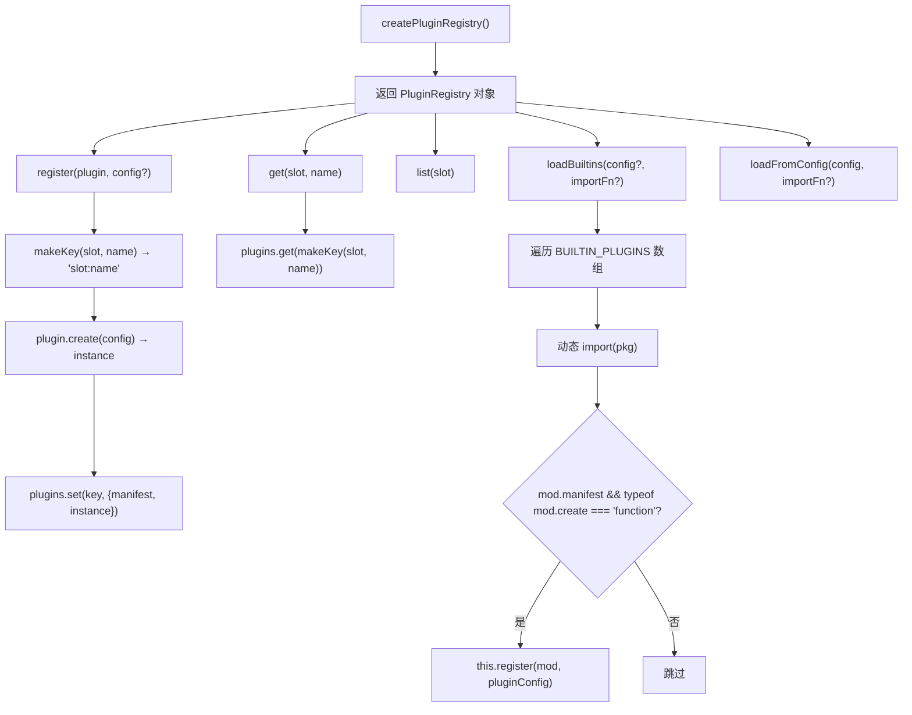

# PD-123.01 Agent Orchestrator — Slot-Based PluginRegistry 与 Manifest+Factory 插件系统

> 文档编号：PD-123.01
> 来源：Agent Orchestrator `packages/core/src/plugin-registry.ts`, `packages/core/src/types.ts`
> GitHub：https://github.com/ComposioHQ/agent-orchestrator.git
> 问题域：PD-123 插件架构 Plugin Architecture
> 状态：可复用方案

---

## 第 1 章 问题与动机

### 1.1 核心问题

Agent 编排系统需要同时支持多种运行时（tmux/docker/process）、多种 AI 代理（Claude Code/Codex/Aider）、多种工作区隔离策略（worktree/clone）、多种通知渠道（Slack/Desktop/Webhook）等。如果将这些实现硬编码在核心逻辑中，每新增一种实现都需要修改核心代码，违反开闭原则，且不同部署环境的需求差异巨大。

核心挑战：
- **7 个功能维度**各有多种实现，组合爆炸
- 不同用户环境安装的依赖不同（有人用 tmux，有人用 Docker）
- 需要在项目级别和全局级别分别配置默认插件
- Web 端（Next.js webpack）和 CLI 端对动态加载的支持不同

### 1.2 Agent Orchestrator 的解法概述

1. **Slot 类型系统**：定义 7 种 `PluginSlot`（runtime/agent/workspace/tracker/scm/notifier/terminal），每个 slot 对应一个 TypeScript 接口契约（`packages/core/src/types.ts:917-924`）
2. **Manifest + Factory 模式**：每个插件导出 `{ manifest, create }` 结构体，manifest 声明元数据，create 工厂函数按需实例化（`packages/core/src/types.ts:927-945`）
3. **slot:name 复合键注册**：PluginRegistry 用 `Map<"slot:name", instance>` 存储，同 slot 下不同 name 共存，同 slot+name 后注册覆盖前注册（`packages/core/src/plugin-registry.ts:18-23`）
4. **双轨加载**：CLI 端用 `loadBuiltins()` 动态 import npm 包；Web 端因 webpack 限制改用静态 import + 手动 `register()`（`packages/web/src/lib/services.ts:24-70`）
5. **配置驱动选择**：`OrchestratorConfig.defaults` 指定全局默认插件，`ProjectConfig` 可按项目覆盖（`packages/core/src/types.ts:814-835`）

### 1.3 设计思想

| 设计原则 | 具体实现 | 理由 | 替代方案 |
|----------|----------|------|----------|
| 接口隔离 | 7 个独立 slot 接口（Runtime/Agent/Workspace/...） | 每个插件只需实现自己 slot 的接口，不关心其他 slot | 统一 Plugin 基类（过度耦合） |
| 工厂延迟实例化 | `create(config?)` 在 register 时调用 | 插件可接收运行时配置（如 webhook URL），且实例化失败不影响其他插件 | 构造函数直接 new（无法传配置） |
| 静默降级 | `loadBuiltins` 中 try/catch 跳过未安装的包 | 用户只需安装需要的插件，缺失的自动跳过 | 启动时强制检查所有依赖（用户体验差） |
| 复合键寻址 | `slot:name` 字符串作为 Map key | O(1) 查找，天然避免跨 slot 命名冲突 | 嵌套 Map<slot, Map<name, instance>>（多一层间接） |
| 类型安全泛型 | `get<T>(slot, name): T \| null` | 调用方按 slot 接口类型断言，编译期检查方法调用 | any 类型（运行时才发现接口不匹配） |

---

## 第 2 章 源码实现分析

### 2.1 架构概览

Agent Orchestrator 的插件系统分为三层：类型定义层（接口契约）、注册表层（发现与存储）、消费层（Session Manager 按需解析）。

```
┌─────────────────────────────────────────────────────────────────┐
│                    OrchestratorConfig                            │
│  defaults: { runtime: "tmux", agent: "claude-code", ... }       │
│  projects: { "my-app": { agent: "codex", tracker: "linear" } }  │
└──────────────────────────┬──────────────────────────────────────┘
                           │ 配置驱动
                           ▼
┌─────────────────────────────────────────────────────────────────┐
│                     PluginRegistry                               │
│  Map<"slot:name", { manifest, instance }>                        │
│                                                                  │
│  ┌──────────┐ ┌──────────┐ ┌───────────┐ ┌──────────┐          │
│  │ runtime: │ │ agent:   │ │workspace: │ │notifier: │  ...      │
│  │  tmux    │ │  claude  │ │  worktree │ │  slack   │          │
│  │  process │ │  codex   │ │  clone    │ │  desktop │          │
│  └──────────┘ │  aider   │ └───────────┘ │  webhook │          │
│               └──────────┘               └──────────┘          │
└──────────────────────────┬──────────────────────────────────────┘
                           │ registry.get<T>(slot, name)
                           ▼
┌─────────────────────────────────────────────────────────────────┐
│                    SessionManager                                │
│  resolvePlugins(project) → { runtime, agent, workspace, ... }   │
│  spawn() → workspace.create → runtime.create → agent.launch     │
└─────────────────────────────────────────────────────────────────┘
```

### 2.2 核心实现

#### 2.2.1 PluginSlot 类型与 PluginModule 契约



对应源码 `packages/core/src/types.ts:917-945`：

```typescript
/** Plugin slot types */
export type PluginSlot =
  | "runtime"
  | "agent"
  | "workspace"
  | "tracker"
  | "scm"
  | "notifier"
  | "terminal";

/** Plugin manifest — what every plugin exports */
export interface PluginManifest {
  name: string;
  slot: PluginSlot;
  description: string;
  version: string;
}

/** What a plugin module must export */
export interface PluginModule<T = unknown> {
  manifest: PluginManifest;
  create(config?: Record<string, unknown>): T;
}
```

每个 slot 对应一个完整的 TypeScript 接口。以 `Runtime`（`types.ts:197-220`）为例，定义了 `create/destroy/sendMessage/getOutput/isAlive` 等方法；`Agent`（`types.ts:262-316`）定义了 `getLaunchCommand/detectActivity/getActivityState/getSessionInfo` 等方法。接口粒度精确到方法签名和参数类型。

#### 2.2.2 PluginRegistry 实现



对应源码 `packages/core/src/plugin-registry.ts:18-119`：

```typescript
/** Map from "slot:name" → plugin instance */
type PluginMap = Map<string, { manifest: PluginManifest; instance: unknown }>;

function makeKey(slot: PluginSlot, name: string): string {
  return `${slot}:${name}`;
}

export function createPluginRegistry(): PluginRegistry {
  const plugins: PluginMap = new Map();

  return {
    register(plugin: PluginModule, config?: Record<string, unknown>): void {
      const { manifest } = plugin;
      const key = makeKey(manifest.slot, manifest.name);
      const instance = plugin.create(config);
      plugins.set(key, { manifest, instance });
    },

    get<T>(slot: PluginSlot, name: string): T | null {
      const entry = plugins.get(makeKey(slot, name));
      return entry ? (entry.instance as T) : null;
    },

    list(slot: PluginSlot): PluginManifest[] {
      const result: PluginManifest[] = [];
      for (const [key, entry] of plugins) {
        if (key.startsWith(`${slot}:`)) {
          result.push(entry.manifest);
        }
      }
      return result;
    },

    async loadBuiltins(orchestratorConfig?, importFn?): Promise<void> {
      const doImport = importFn ?? ((pkg: string) => import(pkg));
      for (const builtin of BUILTIN_PLUGINS) {
        try {
          const mod = (await doImport(builtin.pkg)) as PluginModule;
          if (mod.manifest && typeof mod.create === "function") {
            const pluginConfig = orchestratorConfig
              ? extractPluginConfig(builtin.slot, builtin.name, orchestratorConfig)
              : undefined;
            this.register(mod, pluginConfig);
          }
        } catch {
          // Plugin not installed — that's fine, only load what's available
        }
      }
    },
  };
}
```

关键设计点：
- `register` 在注册时立即调用 `create(config)` 实例化，而非延迟到首次 `get` 时。这确保了启动阶段就能发现配置错误
- `loadBuiltins` 接受可选的 `importFn` 参数，测试时可注入 mock import 函数（`plugin-registry.test.ts:150-162`）
- 未安装的包在 `catch` 中静默跳过，实现了"按需安装"的用户体验

#### 2.2.3 具体插件实现模式

每个插件遵循统一的三段式结构：manifest 常量 → create 工厂函数 → default 导出。

以 `notifier-slack`（`packages/plugins/notifier-slack/src/index.ts:12-188`）为例：

```typescript
// 1. Manifest 声明
export const manifest = {
  name: "slack",
  slot: "notifier" as const,
  description: "Notifier plugin: Slack webhook notifications",
  version: "0.1.0",
};

// 2. Factory 函数 — 接收配置，返回接口实现
export function create(config?: Record<string, unknown>): Notifier {
  const webhookUrl = config?.webhookUrl as string | undefined;
  if (!webhookUrl) {
    console.warn("[notifier-slack] No webhookUrl — notifications will be no-ops");
  }
  return {
    name: "slack",
    async notify(event) { /* ... */ },
    async notifyWithActions(event, actions) { /* ... */ },
    async post(message, context?) { /* ... */ },
  };
}

// 3. Default 导出 — satisfies 确保类型安全
export default { manifest, create } satisfies PluginModule<Notifier>;
```

### 2.3 实现细节

#### 双轨加载策略

CLI 端和 Web 端对插件加载采用不同策略，这是该系统最精妙的工程决策之一。

**CLI 端**（`packages/cli/src/lib/plugins.ts:1-51`）：直接静态 import 所有已知插件包，用 `Record<string, { create(): T }>` 字典按名称查找。这绕过了 PluginRegistry 的动态加载，因为 CLI 作为 Node.js 应用可以直接 require 所有依赖。

**Web 端**（`packages/web/src/lib/services.ts:24-77`）：因为 Next.js webpack 无法处理 `import(variable)` 动态表达式，所以改用静态 import + 手动 `registry.register()`。同时用 `globalThis` 缓存 Services 单例以在 HMR 重载中存活。

```typescript
// Web 端：静态 import + 手动注册
import pluginRuntimeTmux from "@composio/ao-plugin-runtime-tmux";
import pluginAgentClaudeCode from "@composio/ao-plugin-agent-claude-code";

async function initServices(): Promise<Services> {
  const registry = createPluginRegistry();
  registry.register(pluginRuntimeTmux);      // 手动注册
  registry.register(pluginAgentClaudeCode);   // 手动注册
  // ...
}
```

#### Session Manager 的插件解析

`SessionManager.resolvePlugins()`（`packages/core/src/session-manager.ts:213-223`）展示了配置驱动的插件选择：项目级配置优先，回退到全局默认。

```typescript
function resolvePlugins(project: ProjectConfig, agentOverride?: string) {
  const runtime = registry.get<Runtime>("runtime", project.runtime ?? config.defaults.runtime);
  const agent = registry.get<Agent>("agent", agentOverride ?? project.agent ?? config.defaults.agent);
  const workspace = registry.get<Workspace>("workspace", project.workspace ?? config.defaults.workspace);
  const tracker = project.tracker ? registry.get<Tracker>("tracker", project.tracker.plugin) : null;
  const scm = project.scm ? registry.get<SCM>("scm", project.scm.plugin) : null;
  return { runtime, agent, workspace, tracker, scm };
}
```

#### BUILTIN_PLUGINS 静态注册表

`plugin-registry.ts:26-50` 定义了 15 个内置插件的 slot/name/npm-package 映射，覆盖 6 个 slot（terminal 的 lifecycle 是核心服务，不走插件）。这个数组既是发现机制，也是文档——一眼可见系统支持哪些插件。


---

## 第 3 章 迁移指南

### 3.1 迁移清单

**阶段 1：定义插件契约**
- [ ] 确定系统需要的 slot 类型（如 storage/auth/renderer 等）
- [ ] 为每个 slot 定义 TypeScript 接口（方法签名 + 参数类型 + 返回值）
- [ ] 定义 `PluginSlot` 联合类型、`PluginManifest` 和 `PluginModule<T>` 泛型接口

**阶段 2：实现注册表**
- [ ] 实现 `createPluginRegistry()` 工厂函数
- [ ] 实现 `slot:name` 复合键的 register/get/list 方法
- [ ] 实现 `loadBuiltins()` 动态加载（支持 importFn 注入）

**阶段 3：编写插件**
- [ ] 每个插件导出 `{ manifest, create }` 结构体
- [ ] `create(config?)` 接收可选配置，返回 slot 接口实例
- [ ] 使用 `satisfies PluginModule<T>` 确保类型安全

**阶段 4：集成消费层**
- [ ] 在核心服务中注入 PluginRegistry
- [ ] 实现配置驱动的插件选择（全局默认 + 项目级覆盖）
- [ ] 处理 Web 端 webpack 限制（静态 import + 手动注册）

### 3.2 适配代码模板

以下是一个可直接运行的最小插件系统实现：

```typescript
// ============ types.ts ============

export type PluginSlot = "storage" | "auth" | "renderer";

export interface PluginManifest {
  name: string;
  slot: PluginSlot;
  description: string;
  version: string;
}

export interface PluginModule<T = unknown> {
  manifest: PluginManifest;
  create(config?: Record<string, unknown>): T;
}

// 每个 slot 的接口契约
export interface Storage {
  readonly name: string;
  get(key: string): Promise<string | null>;
  set(key: string, value: string): Promise<void>;
  delete(key: string): Promise<void>;
}

// ============ plugin-registry.ts ============

type PluginMap = Map<string, { manifest: PluginManifest; instance: unknown }>;

function makeKey(slot: PluginSlot, name: string): string {
  return `${slot}:${name}`;
}

export interface PluginRegistry {
  register(plugin: PluginModule, config?: Record<string, unknown>): void;
  get<T>(slot: PluginSlot, name: string): T | null;
  list(slot: PluginSlot): PluginManifest[];
}

export function createPluginRegistry(): PluginRegistry {
  const plugins: PluginMap = new Map();

  return {
    register(plugin: PluginModule, config?: Record<string, unknown>): void {
      const { manifest } = plugin;
      const key = makeKey(manifest.slot, manifest.name);
      const instance = plugin.create(config);
      plugins.set(key, { manifest, instance });
    },

    get<T>(slot: PluginSlot, name: string): T | null {
      const entry = plugins.get(makeKey(slot, name));
      return entry ? (entry.instance as T) : null;
    },

    list(slot: PluginSlot): PluginManifest[] {
      const result: PluginManifest[] = [];
      for (const [key, entry] of plugins) {
        if (key.startsWith(`${slot}:`)) {
          result.push(entry.manifest);
        }
      }
      return result;
    },
  };
}

// ============ plugins/storage-memory.ts ============

import type { PluginModule, Storage } from "../types";

export const manifest = {
  name: "memory",
  slot: "storage" as const,
  description: "In-memory storage plugin",
  version: "0.1.0",
};

export function create(_config?: Record<string, unknown>): Storage {
  const store = new Map<string, string>();
  return {
    name: "memory",
    async get(key) { return store.get(key) ?? null; },
    async set(key, value) { store.set(key, value); },
    async delete(key) { store.delete(key); },
  };
}

export default { manifest, create } satisfies PluginModule<Storage>;
```

### 3.3 适用场景

| 场景 | 适用度 | 说明 |
|------|--------|------|
| 多种运行时/后端需要按环境切换 | ⭐⭐⭐ | 核心场景，slot 天然对应功能维度 |
| 第三方集成（通知/SCM/Tracker） | ⭐⭐⭐ | 每个集成一个插件，manifest 声明元数据 |
| 需要在 Web 和 CLI 两端共享插件 | ⭐⭐⭐ | 双轨加载策略已验证可行 |
| 插件数量 < 5 且不需要动态加载 | ⭐ | 过度设计，直接用策略模式即可 |
| 需要插件间通信或依赖注入 | ⭐⭐ | 当前方案不支持插件间依赖声明，需自行扩展 |
| 需要热插拔（运行时加载/卸载） | ⭐⭐ | register 支持覆盖，但无 unregister 和生命周期钩子 |

---

## 第 4 章 测试用例

基于 `packages/core/src/__tests__/plugin-registry.test.ts` 的真实测试模式：

```python
import pytest
from typing import Protocol, Optional, Any
from dataclasses import dataclass

# ============ 类型定义 ============

class Storage(Protocol):
    name: str
    def get(self, key: str) -> Optional[str]: ...
    def set(self, key: str, value: str) -> None: ...

@dataclass
class PluginManifest:
    name: str
    slot: str
    description: str
    version: str

@dataclass
class PluginModule:
    manifest: PluginManifest
    create: Any  # Callable

# ============ 注册表实现 ============

class PluginRegistry:
    def __init__(self):
        self._plugins: dict[str, tuple[PluginManifest, Any]] = {}

    def register(self, plugin: PluginModule, config: dict | None = None):
        key = f"{plugin.manifest.slot}:{plugin.manifest.name}"
        instance = plugin.create(config)
        self._plugins[key] = (plugin.manifest, instance)

    def get(self, slot: str, name: str):
        entry = self._plugins.get(f"{slot}:{name}")
        return entry[1] if entry else None

    def list(self, slot: str) -> list[PluginManifest]:
        return [m for k, (m, _) in self._plugins.items() if k.startswith(f"{slot}:")]

# ============ 测试用例 ============

def make_plugin(slot: str, name: str) -> PluginModule:
    return PluginModule(
        manifest=PluginManifest(name=name, slot=slot, description=f"Test {slot}:{name}", version="0.1.0"),
        create=lambda config=None: {"name": name, "_config": config},
    )

class TestPluginRegistry:
    def test_register_and_get(self):
        """注册后可通过 slot:name 检索"""
        registry = PluginRegistry()
        plugin = make_plugin("runtime", "tmux")
        registry.register(plugin)
        instance = registry.get("runtime", "tmux")
        assert instance is not None
        assert instance["name"] == "tmux"

    def test_get_returns_none_for_unregistered(self):
        """未注册的插件返回 None"""
        registry = PluginRegistry()
        assert registry.get("runtime", "nonexistent") is None

    def test_config_passed_to_create(self):
        """配置参数正确传递给 create 工厂函数"""
        registry = PluginRegistry()
        plugin = make_plugin("workspace", "worktree")
        registry.register(plugin, {"worktreeDir": "/custom/path"})
        instance = registry.get("workspace", "worktree")
        assert instance["_config"] == {"worktreeDir": "/custom/path"}

    def test_same_slot_name_overwrites(self):
        """相同 slot:name 后注册覆盖前注册"""
        registry = PluginRegistry()
        plugin1 = make_plugin("runtime", "tmux")
        plugin2 = make_plugin("runtime", "tmux")
        registry.register(plugin1)
        registry.register(plugin2)
        # 不抛异常，最后注册的生效
        assert registry.get("runtime", "tmux") is not None

    def test_different_slots_independent(self):
        """不同 slot 的插件互不干扰"""
        registry = PluginRegistry()
        registry.register(make_plugin("runtime", "tmux"))
        registry.register(make_plugin("workspace", "worktree"))
        assert registry.get("runtime", "tmux") is not None
        assert registry.get("workspace", "worktree") is not None
        assert registry.get("runtime", "worktree") is None
        assert registry.get("workspace", "tmux") is None

    def test_list_filters_by_slot(self):
        """list 只返回指定 slot 的插件"""
        registry = PluginRegistry()
        registry.register(make_plugin("runtime", "tmux"))
        registry.register(make_plugin("runtime", "process"))
        registry.register(make_plugin("workspace", "worktree"))
        runtimes = registry.list("runtime")
        assert len(runtimes) == 2
        names = [m.name for m in runtimes]
        assert "tmux" in names
        assert "process" in names

    def test_list_empty_slot(self):
        """空 slot 返回空列表"""
        registry = PluginRegistry()
        assert registry.list("notifier") == []

    def test_create_without_config(self):
        """不传配置时 create 收到 None"""
        registry = PluginRegistry()
        plugin = make_plugin("workspace", "clone")
        registry.register(plugin)
        instance = registry.get("workspace", "clone")
        assert instance["_config"] is None

    def test_graceful_degradation_on_missing_plugin(self):
        """消费层对缺失插件的降级处理"""
        registry = PluginRegistry()
        agent = registry.get("agent", "nonexistent")
        assert agent is None
        # 消费层应检查 None 并抛出有意义的错误
```


---

## 第 5 章 跨域关联

| 关联域 | 关系类型 | 说明 |
|--------|----------|------|
| PD-02 多 Agent 编排 | 协同 | SessionManager 通过 PluginRegistry 解析 Agent/Runtime/Workspace 插件来编排会话生命周期，插件系统是编排的基础设施 |
| PD-04 工具系统 | 协同 | Agent 插件（如 claude-code）内部实现了工具调用检测（PostToolUse hook）和活动状态推断，工具系统的扩展通过 Agent slot 接口暴露 |
| PD-05 沙箱隔离 | 依赖 | Workspace 插件（worktree/clone）实现代码隔离，Runtime 插件（tmux/process）实现执行隔离，两者都是 PD-05 的具体实现载体 |
| PD-09 Human-in-the-Loop | 协同 | Notifier 插件（slack/desktop/webhook）和 Terminal 插件（iterm2/web）共同实现人机交互通道，通过事件优先级路由到不同通知渠道 |
| PD-10 中间件管道 | 互补 | 当前插件系统是静态注册模式，不支持中间件链式处理；如需请求/响应拦截，需额外引入中间件管道 |
| PD-11 可观测性 | 协同 | Agent 插件的 `getSessionInfo()` 提取 cost/token 数据，`getActivityState()` 提供活动检测，是可观测性数据的来源 |

---

## 第 6 章 来源文件索引

| 文件 | 行范围 | 关键实现 |
|------|--------|----------|
| `packages/core/src/types.ts` | L917-L945 | PluginSlot 类型、PluginManifest、PluginModule 泛型接口定义 |
| `packages/core/src/types.ts` | L197-L316 | Runtime 和 Agent 插件接口（最复杂的两个 slot） |
| `packages/core/src/types.ts` | L379-L413 | Workspace 插件接口 |
| `packages/core/src/types.ts` | L422-L484 | Tracker 插件接口 |
| `packages/core/src/types.ts` | L494-L545 | SCM 插件接口（最丰富的接口，覆盖 PR/CI/Review 全流程） |
| `packages/core/src/types.ts` | L645-L669 | Notifier 插件接口 |
| `packages/core/src/types.ts` | L679-L690 | Terminal 插件接口 |
| `packages/core/src/types.ts` | L1015-L1036 | PluginRegistry 服务接口 |
| `packages/core/src/plugin-registry.ts` | L18-L23 | slot:name 复合键与 PluginMap 类型 |
| `packages/core/src/plugin-registry.ts` | L26-L50 | BUILTIN_PLUGINS 静态注册表（15 个内置插件） |
| `packages/core/src/plugin-registry.ts` | L62-L119 | createPluginRegistry 工厂函数（register/get/list/loadBuiltins） |
| `packages/web/src/lib/services.ts` | L24-L77 | Web 端静态 import + 手动注册 + globalThis 单例缓存 |
| `packages/cli/src/lib/plugins.ts` | L1-L51 | CLI 端静态字典式插件解析（绕过 Registry） |
| `packages/core/src/session-manager.ts` | L212-L223 | resolvePlugins — 配置驱动的插件选择（项目级覆盖 + 全局默认） |
| `packages/plugins/notifier-slack/src/index.ts` | L12-L188 | Slack 通知插件完整实现（manifest + create + default export） |
| `packages/plugins/agent-claude-code/src/index.ts` | L173-L785 | Claude Code Agent 插件（最复杂的插件实现，含 JSONL 解析和 hook 注入） |
| `packages/plugins/notifier-desktop/src/index.ts` | L12-L116 | Desktop 通知插件（最简洁的插件实现范例） |
| `packages/plugins/workspace-worktree/src/index.ts` | L19-L48 | Worktree 工作区插件 manifest + create |
| `packages/core/src/__tests__/plugin-registry.test.ts` | L1-L200 | PluginRegistry 完整测试套件 |

---

## 第 7 章 横向对比维度

```json comparison_data
{
  "project": "AgentOrchestrator",
  "dimensions": {
    "插件注册方式": "slot:name 复合键 Map + manifest 声明 + create 工厂函数",
    "插件分组/权限": "7 种 PluginSlot 类型枚举，每个 slot 独立接口契约",
    "热更新/缓存": "register 覆盖式更新，Web 端 globalThis 单例缓存",
    "配置传递": "create(config?) 工厂参数 + OrchestratorConfig 全局/项目级覆盖",
    "双轨加载": "CLI 动态 import + Web 静态 import 手动注册，适配 webpack 限制",
    "类型安全": "PluginModule<T> 泛型 + satisfies 编译期检查 + get<T> 泛型断言"
  }
}
```

### 域元数据补充

```json domain_metadata
{
  "solution_summary": "AgentOrchestrator 用 7-slot PluginRegistry + manifest/create 工厂模式实现 15 个内置插件的运行时注册与 slot:name 复合键查找",
  "description": "跨打包环境（webpack/Node.js）的双轨插件加载策略",
  "sub_problems": [
    "Web 端 webpack 无法动态 import 的适配",
    "插件实例的生命周期管理（无 unregister）",
    "跨 slot 插件组合的类型安全保证"
  ],
  "best_practices": [
    "用 satisfies PluginModule<T> 在编译期验证插件导出结构",
    "loadBuiltins 接受 importFn 参数实现测试时 mock 注入",
    "未安装的插件包在 catch 中静默跳过实现按需安装体验"
  ]
}
```

