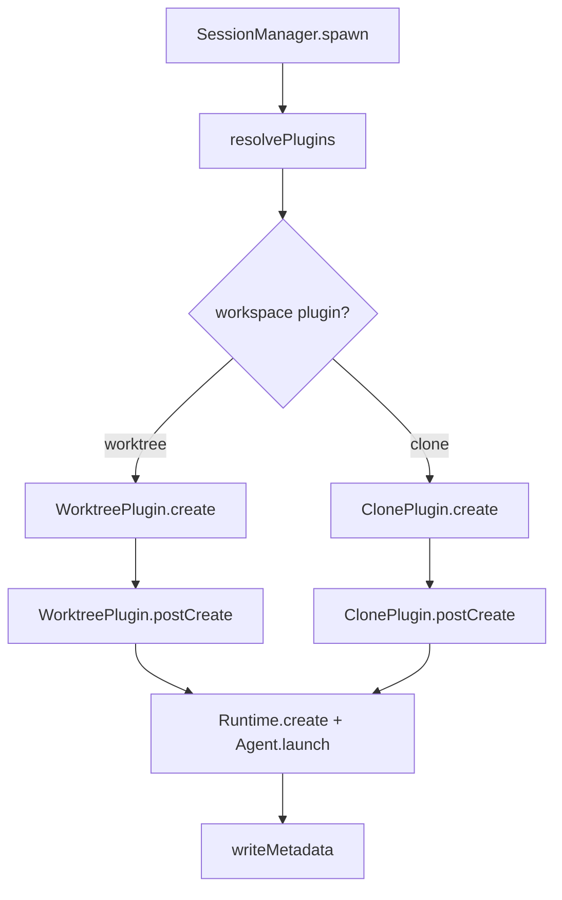
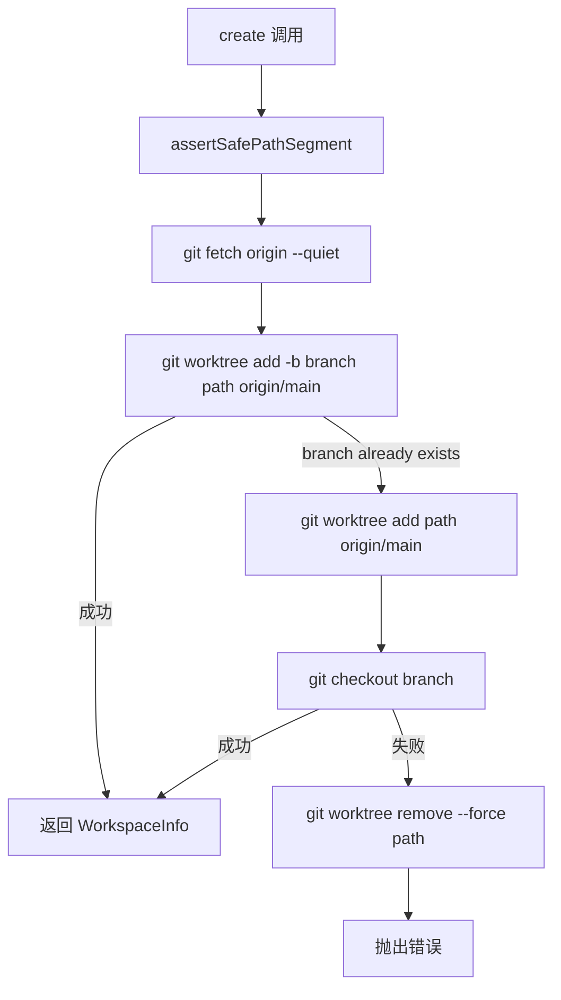
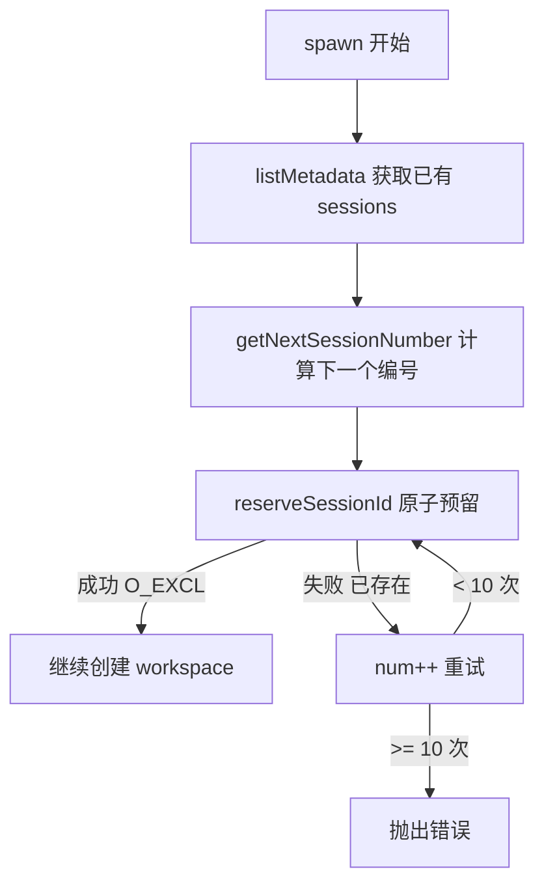
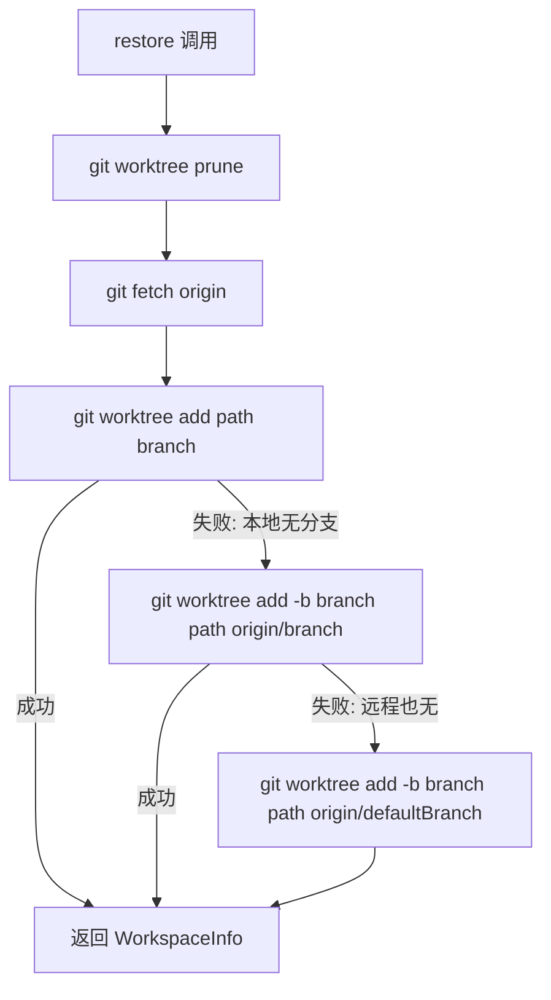

# PD-124.01 Agent-Orchestrator — Git Worktree 插件式工作区隔离

> 文档编号：PD-124.01
> 来源：Agent-Orchestrator `packages/plugins/workspace-worktree/src/index.ts`
> GitHub：https://github.com/ComposioHQ/agent-orchestrator.git
> 问题域：PD-124 工作区隔离 Workspace Isolation
> 状态：可复用方案

---

## 第 1 章 问题与动机

### 1.1 核心问题

当多个 AI Agent 同时在同一个代码仓库上工作时，它们会互相干扰——一个 Agent 的代码修改会影响另一个 Agent 的工作上下文。这不仅导致 git 冲突，还会让 Agent 读到不一致的代码状态，产生错误的推理结果。

工作区隔离的核心挑战包括：
- **并发安全**：多个 session 同时创建工作区时不能产生命名冲突
- **资源效率**：每个 session 都完整 clone 一份仓库太浪费磁盘和时间
- **生命周期管理**：session 结束后工作区需要清理，但分支上的代码不能丢
- **恢复能力**：session 崩溃后需要能重建工作区并恢复到之前的分支
- **共享资源**：某些文件（如 `.claude` 配置、`node_modules`）应该跨工作区共享

### 1.2 Agent-Orchestrator 的解法概述

Agent-Orchestrator 采用**插件化 Workspace 接口 + Git Worktree 默认实现**的架构：

1. **Workspace 插件接口**（`packages/core/src/types.ts:379-413`）：定义 `create/destroy/list/postCreate/exists/restore` 六个方法的标准接口，允许不同隔离策略（worktree、clone）可插拔替换
2. **Git Worktree 插件**（`packages/plugins/workspace-worktree/src/index.ts:49-301`）：默认实现，利用 git worktree 共享 `.git` 目录，每个 session 获得独立工作目录和分支
3. **原子化 Session ID 预留**（`packages/core/src/metadata.ts:264-274`）：使用 `O_EXCL` 文件创建标志防止并发冲突
4. **Hash 命名空间隔离**（`packages/core/src/paths.ts:20-24`）：SHA256(configDir) 前 12 位作为目录前缀，支持多配置文件共存
5. **Symlink + PostCreate 钩子**（`packages/plugins/workspace-worktree/src/index.ts:249-297`）：声明式共享资源 + 命令式初始化

### 1.3 设计思想

| 设计原则 | 具体实现 | 理由 | 替代方案 |
|----------|----------|------|----------|
| 插件化隔离策略 | Workspace 接口 + worktree/clone 两种实现 | 不同项目对隔离程度要求不同，monorepo 用 worktree 够了，跨语言项目可能需要 clone | 硬编码 worktree |
| 共享 .git 目录 | git worktree 而非 git clone | 节省磁盘（共享对象库），创建速度快（秒级 vs 分钟级） | 完整 clone + `--reference` |
| 原子化 ID 预留 | `O_EXCL` 文件系统标志 | 无需外部锁服务，利用 OS 原子性保证并发安全 | Redis 分布式锁 / 文件锁 |
| Hash 命名空间 | SHA256(configDir).slice(0,12) | 多个 orchestrator 实例可共存于同一机器，互不干扰 | PID 文件 / 端口号 |
| 声明式资源共享 | YAML 中配置 `symlinks: [".claude"]` | 用户只需声明"共享什么"，不需要写脚本 | 手动 ln -s |
| 防御性路径校验 | 正则 + resolve 后边界检查 | 防止 session ID 注入导致目录穿越 | 信任用户输入 |

---

## 第 2 章 源码实现分析

### 2.1 架构概览

Agent-Orchestrator 的工作区隔离分为三层：路径管理层、元数据层、工作区插件层。

```
┌─────────────────────────────────────────────────────────┐
│                   Session Manager                        │
│  (packages/core/src/session-manager.ts)                  │
│  spawn() → workspace.create() → postCreate() → runtime  │
└──────────┬──────────────────────────────────┬────────────┘
           │                                  │
    ┌──────▼──────┐                   ┌───────▼───────┐
    │  Metadata   │                   │   Paths       │
    │ (flat-file  │                   │ (hash-based   │
    │  key=value) │                   │  directories) │
    │ metadata.ts │                   │  paths.ts     │
    └──────┬──────┘                   └───────┬───────┘
           │                                  │
           └──────────────┬───────────────────┘
                          │
              ┌───────────▼───────────┐
              │   Workspace Plugin    │
              │   (pluggable slot)    │
              ├───────────────────────┤
              │ ● worktree (default)  │
              │ ● clone (alternative) │
              └───────────────────────┘
                          │
              ┌───────────▼───────────┐
              │   File System Layout  │
              │                       │
              │ ~/.agent-orchestrator/│
              │   {hash}-{projectId}/ │
              │     sessions/         │
              │       int-1           │
              │       int-2           │
              │       archive/        │
              │     .origin           │
              │                       │
              │ ~/.worktrees/         │
              │   {projectId}/        │
              │     int-1/  (worktree)│
              │     int-2/  (worktree)│
              └───────────────────────┘
```

### 2.2 核心实现

#### 2.2.1 Workspace 插件接口



Workspace 接口定义于 `packages/core/src/types.ts:379-413`：

```typescript
// packages/core/src/types.ts:379-413
export interface Workspace {
  readonly name: string;
  create(config: WorkspaceCreateConfig): Promise<WorkspaceInfo>;
  destroy(workspacePath: string): Promise<void>;
  list(projectId: string): Promise<WorkspaceInfo[]>;
  postCreate?(info: WorkspaceInfo, project: ProjectConfig): Promise<void>;
  exists?(workspacePath: string): Promise<boolean>;
  restore?(config: WorkspaceCreateConfig, workspacePath: string): Promise<WorkspaceInfo>;
}

export interface WorkspaceCreateConfig {
  projectId: string;
  project: ProjectConfig;
  sessionId: SessionId;
  branch: string;
}

export interface WorkspaceInfo {
  path: string;
  branch: string;
  sessionId: SessionId;
  projectId: string;
}
```

#### 2.2.2 Git Worktree 创建流程



对应源码 `packages/plugins/workspace-worktree/src/index.ts:57-112`：

```typescript
// packages/plugins/workspace-worktree/src/index.ts:57-112
async create(cfg: WorkspaceCreateConfig): Promise<WorkspaceInfo> {
  assertSafePathSegment(cfg.projectId, "projectId");
  assertSafePathSegment(cfg.sessionId, "sessionId");

  const repoPath = expandPath(cfg.project.path);
  const projectWorktreeDir = join(worktreeBaseDir, cfg.projectId);
  const worktreePath = join(projectWorktreeDir, cfg.sessionId);

  mkdirSync(projectWorktreeDir, { recursive: true });

  // Fetch latest from remote
  try {
    await git(repoPath, "fetch", "origin", "--quiet");
  } catch {
    // Fetch may fail if offline — continue anyway
  }

  const baseRef = `origin/${cfg.project.defaultBranch}`;

  // Create worktree with a new branch
  try {
    await git(repoPath, "worktree", "add", "-b", cfg.branch, worktreePath, baseRef);
  } catch (err: unknown) {
    const msg = err instanceof Error ? err.message : String(err);
    if (!msg.includes("already exists")) {
      throw new Error(`Failed to create worktree for branch "${cfg.branch}": ${msg}`, {
        cause: err,
      });
    }
    // Branch already exists — create worktree and check it out
    await git(repoPath, "worktree", "add", worktreePath, baseRef);
    try {
      await git(worktreePath, "checkout", cfg.branch);
    } catch (checkoutErr: unknown) {
      try {
        await git(repoPath, "worktree", "remove", "--force", worktreePath);
      } catch { /* Best-effort cleanup */ }
      const checkoutMsg = checkoutErr instanceof Error ? checkoutErr.message : String(checkoutErr);
      throw new Error(`Failed to checkout branch "${cfg.branch}" in worktree: ${checkoutMsg}`, {
        cause: checkoutErr,
      });
    }
  }

  return { path: worktreePath, branch: cfg.branch, sessionId: cfg.sessionId, projectId: cfg.projectId };
}
```

#### 2.2.3 原子化 Session ID 预留



对应源码 `packages/core/src/metadata.ts:264-274`：

```typescript
// packages/core/src/metadata.ts:264-274
export function reserveSessionId(dataDir: string, sessionId: SessionId): boolean {
  const path = metadataPath(dataDir, sessionId);
  mkdirSync(dirname(path), { recursive: true });
  try {
    const fd = openSync(path, constants.O_WRONLY | constants.O_CREAT | constants.O_EXCL);
    closeSync(fd);
    return true;
  } catch {
    return false;
  }
}
```

`O_EXCL` 标志确保文件创建是原子操作——如果文件已存在则立即失败，无需额外的锁机制。

### 2.3 实现细节

#### Symlink 共享资源与安全校验

`postCreate` 方法处理两件事：创建 symlinks 共享资源，以及执行初始化命令。

对应源码 `packages/plugins/workspace-worktree/src/index.ts:249-297`：

```typescript
// packages/plugins/workspace-worktree/src/index.ts:249-297
async postCreate(info: WorkspaceInfo, project: ProjectConfig): Promise<void> {
  const repoPath = expandPath(project.path);

  if (project.symlinks) {
    for (const symlinkPath of project.symlinks) {
      // 防御性校验：禁止绝对路径和目录穿越
      if (symlinkPath.startsWith("/") || symlinkPath.includes("..")) {
        throw new Error(
          `Invalid symlink path "${symlinkPath}": must be a relative path without ".." segments`,
        );
      }

      const sourcePath = join(repoPath, symlinkPath);
      const targetPath = resolve(info.path, symlinkPath);

      // 二次校验：resolve 后的路径必须在 workspace 内
      if (!targetPath.startsWith(info.path + "/") && targetPath !== info.path) {
        throw new Error(`Symlink target "${symlinkPath}" resolves outside workspace: ${targetPath}`);
      }

      if (!existsSync(sourcePath)) continue;

      // 清理已有目标（可能是上次残留的 symlink 或目录）
      try {
        const stat = lstatSync(targetPath);
        if (stat.isSymbolicLink() || stat.isFile() || stat.isDirectory()) {
          rmSync(targetPath, { recursive: true, force: true });
        }
      } catch { /* Target doesn't exist */ }

      mkdirSync(dirname(targetPath), { recursive: true });
      symlinkSync(sourcePath, targetPath);
    }
  }

  // 执行 postCreate 钩子命令
  if (project.postCreate) {
    for (const command of project.postCreate) {
      await execFileAsync("sh", ["-c", command], { cwd: info.path });
    }
  }
}
```

#### Hash 命名空间与碰撞检测

路径系统使用 SHA256 前 12 位（48 bit 熵）作为命名空间前缀，并通过 `.origin` 文件检测极端情况下的哈希碰撞。

对应源码 `packages/core/src/paths.ts:20-24` 和 `paths.ts:173-194`：

```typescript
// packages/core/src/paths.ts:20-24
export function generateConfigHash(configPath: string): string {
  const resolved = realpathSync(configPath);
  const configDir = dirname(resolved);
  const hash = createHash("sha256").update(configDir).digest("hex");
  return hash.slice(0, 12);
}

// packages/core/src/paths.ts:173-194
export function validateAndStoreOrigin(configPath: string, projectPath: string): void {
  const originPath = getOriginFilePath(configPath, projectPath);
  const resolvedConfigPath = realpathSync(configPath);

  if (existsSync(originPath)) {
    const stored = readFileSync(originPath, "utf-8").trim();
    if (stored !== resolvedConfigPath) {
      throw new Error(
        `Hash collision detected!\n` +
        `Directory: ${getProjectBaseDir(configPath, projectPath)}\n` +
        `Expected config: ${resolvedConfigPath}\n` +
        `Actual config: ${stored}`
      );
    }
  } else {
    const baseDir = getProjectBaseDir(configPath, projectPath);
    mkdirSync(baseDir, { recursive: true });
    writeFileSync(originPath, resolvedConfigPath, "utf-8");
  }
}
```

#### Worktree 恢复（Restore）

当 session 崩溃后需要恢复时，restore 方法尝试三级回退策略重建 worktree：



对应源码 `packages/plugins/workspace-worktree/src/index.ts:209-247`：

```typescript
// packages/plugins/workspace-worktree/src/index.ts:209-247
async restore(cfg: WorkspaceCreateConfig, workspacePath: string): Promise<WorkspaceInfo> {
  const repoPath = expandPath(cfg.project.path);

  try { await git(repoPath, "worktree", "prune"); } catch { /* Best effort */ }
  try { await git(repoPath, "fetch", "origin", "--quiet"); } catch { /* May fail if offline */ }

  try {
    await git(repoPath, "worktree", "add", workspacePath, cfg.branch);
  } catch {
    const remoteBranch = `origin/${cfg.branch}`;
    try {
      await git(repoPath, "worktree", "add", "-b", cfg.branch, workspacePath, remoteBranch);
    } catch {
      const baseRef = `origin/${cfg.project.defaultBranch}`;
      await git(repoPath, "worktree", "add", "-b", cfg.branch, workspacePath, baseRef);
    }
  }

  return { path: workspacePath, branch: cfg.branch, sessionId: cfg.sessionId, projectId: cfg.projectId };
}
```

---

## 第 3 章 迁移指南

### 3.1 迁移清单

**阶段 1：核心隔离能力**
- [ ] 定义 Workspace 接口（create/destroy/list/exists/restore）
- [ ] 实现 git worktree 创建逻辑（含分支已存在的回退处理）
- [ ] 实现原子化 session ID 预留（`O_EXCL` 文件锁）
- [ ] 实现 worktree 销毁（`git worktree remove --force`）

**阶段 2：资源共享与初始化**
- [ ] 实现 symlink 共享资源（含路径穿越防御）
- [ ] 实现 postCreate 钩子（shell 命令执行）
- [ ] 配置文件中声明 `symlinks` 和 `postCreate`

**阶段 3：恢复与清理**
- [ ] 实现 worktree restore（三级回退：本地分支 → 远程分支 → 默认分支）
- [ ] 实现 `git worktree prune` 清理孤立条目
- [ ] 实现 session 元数据归档（archive 目录 + 时间戳命名）

**阶段 4：多实例支持**
- [ ] 实现 hash 命名空间（SHA256 前缀）
- [ ] 实现 `.origin` 碰撞检测
- [ ] 实现 user-facing name 与 tmux name 的双层命名

### 3.2 适配代码模板

以下是一个可直接运行的最小化 Workspace 插件实现（TypeScript + Node.js）：

```typescript
import { execFile } from "node:child_process";
import { promisify } from "node:util";
import { existsSync, mkdirSync, symlinkSync, rmSync, lstatSync, openSync, closeSync, constants } from "node:fs";
import { join, resolve, dirname, basename } from "node:path";
import { homedir } from "node:os";

const execFileAsync = promisify(execFile);

// ---- 类型定义 ----
interface WorkspaceConfig {
  projectId: string;
  projectPath: string;
  defaultBranch: string;
  sessionId: string;
  branch: string;
  symlinks?: string[];
  postCreate?: string[];
}

interface WorkspaceInfo {
  path: string;
  branch: string;
  sessionId: string;
}

// ---- 工具函数 ----
async function git(cwd: string, ...args: string[]): Promise<string> {
  const { stdout } = await execFileAsync("git", args, { cwd, timeout: 30_000 });
  return stdout.trimEnd();
}

const SAFE_SEGMENT = /^[a-zA-Z0-9_-]+$/;
function assertSafe(value: string, label: string): void {
  if (!SAFE_SEGMENT.test(value)) throw new Error(`Invalid ${label}: ${value}`);
}

// ---- 原子化 ID 预留 ----
function reserveId(dir: string, id: string): boolean {
  mkdirSync(dir, { recursive: true });
  try {
    const fd = openSync(join(dir, id), constants.O_WRONLY | constants.O_CREAT | constants.O_EXCL);
    closeSync(fd);
    return true;
  } catch { return false; }
}

// ---- 核心：创建工作区 ----
async function createWorkspace(cfg: WorkspaceConfig): Promise<WorkspaceInfo> {
  assertSafe(cfg.projectId, "projectId");
  assertSafe(cfg.sessionId, "sessionId");

  const worktreeBase = join(homedir(), ".worktrees", cfg.projectId);
  const worktreePath = join(worktreeBase, cfg.sessionId);
  mkdirSync(worktreeBase, { recursive: true });

  // 1. Fetch latest
  try { await git(cfg.projectPath, "fetch", "origin", "--quiet"); } catch {}

  // 2. Create worktree
  const baseRef = `origin/${cfg.defaultBranch}`;
  try {
    await git(cfg.projectPath, "worktree", "add", "-b", cfg.branch, worktreePath, baseRef);
  } catch (err: unknown) {
    const msg = err instanceof Error ? err.message : String(err);
    if (!msg.includes("already exists")) throw err;
    // 分支已存在 → 创建 detached worktree 再 checkout
    await git(cfg.projectPath, "worktree", "add", worktreePath, baseRef);
    await git(worktreePath, "checkout", cfg.branch);
  }

  // 3. Symlinks
  if (cfg.symlinks) {
    for (const rel of cfg.symlinks) {
      if (rel.startsWith("/") || rel.includes("..")) throw new Error(`Bad symlink: ${rel}`);
      const src = join(cfg.projectPath, rel);
      const dst = resolve(worktreePath, rel);
      if (!dst.startsWith(worktreePath + "/")) throw new Error(`Symlink escapes workspace: ${rel}`);
      if (!existsSync(src)) continue;
      try { rmSync(dst, { recursive: true, force: true }); } catch {}
      mkdirSync(dirname(dst), { recursive: true });
      symlinkSync(src, dst);
    }
  }

  // 4. PostCreate hooks
  if (cfg.postCreate) {
    for (const cmd of cfg.postCreate) {
      await execFileAsync("sh", ["-c", cmd], { cwd: worktreePath });
    }
  }

  return { path: worktreePath, branch: cfg.branch, sessionId: cfg.sessionId };
}

// ---- 销毁工作区 ----
async function destroyWorkspace(worktreePath: string): Promise<void> {
  try {
    const gitCommonDir = await git(worktreePath, "rev-parse", "--path-format=absolute", "--git-common-dir");
    const repoPath = resolve(gitCommonDir, "..");
    await git(repoPath, "worktree", "remove", "--force", worktreePath);
  } catch {
    if (existsSync(worktreePath)) rmSync(worktreePath, { recursive: true, force: true });
  }
}

// ---- 恢复工作区 ----
async function restoreWorkspace(cfg: WorkspaceConfig, worktreePath: string): Promise<WorkspaceInfo> {
  try { await git(cfg.projectPath, "worktree", "prune"); } catch {}
  try { await git(cfg.projectPath, "fetch", "origin", "--quiet"); } catch {}

  try {
    await git(cfg.projectPath, "worktree", "add", worktreePath, cfg.branch);
  } catch {
    try {
      await git(cfg.projectPath, "worktree", "add", "-b", cfg.branch, worktreePath, `origin/${cfg.branch}`);
    } catch {
      await git(cfg.projectPath, "worktree", "add", "-b", cfg.branch, worktreePath, `origin/${cfg.defaultBranch}`);
    }
  }

  return { path: worktreePath, branch: cfg.branch, sessionId: cfg.sessionId };
}
```

### 3.3 适用场景

| 场景 | 适用度 | 说明 |
|------|--------|------|
| 多 Agent 并行开发同一仓库 | ⭐⭐⭐ | 核心场景，每个 Agent 独立分支和工作目录 |
| CI/CD 并行构建 | ⭐⭐⭐ | worktree 比 clone 快，适合并行 job |
| Monorepo 多任务 | ⭐⭐ | 适用，但 symlinks 配置需要覆盖更多共享目录 |
| 跨仓库多项目 | ⭐ | 不适用，应使用 clone 插件或独立仓库管理 |
| 需要完全隔离的安全场景 | ⭐ | worktree 共享 .git，如需完全隔离应使用 clone 或 Docker |

---

## 第 4 章 测试用例

```typescript
import { describe, it, expect, beforeEach, afterEach } from "vitest";
import { execFileSync } from "node:child_process";
import { mkdtempSync, existsSync, readlinkSync, writeFileSync, mkdirSync } from "node:fs";
import { join } from "node:path";
import { tmpdir } from "node:os";

function git(cwd: string, ...args: string[]): string {
  return execFileSync("git", args, { cwd, encoding: "utf-8" }).trimEnd();
}

describe("Workspace Isolation", () => {
  let repoPath: string;
  let worktreeBase: string;

  beforeEach(() => {
    // 创建临时 git 仓库
    repoPath = mkdtempSync(join(tmpdir(), "ws-test-repo-"));
    git(repoPath, "init", "--initial-branch=main");
    git(repoPath, "config", "user.email", "test@test.com");
    git(repoPath, "config", "user.name", "Test");
    writeFileSync(join(repoPath, "README.md"), "# Test");
    git(repoPath, "add", ".");
    git(repoPath, "commit", "-m", "init");

    worktreeBase = mkdtempSync(join(tmpdir(), "ws-test-wt-"));
  });

  it("should create worktree with new branch", () => {
    const wtPath = join(worktreeBase, "session-1");
    git(repoPath, "worktree", "add", "-b", "feat/test", wtPath, "main");

    expect(existsSync(wtPath)).toBe(true);
    expect(git(wtPath, "branch", "--show-current")).toBe("feat/test");
  });

  it("should handle branch-already-exists gracefully", () => {
    // 先创建分支
    git(repoPath, "branch", "feat/existing");

    const wtPath = join(worktreeBase, "session-2");
    // 模拟 worktree 插件的回退逻辑
    try {
      git(repoPath, "worktree", "add", "-b", "feat/existing", wtPath, "main");
    } catch {
      git(repoPath, "worktree", "add", wtPath, "main");
      git(wtPath, "checkout", "feat/existing");
    }

    expect(git(wtPath, "branch", "--show-current")).toBe("feat/existing");
  });

  it("should create symlinks for shared resources", () => {
    // 创建共享资源
    mkdirSync(join(repoPath, ".claude"), { recursive: true });
    writeFileSync(join(repoPath, ".claude", "settings.json"), "{}");

    const wtPath = join(worktreeBase, "session-3");
    git(repoPath, "worktree", "add", "-b", "feat/sym", wtPath, "main");

    // 创建 symlink
    const { symlinkSync, rmSync } = require("node:fs");
    const target = join(wtPath, ".claude");
    rmSync(target, { recursive: true, force: true });
    symlinkSync(join(repoPath, ".claude"), target);

    expect(readlinkSync(target)).toBe(join(repoPath, ".claude"));
    expect(existsSync(join(wtPath, ".claude", "settings.json"))).toBe(true);
  });

  it("should reject path traversal in symlinks", () => {
    const badPaths = ["../../../etc/passwd", "/absolute/path", "foo/../../bar"];
    for (const bad of badPaths) {
      expect(() => {
        if (bad.startsWith("/") || bad.includes("..")) {
          throw new Error(`Invalid symlink path "${bad}"`);
        }
      }).toThrow();
    }
  });

  it("should destroy worktree cleanly", () => {
    const wtPath = join(worktreeBase, "session-4");
    git(repoPath, "worktree", "add", "-b", "feat/destroy", wtPath, "main");
    expect(existsSync(wtPath)).toBe(true);

    git(repoPath, "worktree", "remove", "--force", wtPath);
    expect(existsSync(wtPath)).toBe(false);
  });

  it("should restore worktree from existing branch", () => {
    // 创建并销毁 worktree
    const wtPath = join(worktreeBase, "session-5");
    git(repoPath, "worktree", "add", "-b", "feat/restore", wtPath, "main");
    writeFileSync(join(wtPath, "new-file.ts"), "export const x = 1;");
    git(wtPath, "add", ".");
    git(wtPath, "commit", "-m", "add file");
    git(repoPath, "worktree", "remove", "--force", wtPath);

    // 恢复
    git(repoPath, "worktree", "prune");
    git(repoPath, "worktree", "add", wtPath, "feat/restore");

    expect(existsSync(join(wtPath, "new-file.ts"))).toBe(true);
  });
});
```

---

## 第 5 章 跨域关联

| 关联域 | 关系类型 | 说明 |
|--------|----------|------|
| PD-02 多 Agent 编排 | 依赖 | 工作区隔离是多 Agent 并行执行的前提，SessionManager 编排 spawn 时先创建 workspace 再启动 agent |
| PD-05 沙箱隔离 | 协同 | PD-124 提供代码级隔离（git worktree），PD-05 提供执行级隔离（Docker/进程）。Agent-Orchestrator 中 Workspace 和 Runtime 是两个独立插件槽 |
| PD-06 记忆持久化 | 协同 | Session 元数据（worktree 路径、分支名、状态）通过 flat-file 持久化，支持 session 恢复时重建工作区 |
| PD-09 Human-in-the-Loop | 协同 | 工作区路径通过 Terminal 插件暴露给人类，人类可以 attach 到 tmux session 查看 agent 在 worktree 中的工作 |
| PD-10 中间件管道 | 协同 | postCreate 钩子是一种简化的中间件模式——在 workspace 创建后按序执行初始化命令 |

---

## 第 6 章 来源文件索引

| 文件 | 行范围 | 关键实现 |
|------|--------|----------|
| `packages/plugins/workspace-worktree/src/index.ts` | L49-L301 | Worktree 插件完整实现：create/destroy/list/exists/restore/postCreate |
| `packages/plugins/workspace-worktree/src/index.ts` | L57-L112 | 核心 create 方法：worktree 创建 + 分支冲突回退 |
| `packages/plugins/workspace-worktree/src/index.ts` | L249-L297 | postCreate：symlink 共享 + 钩子命令执行 |
| `packages/plugins/workspace-worktree/src/index.ts` | L209-L247 | restore：三级回退恢复策略 |
| `packages/plugins/workspace-worktree/src/index.ts` | L114-L137 | destroy：worktree 移除 + 回退到 rmSync |
| `packages/core/src/types.ts` | L379-L413 | Workspace 插件接口定义 |
| `packages/core/src/types.ts` | L837-L888 | ProjectConfig：symlinks/postCreate 配置字段 |
| `packages/core/src/types.ts` | L1067-L1086 | WorkspaceMissingError 异常类 |
| `packages/core/src/session-manager.ts` | L315-L559 | spawn 流程：workspace.create → postCreate → runtime.create |
| `packages/core/src/session-manager.ts` | L920-L1107 | restore 流程：workspace.exists → workspace.restore → runtime.create |
| `packages/core/src/metadata.ts` | L264-L274 | reserveSessionId：O_EXCL 原子预留 |
| `packages/core/src/metadata.ts` | L191-L204 | deleteMetadata：归档到 archive/ 目录 |
| `packages/core/src/paths.ts` | L20-L24 | generateConfigHash：SHA256 前 12 位 |
| `packages/core/src/paths.ts` | L173-L194 | validateAndStoreOrigin：.origin 碰撞检测 |
| `packages/core/src/paths.ts` | L55-L78 | generateSessionPrefix：智能前缀生成规则 |

---

## 第 7 章 横向对比维度

```json comparison_data
{
  "project": "AgentOrchestrator",
  "dimensions": {
    "隔离策略": "插件化 Workspace 接口，默认 git worktree，可选 git clone --reference",
    "路径管理": "SHA256(configDir) 前 12 位 hash 命名空间 + .origin 碰撞检测",
    "并发控制": "O_EXCL 文件系统原子标志预留 session ID，10 次重试",
    "资源共享": "YAML 声明式 symlinks + postCreate shell 钩子",
    "恢复机制": "三级回退：本地分支 → 远程分支 → 默认分支重建 worktree",
    "安全防御": "正则白名单 + resolve 后边界检查防止路径穿越"
  }
}
```

### 域元数据补充

```json domain_metadata
{
  "solution_summary": "AgentOrchestrator 用插件化 Workspace 接口 + git worktree 默认实现，配合 O_EXCL 原子 ID 预留和 SHA256 hash 命名空间实现多 session 并行工作区隔离",
  "description": "插件化隔离策略选择与多实例命名空间管理",
  "sub_problems": [
    "多 orchestrator 实例共存的命名空间隔离",
    "session 元数据归档与恢复",
    "postCreate 钩子的安全执行"
  ],
  "best_practices": [
    "用 .origin 文件检测 hash 碰撞保证多实例安全",
    "worktree 销毁时不删分支，避免误删非本 session 创建的分支",
    "symlink 路径做 resolve 后二次边界检查防穿越"
  ]
}
```
