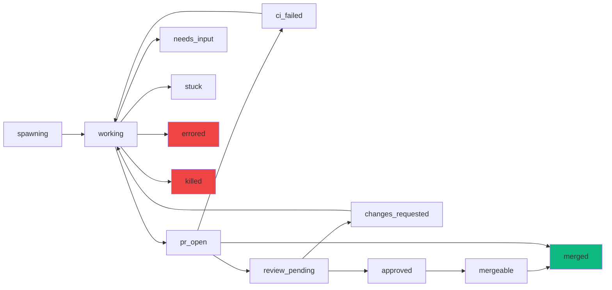
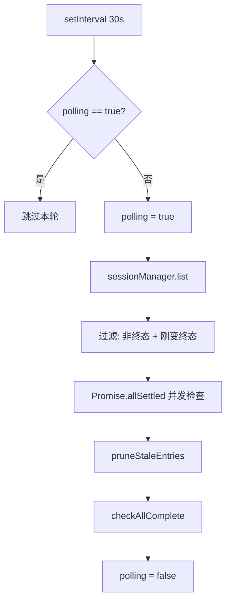
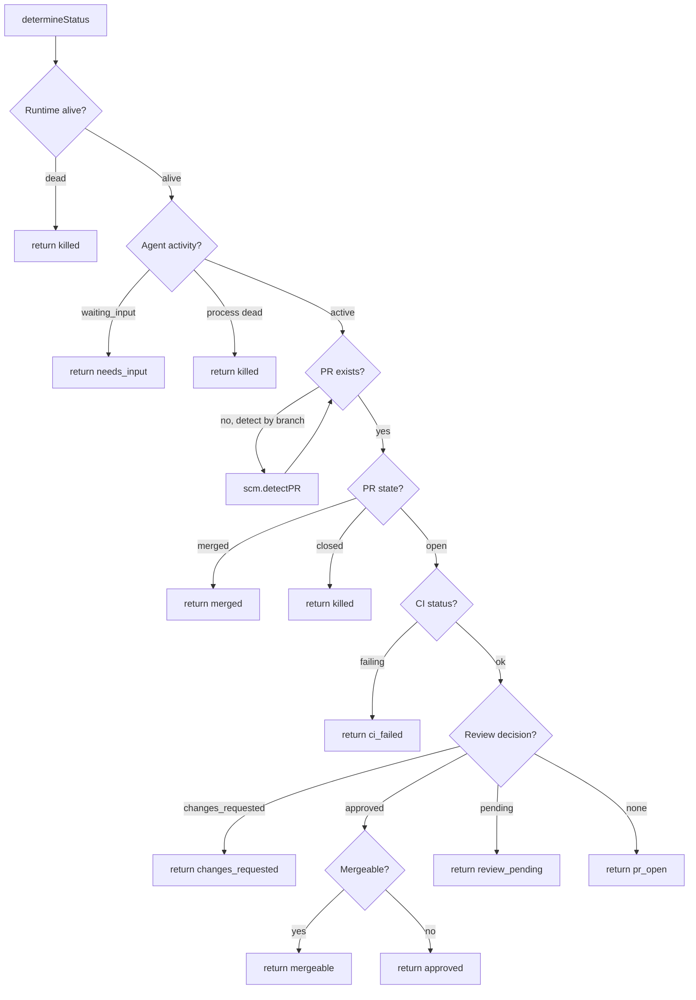
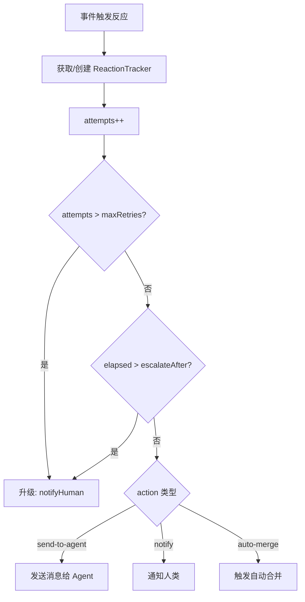

# PD-125.01 AgentOrchestrator — 轮询状态机与反应引擎

> 文档编号：PD-125.01
> 来源：AgentOrchestrator `packages/core/src/lifecycle-manager.ts`
> GitHub：https://github.com/ComposioHQ/agent-orchestrator.git
> 问题域：PD-125 会话生命周期管理 Session Lifecycle Management
> 状态：可复用方案

---

## 第 1 章 问题与动机

### 1.1 核心问题

Agent 会话不是"启动后就不管"的一次性任务。一个典型的 AI 编码 Agent 会话要经历从创建、编码、提交 PR、等待 CI、等待 Review、处理修改请求、最终合并的完整生命周期。每个阶段都可能出现异常（CI 失败、Review 被拒、Agent 卡住、进程崩溃），需要自动检测并触发相应的恢复动作。

核心挑战：
1. **状态爆炸**：16 种会话状态 × 多种外部信号源（Runtime、Agent、SCM、CI）= 复杂的状态转换矩阵
2. **并发安全**：多个会话同时轮询，轮询本身不能重入
3. **自动恢复 vs 人工升级**：何时自动重试、何时通知人类？需要可配置的升级策略
4. **外部状态同步**：会话状态不完全由系统内部决定，还依赖 GitHub PR 状态、CI 结果、Review 决策等外部信号

### 1.2 AgentOrchestrator 的解法概述

AgentOrchestrator 采用 **定时轮询 + 事件驱动反应** 的混合架构：

1. **16 态状态机**：`spawning → working → pr_open → review_pending → approved → mergeable → merged`，外加 `ci_failed`、`changes_requested`、`needs_input`、`stuck`、`errored`、`killed`、`done`、`terminated`、`cleanup` 等异常/终态（`types.ts:26-42`）
2. **LifecycleManager 轮询引擎**：默认 30 秒间隔轮询所有活跃会话，通过 `polling` 布尔标志实现 re-entrancy guard（`lifecycle-manager.ts:178,524-527`）
3. **ReactionTracker 升级机制**：每个 `sessionId:reactionKey` 组合独立追踪重试次数和首次触发时间，支持按次数或时间阈值升级到人工通知（`lifecycle-manager.ts:166-169,292-344`）
4. **多源状态推断**：`determineStatus()` 按优先级依次检查 Runtime 存活 → Agent 活动 → PR 自动检测 → PR/CI/Review 状态（`lifecycle-manager.ts:182-289`）
5. **元数据持久化**：flat-file key=value 格式存储会话状态，支持归档和恢复（`metadata.ts:42-54`）

### 1.3 设计思想

| 设计原则 | 具体实现 | 理由 | 替代方案 |
|----------|----------|------|----------|
| 轮询优于 Webhook | 30s 定时 `setInterval` 轮询所有会话 | 外部系统（GitHub、CI）不一定支持 Webhook；轮询更可靠、无需暴露端口 | Webhook + 轮询混合 |
| Re-entrancy Guard | `polling` 布尔标志，`pollAll()` 入口检查 | 防止慢轮询导致下一轮重叠执行，避免重复状态转换和通知 | 互斥锁 / 队列 |
| 反应升级策略 | `retries` + `escalateAfter`（次数或时间） | 自动恢复有上限，超过后必须通知人类；避免无限重试 | 固定重试次数 |
| 状态转换时重置追踪器 | 状态变更时删除旧状态的 ReactionTracker | 进入新状态后旧状态的重试计数不再有意义 | 全局重置 |
| 终态过滤 | `merged`/`killed` 状态的会话跳过轮询 | 减少无效 API 调用，但保留"刚变为终态"的转换检测 | 从列表中移除 |

---

## 第 2 章 源码实现分析

### 2.1 架构概览

AgentOrchestrator 的会话生命周期管理由三个核心模块协作：

```
┌─────────────────────────────────────────────────────────────┐
│                    LifecycleManager                          │
│  ┌──────────┐  ┌───────────────┐  ┌──────────────────────┐  │
│  │ pollAll() │→│ checkSession()│→│ determineStatus()     │  │
│  │ (30s loop)│  │ (per session) │  │ Runtime→Agent→SCM→CI │  │
│  └──────────┘  └───────────────┘  └──────────────────────┘  │
│       ↓               ↓                                      │
│  ┌──────────┐  ┌───────────────┐                             │
│  │ pruneMap │  │executeReaction│→ send-to-agent / notify     │
│  └──────────┘  └───────────────┘                             │
├─────────────────────────────────────────────────────────────┤
│                    SessionManager                            │
│  spawn() → list() → get() → kill() → cleanup() → restore() │
├─────────────────────────────────────────────────────────────┤
│                    Metadata (flat-file)                       │
│  read → write → update → delete(archive) → reserve(O_EXCL)  │
└─────────────────────────────────────────────────────────────┘
```

### 2.2 核心实现

#### 2.2.1 状态机定义与终态判定



对应源码 `packages/core/src/types.ts:26-42`：

```typescript
export type SessionStatus =
  | "spawning"
  | "working"
  | "pr_open"
  | "ci_failed"
  | "review_pending"
  | "changes_requested"
  | "approved"
  | "mergeable"
  | "merged"
  | "cleanup"
  | "needs_input"
  | "stuck"
  | "errored"
  | "killed"
  | "done"
  | "terminated";
```

终态集合定义在 `types.ts:94-101`，用于过滤不需要轮询的会话：

```typescript
export const TERMINAL_STATUSES: ReadonlySet<SessionStatus> = new Set([
  "killed", "terminated", "done", "cleanup", "errored", "merged",
]);
```

#### 2.2.2 轮询引擎与 Re-entrancy Guard



对应源码 `packages/core/src/lifecycle-manager.ts:524-580`：

```typescript
async function pollAll(): Promise<void> {
    // Re-entrancy guard: skip if previous poll is still running
    if (polling) return;
    polling = true;

    try {
      const sessions = await sessionManager.list();

      // Include sessions that are active OR whose status changed from what we last saw
      const sessionsToCheck = sessions.filter((s) => {
        if (s.status !== "merged" && s.status !== "killed") return true;
        const tracked = states.get(s.id);
        return tracked !== undefined && tracked !== s.status;
      });

      // Poll all sessions concurrently
      await Promise.allSettled(sessionsToCheck.map((s) => checkSession(s)));

      // Prune stale entries from states and reactionTrackers
      const currentSessionIds = new Set(sessions.map((s) => s.id));
      for (const trackedId of states.keys()) {
        if (!currentSessionIds.has(trackedId)) {
          states.delete(trackedId);
        }
      }
      for (const trackerKey of reactionTrackers.keys()) {
        const sessionId = trackerKey.split(":")[0];
        if (sessionId && !currentSessionIds.has(sessionId)) {
          reactionTrackers.delete(trackerKey);
        }
      }
    } catch {
      // Poll cycle failed — will retry next interval
    } finally {
      polling = false;
    }
  }
```

#### 2.2.3 多源状态推断 determineStatus



对应源码 `packages/core/src/lifecycle-manager.ts:182-289`，`determineStatus()` 按 5 层优先级依次检查：

1. **Runtime 存活检查**（L191-197）：通过 `runtime.isAlive()` 检测 tmux/docker 是否存活
2. **Agent 活动检测**（L199-231）：读取终端输出判断 `waiting_input`，检查进程是否存活
3. **PR 自动检测**（L233-250）：对没有 PR 元数据的会话，通过分支名自动发现 PR
4. **PR/CI/Review 状态**（L252-278）：依次查询 PR 状态、CI 结果、Review 决策、合并就绪度
5. **默认回退**（L280-288）：`spawning`/`stuck`/`needs_input` 回退为 `working`

### 2.3 实现细节

#### ReactionTracker 升级机制



每个 `sessionId:reactionKey` 组合有独立的追踪器（`lifecycle-manager.ts:166-169`）：

```typescript
interface ReactionTracker {
  attempts: number;
  firstTriggered: Date;
}
```

升级判定逻辑（`lifecycle-manager.ts:309-327`）支持两种模式：
- **次数升级**：`tracker.attempts > maxRetries`
- **时间升级**：`Date.now() - tracker.firstTriggered.getTime() > parseDuration(escalateAfter)`

状态转换时自动清除旧状态的追踪器（`lifecycle-manager.ts:462-468`），确保进入新状态后重试计数归零。

#### 原子会话 ID 预留

`metadata.ts:264-274` 使用 `O_EXCL` 标志原子创建文件，防止并发 spawn 产生 ID 冲突：

```typescript
export function reserveSessionId(dataDir: string, sessionId: SessionId): boolean {
  const path = metadataPath(dataDir, sessionId);
  mkdirSync(dirname(path), { recursive: true });
  try {
    const fd = openSync(path, constants.O_WRONLY | constants.O_CREAT | constants.O_EXCL);
    closeSync(fd);
    return true;
  } catch {
    return false;
  }
}
```

#### 归档式删除

`metadata.ts:191-204` 删除会话时默认归档到 `archive/` 子目录，带 ISO 时间戳后缀，支持后续恢复：

```typescript
export function deleteMetadata(dataDir: string, sessionId: SessionId, archive = true): void {
  if (archive) {
    const archiveDir = join(dataDir, "archive");
    mkdirSync(archiveDir, { recursive: true });
    const timestamp = new Date().toISOString().replace(/[:.]/g, "-");
    const archivePath = join(archiveDir, `${sessionId}_${timestamp}`);
    writeFileSync(archivePath, readFileSync(path, "utf-8"));
  }
  unlinkSync(path);
}
```

---

## 第 3 章 迁移指南

### 3.1 迁移清单

**阶段 1：状态机基础**
- [ ] 定义会话状态枚举（至少包含 `spawning`、`working`、`pr_open`、`merged`、`killed`、`errored`）
- [ ] 定义终态集合（`TERMINAL_STATUSES`），用于过滤不需要轮询的会话
- [ ] 实现 `isTerminalSession()` 和 `isRestorable()` 判定函数

**阶段 2：元数据持久化**
- [ ] 实现 flat-file key=value 元数据存储（或替换为 SQLite/Redis）
- [ ] 实现原子 ID 预留（`O_EXCL` 或数据库唯一约束）
- [ ] 实现归档式删除（删除时保留历史记录）

**阶段 3：轮询引擎**
- [ ] 实现 `pollAll()` 定时轮询循环，带 re-entrancy guard
- [ ] 实现 `determineStatus()` 多源状态推断
- [ ] 实现 `checkSession()` 状态转换检测与事件发射

**阶段 4：反应系统**
- [ ] 实现 `ReactionTracker` 追踪重试次数和首次触发时间
- [ ] 实现升级策略（次数/时间阈值 → 人工通知）
- [ ] 实现反应动作：`send-to-agent`、`notify`、`auto-merge`

**阶段 5：会话恢复**
- [ ] 实现从归档元数据恢复会话
- [ ] 实现工作区重建（worktree/clone）
- [ ] 实现 Agent 进程重启（`getRestoreCommand`）

### 3.2 适配代码模板

以下是一个可直接复用的轮询状态机骨架（TypeScript）：

```typescript
// lifecycle-manager.ts — 可复用的轮询状态机模板

type SessionStatus = "spawning" | "working" | "pr_open" | "ci_failed"
  | "review_pending" | "approved" | "merged" | "killed" | "errored";

const TERMINAL_STATUSES = new Set<SessionStatus>(["merged", "killed", "errored"]);

interface ReactionTracker {
  attempts: number;
  firstTriggered: Date;
}

interface LifecycleManagerConfig {
  pollIntervalMs: number;           // 默认 30000
  maxReactionRetries: number;       // 默认 3
  escalateAfterMs: number;          // 默认 600000 (10min)
  determineStatus: (sessionId: string) => Promise<SessionStatus>;
  onTransition: (sessionId: string, from: SessionStatus, to: SessionStatus) => Promise<void>;
  onEscalate: (sessionId: string, reactionKey: string, attempts: number) => Promise<void>;
  listActiveSessions: () => Promise<string[]>;
}

export function createLifecycleManager(config: LifecycleManagerConfig) {
  const states = new Map<string, SessionStatus>();
  const reactions = new Map<string, ReactionTracker>();
  let polling = false;
  let timer: ReturnType<typeof setInterval> | null = null;

  async function pollAll() {
    if (polling) return; // re-entrancy guard
    polling = true;
    try {
      const sessions = await config.listActiveSessions();
      await Promise.allSettled(sessions.map(checkSession));

      // Prune stale entries
      const active = new Set(sessions);
      for (const id of states.keys()) {
        if (!active.has(id)) states.delete(id);
      }
      for (const key of reactions.keys()) {
        const sid = key.split(":")[0];
        if (sid && !active.has(sid)) reactions.delete(key);
      }
    } finally {
      polling = false;
    }
  }

  async function checkSession(sessionId: string) {
    const oldStatus = states.get(sessionId) ?? "spawning";
    const newStatus = await config.determineStatus(sessionId);

    if (newStatus !== oldStatus) {
      states.set(sessionId, newStatus);
      // Clear old reaction tracker on state change
      clearReactionTracker(sessionId, oldStatus);
      await config.onTransition(sessionId, oldStatus, newStatus);
    } else {
      states.set(sessionId, newStatus);
    }
  }

  function clearReactionTracker(sessionId: string, oldStatus: SessionStatus) {
    for (const key of reactions.keys()) {
      if (key.startsWith(`${sessionId}:`)) {
        reactions.delete(key);
      }
    }
  }

  async function executeReaction(sessionId: string, reactionKey: string) {
    const trackerKey = `${sessionId}:${reactionKey}`;
    let tracker = reactions.get(trackerKey);
    if (!tracker) {
      tracker = { attempts: 0, firstTriggered: new Date() };
      reactions.set(trackerKey, tracker);
    }
    tracker.attempts++;

    const shouldEscalate =
      tracker.attempts > config.maxReactionRetries ||
      Date.now() - tracker.firstTriggered.getTime() > config.escalateAfterMs;

    if (shouldEscalate) {
      await config.onEscalate(sessionId, reactionKey, tracker.attempts);
    }
  }

  return {
    start() {
      if (timer) return;
      timer = setInterval(() => void pollAll(), config.pollIntervalMs);
      void pollAll(); // 立即执行一次
    },
    stop() {
      if (timer) { clearInterval(timer); timer = null; }
    },
    getStates: () => new Map(states),
  };
}
```

### 3.3 适用场景

| 场景 | 适用度 | 说明 |
|------|--------|------|
| 多 Agent 并行编码 + PR 管理 | ⭐⭐⭐ | 核心场景：多个 Agent 同时工作，需要追踪每个的 PR 生命周期 |
| 单 Agent 长任务监控 | ⭐⭐⭐ | 即使只有一个 Agent，也需要检测卡住/崩溃并自动恢复 |
| CI/CD 流水线编排 | ⭐⭐ | 状态机模式可复用，但 CI/CD 通常有自己的编排工具 |
| 批量任务队列 | ⭐ | 轮询模式对大量短任务效率不高，建议用事件驱动 |

---

## 第 4 章 测试用例

```python
"""
测试 AgentOrchestrator 会话生命周期管理的核心逻辑。
基于 lifecycle-manager.ts 和 session-manager.ts 的真实函数签名。
"""
import pytest
from unittest.mock import AsyncMock, MagicMock, patch
from datetime import datetime, timedelta
from dataclasses import dataclass, field
from typing import Optional
from enum import Enum


class SessionStatus(str, Enum):
    SPAWNING = "spawning"
    WORKING = "working"
    PR_OPEN = "pr_open"
    CI_FAILED = "ci_failed"
    REVIEW_PENDING = "review_pending"
    CHANGES_REQUESTED = "changes_requested"
    APPROVED = "approved"
    MERGEABLE = "mergeable"
    MERGED = "merged"
    KILLED = "killed"
    NEEDS_INPUT = "needs_input"
    STUCK = "stuck"
    ERRORED = "errored"


TERMINAL_STATUSES = {
    SessionStatus.KILLED, SessionStatus.MERGED, SessionStatus.ERRORED
}


@dataclass
class ReactionTracker:
    attempts: int = 0
    first_triggered: datetime = field(default_factory=datetime.now)


class TestReentrancyGuard:
    """测试轮询 re-entrancy guard（lifecycle-manager.ts:526-527）"""

    def test_skip_when_already_polling(self):
        polling = False

        def poll_all():
            nonlocal polling
            if polling:
                return "skipped"
            polling = True
            try:
                return "executed"
            finally:
                polling = False

        assert poll_all() == "executed"
        # 模拟并发：在 polling=True 时调用
        polling = True
        assert poll_all() == "skipped"

    def test_guard_resets_on_error(self):
        polling = False

        def poll_all_with_error():
            nonlocal polling
            if polling:
                return "skipped"
            polling = True
            try:
                raise RuntimeError("poll failed")
            finally:
                polling = False

        with pytest.raises(RuntimeError):
            poll_all_with_error()
        assert polling is False  # guard 必须在 finally 中重置


class TestReactionEscalation:
    """测试反应升级机制（lifecycle-manager.ts:309-327）"""

    def test_escalate_after_max_retries(self):
        tracker = ReactionTracker(attempts=3, first_triggered=datetime.now())
        max_retries = 3
        assert tracker.attempts >= max_retries  # 应该升级

    def test_escalate_after_duration(self):
        tracker = ReactionTracker(
            attempts=1,
            first_triggered=datetime.now() - timedelta(minutes=15)
        )
        escalate_after_ms = 600_000  # 10 minutes
        elapsed_ms = (datetime.now() - tracker.first_triggered).total_seconds() * 1000
        assert elapsed_ms > escalate_after_ms  # 应该升级

    def test_no_escalate_within_limits(self):
        tracker = ReactionTracker(
            attempts=1,
            first_triggered=datetime.now() - timedelta(minutes=2)
        )
        max_retries = 3
        escalate_after_ms = 600_000
        elapsed_ms = (datetime.now() - tracker.first_triggered).total_seconds() * 1000
        assert tracker.attempts < max_retries
        assert elapsed_ms < escalate_after_ms  # 不应该升级


class TestStateTransitionDetection:
    """测试状态转换检测（lifecycle-manager.ts:436-521）"""

    def test_transition_updates_state_map(self):
        states: dict[str, SessionStatus] = {}
        states["session-1"] = SessionStatus.WORKING
        new_status = SessionStatus.PR_OPEN
        if new_status != states.get("session-1"):
            states["session-1"] = new_status
        assert states["session-1"] == SessionStatus.PR_OPEN

    def test_no_transition_preserves_state(self):
        states = {"session-1": SessionStatus.WORKING}
        new_status = SessionStatus.WORKING
        old = states.get("session-1")
        assert new_status == old  # 无转换

    def test_terminal_sessions_filtered(self):
        sessions = [
            ("s1", SessionStatus.WORKING),
            ("s2", SessionStatus.MERGED),
            ("s3", SessionStatus.KILLED),
            ("s4", SessionStatus.PR_OPEN),
        ]
        active = [(sid, s) for sid, s in sessions if s not in TERMINAL_STATUSES]
        assert len(active) == 2
        assert all(s not in TERMINAL_STATUSES for _, s in active)

    def test_reaction_tracker_reset_on_transition(self):
        reactions: dict[str, ReactionTracker] = {
            "s1:ci-failed": ReactionTracker(attempts=2),
            "s1:agent-stuck": ReactionTracker(attempts=1),
            "s2:ci-failed": ReactionTracker(attempts=3),
        }
        # 状态转换时清除 s1 的所有追踪器
        for key in list(reactions.keys()):
            if key.startswith("s1:"):
                del reactions[key]
        assert "s1:ci-failed" not in reactions
        assert "s1:agent-stuck" not in reactions
        assert "s2:ci-failed" in reactions  # 其他会话不受影响


class TestMetadataAtomicReserve:
    """测试原子 ID 预留（metadata.ts:264-274）"""

    def test_reserve_returns_true_on_first_call(self, tmp_path):
        session_file = tmp_path / "session-1"
        assert not session_file.exists()
        session_file.touch()
        assert session_file.exists()

    def test_reserve_returns_false_on_duplicate(self, tmp_path):
        import os
        session_file = tmp_path / "session-1"
        # 第一次创建成功
        fd = os.open(str(session_file), os.O_WRONLY | os.O_CREAT | os.O_EXCL)
        os.close(fd)
        # 第二次应该失败
        with pytest.raises(FileExistsError):
            os.open(str(session_file), os.O_WRONLY | os.O_CREAT | os.O_EXCL)


class TestStaleEntryPruning:
    """测试过期条目清理（lifecycle-manager.ts:546-557）"""

    def test_prune_removes_absent_sessions(self):
        states = {"s1": SessionStatus.WORKING, "s2": SessionStatus.PR_OPEN, "s3": SessionStatus.KILLED}
        current_ids = {"s1", "s2"}
        for sid in list(states.keys()):
            if sid not in current_ids:
                del states[sid]
        assert "s3" not in states
        assert len(states) == 2
```

---

## 第 5 章 跨域关联

| 关联域 | 关系类型 | 说明 |
|--------|----------|------|
| PD-02 多 Agent 编排 | 协同 | LifecycleManager 管理多个并行 Agent 会话的状态，SessionManager.spawn() 支持并发创建；编排层决定"启动哪些 Agent"，生命周期层决定"每个 Agent 当前在哪个阶段" |
| PD-03 容错与重试 | 依赖 | ReactionTracker 的升级机制本质上是容错策略：CI 失败 → 自动发送修复指令 → 超过重试次数 → 升级到人工。`executeReaction()` 的 `retries` + `escalateAfter` 直接实现了分级重试 |
| PD-04 工具系统 | 协同 | LifecycleManager 通过 PluginRegistry 获取 Runtime、Agent、SCM 等插件实例；`determineStatus()` 依赖 Agent 插件的 `detectActivity()` 和 SCM 插件的 `getPRState()`/`getCISummary()` |
| PD-05 沙箱隔离 | 协同 | SessionManager.spawn() 通过 Workspace 插件创建隔离工作区（worktree/clone），每个会话有独立的文件系统路径；kill() 时清理工作区 |
| PD-06 记忆持久化 | 依赖 | 会话元数据（status、branch、pr、worktree）通过 flat-file key=value 格式持久化到 `~/.agent-orchestrator/{hash}/sessions/`；归档机制支持会话恢复 |
| PD-09 Human-in-the-Loop | 协同 | ReactionTracker 升级到人工通知是 HITL 的核心入口；`notifyHuman()` 通过 Notifier 插件推送事件，优先级路由决定通知渠道 |
| PD-10 中间件管道 | 互补 | LifecycleManager 的事件 → 反应链类似中间件管道，但更简单：每个事件只匹配一个 reactionKey，没有链式处理。复杂场景可考虑引入中间件模式 |
| PD-11 可观测性 | 协同 | 每次状态转换都生成 `OrchestratorEvent`（含 UUID、时间戳、优先级），可接入日志/监控系统；`inferPriority()` 自动分级事件严重度 |

---

## 第 6 章 来源文件索引

| 文件 | 行范围 | 关键实现 |
|------|--------|----------|
| `packages/core/src/types.ts` | L26-L42 | SessionStatus 16 态类型定义 |
| `packages/core/src/types.ts` | L44-L68 | ActivityState 6 态 + ActivityDetection |
| `packages/core/src/types.ts` | L74-L101 | SESSION_STATUS 常量 + TERMINAL_STATUSES 终态集合 |
| `packages/core/src/types.ts` | L107-L126 | NON_RESTORABLE_STATUSES + isRestorable() 判定 |
| `packages/core/src/types.ts` | L129-L171 | Session 接口完整定义 |
| `packages/core/src/types.ts` | L700-L736 | EventType 全部事件类型（30+ 种） |
| `packages/core/src/types.ts` | L755-L787 | ReactionConfig + ReactionResult |
| `packages/core/src/lifecycle-manager.ts` | L40-L54 | parseDuration() 时间字符串解析 |
| `packages/core/src/lifecycle-manager.ts` | L57-L76 | inferPriority() 事件优先级推断 |
| `packages/core/src/lifecycle-manager.ts` | L102-L131 | statusToEventType() 状态→事件映射 |
| `packages/core/src/lifecycle-manager.ts` | L134-L157 | eventToReactionKey() 事件→反应键映射 |
| `packages/core/src/lifecycle-manager.ts` | L166-L179 | ReactionTracker 接口 + 核心状态变量 |
| `packages/core/src/lifecycle-manager.ts` | L182-L289 | determineStatus() 多源状态推断（5 层优先级） |
| `packages/core/src/lifecycle-manager.ts` | L292-L416 | executeReaction() 反应执行 + 升级逻辑 |
| `packages/core/src/lifecycle-manager.ts` | L436-L521 | checkSession() 状态转换检测 + 事件发射 |
| `packages/core/src/lifecycle-manager.ts` | L524-L580 | pollAll() 轮询引擎 + re-entrancy guard |
| `packages/core/src/lifecycle-manager.ts` | L582-L607 | start()/stop()/getStates()/check() 公共 API |
| `packages/core/src/session-manager.ts` | L88-L113 | VALID_STATUSES 集合 + validateStatus() 状态规范化 |
| `packages/core/src/session-manager.ts` | L116-L157 | metadataToSession() 元数据→Session 对象重建 |
| `packages/core/src/session-manager.ts` | L315-L559 | spawn() 完整会话创建流程（含原子 ID 预留） |
| `packages/core/src/session-manager.ts` | L750-L808 | kill() 会话销毁（Runtime→Workspace→归档） |
| `packages/core/src/session-manager.ts` | L810-L877 | cleanup() 自动清理（PR merged/issue closed/runtime dead） |
| `packages/core/src/session-manager.ts` | L920-L1107 | restore() 会话恢复（归档读取→工作区重建→Agent 重启） |
| `packages/core/src/metadata.ts` | L42-L54 | parseMetadataFile() key=value 解析 |
| `packages/core/src/metadata.ts` | L84-L107 | readMetadata() 结构化读取 |
| `packages/core/src/metadata.ts` | L160-L185 | updateMetadata() 增量更新（读-合并-写） |
| `packages/core/src/metadata.ts` | L191-L204 | deleteMetadata() 归档式删除 |
| `packages/core/src/metadata.ts` | L211-L240 | readArchivedMetadataRaw() 归档恢复 |
| `packages/core/src/metadata.ts` | L264-L274 | reserveSessionId() 原子 ID 预留（O_EXCL） |
| `packages/core/src/paths.ts` | L20-L25 | generateConfigHash() SHA256 哈希生成 |
| `packages/core/src/paths.ts` | L93-L95 | getSessionsDir() 会话目录路径 |
| `packages/core/src/prompt-builder.ts` | L22-L40 | BASE_AGENT_PROMPT 三层 prompt 的第一层 |

---

## 第 7 章 横向对比维度

```json comparison_data
{
  "project": "AgentOrchestrator",
  "dimensions": {
    "状态机规模": "16 态 SessionStatus + 6 态 ActivityState，覆盖完整 PR 生命周期",
    "轮询机制": "setInterval 30s + re-entrancy guard 布尔标志，Promise.allSettled 并发检查",
    "反应升级": "ReactionTracker 按次数/时间双阈值升级，状态转换时自动重置",
    "元数据存储": "flat-file key=value 格式，O_EXCL 原子预留，归档式删除支持恢复",
    "多源状态推断": "5 层优先级：Runtime→Agent→PR 自动检测→CI/Review→默认回退",
    "会话恢复": "从 archive/ 读取元数据 + 工作区重建 + Agent getRestoreCommand"
  }
}
```

### 域元数据补充

```json domain_metadata
{
  "solution_summary": "AgentOrchestrator 用 16 态状态机 + 30s 轮询引擎 + ReactionTracker 升级机制管理 Agent 会话从 spawning 到 merged 的完整 PR 生命周期",
  "description": "通过多源状态推断（Runtime/Agent/SCM/CI）和反应升级策略实现自治式会话管理",
  "sub_problems": [
    "多源状态推断优先级冲突",
    "反应升级阈值配置",
    "终态会话的转换检测边界",
    "原子会话 ID 预留与并发 spawn"
  ],
  "best_practices": [
    "用 Promise.allSettled 并发检查所有会话避免单个失败阻塞全局",
    "终态会话仅在刚变为终态时检查一次转换后跳过",
    "归档式删除保留历史元数据支持后续恢复",
    "用 O_EXCL 原子文件创建防止并发 spawn ID 冲突"
  ]
}
```
