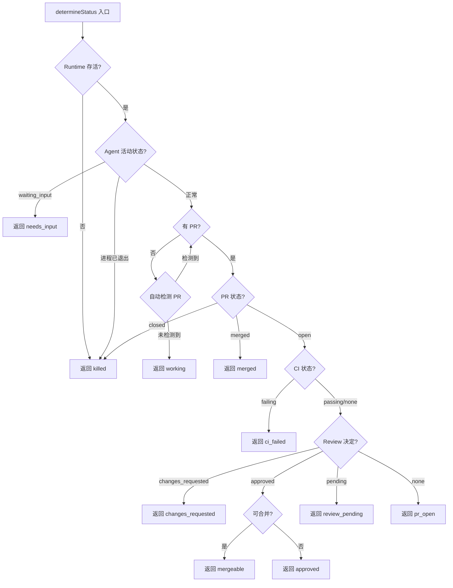
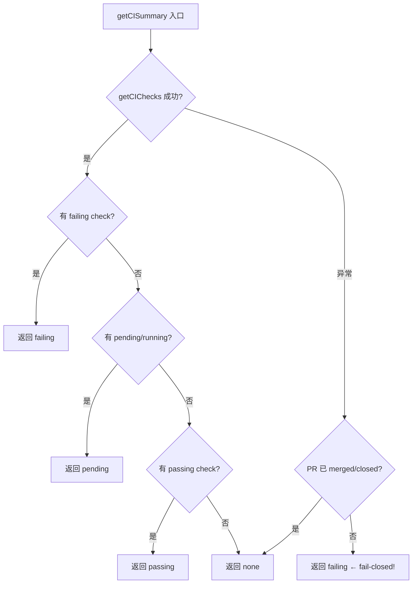

# PD-126.01 AgentOrchestrator — CI/Review 反馈闭环与升级引擎

> 文档编号：PD-126.01
> 来源：AgentOrchestrator `packages/core/src/lifecycle-manager.ts` `packages/plugins/scm-github/src/index.ts`
> GitHub：https://github.com/ComposioHQ/agent-orchestrator.git
> 问题域：PD-126 CI/CD 反馈闭环 CI/CD Feedback Loop
> 状态：可复用方案

---

## 第 1 章 问题与动机

### 1.1 核心问题

当 AI Agent 自主提交 PR 后，CI 可能失败、Reviewer 可能要求修改、Bot 可能标记安全问题。传统模式下，这些反馈需要人类手动转发给 Agent 或自己修复。在多 Agent 并行工作的场景下（一个编排器管理 5-10 个 Agent Session），人类不可能实时盯着每个 PR 的状态。

核心挑战：
- **CI 失败检测**：Agent 提交代码后 CI 跑失败了，谁来告诉 Agent 去修？
- **Review 评论路由**：Reviewer 留了 inline comment，怎么自动转发给 Agent？
- **Bot 评论分类**：codecov、sonarcloud 等 bot 的评论需要区别对待
- **升级机制**：Agent 修了 2 次还没修好，什么时候该叫人？
- **安全性**：CI 查询 API 失败时，是假装没问题（fail-open）还是报告失败（fail-closed）？

### 1.2 AgentOrchestrator 的解法概述

AgentOrchestrator 通过 **LifecycleManager 轮询状态机 + SCM 插件 + Reaction 引擎** 三层架构实现完整的 CI/CD 反馈闭环：

1. **14 态状态机**：Session 从 `spawning` 到 `merged` 经历 14 个状态，CI/Review 相关状态（`ci_failed`、`changes_requested`、`review_pending`、`approved`、`mergeable`）作为一等公民嵌入状态机（`packages/core/src/types.ts:26-42`）
2. **SCM 插件分层查询**：scm-github 插件通过 `gh` CLI 封装 CI checks、Review decision、Merge readiness 三层查询，每层独立容错（`packages/plugins/scm-github/src/index.ts:75-563`）
3. **Reaction 引擎**：事件→反应键→配置→执行的四步映射，支持 `send-to-agent`/`notify`/`auto-merge` 三种动作（`packages/core/src/lifecycle-manager.ts:133-416`）
4. **升级机制**：基于重试次数和时间阈值的双维度升级，超限后自动通知人类（`packages/core/src/lifecycle-manager.ts:309-344`）
5. **fail-closed 安全策略**：CI 查询失败时报告为 `failing` 而非 `none`，防止误合并（`packages/plugins/scm-github/src/index.ts:243-260`）

### 1.3 设计思想

| 设计原则 | 具体实现 | 理由 | 替代方案 |
|----------|----------|------|----------|
| fail-closed | CI 查询异常时返回 `failing` 而非 `none` | `none` 会被 getMergeability 视为通过，导致误合并 | fail-open（危险）、阻塞等待（影响吞吐） |
| 事件驱动反应 | 状态转换 → EventType → ReactionKey → ReactionConfig | 解耦检测与响应，支持用户自定义反应策略 | 硬编码 if-else（不可配置） |
| 双维度升级 | retries 次数 + escalateAfter 时间，任一触发即升级 | 防止 Agent 无限循环修复，也防止长时间无进展 | 仅次数（忽略时间）、仅时间（忽略重试） |
| Bot 评论隔离 | BOT_AUTHORS 白名单过滤，人工评论和 bot 评论分开处理 | 人工评论需要 Agent 理解语义，bot 评论通常有固定修复模式 | 不区分（Agent 被 bot 评论淹没） |
| 轮询 + 防重入 | setInterval 轮询 + `polling` 布尔锁 | 简单可靠，避免 webhook 的基础设施依赖 | Webhook（需要公网端点）、GitHub App（复杂） |

---

## 第 2 章 源码实现分析

### 2.1 架构概览

AgentOrchestrator 的 CI/CD 反馈闭环由三个核心组件协作：

```
┌─────────────────────────────────────────────────────────────────┐
│                    LifecycleManager (轮询引擎)                    │
│  ┌──────────┐    ┌──────────────┐    ┌───────────────────┐      │
│  │ pollAll() │───→│determineStatus│───→│  checkSession()   │      │
│  │ 30s 间隔  │    │  (状态判定)    │    │ (转换检测+反应)    │      │
│  └──────────┘    └──────┬───────┘    └─────────┬─────────┘      │
│                         │                       │                │
│                    ┌────▼────┐            ┌─────▼──────┐        │
│                    │ SCM 插件 │            │ Reaction   │        │
│                    │ (GitHub) │            │ Engine     │        │
│                    └────┬────┘            └─────┬──────┘        │
│                         │                       │                │
│              ┌──────────┼──────────┐    ┌──────┼───────┐       │
│              ▼          ▼          ▼    ▼      ▼       ▼       │
│         getCISummary getReview  getMerge send  notify escalate  │
│                      Decision  ability  ToAgent       ToHuman   │
└─────────────────────────────────────────────────────────────────┘
```

状态机流转（CI/Review 相关路径）：

```
spawning → working → pr_open ──→ review_pending ──→ approved ──→ mergeable → merged
                        │              │                              ↑
                        ▼              ▼                              │
                    ci_failed    changes_requested ──(agent fix)──────┘
                        │              │
                   (agent fix)    (agent fix)
                        │              │
                        ▼              ▼
                    pr_open        pr_open
                   (retry)        (retry)
```

### 2.2 核心实现

#### 2.2.1 状态判定：determineStatus()

LifecycleManager 的核心是 `determineStatus()` 函数，它按优先级依次检查 Runtime → Agent → PR → CI → Review → Merge：



对应源码 `packages/core/src/lifecycle-manager.ts:182-289`：

```typescript
async function determineStatus(session: Session): Promise<SessionStatus> {
    const project = config.projects[session.projectId];
    if (!project) return session.status;

    const agentName = session.metadata["agent"] ?? project.agent ?? config.defaults.agent;
    const agent = registry.get<Agent>("agent", agentName);
    const scm = project.scm ? registry.get<SCM>("scm", project.scm.plugin) : null;

    // 1. Check if runtime is alive
    if (session.runtimeHandle) {
      const runtime = registry.get<Runtime>("runtime", project.runtime ?? config.defaults.runtime);
      if (runtime) {
        const alive = await runtime.isAlive(session.runtimeHandle).catch(() => true);
        if (!alive) return "killed";
      }
    }

    // ... agent activity check ...

    // 4. Check PR state if PR exists
    if (session.pr && scm) {
      try {
        const prState = await scm.getPRState(session.pr);
        if (prState === PR_STATE.MERGED) return "merged";
        if (prState === PR_STATE.CLOSED) return "killed";

        const ciStatus = await scm.getCISummary(session.pr);
        if (ciStatus === CI_STATUS.FAILING) return "ci_failed";

        const reviewDecision = await scm.getReviewDecision(session.pr);
        if (reviewDecision === "changes_requested") return "changes_requested";
        if (reviewDecision === "approved") {
          const mergeReady = await scm.getMergeability(session.pr);
          if (mergeReady.mergeable) return "mergeable";
          return "approved";
        }
        if (reviewDecision === "pending") return "review_pending";
        return "pr_open";
      } catch {
        // SCM check failed — keep current status
      }
    }
    // ...
}
```

#### 2.2.2 fail-closed CI 查询



对应源码 `packages/plugins/scm-github/src/index.ts:243-275`：

```typescript
async getCISummary(pr: PRInfo): Promise<CIStatus> {
    let checks: CICheck[];
    try {
        checks = await this.getCIChecks(pr);
    } catch {
        // Before fail-closing, check if the PR is merged/closed —
        // GitHub may not return check data for those
        try {
            const state = await this.getPRState(pr);
            if (state === "merged" || state === "closed") return "none";
        } catch {
            // Can't determine state either; fall through to fail-closed.
        }
        // Fail closed for open PRs: report as failing rather than
        // "none" (which getMergeability treats as passing).
        return "failing";
    }
    if (checks.length === 0) return "none";

    const hasFailing = checks.some((c) => c.status === "failed");
    if (hasFailing) return "failing";

    const hasPending = checks.some((c) => c.status === "pending" || c.status === "running");
    if (hasPending) return "pending";

    const hasPassing = checks.some((c) => c.status === "passed");
    if (!hasPassing) return "none";

    return "passing";
}
```

### 2.3 实现细节

#### Reaction 引擎：事件→反应→升级

Reaction 引擎的核心是一个四步映射链：

1. **状态转换 → EventType**（`statusToEventType`，`lifecycle-manager.ts:102-131`）
2. **EventType → ReactionKey**（`eventToReactionKey`，`lifecycle-manager.ts:134-157`）
3. **ReactionKey → ReactionConfig**（全局 + 项目级合并，`lifecycle-manager.ts:477-483`）
4. **ReactionConfig → 执行**（`executeReaction`，`lifecycle-manager.ts:292-416`）

默认反应配置（`packages/core/src/config.ts:216-272`）：

| 反应键 | 动作 | 消息 | 升级条件 |
|--------|------|------|----------|
| `ci-failed` | send-to-agent | "CI is failing... Run `gh pr checks`..." | 2 次重试后 |
| `changes-requested` | send-to-agent | "There are review comments..." | 30 分钟后 |
| `bugbot-comments` | send-to-agent | "Automated review comments found..." | 30 分钟后 |
| `merge-conflicts` | send-to-agent | "Your branch has merge conflicts..." | 15 分钟后 |
| `approved-and-green` | notify (默认关闭) | "PR is ready to merge" | — |
| `agent-stuck` | notify | — | 10 分钟阈值 |

#### Bot 评论识别与分类

`scm-github` 插件维护一个 BOT_AUTHORS 白名单（`index.ts:30-41`），用于区分人工评论和自动化评论：

```typescript
const BOT_AUTHORS = new Set([
    "cursor[bot]", "github-actions[bot]", "codecov[bot]",
    "sonarcloud[bot]", "dependabot[bot]", "renovate[bot]",
    "codeclimate[bot]", "deepsource-autofix[bot]", "snyk-bot",
    "lgtm-com[bot]",
]);
```

`getAutomatedComments()` 还会根据评论内容推断严重度（`index.ts:447-463`）：
- `error`：包含 "error"、"bug"、"critical"、"potential issue"
- `warning`：包含 "warning"、"suggest"、"consider"
- `info`：默认

`getPendingComments()` 使用 GraphQL 查询 `reviewThreads` 的 `isResolved` 状态，只返回未解决的人工评论（`index.ts:333-421`），过滤掉 BOT_AUTHORS 中的 bot。

#### 升级机制的双维度设计

`executeReaction()` 中的升级逻辑（`lifecycle-manager.ts:309-327`）：

```
升级触发 = (attempts > maxRetries) OR (elapsed > escalateAfter)
```

- `retries: 2` + `escalateAfter: 2`：CI 失败修了 2 次还没好，升级
- `escalateAfter: "30m"`：Review 评论 30 分钟没解决，升级
- `escalateAfter: "15m"`：Merge 冲突 15 分钟没解决，升级

升级后发送 `reaction.escalated` 事件，通过 Notifier 插件推送给人类。

---

## 第 3 章 迁移指南

### 3.1 迁移清单

**阶段 1：CI 状态检测（1 天）**
- [ ] 实现 `CICheck` 和 `CIStatus` 类型定义
- [ ] 封装 CI 查询接口（GitHub Actions / GitLab CI / Jenkins）
- [ ] 实现 fail-closed 策略：查询异常时返回 `failing`
- [ ] 处理 merged/closed PR 的特殊情况（返回 `none`）

**阶段 2：Review 评论提取（1 天）**
- [ ] 实现 GraphQL 查询获取 `reviewThreads` 的 `isResolved` 状态
- [ ] 维护 BOT_AUTHORS 白名单，分离人工评论和 bot 评论
- [ ] 实现 `getAutomatedComments()` 的严重度推断逻辑
- [ ] 实现 `getReviewDecision()` 获取整体审查决定

**阶段 3：Reaction 引擎（2 天）**
- [ ] 定义 ReactionConfig 数据结构（action、retries、escalateAfter）
- [ ] 实现事件→反应键的映射表
- [ ] 实现 `executeReaction()` 的三种动作：send-to-agent、notify、auto-merge
- [ ] 实现升级逻辑：重试次数 + 时间阈值双维度
- [ ] 实现 ReactionTracker 跟踪每个 session 的重试状态

**阶段 4：状态机集成（1 天）**
- [ ] 将 CI/Review 状态嵌入 Session 状态机
- [ ] 实现轮询循环 + 防重入锁
- [ ] 实现状态转换检测 + 事件发射
- [ ] 支持项目级反应配置覆盖全局默认

### 3.2 适配代码模板

以下是一个可直接复用的 Reaction 引擎最小实现：

```typescript
// reaction-engine.ts — 可移植的反馈闭环引擎

interface ReactionConfig {
  auto: boolean;
  action: "send-to-agent" | "notify" | "auto-merge";
  message?: string;
  retries?: number;
  escalateAfter?: number | string; // 次数或时间字符串如 "30m"
  priority?: "urgent" | "action" | "warning" | "info";
}

interface ReactionTracker {
  attempts: number;
  firstTriggered: Date;
}

type EventType = "ci.failing" | "review.changes_requested" | "automated_review.found"
  | "merge.conflicts" | "merge.ready" | "session.stuck";

// 事件 → 反应键映射
const EVENT_TO_REACTION: Record<string, string> = {
  "ci.failing": "ci-failed",
  "review.changes_requested": "changes-requested",
  "automated_review.found": "bugbot-comments",
  "merge.conflicts": "merge-conflicts",
  "merge.ready": "approved-and-green",
  "session.stuck": "agent-stuck",
};

// 默认反应配置
const DEFAULT_REACTIONS: Record<string, ReactionConfig> = {
  "ci-failed": {
    auto: true,
    action: "send-to-agent",
    message: "CI is failing. Run `gh pr checks`, fix failures, and push.",
    retries: 2,
    escalateAfter: 2,
  },
  "changes-requested": {
    auto: true,
    action: "send-to-agent",
    message: "Review comments on your PR. Address each one and push fixes.",
    escalateAfter: "30m",
  },
};

function parseDuration(str: string): number {
  const match = str.match(/^(\d+)(s|m|h)$/);
  if (!match) return 0;
  const val = parseInt(match[1], 10);
  return match[2] === "s" ? val * 1000 : match[2] === "m" ? val * 60000 : val * 3600000;
}

class ReactionEngine {
  private trackers = new Map<string, ReactionTracker>();
  private reactions: Record<string, ReactionConfig>;

  constructor(
    reactions: Record<string, ReactionConfig> = DEFAULT_REACTIONS,
    private sendToAgent: (sessionId: string, message: string) => Promise<void>,
    private notifyHuman: (sessionId: string, message: string, priority: string) => Promise<void>,
  ) {
    this.reactions = { ...DEFAULT_REACTIONS, ...reactions };
  }

  async handleEvent(sessionId: string, eventType: EventType): Promise<void> {
    const reactionKey = EVENT_TO_REACTION[eventType];
    if (!reactionKey) return;

    const config = this.reactions[reactionKey];
    if (!config || config.auto === false) return;

    const trackerKey = `${sessionId}:${reactionKey}`;
    let tracker = this.trackers.get(trackerKey);
    if (!tracker) {
      tracker = { attempts: 0, firstTriggered: new Date() };
      this.trackers.set(trackerKey, tracker);
    }
    tracker.attempts++;

    // 升级检查：次数 OR 时间
    const maxRetries = config.retries ?? Infinity;
    let shouldEscalate = tracker.attempts > maxRetries;
    if (typeof config.escalateAfter === "string") {
      const ms = parseDuration(config.escalateAfter);
      if (ms > 0 && Date.now() - tracker.firstTriggered.getTime() > ms) {
        shouldEscalate = true;
      }
    }
    if (typeof config.escalateAfter === "number" && tracker.attempts > config.escalateAfter) {
      shouldEscalate = true;
    }

    if (shouldEscalate) {
      await this.notifyHuman(sessionId,
        `Reaction '${reactionKey}' escalated after ${tracker.attempts} attempts`,
        config.priority ?? "urgent");
      return;
    }

    // 执行反应
    if (config.action === "send-to-agent" && config.message) {
      await this.sendToAgent(sessionId, config.message);
    } else if (config.action === "notify") {
      await this.notifyHuman(sessionId, config.message ?? eventType, config.priority ?? "info");
    }
  }

  /** 状态转换时清除旧状态的 tracker */
  clearTracker(sessionId: string, reactionKey: string): void {
    this.trackers.delete(`${sessionId}:${reactionKey}`);
  }
}
```

### 3.3 适用场景

| 场景 | 适用度 | 说明 |
|------|--------|------|
| 多 Agent 并行开发 | ⭐⭐⭐ | 核心场景：5-10 个 Agent 同时工作，人类无法逐一监控 |
| 单 Agent + CI 自动修复 | ⭐⭐⭐ | 即使单 Agent 也能受益于自动 CI 修复闭环 |
| 团队 Code Review 流程 | ⭐⭐ | 需要适配团队的 Review 规范和 bot 列表 |
| GitLab / Bitbucket 平台 | ⭐⭐ | 需要替换 SCM 插件实现，核心 Reaction 引擎可复用 |
| 无 CI 的小项目 | ⭐ | 反馈闭环的价值在于自动化，无 CI 则价值有限 |

---

## 第 4 章 测试用例

基于 `packages/core/src/__tests__/lifecycle-manager.test.ts` 和 `packages/plugins/scm-github/test/index.test.ts` 中的真实测试模式：

```python
import pytest
from unittest.mock import AsyncMock, MagicMock
from datetime import datetime, timedelta

# ============================================================
# CI 状态检测测试
# ============================================================

class TestCISummary:
    """测试 getCISummary 的 fail-closed 策略"""

    async def test_returns_failing_when_any_check_fails(self):
        """至少一个 check 失败则整体为 failing"""
        checks = [
            {"name": "lint", "status": "passed"},
            {"name": "test", "status": "failed"},
            {"name": "build", "status": "passed"},
        ]
        result = get_ci_summary(checks)
        assert result == "failing"

    async def test_fail_closed_on_api_error(self):
        """CI API 查询失败时返回 failing（非 none）"""
        scm = MockSCM()
        scm.get_ci_checks = AsyncMock(side_effect=Exception("API timeout"))
        scm.get_pr_state = AsyncMock(return_value="open")
        result = await scm.get_ci_summary(pr_info)
        assert result == "failing"  # fail-closed!

    async def test_none_for_merged_pr_on_api_error(self):
        """已合并 PR 的 CI 查询失败时返回 none（不是 failing）"""
        scm = MockSCM()
        scm.get_ci_checks = AsyncMock(side_effect=Exception("API error"))
        scm.get_pr_state = AsyncMock(return_value="merged")
        result = await scm.get_ci_summary(pr_info)
        assert result == "none"

    async def test_unknown_check_state_treated_as_failed(self):
        """未知的 check state 视为 failed（fail-closed）"""
        checks = [{"name": "custom", "status": "UNKNOWN_STATE"}]
        result = get_ci_summary(checks)
        assert result == "failing"

# ============================================================
# Reaction 引擎测试
# ============================================================

class TestReactionEngine:
    """测试反应引擎的升级和执行逻辑"""

    async def test_sends_message_to_agent_on_ci_failure(self):
        """CI 失败时自动发送修复指令给 Agent"""
        engine = ReactionEngine(send_to_agent=AsyncMock(), notify_human=AsyncMock())
        await engine.handle_event("session-1", "ci.failing")
        engine.send_to_agent.assert_called_once_with(
            "session-1", "CI is failing. Run `gh pr checks`, fix failures, and push."
        )

    async def test_escalates_after_max_retries(self):
        """超过最大重试次数后升级到人工"""
        engine = ReactionEngine(
            reactions={"ci-failed": {"auto": True, "action": "send-to-agent",
                                      "message": "fix CI", "retries": 2}},
            send_to_agent=AsyncMock(), notify_human=AsyncMock()
        )
        await engine.handle_event("s1", "ci.failing")  # attempt 1
        await engine.handle_event("s1", "ci.failing")  # attempt 2
        await engine.handle_event("s1", "ci.failing")  # attempt 3 → escalate
        assert engine.notify_human.call_count == 1
        assert "escalated" in engine.notify_human.call_args[0][1].lower()

    async def test_escalates_after_time_threshold(self):
        """超过时间阈值后升级到人工"""
        engine = ReactionEngine(
            reactions={"changes-requested": {"auto": True, "action": "send-to-agent",
                                              "message": "fix review", "escalateAfter": "30m"}},
            send_to_agent=AsyncMock(), notify_human=AsyncMock()
        )
        # 模拟 30 分钟前首次触发
        tracker = engine._trackers["s1:changes-requested"]
        tracker.first_triggered = datetime.now() - timedelta(minutes=31)
        await engine.handle_event("s1", "review.changes_requested")
        engine.notify_human.assert_called_once()

    async def test_skips_reaction_when_auto_false(self):
        """auto=false 时跳过自动反应"""
        engine = ReactionEngine(
            reactions={"ci-failed": {"auto": False, "action": "send-to-agent", "message": "fix"}},
            send_to_agent=AsyncMock(), notify_human=AsyncMock()
        )
        await engine.handle_event("s1", "ci.failing")
        engine.send_to_agent.assert_not_called()

# ============================================================
# Bot 评论过滤测试
# ============================================================

class TestBotCommentFiltering:
    """测试 bot 评论和人工评论的分离"""

    def test_filters_bot_from_pending_comments(self):
        """getPendingComments 过滤掉 bot 评论"""
        threads = [
            {"isResolved": False, "author": "codecov[bot]", "body": "Coverage decreased"},
            {"isResolved": False, "author": "human-reviewer", "body": "Please fix this"},
            {"isResolved": True, "author": "human-reviewer", "body": "Resolved comment"},
        ]
        result = filter_pending_human_comments(threads, BOT_AUTHORS)
        assert len(result) == 1
        assert result[0]["author"] == "human-reviewer"

    def test_classifies_bot_comment_severity(self):
        """bot 评论根据内容推断严重度"""
        assert classify_severity("Critical bug found in line 42") == "error"
        assert classify_severity("Consider using a more efficient algorithm") == "warning"
        assert classify_severity("Code coverage: 85%") == "info"
```

---

## 第 5 章 跨域关联

| 关联域 | 关系类型 | 说明 |
|--------|----------|------|
| PD-02 多 Agent 编排 | 依赖 | LifecycleManager 依赖 SessionManager 管理多个 Agent Session，反馈闭环是编排的一部分 |
| PD-04 工具系统 | 协同 | SCM 插件（scm-github）是工具系统的一个插件槽，CI/Review 查询通过插件接口抽象 |
| PD-09 Human-in-the-Loop | 协同 | 升级机制（escalateAfter）是 HITL 的自动触发入口，Notifier 插件负责推送 |
| PD-10 中间件管道 | 协同 | Reaction 引擎的事件→反应键→配置→执行链类似中间件管道模式 |
| PD-11 可观测性 | 协同 | OrchestratorEvent 携带 priority/timestamp/data，可接入可观测性系统 |
| PD-03 容错与重试 | 依赖 | Reaction 引擎的 retries + escalateAfter 本质是容错重试策略的应用 |
| PD-129 Agent 活动检测 | 依赖 | determineStatus() 依赖 Agent 插件的 detectActivity/getActivityState 判断 Agent 是否存活 |

---

## 第 6 章 来源文件索引

| 文件 | 行范围 | 关键实现 |
|------|--------|----------|
| `packages/core/src/types.ts` | L26-L42 | SessionStatus 14 态定义，含 ci_failed/changes_requested/mergeable |
| `packages/core/src/types.ts` | L573-L633 | CICheck/CIStatus/Review/ReviewComment/AutomatedComment/MergeReadiness 类型 |
| `packages/core/src/types.ts` | L700-L736 | EventType 定义，含 ci.failing/review.changes_requested/merge.ready |
| `packages/core/src/types.ts` | L754-L779 | ReactionConfig 接口：auto/action/retries/escalateAfter |
| `packages/core/src/lifecycle-manager.ts` | L102-L131 | statusToEventType：状态转换→事件类型映射 |
| `packages/core/src/lifecycle-manager.ts` | L134-L157 | eventToReactionKey：事件类型→反应键映射 |
| `packages/core/src/lifecycle-manager.ts` | L182-L289 | determineStatus：14 态状态判定核心逻辑 |
| `packages/core/src/lifecycle-manager.ts` | L292-L416 | executeReaction：反应执行 + 升级逻辑 |
| `packages/core/src/lifecycle-manager.ts` | L436-L521 | checkSession：状态转换检测 + 反应触发 |
| `packages/core/src/lifecycle-manager.ts` | L524-L580 | pollAll：轮询循环 + 防重入 + all-complete 检测 |
| `packages/core/src/config.ts` | L25-L34 | ReactionConfigSchema Zod 验证 |
| `packages/core/src/config.ts` | L216-L272 | applyDefaultReactions：9 个默认反应配置 |
| `packages/plugins/scm-github/src/index.ts` | L30-L41 | BOT_AUTHORS 白名单 |
| `packages/plugins/scm-github/src/index.ts` | L181-L241 | getCIChecks：CI check 状态解析 + fail-closed 未知状态处理 |
| `packages/plugins/scm-github/src/index.ts` | L243-L275 | getCISummary：fail-closed CI 汇总 |
| `packages/plugins/scm-github/src/index.ts` | L333-L421 | getPendingComments：GraphQL 查询未解决人工评论 |
| `packages/plugins/scm-github/src/index.ts` | L423-L479 | getAutomatedComments：bot 评论提取 + 严重度推断 |
| `packages/plugins/scm-github/src/index.ts` | L481-L562 | getMergeability：合并就绪检查（CI+Review+冲突+Draft） |
| `packages/cli/src/commands/review-check.ts` | L16-L59 | checkPRReviews：GraphQL 查询 PR 审查状态 |
| `packages/cli/src/commands/review-check.ts` | L61-L151 | review-check CLI 命令：检测+发送修复指令 |
| `examples/auto-merge.yaml` | L1-L38 | 示例配置：CI 重试、Review 自动修复、auto-merge |

---

## 第 7 章 横向对比维度

```json comparison_data
{
  "project": "AgentOrchestrator",
  "dimensions": {
    "CI 检测方式": "gh CLI 封装 + fail-closed 策略，未知 check state 视为 failed",
    "Review 路由": "GraphQL 查询 reviewThreads.isResolved + BOT_AUTHORS 白名单分离",
    "反馈动作": "send-to-agent / notify / auto-merge 三种可配置动作",
    "升级机制": "retries 次数 + escalateAfter 时间双维度升级到人工",
    "状态模型": "14 态状态机，CI/Review 状态作为一等公民嵌入",
    "配置灵活度": "全局默认 + 项目级覆盖，YAML 声明式配置"
  }
}
```

### 域元数据补充

```json domain_metadata
{
  "solution_summary": "AgentOrchestrator 用 14 态状态机 + Reaction 引擎实现 CI 失败/Review 评论自动路由回 Agent，双维度升级（次数+时间）确保人类兜底",
  "description": "声明式反应配置驱动的 CI/Review 反馈自动化引擎",
  "sub_problems": [
    "Bot 评论严重度分类（error/warning/info）",
    "合并就绪多条件检查（CI+Review+冲突+Draft）",
    "反应配置的全局-项目级合并策略"
  ],
  "best_practices": [
    "未知 CI check state 视为 failed（与 fail-closed 一致）",
    "升级机制用次数+时间双维度，任一触发即升级",
    "状态转换时清除旧 ReactionTracker，防止跨状态累计"
  ]
}
```
