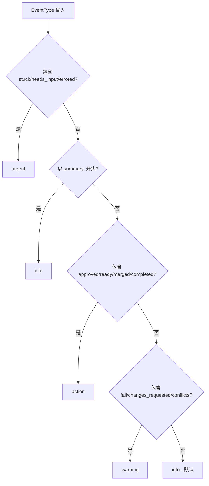
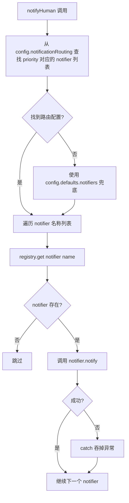
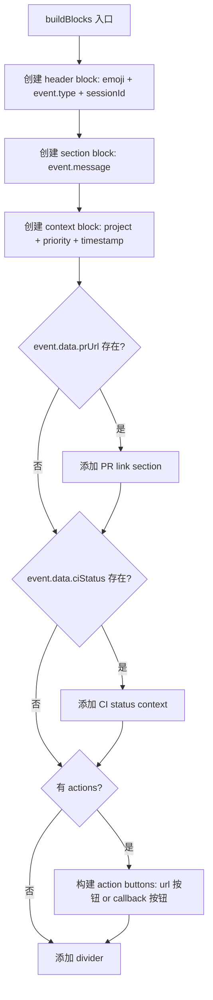

# PD-127.01 Agent Orchestrator — 插件化优先级通知路由

> 文档编号：PD-127.01
> 来源：Agent Orchestrator `packages/core/src/lifecycle-manager.ts`, `packages/plugins/notifier-*/`
> GitHub：https://github.com/ComposioHQ/agent-orchestrator.git
> 问题域：PD-127 通知路由 Notification Routing
> 状态：可复用方案

---

## 第 1 章 问题与动机

### 1.1 核心问题

Agent 编排系统中，多个 AI Agent 并行运行（PR 创建、CI 修复、代码审查等），人类操作者"走开"后需要被精准召回。核心挑战：

1. **信息过载**：36 种事件类型（session/PR/CI/review/merge/reaction），全部推送会淹没人类
2. **渠道差异**：桌面通知适合紧急中断，Slack 适合团队可见，Webhook 适合自动化集成，邮件适合异步通知
3. **优先级路由**：`session.stuck`（Agent 卡住）需要立即桌面弹窗 + 声音，而 `ci.passing` 只需静默记录
4. **插件化扩展**：不同团队使用不同通知渠道，系统不能硬编码渠道逻辑

Agent Orchestrator 的设计哲学是 **"Push, not pull. The human never polls."**（`types.ts:643`）——人类不应该主动检查状态，系统应该在正确的时机、通过正确的渠道、以正确的优先级推送通知。

### 1.2 Agent Orchestrator 的解法概述

1. **4 级优先级推断**：`inferPriority()` 函数基于事件类型关键词自动推断 urgent/action/warning/info（`lifecycle-manager.ts:57-76`）
2. **配置驱动路由表**：`notificationRouting` 将每个优先级映射到 notifier 名称数组，支持用户覆盖默认路由（`config.ts:99-104`）
3. **插件注册表**：4 种 notifier（desktop/slack/webhook/composio）通过统一 `PluginModule<Notifier>` 接口注册，运行时按名称查找（`plugin-registry.ts:62-119`）
4. **反应-升级链**：事件先尝试自动反应（send-to-agent），重试超限后升级为人类通知（`lifecycle-manager.ts:291-344`）
5. **静默降级**：notifier 失败时 catch 吞掉异常，不阻塞主流程（`lifecycle-manager.ts:428-430`）

### 1.3 设计思想

| 设计原则 | 具体实现 | 理由 | 替代方案 |
|----------|----------|------|----------|
| 关键词推断优先级 | `inferPriority()` 用 `includes("stuck")` 等字符串匹配 | 36 种事件类型逐一映射太冗长，关键词覆盖更简洁 | 显式 Map 映射每种 EventType → Priority |
| 配置驱动路由 | `notificationRouting[priority]` 返回 notifier 名称数组 | 不同团队/项目需要不同路由策略 | 硬编码 if-else 分支 |
| 插件 slot 机制 | `registry.get<Notifier>("notifier", name)` 按 slot+name 查找 | 统一管理 7 种插件类型（runtime/agent/workspace/tracker/scm/notifier/terminal） | 每种插件类型独立注册表 |
| 失败静默 | `catch {}` 吞掉 notifier 异常 | 通知是辅助功能，不应影响核心编排流程 | 重试队列 + 死信 |
| 反应升级 | retries + escalateAfter 触发 `reaction.escalated` 事件 | Agent 自动修复失败后才打扰人类，减少不必要中断 | 立即通知人类 |

---

## 第 2 章 源码实现分析

### 2.1 架构概览

Agent Orchestrator 的通知路由系统由三层组成：事件产生层（lifecycle-manager 状态机）、路由决策层（priority → notifier 映射）、通知执行层（4 种 notifier 插件）。

```
┌─────────────────────────────────────────────────────────────────┐
│                    Lifecycle Manager (轮询层)                     │
│  pollAll() → checkSession() → statusToEventType() → createEvent()│
│                         ↓                                        │
│              eventToReactionKey() ──→ executeReaction()           │
│                    ↓ (无反应 or 升级)                              │
│              inferPriority() → notifyHuman()                     │
└──────────────────────────┬──────────────────────────────────────┘
                           │
              notificationRouting[priority]
                           │
          ┌────────────────┼────────────────┐
          ↓                ↓                ↓
   ┌──────────┐    ┌──────────┐    ┌──────────────┐
   │ desktop  │    │  slack   │    │   webhook    │
   │ osascript│    │ Block Kit│    │ HTTP POST    │
   │ notify-  │    │ Webhook  │    │ + retry      │
   │ send     │    │          │    │              │
   └──────────┘    └──────────┘    └──────────────┘
                                          │
                                   ┌──────────────┐
                                   │  composio    │
                                   │ Slack/Discord│
                                   │ /Gmail SDK   │
                                   └──────────────┘
```

### 2.2 核心实现

#### 2.2.1 优先级推断引擎



对应源码 `packages/core/src/lifecycle-manager.ts:57-76`：

```typescript
function inferPriority(type: EventType): EventPriority {
  if (type.includes("stuck") || type.includes("needs_input") || type.includes("errored")) {
    return "urgent";
  }
  if (type.startsWith("summary.")) {
    return "info";
  }
  if (
    type.includes("approved") ||
    type.includes("ready") ||
    type.includes("merged") ||
    type.includes("completed")
  ) {
    return "action";
  }
  if (type.includes("fail") || type.includes("changes_requested") || type.includes("conflicts")) {
    return "warning";
  }
  return "info";
}
```

这个设计用字符串 `includes()` 而非显式映射表，因为 36 种 EventType 中存在明显的关键词模式。新增事件类型时只要遵循命名约定（如 `xxx.failed`），就自动获得正确优先级。

#### 2.2.2 核心路由函数 notifyHuman



对应源码 `packages/core/src/lifecycle-manager.ts:418-433`：

```typescript
async function notifyHuman(event: OrchestratorEvent, priority: EventPriority): Promise<void> {
  const eventWithPriority = { ...event, priority };
  const notifierNames = config.notificationRouting[priority] ?? config.defaults.notifiers;

  for (const name of notifierNames) {
    const notifier = registry.get<Notifier>("notifier", name);
    if (notifier) {
      try {
        await notifier.notify(eventWithPriority);
      } catch {
        // Notifier failed — not much we can do
      }
    }
  }
}
```

关键设计点：
- **顺序执行而非并行**：`for...of` 串行调用每个 notifier，确保日志顺序可预测
- **双层兜底**：先查 `notificationRouting[priority]`，未配置则用 `defaults.notifiers`
- **静默失败**：`catch {}` 确保单个 notifier 故障不影响其他 notifier 和主流程

#### 2.2.3 Slack Block Kit 富消息构建



对应源码 `packages/plugins/notifier-slack/src/index.ts:26-118`：

```typescript
function buildBlocks(event: OrchestratorEvent, actions?: NotifyAction[]): unknown[] {
  const blocks: unknown[] = [
    {
      type: "header",
      text: {
        type: "plain_text",
        text: `${PRIORITY_EMOJI[event.priority]} ${event.type} — ${event.sessionId}`,
        emoji: true,
      },
    },
    {
      type: "section",
      text: { type: "mrkdwn", text: event.message },
    },
    {
      type: "context",
      elements: [{
        type: "mrkdwn",
        text: `*Project:* ${event.projectId} | *Priority:* ${event.priority} | *Time:* <!date^${Math.floor(event.timestamp.getTime() / 1000)}^{date_short_pretty} {time}|${event.timestamp.toISOString()}>`,
      }],
    },
  ];

  // 条件性添加 PR link 和 CI status blocks
  const prUrl = typeof event.data.prUrl === "string" ? event.data.prUrl : undefined;
  if (prUrl) {
    blocks.push({ type: "section", text: { type: "mrkdwn", text: `:github: <${prUrl}|View Pull Request>` } });
  }

  // Action buttons with sanitized IDs
  if (actions && actions.length > 0) {
    const elements = actions.filter((a) => a.url || a.callbackEndpoint).map((action) => {
      if (action.url) {
        return { type: "button", text: { type: "plain_text", text: action.label, emoji: true }, url: action.url };
      }
      const sanitized = action.label.toLowerCase().replace(/[^a-z0-9]+/g, "_").replace(/^_|_$/g, "");
      const idx = actions.indexOf(action);
      return { type: "button", text: { type: "plain_text", text: action.label, emoji: true }, action_id: `ao_${sanitized}_${idx}`, value: action.callbackEndpoint };
    });
    if (elements.length > 0) blocks.push({ type: "actions", elements });
  }

  blocks.push({ type: "divider" });
  return blocks;
}
```

### 2.3 实现细节

#### 插件注册与发现机制

所有 notifier 通过 `BUILTIN_PLUGINS` 数组声明（`plugin-registry.ts:42-46`），`loadBuiltins()` 动态 import 每个包，调用 `plugin.create(config)` 实例化后存入 `PluginMap`（key 格式 `"notifier:slack"`）。

```typescript
// plugin-registry.ts:42-46 — 4 种 notifier 声明
{ slot: "notifier", name: "composio", pkg: "@composio/ao-plugin-notifier-composio" },
{ slot: "notifier", name: "desktop",  pkg: "@composio/ao-plugin-notifier-desktop" },
{ slot: "notifier", name: "slack",    pkg: "@composio/ao-plugin-notifier-slack" },
{ slot: "notifier", name: "webhook",  pkg: "@composio/ao-plugin-notifier-webhook" },
```

每个 notifier 导出统一的 `PluginModule<Notifier>` 接口（`types.ts:942-945`）：
- `manifest`: 包含 name、slot、description、version
- `create(config?)`: 工厂函数，返回 `Notifier` 实例

#### Webhook 指数退避重试

`notifier-webhook` 实现了智能重试策略（`notifier-webhook/src/index.ts:47-89`）：
- 仅对 429（限流）和 5xx（服务端错误）重试
- 4xx 客户端错误立即抛出，不浪费重试次数
- 指数退避：`delay * 2^attempt`（默认 1000ms → 2000ms → 4000ms）
- 可配置 `retries`（默认 2）和 `retryDelayMs`（默认 1000）

#### 反应升级链

`executeReaction()`（`lifecycle-manager.ts:291-408`）实现了"先让 Agent 自己解决，解决不了再通知人类"的策略：
1. 每次触发递增 `tracker.attempts`
2. 超过 `maxRetries` 或超过 `escalateAfter` 时间/次数 → 升级
3. 升级时创建 `reaction.escalated` 事件，以 `urgent` 优先级通知人类
4. 未升级时执行配置的 action：`send-to-agent`（发消息给 Agent）、`notify`（直接通知）、`auto-merge`（自动合并）

#### Desktop 跨平台适配

`notifier-desktop`（`notifier-desktop/src/index.ts:55-88`）根据 `platform()` 分发：
- **macOS**: `osascript -e 'display notification ...'`，urgent 时附加 `sound name "default"`
- **Linux**: `notify-send`，urgent 时附加 `--urgency=critical`
- **其他 OS**: `console.warn` 静默降级

#### Composio 统一通知网关

`notifier-composio`（`notifier-composio/src/index.ts:132-276`）是最复杂的 notifier：
- 支持 Slack/Discord/Gmail 三种后端，通过 `defaultApp` 配置切换
- 懒加载 `composio-core` SDK（可选依赖），未安装时静默降级
- 30 秒超时保护（`executeWithTimeout`，`notifier-composio/src/index.ts:197-231`）
- 支持 `_clientOverride` 注入 mock 客户端用于测试

---

## 第 3 章 迁移指南

### 3.1 迁移清单

**阶段 1：定义通知接口与事件模型**
- [ ] 定义 `EventPriority` 类型（urgent/action/warning/info）
- [ ] 定义 `OrchestratorEvent` 接口（id, type, priority, message, data, timestamp）
- [ ] 定义 `Notifier` 接口（notify, notifyWithActions?, post?）
- [ ] 定义 `NotifyAction` 接口（label, url?, callbackEndpoint?）

**阶段 2：实现优先级推断与路由核心**
- [ ] 实现 `inferPriority(eventType)` 函数，基于事件类型关键词推断优先级
- [ ] 实现 `notifyHuman(event, priority)` 路由函数，从配置查找 notifier 列表并逐一调用
- [ ] 定义 `notificationRouting` 配置结构（priority → notifier 名称数组）

**阶段 3：实现 Notifier 插件**
- [ ] 实现至少一个 notifier（推荐先做 webhook，最通用）
- [ ] 按需添加 desktop/slack/composio notifier
- [ ] 确保每个 notifier 的 `create()` 工厂函数处理缺失配置（静默降级）

**阶段 4：集成反应升级链（可选）**
- [ ] 实现 `executeReaction()` 带重试计数和时间窗口升级
- [ ] 配置 `reactions` 映射表（事件 → 自动反应 → 升级通知）

### 3.2 适配代码模板

以下是一个可直接运行的最小化通知路由系统：

```typescript
// types.ts — 核心类型定义
export type EventPriority = "urgent" | "action" | "warning" | "info";

export interface NotifyEvent {
  id: string;
  type: string;
  priority: EventPriority;
  message: string;
  data: Record<string, unknown>;
  timestamp: Date;
}

export interface NotifyAction {
  label: string;
  url?: string;
  callbackEndpoint?: string;
}

export interface Notifier {
  readonly name: string;
  notify(event: NotifyEvent): Promise<void>;
  notifyWithActions?(event: NotifyEvent, actions: NotifyAction[]): Promise<void>;
}

// priority-inference.ts — 优先级推断（可根据业务定制关键词）
export function inferPriority(eventType: string): EventPriority {
  if (/stuck|needs_input|errored|crash/.test(eventType)) return "urgent";
  if (/approved|ready|merged|completed/.test(eventType)) return "action";
  if (/fail|rejected|conflict/.test(eventType)) return "warning";
  return "info";
}

// notification-router.ts — 路由核心
export interface NotificationRouterConfig {
  routing: Record<EventPriority, string[]>;
  defaultNotifiers: string[];
}

export class NotificationRouter {
  private notifiers = new Map<string, Notifier>();

  constructor(private config: NotificationRouterConfig) {}

  register(notifier: Notifier): void {
    this.notifiers.set(notifier.name, notifier);
  }

  async notify(event: NotifyEvent): Promise<void> {
    const names = this.config.routing[event.priority] ?? this.config.defaultNotifiers;
    for (const name of names) {
      const notifier = this.notifiers.get(name);
      if (notifier) {
        try {
          await notifier.notify(event);
        } catch {
          // 静默降级：notifier 失败不阻塞主流程
        }
      }
    }
  }
}

// webhook-notifier.ts — 最小 Webhook Notifier 实现
export function createWebhookNotifier(url: string, retries = 2): Notifier {
  return {
    name: "webhook",
    async notify(event: NotifyEvent): Promise<void> {
      let lastError: Error | undefined;
      for (let attempt = 0; attempt <= retries; attempt++) {
        try {
          const res = await fetch(url, {
            method: "POST",
            headers: { "Content-Type": "application/json" },
            body: JSON.stringify({ type: "notification", event }),
          });
          if (res.ok) return;
          lastError = new Error(`Webhook failed (${res.status})`);
          if (res.status < 500 && res.status !== 429) throw lastError;
        } catch (err) {
          if (err === lastError) throw err;
          lastError = err instanceof Error ? err : new Error(String(err));
        }
        if (attempt < retries) {
          await new Promise((r) => setTimeout(r, 1000 * 2 ** attempt));
        }
      }
      throw lastError!;
    },
  };
}
```

### 3.3 适用场景

| 场景 | 适用度 | 说明 |
|------|--------|------|
| 多 Agent 编排系统 | ⭐⭐⭐ | 核心场景：Agent 并行运行，人类需要被精准召回 |
| CI/CD 流水线通知 | ⭐⭐⭐ | 36 种事件类型覆盖完整 PR/CI/Review 生命周期 |
| 微服务告警路由 | ⭐⭐ | 优先级路由模式可复用，但需替换事件类型定义 |
| 单 Agent 应用 | ⭐ | 过度设计，直接发通知即可 |
| 实时聊天系统 | ⭐ | 需要双向通信，单向 push 模型不够 |

---

## 第 4 章 测试用例

```typescript
import { describe, it, expect, vi, beforeEach } from "vitest";

// 模拟 Notifier 接口
interface MockNotifier {
  name: string;
  notify: ReturnType<typeof vi.fn>;
  notifyWithActions?: ReturnType<typeof vi.fn>;
}

function createMockNotifier(name: string): MockNotifier {
  return {
    name,
    notify: vi.fn().mockResolvedValue(undefined),
    notifyWithActions: vi.fn().mockResolvedValue(undefined),
  };
}

function createTestEvent(type: string, priority: "urgent" | "action" | "warning" | "info") {
  return {
    id: "test-id",
    type,
    priority,
    message: `Test: ${type}`,
    data: {},
    timestamp: new Date(),
  };
}

describe("inferPriority", () => {
  it("should return urgent for stuck/needs_input/errored events", () => {
    expect(inferPriority("session.stuck")).toBe("urgent");
    expect(inferPriority("session.needs_input")).toBe("urgent");
    expect(inferPriority("session.errored")).toBe("urgent");
  });

  it("should return action for approved/ready/merged/completed events", () => {
    expect(inferPriority("review.approved")).toBe("action");
    expect(inferPriority("merge.ready")).toBe("action");
    expect(inferPriority("merge.completed")).toBe("action");
  });

  it("should return warning for fail/changes_requested/conflicts events", () => {
    expect(inferPriority("ci.failing")).toBe("warning");
    expect(inferPriority("review.changes_requested")).toBe("warning");
    expect(inferPriority("merge.conflicts")).toBe("warning");
  });

  it("should return info as default", () => {
    expect(inferPriority("session.working")).toBe("info");
    expect(inferPriority("summary.all_complete")).toBe("info");
  });
});

describe("NotificationRouter", () => {
  let desktop: MockNotifier;
  let slack: MockNotifier;
  let webhook: MockNotifier;
  let router: NotificationRouter;

  beforeEach(() => {
    desktop = createMockNotifier("desktop");
    slack = createMockNotifier("slack");
    webhook = createMockNotifier("webhook");
    router = new NotificationRouter({
      routing: {
        urgent: ["desktop", "slack"],
        action: ["desktop", "slack"],
        warning: ["slack"],
        info: ["webhook"],
      },
      defaultNotifiers: ["webhook"],
    });
    router.register(desktop);
    router.register(slack);
    router.register(webhook);
  });

  it("should route urgent events to desktop + slack", async () => {
    const event = createTestEvent("session.stuck", "urgent");
    await router.notify(event);
    expect(desktop.notify).toHaveBeenCalledWith(event);
    expect(slack.notify).toHaveBeenCalledWith(event);
    expect(webhook.notify).not.toHaveBeenCalled();
  });

  it("should route info events to webhook only", async () => {
    const event = createTestEvent("session.working", "info");
    await router.notify(event);
    expect(webhook.notify).toHaveBeenCalledWith(event);
    expect(desktop.notify).not.toHaveBeenCalled();
  });

  it("should silently skip failed notifiers", async () => {
    desktop.notify.mockRejectedValue(new Error("Desktop unavailable"));
    const event = createTestEvent("session.stuck", "urgent");
    await router.notify(event); // 不应抛出
    expect(slack.notify).toHaveBeenCalledWith(event); // slack 仍被调用
  });

  it("should use defaultNotifiers when priority not in routing", async () => {
    const customRouter = new NotificationRouter({
      routing: { urgent: ["desktop"], action: [], warning: [], info: [] },
      defaultNotifiers: ["webhook"],
    });
    customRouter.register(desktop);
    customRouter.register(webhook);
    // 空数组是有效配置，不会 fallback
    const event = createTestEvent("review.approved", "action");
    await customRouter.notify(event);
  });

  it("should skip non-registered notifiers gracefully", async () => {
    const event = createTestEvent("session.stuck", "urgent");
    // desktop 和 slack 在路由中，但如果 slack 未注册也不应报错
    const minRouter = new NotificationRouter({
      routing: { urgent: ["desktop", "nonexistent"], action: [], warning: [], info: [] },
      defaultNotifiers: [],
    });
    minRouter.register(desktop);
    await minRouter.notify(event); // 不应抛出
    expect(desktop.notify).toHaveBeenCalled();
  });
});

describe("WebhookNotifier retry logic", () => {
  it("should retry on 5xx and succeed on second attempt", async () => {
    const fetchMock = vi.fn()
      .mockResolvedValueOnce({ ok: false, status: 502, text: async () => "Bad Gateway" })
      .mockResolvedValueOnce({ ok: true });
    global.fetch = fetchMock;

    const notifier = createWebhookNotifier("https://example.com/hook", 2);
    const event = createTestEvent("ci.failing", "warning");
    await notifier.notify(event);
    expect(fetchMock).toHaveBeenCalledTimes(2);
  });

  it("should NOT retry on 4xx client errors", async () => {
    const fetchMock = vi.fn()
      .mockResolvedValueOnce({ ok: false, status: 401, text: async () => "Unauthorized" });
    global.fetch = fetchMock;

    const notifier = createWebhookNotifier("https://example.com/hook", 2);
    const event = createTestEvent("ci.failing", "warning");
    await expect(notifier.notify(event)).rejects.toThrow("Webhook failed (401)");
    expect(fetchMock).toHaveBeenCalledTimes(1); // 不重试
  });
});
```

---

## 第 5 章 跨域关联

| 关联域 | 关系类型 | 说明 |
|--------|----------|------|
| PD-02 多 Agent 编排 | 依赖 | 通知路由的事件源来自多 Agent 编排的状态转换（session lifecycle、PR lifecycle），编排层产生事件，通知层消费事件 |
| PD-09 Human-in-the-Loop | 协同 | 通知路由是 HITL 的"推送端"——当 Agent 需要人类输入时（`session.needs_input`），通过 urgent 优先级召回人类；反应升级链（`executeReaction`）是自动化与人工介入的桥梁 |
| PD-10 中间件管道 | 协同 | 插件注册表（`PluginRegistry`）本质是一个简化的中间件系统，notifier 作为 "notifier" slot 的插件被统一管理，与 runtime/agent/workspace 等 slot 共享注册发现机制 |
| PD-03 容错与重试 | 协同 | Webhook notifier 的指数退避重试（`postWithRetry`）和 Composio notifier 的 30s 超时保护是容错模式在通知层的具体应用；`notifyHuman` 的 catch 静默降级也是容错策略 |
| PD-11 可观测性 | 协同 | 通知事件本身就是可观测性数据——36 种 EventType 覆盖了 Agent 全生命周期状态，`OrchestratorEvent` 的 id/timestamp/data 字段支持事件溯源 |
| PD-04 工具系统 | 协同 | Composio notifier 通过 `executeAction()` 调用外部工具（Slack/Discord/Gmail），本质是将通知作为工具调用执行，复用了 Composio 的工具执行基础设施 |

---

## 第 6 章 来源文件索引

| 文件 | 行范围 | 关键实现 |
|------|--------|----------|
| `packages/core/src/types.ts` | L645-L669 | Notifier/NotifyAction/NotifyContext 接口定义 |
| `packages/core/src/types.ts` | L696-L748 | EventPriority/EventType/OrchestratorEvent 类型定义 |
| `packages/core/src/config.ts` | L88-L104 | 默认 notifiers 配置 + notificationRouting 路由表 |
| `packages/core/src/plugin-registry.ts` | L26-L50 | BUILTIN_PLUGINS 声明（含 4 种 notifier） |
| `packages/core/src/plugin-registry.ts` | L62-L119 | createPluginRegistry() 注册/查找/加载实现 |
| `packages/core/src/lifecycle-manager.ts` | L57-L76 | inferPriority() 优先级推断函数 |
| `packages/core/src/lifecycle-manager.ts` | L78-L99 | createEvent() 事件工厂 |
| `packages/core/src/lifecycle-manager.ts` | L102-L131 | statusToEventType() 状态→事件映射 |
| `packages/core/src/lifecycle-manager.ts` | L134-L157 | eventToReactionKey() 事件→反应映射 |
| `packages/core/src/lifecycle-manager.ts` | L291-L408 | executeReaction() 反应执行 + 升级逻辑 |
| `packages/core/src/lifecycle-manager.ts` | L418-L433 | notifyHuman() 核心路由函数 |
| `packages/core/src/lifecycle-manager.ts` | L435-L521 | checkSession() 状态轮询 + 事件触发 |
| `packages/plugins/notifier-slack/src/index.ts` | L26-L118 | buildBlocks() Slack Block Kit 构建 |
| `packages/plugins/notifier-slack/src/index.ts` | L133-L186 | Slack notifier create() 工厂 |
| `packages/plugins/notifier-webhook/src/index.ts` | L17-L36 | WebhookPayload 接口（3 种消息类型） |
| `packages/plugins/notifier-webhook/src/index.ts` | L47-L89 | postWithRetry() 指数退避重试 |
| `packages/plugins/notifier-webhook/src/index.ts` | L104-L172 | Webhook notifier create() 工厂 |
| `packages/plugins/notifier-desktop/src/index.ts` | L28-L31 | shouldPlaySound() 仅 urgent 播放声音 |
| `packages/plugins/notifier-desktop/src/index.ts` | L55-L88 | sendNotification() 跨平台桌面通知 |
| `packages/plugins/notifier-composio/src/index.ts` | L24-L30 | APP_TOOL_SLUG 多平台工具映射 |
| `packages/plugins/notifier-composio/src/index.ts` | L52-L78 | loadComposioSDK() 懒加载可选依赖 |
| `packages/plugins/notifier-composio/src/index.ts` | L197-L231 | executeWithTimeout() 30s 超时保护 |

---

## 第 7 章 横向对比维度

```json comparison_data
{
  "project": "agent-orchestrator",
  "dimensions": {
    "路由机制": "配置驱动 priority→notifier[] 映射表，支持用户覆盖默认路由",
    "优先级模型": "4 级（urgent/action/warning/info），关键词 includes() 自动推断",
    "插件架构": "slot:name 注册表，PluginModule<Notifier> 统一接口，动态 import 加载",
    "渠道数量": "4 种内置（desktop/slack/webhook/composio），composio 再分发到 Slack/Discord/Gmail",
    "容错策略": "notifier 失败 catch 静默，webhook 指数退避重试，composio 30s 超时",
    "富消息支持": "Slack Block Kit（header/section/context/actions），支持 PR link 和 CI status 条件块",
    "升级机制": "反应链 retries+escalateAfter 超限后升级为 urgent 人类通知"
  }
}
```

### 域元数据补充

```json domain_metadata
{
  "solution_summary": "agent-orchestrator 用 4 级 priority 配置驱动路由表 + slot:name 插件注册表，将 36 种 Agent 生命周期事件路由到 desktop/slack/webhook/composio 四种 notifier，支持反应升级链",
  "description": "Agent 编排系统中事件驱动的多渠道通知分发与自动升级机制",
  "sub_problems": [
    "反应升级链（自动重试→超限升级为人类通知）",
    "跨平台桌面通知适配（macOS osascript / Linux notify-send）",
    "可选依赖懒加载与静默降级（composio-core SDK）",
    "事件类型到优先级的自动推断规则"
  ],
  "best_practices": [
    "用关键词 includes() 推断优先级，新事件类型自动匹配无需显式映射",
    "Webhook 仅对 429/5xx 重试，4xx 立即失败避免浪费重试次数",
    "Composio SDK 懒加载 + 30s 超时保护，未安装时静默降级为 no-op",
    "Slack action button ID 做 sanitize 防止特殊字符导致 API 报错"
  ]
}
```
