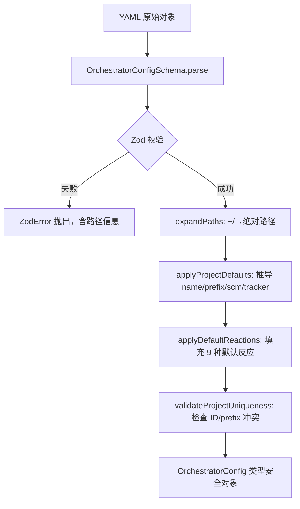
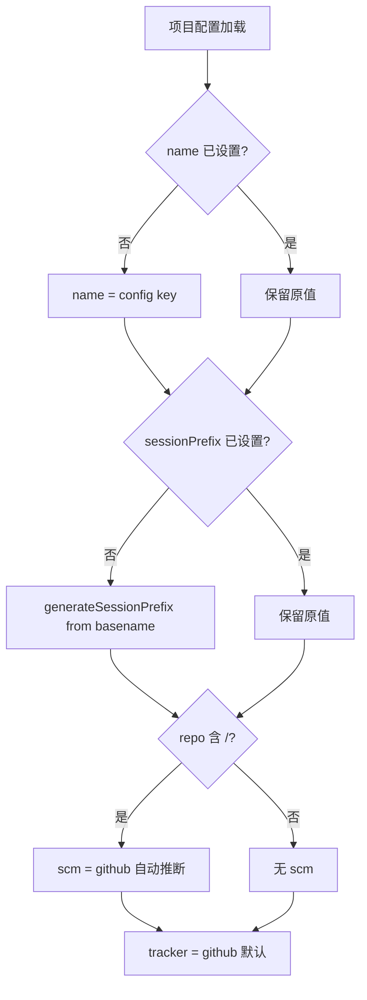
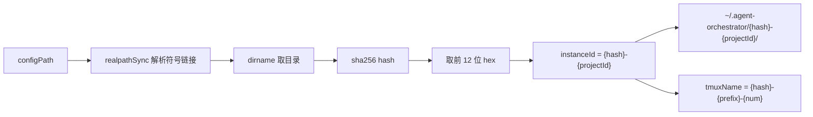

# PD-128.01 AgentOrchestrator — YAML + Zod + Convention-over-Configuration 配置驱动编排

> 文档编号：PD-128.01
> 来源：AgentOrchestrator `packages/core/src/config.ts`, `packages/core/src/paths.ts`, `packages/cli/src/commands/init.ts`
> GitHub：https://github.com/ComposioHQ/agent-orchestrator.git
> 问题域：PD-128 配置驱动编排 Config-Driven Orchestration
> 状态：可复用方案

---

## 第 1 章 问题与动机

### 1.1 核心问题

多 Agent 编排系统需要管理大量运行时配置：项目路径、插件选择、反应规则、通知路由、会话前缀等。如果这些配置散落在代码中或通过命令行参数传递，会导致：

1. **配置爆炸**：每个项目 × 每个插件槽位 × 每个反应规则的组合数量巨大，命令行参数无法承载
2. **命名空间冲突**：多个用户或多个配置文件管理同一台机器上的 Agent 会话时，tmux session 名称、数据目录可能冲突
3. **启动摩擦**：新用户需要手动配置十几个参数才能启动第一个 Agent 会话
4. **配置校验滞后**：YAML 解析后如果不做 schema 校验，运行时才发现配置错误，浪费时间和 token

### 1.2 AgentOrchestrator 的解法概述

AgentOrchestrator 采用三层配置架构解决上述问题：

1. **单一 YAML 声明文件** (`agent-orchestrator.yaml`)：所有项目、插件、反应规则集中声明，支持 4 级配置文件发现（环境变量 → 目录树上溯 → 显式路径 → 家目录）(`config.ts:289-349`)
2. **Zod Schema 严格校验**：12 个嵌套 Schema 在加载时即刻校验，类型安全贯穿全链路 (`config.ts:25-106`)
3. **Convention-over-Configuration 自动推导**：`sessionPrefix` 从项目路径 basename 自动生成（4 种启发式规则），`scm`/`tracker` 从 repo URL 自动推断，默认反应规则自动填充 (`config.ts:130-278`)
4. **SHA-256 Hash 全局命名空间**：对配置文件所在目录取 sha256 前 12 位作为命名空间前缀，确保多配置文件共存时数据目录和 tmux 会话名全局唯一 (`paths.ts:20-25`)
5. **交互式 Init 向导**：`ao init` 自动检测环境（git/tmux/gh/Linear），生成开箱即用的配置文件 (`init.ts:152-518`)

### 1.3 设计思想

| 设计原则 | 具体实现 | 理由 | 替代方案 |
|----------|----------|------|----------|
| 单一事实源 | 一个 YAML 文件声明所有配置 | 避免配置散落在环境变量、CLI 参数、代码常量中 | 多文件配置（如 Kubernetes 的多 YAML） |
| Schema-First | Zod Schema 定义在加载前，parse 即校验 | 类型安全 + 早期失败，避免运行时 undefined | JSON Schema + ajv 外部校验 |
| Convention > Configuration | sessionPrefix/scm/tracker 自动推导 | 最小化必填项，2 行配置即可启动 | 全部显式声明（如 Terraform） |
| Hash 命名空间 | sha256(configDir).slice(0,12) 作为前缀 | 多配置文件共存时防止 tmux/目录冲突 | UUID 随机命名（不可预测） |
| 渐进式配置 | 默认值 → 全局 defaults → 项目级覆盖 → 反应规则合并 | 简单场景零配置，复杂场景可精细控制 | 扁平配置（无层级覆盖） |
| 环境感知初始化 | init 自动检测 git/tmux/gh/Linear/项目类型 | 降低首次使用门槛 | 手动编写配置文件 |

---

## 第 2 章 源码实现分析

### 2.1 架构概览

AgentOrchestrator 的配置系统由三个核心模块组成，形成从声明到运行时的完整链路：

```
┌─────────────────────────────────────────────────────────────────┐
│                    agent-orchestrator.yaml                       │
│  (单一声明文件：projects + defaults + reactions + notifiers)     │
└──────────────────────────┬──────────────────────────────────────┘
                           │ findConfigFile() — 4 级发现
                           ▼
┌─────────────────────────────────────────────────────────────────┐
│                     config.ts — 配置加载器                       │
│  ┌──────────┐  ┌──────────────┐  ┌───────────────────────────┐ │
│  │ Zod      │→ │ expandPaths  │→ │ applyProjectDefaults      │ │
│  │ Schema   │  │ (~/ → abs)   │  │ (name/prefix/scm/tracker) │ │
│  │ .parse() │  └──────────────┘  └───────────────────────────┘ │
│  └──────────┘                              │                    │
│                    ┌───────────────────────┐│                   │
│                    │ applyDefaultReactions ││                   │
│                    │ (9 种默认反应规则)     ││                   │
│                    └───────────────────────┘│                   │
│                    ┌───────────────────────┐│                   │
│                    │ validateProjectUnique ││                   │
│                    │ (ID + prefix 去重)    ││                   │
│                    └───────────────────────┘│                   │
└──────────────────────────┬──────────────────────────────────────┘
                           │ OrchestratorConfig
                           ▼
┌─────────────────────────────────────────────────────────────────┐
│                     paths.ts — 路径生成器                        │
│  configPath → sha256 hash → instanceId → projectBaseDir         │
│  sessionPrefix → generateSessionPrefix (4 种启发式)              │
│  tmuxName = {hash}-{prefix}-{num} (全局唯一)                    │
│  .origin 文件 → hash 碰撞检测                                   │
└─────────────────────────────────────────────────────────────────┘
```

### 2.2 核心实现

#### 2.2.1 Zod Schema 层级校验



对应源码 `packages/core/src/config.ts:91-106`：

```typescript
const OrchestratorConfigSchema = z.object({
  port: z.number().default(3000),
  terminalPort: z.number().optional(),
  directTerminalPort: z.number().optional(),
  readyThresholdMs: z.number().nonnegative().default(300_000),
  defaults: DefaultPluginsSchema.default({}),
  projects: z.record(ProjectConfigSchema),
  notifiers: z.record(NotifierConfigSchema).default({}),
  notificationRouting: z.record(z.array(z.string())).default({
    urgent: ["desktop", "composio"],
    action: ["desktop", "composio"],
    warning: ["composio"],
    info: ["composio"],
  }),
  reactions: z.record(ReactionConfigSchema).default({}),
});
```

关键设计：每个字段都有 `.default()` 或 `.optional()`，使得最小配置只需 `projects` 一个字段。`DefaultPluginsSchema` 内部也全部带默认值 (`config.ts:84-89`)：runtime 默认 tmux，agent 默认 claude-code，workspace 默认 worktree。

#### 2.2.2 Convention-over-Configuration 自动推导



对应源码 `packages/core/src/config.ts:130-155`：

```typescript
function applyProjectDefaults(config: OrchestratorConfig): OrchestratorConfig {
  for (const [id, project] of Object.entries(config.projects)) {
    // Derive name from project ID if not set
    if (!project.name) {
      project.name = id;
    }
    // Derive session prefix from project path basename if not set
    if (!project.sessionPrefix) {
      const projectId = basename(project.path);
      project.sessionPrefix = generateSessionPrefix(projectId);
    }
    // Infer SCM from repo if not set
    if (!project.scm && project.repo.includes("/")) {
      project.scm = { plugin: "github" };
    }
    // Infer tracker from repo if not set (default to github issues)
    if (!project.tracker) {
      project.tracker = { plugin: "github" };
    }
  }
  return config;
}
```

`generateSessionPrefix` 实现了 4 种启发式规则 (`paths.ts:55-78`)：
- ≤4 字符：直接小写（`api` → `api`）
- CamelCase：提取大写字母（`PyTorch` → `pt`）
- kebab/snake_case：取首字母（`agent-orchestrator` → `ao`）
- 单词：取前 3 字符（`integrator` → `int`）

### 2.3 实现细节

#### SHA-256 Hash 命名空间

核心思路：不同目录下的 `agent-orchestrator.yaml` 管理不同的项目集合，它们的数据目录和 tmux 会话名不能冲突。



对应源码 `packages/core/src/paths.ts:20-25`：

```typescript
export function generateConfigHash(configPath: string): string {
  const resolved = realpathSync(configPath);
  const configDir = dirname(resolved);
  const hash = createHash("sha256").update(configDir).digest("hex");
  return hash.slice(0, 12);
}
```

#### Hash 碰撞检测

每个项目目录下存储 `.origin` 文件，记录创建该目录的配置文件路径。如果两个不同配置文件产生相同 hash（概率极低但非零），在 `validateAndStoreOrigin` 中会抛出明确错误 (`paths.ts:173-194`)。

#### 4 级配置文件发现

`findConfigFile` 实现了类似 git 的配置文件查找策略 (`config.ts:289-349`)：

1. `AO_CONFIG_PATH` 环境变量（最高优先级）
2. 从 CWD 向上遍历目录树查找 `agent-orchestrator.yaml`/`.yml`
3. 显式 `startDir` 参数
4. 家目录：`~/.agent-orchestrator.yaml`、`~/.config/agent-orchestrator/config.yaml`

#### 默认反应规则系统

`applyDefaultReactions` 预置了 9 种自动反应规则 (`config.ts:215-278`)，覆盖 Agent 编排的核心场景：

| 反应规则 | 动作 | 说明 |
|----------|------|------|
| ci-failed | send-to-agent | 自动发送修复指令，重试 2 次后升级 |
| changes-requested | send-to-agent | 转发 review 评论，30 分钟后升级 |
| bugbot-comments | send-to-agent | 转发自动化审查评论 |
| merge-conflicts | send-to-agent | 发送 rebase 指令，15 分钟后升级 |
| approved-and-green | notify (手动) | 通知人类可以合并 |
| agent-stuck | notify (urgent) | 10 分钟无活动则告警 |
| agent-needs-input | notify (urgent) | Agent 等待输入时告警 |
| agent-exited | notify (urgent) | Agent 进程退出告警 |
| all-complete | notify (info) | 所有会话完成时汇总通知 |

用户配置的 reactions 会与默认值合并（用户优先）：`config.reactions = { ...defaults, ...config.reactions }`。

#### 三层 Prompt 组装

配置不仅驱动运行时行为，还驱动 Agent 的 prompt 生成。`prompt-builder.ts` 实现了三层 prompt 组装 (`prompt-builder.ts:148-178`)：

1. **Layer 1 — BASE_AGENT_PROMPT**：固定的会话生命周期、Git 工作流、PR 最佳实践指令
2. **Layer 2 — Config-derived context**：从配置中提取项目名、repo、默认分支、tracker 类型、反应规则提示
3. **Layer 3 — User rules**：`agentRules`（内联）+ `agentRulesFile`（文件引用）


---

## 第 3 章 迁移指南

### 3.1 迁移清单

**阶段 1：配置 Schema 定义（核心）**

- [ ] 安装 Zod：`pnpm add zod yaml`
- [ ] 定义顶层配置 Schema（项目、插件、反应规则）
- [ ] 为每个字段设置 `.default()` 值，确保最小配置可用
- [ ] 实现 `loadConfig()` 函数：YAML 解析 → Zod parse → 后处理

**阶段 2：Convention-over-Configuration**

- [ ] 实现 `applyDefaults()` 函数，自动推导可省略字段
- [ ] 实现 `generateSessionPrefix()` 或类似的命名启发式
- [ ] 实现配置文件发现（目录树上溯 + 环境变量覆盖）

**阶段 3：命名空间隔离**

- [ ] 实现 `generateConfigHash()` 基于配置路径的 hash 命名空间
- [ ] 实现 `.origin` 文件碰撞检测
- [ ] 所有数据目录和运行时标识符加上 hash 前缀

**阶段 4：Init 向导（可选）**

- [ ] 实现环境检测（git/工具链/API key）
- [ ] 实现交互式配置生成
- [ ] 实现 `--auto` 模式（零交互生成配置）

### 3.2 适配代码模板

以下是一个可直接复用的配置加载器模板（TypeScript）：

```typescript
import { z } from "zod";
import { readFileSync, existsSync } from "node:fs";
import { resolve, dirname, basename, join } from "node:path";
import { homedir } from "node:os";
import { createHash } from "node:crypto";
import { parse as parseYaml } from "yaml";

// ---- Schema 定义 ----

const PluginRefSchema = z.object({
  plugin: z.string(),
}).passthrough();

const ProjectSchema = z.object({
  name: z.string().optional(),
  repo: z.string(),
  path: z.string(),
  defaultBranch: z.string().default("main"),
  sessionPrefix: z.string().regex(/^[a-zA-Z0-9_-]+$/).optional(),
  runtime: z.string().optional(),
  agent: z.string().optional(),
  tracker: PluginRefSchema.optional(),
});

const ConfigSchema = z.object({
  port: z.number().default(3000),
  defaults: z.object({
    runtime: z.string().default("tmux"),
    agent: z.string().default("claude-code"),
  }).default({}),
  projects: z.record(ProjectSchema),
});

type AppConfig = z.infer<typeof ConfigSchema> & { configPath: string };

// ---- Convention-over-Configuration ----

function generatePrefix(projectId: string): string {
  if (projectId.length <= 4) return projectId.toLowerCase();
  const upper = projectId.match(/[A-Z]/g);
  if (upper && upper.length > 1) return upper.join("").toLowerCase();
  if (projectId.includes("-") || projectId.includes("_")) {
    const sep = projectId.includes("-") ? "-" : "_";
    return projectId.split(sep).map(w => w[0]).join("").toLowerCase();
  }
  return projectId.slice(0, 3).toLowerCase();
}

function applyDefaults(config: AppConfig): AppConfig {
  for (const [id, project] of Object.entries(config.projects)) {
    if (!project.name) project.name = id;
    if (!project.sessionPrefix) {
      project.sessionPrefix = generatePrefix(basename(project.path));
    }
  }
  return config;
}

// ---- Hash 命名空间 ----

function configHash(configPath: string): string {
  const dir = dirname(resolve(configPath));
  return createHash("sha256").update(dir).digest("hex").slice(0, 12);
}

function instanceId(configPath: string, projectPath: string): string {
  return `${configHash(configPath)}-${basename(projectPath)}`;
}

// ---- 配置文件发现 ----

function findConfig(): string | null {
  if (process.env["APP_CONFIG_PATH"]) {
    const p = resolve(process.env["APP_CONFIG_PATH"]);
    if (existsSync(p)) return p;
  }
  let dir = process.cwd();
  while (true) {
    for (const name of ["app-config.yaml", "app-config.yml"]) {
      const p = resolve(dir, name);
      if (existsSync(p)) return p;
    }
    const parent = resolve(dir, "..");
    if (parent === dir) break;
    dir = parent;
  }
  const homeP = resolve(homedir(), ".app-config.yaml");
  return existsSync(homeP) ? homeP : null;
}

// ---- 加载入口 ----

export function loadConfig(explicitPath?: string): AppConfig {
  const path = explicitPath ?? findConfig();
  if (!path) throw new Error("No config file found. Run `app init` to create one.");
  const raw = parseYaml(readFileSync(path, "utf-8"));
  const validated = ConfigSchema.parse(raw) as AppConfig;
  validated.configPath = path;
  return applyDefaults(validated);
}
```

### 3.3 适用场景

| 场景 | 适用度 | 说明 |
|------|--------|------|
| 多项目 Agent 编排系统 | ⭐⭐⭐ | 核心场景，配置驱动多项目 + 多插件 + 多反应规则 |
| CLI 工具配置管理 | ⭐⭐⭐ | YAML + Zod + 目录树发现模式通用性强 |
| 多租户/多实例部署 | ⭐⭐⭐ | Hash 命名空间完美解决多实例共存问题 |
| 单项目简单工具 | ⭐ | 过度设计，直接用环境变量或 JSON 即可 |
| 需要动态配置热更新 | ⭐⭐ | 当前方案是启动时加载，不支持热更新 |

---

## 第 4 章 测试用例

```python
"""
测试 AgentOrchestrator 配置驱动编排的核心逻辑。
基于 packages/core/src/config.ts 和 packages/core/src/paths.ts 的真实函数签名。
"""
import hashlib
import os
import re
import tempfile
import pytest
import yaml


# ---- 模拟 generateSessionPrefix 的 4 种启发式 ----

def generate_session_prefix(project_id: str) -> str:
    """Port of paths.ts:generateSessionPrefix"""
    if len(project_id) <= 4:
        return project_id.lower()
    uppercase = re.findall(r'[A-Z]', project_id)
    if len(uppercase) > 1:
        return ''.join(uppercase).lower()
    if '-' in project_id or '_' in project_id:
        sep = '-' if '-' in project_id else '_'
        return ''.join(w[0] for w in project_id.split(sep) if w).lower()
    return project_id[:3].lower()


def generate_config_hash(config_path: str) -> str:
    """Port of paths.ts:generateConfigHash"""
    resolved = os.path.realpath(config_path)
    config_dir = os.path.dirname(resolved)
    return hashlib.sha256(config_dir.encode()).hexdigest()[:12]


class TestSessionPrefix:
    def test_short_name(self):
        assert generate_session_prefix("api") == "api"

    def test_camel_case(self):
        assert generate_session_prefix("PyTorch") == "pt"

    def test_kebab_case(self):
        assert generate_session_prefix("agent-orchestrator") == "ao"

    def test_snake_case(self):
        assert generate_session_prefix("my_cool_app") == "mca"

    def test_single_word(self):
        assert generate_session_prefix("integrator") == "int"

    def test_four_chars(self):
        assert generate_session_prefix("test") == "test"


class TestConfigHash:
    def test_deterministic(self):
        with tempfile.NamedTemporaryFile(suffix=".yaml", delete=False) as f:
            f.write(b"projects: {}")
            path = f.name
        try:
            h1 = generate_config_hash(path)
            h2 = generate_config_hash(path)
            assert h1 == h2
            assert len(h1) == 12
            assert re.match(r'^[a-f0-9]{12}$', h1)
        finally:
            os.unlink(path)

    def test_different_dirs_different_hash(self):
        with tempfile.TemporaryDirectory() as d1, tempfile.TemporaryDirectory() as d2:
            p1 = os.path.join(d1, "config.yaml")
            p2 = os.path.join(d2, "config.yaml")
            for p in [p1, p2]:
                with open(p, 'w') as f:
                    f.write("projects: {}")
            assert generate_config_hash(p1) != generate_config_hash(p2)


class TestConfigValidation:
    def test_minimal_config(self):
        """最小配置只需 projects + repo + path"""
        config = {
            "projects": {
                "my-app": {
                    "repo": "org/my-app",
                    "path": "~/my-app",
                }
            }
        }
        # Zod 会填充所有默认值
        assert "projects" in config
        assert config["projects"]["my-app"]["repo"] == "org/my-app"

    def test_session_prefix_regex(self):
        """sessionPrefix 必须匹配 [a-zA-Z0-9_-]+"""
        valid = ["app", "my-app", "app_v2", "APP123"]
        invalid = ["app.v2", "my app", "app/v2", ""]
        pattern = re.compile(r'^[a-zA-Z0-9_-]+$')
        for v in valid:
            assert pattern.match(v), f"{v} should be valid"
        for v in invalid:
            assert not pattern.match(v), f"{v} should be invalid"

    def test_duplicate_prefix_detection(self):
        """两个项目不能有相同的 sessionPrefix"""
        projects = {
            "proj-a": {"path": "/a/myapp", "sessionPrefix": "ma"},
            "proj-b": {"path": "/b/myapp", "sessionPrefix": "ma"},
        }
        prefixes = set()
        duplicates = []
        for key, proj in projects.items():
            prefix = proj["sessionPrefix"]
            if prefix in prefixes:
                duplicates.append((key, prefix))
            prefixes.add(prefix)
        assert len(duplicates) > 0


class TestConfigDiscovery:
    def test_env_var_override(self):
        """AO_CONFIG_PATH 环境变量优先级最高"""
        with tempfile.NamedTemporaryFile(suffix=".yaml", delete=False) as f:
            f.write(b"projects: {}")
            path = f.name
        try:
            os.environ["AO_CONFIG_PATH"] = path
            assert os.path.exists(os.environ["AO_CONFIG_PATH"])
        finally:
            del os.environ["AO_CONFIG_PATH"]
            os.unlink(path)

    def test_directory_tree_search(self):
        """从 CWD 向上遍历查找配置文件"""
        with tempfile.TemporaryDirectory() as root:
            config_path = os.path.join(root, "agent-orchestrator.yaml")
            with open(config_path, 'w') as f:
                f.write("projects: {}")
            sub = os.path.join(root, "a", "b", "c")
            os.makedirs(sub)
            # 从 sub 向上应该能找到 root 下的配置
            found = None
            d = sub
            while True:
                for name in ["agent-orchestrator.yaml", "agent-orchestrator.yml"]:
                    p = os.path.join(d, name)
                    if os.path.exists(p):
                        found = p
                        break
                if found:
                    break
                parent = os.path.dirname(d)
                if parent == d:
                    break
                d = parent
            assert found == config_path
```


---

## 第 5 章 跨域关联

| 关联域 | 关系类型 | 说明 |
|--------|----------|------|
| PD-02 多 Agent 编排 | 依赖 | 配置文件中的 `projects` + `defaults` 直接驱动 SessionManager 的插件解析和会话编排 |
| PD-04 工具系统 | 协同 | `plugin-registry.ts` 的 7 个插件槽位（runtime/agent/workspace/tracker/scm/notifier/terminal）由配置中的 `defaults` 和项目级覆盖驱动 |
| PD-05 沙箱隔离 | 协同 | Hash 命名空间 (`paths.ts`) 为每个项目生成隔离的数据目录和 worktree 路径，是沙箱隔离的基础设施 |
| PD-09 Human-in-the-Loop | 依赖 | 配置中的 `reactions` 和 `notificationRouting` 定义了自动反应 vs 人工介入的边界，`escalateAfter` 控制升级时机 |
| PD-10 中间件管道 | 协同 | `prompt-builder.ts` 的三层 prompt 组装（base → config-derived → user rules）是一种配置驱动的中间件管道 |
| PD-11 可观测性 | 协同 | `metadata.ts` 的 flat-file 元数据系统（key=value 格式）由配置中的 `configPath` 决定存储位置，支持 dashboard 实时读取 |

---

## 第 6 章 来源文件索引

| 文件 | 行范围 | 关键实现 |
|------|--------|----------|
| `packages/core/src/config.ts` | L25-L106 | 12 个 Zod Schema 定义（ReactionConfig, ProjectConfig, OrchestratorConfig 等） |
| `packages/core/src/config.ts` | L112-L127 | expandHome / expandPaths — 路径展开 |
| `packages/core/src/config.ts` | L130-L155 | applyProjectDefaults — Convention-over-Configuration 自动推导 |
| `packages/core/src/config.ts` | L158-L212 | validateProjectUniqueness — 项目 ID 和 sessionPrefix 冲突检测 |
| `packages/core/src/config.ts` | L215-L278 | applyDefaultReactions — 9 种默认反应规则 |
| `packages/core/src/config.ts` | L289-L349 | findConfigFile — 4 级配置文件发现 |
| `packages/core/src/config.ts` | L361-L414 | loadConfig / validateConfig — 公共 API |
| `packages/core/src/paths.ts` | L20-L25 | generateConfigHash — SHA-256 hash 命名空间 |
| `packages/core/src/paths.ts` | L55-L78 | generateSessionPrefix — 4 种启发式前缀生成 |
| `packages/core/src/paths.ts` | L84-L138 | getProjectBaseDir / getSessionsDir / generateTmuxName — 路径和名称生成 |
| `packages/core/src/paths.ts` | L173-L194 | validateAndStoreOrigin — .origin 文件碰撞检测 |
| `packages/core/src/types.ts` | L794-L828 | OrchestratorConfig 接口定义 |
| `packages/core/src/types.ts` | L837-L888 | ProjectConfig 接口定义（含 agentRules/agentRulesFile/orchestratorRules） |
| `packages/core/src/types.ts` | L917-L945 | PluginSlot / PluginManifest / PluginModule 类型 |
| `packages/cli/src/commands/init.ts` | L93-L150 | detectEnvironment — 环境自动检测（git/tmux/gh/Linear） |
| `packages/cli/src/commands/init.ts` | L152-L390 | registerInit — 交互式配置向导 |
| `packages/cli/src/commands/init.ts` | L392-L518 | handleAutoMode — 零交互自动配置生成 |
| `packages/cli/src/lib/project-detection.ts` | L16-L122 | detectProjectType — 项目类型检测（语言/框架/工具链） |
| `packages/core/src/prompt-builder.ts` | L22-L40 | BASE_AGENT_PROMPT — 固定 prompt 层 |
| `packages/core/src/prompt-builder.ts` | L67-L109 | buildConfigLayer — 配置驱动的 prompt 上下文 |
| `packages/core/src/prompt-builder.ts` | L115-L135 | readUserRules — agentRules + agentRulesFile 读取 |
| `packages/core/src/prompt-builder.ts` | L148-L178 | buildPrompt — 三层 prompt 组装入口 |
| `packages/core/src/plugin-registry.ts` | L26-L50 | BUILTIN_PLUGINS — 16 个内置插件声明 |
| `packages/core/src/plugin-registry.ts` | L62-L119 | createPluginRegistry — 插件注册/发现/加载 |
| `packages/core/src/metadata.ts` | L42-L54 | parseMetadataFile — key=value 格式解析 |
| `packages/core/src/metadata.ts` | L264-L274 | reserveSessionId — O_EXCL 原子预留 |
| `packages/core/src/session-manager.ts` | L213-L226 | resolvePlugins — 配置驱动的插件解析（项目级覆盖 > 全局默认） |
| `packages/core/src/lifecycle-manager.ts` | L133-L157 | eventToReactionKey — 事件到反应规则的映射 |
| `packages/core/src/lifecycle-manager.ts` | L292-L416 | executeReaction — 反应执行 + 重试 + 升级逻辑 |

---

## 第 7 章 横向对比维度

```json comparison_data
{
  "project": "AgentOrchestrator",
  "dimensions": {
    "配置格式": "单一 YAML 文件，Zod Schema 严格校验，12 个嵌套 Schema",
    "默认值策略": "三级渐进：Zod .default() → 全局 defaults → applyProjectDefaults 自动推导",
    "命名空间隔离": "sha256(configDir).slice(0,12) 作为 hash 前缀，.origin 文件碰撞检测",
    "配置发现": "4 级查找：环境变量 → 目录树上溯 → 显式路径 → 家目录",
    "初始化体验": "ao init 交互式向导 + --auto 零交互模式，自动检测 git/tmux/gh/项目类型",
    "反应规则系统": "9 种默认反应规则，支持 retries/escalateAfter 升级策略，项目级覆盖合并",
    "Prompt 组装": "三层 prompt：BASE 固定层 + Config 上下文层 + User Rules 层"
  }
}
```

### 域元数据补充

```json domain_metadata
{
  "solution_summary": "AgentOrchestrator 用单一 YAML + 12 个 Zod Schema + 4 种 sessionPrefix 启发式 + sha256 hash 命名空间实现零配置到精细控制的渐进式配置驱动编排",
  "description": "配置不仅驱动运行时行为，还驱动 Agent prompt 生成和反应规则路由",
  "sub_problems": [
    "反应规则的重试与升级策略配置",
    "配置驱动的三层 Prompt 组装",
    "交互式 Init 向导与环境自动检测",
    "插件槽位的配置级覆盖（项目级 > 全局默认）"
  ],
  "best_practices": [
    "Zod .default() 链式默认值使最小配置只需 2 行",
    "4 级配置文件发现策略（类 git 目录树上溯）",
    ".origin 文件实现 hash 碰撞检测与溯源",
    "反应规则支持 retries + escalateAfter 渐进升级"
  ]
}
```
