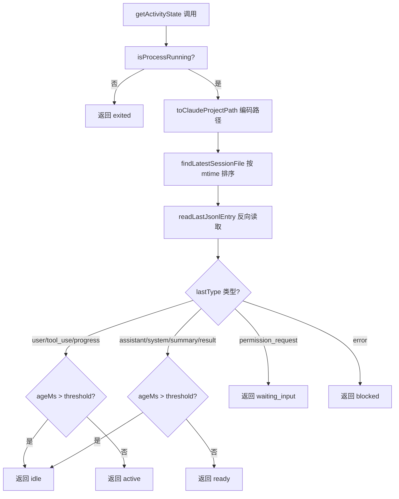
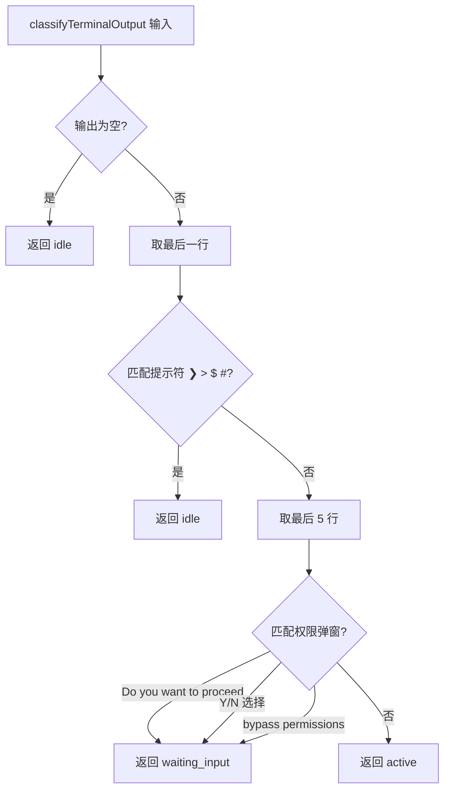

# PD-129.01 AgentOrchestrator — JSONL 尾读 + 终端模式匹配双通道活动检测

> 文档编号：PD-129.01
> 来源：AgentOrchestrator `packages/plugins/agent-claude-code/src/index.ts`
> GitHub：https://github.com/ComposioHQ/agent-orchestrator.git
> 问题域：PD-129 Agent 活动检测 Agent Activity Detection
> 状态：可复用方案

---

## 第 1 章 问题与动机

### 1.1 核心问题

在多 Agent 编排系统中，Orchestrator 需要持续感知每个 Agent 会话的活动状态——是在工作、空闲、卡住、还是等待人类输入。这是生命周期管理的基础：状态转换触发反应（自动修复 CI 失败、通知人类审查等），而错误的状态判断会导致误报或漏报。

核心挑战在于：
- Agent 进程可能是 100MB+ 的 JSONL 日志文件，全量读取不可接受
- 终端输出是非结构化文本，不同 Agent（Claude Code、Codex、Aider）的输出格式各异
- 进程存活 ≠ Agent 活跃（进程可能挂起、等待输入、或已完成但未退出）
- 需要区分 6 种细粒度状态：`active`、`ready`、`idle`、`waiting_input`、`blocked`、`exited`

### 1.2 AgentOrchestrator 的解法概述

AgentOrchestrator 采用**双通道检测**架构，两条独立路径互为补充：

1. **JSONL 尾部读取（主通道）**：通过 `readLastJsonlEntry()` 只读 JSONL 文件最后一行，结合文件 mtime 判断活动类型和新鲜度（`packages/core/src/utils.ts:90-110`）
2. **终端输出模式匹配（辅助通道）**：通过 `classifyTerminalOutput()` 解析 tmux capture-pane 的终端输出，识别提示符、权限弹窗等模式（`packages/plugins/agent-claude-code/src/index.ts:459-484`）
3. **进程存活检测（兜底）**：通过 `findClaudeProcess()` 用 ps + TTY 匹配或 kill(0) 信号检测进程是否存活（`packages/plugins/agent-claude-code/src/index.ts:393-452`）
4. **生命周期轮询引擎**：`LifecycleManager` 以 30s 间隔轮询所有会话，检测状态转换并触发反应链（`packages/core/src/lifecycle-manager.ts:524-580`）
5. **插件化 Agent 接口**：每种 Agent（Claude Code、Codex、Aider、OpenCode）实现统一的 `Agent` 接口，各自提供 `detectActivity()` 和 `getActivityState()`（`packages/core/src/types.ts:276-285`）

### 1.3 设计思想

| 设计原则 | 具体实现 | 理由 | 替代方案 |
|----------|----------|------|----------|
| 只读尾部 | `readLastLine()` 从文件末尾反向读取 4KB 块 | JSONL 可达 100MB+，全量读取浪费 IO | 用 `tail -1` 外部命令（多一次 spawn） |
| 双通道互补 | JSONL 为主、终端为辅、进程存活兜底 | JSONL 有结构化类型但可能延迟；终端实时但非结构化 | 只用一种检测方式（覆盖不全） |
| 时间衰减 | mtime 超过阈值（默认 5min）→ idle | 区分"刚完成"和"完成很久了" | 固定状态不考虑时间 |
| 插件化接口 | `Agent.getActivityState()` 统一接口 | 不同 Agent 有不同的日志格式和检测方式 | 硬编码每种 Agent 的检测逻辑 |
| 状态不可信原则 | 终端显示 "active" 时仍检查 `isProcessRunning` | 有些 Agent 退出后终端仍显示历史输出 | 信任终端输出 |

---

## 第 2 章 源码实现分析

### 2.1 架构概览

AgentOrchestrator 的活动检测分为三层：Core 层定义接口和共享工具，Plugin 层实现 Agent 特定逻辑，Lifecycle 层驱动轮询和状态机。

```
┌─────────────────────────────────────────────────────────┐
│                  LifecycleManager                        │
│  pollAll() → checkSession() → determineStatus()         │
│  30s 轮询间隔 + 重入保护 + 状态转换事件                    │
└──────────────────────┬──────────────────────────────────┘
                       │ 调用 Agent 插件
┌──────────────────────▼──────────────────────────────────┐
│              Agent Plugin (claude-code)                   │
│  ┌─────────────────┐  ┌──────────────────────┐          │
│  │ getActivityState │  │ detectActivity       │          │
│  │ (JSONL 主通道)   │  │ (终端辅助通道)        │          │
│  └────────┬────────┘  └──────────┬───────────┘          │
│           │                      │                       │
│  ┌────────▼────────┐  ┌──────────▼───────────┐          │
│  │readLastJsonlEntry│  │classifyTerminalOutput│          │
│  │ + mtime 时间衰减 │  │ + 正则模式匹配       │          │
│  └────────┬────────┘  └──────────────────────┘          │
│           │                                              │
│  ┌────────▼────────┐  ┌──────────────────────┐          │
│  │findLatestSession │  │ findClaudeProcess    │          │
│  │ File (mtime排序) │  │ (ps+TTY / kill(0))   │          │
│  └─────────────────┘  └──────────────────────┘          │
└─────────────────────────────────────────────────────────┘
                       │
┌──────────────────────▼──────────────────────────────────┐
│                  @composio/ao-core                        │
│  readLastJsonlEntry() — 纯 Node.js 反向读取              │
│  readLastLine() — 4KB 块反向扫描                          │
│  ActivityState 类型 + DEFAULT_READY_THRESHOLD_MS          │
└─────────────────────────────────────────────────────────┘
```

### 2.2 核心实现

#### 2.2.1 JSONL 尾部高效读取（主通道）



对应源码 `packages/core/src/utils.ts:39-110`：

```typescript
// 纯 Node.js 反向读取 — 不依赖外部命令
async function readLastLine(filePath: string): Promise<string | null> {
  const CHUNK = 4096;
  const fh = await open(filePath, "r");
  try {
    const { size } = await fh.stat();
    if (size === 0) return null;

    const chunks: Buffer[] = [];
    let totalBytes = 0;
    let pos = size;

    while (pos > 0) {
      const readSize = Math.min(CHUNK, pos);
      pos -= readSize;
      const chunk = Buffer.alloc(readSize);
      await fh.read(chunk, 0, readSize, pos);
      chunks.unshift(chunk);
      totalBytes += readSize;

      // 安全处理多字节 UTF-8：累积所有块后再转字符串
      const tail = Buffer.concat(chunks, totalBytes).toString("utf-8");
      const lines = tail.split("\n");
      for (let i = lines.length - 1; i >= 0; i--) {
        const line = lines[i].trim();
        if (line) {
          if (i > 0 || pos === 0) return line;
        }
      }
    }
    return null;
  } finally {
    await fh.close();
  }
}

export async function readLastJsonlEntry(
  filePath: string,
): Promise<{ lastType: string | null; modifiedAt: Date } | null> {
  const [line, fileStat] = await Promise.all([readLastLine(filePath), stat(filePath)]);
  if (!line) return null;
  const parsed: unknown = JSON.parse(line);
  if (typeof parsed === "object" && parsed !== null && !Array.isArray(parsed)) {
    const obj = parsed as Record<string, unknown>;
    const lastType = typeof obj.type === "string" ? obj.type : null;
    return { lastType, modifiedAt: fileStat.mtime };
  }
  return { lastType: null, modifiedAt: fileStat.mtime };
}
```

#### 2.2.2 终端输出模式匹配（辅助通道）



对应源码 `packages/plugins/agent-claude-code/src/index.ts:459-484`：

```typescript
function classifyTerminalOutput(terminalOutput: string): ActivityState {
  if (!terminalOutput.trim()) return "idle";

  const lines = terminalOutput.trim().split("\n");
  const lastLine = lines[lines.length - 1]?.trim() ?? "";

  // 最后一行是提示符 → agent 空闲（不管历史输出是什么）
  if (/^[❯>$#]\s*$/.test(lastLine)) return "idle";

  // 最后 5 行检查权限弹窗（优先于全缓冲区的 active 指标）
  const tail = lines.slice(-5).join("\n");
  if (/Do you want to proceed\?/i.test(tail)) return "waiting_input";
  if (/\(Y\)es.*\(N\)o/i.test(tail)) return "waiting_input";
  if (/bypass.*permissions/i.test(tail)) return "waiting_input";

  // 其他情况都是 active
  return "active";
}
```

### 2.3 实现细节

#### 进程存活检测的三层策略

`findClaudeProcess()` 在 `packages/plugins/agent-claude-code/src/index.ts:393-452` 实现了三种进程检测方式：

1. **tmux 运行时**：获取 pane TTY → `ps -eo pid,tty,args` → 正则匹配 `claude` 进程名
2. **进程运行时**：从 handle.data 取 PID → `process.kill(pid, 0)` 信号探测（EPERM 也算存活）
3. **兜底**：无法识别运行时类型时返回 null

关键设计：`classifyTerminalOutput` 返回 "active" 时，`determineStatus()` 仍会调用 `isProcessRunning` 二次确认（`lifecycle-manager.ts:218-219`）。这是因为某些 Agent（Codex、Aider）退出后终端缓冲区仍保留历史输出，单纯看终端会误判为 active。

#### JSONL 类型到状态的映射表

| JSONL lastType | 新鲜（< threshold） | 过期（> threshold） |
|----------------|---------------------|---------------------|
| user / tool_use / progress | active | idle |
| assistant / system / summary / result | ready | idle |
| permission_request | waiting_input | waiting_input |
| error | blocked | blocked |
| 其他/未知 | active | idle |

#### 生命周期轮询引擎

`LifecycleManager`（`lifecycle-manager.ts:172-607`）的核心设计：
- **30s 默认轮询间隔**，可配置
- **重入保护**：`polling` 布尔锁防止上一轮未完成时重复进入
- **并发轮询**：`Promise.allSettled` 并行检查所有会话
- **状态转换 → 事件 → 反应**：检测到状态变化后触发 reaction 链（send-to-agent / notify / auto-merge）
- **升级机制**：reaction 重试超限后自动升级为人类通知

---

## 第 3 章 迁移指南

### 3.1 迁移清单

**阶段 1：核心检测（1 个文件）**
- [ ] 实现 `readLastLine()` 反向读取函数（纯 Node.js，无外部依赖）
- [ ] 实现 `readLastJsonlEntry()` 封装 JSON 解析 + mtime 获取
- [ ] 定义 `ActivityState` 类型枚举（active/ready/idle/waiting_input/blocked/exited）

**阶段 2：Agent 插件（每种 Agent 1 个文件）**
- [ ] 实现 `getActivityState()` — JSONL 类型到状态的映射 + 时间衰减
- [ ] 实现 `detectActivity()` — 终端输出模式匹配（作为降级方案）
- [ ] 实现 `isProcessRunning()` — 进程存活检测
- [ ] 实现 `findLatestSessionFile()` — 按 mtime 排序找最新 JSONL

**阶段 3：轮询引擎（1 个文件）**
- [ ] 实现 `LifecycleManager` — 定时轮询 + 状态转换检测
- [ ] 实现 reaction 链 — 状态变化触发自动响应
- [ ] 实现升级机制 — 自动响应失败后通知人类

### 3.2 适配代码模板

以下是一个可直接复用的 JSONL 尾部读取 + 活动状态检测模块：

```typescript
import { open, stat } from "node:fs/promises";

// ============================================================
// 类型定义
// ============================================================

export type ActivityState =
  | "active"        // agent 正在处理
  | "ready"         // agent 完成当前轮次，等待新输入
  | "idle"          // agent 长时间无活动
  | "waiting_input" // agent 等待人类输入（权限确认等）
  | "blocked"       // agent 遇到错误
  | "exited";       // agent 进程已退出

export interface ActivityDetection {
  state: ActivityState;
  timestamp?: Date;
}

export const DEFAULT_READY_THRESHOLD_MS = 300_000; // 5 分钟

// ============================================================
// JSONL 尾部读取（核心工具函数）
// ============================================================

async function readLastLine(filePath: string): Promise<string | null> {
  const CHUNK = 4096;
  const fh = await open(filePath, "r");
  try {
    const { size } = await fh.stat();
    if (size === 0) return null;

    const chunks: Buffer[] = [];
    let totalBytes = 0;
    let pos = size;

    while (pos > 0) {
      const readSize = Math.min(CHUNK, pos);
      pos -= readSize;
      const chunk = Buffer.alloc(readSize);
      await fh.read(chunk, 0, readSize, pos);
      chunks.unshift(chunk);
      totalBytes += readSize;

      const tail = Buffer.concat(chunks, totalBytes).toString("utf-8");
      const lines = tail.split("\n");
      for (let i = lines.length - 1; i >= 0; i--) {
        const line = lines[i].trim();
        if (line && (i > 0 || pos === 0)) return line;
      }
    }
    return null;
  } finally {
    await fh.close();
  }
}

export async function readLastJsonlEntry(
  filePath: string,
): Promise<{ lastType: string | null; modifiedAt: Date } | null> {
  try {
    const [line, fileStat] = await Promise.all([
      readLastLine(filePath),
      stat(filePath),
    ]);
    if (!line) return null;
    const parsed = JSON.parse(line);
    if (typeof parsed === "object" && parsed !== null) {
      return {
        lastType: typeof parsed.type === "string" ? parsed.type : null,
        modifiedAt: fileStat.mtime,
      };
    }
    return { lastType: null, modifiedAt: fileStat.mtime };
  } catch {
    return null;
  }
}

// ============================================================
// 活动状态判定
// ============================================================

export function detectActivityFromJsonl(
  lastType: string | null,
  ageMs: number,
  thresholdMs = DEFAULT_READY_THRESHOLD_MS,
): ActivityState {
  switch (lastType) {
    case "user":
    case "tool_use":
    case "progress":
      return ageMs > thresholdMs ? "idle" : "active";

    case "assistant":
    case "system":
    case "summary":
    case "result":
      return ageMs > thresholdMs ? "idle" : "ready";

    case "permission_request":
      return "waiting_input";

    case "error":
      return "blocked";

    default:
      return ageMs > thresholdMs ? "idle" : "active";
  }
}
```

### 3.3 适用场景

| 场景 | 适用度 | 说明 |
|------|--------|------|
| 多 Agent 编排系统 | ⭐⭐⭐ | 核心场景：需要监控多个并行 Agent 的状态 |
| CI/CD Agent 监控 | ⭐⭐⭐ | Agent 执行 CI 任务时检测卡死/等待输入 |
| 单 Agent 看门狗 | ⭐⭐ | 简化版：只需 JSONL 读取 + 超时检测 |
| 非 JSONL 日志系统 | ⭐ | 需要改造 readLastLine 适配其他日志格式 |
| 无终端环境（API 调用） | ⭐⭐ | 终端通道不可用，但 JSONL 通道仍有效 |

---

## 第 4 章 测试用例

基于 `packages/plugins/agent-claude-code/src/__tests__/activity-detection.test.ts` 的真实测试模式：

```typescript
import { describe, it, expect } from "vitest";
import { readLastJsonlEntry } from "./utils";
import { detectActivityFromJsonl, DEFAULT_READY_THRESHOLD_MS } from "./activity";
import { writeFileSync, mkdtempSync, rmSync } from "node:fs";
import { join } from "node:path";
import { tmpdir } from "node:os";

function writeJsonl(dir: string, entries: Array<Record<string, unknown>>, ageMs = 0): string {
  const filePath = join(dir, "session.jsonl");
  const content = entries.map((e) => JSON.stringify(e)).join("\n") + "\n";
  writeFileSync(filePath, content);
  if (ageMs > 0) {
    const past = new Date(Date.now() - ageMs);
    const { utimesSync } = require("node:fs");
    utimesSync(filePath, past, past);
  }
  return filePath;
}

describe("Activity Detection", () => {
  let tmpDir: string;

  beforeEach(() => { tmpDir = mkdtempSync(join(tmpdir(), "activity-test-")); });
  afterEach(() => { rmSync(tmpDir, { recursive: true, force: true }); });

  describe("readLastJsonlEntry", () => {
    it("reads last entry type from multi-entry file", async () => {
      const path = writeJsonl(tmpDir, [
        { type: "user", message: "fix bug" },
        { type: "progress", status: "thinking" },
        { type: "assistant", message: "Done!" },
      ]);
      const entry = await readLastJsonlEntry(path);
      expect(entry?.lastType).toBe("assistant");
    });

    it("returns null for empty file", async () => {
      const path = join(tmpDir, "empty.jsonl");
      writeFileSync(path, "");
      expect(await readLastJsonlEntry(path)).toBeNull();
    });

    it("handles malformed last line gracefully", async () => {
      const path = join(tmpDir, "bad.jsonl");
      writeFileSync(path, '{"type":"user"}\nnot-json\n');
      // readLastLine returns "not-json", JSON.parse fails → returns null
      expect(await readLastJsonlEntry(path)).toBeNull();
    });
  });

  describe("detectActivityFromJsonl", () => {
    it("returns active for recent progress entry", () => {
      expect(detectActivityFromJsonl("progress", 1000)).toBe("active");
    });

    it("returns ready for recent assistant entry", () => {
      expect(detectActivityFromJsonl("assistant", 1000)).toBe("ready");
    });

    it("returns idle for stale assistant entry", () => {
      expect(detectActivityFromJsonl("assistant", 400_000)).toBe("idle");
    });

    it("returns waiting_input for permission_request regardless of age", () => {
      expect(detectActivityFromJsonl("permission_request", 999_999)).toBe("waiting_input");
    });

    it("returns blocked for error regardless of age", () => {
      expect(detectActivityFromJsonl("error", 999_999)).toBe("blocked");
    });

    it("respects custom threshold", () => {
      expect(detectActivityFromJsonl("assistant", 120_000, 60_000)).toBe("idle");
      expect(detectActivityFromJsonl("assistant", 120_000, 300_000)).toBe("ready");
    });
  });

  describe("Terminal Output Classification", () => {
    // 基于 classifyTerminalOutput 的模式
    function classify(output: string): string {
      if (!output.trim()) return "idle";
      const lines = output.trim().split("\n");
      const lastLine = lines[lines.length - 1]?.trim() ?? "";
      if (/^[❯>$#]\s*$/.test(lastLine)) return "idle";
      const tail = lines.slice(-5).join("\n");
      if (/Do you want to proceed\?/i.test(tail)) return "waiting_input";
      if (/\(Y\)es.*\(N\)o/i.test(tail)) return "waiting_input";
      return "active";
    }

    it("detects idle from prompt character", () => {
      expect(classify("some output\n❯ ")).toBe("idle");
    });

    it("detects waiting_input from permission prompt", () => {
      expect(classify("Reading file...\nDo you want to proceed?")).toBe("waiting_input");
    });

    it("detects active from processing output", () => {
      expect(classify("Thinking...\nReading src/index.ts")).toBe("active");
    });
  });
});
```

---

## 第 5 章 跨域关联

| 关联域 | 关系类型 | 说明 |
|--------|----------|------|
| PD-02 多 Agent 编排 | 依赖 | 活动检测是编排系统的感知层，LifecycleManager 依赖 Agent 插件的 `getActivityState()` 驱动状态机 |
| PD-09 Human-in-the-Loop | 协同 | `waiting_input` 状态触发人类通知；reaction 升级机制将自动处理失败转为人类干预 |
| PD-11 可观测性 | 协同 | JSONL 尾部读取同时提取 cost/token 数据（`extractCost()`），活动检测与成本追踪共享数据源 |
| PD-05 沙箱隔离 | 协同 | tmux 运行时提供终端隔离，`capture-pane` 是终端通道的数据来源 |
| PD-10 中间件管道 | 协同 | Claude Code 的 PostToolUse hook 自动更新 session metadata（branch/pr/status），为活动检测提供结构化信号 |
| PD-03 容错与重试 | 协同 | `blocked` 状态（error 类型）触发 reaction 链的重试逻辑；`stuck` 状态触发升级通知 |

---

## 第 6 章 来源文件索引

| 文件 | 行范围 | 关键实现 |
|------|--------|----------|
| `packages/core/src/utils.ts` | L39-L81 | `readLastLine()` — 纯 Node.js 反向读取文件最后一行 |
| `packages/core/src/utils.ts` | L90-L110 | `readLastJsonlEntry()` — JSONL 尾部条目解析 + mtime |
| `packages/core/src/types.ts` | L45-L68 | `ActivityState` 类型定义 + `ActivityDetection` 接口 |
| `packages/core/src/types.ts` | L71 | `DEFAULT_READY_THRESHOLD_MS = 300_000` |
| `packages/core/src/types.ts` | L276-L285 | `Agent.detectActivity()` + `Agent.getActivityState()` 接口 |
| `packages/plugins/agent-claude-code/src/index.ts` | L198-L231 | `toClaudeProjectPath()` + `findLatestSessionFile()` |
| `packages/plugins/agent-claude-code/src/index.ts` | L264-L307 | `parseJsonlFileTail()` — 大文件尾部 128KB 解析 |
| `packages/plugins/agent-claude-code/src/index.ts` | L393-L452 | `findClaudeProcess()` — ps+TTY / kill(0) 进程检测 |
| `packages/plugins/agent-claude-code/src/index.ts` | L459-L484 | `classifyTerminalOutput()` — 终端模式匹配 |
| `packages/plugins/agent-claude-code/src/index.ts` | L646-L703 | `getActivityState()` — JSONL 主通道完整实现 |
| `packages/core/src/lifecycle-manager.ts` | L182-L289 | `determineStatus()` — 双通道检测编排 |
| `packages/core/src/lifecycle-manager.ts` | L524-L580 | `pollAll()` — 轮询引擎 + 重入保护 |
| `packages/core/src/session-manager.ts` | L285-L300 | `enrichSessionWithRuntimeState()` — 活动检测集成点 |

---

## 第 7 章 横向对比维度

```json comparison_data
{
  "project": "AgentOrchestrator",
  "dimensions": {
    "检测架构": "JSONL 尾读 + 终端模式匹配 + 进程存活三层检测",
    "状态粒度": "6 态：active/ready/idle/waiting_input/blocked/exited",
    "时间衰减": "mtime 超 5min 阈值自动降级为 idle，阈值可配置",
    "插件化": "Agent 接口统一 detectActivity + getActivityState，4 种 Agent 插件",
    "轮询机制": "30s 间隔 + 重入保护 + Promise.allSettled 并发",
    "反应链": "状态转换 → 事件 → reaction（send-to-agent/notify/auto-merge）→ 升级"
  }
}
```

### 域元数据补充

```json domain_metadata
{
  "solution_summary": "AgentOrchestrator 用 readLastLine 反向读取 JSONL 尾部 + classifyTerminalOutput 正则匹配终端输出，双通道检测 6 种 Agent 活动状态并驱动 reaction 链",
  "description": "多 Agent 系统中感知每个会话活动状态的基础能力层",
  "sub_problems": [
    "多 Agent 插件统一活动检测接口设计",
    "JSONL 类型到活动状态的语义映射规则",
    "状态转换驱动的自动反应与升级机制"
  ],
  "best_practices": [
    "终端检测返回 active 时仍需二次确认进程存活",
    "探测失败时保留当前 stuck/needs_input 状态而非回退到 working",
    "用 mtime 时间衰减区分 ready 和 idle 避免误判完成状态"
  ]
}
```
