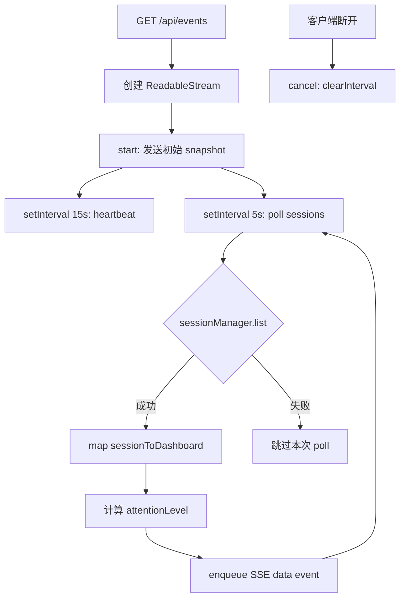
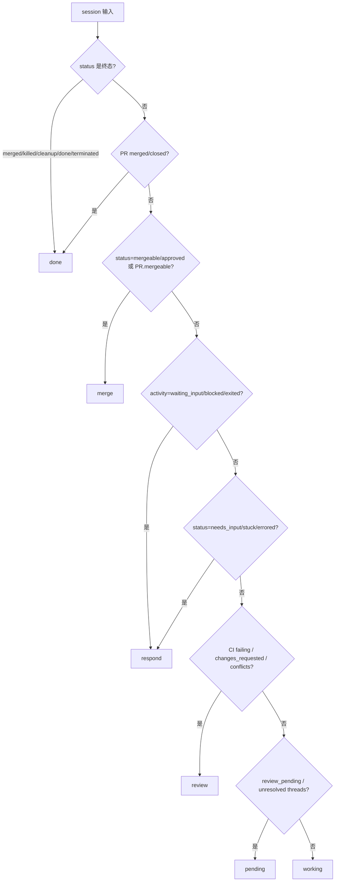
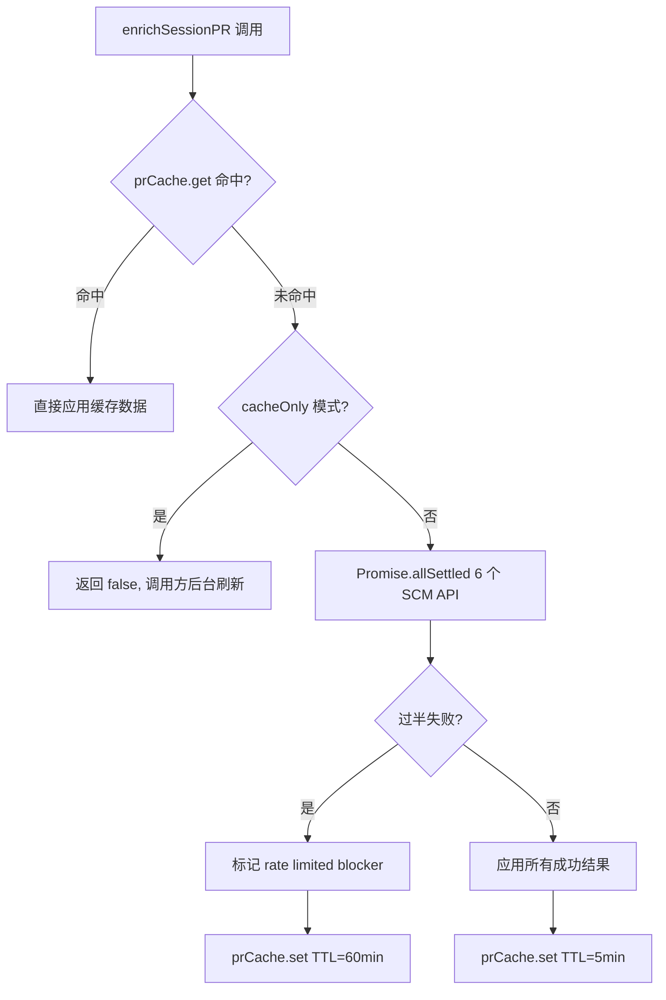

# PD-130.01 AgentOrchestrator — SSE 轮询仪表盘 + 六级注意力分区 + TTL 缓存降压

> 文档编号：PD-130.01
> 来源：AgentOrchestrator `packages/web/`
> GitHub：https://github.com/ComposioHQ/agent-orchestrator.git
> 问题域：PD-130 实时 Web 仪表盘 Real-time Web Dashboard
> 状态：可复用方案

---

## 第 1 章 问题与动机

### 1.1 核心问题

Agent 编排系统同时管理多个 session（每个 session 对应一个 AI agent 处理一个 issue/PR），运维者需要一个实时仪表盘来：

1. **感知全局状态** — 哪些 agent 在工作、哪些卡住了、哪些 PR 可以合并
2. **按紧急度排序** — 不是所有 session 都需要同等关注，需要按"人类应该做什么"分级
3. **减少 API 压力** — 每个 session 的 PR 状态需要调 GitHub API（CI、review、mergeability），频繁刷新会触发 rate limit
4. **SSR + 实时更新** — 首屏要快（SSR），后续要实时（SSE），两者要协调

传统做法是前端定时 fetch `/api/sessions`，但这有两个问题：每次 fetch 都要重新调 GitHub API enrichment（慢 + 费 quota），且无法区分"需要关注"和"不需要关注"的 session。

### 1.2 AgentOrchestrator 的解法概述

1. **SSE 轮询推送** — `/api/events` 端点用 `ReadableStream` 实现 SSE，每 5 秒轮询 SessionManager 推送轻量 snapshot（仅 id/status/activity/attentionLevel），不含 PR enrichment 数据（`packages/web/src/app/api/events/route.ts:18-93`）
2. **六级注意力分区** — `getAttentionLevel()` 将 session 分为 merge/respond/review/pending/working/done 六个区，按人类行动紧急度排序（`packages/web/src/lib/types.ts:162-233`）
3. **TTLCache + 双 TTL 策略** — 正常 5 分钟 TTL，rate limit 时自动延长到 60 分钟，避免反复锤击已限流的 API（`packages/web/src/lib/cache.ts:19-78`）
4. **Promise.allSettled 部分降级** — PR enrichment 并行调 6 个 SCM API，用 `allSettled` 收集结果，过半失败才标记 rate limited，成功的结果照常应用（`packages/web/src/lib/serialize.ts:135-253`）
5. **globalThis 单例** — 服务实例缓存在 `globalThis` 上，避免 Next.js HMR 重复初始化（`packages/web/src/lib/services.ts:39-57`）

### 1.3 设计思想

| 设计原则 | 具体实现 | 理由 | 替代方案 |
|----------|----------|------|----------|
| 轻量 SSE + 重量 REST 分离 | SSE 只推 5 字段 snapshot，完整数据走 `/api/sessions` | SSE 连接长期存活，payload 越小越稳定 | WebSocket 全量推送（过重） |
| 注意力经济学 | 六级分区按人类 ROI 排序：merge > respond > review > pending > working > done | 运维者时间有限，先处理 ROI 最高的（merge 一键完成） | 按时间排序（无优先级） |
| 防御性缓存 | rate limit 时缓存 60 分钟 + 标记 blocker，UI 显示 stale 警告 | GitHub rate limit 按小时重置，60 分钟内不再请求 | 固定 TTL 不区分（继续锤击） |
| 部分降级优于全部失败 | `Promise.allSettled` + 过半判定 | 6 个 API 中 3 个成功也比 0 个好 | `Promise.all` 一个失败全部丢弃 |
| SSR 首屏 + SSE 增量 | `page.tsx` SSR 渲染完整数据，`/api/events` SSE 推增量 | 首屏不闪烁，后续实时更新 | 纯 CSR（首屏空白） |

---

## 第 2 章 源码实现分析

### 2.1 架构概览

```
┌─────────────────────────────────────────────────────────────────┐
│                        Browser (Client)                         │
│  ┌──────────┐    ┌──────────────┐    ┌───────────────────────┐  │
│  │ Dashboard │◄───│ SSE EventSrc │◄───│ /api/events (SSE)     │  │
│  │ Component │    │ (5s updates) │    │ ReadableStream        │  │
│  └────┬─────┘    └──────────────┘    └───────────┬───────────┘  │
│       │                                          │              │
│       │ initial SSR                              │ poll 5s      │
│       ▼                                          ▼              │
│  ┌──────────┐                          ┌──────────────────┐     │
│  │ page.tsx  │─── getServices() ──────►│ SessionManager   │     │
│  │ (SSR)     │                         │ .list()          │     │
│  └────┬─────┘                          └────────┬─────────┘     │
│       │                                         │               │
│       │ enrichSessionPR()                       │               │
│       ▼                                         ▼               │
│  ┌──────────────┐    cache hit?    ┌──────────────────────┐     │
│  │ TTLCache     │◄────────────────►│ SCM Plugin (GitHub)  │     │
│  │ (5min/60min) │                  │ 6× API calls         │     │
│  └──────────────┘                  └──────────────────────┘     │
│       │                                                         │
│       ▼                                                         │
│  ┌──────────────────────────────────────────────────────────┐   │
│  │ AttentionZone × 6 (Kanban columns)                       │   │
│  │ merge │ respond │ review │ pending │ working │ done      │   │
│  └──────────────────────────────────────────────────────────┘   │
└─────────────────────────────────────────────────────────────────┘
```

整体架构分三层：

- **SSE 推送层**：`/api/events` 用 `ReadableStream` + `setInterval` 每 5 秒轮询 SessionManager，推送轻量 snapshot
- **数据 enrichment 层**：`serialize.ts` 负责将 core Session 转为 DashboardSession，并通过 SCM 插件 enrichment PR 数据（CI/review/mergeability）
- **展示层**：Dashboard 组件按 `getAttentionLevel()` 将 session 分入六个 AttentionZone，Kanban 布局

### 2.2 核心实现

#### 2.2.1 SSE 事件流端点



对应源码 `packages/web/src/app/api/events/route.ts:13-103`：

```typescript
export async function GET(): Promise<Response> {
  const encoder = new TextEncoder();
  let heartbeat: ReturnType<typeof setInterval> | undefined;
  let updates: ReturnType<typeof setInterval> | undefined;

  const stream = new ReadableStream({
    start(controller) {
      // 初始 snapshot — 连接建立时立即发送当前状态
      void (async () => {
        try {
          const { sessionManager } = await getServices();
          const sessions = await sessionManager.list();
          const dashboardSessions = sessions.map(sessionToDashboard);
          const initialEvent = {
            type: "snapshot",
            sessions: dashboardSessions.map((s) => ({
              id: s.id,
              status: s.status,
              activity: s.activity,
              attentionLevel: getAttentionLevel(s),
              lastActivityAt: s.lastActivityAt,
            })),
          };
          controller.enqueue(encoder.encode(`data: ${JSON.stringify(initialEvent)}\n\n`));
        } catch {
          controller.enqueue(
            encoder.encode(`data: ${JSON.stringify({ type: "snapshot", sessions: [] })}\n\n`),
          );
        }
      })();

      // 15 秒心跳保活
      heartbeat = setInterval(() => {
        try {
          controller.enqueue(encoder.encode(`: heartbeat\n\n`));
        } catch {
          clearInterval(heartbeat);
          clearInterval(updates);
        }
      }, 15000);

      // 5 秒轮询推送
      updates = setInterval(() => {
        void (async () => {
          try {
            const { sessionManager } = await getServices();
            const sessions = await sessionManager.list();
            const dashboardSessions = sessions.map(sessionToDashboard);
            const event = {
              type: "snapshot",
              sessions: dashboardSessions.map((s) => ({
                id: s.id, status: s.status, activity: s.activity,
                attentionLevel: getAttentionLevel(s),
                lastActivityAt: s.lastActivityAt,
              })),
            };
            controller.enqueue(encoder.encode(`data: ${JSON.stringify(event)}\n\n`));
          } catch { /* skip this poll */ }
        })();
      }, 5000);
    },
    cancel() {
      clearInterval(heartbeat);
      clearInterval(updates);
    },
  });

  return new Response(stream, {
    headers: {
      "Content-Type": "text/event-stream",
      "Cache-Control": "no-cache",
      Connection: "keep-alive",
      "X-Accel-Buffering": "no",  // 禁用 Nginx 缓冲
    },
  });
}
```

关键设计点：
- **SSE 注释心跳** ``: heartbeat\n\n`` — 用 SSE 注释格式（冒号开头），不触发客户端 `onmessage`，仅保活连接
- **`X-Accel-Buffering: no`** — 禁用 Nginx 反向代理的缓冲，确保 SSE 事件立即到达客户端
- **双 try-catch** — 外层 catch 处理 `sessionManager.list()` 失败（跳过本次 poll），内层 catch 处理 `controller.enqueue()` 失败（流已关闭，清理 interval）
- **`export const dynamic = "force-dynamic"`** — 告诉 Next.js 不要静态化此路由

#### 2.2.2 六级注意力分区算法



对应源码 `packages/web/src/lib/types.ts:162-233`：

```typescript
export function getAttentionLevel(session: DashboardSession): AttentionLevel {
  // ── Done: terminal states
  if (
    session.status === "merged" || session.status === "killed" ||
    session.status === "cleanup" || session.status === "done" ||
    session.status === "terminated"
  ) {
    return "done";
  }
  if (session.pr) {
    if (session.pr.state === "merged" || session.pr.state === "closed") return "done";
  }

  // ── Merge: PR is ready — one click to clear (highest ROI)
  if (session.status === "mergeable" || session.status === "approved") return "merge";
  if (session.pr?.mergeability.mergeable) return "merge";

  // ── Respond: agent is waiting for human input
  if (
    session.activity === ACTIVITY_STATE.WAITING_INPUT ||
    session.activity === ACTIVITY_STATE.BLOCKED
  ) return "respond";
  if (
    session.status === SESSION_STATUS.NEEDS_INPUT ||
    session.status === SESSION_STATUS.STUCK ||
    session.status === SESSION_STATUS.ERRORED
  ) return "respond";
  if (session.activity === ACTIVITY_STATE.EXITED) return "respond";

  // ── Review: problems that need investigation
  if (session.status === "ci_failed" || session.status === "changes_requested") return "review";
  if (session.pr && !isPRRateLimited(session.pr)) {
    if (session.pr.ciStatus === CI_STATUS.FAILING) return "review";
    if (session.pr.reviewDecision === "changes_requested") return "review";
    if (!session.pr.mergeability.noConflicts) return "review";
  }

  // ── Pending: waiting on external
  if (session.status === "review_pending") return "pending";
  if (session.pr && !isPRRateLimited(session.pr)) {
    if (!session.pr.isDraft && session.pr.unresolvedThreads > 0) return "pending";
    if (!session.pr.isDraft && (session.pr.reviewDecision === "pending" || session.pr.reviewDecision === "none"))
      return "pending";
  }

  // ── Working: agents doing their thing
  return "working";
}
```

注意力分区的核心设计哲学是 **按人类 ROI 排序**：
- `merge` 最高优先 — 一键操作，立即清除一个 session
- `respond` 次之 — 快速回复，agent 恢复工作
- `review` 需要调查 — CI 失败、代码审查问题
- `pending` 等待外部 — 无需立即行动
- `working` 不要打扰 — agent 正在工作
- `done` 归档 — 已完成

#### 2.2.3 TTLCache 与双 TTL 降级



对应源码 `packages/web/src/lib/cache.ts:19-78`：

```typescript
export class TTLCache<T> {
  private cache = new Map<string, CacheEntry<T>>();
  private readonly ttlMs: number;
  private cleanupInterval?: ReturnType<typeof setInterval>;

  constructor(ttlMs: number = DEFAULT_TTL_MS) {
    this.ttlMs = ttlMs;
    // 定期清理过期条目，防止内存泄漏
    this.cleanupInterval = setInterval(() => this.evictExpired(), ttlMs);
    // unref() 确保 cleanup interval 不阻止 Node 进程退出
    if (this.cleanupInterval.unref) {
      this.cleanupInterval.unref();
    }
  }

  get(key: string): T | null {
    const entry = this.cache.get(key);
    if (!entry) return null;
    if (Date.now() > entry.expiresAt) {
      this.cache.delete(key);  // 惰性淘汰
      return null;
    }
    return entry.value;
  }

  set(key: string, value: T, ttlMs?: number): void {
    this.cache.set(key, {
      value,
      expiresAt: Date.now() + (ttlMs ?? this.ttlMs),
    });
  }
}
```

### 2.3 实现细节

#### 数据流：SSR 首屏 → SSE 增量

`page.tsx` 的 SSR 流程（`packages/web/src/app/page.tsx:23-106`）：

1. `getServices()` 获取单例服务
2. `sessionManager.list()` 获取所有 session
3. `sessionToDashboard()` 转换为 dashboard 格式（不含 PR enrichment）
4. `enrichSessionsMetadata()` 并行 enrich issue labels + agent summaries + issue titles（3 秒超时）
5. `enrichSessionPR()` 并行 enrich PR 数据（4 秒超时），优先用缓存
6. 渲染 `<Dashboard>` 组件

SSR 阶段的 enrichment 有两个超时保护：metadata 3 秒、PR 4 秒。超时后直接用已有数据渲染，不等待。

#### globalThis 单例模式

`packages/web/src/lib/services.ts:39-57` 使用 `globalThis` 缓存服务实例：

```typescript
const globalForServices = globalThis as typeof globalThis & {
  _aoServices?: Services;
  _aoServicesInit?: Promise<Services>;
};

export function getServices(): Promise<Services> {
  if (globalForServices._aoServices) {
    return Promise.resolve(globalForServices._aoServices);
  }
  if (!globalForServices._aoServicesInit) {
    globalForServices._aoServicesInit = initServices().catch((err) => {
      // 清除缓存的 rejected promise，下次调用重试
      globalForServices._aoServicesInit = undefined;
      throw err;
    });
  }
  return globalForServices._aoServicesInit;
}
```

关键点：初始化失败时清除缓存的 Promise，避免永久返回 rejected promise。

#### DynamicFavicon — 健康度可视化

`packages/web/src/components/DynamicFavicon.tsx:12-24` 根据 session 注意力级别计算整体健康度，动态更新浏览器 favicon 颜色：
- 绿色：所有 session 正常
- 黄色：有 session 需要 review 或可以 merge
- 红色：有 session 需要人类响应（respond 级别）

#### PR enrichment 的 Promise.allSettled 部分降级

`packages/web/src/lib/serialize.ts:135-253` 并行调用 6 个 SCM API：

```
getPRSummary → state, title, additions, deletions
getCIChecks  → CI check 列表
getCISummary → CI 总状态
getReviewDecision → review 决策
getMergeability → 可合并性
getPendingComments → 未解决评论
```

用 `Promise.allSettled` 收集结果，过半失败（≥3/6）才标记 rate limited。成功的结果照常应用到 dashboard PR 对象上。rate limited 时缓存 60 分钟（GitHub rate limit 按小时重置）。

---

## 第 3 章 迁移指南

### 3.1 迁移清单

#### 阶段 1：SSE 推送层（1 个文件）

- [ ] 创建 `/api/events/route.ts`，实现 `ReadableStream` + `setInterval` 轮询
- [ ] 设置 SSE 响应头：`Content-Type: text/event-stream`、`Cache-Control: no-cache`、`X-Accel-Buffering: no`
- [ ] 实现 15 秒心跳（SSE 注释格式 `: heartbeat\n\n`）
- [ ] 实现 `cancel()` 清理所有 interval
- [ ] 设置 `export const dynamic = "force-dynamic"` 禁止 Next.js 静态化

#### 阶段 2：TTL 缓存层（1 个文件）

- [ ] 实现 `TTLCache<T>` 泛型类，支持 `get/set/clear/size`
- [ ] 惰性淘汰（get 时检查过期）+ 定期清理（setInterval）
- [ ] `unref()` cleanup interval 防止阻止进程退出
- [ ] 支持 per-entry TTL 覆盖（用于 rate limit 场景）

#### 阶段 3：注意力分级（1 个函数）

- [ ] 实现 `getAttentionLevel()` 函数，按优先级链式判断
- [ ] 定义 `AttentionLevel` 类型和对应的 UI 配置（颜色、标签）
- [ ] 实现 `isPRRateLimited()` 辅助函数，rate limited 时跳过 PR 状态判断

#### 阶段 4：Enrichment 管道（1 个文件）

- [ ] 实现 `sessionToDashboard()` 序列化函数
- [ ] 实现 `enrichSessionPR()` 并行 API 调用 + `Promise.allSettled` 部分降级
- [ ] 实现双 TTL 策略：正常 5 分钟，rate limited 60 分钟
- [ ] SSR 页面添加 enrichment 超时保护（`Promise.race`）

### 3.2 适配代码模板

#### SSE 端点模板（Next.js App Router）

```typescript
// app/api/events/route.ts
export const dynamic = "force-dynamic";

interface SSEEvent {
  type: string;
  data: unknown;
}

export async function GET(): Promise<Response> {
  const encoder = new TextEncoder();
  let heartbeat: ReturnType<typeof setInterval> | undefined;
  let updates: ReturnType<typeof setInterval> | undefined;

  const stream = new ReadableStream({
    start(controller) {
      // 初始 snapshot
      void (async () => {
        try {
          const data = await fetchCurrentState();
          const event: SSEEvent = { type: "snapshot", data };
          controller.enqueue(encoder.encode(`data: ${JSON.stringify(event)}\n\n`));
        } catch {
          controller.enqueue(
            encoder.encode(`data: ${JSON.stringify({ type: "snapshot", data: [] })}\n\n`)
          );
        }
      })();

      // 心跳保活（SSE 注释格式，不触发 onmessage）
      heartbeat = setInterval(() => {
        try {
          controller.enqueue(encoder.encode(`: heartbeat\n\n`));
        } catch {
          clearInterval(heartbeat);
          clearInterval(updates);
        }
      }, 15_000);

      // 定期推送更新
      updates = setInterval(() => {
        void (async () => {
          try {
            const data = await fetchCurrentState();
            controller.enqueue(
              encoder.encode(`data: ${JSON.stringify({ type: "snapshot", data })}\n\n`)
            );
          } catch {
            // 跳过本次 poll，下次重试
          }
        })();
      }, 5_000);
    },
    cancel() {
      clearInterval(heartbeat);
      clearInterval(updates);
    },
  });

  return new Response(stream, {
    headers: {
      "Content-Type": "text/event-stream",
      "Cache-Control": "no-cache",
      Connection: "keep-alive",
      "X-Accel-Buffering": "no",
    },
  });
}
```

#### TTLCache 模板

```typescript
// lib/cache.ts
interface CacheEntry<T> {
  value: T;
  expiresAt: number;
}

export class TTLCache<T> {
  private cache = new Map<string, CacheEntry<T>>();
  private readonly ttlMs: number;
  private cleanupInterval?: ReturnType<typeof setInterval>;

  constructor(ttlMs: number = 5 * 60_000) {
    this.ttlMs = ttlMs;
    this.cleanupInterval = setInterval(() => this.evictExpired(), ttlMs);
    if (this.cleanupInterval.unref) this.cleanupInterval.unref();
  }

  get(key: string): T | null {
    const entry = this.cache.get(key);
    if (!entry) return null;
    if (Date.now() > entry.expiresAt) {
      this.cache.delete(key);
      return null;
    }
    return entry.value;
  }

  set(key: string, value: T, ttlMs?: number): void {
    this.cache.set(key, {
      value,
      expiresAt: Date.now() + (ttlMs ?? this.ttlMs),
    });
  }

  private evictExpired(): void {
    const now = Date.now();
    for (const [key, entry] of this.cache.entries()) {
      if (now > entry.expiresAt) this.cache.delete(key);
    }
  }

  clear(): void {
    this.cache.clear();
    if (this.cleanupInterval) {
      clearInterval(this.cleanupInterval);
      this.cleanupInterval = undefined;
    }
  }
}
```

#### 注意力分级模板

```typescript
// lib/attention.ts
export type AttentionLevel = "merge" | "respond" | "review" | "pending" | "working" | "done";

export function getAttentionLevel(session: {
  status: string;
  activity: string | null;
  pr: { state: string; mergeable: boolean; ciStatus: string; reviewDecision: string } | null;
}): AttentionLevel {
  // 终态判断
  const terminalStatuses = new Set(["merged", "killed", "done", "terminated"]);
  if (terminalStatuses.has(session.status)) return "done";
  if (session.pr?.state === "merged" || session.pr?.state === "closed") return "done";

  // 可合并 — 最高 ROI
  if (session.pr?.mergeable) return "merge";

  // 需要响应 — agent 等待人类
  if (session.activity === "waiting_input" || session.activity === "blocked") return "respond";
  if (session.activity === "exited") return "respond";

  // 需要审查 — CI 失败、代码审查问题
  if (session.pr?.ciStatus === "failing") return "review";
  if (session.pr?.reviewDecision === "changes_requested") return "review";

  // 等待外部 — reviewer、CI
  if (session.pr?.reviewDecision === "pending") return "pending";

  // 工作中
  return "working";
}
```

### 3.3 适用场景

| 场景 | 适用度 | 说明 |
|------|--------|------|
| 多 Agent 编排仪表盘 | ⭐⭐⭐ | 核心场景，完美匹配 |
| CI/CD 流水线监控 | ⭐⭐⭐ | 注意力分级可直接复用（build/test/deploy 状态） |
| PR 审查看板 | ⭐⭐⭐ | 六级分区天然适合 PR 生命周期管理 |
| 实时日志面板 | ⭐⭐ | SSE 推送可复用，但注意力分级不适用 |
| 高频交易监控 | ⭐ | 5 秒轮询太慢，需要 WebSocket 或更短间隔 |

---

## 第 4 章 测试用例

```typescript
import { describe, it, expect, beforeEach, afterEach, vi } from "vitest";

// ── TTLCache 测试 ──────────────────────────────────────────────

describe("TTLCache", () => {
  let cache: TTLCache<string>;

  beforeEach(() => {
    cache = new TTLCache<string>(1000);
  });

  afterEach(() => {
    cache.clear();
  });

  it("should store and retrieve values", () => {
    cache.set("key1", "value1");
    expect(cache.get("key1")).toBe("value1");
  });

  it("should return null for expired entries", () => {
    vi.useFakeTimers();
    cache.set("key1", "value1");
    vi.advanceTimersByTime(1001);
    expect(cache.get("key1")).toBeNull();
    vi.useRealTimers();
  });

  it("should support per-entry TTL override", () => {
    vi.useFakeTimers();
    cache.set("short", "val", 100);
    cache.set("long", "val", 5000);
    vi.advanceTimersByTime(200);
    expect(cache.get("short")).toBeNull();
    expect(cache.get("long")).toBe("val");
    vi.useRealTimers();
  });

  it("should evict expired entries via cleanup interval", async () => {
    const shortCache = new TTLCache<string>(50);
    shortCache.set("key1", "value1");
    await new Promise((resolve) => setTimeout(resolve, 150));
    expect(shortCache.size()).toBe(0);
    shortCache.clear();
  });
});

// ── getAttentionLevel 测试 ─────────────────────────────────────

describe("getAttentionLevel", () => {
  const makeSession = (overrides: Partial<DashboardSession>): DashboardSession => ({
    id: "test-1",
    projectId: "proj",
    status: "working" as SessionStatus,
    activity: "active" as ActivityState,
    branch: "feat/test",
    issueId: null,
    issueUrl: null,
    issueLabel: null,
    issueTitle: null,
    summary: null,
    summaryIsFallback: false,
    createdAt: new Date().toISOString(),
    lastActivityAt: new Date().toISOString(),
    pr: null,
    metadata: {},
    ...overrides,
  });

  it("returns done for terminal statuses", () => {
    expect(getAttentionLevel(makeSession({ status: "merged" }))).toBe("done");
    expect(getAttentionLevel(makeSession({ status: "killed" }))).toBe("done");
  });

  it("returns merge when PR is mergeable", () => {
    const pr = {
      number: 1, url: "", title: "", owner: "", repo: "", branch: "", baseBranch: "",
      isDraft: false, state: "open" as const, additions: 0, deletions: 0,
      ciStatus: "passing" as const, ciChecks: [], reviewDecision: "approved" as const,
      mergeability: { mergeable: true, ciPassing: true, approved: true, noConflicts: true, blockers: [] },
      unresolvedThreads: 0, unresolvedComments: [],
    };
    expect(getAttentionLevel(makeSession({ pr }))).toBe("merge");
  });

  it("returns respond when agent is waiting for input", () => {
    expect(getAttentionLevel(makeSession({ activity: "waiting_input" }))).toBe("respond");
  });

  it("returns review when CI is failing", () => {
    const pr = {
      number: 1, url: "", title: "", owner: "", repo: "", branch: "", baseBranch: "",
      isDraft: false, state: "open" as const, additions: 0, deletions: 0,
      ciStatus: "failing" as const, ciChecks: [{ name: "test", status: "failed" as const }],
      reviewDecision: "approved" as const,
      mergeability: { mergeable: false, ciPassing: false, approved: true, noConflicts: true, blockers: [] },
      unresolvedThreads: 0, unresolvedComments: [],
    };
    expect(getAttentionLevel(makeSession({ status: "ci_failed", pr }))).toBe("review");
  });

  it("returns working as default for active sessions", () => {
    expect(getAttentionLevel(makeSession({}))).toBe("working");
  });
});

// ── SSE 端点测试 ──────────────────────────────────────────────

describe("GET /api/events", () => {
  it("should return SSE headers", async () => {
    const response = await GET();
    expect(response.headers.get("Content-Type")).toBe("text/event-stream");
    expect(response.headers.get("Cache-Control")).toBe("no-cache");
    expect(response.headers.get("X-Accel-Buffering")).toBe("no");
  });

  it("should send initial snapshot event", async () => {
    const response = await GET();
    const reader = response.body!.getReader();
    const { value } = await reader.read();
    const text = new TextDecoder().decode(value);
    expect(text).toContain("data:");
    const event = JSON.parse(text.replace("data: ", "").trim());
    expect(event.type).toBe("snapshot");
    expect(Array.isArray(event.sessions)).toBe(true);
    reader.cancel();
  });
});
```

---

## 第 5 章 跨域关联

| 关联域 | 关系类型 | 说明 |
|--------|----------|------|
| PD-02 多 Agent 编排 | 依赖 | 仪表盘展示的 session 来自 SessionManager，编排层决定 session 的创建和状态流转 |
| PD-09 Human-in-the-Loop | 协同 | 注意力分级中的 `respond` 级别直接对应 HITL 场景（agent 等待人类输入），仪表盘提供 send message 操作 |
| PD-11 可观测性 | 协同 | 仪表盘是可观测性的前端展示层，TTLCache 的 rate limit 检测也是一种运行时监控 |
| PD-01 上下文管理 | 间接 | session 的 `summary` 字段来自 agent 的上下文摘要，enrichment 层读取 agent JSONL 文件获取 |
| PD-03 容错与重试 | 协同 | `Promise.allSettled` 部分降级 + 双 TTL 缓存策略是容错模式在仪表盘层的具体应用 |

---

## 第 6 章 来源文件索引

| 文件 | 行范围 | 关键实现 |
|------|--------|----------|
| `packages/web/src/app/api/events/route.ts` | L1-L103 | SSE 端点：ReadableStream + 5s 轮询 + 15s 心跳 |
| `packages/web/src/lib/types.ts` | L48-L233 | AttentionLevel 类型定义 + getAttentionLevel() 六级分区算法 |
| `packages/web/src/lib/cache.ts` | L1-L115 | TTLCache 泛型类 + PREnrichmentData 接口 + prCacheKey 工具函数 |
| `packages/web/src/lib/serialize.ts` | L1-L388 | sessionToDashboard 序列化 + enrichSessionPR 并行 enrichment + Promise.allSettled 部分降级 |
| `packages/web/src/lib/services.ts` | L1-L84 | globalThis 单例模式 + 插件静态注册（webpack 兼容） |
| `packages/web/src/components/Dashboard.tsx` | L1-L271 | Kanban 布局 + AttentionZone 分区 + PR 表格 + mergeScore 排序 |
| `packages/web/src/components/AttentionZone.tsx` | L1-L175 | 六级注意力区域组件（column/grid 两种布局） |
| `packages/web/src/components/SessionCard.tsx` | L1-L381 | Session 卡片：状态展示 + alert 标签 + merge/kill/restore 操作 |
| `packages/web/src/components/DynamicFavicon.tsx` | L1-L70 | 动态 favicon：根据 session 健康度变色（green/yellow/red） |
| `packages/web/src/app/page.tsx` | L1-L106 | SSR 首屏：enrichment 管道 + 超时保护（metadata 3s, PR 4s） |
| `packages/web/src/app/api/sessions/route.ts` | L1-L64 | REST API：完整 session 列表 + enrichment + stats |
| `packages/web/src/lib/__tests__/cache.test.ts` | L1-L121 | TTLCache 单元测试：TTL 过期、cleanup interval、unref |
| `packages/web/src/__tests__/get-attention-level.test.ts` | L1-L259 | getAttentionLevel 单元测试：六级分区全覆盖 |

---

## 第 7 章 横向对比维度

```json comparison_data
{
  "project": "AgentOrchestrator",
  "dimensions": {
    "推送机制": "ReadableStream SSE + 5s setInterval 轮询，非事件驱动",
    "缓存策略": "TTLCache 双 TTL：正常 5min，rate limited 60min",
    "注意力分级": "六级分区（merge/respond/review/pending/working/done）按人类 ROI 排序",
    "降级策略": "Promise.allSettled 过半判定 + 部分结果应用 + rate limit blocker 标记",
    "首屏策略": "Next.js SSR + enrichment 超时保护（metadata 3s, PR 4s）",
    "健康度可视化": "DynamicFavicon 三色（green/yellow/red）+ StatusLine 统计"
  }
}
```

### 域元数据补充

```json domain_metadata
{
  "solution_summary": "AgentOrchestrator 用 ReadableStream SSE 轮询 + 六级注意力分区（按人类 ROI 排序）+ TTLCache 双 TTL 降级策略实现多 session 实时仪表盘",
  "description": "实时仪表盘需要平衡首屏速度、更新频率和外部 API 配额三者的矛盾",
  "sub_problems": [
    "SSR 首屏与 SSE 增量更新的数据一致性协调",
    "PR enrichment 超时保护与部分降级",
    "动态 favicon 健康度可视化"
  ],
  "best_practices": [
    "SSE 心跳用注释格式（冒号开头）不触发客户端 onmessage",
    "Promise.allSettled 过半判定实现部分降级而非全部失败",
    "rate limit 时自动延长缓存 TTL 到 API 限流重置周期"
  ]
}
```
