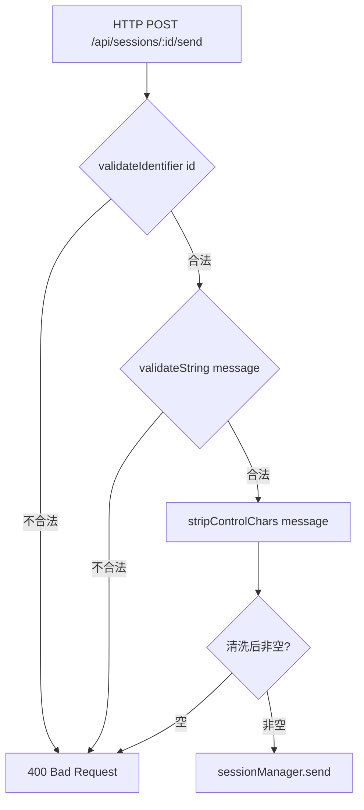
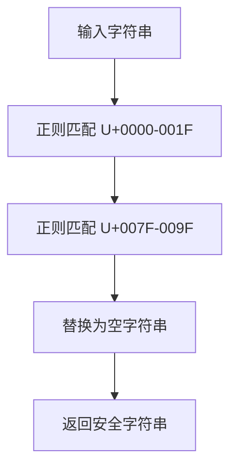

# PD-131.01 agent-orchestrator — 多层输入校验与 Shell 安全转义

> 文档编号：PD-131.01
> 来源：agent-orchestrator `packages/web/src/lib/validation.ts`, `packages/core/src/utils.ts`, `packages/core/src/metadata.ts`, `packages/plugins/workspace-worktree/src/index.ts`
> GitHub：https://github.com/ComposioHQ/agent-orchestrator.git
> 问题域：PD-131 安全加固 Security Hardening
> 状态：可复用方案

---

## 第 1 章 问题与动机

### 1.1 核心问题

Agent 编排系统天然面临多层安全威胁：用户通过 Web API 发送的消息最终会被注入到 tmux `send-keys` 命令中执行，session ID 被拼接到文件系统路径中读写元数据，项目配置中的参数被传入 shell 命令行。任何一层缺乏校验，都可能导致：

- **路径遍历**：恶意 session ID（如 `../../etc/passwd`）穿透目录边界读写任意文件
- **控制字符注入**：tmux `send-keys` 会解释 `\x03`（Ctrl-C）、`\x1b`（ESC）等控制字符，攻击者可通过消息内容终止 Agent 进程或注入任意终端命令
- **Shell 命令注入**：用户可控参数（model 名、prompt 内容）被拼接到 shell 命令中，未转义的单引号可逃逸命令边界
- **密钥泄露**：开发者误将 API key、token 提交到 Git 仓库，被公开后造成安全事故
- **符号链接逃逸**：workspace 的 symlink 配置可能指向 workspace 外部的敏感文件

这些威胁在 Agent 系统中尤为严重，因为 Agent 拥有代码执行权限，一旦被注入恶意指令，影响范围远超普通 Web 应用。

### 1.2 agent-orchestrator 的解法概述

agent-orchestrator 采用**纵深防御**（Defense in Depth）策略，在数据流经的每一层都设置独立的安全屏障：

1. **API 边界层**：`validateIdentifier` + `validateString` + `stripControlChars` 三重校验（`packages/web/src/lib/validation.ts:1-44`）
2. **元数据存储层**：`validateSessionId` 正则白名单阻断路径遍历（`packages/core/src/metadata.ts:67-73`）
3. **Shell 命令构建层**：`shellEscape` POSIX 安全转义 + `escapeAppleScript` 双引号转义（`packages/core/src/utils.ts:13-23`）
4. **文件系统操作层**：`assertSafePathSegment` 路径段白名单 + symlink 目标校验（`packages/plugins/workspace-worktree/src/index.ts:33-39, 255-269`）
5. **CI/CD 层**：gitleaks pre-commit hook + GitHub Actions 三重扫描（`.husky/pre-commit`, `.github/workflows/security.yml`）

### 1.3 设计思想

| 设计原则 | 具体实现 | 理由 | 替代方案 |
|----------|----------|------|----------|
| 纵深防御 | 每层独立校验，不依赖上游已校验 | 单点失效不会导致全面沦陷 | 仅在入口校验（单点故障风险） |
| 白名单优于黑名单 | `[a-zA-Z0-9_-]+` 正则白名单 | 黑名单无法穷举所有危险字符 | 黑名单过滤特定危险字符 |
| 最小权限 | `execFile` 替代 `exec`，避免 shell 解释 | 减少 shell 注入攻击面 | 使用 `child_process.exec` |
| 清洗后再验证 | `stripControlChars` 后重新检查非空 | 防止清洗后变成空字符串绕过 | 仅清洗不二次验证 |
| 左移安全 | pre-commit hook 强制 gitleaks 扫描 | 密钥在提交前就被拦截 | 仅在 CI 中扫描（已入库） |

---

## 第 2 章 源码实现分析

### 2.1 架构概览

agent-orchestrator 的安全防线贯穿从 HTTP 请求到 tmux 执行的完整数据流：

```
┌─────────────────────────────────────────────────────────────────────┐
│                        HTTP Request (用户输入)                       │
└──────────────────────────────┬──────────────────────────────────────┘
                               ▼
┌─────────────────────────────────────────────────────────────────────┐
│  Layer 1: API 边界校验 (validation.ts)                               │
│  ├─ validateIdentifier(id) → 正则白名单 [a-zA-Z0-9_-]+              │
│  ├─ validateString(message, maxLen) → 类型 + 长度检查                │
│  └─ stripControlChars(message) → 移除 U+0000-001F, U+007F-009F     │
└──────────────────────────────┬──────────────────────────────────────┘
                               ▼
┌─────────────────────────────────────────────────────────────────────┐
│  Layer 2: 元数据存储 (metadata.ts)                                   │
│  └─ validateSessionId(id) → 正则白名单防路径遍历                      │
└──────────────────────────────┬──────────────────────────────────────┘
                               ▼
┌─────────────────────────────────────────────────────────────────────┐
│  Layer 3: Shell 命令构建 (utils.ts)                                  │
│  ├─ shellEscape(arg) → POSIX 单引号转义                              │
│  └─ escapeAppleScript(s) → 双引号 + 反斜杠转义                       │
└──────────────────────────────┬──────────────────────────────────────┘
                               ▼
┌─────────────────────────────────────────────────────────────────────┐
│  Layer 4: 文件系统操作 (workspace-worktree, workspace-clone)          │
│  ├─ assertSafePathSegment(value) → 路径段白名单                      │
│  └─ symlink 目标校验 → resolve 后检查是否在 workspace 内              │
└──────────────────────────────┬──────────────────────────────────────┘
                               ▼
┌─────────────────────────────────────────────────────────────────────┐
│  Layer 5: CI/CD 密钥扫描                                             │
│  ├─ .husky/pre-commit → gitleaks protect --staged                   │
│  ├─ .github/workflows/security.yml → gitleaks-action + npm audit    │
│  └─ .gitleaks.toml → 自定义规则 + 白名单                             │
└─────────────────────────────────────────────────────────────────────┘
```

### 2.2 核心实现

#### 2.2.1 API 边界三重校验



对应源码 `packages/web/src/app/api/sessions/[id]/send/route.ts:1-41`：

```typescript
export async function POST(request: NextRequest, { params }: { params: Promise<{ id: string }> }) {
  const { id } = await params;
  const idErr = validateIdentifier(id, "id");
  if (idErr) {
    return NextResponse.json({ error: idErr }, { status: 400 });
  }

  const body = (await request.json().catch(() => null)) as Record<string, unknown> | null;
  const messageErr = validateString(body?.message, "message", MAX_MESSAGE_LENGTH);
  if (messageErr) {
    return NextResponse.json({ error: messageErr }, { status: 400 });
  }

  // Strip control characters to prevent injection when passed to shell-based runtimes
  const message = stripControlChars(String(body?.message ?? ""));

  // Re-validate after stripping — a control-char-only message becomes empty
  if (message.trim().length === 0) {
    return NextResponse.json(
      { error: "message must not be empty after sanitization" },
      { status: 400 },
    );
  }
  // ...
}
```

关键设计：`stripControlChars` 之后再次检查 `message.trim().length === 0`。如果用户发送的消息全是控制字符（如 `\x03\x03\x03`），清洗后变成空字符串，必须拒绝而非传递空消息到 tmux。

#### 2.2.2 控制字符过滤实现



对应源码 `packages/web/src/lib/validation.ts:37-44`：

```typescript
/**
 * Strip control characters (U+0000–U+001F, U+007F–U+009F) from a string.
 * Critical for messages that may be passed to shell-based runtimes (tmux send-keys, etc.)
 * to prevent command injection via control sequences.
 */
export function stripControlChars(value: string): string {
  // eslint-disable-next-line no-control-regex
  return value.replace(/[\x00-\x1f\x7f-\x9f]/g, "");
}
```

覆盖范围：C0 控制字符（`\x00-\x1f`，含 NUL、BEL、ESC、CR、LF）+ DEL（`\x7f`）+ C1 控制字符（`\x80-\x9f`）。这确保了 tmux `send-keys` 不会解释任何嵌入的终端控制序列。

#### 2.2.3 POSIX Shell 安全转义

```mermaid
graph TD
    A["输入: it's a \"test\""] --> B["替换 ' 为 '\\''"]
    B --> C["包裹单引号: '...'"]
    C --> D["输出: 'it'\\''s a \"test\"'"]
    D --> E["Shell 解释为: it's a \"test\""]
```

对应源码 `packages/core/src/utils.ts:7-15`：

```typescript
/**
 * POSIX-safe shell escaping: wraps value in single quotes,
 * escaping any embedded single quotes as '\\'' .
 *
 * Safe for use in both `sh -c` and `execFile` contexts.
 */
export function shellEscape(arg: string): string {
  return "'" + arg.replace(/'/g, "'\\''") + "'";
}
```

这是 POSIX shell 转义的标准做法：单引号内的所有字符都是字面量（包括 `$`、`` ` ``、`\`），唯一需要处理的是单引号本身。`'\''` 的含义是：结束当前单引号 → 插入一个转义的单引号 → 开始新的单引号。

实际使用场景（`packages/plugins/agent-claude-code/src/index.ts:596-609`）：

```typescript
getLaunchCommand(config: AgentLaunchConfig): string {
  const parts: string[] = ["claude"];
  if (config.model) {
    parts.push("--model", shellEscape(config.model));
  }
  if (config.prompt) {
    parts.push("-p", shellEscape(config.prompt));
  }
  return parts.join(" ");
}
```

用户可控的 `model` 和 `prompt` 参数都经过 `shellEscape` 处理后才拼接到命令行中，防止通过 `'; rm -rf /; '` 之类的 payload 注入命令。

#### 2.2.4 路径遍历防护双保险

```mermaid
graph TD
    A[用户输入 sessionId/projectId] --> B{metadata.ts validateSessionId}
    B -->|不匹配 ^[a-zA-Z0-9_-]+$| C[抛出异常]
    B -->|匹配| D[join dataDir, sessionId]
    D --> E{workspace assertSafePathSegment}
    E -->|不匹配| C
    E -->|匹配| F[join baseDir, projectId, sessionId]
    F --> G[安全的文件路径]
```

元数据层（`packages/core/src/metadata.ts:67-78`）：

```typescript
const VALID_SESSION_ID = /^[a-zA-Z0-9_-]+$/;

function validateSessionId(sessionId: SessionId): void {
  if (!VALID_SESSION_ID.test(sessionId)) {
    throw new Error(`Invalid session ID: ${sessionId}`);
  }
}

function metadataPath(dataDir: string, sessionId: SessionId): string {
  validateSessionId(sessionId);
  return join(dataDir, sessionId);
}
```

Workspace 层（`packages/plugins/workspace-worktree/src/index.ts:33-39`）：

```typescript
const SAFE_PATH_SEGMENT = /^[a-zA-Z0-9_-]+$/;

function assertSafePathSegment(value: string, label: string): void {
  if (!SAFE_PATH_SEGMENT.test(value)) {
    throw new Error(`Invalid ${label} "${value}": must match ${SAFE_PATH_SEGMENT}`);
  }
}
```

两层使用相同的正则白名单 `[a-zA-Z0-9_-]+`，但各自独立校验。即使 API 层的 `validateIdentifier` 被绕过，metadata 层和 workspace 层仍然会拦截恶意输入。

#### 2.2.5 Symlink 逃逸防护

对应源码 `packages/plugins/workspace-worktree/src/index.ts:253-269`：

```typescript
// Guard against absolute paths and directory traversal
if (symlinkPath.startsWith("/") || symlinkPath.includes("..")) {
  throw new Error(
    `Invalid symlink path "${symlinkPath}": must be a relative path without ".." segments`,
  );
}

const sourcePath = join(repoPath, symlinkPath);
const targetPath = resolve(info.path, symlinkPath);

// Verify resolved target is still within the workspace
if (!targetPath.startsWith(info.path + "/") && targetPath !== info.path) {
  throw new Error(
    `Symlink target "${symlinkPath}" resolves outside workspace: ${targetPath}`,
  );
}
```

三重检查：(1) 拒绝绝对路径 (2) 拒绝 `..` 段 (3) `resolve` 后验证目标仍在 workspace 内。第三步是关键——即使前两步被绕过（如通过 Unicode 规范化），`resolve` 会展开所有相对路径，最终的 `startsWith` 检查确保不会逃逸。

### 2.3 实现细节

**tmux session ID 验证与解析**（`packages/web/server/tmux-utils.ts:11-22`）：

terminal-websocket 服务在接收到 session 查询请求时，首先通过 `validateSessionId` 校验格式，然后使用 `resolveTmuxSession` 进行精确匹配（`=` 前缀语法防止 tmux 的前缀匹配行为，避免 `ao-1` 错误匹配到 `ao-15`）。

**原子性 session ID 预留**（`packages/core/src/metadata.ts:264-274`）：

```typescript
export function reserveSessionId(dataDir: string, sessionId: SessionId): boolean {
  const path = metadataPath(dataDir, sessionId);  // 内部调用 validateSessionId
  mkdirSync(dirname(path), { recursive: true });
  try {
    const fd = openSync(path, constants.O_WRONLY | constants.O_CREAT | constants.O_EXCL);
    closeSync(fd);
    return true;
  } catch {
    return false;
  }
}
```

使用 `O_EXCL` 标志实现原子性创建，防止并发 session 创建时的竞态条件。`metadataPath` 内部会调用 `validateSessionId`，确保即使在并发场景下也不会写入恶意路径。

**CI 三重安全扫描**（`.github/workflows/security.yml:1-71`）：

1. **gitleaks**：全量历史扫描（`fetch-depth: 0`），每周定时 + push/PR 触发
2. **dependency-review**：PR 时检查新增依赖的已知漏洞（`fail-on-severity: moderate`）
3. **npm audit**：生产依赖严格模式（`--prod --audit-level=high`），开发依赖宽松模式

---

## 第 3 章 迁移指南

### 3.1 迁移清单

**阶段 1：输入校验层（1 天）**

- [ ] 创建 `validation.ts`，实现 `validateString`、`validateIdentifier`、`stripControlChars`
- [ ] 在所有 API 路由入口添加校验中间件
- [ ] 确保清洗后二次验证（防止清洗后为空）

**阶段 2：路径安全层（0.5 天）**

- [ ] 在所有文件路径拼接前添加 `assertSafePathSegment` 校验
- [ ] 对 session ID、project ID 等用户可控的路径段使用白名单正则
- [ ] 对 symlink 目标使用 `resolve` + `startsWith` 校验

**阶段 3：Shell 命令安全层（0.5 天）**

- [ ] 实现 `shellEscape` 函数（POSIX 单引号转义）
- [ ] 审计所有 `exec`/`execFile` 调用，确保用户可控参数经过转义
- [ ] 优先使用 `execFile`（数组参数）替代 `exec`（字符串拼接）

**阶段 4：CI 密钥扫描（0.5 天）**

- [ ] 安装 gitleaks，配置 `.gitleaks.toml`
- [ ] 添加 husky pre-commit hook
- [ ] 配置 GitHub Actions security workflow

### 3.2 适配代码模板

**通用输入校验模块**（可直接复用）：

```typescript
// lib/security/validation.ts

/** 白名单正则：仅允许字母、数字、连字符、下划线 */
const SAFE_IDENTIFIER = /^[a-zA-Z0-9_-]+$/;

/** C0 + DEL + C1 控制字符 */
const CONTROL_CHARS = /[\x00-\x1f\x7f-\x9f]/g;

export function validateIdentifier(value: unknown, field: string, maxLen = 128): string | null {
  if (typeof value !== "string" || value.trim().length === 0) return `${field} is required`;
  if (value.length > maxLen) return `${field} exceeds max length ${maxLen}`;
  if (!SAFE_IDENTIFIER.test(value)) return `${field} contains invalid characters`;
  return null;
}

export function stripControlChars(s: string): string {
  return s.replace(CONTROL_CHARS, "");
}

export function shellEscape(arg: string): string {
  return "'" + arg.replace(/'/g, "'\\''") + "'";
}

export function assertSafePath(segment: string, label: string): void {
  if (!SAFE_IDENTIFIER.test(segment)) {
    throw new Error(`Invalid ${label}: "${segment}" must match ${SAFE_IDENTIFIER}`);
  }
}

/** 校验 symlink 目标不逃逸 workspace */
export function assertSymlinkInBounds(
  symlinkPath: string,
  workspacePath: string,
): void {
  if (symlinkPath.startsWith("/") || symlinkPath.includes("..")) {
    throw new Error(`Invalid symlink: "${symlinkPath}" must be relative without ".."`);
  }
  const resolved = require("path").resolve(workspacePath, symlinkPath);
  if (!resolved.startsWith(workspacePath + "/") && resolved !== workspacePath) {
    throw new Error(`Symlink "${symlinkPath}" resolves outside workspace`);
  }
}
```

**API 中间件模板**：

```typescript
// middleware/sanitize.ts
import { stripControlChars, validateIdentifier } from "../lib/security/validation";

export function sanitizeRequest(body: Record<string, unknown>, idField: string) {
  const idErr = validateIdentifier(body[idField], idField);
  if (idErr) throw new ValidationError(idErr);

  if (typeof body.message === "string") {
    body.message = stripControlChars(body.message);
    if ((body.message as string).trim().length === 0) {
      throw new ValidationError("message is empty after sanitization");
    }
  }
}
```

### 3.3 适用场景

| 场景 | 适用度 | 说明 |
|------|--------|------|
| Agent 编排系统（tmux/shell 交互） | ⭐⭐⭐ | 完全匹配，控制字符过滤是核心需求 |
| Web API + 文件系统操作 | ⭐⭐⭐ | 路径遍历防护 + 输入校验通用适用 |
| CLI 工具（用户输入拼接命令） | ⭐⭐⭐ | shellEscape 直接可用 |
| 纯 API 服务（无 shell 交互） | ⭐⭐ | 输入校验适用，shell 转义不需要 |
| 静态站点生成器 | ⭐ | 安全需求较低，过度设计 |

---

## 第 4 章 测试用例

```typescript
import { describe, it, expect } from "vitest";

// ============================================================
// 输入校验测试
// ============================================================

describe("validateIdentifier", () => {
  it("should accept valid identifiers", () => {
    expect(validateIdentifier("ao-15", "id")).toBeNull();
    expect(validateIdentifier("session_001", "id")).toBeNull();
    expect(validateIdentifier("ABC-xyz-123", "id")).toBeNull();
  });

  it("should reject path traversal attempts", () => {
    expect(validateIdentifier("../../etc/passwd", "id")).not.toBeNull();
    expect(validateIdentifier("../secret", "id")).not.toBeNull();
    expect(validateIdentifier("foo/bar", "id")).not.toBeNull();
  });

  it("should reject empty and non-string values", () => {
    expect(validateIdentifier("", "id")).not.toBeNull();
    expect(validateIdentifier(null, "id")).not.toBeNull();
    expect(validateIdentifier(undefined, "id")).not.toBeNull();
    expect(validateIdentifier(42, "id")).not.toBeNull();
  });

  it("should reject values exceeding max length", () => {
    const long = "a".repeat(129);
    expect(validateIdentifier(long, "id")).not.toBeNull();
  });
});

describe("stripControlChars", () => {
  it("should remove C0 control characters", () => {
    expect(stripControlChars("hello\x00world")).toBe("helloworld");
    expect(stripControlChars("test\x03msg")).toBe("testmsg");  // Ctrl-C
    expect(stripControlChars("line\x1b[31m")).toBe("line[31m"); // ESC sequence
  });

  it("should remove C1 control characters", () => {
    expect(stripControlChars("data\x80\x9fend")).toBe("dataend");
  });

  it("should preserve normal text and unicode", () => {
    expect(stripControlChars("Hello 世界! 🎉")).toBe("Hello 世界! 🎉");
  });

  it("should return empty string for control-char-only input", () => {
    expect(stripControlChars("\x00\x03\x1b")).toBe("");
  });
});

describe("shellEscape", () => {
  it("should wrap simple strings in single quotes", () => {
    expect(shellEscape("hello")).toBe("'hello'");
  });

  it("should escape embedded single quotes", () => {
    expect(shellEscape("it's")).toBe("'it'\\''s'");
  });

  it("should neutralize shell metacharacters", () => {
    expect(shellEscape('$(rm -rf /)')).toBe("'$(rm -rf /)'");
    expect(shellEscape('`whoami`')).toBe("'`whoami`'");
    expect(shellEscape('; echo pwned')).toBe("'; echo pwned'");
  });
});

describe("assertSafePathSegment", () => {
  it("should accept safe segments", () => {
    expect(() => assertSafePathSegment("ao-15", "id")).not.toThrow();
    expect(() => assertSafePathSegment("project_1", "id")).not.toThrow();
  });

  it("should reject directory traversal", () => {
    expect(() => assertSafePathSegment("..", "id")).toThrow();
    expect(() => assertSafePathSegment("foo/bar", "id")).toThrow();
    expect(() => assertSafePathSegment(".", "id")).toThrow();
  });
});

// ============================================================
// Symlink 逃逸防护测试
// ============================================================

describe("symlink bounds checking", () => {
  it("should reject absolute symlink paths", () => {
    expect(() => assertSymlinkInBounds("/etc/passwd", "/workspace")).toThrow();
  });

  it("should reject .. traversal in symlinks", () => {
    expect(() => assertSymlinkInBounds("../../secret", "/workspace")).toThrow();
  });

  it("should accept valid relative symlinks within workspace", () => {
    expect(() => assertSymlinkInBounds("node_modules", "/workspace")).not.toThrow();
    expect(() => assertSymlinkInBounds("src/lib", "/workspace")).not.toThrow();
  });
});
```

---

## 第 5 章 跨域关联

| 关联域 | 关系类型 | 说明 |
|--------|----------|------|
| PD-05 沙箱隔离 | 协同 | workspace-worktree 的 `assertSafePathSegment` 和 symlink 校验是沙箱隔离的安全基础，防止 workspace 逃逸 |
| PD-04 工具系统 | 协同 | `shellEscape` 被 agent 插件的 `getLaunchCommand` 使用，确保工具调用参数安全 |
| PD-09 Human-in-the-Loop | 协同 | `stripControlChars` 保护 tmux `send-keys` 通道，确保人类发送的消息不会被解释为控制命令 |
| PD-10 中间件管道 | 依赖 | API 路由的校验逻辑可抽象为中间件，在管道中统一执行 |

---

## 第 6 章 来源文件索引

| 文件 | 行范围 | 关键实现 |
|------|--------|----------|
| `packages/web/src/lib/validation.ts` | L1-L44 | `validateString`、`validateIdentifier`、`stripControlChars` 三个核心校验函数 |
| `packages/core/src/utils.ts` | L7-L33 | `shellEscape` POSIX 转义、`escapeAppleScript` 双引号转义、`validateUrl` URL 校验 |
| `packages/core/src/metadata.ts` | L67-L78 | `validateSessionId` 正则白名单 + `metadataPath` 安全路径拼接 |
| `packages/core/src/metadata.ts` | L264-L274 | `reserveSessionId` 原子性 O_EXCL 创建防竞态 |
| `packages/plugins/workspace-worktree/src/index.ts` | L33-L39 | `assertSafePathSegment` 路径段白名单校验 |
| `packages/plugins/workspace-worktree/src/index.ts` | L253-L269 | symlink 逃逸防护（绝对路径 + `..` + resolve 三重检查） |
| `packages/plugins/workspace-clone/src/index.ts` | L29-L36 | 独立的 `assertSafePathSegment` 实现（与 worktree 相同逻辑） |
| `packages/web/server/tmux-utils.ts` | L11-L22 | `SESSION_ID_PATTERN` + `validateSessionId` terminal 层校验 |
| `packages/web/server/terminal-websocket.ts` | L251-L256 | terminal server 入口处 session ID 校验 |
| `packages/web/src/app/api/sessions/[id]/send/route.ts` | L1-L41 | API 路由完整校验链：identifier → string → stripControlChars → 二次非空检查 |
| `packages/web/src/app/api/sessions/[id]/message/route.ts` | L1-L85 | 另一个 API 路由的完整校验链（相同模式） |
| `packages/plugins/agent-claude-code/src/index.ts` | L586-L612 | `getLaunchCommand` 中 `shellEscape` 的实际使用 |
| `.husky/pre-commit` | L1-L41 | gitleaks pre-commit hook 脚本 |
| `.github/workflows/security.yml` | L1-L71 | CI 三重安全扫描：gitleaks + dependency-review + npm audit |
| `.gitleaks.toml` | L1-L31 | gitleaks 配置：默认规则 + 白名单路径/正则 |

---

## 第 7 章 横向对比维度

```json comparison_data
{
  "project": "agent-orchestrator",
  "dimensions": {
    "输入校验策略": "三层白名单：API validateIdentifier + metadata validateSessionId + workspace assertSafePathSegment",
    "Shell 转义方式": "POSIX 单引号转义 shellEscape + AppleScript 双引号转义",
    "控制字符防护": "stripControlChars 过滤 C0+C1 全范围，清洗后二次非空验证",
    "路径遍历防护": "正则白名单 [a-zA-Z0-9_-]+ 在 metadata 和 workspace 两层独立校验",
    "密钥泄露检测": "gitleaks pre-commit + CI 三重扫描（gitleaks + dependency-review + npm audit）",
    "符号链接安全": "三重检查：拒绝绝对路径 + 拒绝 .. + resolve 后 startsWith 边界验证"
  }
}
```

### 域元数据补充

```json domain_metadata
{
  "solution_summary": "agent-orchestrator 用 5 层纵深防御实现安全加固：API 白名单校验 + stripControlChars 控制字符过滤 + shellEscape POSIX 转义 + assertSafePathSegment 路径段白名单 + gitleaks CI 三重扫描",
  "description": "Agent 编排系统中从 HTTP 入口到 shell 执行的全链路安全防护",
  "sub_problems": [
    "符号链接逃逸防护",
    "清洗后二次验证（防空字符串绕过）",
    "tmux session ID 精确匹配（防前缀匹配歧义）",
    "并发 session 创建竞态防护"
  ],
  "best_practices": [
    "shellEscape POSIX 单引号转义防止命令注入",
    "symlink 目标 resolve 后 startsWith 边界校验",
    "O_EXCL 原子创建防止 session ID 竞态",
    "gitleaks pre-commit + CI 三重扫描左移密钥检测"
  ]
}
```
