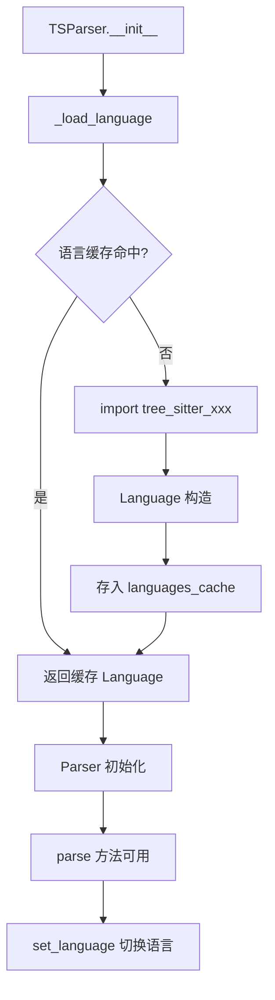
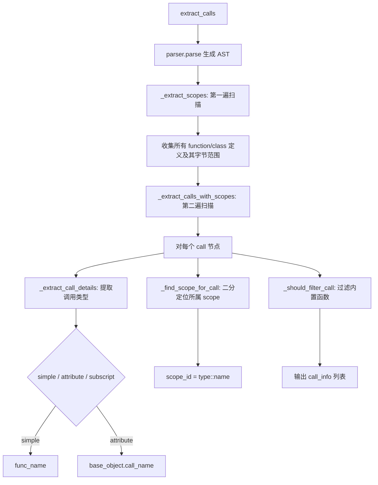
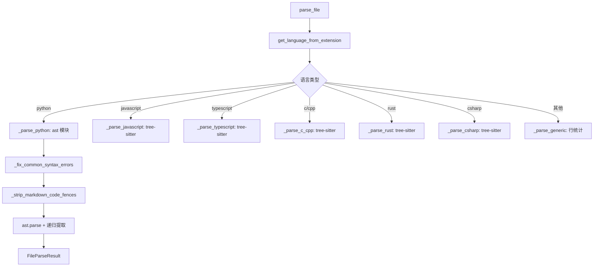

# PD-132.01 FastCode — 多语言 AST 解析与代码图谱构建

> 文档编号：PD-132.01
> 来源：FastCode `fastcode/parser.py` `fastcode/tree_sitter_parser.py` `fastcode/call_extractor.py`
> GitHub：https://github.com/HKUDS/FastCode.git
> 问题域：PD-132 AST代码解析 AST Code Parsing
> 状态：可复用方案

---

## 第 1 章 问题与动机

### 1.1 核心问题

代码理解系统（Code RAG、代码搜索、代码补全）需要从源码中提取结构化信息：函数签名、类继承、导入关系、调用链。纯文本匹配无法捕获这些语义关系，正则表达式在面对嵌套结构、多语言语法差异时极其脆弱。

核心挑战：
- **多语言统一**：Python/JS/TS/Java/Go/C/C++/Rust/C# 各有不同的语法树结构，需要统一的解析接口
- **精确提取**：函数参数类型、返回值、装饰器、异步标记、圈复杂度等细粒度信息
- **调用图构建**：不仅要知道"有哪些函数"，还要知道"谁调用了谁"，需要作用域追踪和符号解析
- **容错解析**：AI 生成的代码可能包含语法错误（如 `except X as e as e:`）或 markdown 代码围栏，解析器不能因此崩溃

### 1.2 FastCode 的解法概述

FastCode 采用**双引擎分层架构**：Python 用 `ast` + `libcst` 做深度解析，其他 7+ 语言用 `tree-sitter` 做统一解析。关键设计：

1. **TSParser 包装层**（`fastcode/tree_sitter_parser.py:12-161`）：封装 tree-sitter 的语言加载、缓存、健康检查，提供 `parse(code, language)` 统一接口
2. **CodeParser 路由器**（`fastcode/parser.py:93-138`）：按文件扩展名路由到对应语言解析器，输出统一的 `FileParseResult` 数据结构
3. **三层提取器**：`DefinitionExtractor`（定义提取）、`ImportExtractor`（导入提取）、`CallExtractor`（调用提取），各自用 tree-sitter Query（S-expression）做精确匹配
4. **符号解析链**：`GlobalIndexBuilder` → `ModuleResolver` → `SymbolResolver`，实现跨文件的符号定位
5. **代码图谱**：`CodeGraphBuilder` 用 NetworkX 构建依赖图、继承图、调用图三张有向图

### 1.3 设计思想

| 设计原则 | 具体实现 | 理由 | 替代方案 |
|----------|----------|------|----------|
| 双引擎互补 | Python 用 ast 模块深度解析，其他语言用 tree-sitter | ast 模块对 Python 的支持最完整（docstring、decorator、complexity），tree-sitter 提供跨语言统一性 | 全部用 tree-sitter（会丢失 Python 特有的 ast.get_docstring 等能力） |
| Query 模式匹配 | 用 tree-sitter S-expression Query 替代手动遍历 AST | 声明式查询比命令式遍历更简洁、更不易出错 | 递归遍历 AST 节点（代码量大、维护困难） |
| 依赖注入 | TSParser 通过构造函数注入到各 Extractor | 便于测试和复用，避免每个 Extractor 重复初始化 parser | 每个 Extractor 内部创建 parser（资源浪费） |
| 作用域追踪 | CallExtractor 用两遍扫描：先提取 scope，再将 call 归属到 scope | 构建调用图需要知道"谁调用了谁"，scope 信息是 caller 的关键 | 只提取 call 不追踪 scope（无法构建调用图） |
| 容错预处理 | 解析前修复常见语法错误、剥离 markdown 围栏 | AI 生成代码常有这些问题，不预处理会导致解析失败 | 直接解析失败返回 None（丢失大量文件） |

---

## 第 2 章 源码实现分析

### 2.1 架构概览

FastCode 的 AST 解析系统分为四层：

```
┌─────────────────────────────────────────────────────────────────┐
│                     CodeGraphBuilder                            │
│  (dependency_graph + inheritance_graph + call_graph via NX)     │
├─────────────────────────────────────────────────────────────────┤
│         SymbolResolver ← ModuleResolver ← GlobalIndexBuilder   │
│         (跨文件符号定位链)                                        │
├──────────────┬──────────────────┬───────────────────────────────┤
│ DefinitionExtractor │ ImportExtractor │ CallExtractor           │
│ (定义提取)           │ (导入提取)       │ (调用提取+作用域追踪)    │
├──────────────┴──────────────────┴───────────────────────────────┤
│                      CodeParser (路由层)                         │
│  Python→ast  JS/TS→tree-sitter  C/C++→tree-sitter  Rust/C#→ts │
├─────────────────────────────────────────────────────────────────┤
│                   TSParser (tree-sitter 包装层)                  │
│  语言加载 + 缓存 + 健康检查 + parse(code, lang)                  │
└─────────────────────────────────────────────────────────────────┘
```

### 2.2 核心实现

#### 2.2.1 TSParser — tree-sitter 统一包装



对应源码 `fastcode/tree_sitter_parser.py:12-161`：

```python
class TSParser:
    def __init__(self, language: str = 'python'):
        self.logger = logging.getLogger(__name__)
        self.current_language_name = language.lower()
        self.parser = None
        self.language = None
        self.languages_cache: Dict[str, Language] = {}  # Cache loaded languages
        self._initialize_parser()

    def _load_language(self, language_name: str) -> Language:
        # Check cache first
        if language_name in self.languages_cache:
            return self.languages_cache[language_name]
        # Import the appropriate tree-sitter language module
        if language_name == 'python':
            import tree_sitter_python
            lang = Language(tree_sitter_python.language())
        elif language_name == 'javascript':
            import tree_sitter_javascript
            lang = Language(tree_sitter_javascript.language())
        # ... 支持 10 种语言
        self.languages_cache[language_name] = lang
        return lang

    def parse(self, code: str, language: Optional[str] = None) -> Optional[tree_sitter.Tree]:
        if language and language.lower() != self.current_language_name:
            self.set_language(language)
        code_bytes = code.encode('utf-8')
        tree = self.parser.parse(code_bytes)
        return tree
```

关键设计点：
- **延迟加载**（`fastcode/tree_sitter_parser.py:49-100`）：每种语言的 tree-sitter 绑定只在首次使用时 import，避免启动时加载全部语言
- **语言缓存**（`fastcode/tree_sitter_parser.py:60-61`）：`languages_cache` 字典避免重复加载同一语言
- **健康检查**（`fastcode/tree_sitter_parser.py:158-160`）：`is_healthy()` 方法确保 parser 和 language 都已初始化

#### 2.2.2 CallExtractor — 作用域感知的调用提取



对应源码 `fastcode/call_extractor.py:14-188`：

```python
class CallExtractor:
    def __init__(self, parser: Optional[TSParser] = None):
        self.parser = parser if parser is not None else TSParser()
        self._builtin_functions = self._get_builtin_functions()
        self._init_queries()

    def _init_queries(self):
        language = self.parser.get_language()
        # 调用查询：匹配所有函数调用
        self._call_query = Query(language, """
            (call
                function: (_) @function_name
            ) @call
        """)
        # 作用域查询：匹配函数和类定义
        self._scope_query = Query(language, """
            (function_definition
                name: (identifier) @func_name
            ) @func_def
            (class_definition
                name: (identifier) @class_name
            ) @class_def
        """)
        # 实例变量类型推断查询
        self._init_type_query = Query(language, """
            (assignment
                left: (attribute
                    object: (identifier) @self_obj
                    attribute: (identifier) @attr_name
                )
                right: (call
                    function: (identifier) @class_name
                )
            ) @constructor_assign
        """)

    def extract_calls(self, code: str, file_path: str) -> List[Dict[str, Any]]:
        tree = self.parser.parse(code)
        scopes = self._extract_scopes(tree)           # 第一遍：收集作用域
        calls = self._extract_calls_with_scopes(tree, scopes, file_path)  # 第二遍：提取调用
        return calls
```

关键设计点：
- **两遍扫描**（`fastcode/call_extractor.py:155-187`）：先收集所有 scope 的字节范围，再将每个 call 归属到最内层 scope
- **S-expression Query**（`fastcode/call_extractor.py:87-101`）：用声明式查询替代手动遍历，代码量减少 60%+
- **实例类型推断**（`fastcode/call_extractor.py:475-536`）：`extract_instance_types` 方法通过分析 `self.x = ClassName()` 和类型注解推断实例变量类型，为调用图的方法解析提供类型信息

#### 2.2.3 CodeParser — 多语言路由与容错



对应源码 `fastcode/parser.py:109-138`：

```python
def parse_file(self, file_path: str, content: str) -> Optional[FileParseResult]:
    ext = get_file_extension(file_path)
    language = get_language_from_extension(ext)
    if language == "python":
        return self._parse_python(file_path, content)
    elif language == "javascript":
        return self._parse_javascript(file_path, content, language)
    elif language == "typescript":
        return self._parse_typescript(file_path, content, language)
    elif language in ["c", "cpp"]:
        return self._parse_c_cpp(file_path, content, language)
    elif language == "rust":
        return self._parse_rust(file_path, content)
    elif language == "csharp":
        return self._parse_csharp(file_path, content)
    else:
        return self._parse_generic(file_path, content, language)
```

Python 解析器的递归提取（`fastcode/parser.py:265-303`）特别值得注意——它会钻入 `if/try/with/for/while` 块内部提取被嵌套的函数和类定义，解决了"条件定义"被遗漏的问题：

```python
def _visit_nodes(node_list, parent_scope=None):
    for node in node_list:
        if isinstance(node, ast.ClassDef):
            class_info = self._extract_python_class(node)
            if class_info:
                classes.append(class_info)
        elif isinstance(node, (ast.FunctionDef, ast.AsyncFunctionDef)):
            func_info = self._extract_python_function(node)
            if func_info:
                functions.append(func_info)
        elif isinstance(node, (ast.If, ast.Try, ast.With, ast.AsyncWith, ast.For, ast.While)):
            _visit_nodes(node.body, parent_scope)
            if hasattr(node, 'orelse') and node.orelse:
                _visit_nodes(node.orelse, parent_scope)
            if hasattr(node, 'finalbody') and node.finalbody:
                _visit_nodes(node.finalbody, parent_scope)
```

### 2.3 实现细节

#### 符号解析链

FastCode 的符号解析是一个三级链路：

1. **GlobalIndexBuilder**（`fastcode/global_index_builder.py:16-325`）：构建三张查找表
   - `file_map`: 绝对路径 → file_id
   - `module_map`: 点分模块路径 → file_id
   - `export_map`: 模块路径 → {符号名: node_id}，包括 `ClassName.method` 格式

2. **ModuleResolver**（`fastcode/module_resolver.py:5-100`）：解析 import 语句到目标 file_id
   - 支持相对导入（`from ..utils import x`），正确处理 `__init__.py` 的特殊语义
   - 绝对导入直接查 `module_map`，未命中则判定为第三方库

3. **SymbolResolver**（`fastcode/symbol_resolver.py:14-217`）：两级解析策略
   - Local：当前文件的 export_map 查找
   - Imported：遍历 import 列表，通过 ModuleResolver 定位目标文件，再查 export_map

#### 调用图的实例方法解析

`CodeGraphBuilder._resolve_callee_with_symbol_resolver`（`fastcode/graph_builder.py:799-887`）实现了四级调用解析：

1. **简单调用** `func()` → 直接符号解析
2. **模块调用** `module.func()` → 检查 import 列表，拼接全名解析
3. **self/cls 调用** `self.method()` → 从 caller 元素获取 class_name，拼接 `ClassName.method` 解析
4. **实例方法调用** `obj.method()` → 通过 `extract_instance_types` 推断 obj 的类型，再解析 `ClassName.method`

实例方法解析还有三级作用域回退（`fastcode/graph_builder.py:889-1014`）：当前作用域 → `__init__` 作用域 → 全局作用域。


---

## 第 3 章 迁移指南

### 3.1 迁移清单

**阶段 1：基础解析层（1-2 天）**
- [ ] 安装 tree-sitter 及目标语言绑定：`pip install tree-sitter tree-sitter-python tree-sitter-javascript ...`
- [ ] 复制 `TSParser` 类，按需裁剪支持的语言列表
- [ ] 复制 `FunctionInfo`、`ClassInfo`、`ImportInfo`、`FileParseResult` 四个 dataclass
- [ ] 实现 `CodeParser.parse_file` 路由逻辑

**阶段 2：提取器层（2-3 天）**
- [ ] 复制 `DefinitionExtractor`，调整 S-expression Query 适配目标语言
- [ ] 复制 `ImportExtractor`，处理目标语言的 import 语法差异
- [ ] 复制 `CallExtractor`，重点是两遍扫描和作用域追踪逻辑

**阶段 3：符号解析与图谱（3-5 天）**
- [ ] 实现 `GlobalIndexBuilder`：file_map + module_map + export_map
- [ ] 实现 `ModuleResolver`：相对/绝对导入解析
- [ ] 实现 `SymbolResolver`：Local + Imported 两级解析
- [ ] 实现 `CodeGraphBuilder`：dependency + inheritance + call 三张图

### 3.2 适配代码模板

最小可用的多语言解析器（可直接运行）：

```python
import tree_sitter
from tree_sitter import Language, Parser, Query, QueryCursor
from dataclasses import dataclass, asdict
from typing import List, Dict, Any, Optional


@dataclass
class ParsedElement:
    """统一的代码元素结构"""
    name: str
    element_type: str  # 'function', 'class', 'method'
    start_line: int
    end_line: int
    file_path: str
    language: str
    parent: Optional[str] = None
    parameters: Optional[List[str]] = None
    docstring: Optional[str] = None


class MultiLangParser:
    """多语言 AST 解析器 — 从 FastCode TSParser 简化而来"""

    LANG_MODULES = {
        'python': ('tree_sitter_python', 'language'),
        'javascript': ('tree_sitter_javascript', 'language'),
        'typescript': ('tree_sitter_typescript', 'language_typescript'),
        'go': ('tree_sitter_go', 'language'),
        'rust': ('tree_sitter_rust', 'language'),
    }

    # 各语言的定义提取 Query（S-expression）
    QUERIES = {
        'python': """
            (function_definition name: (identifier) @func_name) @func_def
            (class_definition name: (identifier) @class_name) @class_def
        """,
        'javascript': """
            (function_declaration name: (identifier) @func_name) @func_def
            (class_declaration name: (identifier) @class_name) @class_def
        """,
        'typescript': """
            (function_declaration name: (identifier) @func_name) @func_def
            (class_declaration name: (identifier) @class_name) @class_def
            (interface_declaration name: (type_identifier) @class_name) @class_def
        """,
        'go': """
            (function_declaration name: (identifier) @func_name) @func_def
        """,
        'rust': """
            (function_item name: (identifier) @func_name) @func_def
            (struct_item name: (type_identifier) @class_name) @class_def
            (trait_item name: (type_identifier) @class_name) @class_def
        """,
    }

    def __init__(self):
        self._cache: Dict[str, Language] = {}

    def _get_language(self, lang: str) -> Language:
        if lang in self._cache:
            return self._cache[lang]
        mod_name, func_name = self.LANG_MODULES[lang]
        mod = __import__(mod_name)
        lang_obj = Language(getattr(mod, func_name)())
        self._cache[lang] = lang_obj
        return lang_obj

    def parse(self, code: str, language: str, file_path: str = "") -> List[ParsedElement]:
        """解析代码，返回结构化元素列表"""
        if language not in self.LANG_MODULES:
            return []

        lang_obj = self._get_language(language)
        parser = Parser(lang_obj)
        tree = parser.parse(code.encode('utf-8'))

        query_str = self.QUERIES.get(language, "")
        if not query_str:
            return []

        query = Query(lang_obj, query_str)
        cursor = QueryCursor(query)
        captures = cursor.captures(tree.root_node)

        elements = []
        # 处理 dict 格式（旧版 tree-sitter）
        if isinstance(captures, dict):
            for tag, nodes in captures.items():
                for node in nodes:
                    elem = self._process_capture(node, tag, code, file_path, language)
                    if elem:
                        elements.append(elem)
        else:
            for node, tag in captures:
                elem = self._process_capture(node, tag, code, file_path, language)
                if elem:
                    elements.append(elem)

        return elements

    def _process_capture(self, node, tag: str, code: str,
                         file_path: str, language: str) -> Optional[ParsedElement]:
        if tag in ('func_def', 'class_def'):
            name_node = node.child_by_field_name('name')
            if not name_node:
                return None
            name = code[name_node.start_byte:name_node.end_byte]
            return ParsedElement(
                name=name,
                element_type='class' if tag == 'class_def' else 'function',
                start_line=node.start_point[0] + 1,
                end_line=node.end_point[0] + 1,
                file_path=file_path,
                language=language,
            )
        return None


# 使用示例
if __name__ == "__main__":
    parser = MultiLangParser()
    py_code = '''
class MyService:
    def process(self, data: list) -> dict:
        return {"result": len(data)}

async def main():
    svc = MyService()
    return svc.process([1, 2, 3])
'''
    elements = parser.parse(py_code, "python", "example.py")
    for e in elements:
        print(f"  {e.element_type}: {e.name} (L{e.start_line}-L{e.end_line})")
```

### 3.3 适用场景

| 场景 | 适用度 | 说明 |
|------|--------|------|
| Code RAG / 代码搜索 | ⭐⭐⭐ | 提取函数签名和文档字符串作为检索单元 |
| 代码知识图谱构建 | ⭐⭐⭐ | 三张图（依赖/继承/调用）覆盖主要代码关系 |
| 代码审查辅助 | ⭐⭐⭐ | 圈复杂度计算 + 调用链追踪定位影响范围 |
| IDE 插件开发 | ⭐⭐ | 需要增量解析支持（FastCode 目前是全量解析） |
| 大规模代码分析 | ⭐⭐ | tree-sitter 性能优秀，但符号解析链是 O(N) 查找 |
| 实时代码补全 | ⭐ | 延迟要求高，需要增量 AST 更新（FastCode 不支持） |

---

## 第 4 章 测试用例

```python
import pytest
from unittest.mock import MagicMock, patch
from dataclasses import asdict


class TestTSParser:
    """测试 tree-sitter 包装层"""

    def test_init_python_parser(self):
        """测试 Python 解析器初始化"""
        from fastcode.tree_sitter_parser import TSParser
        parser = TSParser(language='python')
        assert parser.is_healthy()
        assert parser.current_language_name == 'python'

    def test_language_cache(self):
        """测试语言缓存机制"""
        from fastcode.tree_sitter_parser import TSParser
        parser = TSParser(language='python')
        lang1 = parser._load_language('python')
        lang2 = parser._load_language('python')
        assert lang1 is lang2  # 同一对象，来自缓存

    def test_switch_language(self):
        """测试语言切换"""
        from fastcode.tree_sitter_parser import TSParser
        parser = TSParser(language='python')
        parser.set_language('javascript')
        assert parser.current_language_name == 'javascript'
        assert parser.is_healthy()

    def test_parse_returns_tree(self):
        """测试解析返回有效语法树"""
        from fastcode.tree_sitter_parser import TSParser
        parser = TSParser(language='python')
        tree = parser.parse("def foo(): pass")
        assert tree is not None
        assert tree.root_node.type == 'module'

    def test_parse_invalid_input(self):
        """测试无效输入的容错"""
        from fastcode.tree_sitter_parser import TSParser
        parser = TSParser(language='python')
        assert parser.parse(None) is None
        assert parser.parse("") is not None  # 空字符串仍可解析

    def test_unsupported_language(self):
        """测试不支持的语言"""
        from fastcode.tree_sitter_parser import TSParser
        with pytest.raises(ValueError, match="Unsupported language"):
            TSParser(language='brainfuck')


class TestCallExtractor:
    """测试调用提取器"""

    def test_simple_call_extraction(self):
        """测试简单函数调用提取"""
        from fastcode.call_extractor import CallExtractor
        extractor = CallExtractor()
        code = '''
def main():
    result = process_data(input_list)
    save(result)
'''
        calls = extractor.extract_calls(code, "test.py")
        call_names = [c['call_name'] for c in calls]
        assert 'process_data' in call_names
        assert 'save' in call_names

    def test_scope_tracking(self):
        """测试作用域追踪"""
        from fastcode.call_extractor import CallExtractor
        extractor = CallExtractor()
        code = '''
def outer():
    helper()

def inner():
    other()
'''
        calls = extractor.extract_calls(code, "test.py")
        helper_call = next(c for c in calls if c['call_name'] == 'helper')
        other_call = next(c for c in calls if c['call_name'] == 'other')
        assert helper_call['scope_id'] == 'function::outer'
        assert other_call['scope_id'] == 'function::inner'

    def test_builtin_filtering(self):
        """测试内置函数过滤"""
        from fastcode.call_extractor import CallExtractor
        extractor = CallExtractor()
        code = '''
def foo():
    x = len([1, 2, 3])
    y = custom_func()
'''
        calls = extractor.extract_calls(code, "test.py")
        call_names = [c['call_name'] for c in calls]
        assert 'len' not in call_names  # 内置函数被过滤
        assert 'custom_func' in call_names

    def test_attribute_call(self):
        """测试属性调用提取"""
        from fastcode.call_extractor import CallExtractor
        extractor = CallExtractor()
        code = '''
def process():
    result = self.loader.load_data()
    logger.info("done")
'''
        calls = extractor.extract_calls(code, "test.py")
        assert any(c['call_type'] == 'attribute' for c in calls)

    def test_instance_type_extraction(self):
        """测试实例变量类型推断"""
        from fastcode.call_extractor import CallExtractor
        extractor = CallExtractor()
        code = '''
class MyClass:
    def __init__(self):
        self.loader = DataLoader()
        self.db: Database
'''
        types = extractor.extract_instance_types(code)
        # 应该在 function::__init__ 作用域中找到 self.loader
        init_types = types.get('function::__init__', {})
        assert 'self.loader' in init_types
        assert 'DataLoader' in init_types['self.loader']


class TestCodeParser:
    """测试多语言解析路由"""

    def test_python_parsing(self):
        """测试 Python 文件解析"""
        from fastcode.parser import CodeParser
        parser = CodeParser({"parser": {}})
        result = parser.parse_file("test.py", '''
class Foo:
    def bar(self, x: int) -> str:
        """A method"""
        return str(x)

def standalone():
    pass
''')
        assert result is not None
        assert result.language == "python"
        assert len(result.classes) == 1
        assert result.classes[0].name == "Foo"
        assert len(result.functions) == 1
        assert result.functions[0].name == "standalone"

    def test_markdown_fence_stripping(self):
        """测试 markdown 围栏剥离"""
        from fastcode.parser import CodeParser
        parser = CodeParser({"parser": {}})
        result = parser.parse_file("test.py", '```python\ndef foo(): pass\n```')
        assert result is not None
        assert len(result.functions) == 1

    def test_syntax_error_fix(self):
        """测试语法错误自动修复"""
        from fastcode.parser import CodeParser
        parser = CodeParser({"parser": {}})
        # 重复 as 子句是 AI 生成代码的常见错误
        result = parser.parse_file("test.py", '''
try:
    pass
except Exception as exc:
    pass
''')
        assert result is not None

    def test_nested_definitions(self):
        """测试嵌套在 if/try 中的定义提取"""
        from fastcode.parser import CodeParser
        parser = CodeParser({"parser": {}})
        result = parser.parse_file("test.py", '''
if True:
    def hidden_func():
        pass

try:
    class HiddenClass:
        pass
except:
    pass
''')
        assert result is not None
        assert any(f.name == "hidden_func" for f in result.functions)
        assert any(c.name == "HiddenClass" for c in result.classes)

    def test_generic_fallback(self):
        """测试不支持语言的降级处理"""
        from fastcode.parser import CodeParser
        parser = CodeParser({"parser": {}})
        result = parser.parse_file("test.rb", "def hello\n  puts 'hi'\nend")
        assert result is not None
        assert result.language == "ruby"
        assert result.total_lines == 3
```


---

## 第 5 章 跨域关联

| 关联域 | 关系类型 | 说明 |
|--------|----------|------|
| PD-08 搜索与检索 | 协同 | AST 解析提取的函数签名、类结构作为 Code RAG 的检索单元，FastCode 的 `retriever.py` 和 `vector_store.py` 直接消费 `FileParseResult` |
| PD-06 记忆持久化 | 协同 | `CodeGraphBuilder.save/load` 将三张图序列化为 pickle，支持增量合并（`merge_from_file`），避免重复解析 |
| PD-11 可观测性 | 协同 | 调用图的链接成功率（`linked_calls/total_calls`）是解析质量的核心指标，FastCode 在 `_build_call_graph` 中统计并输出 |
| PD-04 工具系统 | 依赖 | `agent_tools.py` 将解析能力封装为 Agent 可调用的工具，AST 解析是工具系统的底层能力 |
| PD-01 上下文管理 | 协同 | 解析结果的 token 计数（`utils.count_tokens`）用于控制送入 LLM 的代码片段大小 |

---

## 第 6 章 来源文件索引

| 文件 | 行范围 | 关键实现 |
|------|--------|----------|
| `fastcode/tree_sitter_parser.py` | L12-L161 | TSParser 类：tree-sitter 包装层，语言加载/缓存/切换/解析 |
| `fastcode/parser.py` | L19-L91 | FunctionInfo/ClassInfo/ImportInfo/FileParseResult 四个 dataclass |
| `fastcode/parser.py` | L93-L138 | CodeParser.parse_file：多语言路由入口 |
| `fastcode/parser.py` | L196-L322 | _parse_python：ast 模块深度解析 + 递归提取嵌套定义 |
| `fastcode/parser.py` | L140-L193 | _fix_common_syntax_errors + _strip_markdown_code_fences：容错预处理 |
| `fastcode/parser.py` | L474-L528 | _parse_javascript：tree-sitter JS 解析 |
| `fastcode/parser.py` | L782-L836 | _parse_typescript：tree-sitter TS 解析 |
| `fastcode/parser.py` | L916-L970 | _parse_c_cpp：tree-sitter C/C++ 解析 |
| `fastcode/parser.py` | L1169-L1222 | _parse_rust：tree-sitter Rust 解析 |
| `fastcode/parser.py` | L1411-L1464 | _parse_csharp：tree-sitter C# 解析 |
| `fastcode/call_extractor.py` | L14-L188 | CallExtractor：两遍扫描 + 作用域追踪 + S-expression Query |
| `fastcode/call_extractor.py` | L475-L536 | extract_instance_types：实例变量类型推断 |
| `fastcode/definition_extractor.py` | L14-L252 | DefinitionExtractor：定义提取 + 父作用域回溯 + 异步检测 |
| `fastcode/import_extractor.py` | L12-L154 | ImportExtractor：S-expression Query 导入提取 + 相对导入解析 |
| `fastcode/symbol_resolver.py` | L14-L217 | SymbolResolver：Local + Imported 两级符号解析 |
| `fastcode/module_resolver.py` | L5-L100 | ModuleResolver：相对/绝对导入解析 + __init__.py 特殊处理 |
| `fastcode/global_index_builder.py` | L16-L325 | GlobalIndexBuilder：file_map + module_map + export_map 三张查找表 |
| `fastcode/graph_builder.py` | L20-L133 | CodeGraphBuilder：三张 NetworkX 有向图 + 预计算查找表 |
| `fastcode/graph_builder.py` | L368-L453 | _build_call_graph：CallExtractor + SymbolResolver 联合构建调用图 |
| `fastcode/graph_builder.py` | L799-L1014 | _resolve_callee_with_symbol_resolver：四级调用解析 + 实例方法类型推断 |
| `fastcode/utils.py` | L123-L158 | get_language_from_extension：文件扩展名到语言的映射表 |
| `fastcode/utils.py` | L194-L204 | calculate_code_complexity：基于关键词的圈复杂度计算 |

---

## 第 7 章 横向对比维度

```json comparison_data
{
  "project": "FastCode",
  "dimensions": {
    "解析引擎": "双引擎：Python 用 ast+libcst，其他 7+ 语言用 tree-sitter",
    "语言覆盖": "Python/JS/TS/Java/Go/C/C++/Rust/C# 共 10 种语言",
    "提取粒度": "函数签名+参数类型+返回值+装饰器+docstring+圈复杂度+调用链",
    "调用图构建": "两遍扫描+作用域追踪+实例类型推断+四级符号解析",
    "容错能力": "语法错误自动修复+markdown围栏剥离+解析失败降级为行统计",
    "符号解析": "三级链路：GlobalIndex→ModuleResolver→SymbolResolver，支持跨文件解析"
  }
}
```

### 域元数据补充

```json domain_metadata
{
  "solution_summary": "FastCode 用 ast+tree-sitter 双引擎解析 10 种语言，通过 S-expression Query 提取定义/导入/调用，配合三级符号解析链构建依赖/继承/调用三张 NetworkX 图谱",
  "description": "从源码到代码知识图谱的完整管线，覆盖解析、提取、符号解析、图谱构建全链路",
  "sub_problems": [
    "实例变量类型推断与方法调用解析",
    "AI 生成代码的容错预处理",
    "跨文件符号定位与模块路径解析",
    "代码图谱的持久化与增量合并"
  ],
  "best_practices": [
    "用 S-expression Query 替代手动 AST 遍历提升可维护性",
    "两遍扫描法实现作用域感知的调用提取",
    "三级符号解析链实现跨文件定义定位",
    "解析前预处理修复 AI 生成代码的常见语法错误"
  ]
}
```

