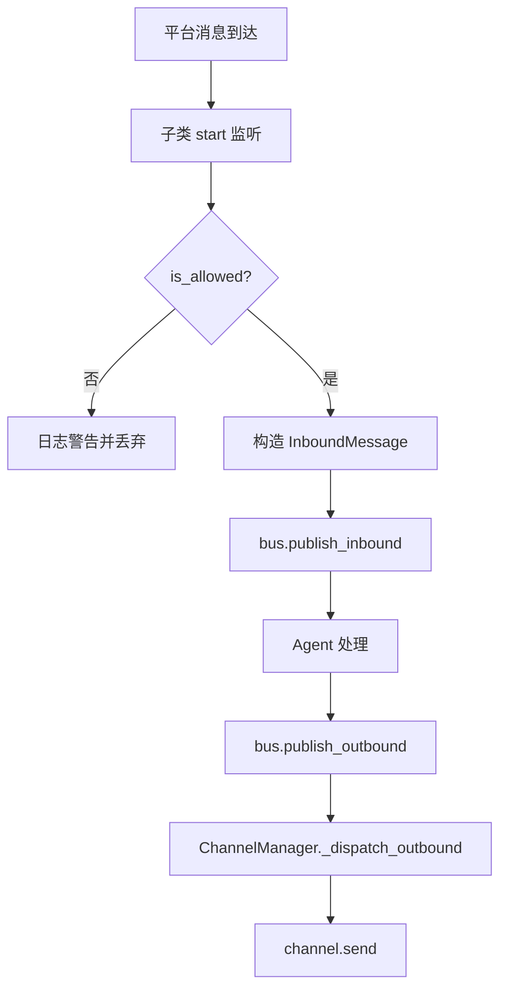
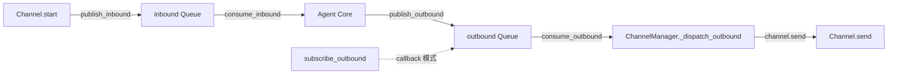
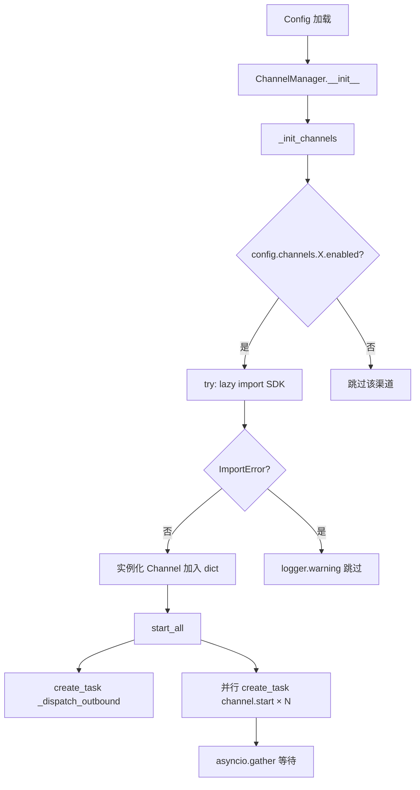

# PD-133.01 Nanobot — 8 平台统一消息网关

> 文档编号：PD-133.01
> 来源：Nanobot `nanobot/channels/manager.py`, `nanobot/bus/queue.py`, `nanobot/channels/base.py`
> GitHub：https://github.com/HKUDS/FastCode.git
> 问题域：PD-133 多渠道消息网关 Multi-Channel Message Gateway
> 状态：可复用方案

---

## 第 1 章 问题与动机

### 1.1 核心问题

一个 AI Agent 要同时服务 Telegram、WhatsApp、Discord、飞书、钉钉、Email、Slack、QQ 共 8 个消息平台的用户。每个平台有完全不同的协议（HTTP 长轮询、WebSocket Gateway、SDK 回调、IMAP 轮询等）、消息格式（Markdown、HTML、Interactive Card、纯文本）和认证方式（Bot Token、App ID/Secret、OAuth2 Access Token）。

如果 Agent 核心直接耦合各平台 SDK，会导致：
- 每新增一个平台就要修改 Agent 核心代码
- 平台 SDK 的异常（网络断连、限流、认证过期）会污染 Agent 逻辑
- 无法独立启停单个渠道，一个渠道崩溃可能拖垮整个系统

### 1.2 Nanobot 的解法概述

Nanobot 采用三层解耦架构：

1. **BaseChannel ABC 统一接口** — 所有 8 个渠道实现同一个抽象基类，暴露 `start()/stop()/send()` 三个方法，协议差异完全封装在子类内部 (`channels/base.py:12-127`)
2. **MessageBus 双队列解耦** — 用两个 `asyncio.Queue`（inbound/outbound）彻底隔离渠道层和 Agent 核心，渠道只负责收发，不知道 Agent 如何处理 (`bus/queue.py:11-81`)
3. **ChannelManager 配置驱动** — 通过 Pydantic Config 决定启用哪些渠道，延迟导入（lazy import）避免未安装 SDK 导致启动失败，并行启动所有渠道 (`channels/manager.py:19-220`)
4. **统一访问控制** — `allow_from` 白名单在 BaseChannel 层统一拦截，各渠道无需重复实现权限逻辑 (`channels/base.py:61-84`)
5. **出站消息路由** — ChannelManager 运行一个 `_dispatch_outbound` 协程，从 outbound 队列消费消息并按 `msg.channel` 字段路由到对应渠道 (`channels/manager.py:178-201`)

### 1.3 设计思想

| 设计原则 | 具体实现 | 理由 | 替代方案 |
|----------|----------|------|----------|
| 协议无关的统一接口 | BaseChannel ABC 定义 start/stop/send 三方法 | 新增渠道只需实现子类，不改核心 | 每个渠道独立模块无公共接口（难以统一管理） |
| 异步队列解耦 | MessageBus 双 asyncio.Queue | 渠道崩溃不影响 Agent，支持背压 | 直接回调（耦合度高，异常传播） |
| 配置驱动启用 | Pydantic ChannelsConfig 每个渠道有 enabled 开关 | 零代码切换渠道组合 | 硬编码渠道列表（每次改代码） |
| 延迟导入容错 | try/except ImportError 包裹各渠道 SDK | 未安装某 SDK 不影响其他渠道 | 全部 SDK 作为必选依赖（安装成本高） |
| 统一访问控制 | BaseChannel.is_allowed() + allow_from 白名单 | 一处实现，8 个渠道复用 | 每个渠道各自实现（容易遗漏） |

---

## 第 2 章 源码实现分析

### 2.1 架构概览

Nanobot 的多渠道消息网关采用经典的 Hub-and-Spoke 架构，MessageBus 是中心枢纽，8 个 Channel 是辐条：

```
┌──────────────────────────────────────────────────────────────┐
│                      ChannelManager                          │
│  ┌─────────┐ ┌─────────┐ ┌─────────┐ ┌─────────┐           │
│  │Telegram │ │ Discord │ │  Feishu │ │DingTalk │  ...×8     │
│  │(polling)│ │  (WS)   │ │(WS+SDK) │ │(Stream) │           │
│  └────┬────┘ └────┬────┘ └────┬────┘ └────┬────┘           │
│       │           │           │           │                  │
│       ▼           ▼           ▼           ▼                  │
│  ┌──────────────────────────────────────────────┐           │
│  │              MessageBus                       │           │
│  │  inbound: asyncio.Queue[InboundMessage]       │           │
│  │  outbound: asyncio.Queue[OutboundMessage]     │           │
│  └──────────────────┬───────────────────────────┘           │
│                     │                                        │
└─────────────────────┼────────────────────────────────────────┘
                      │
                      ▼
              ┌───────────────┐
              │  Agent Core   │
              │ (consume_inbound → process → publish_outbound) │
              └───────────────┘
```

### 2.2 核心实现

#### 2.2.1 BaseChannel — 统一渠道接口



对应源码 `nanobot/nanobot/channels/base.py:12-127`：

```python
class BaseChannel(ABC):
    name: str = "base"

    def __init__(self, config: Any, bus: MessageBus):
        self.config = config
        self.bus = bus
        self._running = False

    @abstractmethod
    async def start(self) -> None: ...

    @abstractmethod
    async def stop(self) -> None: ...

    @abstractmethod
    async def send(self, msg: OutboundMessage) -> None: ...

    def is_allowed(self, sender_id: str) -> bool:
        allow_list = getattr(self.config, "allow_from", [])
        if not allow_list:
            return True
        sender_str = str(sender_id)
        if sender_str in allow_list:
            return True
        if "|" in sender_str:
            for part in sender_str.split("|"):
                if part and part in allow_list:
                    return True
        return False

    async def _handle_message(
        self, sender_id: str, chat_id: str, content: str,
        media: list[str] | None = None, metadata: dict[str, Any] | None = None
    ) -> None:
        if not self.is_allowed(sender_id):
            logger.warning(f"Access denied for sender {sender_id} on channel {self.name}.")
            return
        msg = InboundMessage(
            channel=self.name, sender_id=str(sender_id),
            chat_id=str(chat_id), content=content,
            media=media or [], metadata=metadata or {}
        )
        await self.bus.publish_inbound(msg)
```

关键设计点：
- `_handle_message()` 是模板方法，子类只需调用它，权限检查和消息构造自动完成 (`base.py:86-122`)
- `is_allowed()` 支持复合 ID（如 Telegram 的 `"12345|username"` 格式），用 `|` 分割后逐段匹配 (`base.py:80-84`)
- `is_running` 属性让 ChannelManager 可以查询各渠道状态 (`base.py:124-127`)

#### 2.2.2 MessageBus — 双队列消息总线



对应源码 `nanobot/nanobot/bus/queue.py:11-81`：

```python
class MessageBus:
    def __init__(self):
        self.inbound: asyncio.Queue[InboundMessage] = asyncio.Queue()
        self.outbound: asyncio.Queue[OutboundMessage] = asyncio.Queue()
        self._outbound_subscribers: dict[str, list[Callable[[OutboundMessage], Awaitable[None]]]] = {}
        self._running = False

    async def publish_inbound(self, msg: InboundMessage) -> None:
        await self.inbound.put(msg)

    async def consume_inbound(self) -> InboundMessage:
        return await self.inbound.get()

    async def publish_outbound(self, msg: OutboundMessage) -> None:
        await self.outbound.put(msg)

    async def consume_outbound(self) -> OutboundMessage:
        return await self.outbound.get()

    def subscribe_outbound(self, channel: str,
                           callback: Callable[[OutboundMessage], Awaitable[None]]) -> None:
        if channel not in self._outbound_subscribers:
            self._outbound_subscribers[channel] = []
        self._outbound_subscribers[channel].append(callback)

    async def dispatch_outbound(self) -> None:
        self._running = True
        while self._running:
            try:
                msg = await asyncio.wait_for(self.outbound.get(), timeout=1.0)
                subscribers = self._outbound_subscribers.get(msg.channel, [])
                for callback in subscribers:
                    try:
                        await callback(msg)
                    except Exception as e:
                        logger.error(f"Error dispatching to {msg.channel}: {e}")
            except asyncio.TimeoutError:
                continue
```

关键设计点：
- 提供两种出站分发模式：ChannelManager 的轮询式 `consume_outbound()` 和 MessageBus 自带的订阅式 `subscribe_outbound()` (`queue.py:41-67`)
- `asyncio.wait_for(timeout=1.0)` 避免无限阻塞，让 `_running` 标志位有机会被检查 (`queue.py:59`)
- `inbound_size`/`outbound_size` 属性暴露队列深度，可用于监控和背压 (`queue.py:73-81`)

#### 2.2.3 ChannelManager — 配置驱动的渠道编排



对应源码 `nanobot/nanobot/channels/manager.py:38-156`：

```python
def _init_channels(self) -> None:
    # Telegram channel
    if self.config.channels.telegram.enabled:
        try:
            from nanobot.channels.telegram import TelegramChannel
            self.channels["telegram"] = TelegramChannel(
                self.config.channels.telegram, self.bus,
                groq_api_key=self.config.providers.groq.api_key,
                session_manager=self.session_manager,
            )
            logger.info("Telegram channel enabled")
        except ImportError as e:
            logger.warning(f"Telegram channel not available: {e}")
    # ... 同样模式重复 7 次 ...

async def start_all(self) -> None:
    if not self.channels:
        logger.warning("No channels enabled")
        return
    self._dispatch_task = asyncio.create_task(self._dispatch_outbound())
    tasks = []
    for name, channel in self.channels.items():
        logger.info(f"Starting {name} channel...")
        tasks.append(asyncio.create_task(self._start_channel(name, channel)))
    await asyncio.gather(*tasks, return_exceptions=True)
```

### 2.3 实现细节

#### 协议适配模式对比

8 个渠道使用了 5 种不同的连接模式，全部封装在各自的 `start()` 方法中：

| 渠道 | 连接模式 | SDK/库 | 关键特性 |
|------|----------|--------|----------|
| Telegram | HTTP 长轮询 | python-telegram-bot | Markdown→HTML 转换，语音转写 |
| Discord | WebSocket Gateway | websockets + httpx | 心跳维持，限流重试(3次)，typing 指示器 |
| Feishu | WebSocket 长连接 | lark-oapi | 线程→asyncio 桥接，OrderedDict 去重(1000条) |
| DingTalk | Stream Mode | dingtalk-stream | OAuth2 Token 自动刷新(提前60s)，HTTP API 发送 |
| WhatsApp | WebSocket Bridge | websockets | Node.js baileys 桥接，QR 认证，自动重连 |
| Email | IMAP 轮询 + SMTP | imaplib + smtplib | consent 门控，UID 去重(10万上限)，HTML→纯文本 |
| Slack | Socket Mode | slack-sdk | group/DM 策略分离，@mention 检测 |
| QQ | WebSocket | botpy | C2C 私聊，deque 去重(maxlen=1000) |

#### 消息去重策略

不同渠道采用不同的去重机制：
- **Feishu**: `OrderedDict` 保留最近 500-1000 条 message_id (`feishu.py:260-266`)
- **QQ**: `deque(maxlen=1000)` 固定容量环形缓冲 (`qq.py:57`)
- **Email**: `set` + 10 万上限后清空重建 (`email.py:58-59, 303-307`)
- **Discord/Telegram/WhatsApp/Slack/DingTalk**: 依赖平台自身的消息去重

#### 出站消息路由

`_dispatch_outbound()` 是一个永久运行的协程，从 outbound 队列取消息，按 `msg.channel` 字段查找对应的 Channel 实例并调用 `send()` (`manager.py:178-201`)：

```python
async def _dispatch_outbound(self) -> None:
    while True:
        try:
            msg = await asyncio.wait_for(self.bus.consume_outbound(), timeout=1.0)
            channel = self.channels.get(msg.channel)
            if channel:
                try:
                    await channel.send(msg)
                except Exception as e:
                    logger.error(f"Error sending to {msg.channel}: {e}")
            else:
                logger.warning(f"Unknown channel: {msg.channel}")
        except asyncio.TimeoutError:
            continue
        except asyncio.CancelledError:
            break
```

---

## 第 3 章 迁移指南

### 3.1 迁移清单

**阶段 1：基础设施（必选）**
- [ ] 定义 `InboundMessage` / `OutboundMessage` 数据类（参考 `bus/events.py`）
- [ ] 实现 `MessageBus` 双队列（inbound + outbound）
- [ ] 定义 `BaseChannel` ABC（start/stop/send + _handle_message 模板方法）
- [ ] 实现 `ChannelManager`（配置驱动初始化 + 并行启动 + 出站路由）

**阶段 2：渠道接入（按需选择）**
- [ ] 实现第一个渠道（建议从 Telegram 开始，SDK 最成熟）
- [ ] 添加 Pydantic 配置模型（enabled 开关 + 渠道特定参数）
- [ ] 在 ChannelManager._init_channels() 中注册新渠道

**阶段 3：生产加固**
- [ ] 添加消息去重（根据平台特性选择 OrderedDict/deque/set）
- [ ] 添加 allow_from 白名单访问控制
- [ ] 添加渠道状态监控（get_status）
- [ ] 添加优雅停机（stop_all 逐个关闭渠道）

### 3.2 适配代码模板

以下代码可直接复用，实现一个最小可用的多渠道消息网关：

```python
"""最小可用的多渠道消息网关 — 基于 Nanobot 架构"""
import asyncio
from abc import ABC, abstractmethod
from dataclasses import dataclass, field
from datetime import datetime
from typing import Any, Callable, Awaitable

# ---- 事件定义 ----

@dataclass
class InboundMessage:
    channel: str
    sender_id: str
    chat_id: str
    content: str
    timestamp: datetime = field(default_factory=datetime.now)
    media: list[str] = field(default_factory=list)
    metadata: dict[str, Any] = field(default_factory=dict)

    @property
    def session_key(self) -> str:
        return f"{self.channel}:{self.chat_id}"

@dataclass
class OutboundMessage:
    channel: str
    chat_id: str
    content: str
    reply_to: str | None = None
    media: list[str] = field(default_factory=list)
    metadata: dict[str, Any] = field(default_factory=dict)

# ---- 消息总线 ----

class MessageBus:
    def __init__(self):
        self.inbound: asyncio.Queue[InboundMessage] = asyncio.Queue()
        self.outbound: asyncio.Queue[OutboundMessage] = asyncio.Queue()

    async def publish_inbound(self, msg: InboundMessage) -> None:
        await self.inbound.put(msg)

    async def consume_inbound(self) -> InboundMessage:
        return await self.inbound.get()

    async def publish_outbound(self, msg: OutboundMessage) -> None:
        await self.outbound.put(msg)

    async def consume_outbound(self) -> OutboundMessage:
        return await self.outbound.get()

# ---- 渠道基类 ----

class BaseChannel(ABC):
    name: str = "base"

    def __init__(self, config: Any, bus: MessageBus):
        self.config = config
        self.bus = bus
        self._running = False

    @abstractmethod
    async def start(self) -> None: ...

    @abstractmethod
    async def stop(self) -> None: ...

    @abstractmethod
    async def send(self, msg: OutboundMessage) -> None: ...

    def is_allowed(self, sender_id: str) -> bool:
        allow_list = getattr(self.config, "allow_from", [])
        if not allow_list:
            return True
        return str(sender_id) in allow_list

    async def _handle_message(self, sender_id: str, chat_id: str,
                               content: str, **kwargs) -> None:
        if not self.is_allowed(sender_id):
            return
        msg = InboundMessage(
            channel=self.name, sender_id=str(sender_id),
            chat_id=str(chat_id), content=content,
            media=kwargs.get("media", []),
            metadata=kwargs.get("metadata", {}),
        )
        await self.bus.publish_inbound(msg)

    @property
    def is_running(self) -> bool:
        return self._running

# ---- 渠道管理器 ----

class ChannelManager:
    def __init__(self, config: Any, bus: MessageBus):
        self.config = config
        self.bus = bus
        self.channels: dict[str, BaseChannel] = {}
        self._dispatch_task: asyncio.Task | None = None

    def register(self, name: str, channel: BaseChannel) -> None:
        """注册一个渠道实例"""
        self.channels[name] = channel

    async def start_all(self) -> None:
        self._dispatch_task = asyncio.create_task(self._dispatch_outbound())
        tasks = [asyncio.create_task(ch.start()) for ch in self.channels.values()]
        await asyncio.gather(*tasks, return_exceptions=True)

    async def stop_all(self) -> None:
        if self._dispatch_task:
            self._dispatch_task.cancel()
        for ch in self.channels.values():
            await ch.stop()

    async def _dispatch_outbound(self) -> None:
        while True:
            try:
                msg = await asyncio.wait_for(
                    self.bus.consume_outbound(), timeout=1.0)
                channel = self.channels.get(msg.channel)
                if channel:
                    await channel.send(msg)
            except asyncio.TimeoutError:
                continue
            except asyncio.CancelledError:
                break
```

### 3.3 适用场景

| 场景 | 适用度 | 说明 |
|------|--------|------|
| AI Agent 多平台接入 | ⭐⭐⭐ | 核心场景，直接复用 |
| 客服系统多渠道统一 | ⭐⭐⭐ | 消息路由 + 会话管理天然匹配 |
| 消息转发/聚合机器人 | ⭐⭐⭐ | 跨平台消息桥接 |
| 单平台 Bot 开发 | ⭐ | 架构过重，直接用平台 SDK 即可 |
| 高吞吐消息系统(>10K QPS) | ⭐⭐ | asyncio.Queue 无持久化，需换 Redis/Kafka |

---

## 第 4 章 测试用例

```python
"""基于 Nanobot 真实函数签名的测试用例"""
import asyncio
import pytest
from unittest.mock import AsyncMock, MagicMock, patch
from dataclasses import dataclass, field
from typing import Any


# ---- 测试 MessageBus ----

class TestMessageBus:
    @pytest.fixture
    def bus(self):
        from nanobot.bus.queue import MessageBus
        return MessageBus()

    @pytest.mark.asyncio
    async def test_inbound_publish_consume(self, bus):
        """正常路径：发布入站消息后可消费"""
        from nanobot.bus.events import InboundMessage
        msg = InboundMessage(
            channel="telegram", sender_id="123",
            chat_id="456", content="hello"
        )
        await bus.publish_inbound(msg)
        assert bus.inbound_size == 1
        result = await bus.consume_inbound()
        assert result.content == "hello"
        assert result.session_key == "telegram:456"

    @pytest.mark.asyncio
    async def test_outbound_publish_consume(self, bus):
        """正常路径：发布出站消息后可消费"""
        from nanobot.bus.events import OutboundMessage
        msg = OutboundMessage(channel="discord", chat_id="789", content="reply")
        await bus.publish_outbound(msg)
        assert bus.outbound_size == 1
        result = await bus.consume_outbound()
        assert result.channel == "discord"

    @pytest.mark.asyncio
    async def test_subscribe_outbound_dispatch(self, bus):
        """订阅模式：注册回调后 dispatch 能正确分发"""
        from nanobot.bus.events import OutboundMessage
        received = []
        async def callback(msg):
            received.append(msg)
        bus.subscribe_outbound("slack", callback)
        msg = OutboundMessage(channel="slack", chat_id="ch1", content="hi")
        await bus.publish_outbound(msg)
        # 启动 dispatch 并在短时间后停止
        task = asyncio.create_task(bus.dispatch_outbound())
        await asyncio.sleep(0.1)
        bus.stop()
        await asyncio.sleep(0.1)
        task.cancel()
        assert len(received) == 1
        assert received[0].content == "hi"


# ---- 测试 BaseChannel ----

class TestBaseChannel:
    def test_is_allowed_empty_list(self):
        """边界：空白名单允许所有人"""
        from nanobot.channels.base import BaseChannel
        config = MagicMock()
        config.allow_from = []
        bus = MagicMock()
        # 创建一个具体子类用于测试
        class DummyChannel(BaseChannel):
            name = "dummy"
            async def start(self): pass
            async def stop(self): pass
            async def send(self, msg): pass
        ch = DummyChannel(config, bus)
        assert ch.is_allowed("anyone") is True

    def test_is_allowed_with_list(self):
        """正常路径：白名单匹配"""
        from nanobot.channels.base import BaseChannel
        config = MagicMock()
        config.allow_from = ["123", "admin"]
        bus = MagicMock()
        class DummyChannel(BaseChannel):
            name = "dummy"
            async def start(self): pass
            async def stop(self): pass
            async def send(self, msg): pass
        ch = DummyChannel(config, bus)
        assert ch.is_allowed("123") is True
        assert ch.is_allowed("999") is False

    def test_is_allowed_compound_id(self):
        """边界：Telegram 复合 ID (id|username) 格式"""
        from nanobot.channels.base import BaseChannel
        config = MagicMock()
        config.allow_from = ["admin"]
        bus = MagicMock()
        class DummyChannel(BaseChannel):
            name = "dummy"
            async def start(self): pass
            async def stop(self): pass
            async def send(self, msg): pass
        ch = DummyChannel(config, bus)
        assert ch.is_allowed("12345|admin") is True
        assert ch.is_allowed("12345|stranger") is False

    @pytest.mark.asyncio
    async def test_handle_message_denied(self):
        """降级：未授权用户消息被丢弃"""
        from nanobot.channels.base import BaseChannel
        from nanobot.bus.queue import MessageBus
        config = MagicMock()
        config.allow_from = ["allowed_user"]
        bus = MessageBus()
        class DummyChannel(BaseChannel):
            name = "dummy"
            async def start(self): pass
            async def stop(self): pass
            async def send(self, msg): pass
        ch = DummyChannel(config, bus)
        await ch._handle_message(sender_id="blocked_user", chat_id="c1", content="hi")
        assert bus.inbound_size == 0  # 消息未进入队列


# ---- 测试 ChannelManager ----

class TestChannelManager:
    @pytest.mark.asyncio
    async def test_dispatch_routes_to_correct_channel(self):
        """正常路径：出站消息路由到正确渠道"""
        from nanobot.bus.queue import MessageBus
        from nanobot.bus.events import OutboundMessage
        bus = MessageBus()
        config = MagicMock()
        config.channels = MagicMock()
        # 禁用所有渠道以避免真实初始化
        for ch_name in ["telegram","whatsapp","discord","feishu","dingtalk","email","slack","qq"]:
            getattr(config.channels, ch_name).enabled = False

        from nanobot.channels.manager import ChannelManager
        mgr = ChannelManager(config, bus)

        mock_channel = AsyncMock()
        mock_channel.is_running = True
        mgr.channels["test"] = mock_channel

        msg = OutboundMessage(channel="test", chat_id="c1", content="hello")
        await bus.publish_outbound(msg)

        # 手动运行一次 dispatch 循环
        mgr._dispatch_task = asyncio.create_task(mgr._dispatch_outbound())
        await asyncio.sleep(0.2)
        mgr._dispatch_task.cancel()

        mock_channel.send.assert_called_once()
        assert mock_channel.send.call_args[0][0].content == "hello"

    def test_get_status(self):
        """正常路径：状态查询返回所有渠道"""
        from nanobot.bus.queue import MessageBus
        bus = MessageBus()
        config = MagicMock()
        config.channels = MagicMock()
        for ch_name in ["telegram","whatsapp","discord","feishu","dingtalk","email","slack","qq"]:
            getattr(config.channels, ch_name).enabled = False

        from nanobot.channels.manager import ChannelManager
        mgr = ChannelManager(config, bus)

        mock_ch = MagicMock()
        mock_ch.is_running = True
        mgr.channels["telegram"] = mock_ch

        status = mgr.get_status()
        assert "telegram" in status
        assert status["telegram"]["running"] is True
```

---

## 第 5 章 跨域关联

| 关联域 | 关系类型 | 说明 |
|--------|----------|------|
| PD-01 上下文管理 | 协同 | InboundMessage.session_key 用于关联会话上下文，Telegram 的 /reset 命令直接清空 SessionManager |
| PD-04 工具系统 | 协同 | Agent 核心从 MessageBus 消费入站消息后调用工具系统处理，工具执行结果通过 outbound 队列返回 |
| PD-06 记忆持久化 | 协同 | session_key (channel:chat_id) 是记忆系统的索引键，Telegram 渠道直接注入 SessionManager |
| PD-09 Human-in-the-Loop | 依赖 | 多渠道网关是 HITL 的物理载体，用户通过各平台发送审批/确认消息 |
| PD-139 配置驱动架构 | 依赖 | ChannelsConfig Pydantic 模型驱动渠道启停，是配置驱动架构的典型应用 |

---

## 第 6 章 来源文件索引

| 文件 | 行范围 | 关键实现 |
|------|--------|----------|
| `nanobot/nanobot/channels/base.py` | L12-L127 | BaseChannel ABC：统一接口 + 权限控制 + 模板方法 |
| `nanobot/nanobot/bus/queue.py` | L11-L81 | MessageBus：双 asyncio.Queue + 订阅分发 |
| `nanobot/nanobot/bus/events.py` | L1-L37 | InboundMessage / OutboundMessage 数据类 |
| `nanobot/nanobot/channels/manager.py` | L19-L220 | ChannelManager：配置驱动初始化 + 并行启动 + 出站路由 |
| `nanobot/nanobot/config/schema.py` | L8-L117 | 8 个渠道的 Pydantic 配置模型 + ChannelsConfig 聚合 |
| `nanobot/nanobot/channels/telegram.py` | L85-L401 | Telegram 渠道：长轮询 + Markdown→HTML + 语音转写 |
| `nanobot/nanobot/channels/discord.py` | L22-L262 | Discord 渠道：WebSocket Gateway + 心跳 + 限流重试 |
| `nanobot/nanobot/channels/feishu.py` | L42-L308 | 飞书渠道：WebSocket 长连接 + 线程桥接 + 去重 |
| `nanobot/nanobot/channels/dingtalk.py` | L36-L239 | 钉钉渠道：Stream Mode + OAuth2 Token + HTTP API |
| `nanobot/nanobot/channels/whatsapp.py` | L15-L146 | WhatsApp 渠道：Node.js Bridge + QR 认证 |
| `nanobot/nanobot/channels/email.py` | L25-L404 | Email 渠道：IMAP 轮询 + SMTP + consent 门控 |
| `nanobot/nanobot/channels/slack.py` | L19-L80+ | Slack 渠道：Socket Mode + group/DM 策略 |
| `nanobot/nanobot/channels/qq.py` | L48-L132 | QQ 渠道：botpy SDK + C2C 私聊 |

---

## 第 7 章 横向对比维度

```json comparison_data
{
  "project": "Nanobot",
  "dimensions": {
    "渠道数量": "8 个平台：Telegram/WhatsApp/Discord/Feishu/DingTalk/Email/Slack/QQ",
    "解耦机制": "MessageBus 双 asyncio.Queue（inbound + outbound）",
    "渠道接口": "BaseChannel ABC 统一 start/stop/send 三方法",
    "配置驱动": "Pydantic ChannelsConfig 每渠道 enabled 开关 + 延迟导入容错",
    "访问控制": "BaseChannel.is_allowed() 统一白名单，支持复合 ID",
    "消息去重": "按渠道差异化：OrderedDict/deque/set 三种策略",
    "出站路由": "ChannelManager 单协程轮询 outbound 队列按 channel 字段分发"
  }
}
```

### 域元数据补充

```json domain_metadata
{
  "solution_summary": "Nanobot 用 BaseChannel ABC + MessageBus 双 asyncio.Queue + ChannelManager 配置驱动延迟导入，统一接入 8 个消息平台并实现协议无关的消息路由",
  "description": "通过抽象基类和异步队列实现协议无关的多平台消息网关",
  "sub_problems": [
    "跨线程事件循环桥接（飞书 SDK 线程回调→asyncio）",
    "平台特定消息格式转换（Markdown→HTML/Card/纯文本）",
    "OAuth2 Token 自动刷新与过期管理",
    "SDK 可选依赖的延迟导入与优雅降级"
  ],
  "best_practices": [
    "用 BaseChannel ABC 模板方法统一权限检查和消息构造",
    "延迟导入 + ImportError 捕获实现 SDK 可选依赖",
    "按平台特性选择差异化去重策略（OrderedDict/deque/set）",
    "出站路由用 wait_for(timeout=1.0) 避免无限阻塞保证可停机"
  ]
}
```
