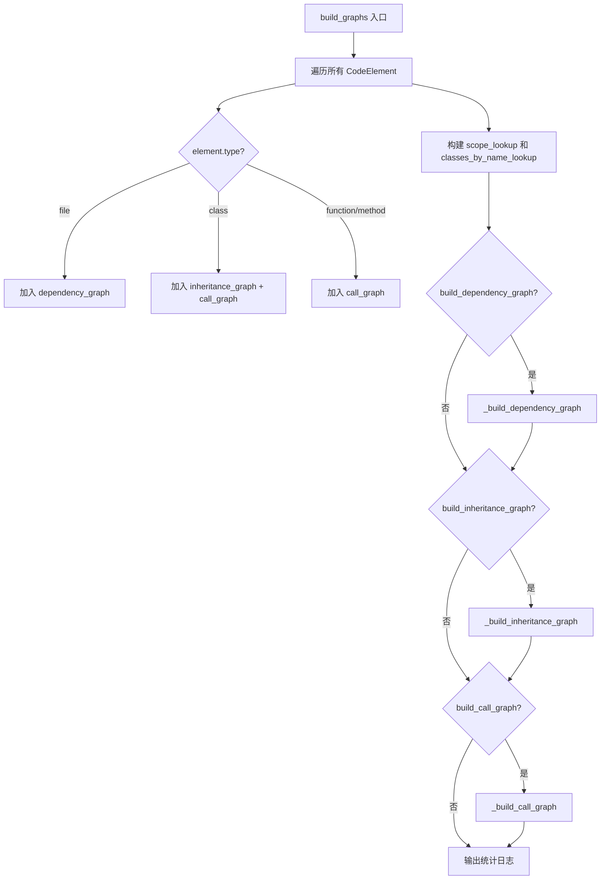
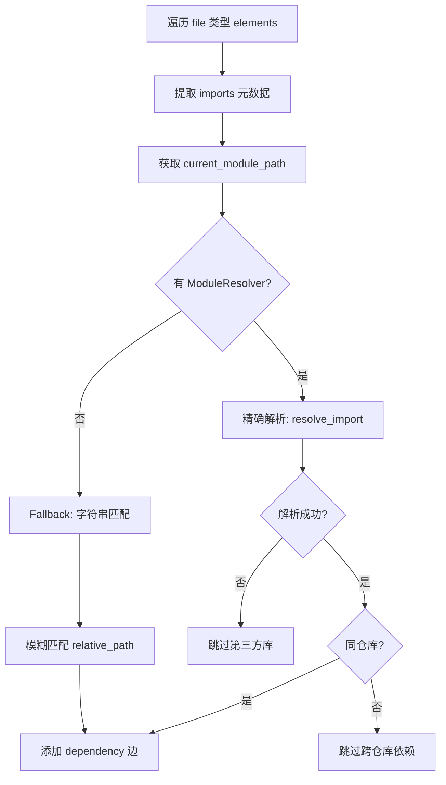
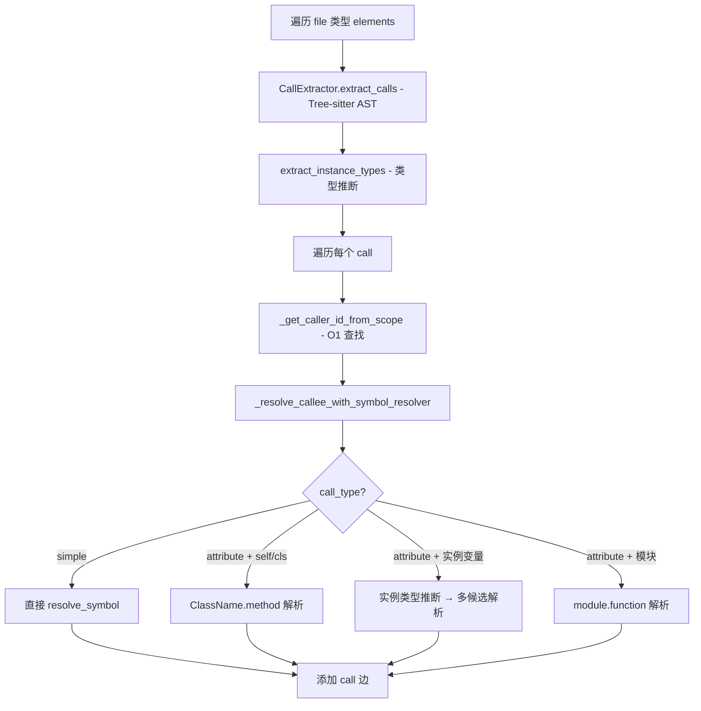

# PD-134.01 FastCode — 三层代码关系图建模（调用图 + 依赖图 + 继承图）

> 文档编号：PD-134.01
> 来源：FastCode `fastcode/graph_builder.py`, `fastcode/module_resolver.py`, `fastcode/symbol_resolver.py`
> GitHub：https://github.com/HKUDS/FastCode.git
> 问题域：PD-134 代码关系图建模 Code Relationship Graph Modeling
> 状态：可复用方案

---

## 第 1 章 问题与动机

### 1.1 核心问题

代码仓库中的文件、类、函数之间存在复杂的关系网络：文件通过 import 互相依赖，类通过继承形成层次结构，函数通过调用形成执行链路。理解这些关系对于代码导航、影响分析、重构评估和 RAG 检索增强至关重要。

传统的文本搜索只能找到"包含某关键词的文件"，无法回答"修改这个函数会影响哪些调用方"、"这个类的所有子类在哪里"等结构性问题。代码关系图将这些隐式关系显式化为可查询的图结构。

核心挑战：
- **跨文件引用解析**：Python 的 import 机制（相对导入、绝对导入、别名）使得符号解析非常复杂
- **实例方法调用推断**：`obj.method()` 需要推断 `obj` 的类型才能确定调用目标
- **多仓库隔离**：同时分析多个仓库时，需要防止跨仓库的错误关联
- **性能与精度平衡**：全量 AST 分析精确但慢，字符串匹配快但误报多

### 1.2 FastCode 的解法概述

FastCode 采用 **三层独立图 + 精确符号解析** 的架构：

1. **三层 NetworkX 有向图**：调用图（Call Graph）、依赖图（Dependency Graph）、继承图（Inheritance Graph）各自独立构建，通过 `get_related_elements()` 按需组合查询（`fastcode/graph_builder.py:34-36`）
2. **GlobalIndexBuilder 全局索引**：构建 file_map / module_map / export_map 三张查找表，将文件路径、模块路径、导出符号统一映射到 element ID（`fastcode/global_index_builder.py:37-39`）
3. **ModuleResolver 精确导入解析**：区分相对导入和绝对导入，处理 `__init__.py` 包文件的特殊语义，过滤第三方库（`fastcode/module_resolver.py:23-40`）
4. **SymbolResolver 两阶段符号解析**：先本地查找（当前文件导出），再跨文件查找（通过 import 链追踪到源定义），支持别名和 `Class.Method` 成员访问（`fastcode/symbol_resolver.py:35-67`）
5. **CallExtractor + Tree-sitter AST 分析**：用 Tree-sitter 精确提取函数调用，带作用域追踪（scope_id），支持实例变量类型推断（`fastcode/call_extractor.py:155-187`）

### 1.3 设计思想

| 设计原则 | 具体实现 | 理由 | 替代方案 |
|----------|----------|------|----------|
| 关注点分离 | 三种图各自独立的 `nx.DiGraph`，独立构建方法 | 不同关系语义不同，混合会导致查询复杂度爆炸 | 单一统一图 + 边类型标签 |
| 精确优先 + 优雅降级 | ModuleResolver/SymbolResolver 精确解析，失败时 fallback 到字符串匹配 | 精确解析覆盖 80%+ 场景，fallback 保证不丢失关系 | 纯正则/字符串匹配 |
| 预计算查找表 | scope_lookup / classes_by_name_lookup 在 build 阶段一次性构建 | 将 O(N) 扫描降为 O(1) 查找，call graph 构建性能提升显著 | 每次查找都遍历 elements 列表 |
| 多仓库安全 | 每条边添加前检查 `repo_name` 一致性 | 防止跨仓库的错误依赖/继承关联 | 不检查，依赖用户只分析单仓库 |
| 配置驱动 | `build_call_graph` / `build_dependency_graph` / `build_inheritance_graph` 开关 | 按需构建，节省不需要的图的计算开销 | 总是构建全部三种图 |

---

## 第 2 章 源码实现分析

### 2.1 架构概览

FastCode 的代码关系图建模由 5 个核心组件协作完成：

```
┌─────────────────────────────────────────────────────────────────┐
│                      CodeGraphBuilder                           │
│  ┌──────────────┐  ┌──────────────┐  ┌──────────────────┐      │
│  │ call_graph    │  │ dependency_  │  │ inheritance_     │      │
│  │ (nx.DiGraph)  │  │ graph        │  │ graph            │      │
│  └──────┬───────┘  └──────┬───────┘  └──────┬───────────┘      │
│         │                  │                  │                  │
│  _build_call_graph  _build_dependency  _build_inheritance       │
│         │           _graph             _graph                   │
│         │                  │                  │                  │
│  ┌──────▼───────┐  ┌──────▼───────┐  ┌──────▼───────────┐      │
│  │CallExtractor  │  │ModuleResolver│  │SymbolResolver    │      │
│  │(Tree-sitter)  │  │(import解析)  │  │(符号→定义ID)     │      │
│  └───────────────┘  └──────┬───────┘  └──────┬───────────┘      │
│                            │                  │                  │
│                     ┌──────▼──────────────────▼───────────┐     │
│                     │       GlobalIndexBuilder             │     │
│                     │  file_map | module_map | export_map  │     │
│                     └─────────────────────────────────────┘     │
└─────────────────────────────────────────────────────────────────┘
```

数据流：`CodeIndexer` 产出 `List[CodeElement]` → `GlobalIndexBuilder.build_maps()` 构建全局索引 → `CodeGraphBuilder.build_graphs()` 消费 elements + resolvers 构建三层图。

### 2.2 核心实现

#### 2.2.1 三层图初始化与选择性节点注入



对应源码 `fastcode/graph_builder.py:47-133`：

```python
def build_graphs(self, elements: List[CodeElement], 
                 module_resolver: Optional[ModuleResolver] = None, 
                 symbol_resolver: Optional[SymbolResolver] = None):
    # --- OPTIMIZATION: Pre-compute Lookup Maps ---
    self.scope_lookup: Dict[tuple, str] = {}
    self.classes_by_name_lookup: Dict[str, List[CodeElement]] = {}
    
    for elem in elements:
        self.element_by_name[elem.name] = elem
        self.element_by_id[elem.id] = elem
        
        # Populate Scope Lookup: (file_path, type, name) -> element_id
        if elem.type in ["function", "class", "method"]:
            key = (elem.file_path, elem.type, elem.name)
            self.scope_lookup[key] = elem.id
        
        # Populate Class Lookup: class_name -> List[CodeElement]
        if elem.type == "class":
            if elem.name not in self.classes_by_name_lookup:
                self.classes_by_name_lookup[elem.name] = []
            self.classes_by_name_lookup[elem.name].append(elem)
        
        # Selective Node Addition — 只加语义匹配的节点
        if self.build_dependency_graph and elem.type == "file":
            self.dependency_graph.add_node(elem.id)
        if self.build_inheritance_graph and elem.type == "class":
            self.inheritance_graph.add_node(elem.id)
        if self.build_call_graph and elem.type in ["function", "method", "class"]:
            self.call_graph.add_node(elem.id)
```

关键设计：**选择性节点注入**（`graph_builder.py:83-102`）确保每种图只包含语义相关的节点类型，避免图膨胀。dependency_graph 只含 file 节点，inheritance_graph 只含 class 节点，call_graph 含 function/method/class 节点。

#### 2.2.2 依赖图构建：ModuleResolver 精确导入解析



对应源码 `fastcode/graph_builder.py:135-235` 和 `fastcode/module_resolver.py:23-84`：

```python
# ModuleResolver 核心：区分相对/绝对导入
def resolve_import(self, current_module_path: str, import_name: str, 
                   level: int, is_package: bool = False) -> Optional[str]:
    if level > 0:
        return self._resolve_relative_import(
            current_module_path, import_name, level, is_package)
    else:
        return self._resolve_absolute_import(import_name)

def _resolve_relative_import(self, current_module_path: str, 
                              import_name: str, level: int, 
                              is_package: bool = False) -> Optional[str]:
    current_parts = current_module_path.split('.')
    # __init__.py 的 from . 语义不同：level=1 表示当前包，不需要上溯
    strip_count = level - 1 if is_package else level
    if strip_count > len(current_parts):
        return None
    parent_parts = current_parts[:-strip_count] if strip_count > 0 else current_parts
    if import_name:
        target_module_path = '.'.join(parent_parts + [import_name])
    else:
        target_module_path = '.'.join(parent_parts) if parent_parts else None
    # 查找 module_map
    if target_module_path and target_module_path in self.index.module_map:
        return self.index.module_map[target_module_path]
    return None
```

关键细节：`is_package` 参数（`module_resolver.py:51-59`）处理了 `__init__.py` 中 `from . import X` 的特殊语义——在包文件中 level=1 表示"当前包"（strip 0 层），而在普通文件中 level=1 表示"父包"（strip 1 层）。

#### 2.2.3 调用图构建：CallExtractor + 实例类型推断



对应源码 `fastcode/graph_builder.py:368-453` 和 `fastcode/call_extractor.py:155-187`：

```python
# CallExtractor 用 Tree-sitter 提取调用，带作用域追踪
def extract_calls(self, code: str, file_path: str) -> List[Dict[str, Any]]:
    tree = self.parser.parse(code)
    # 第一遍：提取所有作用域（函数/类定义）
    scopes = self._extract_scopes(tree)
    # 第二遍：提取所有调用并分配到作用域
    calls = self._extract_calls_with_scopes(tree, scopes, file_path)
    return calls

# 实例方法调用解析：推断 base_object 的类型
def _resolve_instance_method_call(self, base_object, call_name, 
                                   current_file_id, file_imports,
                                   symbol_resolver, file_instance_types, 
                                   scope_id) -> List[str]:
    # 1. 当前作用域查找类型
    local_types = file_instance_types.get(scope_id, {})
    candidate_classes = local_types.get(base_object)
    # 2. __init__ 作用域查找（self.x 通常在 __init__ 中定义）
    if not candidate_classes:
        candidate_classes = file_instance_types.get("function::__init__", {}).get(base_object)
    # 3. 全局作用域查找
    if not candidate_classes:
        candidate_classes = file_instance_types.get("global", {}).get(base_object)
    # 对每个候选类，解析 ClassName.method
    for class_name in candidate_classes:
        full_method_name = f"{class_name}.{call_name}"
        method_id = symbol_resolver.resolve_symbol(full_method_name, ...)
```

关键设计：**三层作用域查找**（`graph_builder.py:913-949`）——先查当前函数作用域，再查 `__init__`（实例变量定义处），最后查全局作用域。这解决了 `self.loader.load()` 这类实例方法调用的类型推断问题。

### 2.3 实现细节

**GlobalIndexBuilder 三张查找表**（`fastcode/global_index_builder.py:37-39`）：

| 查找表 | Key | Value | 用途 |
|--------|-----|-------|------|
| `file_map` | 绝对路径 | file_id | 文件路径 → ID |
| `module_map` | 点分模块路径 (如 `app.services.auth`) | file_id | Python 导入路径 → ID |
| `export_map` | 模块路径 → `{符号名: node_id}` | 嵌套 dict | 符号解析的核心查找表 |

**export_map 的 Class.Method 导出**（`global_index_builder.py:253-258`）：

```python
# 不仅导出类名，还导出 "ClassName.method" 格式
if element.type == 'function':
    class_name = element.metadata.get('class_name')
    if class_name:
        full_name = f"{class_name}.{element.name}"
        self.export_map[module_path][full_name] = element.id
```

这使得 SymbolResolver 可以直接解析 `CodeGraphBuilder.build_graphs` 这样的成员访问表达式。

**SymbolResolver 两阶段解析**（`fastcode/symbol_resolver.py:35-67`）：

1. **Local 阶段**：检查当前文件的 export_map，看符号是否在本文件定义
2. **Imported 阶段**：遍历 import 列表，通过 ModuleResolver 解析目标文件，再在目标文件的 export_map 中查找符号

**变量遮蔽检测**（`graph_builder.py:830-844`）：当 `base_object` 既是一个导入的模块名又是一个局部变量时，优先识别为局部变量，避免将实例方法调用错误解析为模块函数调用。


---

## 第 3 章 迁移指南

### 3.1 迁移清单

**阶段 1：基础设施（GlobalIndexBuilder）**
- [ ] 定义 `CodeElement` 数据结构（id, type, name, file_path, metadata）
- [ ] 实现 `file_path_to_module_path()` 将文件路径转为点分模块路径
- [ ] 实现 `GlobalIndexBuilder`：构建 file_map / module_map / export_map
- [ ] 确保 export_map 同时导出 `ClassName` 和 `ClassName.method` 格式

**阶段 2：解析器（ModuleResolver + SymbolResolver）**
- [ ] 实现 `ModuleResolver`：处理相对导入（level > 0）和绝对导入
- [ ] 处理 `__init__.py` 的 `is_package` 特殊语义
- [ ] 实现 `SymbolResolver`：Local → Imported 两阶段解析
- [ ] 支持别名（alias）和 `Class.Method` 成员访问解析

**阶段 3：图构建（CodeGraphBuilder）**
- [ ] 安装 NetworkX：`pip install networkx`
- [ ] 实现三层 `nx.DiGraph` 初始化和选择性节点注入
- [ ] 实现 `_build_dependency_graph`：基于 ModuleResolver
- [ ] 实现 `_build_inheritance_graph`：基于 SymbolResolver
- [ ] 实现 `_build_call_graph`：基于 CallExtractor + SymbolResolver

**阶段 4：调用提取（CallExtractor，可选）**
- [ ] 安装 Tree-sitter：`pip install tree-sitter tree-sitter-python`
- [ ] 实现 `CallExtractor`：两遍扫描（作用域 → 调用）
- [ ] 实现 `extract_instance_types`：构造函数赋值 + 类型注解推断
- [ ] 实现三层作用域查找（local → __init__ → global）

### 3.2 适配代码模板

以下是一个可直接运行的最小化三层图构建器：

```python
"""
Minimal Three-Layer Code Graph Builder
基于 FastCode 架构的简化版本，可直接复用
"""
import ast
import os
from typing import Dict, List, Optional, Set, Any
import networkx as nx


class SimpleGlobalIndex:
    """简化版全局索引：module_map + export_map"""
    
    def __init__(self):
        self.module_map: Dict[str, str] = {}      # dotted.path -> file_id
        self.export_map: Dict[str, Dict[str, str]] = {}  # module -> {symbol: id}
    
    def build(self, repo_root: str, py_files: List[str]):
        for fpath in py_files:
            rel = os.path.relpath(fpath, repo_root)
            mod_path = rel.replace(os.sep, '.').removesuffix('.py')
            if mod_path.endswith('.__init__'):
                mod_path = mod_path[:-9]
            file_id = f"file_{mod_path}"
            self.module_map[mod_path] = file_id
            
            # 解析导出符号
            try:
                tree = ast.parse(open(fpath).read())
            except SyntaxError:
                continue
            self.export_map[mod_path] = {}
            for node in ast.walk(tree):
                if isinstance(node, (ast.FunctionDef, ast.AsyncFunctionDef)):
                    sym_id = f"func_{mod_path}.{node.name}"
                    self.export_map[mod_path][node.name] = sym_id
                elif isinstance(node, ast.ClassDef):
                    sym_id = f"class_{mod_path}.{node.name}"
                    self.export_map[mod_path][node.name] = sym_id
                    # 导出 ClassName.method 格式
                    for item in node.body:
                        if isinstance(item, (ast.FunctionDef, ast.AsyncFunctionDef)):
                            method_id = f"func_{mod_path}.{node.name}.{item.name}"
                            self.export_map[mod_path][f"{node.name}.{item.name}"] = method_id
    
    def resolve_module(self, module_path: str) -> Optional[str]:
        return self.module_map.get(module_path)
    
    def get_symbol(self, module_path: str, symbol: str) -> Optional[str]:
        return self.export_map.get(module_path, {}).get(symbol)


class ThreeLayerGraphBuilder:
    """三层代码关系图构建器"""
    
    def __init__(self):
        self.dependency_graph = nx.DiGraph()
        self.inheritance_graph = nx.DiGraph()
        self.call_graph = nx.DiGraph()
    
    def build(self, repo_root: str, py_files: List[str], index: SimpleGlobalIndex):
        for fpath in py_files:
            rel = os.path.relpath(fpath, repo_root)
            mod_path = rel.replace(os.sep, '.').removesuffix('.py')
            if mod_path.endswith('.__init__'):
                mod_path = mod_path[:-9]
            file_id = index.resolve_module(mod_path) or f"file_{mod_path}"
            
            try:
                tree = ast.parse(open(fpath).read())
            except SyntaxError:
                continue
            
            # 依赖图：基于 import 语句
            self.dependency_graph.add_node(file_id)
            for node in ast.walk(tree):
                if isinstance(node, ast.ImportFrom) and node.module:
                    target_id = index.resolve_module(node.module)
                    if target_id and target_id != file_id:
                        self.dependency_graph.add_edge(
                            file_id, target_id, type="imports", module=node.module)
                
                # 继承图：基于 class 定义的 bases
                if isinstance(node, ast.ClassDef):
                    cls_id = index.get_symbol(mod_path, node.name) or f"class_{node.name}"
                    self.inheritance_graph.add_node(cls_id)
                    for base in node.bases:
                        if isinstance(base, ast.Name):
                            parent_id = index.get_symbol(mod_path, base.id)
                            if parent_id:
                                self.inheritance_graph.add_edge(
                                    cls_id, parent_id, type="inherits")
                
                # 调用图：基于函数调用
                if isinstance(node, ast.Call):
                    if isinstance(node.func, ast.Name):
                        callee_id = index.get_symbol(mod_path, node.func.id)
                        if callee_id:
                            self.call_graph.add_edge(file_id, callee_id, type="calls")
    
    def get_stats(self) -> Dict[str, Any]:
        return {
            name: {"nodes": g.number_of_nodes(), "edges": g.number_of_edges()}
            for name, g in [
                ("dependency", self.dependency_graph),
                ("inheritance", self.inheritance_graph),
                ("call", self.call_graph),
            ]
        }


# 使用示例
if __name__ == "__main__":
    import glob
    repo = "/path/to/your/repo"
    files = glob.glob(os.path.join(repo, "**/*.py"), recursive=True)
    
    index = SimpleGlobalIndex()
    index.build(repo, files)
    
    builder = ThreeLayerGraphBuilder()
    builder.build(repo, files, index)
    
    print(builder.get_stats())
    # 查询：谁依赖了 auth 模块？
    auth_id = index.resolve_module("app.services.auth")
    if auth_id:
        dependents = list(builder.dependency_graph.predecessors(auth_id))
        print(f"Dependents of auth: {dependents}")
```

### 3.3 适用场景

| 场景 | 适用度 | 说明 |
|------|--------|------|
| 代码 RAG 检索增强 | ⭐⭐⭐ | 查询时沿图扩展相关上下文，提升 LLM 回答质量 |
| 影响分析（Impact Analysis） | ⭐⭐⭐ | 修改一个函数前，查询所有调用方和依赖方 |
| 重构评估 | ⭐⭐⭐ | 移动/重命名类时，通过继承图和调用图评估影响范围 |
| 代码可视化 | ⭐⭐ | 将 NetworkX 图导出为 DOT/JSON 供前端渲染 |
| 死代码检测 | ⭐⭐ | 调用图中入度为 0 的函数可能是死代码 |
| 循环依赖检测 | ⭐⭐⭐ | `nx.is_directed_acyclic_graph()` 一行检测 |

---

## 第 4 章 测试用例

```python
"""
Tests for Three-Layer Code Graph Builder
基于 FastCode 真实函数签名编写
"""
import pytest
from unittest.mock import MagicMock, patch
from typing import Dict, List, Optional, Any


# --- Mock Classes (模拟 FastCode 核心数据结构) ---

class MockCodeElement:
    def __init__(self, id: str, type: str, name: str, file_path: str,
                 metadata: Dict = None, repo_name: str = "test_repo"):
        self.id = id
        self.type = type
        self.name = name
        self.file_path = file_path
        self.relative_path = file_path
        self.metadata = metadata or {}
        self.repo_name = repo_name


class MockGlobalIndex:
    def __init__(self):
        self.module_map = {}
        self.export_map = {}
    
    def get_exported_symbol_id(self, module_path: str, symbol_name: str) -> Optional[str]:
        return self.export_map.get(module_path, {}).get(symbol_name)


# --- Test ModuleResolver ---

class TestModuleResolver:
    """测试模块解析器"""
    
    def test_absolute_import_found(self):
        """绝对导入：模块存在于 module_map"""
        index = MockGlobalIndex()
        index.module_map = {"app.utils": "file_utils"}
        
        from fastcode.module_resolver import ModuleResolver
        resolver = ModuleResolver(index)
        result = resolver.resolve_import("app.main", "app.utils", level=0)
        assert result == "file_utils"
    
    def test_absolute_import_third_party(self):
        """绝对导入：第三方库返回 None"""
        index = MockGlobalIndex()
        index.module_map = {}
        
        from fastcode.module_resolver import ModuleResolver
        resolver = ModuleResolver(index)
        result = resolver.resolve_import("app.main", "numpy", level=0)
        assert result is None
    
    def test_relative_import_regular_file(self):
        """相对导入：普通文件 from . import utils"""
        index = MockGlobalIndex()
        index.module_map = {"app.utils": "file_utils"}
        
        from fastcode.module_resolver import ModuleResolver
        resolver = ModuleResolver(index)
        result = resolver.resolve_import("app.main", "utils", level=1, is_package=False)
        assert result == "file_utils"
    
    def test_relative_import_package_init(self):
        """相对导入：__init__.py 中 from . import sub"""
        index = MockGlobalIndex()
        index.module_map = {"app.sub": "file_sub"}
        
        from fastcode.module_resolver import ModuleResolver
        resolver = ModuleResolver(index)
        # __init__.py 中 level=1 不上溯
        result = resolver.resolve_import("app", "sub", level=1, is_package=True)
        assert result == "file_sub"
    
    def test_relative_import_out_of_bounds(self):
        """相对导入：level 超出模块层级"""
        index = MockGlobalIndex()
        
        from fastcode.module_resolver import ModuleResolver
        resolver = ModuleResolver(index)
        result = resolver.resolve_import("app", "utils", level=3, is_package=False)
        assert result is None


# --- Test SymbolResolver ---

class TestSymbolResolver:
    """测试符号解析器"""
    
    def test_local_resolution(self):
        """本地解析：符号在当前文件定义"""
        index = MockGlobalIndex()
        index.module_map = {"app.models": "file_models"}
        index.export_map = {"app.models": {"User": "class_User"}}
        
        from fastcode.module_resolver import ModuleResolver
        from fastcode.symbol_resolver import SymbolResolver
        
        mod_resolver = ModuleResolver(index)
        sym_resolver = SymbolResolver(index, mod_resolver)
        
        result = sym_resolver.resolve_symbol("User", "file_models", imports=[])
        assert result == "class_User"
    
    def test_imported_resolution(self):
        """跨文件解析：通过 import 链追踪"""
        index = MockGlobalIndex()
        index.module_map = {
            "app.main": "file_main",
            "app.utils": "file_utils"
        }
        index.export_map = {
            "app.main": {},
            "app.utils": {"helper": "func_helper"}
        }
        
        from fastcode.module_resolver import ModuleResolver
        from fastcode.symbol_resolver import SymbolResolver
        
        mod_resolver = ModuleResolver(index)
        sym_resolver = SymbolResolver(index, mod_resolver)
        
        imports = [{"module": "app.utils", "names": ["helper"], "level": 0}]
        result = sym_resolver.resolve_symbol("helper", "file_main", imports=imports)
        assert result == "func_helper"
    
    def test_unresolvable_symbol(self):
        """无法解析的符号返回 None"""
        index = MockGlobalIndex()
        index.module_map = {"app.main": "file_main"}
        index.export_map = {"app.main": {}}
        
        from fastcode.module_resolver import ModuleResolver
        from fastcode.symbol_resolver import SymbolResolver
        
        mod_resolver = ModuleResolver(index)
        sym_resolver = SymbolResolver(index, mod_resolver)
        
        result = sym_resolver.resolve_symbol("nonexistent", "file_main", imports=[])
        assert result is None


# --- Test CodeGraphBuilder ---

class TestCodeGraphBuilder:
    """测试图构建器核心功能"""
    
    def test_selective_node_injection(self):
        """选择性节点注入：file→dependency, class→inheritance, func→call"""
        import networkx as nx
        
        elements = [
            MockCodeElement("f1", "file", "main.py", "/repo/main.py", 
                          metadata={"imports": []}),
            MockCodeElement("c1", "class", "MyClass", "/repo/main.py",
                          metadata={"bases": []}),
            MockCodeElement("fn1", "function", "my_func", "/repo/main.py",
                          metadata={}),
        ]
        
        # 模拟 CodeGraphBuilder 的节点注入逻辑
        dep_graph = nx.DiGraph()
        inh_graph = nx.DiGraph()
        call_graph = nx.DiGraph()
        
        for elem in elements:
            if elem.type == "file":
                dep_graph.add_node(elem.id)
            if elem.type == "class":
                inh_graph.add_node(elem.id)
            if elem.type in ["function", "method", "class"]:
                call_graph.add_node(elem.id)
        
        assert "f1" in dep_graph and "c1" not in dep_graph
        assert "c1" in inh_graph and "f1" not in inh_graph
        assert "fn1" in call_graph and "c1" in call_graph and "f1" not in call_graph
    
    def test_cross_repo_dependency_blocked(self):
        """跨仓库依赖应被阻止"""
        elem_a = MockCodeElement("f_a", "file", "a.py", "/repo_a/a.py", repo_name="repo_a")
        elem_b = MockCodeElement("f_b", "file", "b.py", "/repo_b/b.py", repo_name="repo_b")
        
        # 模拟跨仓库检查
        should_add = elem_a.repo_name == elem_b.repo_name
        assert should_add is False
    
    def test_get_related_elements_multi_hop(self):
        """多跳关系查询"""
        import networkx as nx
        
        g = nx.DiGraph()
        g.add_edges_from([("A", "B"), ("B", "C"), ("C", "D")])
        
        # 2 跳内的相关节点
        related = set()
        for node in nx.single_source_shortest_path_length(g, "B", cutoff=2).keys():
            related.add(node)
        for node in nx.single_source_shortest_path_length(g.reverse(), "B", cutoff=2).keys():
            related.add(node)
        
        assert related == {"A", "B", "C", "D"}
```


---

## 第 5 章 跨域关联

| 关联域 | 关系类型 | 说明 |
|--------|----------|------|
| PD-08 搜索与检索 | 协同 | 代码关系图为 RAG 检索提供结构化上下文扩展：查询命中一个函数后，沿调用图/依赖图扩展相关代码片段，提升 LLM 回答的完整性 |
| PD-132 AST 代码解析 | 依赖 | CallExtractor 依赖 Tree-sitter AST 解析提取函数调用和作用域信息，GlobalIndexBuilder 依赖 AST 解析提取 import/class/function 定义 |
| PD-01 上下文管理 | 协同 | `get_related_elements(max_hops)` 控制图遍历深度，直接影响注入 LLM 的上下文量；max_depth 参数是上下文窗口管理的关键旋钮 |
| PD-04 工具系统 | 协同 | 图查询 API（get_callers/get_callees/find_path）可封装为 Agent 工具，让 LLM 自主探索代码结构 |
| PD-140 多仓库管理 | 依赖 | 多仓库场景下 `repo_name` 隔离机制防止跨仓库错误关联；`merge_from_file()` 支持多仓库图合并 |
| PD-11 可观测性 | 协同 | `get_graph_stats()` 输出节点数/边数/平均度/是否 DAG 等指标，可接入可观测性系统监控图质量 |

---

## 第 6 章 来源文件索引

| 文件 | 行范围 | 关键实现 |
|------|--------|----------|
| `fastcode/graph_builder.py` | L20-L46 | CodeGraphBuilder 类定义、三层图初始化、配置驱动开关 |
| `fastcode/graph_builder.py` | L47-L133 | `build_graphs()` 主入口：预计算查找表 + 选择性节点注入 |
| `fastcode/graph_builder.py` | L135-L235 | `_build_dependency_graph()`：ModuleResolver 精确解析 + fallback |
| `fastcode/graph_builder.py` | L237-L367 | `_build_inheritance_graph()`：SymbolResolver + 多仓库安全 fallback |
| `fastcode/graph_builder.py` | L368-L453 | `_build_call_graph()`：CallExtractor + 实例类型推断 |
| `fastcode/graph_builder.py` | L455-L483 | `get_related_elements()`：多图联合多跳查询 |
| `fastcode/graph_builder.py` | L799-L1014 | 实例方法调用解析：变量遮蔽检测 + 三层作用域查找 |
| `fastcode/module_resolver.py` | L5-L100 | ModuleResolver：相对/绝对导入解析、is_package 语义 |
| `fastcode/symbol_resolver.py` | L14-L217 | SymbolResolver：Local→Imported 两阶段解析、别名/成员访问 |
| `fastcode/call_extractor.py` | L14-L718 | CallExtractor：Tree-sitter 调用提取、作用域追踪、实例类型推断 |
| `fastcode/global_index_builder.py` | L16-L325 | GlobalIndexBuilder：file_map/module_map/export_map 构建 |
| `fastcode/indexer.py` | L19-L38 | CodeElement 数据结构定义 |
| `fastcode/path_utils.py` | L11-L107 | `file_path_to_module_path()`：文件路径→模块路径转换 |

---

## 第 7 章 横向对比维度

```json comparison_data
{
  "project": "FastCode",
  "dimensions": {
    "图存储引擎": "NetworkX DiGraph，pickle 序列化持久化",
    "图层数": "三层独立图：调用图 + 依赖图 + 继承图",
    "符号解析精度": "AST 精确解析 + fallback 字符串匹配双模式",
    "类型推断": "Tree-sitter 提取构造函数赋值和类型注解，三层作用域查找",
    "多仓库支持": "repo_name 隔离 + merge_from_file 图合并",
    "查询能力": "多图联合多跳遍历 + 最短路径 + DAG 检测"
  }
}
```

### 域元数据补充

```json domain_metadata
{
  "solution_summary": "FastCode 用 NetworkX 构建三层独立 DiGraph（调用/依赖/继承），配合 GlobalIndexBuilder 三张查找表 + ModuleResolver/SymbolResolver 精确解析跨文件引用，CallExtractor 基于 Tree-sitter 做实例类型推断",
  "description": "代码关系图需要精确的符号解析和类型推断才能构建高质量的边",
  "sub_problems": [
    "实例变量类型推断与作用域查找",
    "多仓库图隔离与合并",
    "变量遮蔽检测（局部变量 vs 模块名）"
  ],
  "best_practices": [
    "预计算 scope_lookup 和 classes_by_name_lookup 将 O(N) 降为 O(1)",
    "export_map 同时导出 ClassName 和 ClassName.method 格式支持成员访问解析",
    "精确解析优先 + fallback 字符串匹配保证召回率"
  ]
}
```

