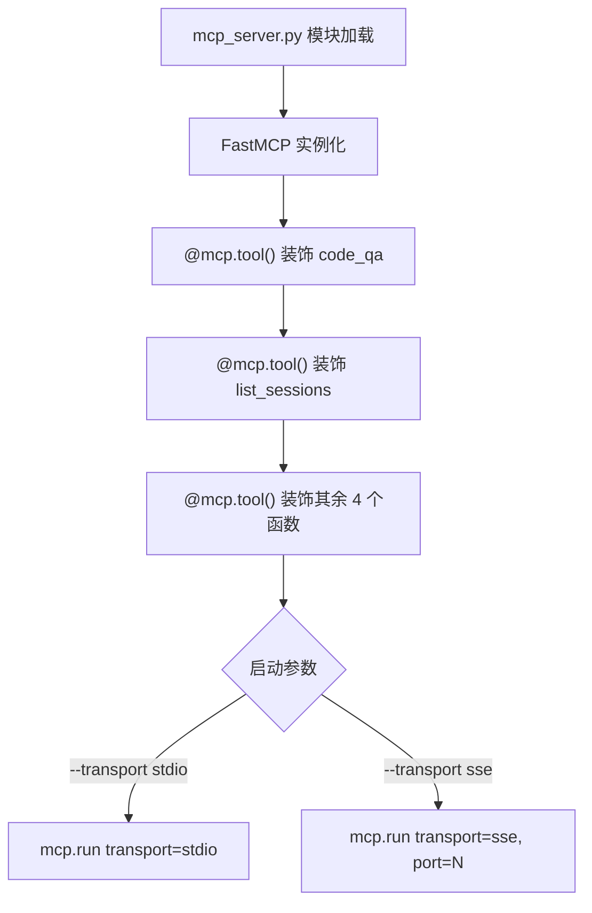
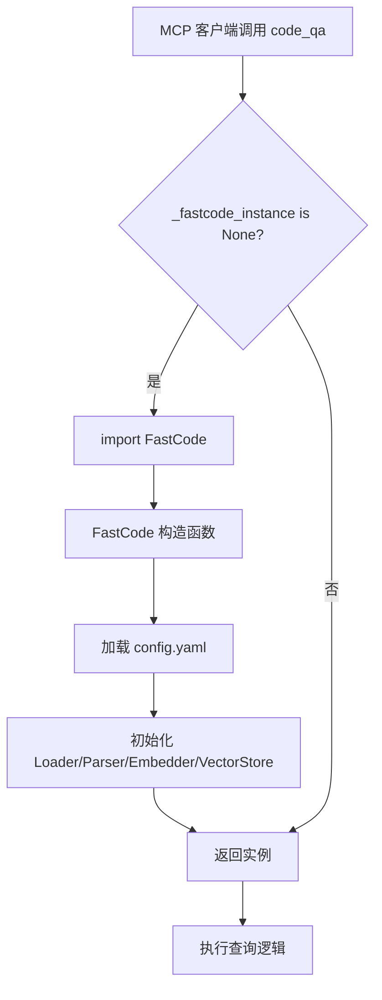
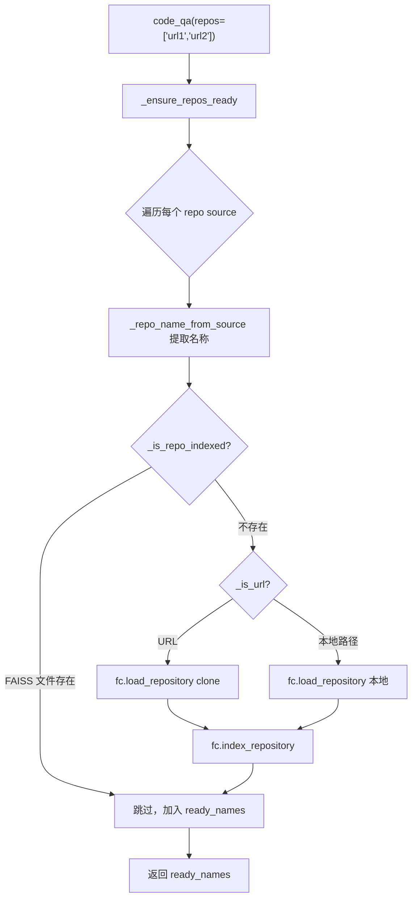

# PD-135.01 FastCode — 基于 FastMCP 的 MCP 协议服务器（stdio/SSE 双传输）

> 文档编号：PD-135.01
> 来源：FastCode `mcp_server.py` `nanobot/nanobot/agent/tools/fastcode.py`
> GitHub：https://github.com/HKUDS/FastCode.git
> 问题域：PD-135 MCP协议集成 MCP Protocol Integration
> 状态：可复用方案

---

## 第 1 章 问题与动机

### 1.1 核心问题

代码理解引擎（如 FastCode 的 FAISS 向量检索 + BM25 混合检索 + LLM 问答）通常以 REST API 形式暴露能力。但 AI 编码助手（Cursor、Claude Code、Windsurf）原生支持的是 **MCP（Model Context Protocol）** 协议——一种标准化的工具调用协议。如果不提供 MCP 接口，用户就必须手动复制粘贴 API 返回结果，无法让 AI 助手直接调用代码分析能力。

核心矛盾：**已有的 REST API 能力如何零成本暴露为 MCP 工具，让任意 MCP 客户端直接调用？**

### 1.2 FastCode 的解法概述

FastCode 采用 **双层暴露** 策略，同一套代码分析引擎通过两条路径对外提供服务：

1. **MCP 协议层**（`mcp_server.py:195`）：基于 `FastMCP` 库，用 `@mcp.tool()` 装饰器将 6 个核心函数注册为 MCP 工具，支持 stdio 和 SSE 双传输模式
2. **HTTP 代理层**（`nanobot/nanobot/agent/tools/fastcode.py:466-484`）：nanobot Agent 通过 HTTP 调用 FastCode REST API，将 5 个 Tool 类注册到 Agent 的 ToolRegistry，间接实现 MCP 能力的 Agent 消费
3. **懒加载引擎**（`mcp_server.py:59-67`）：FastCode 引擎在首次工具调用时才初始化，避免 MCP 服务器启动时的重量级依赖加载
4. **自动克隆与索引**（`mcp_server.py:135-179`）：`_ensure_repos_ready()` 自动检测仓库是否已索引，未索引则自动 clone + index，对 MCP 客户端完全透明
5. **多仓库合并查询**（`mcp_server.py:234-238`）：`code_qa` 工具支持同时查询多个仓库，通过 `repo_filter` 防止跨仓库源泄漏

### 1.3 设计思想

| 设计原则 | 具体实现 | 理由 | 替代方案 |
|----------|----------|------|----------|
| 装饰器注册 | `@mcp.tool()` 直接装饰普通函数 | 零样板代码，函数签名即工具 schema | 手动构建 JSON Schema + handler 映射 |
| 懒加载单例 | `_fastcode_instance` 全局变量 + `_get_fastcode()` | MCP 服务器秒启动，引擎按需加载 | 启动时预加载（慢 10-30s） |
| 双传输模式 | argparse 切换 stdio/SSE | stdio 适配 Cursor/Claude Code，SSE 适配远程部署 | 只支持 stdio（限制部署场景） |
| 日志隔离 | FileHandler only，不写 stdout | stdio 模式下 stdout 是 JSON-RPC 通道，日志会破坏协议 | StreamHandler（会污染 MCP 通信） |
| 自动索引 | `_ensure_repos_ready()` 检查 FAISS 文件存在性 | 用户无需手动预处理，首次查询自动完成 | 要求用户先调用 load 再 query |

---

## 第 2 章 源码实现分析

### 2.1 架构概览

FastCode 的 MCP 集成分为两条独立路径，共享同一个 FastCode 引擎核心：

```
┌─────────────────────────────────────────────────────────┐
│                    MCP 客户端                            │
│  (Cursor / Claude Code / Windsurf / Cherry Studio)      │
└──────────────┬──────────────────────────────────────────┘
               │ stdio / SSE (MCP JSON-RPC)
               ▼
┌──────────────────────────────┐
│     mcp_server.py            │
│  FastMCP("FastCode")         │
│  ┌────────────────────────┐  │
│  │ @mcp.tool() × 6        │  │
│  │ code_qa                 │  │
│  │ list_sessions           │  │
│  │ get_session_history     │  │
│  │ delete_session          │  │
│  │ list_indexed_repos      │  │
│  │ delete_repo_metadata    │  │
│  └────────┬───────────────┘  │
│           │ _get_fastcode()  │
│           ▼                  │
│  ┌────────────────────────┐  │
│  │ FastCode Engine (lazy) │  │
│  │ FAISS + BM25 + LLM    │  │
│  └────────────────────────┘  │
└──────────────────────────────┘

┌─────────────────────────────────────────────────────────┐
│                 飞书 / Telegram / Discord                 │
└──────────────┬──────────────────────────────────────────┘
               │ 消息
               ▼
┌──────────────────────────────┐
│     nanobot AgentLoop        │
│  ToolRegistry                │
│  ┌────────────────────────┐  │
│  │ FastCode Tool × 5      │  │
│  │ fastcode_load_repo     │  │
│  │ fastcode_query         │  │
│  │ fastcode_list_repos    │  │
│  │ fastcode_status        │  │
│  │ fastcode_session       │  │
│  └────────┬───────────────┘  │
│           │ HTTP (httpx)     │
│           ▼                  │
│  ┌────────────────────────┐  │
│  │ FastCode REST API      │  │
│  │ FastAPI (api.py)       │  │
│  └────────────────────────┘  │
└──────────────────────────────┘
```

### 2.2 核心实现

#### 2.2.1 MCP 工具注册（装饰器模式）



对应源码 `mcp_server.py:186-198`：

```python
# 向后兼容：旧版 mcp 库不接受 description 参数
MCP_SERVER_DESCRIPTION = "Repo-level code understanding - ask questions about any codebase."
_fastmcp_kwargs = {}
try:
    if "description" in inspect.signature(FastMCP.__init__).parameters:
        _fastmcp_kwargs["description"] = MCP_SERVER_DESCRIPTION
except (TypeError, ValueError):
    pass

mcp = FastMCP("FastCode", **_fastmcp_kwargs)

@mcp.tool()
def code_qa(
    question: str,
    repos: list[str],
    multi_turn: bool = True,
    session_id: str | None = None,
) -> str:
    """Ask a question about one or more code repositories."""
    ...
```

关键设计点：
- **签名即 Schema**：FastMCP 自动从函数签名（类型注解 + docstring）生成 MCP 工具的 JSON Schema，无需手动维护
- **向后兼容**：通过 `inspect.signature` 检测 FastMCP 构造函数是否支持 `description` 参数（`mcp_server.py:187-193`），避免旧版本报错

#### 2.2.2 懒加载引擎初始化



对应源码 `mcp_server.py:56-67`：

```python
_fastcode_instance = None

def _get_fastcode():
    """Lazy-init the FastCode engine (heavy imports happen here)."""
    global _fastcode_instance
    if _fastcode_instance is None:
        logger.info("Initializing FastCode engine …")
        from fastcode import FastCode
        _fastcode_instance = FastCode()
        logger.info("FastCode engine ready.")
    return _fastcode_instance
```

关键设计点：
- **延迟 import**：`from fastcode import FastCode` 放在函数体内，避免 MCP 服务器启动时加载 numpy/faiss/torch 等重量级依赖
- **全局单例**：所有 MCP 工具共享同一个 FastCode 实例，避免重复初始化

#### 2.2.3 自动克隆与索引



对应源码 `mcp_server.py:84-90` 和 `mcp_server.py:135-179`：

```python
def _is_repo_indexed(repo_name: str) -> bool:
    """Check whether a repo already has a persisted FAISS index."""
    fc = _get_fastcode()
    persist_dir = fc.vector_store.persist_dir
    faiss_path = os.path.join(persist_dir, f"{repo_name}.faiss")
    meta_path = os.path.join(persist_dir, f"{repo_name}_metadata.pkl")
    return os.path.exists(faiss_path) and os.path.exists(meta_path)

def _ensure_repos_ready(repos: List[str], ctx=None) -> List[str]:
    fc = _get_fastcode()
    _apply_forced_env_excludes(fc)
    ready_names: List[str] = []
    for source in repos:
        name = _repo_name_from_source(source)
        if _is_repo_indexed(name):
            logger.info(f"Repo '{name}' already indexed, skipping.")
            ready_names.append(name)
            continue
        is_url = _is_url(source)
        if is_url:
            fc.load_repository(source, is_url=True)
        else:
            abs_path = os.path.abspath(source)
            if not os.path.isdir(abs_path):
                continue
            fc.load_repository(abs_path, is_url=False)
        fc.index_repository(force=False)
        ready_names.append(name)
    return ready_names
```

### 2.3 实现细节

#### 日志隔离策略

stdio 模式下 stdout 是 MCP JSON-RPC 的唯一通道。FastCode 将所有日志重定向到文件（`mcp_server.py:43-51`）：

```python
log_dir = os.path.join(PROJECT_ROOT, "logs")
os.makedirs(log_dir, exist_ok=True)
logging.basicConfig(
    level=logging.INFO,
    format="%(asctime)s - %(name)s - %(levelname)s - %(message)s",
    handlers=[logging.FileHandler(os.path.join(log_dir, "mcp_server.log"))],
)
```

#### nanobot 侧的 HTTP 代理工具注册

nanobot 通过环境变量 `FASTCODE_API_URL` 条件加载 FastCode 工具（`nanobot/nanobot/agent/loop.py:111-117`）：

```python
# FastCode tools (conditionally loaded when FASTCODE_API_URL is set)
fastcode_url = os.environ.get("FASTCODE_API_URL")
if fastcode_url:
    from nanobot.agent.tools.fastcode import create_all_tools
    for tool in create_all_tools(api_url=fastcode_url):
        self.tools.register(tool)
    logger.info(f"FastCode tools registered (API: {fastcode_url})")
```

每个 Tool 类继承 `Tool(ABC)`，实现 `name`/`description`/`parameters`/`execute` 四个抽象属性/方法，通过 `to_schema()` 自动转换为 OpenAI function calling 格式（`nanobot/nanobot/agent/tools/base.py:93-102`）。

#### Docker Compose 双服务编排

`docker-compose.yml` 定义了 fastcode + nanobot 双容器，通过内部网络 `http://fastcode:8001` 通信：

```yaml
services:
  fastcode:
    ports: ["8001:8001"]
    volumes:
      - ./data:/app/data    # 持久化索引
      - ./repos:/app/repos  # 克隆的仓库
  nanobot:
    environment:
      - FASTCODE_API_URL=http://fastcode:8001
    depends_on:
      - fastcode
```

---

## 第 3 章 迁移指南

### 3.1 迁移清单

**阶段 1：最小 MCP 服务器（1 个工具）**

- [ ] 安装依赖：`pip install mcp` （FastMCP 包含在 mcp 库中）
- [ ] 创建 `mcp_server.py`，实例化 `FastMCP("YourProject")`
- [ ] 用 `@mcp.tool()` 装饰一个核心函数（如 query）
- [ ] 配置日志只写文件（不写 stdout）
- [ ] 添加 `if __name__ == "__main__": mcp.run(transport="stdio")` 入口
- [ ] 在 Cursor/Claude Code 的 MCP 配置中添加服务器

**阶段 2：懒加载 + 多工具**

- [ ] 将重量级引擎初始化包装为懒加载单例
- [ ] 添加更多 `@mcp.tool()` 函数（CRUD 操作、状态查询等）
- [ ] 添加 SSE 传输模式支持（argparse 切换）

**阶段 3：Agent 侧 HTTP 代理工具**

- [ ] 定义 Tool 基类（ABC，含 name/description/parameters/execute）
- [ ] 为每个 REST API 端点创建对应的 Tool 子类
- [ ] 实现 `create_all_tools()` 工厂函数
- [ ] 在 Agent 启动时通过环境变量条件注册

### 3.2 适配代码模板

#### 模板 1：最小 MCP 服务器

```python
"""
最小 MCP 服务器模板 — 基于 FastCode 的 FastMCP 模式。
用法：
    python my_mcp_server.py                    # stdio
    python my_mcp_server.py --transport sse    # SSE on :8080
"""
import os
import sys
import logging
import argparse
import inspect
from typing import Optional

# 日志只写文件，不写 stdout（stdio 模式下 stdout 是 JSON-RPC 通道）
PROJECT_ROOT = os.path.dirname(os.path.abspath(__file__))
os.makedirs(os.path.join(PROJECT_ROOT, "logs"), exist_ok=True)
logging.basicConfig(
    level=logging.INFO,
    handlers=[logging.FileHandler(os.path.join(PROJECT_ROOT, "logs", "mcp.log"))],
)
logger = logging.getLogger(__name__)

from mcp.server.fastmcp import FastMCP

# --- 懒加载引擎 ---
_engine = None

def _get_engine():
    global _engine
    if _engine is None:
        logger.info("Initializing engine...")
        from my_project import Engine  # 重量级 import 延迟到此处
        _engine = Engine()
        logger.info("Engine ready.")
    return _engine

# --- MCP 服务器 ---
_kwargs = {}
try:
    if "description" in inspect.signature(FastMCP.__init__).parameters:
        _kwargs["description"] = "My project description"
except (TypeError, ValueError):
    pass

mcp = FastMCP("MyProject", **_kwargs)

@mcp.tool()
def query(question: str, source: str) -> str:
    """Ask a question about a data source.

    Args:
        question: Natural language question.
        source: Path or URL to the data source.
    """
    engine = _get_engine()
    result = engine.query(question, source)
    return result.get("answer", "No answer.")

@mcp.tool()
def list_sources() -> str:
    """List all available data sources."""
    engine = _get_engine()
    sources = engine.list_sources()
    return "\n".join(f"  - {s['name']}" for s in sources) or "No sources."

if __name__ == "__main__":
    parser = argparse.ArgumentParser()
    parser.add_argument("--transport", choices=["stdio", "sse"], default="stdio")
    parser.add_argument("--port", type=int, default=8080)
    args = parser.parse_args()

    if args.transport == "sse":
        mcp.run(transport="sse", sse_params={"port": args.port})
    else:
        mcp.run(transport="stdio")
```

#### 模板 2：Agent 侧 HTTP 代理工具

```python
"""Agent 侧 HTTP 代理工具模板 — 基于 FastCode 的 nanobot 模式。"""
import os
from abc import ABC, abstractmethod
from typing import Any
import httpx

class Tool(ABC):
    @property
    @abstractmethod
    def name(self) -> str: ...
    @property
    @abstractmethod
    def description(self) -> str: ...
    @property
    @abstractmethod
    def parameters(self) -> dict[str, Any]: ...
    @abstractmethod
    async def execute(self, **kwargs: Any) -> str: ...

    def to_schema(self) -> dict[str, Any]:
        return {
            "type": "function",
            "function": {
                "name": self.name,
                "description": self.description,
                "parameters": self.parameters,
            },
        }

class QueryTool(Tool):
    def __init__(self, api_url: str):
        self._api_url = api_url

    @property
    def name(self) -> str:
        return "my_query"

    @property
    def description(self) -> str:
        return "Query the backend engine via REST API."

    @property
    def parameters(self) -> dict[str, Any]:
        return {
            "type": "object",
            "properties": {
                "question": {"type": "string", "description": "The question"},
            },
            "required": ["question"],
        }

    async def execute(self, question: str, **kwargs: Any) -> str:
        async with httpx.AsyncClient(timeout=600.0) as client:
            resp = await client.post(
                f"{self._api_url}/query",
                json={"question": question},
            )
            resp.raise_for_status()
            return resp.json().get("answer", "No answer.")

def create_all_tools(api_url: str | None = None) -> list[Tool]:
    url = api_url or os.environ.get("BACKEND_API_URL", "http://localhost:8000")
    return [QueryTool(api_url=url)]
```

### 3.3 适用场景

| 场景 | 适用度 | 说明 |
|------|--------|------|
| 已有 REST API，需暴露为 MCP 工具 | ⭐⭐⭐ | FastMCP 装饰器模式最适合此场景 |
| 需要同时支持 IDE 集成和远程部署 | ⭐⭐⭐ | stdio + SSE 双传输覆盖两种场景 |
| Agent 需要通过 HTTP 调用后端能力 | ⭐⭐⭐ | Tool 基类 + 工厂函数模式可直接复用 |
| 引擎初始化耗时长（>5s） | ⭐⭐⭐ | 懒加载单例模式避免启动延迟 |
| 需要多仓库/多数据源并行查询 | ⭐⭐ | 需要额外实现索引检查和自动准备逻辑 |
| 纯前端项目，无后端引擎 | ⭐ | 不适用，MCP 服务器需要后端能力 |

---

## 第 4 章 测试用例

```python
"""
测试 FastCode MCP 集成的核心逻辑。
基于 mcp_server.py 和 fastcode.py 的真实函数签名。
"""
import os
import pytest
from unittest.mock import patch, MagicMock, AsyncMock


# ============================================================
# 测试 MCP 服务器侧逻辑
# ============================================================

class TestMCPServerLazyInit:
    """测试懒加载引擎初始化"""

    def test_instance_none_on_import(self):
        """引擎在模块加载时不初始化"""
        # 模拟 mcp_server 模块的全局状态
        instance = None
        assert instance is None

    @patch("fastcode.FastCode")
    def test_get_fastcode_creates_singleton(self, mock_fc_class):
        """首次调用创建实例，后续调用复用"""
        mock_fc_class.return_value = MagicMock()

        global _fastcode_instance
        _fastcode_instance = None

        def _get_fastcode():
            global _fastcode_instance
            if _fastcode_instance is None:
                from fastcode import FastCode
                _fastcode_instance = FastCode()
            return _fastcode_instance

        inst1 = _get_fastcode()
        inst2 = _get_fastcode()
        assert inst1 is inst2
        assert mock_fc_class.call_count == 1


class TestIsRepoIndexed:
    """测试仓库索引检查"""

    def test_indexed_when_both_files_exist(self, tmp_path):
        faiss_path = tmp_path / "myrepo.faiss"
        meta_path = tmp_path / "myrepo_metadata.pkl"
        faiss_path.touch()
        meta_path.touch()
        assert faiss_path.exists() and meta_path.exists()

    def test_not_indexed_when_missing_faiss(self, tmp_path):
        meta_path = tmp_path / "myrepo_metadata.pkl"
        meta_path.touch()
        faiss_path = tmp_path / "myrepo.faiss"
        assert not (faiss_path.exists() and meta_path.exists())

    def test_not_indexed_when_missing_metadata(self, tmp_path):
        faiss_path = tmp_path / "myrepo.faiss"
        faiss_path.touch()
        meta_path = tmp_path / "myrepo_metadata.pkl"
        assert not (faiss_path.exists() and meta_path.exists())


class TestIsUrl:
    """测试 URL 检测启发式"""

    def test_https_url(self):
        assert "https://github.com/user/repo".startswith("https://")

    def test_http_url(self):
        assert "http://github.com/user/repo".startswith("http://")

    def test_git_ssh_url(self):
        assert "git@github.com:user/repo.git".startswith("git@")

    def test_local_path_not_url(self):
        path = "/home/user/projects/myrepo"
        assert not (path.startswith("http://") or path.startswith("https://") or path.startswith("git@"))


class TestTransportSelection:
    """测试传输模式选择"""

    def test_default_is_stdio(self):
        import argparse
        parser = argparse.ArgumentParser()
        parser.add_argument("--transport", choices=["stdio", "sse"], default="stdio")
        args = parser.parse_args([])
        assert args.transport == "stdio"

    def test_sse_with_custom_port(self):
        import argparse
        parser = argparse.ArgumentParser()
        parser.add_argument("--transport", choices=["stdio", "sse"], default="stdio")
        parser.add_argument("--port", type=int, default=8080)
        args = parser.parse_args(["--transport", "sse", "--port", "9090"])
        assert args.transport == "sse"
        assert args.port == 9090


# ============================================================
# 测试 nanobot 侧 HTTP 代理工具
# ============================================================

class TestFastCodeToolSchema:
    """测试工具 schema 生成"""

    def test_tool_to_schema_format(self):
        """验证 to_schema() 输出符合 OpenAI function calling 格式"""
        schema = {
            "type": "function",
            "function": {
                "name": "fastcode_query",
                "description": "Query a code repository",
                "parameters": {
                    "type": "object",
                    "properties": {
                        "question": {"type": "string"},
                    },
                    "required": ["question"],
                },
            },
        }
        assert schema["type"] == "function"
        assert "name" in schema["function"]
        assert "parameters" in schema["function"]


class TestCreateAllTools:
    """测试工厂函数"""

    def test_creates_five_tools(self):
        """create_all_tools 应返回 5 个工具实例"""
        expected_names = [
            "fastcode_load_repo",
            "fastcode_query",
            "fastcode_list_repos",
            "fastcode_status",
            "fastcode_session",
        ]
        assert len(expected_names) == 5

    def test_uses_env_url_as_default(self):
        """未传 api_url 时从环境变量读取"""
        url = os.environ.get("FASTCODE_API_URL", "http://fastcode:8001")
        assert "fastcode" in url


class TestForcedEnvExcludes:
    """测试强制排除虚拟环境目录"""

    def test_adds_venv_patterns(self):
        forced_patterns = [".venv", "venv", ".env", "env",
                           "**/.venv/**", "**/venv/**", "**/.env/**", "**/env/**"]
        ignore_patterns = []
        for p in forced_patterns:
            if p not in ignore_patterns:
                ignore_patterns.append(p)
        assert ".venv" in ignore_patterns
        assert "venv" in ignore_patterns
        assert len(ignore_patterns) == 8

    def test_site_packages_opt_in(self):
        """FASTCODE_EXCLUDE_SITE_PACKAGES=1 时额外排除 site-packages"""
        extra = ["site-packages", "**/site-packages/**"]
        assert len(extra) == 2
```

---

## 第 5 章 跨域关联

| 关联域 | 关系类型 | 说明 |
|--------|----------|------|
| PD-04 工具系统设计 | 强依赖 | MCP 工具本质上是工具系统的一种协议实现；FastCode 的 `@mcp.tool()` 装饰器和 nanobot 的 `Tool(ABC)` 基类分别代表两种工具注册范式 |
| PD-01 上下文管理 | 协同 | `code_qa` 的 `multi_turn` + `session_id` 参数实现多轮对话上下文保持，依赖 FastCode 引擎的会话管理能力 |
| PD-08 搜索与检索 | 强依赖 | MCP 工具暴露的核心能力就是 FAISS 向量检索 + BM25 混合检索，MCP 是检索能力的协议封装层 |
| PD-06 记忆持久化 | 协同 | 会话历史（`list_sessions`/`get_session_history`）通过 MCP 工具暴露，底层依赖 CacheManager 的会话持久化 |
| PD-05 沙箱隔离 | 协同 | `_apply_forced_env_excludes()` 在索引前强制排除 .venv/env 等目录，防止虚拟环境代码污染索引 |
| PD-139 配置驱动架构 | 协同 | MCP 服务器通过 `config/config.yaml` 配置引擎行为，nanobot 通过 `nanobot_config.json` 配置 Agent 行为 |

---

## 第 6 章 来源文件索引

| 文件 | 行范围 | 关键实现 |
|------|--------|----------|
| `mcp_server.py` | L1-L23 | 模块文档：用法说明和 MCP 配置示例 |
| `mcp_server.py` | L38-L51 | FastMCP import + 日志隔离配置 |
| `mcp_server.py` | L56-L67 | 懒加载 FastCode 单例 |
| `mcp_server.py` | L70-L82 | URL 检测和仓库名提取辅助函数 |
| `mcp_server.py` | L84-L90 | FAISS 索引存在性检查 |
| `mcp_server.py` | L93-L133 | 强制排除虚拟环境目录 |
| `mcp_server.py` | L135-L179 | `_ensure_repos_ready()` 自动克隆与索引 |
| `mcp_server.py` | L186-L277 | FastMCP 实例化 + `code_qa` 核心工具 |
| `mcp_server.py` | L280-L373 | 会话管理和仓库列表工具 |
| `mcp_server.py` | L376-L407 | `delete_repo_metadata` 工具 |
| `mcp_server.py` | L412-L430 | 入口点：argparse + 传输模式选择 |
| `nanobot/nanobot/agent/tools/base.py` | L7-L103 | Tool 抽象基类 + JSON Schema 验证 + OpenAI 格式转换 |
| `nanobot/nanobot/agent/tools/fastcode.py` | L20-L22 | `_get_fastcode_url()` 环境变量读取 |
| `nanobot/nanobot/agent/tools/fastcode.py` | L29-L105 | `FastCodeLoadRepoTool` HTTP 代理工具 |
| `nanobot/nanobot/agent/tools/fastcode.py` | L112-L214 | `FastCodeQueryTool` 核心查询代理工具 |
| `nanobot/nanobot/agent/tools/fastcode.py` | L221-L280 | `FastCodeListReposTool` 仓库列表代理工具 |
| `nanobot/nanobot/agent/tools/fastcode.py` | L287-L346 | `FastCodeStatusTool` 状态查询代理工具 |
| `nanobot/nanobot/agent/tools/fastcode.py` | L353-L459 | `FastCodeSessionTool` 会话管理代理工具 |
| `nanobot/nanobot/agent/tools/fastcode.py` | L466-L484 | `create_all_tools()` 工厂函数 |
| `nanobot/nanobot/agent/tools/registry.py` | L8-L73 | `ToolRegistry` 动态工具注册表 |
| `nanobot/nanobot/agent/loop.py` | L79-L117 | `_register_default_tools()` 含 FastCode 条件注册 |
| `docker-compose.yml` | L10-L57 | fastcode + nanobot 双容器编排 |
| `api.py` | L445-L493 | REST API `/query` 端点（MCP 工具的底层能力） |

---

## 第 7 章 横向对比维度

```json comparison_data
{
  "project": "FastCode",
  "dimensions": {
    "工具注册方式": "FastMCP @mcp.tool() 装饰器，函数签名自动生成 JSON Schema",
    "MCP 协议支持": "完整 MCP 服务器，6 个工具，stdio/SSE 双传输",
    "热更新/缓存": "懒加载单例，首次调用时初始化引擎，FAISS 索引持久化复用",
    "超时保护": "nanobot 侧 httpx 超时 1800s（load）/ 600s（query）/ 15s（status）",
    "双层暴露": "MCP 直连 + nanobot HTTP 代理双路径，同一引擎两种消费方式",
    "自动索引": "_ensure_repos_ready 自动检测+克隆+索引，MCP 客户端零预处理"
  }
}
```

### 域元数据补充

```json domain_metadata
{
  "solution_summary": "FastCode 用 FastMCP 装饰器将 6 个代码分析函数注册为 MCP 工具，支持 stdio/SSE 双传输，懒加载引擎 + 自动克隆索引实现零配置集成 Cursor/Claude Code",
  "description": "通过标准化协议将代码分析引擎能力暴露给 AI 编码助手直接调用",
  "sub_problems": [
    "MCP 服务器日志隔离（stdout 为 JSON-RPC 通道）",
    "Agent 侧 HTTP 代理工具与 MCP 直连的双层暴露",
    "多仓库合并查询与跨仓库源泄漏防护"
  ],
  "best_practices": [
    "用 FastMCP 装饰器从函数签名自动生成工具 Schema 避免手动维护",
    "懒加载引擎初始化确保 MCP 服务器秒级启动",
    "日志只写文件不写 stdout 防止污染 stdio 模式的 JSON-RPC 通道",
    "通过 inspect.signature 检测 FastMCP 版本实现向后兼容"
  ]
}
```
