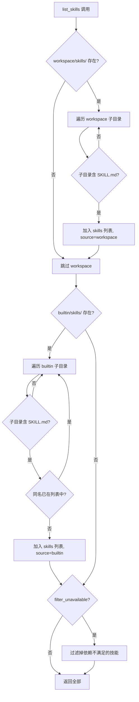
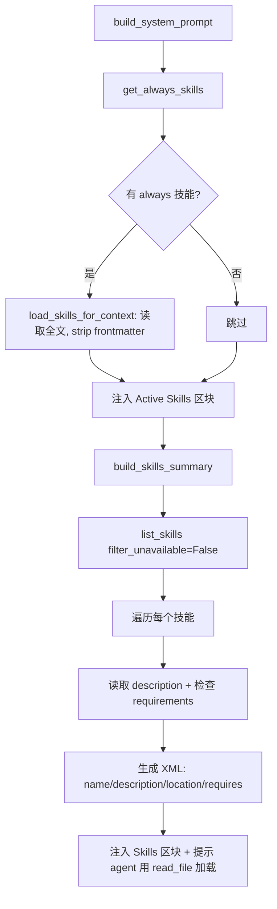
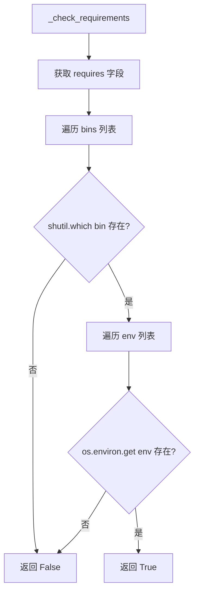

# PD-136.01 FastCode (Nanobot) — 可扩展技能加载系统

> 文档编号：PD-136.01
> 来源：FastCode / Nanobot `nanobot/nanobot/agent/skills.py`
> GitHub：https://github.com/HKUDS/FastCode.git
> 问题域：PD-136 技能系统 Skill System
> 状态：可复用方案

---

## 第 1 章 问题与动机

### 1.1 核心问题

Agent 系统需要一种机制来动态扩展自身能力，而不是把所有知识硬编码在系统 prompt 中。核心挑战包括：

1. **上下文窗口是稀缺资源** — 不可能把所有技能的完整内容同时塞进 prompt，需要按需加载
2. **技能来源多样** — 用户自定义技能应优先于内置技能，且两者需要统一的发现机制
3. **依赖可用性** — 某些技能依赖外部 CLI 工具或环境变量，不满足时应优雅降级而非报错
4. **元数据与内容分离** — 技能的触发条件（何时使用）和执行指令（如何使用）需要分层管理

这些问题在 Agent 系统规模化时尤为突出：当技能数量从 5 个增长到 50 个，全量加载的 token 成本会线性增长，而大部分技能在单次对话中根本不会被触发。

### 1.2 FastCode (Nanobot) 的解法概述

Nanobot 的 `SkillsLoader` 实现了一套完整的技能生命周期管理方案：

1. **双来源发现** — workspace 目录优先于 builtin 目录，同名技能 workspace 覆盖 builtin（`skills.py:38-52`）
2. **YAML frontmatter 元数据** — 每个 SKILL.md 文件头部包含 name/description/metadata，用简单正则解析而非引入 YAML 库（`skills.py:203-228`）
3. **三级渐进式加载** — Level 1: 元数据摘要（~100 词/技能，始终在 context 中）→ Level 2: SKILL.md body（技能触发后加载）→ Level 3: 捆绑资源（按需读取）（`skills.py:101-140`）
4. **依赖检查门控** — 通过 `shutil.which()` 检查 CLI 工具、`os.environ.get()` 检查环境变量，不满足的技能标记为 unavailable 并展示缺失项（`skills.py:177-186`）
5. **always-on 标记** — 关键技能（如 fastcode）通过 `always: true` 标记，始终全文注入 context（`skills.py:193-201`）

### 1.3 设计思想

| 设计原则 | 具体实现 | 理由 | 替代方案 |
|----------|----------|------|----------|
| 约定优于配置 | 技能 = 目录名 + SKILL.md 文件，无需注册表 | 降低技能创建门槛，ls 即可发现 | 中心化注册表（需维护一致性） |
| 渐进式披露 | 三级加载：摘要→body→资源 | 上下文窗口是公共资源，按需分配 | 全量加载（token 浪费）或纯懒加载（无法触发） |
| 用户空间优先 | workspace 技能覆盖 builtin 同名技能 | 允许用户定制/覆盖内置行为 | 命名空间隔离（增加复杂度） |
| 优雅降级 | 依赖不满足时标记 unavailable 而非报错 | 系统仍可运行，只是能力受限 | 启动时强校验（一个缺失全部不可用） |
| 零依赖解析 | 用正则 + split 解析 frontmatter，不引入 PyYAML | 减少外部依赖，SKILL.md 的 frontmatter 足够简单 | PyYAML/ruamel.yaml（更健壮但多一个依赖） |

---

## 第 2 章 源码实现分析

### 2.1 架构概览

Nanobot 的技能系统由三个核心组件协作：

```
┌─────────────────────────────────────────────────────────┐
│                    ContextBuilder                        │
│  (nanobot/agent/context.py)                             │
│                                                         │
│  build_system_prompt()                                  │
│    ├── 1. Core identity                                 │
│    ├── 2. Bootstrap files (AGENTS.md, SOUL.md...)       │
│    ├── 3. Memory context                                │
│    ├── 4. Always-on skills → full content               │
│    └── 5. Available skills → XML summary only           │
│              │                                          │
│              ▼                                          │
│  ┌─────────────────────┐                                │
│  │    SkillsLoader     │                                │
│  │  (agent/skills.py)  │                                │
│  │                     │                                │
│  │  workspace/skills/  │ ◄── 优先级 HIGH               │
│  │  builtin/skills/    │ ◄── 优先级 LOW                │
│  └─────────────────────┘                                │
│              │                                          │
│              ▼                                          │
│  ┌─────────────────────┐                                │
│  │   SKILL.md 文件      │                                │
│  │  ┌───────────────┐  │                                │
│  │  │ frontmatter   │  │  ← Level 1: 始终加载           │
│  │  │ (name, desc)  │  │                                │
│  │  ├───────────────┤  │                                │
│  │  │ body          │  │  ← Level 2: 触发后加载          │
│  │  │ (instructions)│  │                                │
│  │  └───────────────┤  │                                │
│  │  scripts/        │  │  ← Level 3: 按需执行           │
│  │  references/     │  │                                │
│  │  assets/         │  │                                │
│  └─────────────────────┘                                │
└─────────────────────────────────────────────────────────┘
```

### 2.2 核心实现

#### 2.2.1 双来源技能发现与优先级



对应源码 `nanobot/nanobot/agent/skills.py:26-57`：

```python
def list_skills(self, filter_unavailable: bool = True) -> list[dict[str, str]]:
    skills = []
    
    # Workspace skills (highest priority)
    if self.workspace_skills.exists():
        for skill_dir in self.workspace_skills.iterdir():
            if skill_dir.is_dir():
                skill_file = skill_dir / "SKILL.md"
                if skill_file.exists():
                    skills.append({"name": skill_dir.name, "path": str(skill_file), "source": "workspace"})
    
    # Built-in skills
    if self.builtin_skills and self.builtin_skills.exists():
        for skill_dir in self.builtin_skills.iterdir():
            if skill_dir.is_dir():
                skill_file = skill_dir / "SKILL.md"
                if skill_file.exists() and not any(s["name"] == skill_dir.name for s in skills):
                    skills.append({"name": skill_dir.name, "path": str(skill_file), "source": "builtin"})
    
    # Filter by requirements
    if filter_unavailable:
        return [s for s in skills if self._check_requirements(self._get_skill_meta(s["name"]))]
    return skills
```

关键设计点：`not any(s["name"] == skill_dir.name for s in skills)` 这一行实现了 workspace 覆盖 builtin 的优先级——因为 workspace 先遍历，同名 builtin 技能会被跳过。

#### 2.2.2 渐进式加载与 XML 摘要生成



对应源码 `nanobot/nanobot/agent/skills.py:101-140`：

```python
def build_skills_summary(self) -> str:
    all_skills = self.list_skills(filter_unavailable=False)
    if not all_skills:
        return ""
    
    def escape_xml(s: str) -> str:
        return s.replace("&", "&amp;").replace("<", "&lt;").replace(">", "&gt;")
    
    lines = ["<skills>"]
    for s in all_skills:
        name = escape_xml(s["name"])
        path = s["path"]
        desc = escape_xml(self._get_skill_description(s["name"]))
        skill_meta = self._get_skill_meta(s["name"])
        available = self._check_requirements(skill_meta)
        
        lines.append(f"  <skill available=\"{str(available).lower()}\">")
        lines.append(f"    <name>{name}</name>")
        lines.append(f"    <description>{desc}</description>")
        lines.append(f"    <location>{path}</location>")
        
        if not available:
            missing = self._get_missing_requirements(skill_meta)
            if missing:
                lines.append(f"    <requires>{escape_xml(missing)}</requires>")
        
        lines.append(f"  </skill>")
    lines.append("</skills>")
    
    return "\n".join(lines)
```

XML 格式的选择值得注意：相比 JSON 或 Markdown 列表，XML 标签对 LLM 来说有更清晰的结构边界，且 `available` 属性让 Agent 一眼就能判断技能是否可用。

#### 2.2.3 依赖检查与 frontmatter 解析



对应源码 `nanobot/nanobot/agent/skills.py:169-186`：

```python
def _parse_nanobot_metadata(self, raw: str) -> dict:
    """Parse nanobot metadata JSON from frontmatter."""
    try:
        data = json.loads(raw)
        return data.get("nanobot", {}) if isinstance(data, dict) else {}
    except (json.JSONDecodeError, TypeError):
        return {}

def _check_requirements(self, skill_meta: dict) -> bool:
    """Check if skill requirements are met (bins, env vars)."""
    requires = skill_meta.get("requires", {})
    for b in requires.get("bins", []):
        if not shutil.which(b):
            return False
    for env in requires.get("env", []):
        if not os.environ.get(env):
            return False
    return True
```

metadata 字段的设计很巧妙：frontmatter 中的 `metadata` 是一个 JSON 字符串（而非嵌套 YAML），这样用简单的 `key: value` 行解析就能处理 frontmatter，复杂结构交给 JSON 解析。例如 `github/SKILL.md:4` 中：

```yaml
metadata: {"nanobot":{"emoji":"🐙","requires":{"bins":["gh"]},"install":[...]}}
```

### 2.3 实现细节

#### Context 注入流程

`ContextBuilder.build_system_prompt()` (`context.py:28-71`) 中技能的注入分两步：

1. **always-on 技能全文注入**（`context.py:54-59`）：调用 `get_always_skills()` 获取标记为 `always: true` 的技能列表，然后 `load_skills_for_context()` 读取全文、strip frontmatter、格式化为 `### Skill: {name}` 区块
2. **其他技能摘要注入**（`context.py:61-69`）：调用 `build_skills_summary()` 生成 XML 摘要，附带提示语 "To use a skill, read its SKILL.md file using the read_file tool"

这种设计让 Agent 自主决定何时加载哪个技能——它看到摘要中的 description，判断当前任务是否匹配，然后用 `read_file` 工具读取完整 SKILL.md。

#### frontmatter 解析的简化策略

`get_skill_metadata()` (`skills.py:203-228`) 使用纯 Python 实现了一个极简 YAML 解析器：

```python
if content.startswith("---"):
    match = re.match(r"^---\n(.*?)\n---", content, re.DOTALL)
    if match:
        metadata = {}
        for line in match.group(1).split("\n"):
            if ":" in line:
                key, value = line.split(":", 1)
                metadata[key.strip()] = value.strip().strip('"\'')
        return metadata
```

这个实现只支持单层 `key: value` 格式，不支持嵌套、列表等复杂 YAML 结构。但这恰好是设计意图——复杂数据放在 `metadata` 字段的 JSON 字符串中，由 `_parse_nanobot_metadata()` 处理。


---

## 第 3 章 迁移指南

### 3.1 迁移清单

#### 阶段 1：最小可用（1 个文件）

- [ ] 创建 `skills_loader.py`，实现 `SkillsLoader` 类
- [ ] 定义技能目录约定：`{workspace}/skills/{name}/SKILL.md`
- [ ] 实现 `list_skills()` 和 `load_skill()` 方法
- [ ] 实现简单的 frontmatter 解析（`---` 分隔 + `key: value` 行解析）

#### 阶段 2：渐进式加载

- [ ] 实现 `build_skills_summary()` 生成 XML 摘要
- [ ] 在 context builder 中区分 always-on 技能（全文）和普通技能（摘要）
- [ ] 确保 Agent 有 `read_file` 工具可以按需加载 SKILL.md

#### 阶段 3：依赖检查

- [ ] 在 frontmatter metadata 中定义 `requires.bins` 和 `requires.env`
- [ ] 实现 `_check_requirements()` 门控
- [ ] 在 XML 摘要中标记 `available="false"` 并展示缺失依赖

#### 阶段 4：双来源与覆盖

- [ ] 添加 builtin skills 目录支持
- [ ] 实现 workspace 优先覆盖逻辑

### 3.2 适配代码模板

以下是一个可直接运行的最小实现，覆盖阶段 1-3 的核心功能：

```python
"""Minimal skills loader — adapted from Nanobot SkillsLoader."""

import json
import os
import re
import shutil
from pathlib import Path
from dataclasses import dataclass, field


@dataclass
class SkillInfo:
    name: str
    path: str
    source: str  # "workspace" | "builtin"
    description: str = ""
    available: bool = True
    missing_deps: list[str] = field(default_factory=list)


class SkillsLoader:
    """
    Two-source skill loader with progressive disclosure.
    
    Usage:
        loader = SkillsLoader(workspace=Path("./workspace"))
        
        # Level 1: Get summaries for all skills (inject into system prompt)
        summary_xml = loader.build_summary_xml()
        
        # Level 2: Load full content when agent triggers a skill
        content = loader.load(name="github")
        
        # Always-on: Get skills that should always be fully loaded
        always = loader.get_always_on_skills()
    """
    
    def __init__(
        self,
        workspace: Path,
        builtin_dir: Path | None = None,
    ):
        self.workspace_dir = workspace / "skills"
        self.builtin_dir = builtin_dir
    
    def discover(self, include_unavailable: bool = False) -> list[SkillInfo]:
        """Discover all skills from workspace (priority) and builtin dirs."""
        skills: dict[str, SkillInfo] = {}
        
        # Workspace first (higher priority)
        self._scan_dir(self.workspace_dir, "workspace", skills)
        # Builtin second (skips duplicates)
        if self.builtin_dir:
            self._scan_dir(self.builtin_dir, "builtin", skills)
        
        result = list(skills.values())
        if not include_unavailable:
            result = [s for s in result if s.available]
        return result
    
    def _scan_dir(self, base: Path, source: str, skills: dict[str, SkillInfo]) -> None:
        if not base.exists():
            return
        for d in sorted(base.iterdir()):
            if not d.is_dir() or d.name in skills:
                continue
            skill_file = d / "SKILL.md"
            if not skill_file.exists():
                continue
            meta = self._parse_frontmatter(skill_file.read_text(encoding="utf-8"))
            info = SkillInfo(
                name=d.name,
                path=str(skill_file),
                source=source,
                description=meta.get("description", d.name),
            )
            # Check requirements
            nanobot_meta = self._parse_nanobot_meta(meta.get("metadata", ""))
            requires = nanobot_meta.get("requires", {})
            missing = []
            for b in requires.get("bins", []):
                if not shutil.which(b):
                    missing.append(f"CLI: {b}")
            for env in requires.get("env", []):
                if not os.environ.get(env):
                    missing.append(f"ENV: {env}")
            info.available = len(missing) == 0
            info.missing_deps = missing
            skills[d.name] = info
    
    def load(self, name: str) -> str | None:
        """Load full skill content (Level 2), stripping frontmatter."""
        for base in [self.workspace_dir, self.builtin_dir]:
            if base is None:
                continue
            path = base / name / "SKILL.md"
            if path.exists():
                content = path.read_text(encoding="utf-8")
                return self._strip_frontmatter(content)
        return None
    
    def get_always_on_skills(self) -> list[str]:
        """Get names of skills marked always=true that meet requirements."""
        result = []
        for skill in self.discover():
            meta = self._parse_frontmatter(Path(skill.path).read_text(encoding="utf-8"))
            nanobot_meta = self._parse_nanobot_meta(meta.get("metadata", ""))
            if nanobot_meta.get("always") or meta.get("always"):
                result.append(skill.name)
        return result
    
    def build_summary_xml(self) -> str:
        """Build XML summary for injection into system prompt (Level 1)."""
        skills = self.discover(include_unavailable=True)
        if not skills:
            return ""
        esc = lambda s: s.replace("&", "&amp;").replace("<", "&lt;").replace(">", "&gt;")
        lines = ["<skills>"]
        for s in skills:
            lines.append(f'  <skill available="{str(s.available).lower()}">')
            lines.append(f"    <name>{esc(s.name)}</name>")
            lines.append(f"    <description>{esc(s.description)}</description>")
            lines.append(f"    <location>{s.path}</location>")
            if not s.available and s.missing_deps:
                lines.append(f"    <requires>{esc(', '.join(s.missing_deps))}</requires>")
            lines.append("  </skill>")
        lines.append("</skills>")
        return "\n".join(lines)
    
    # --- Internal helpers ---
    
    def _parse_frontmatter(self, content: str) -> dict[str, str]:
        if not content.startswith("---"):
            return {}
        match = re.match(r"^---\n(.*?)\n---", content, re.DOTALL)
        if not match:
            return {}
        meta = {}
        for line in match.group(1).split("\n"):
            if ":" in line:
                key, value = line.split(":", 1)
                meta[key.strip()] = value.strip().strip("\"'")
            
        return meta
    
    def _parse_nanobot_meta(self, raw: str) -> dict:
        try:
            data = json.loads(raw)
            return data.get("nanobot", {}) if isinstance(data, dict) else {}
        except (json.JSONDecodeError, TypeError):
            return {}
    
    def _strip_frontmatter(self, content: str) -> str:
        if content.startswith("---"):
            match = re.match(r"^---\n.*?\n---\n", content, re.DOTALL)
            if match:
                return content[match.end():].strip()
        return content
```

### 3.3 适用场景

| 场景 | 适用度 | 说明 |
|------|--------|------|
| LLM Agent 需要可扩展能力 | ⭐⭐⭐ | 核心场景，技能即 Markdown 文件，零门槛创建 |
| 多租户 Agent 平台 | ⭐⭐⭐ | workspace 覆盖 builtin 天然支持租户定制 |
| 上下文窗口受限的模型 | ⭐⭐⭐ | 渐进式加载显著减少 token 消耗 |
| 需要严格权限控制的场景 | ⭐⭐ | 当前仅有 CLI/ENV 检查，无细粒度权限模型 |
| 技能间有复杂依赖关系 | ⭐ | 当前无技能间依赖声明机制 |

---

## 第 4 章 测试用例

```python
"""Tests for SkillsLoader — based on Nanobot's actual implementation."""

import os
import json
import pytest
from pathlib import Path
from unittest.mock import patch


# --- Fixtures ---

@pytest.fixture
def skill_dirs(tmp_path):
    """Create workspace and builtin skill directories with test skills."""
    workspace = tmp_path / "workspace"
    builtin = tmp_path / "builtin"
    
    # Workspace skill: weather (overrides builtin)
    ws_weather = workspace / "skills" / "weather" / "SKILL.md"
    ws_weather.parent.mkdir(parents=True)
    ws_weather.write_text(
        '---\nname: weather\ndescription: Custom weather skill\n'
        'metadata: {"nanobot":{"requires":{"bins":["curl"]}}}\n---\n\n# Custom Weather\n'
    )
    
    # Builtin skill: weather (should be overridden)
    bi_weather = builtin / "weather" / "SKILL.md"
    bi_weather.parent.mkdir(parents=True)
    bi_weather.write_text(
        '---\nname: weather\ndescription: Builtin weather\n---\n\n# Builtin Weather\n'
    )
    
    # Builtin skill: github (requires gh CLI)
    bi_github = builtin / "github" / "SKILL.md"
    bi_github.parent.mkdir(parents=True)
    bi_github.write_text(
        '---\nname: github\ndescription: GitHub CLI integration\n'
        'metadata: {"nanobot":{"requires":{"bins":["gh"]}}}\n---\n\n# GitHub\n'
    )
    
    # Builtin skill: fastcode (always-on)
    bi_fastcode = builtin / "fastcode" / "SKILL.md"
    bi_fastcode.parent.mkdir(parents=True)
    bi_fastcode.write_text(
        '---\nname: fastcode\ndescription: FastCode backend\nalways: true\n'
        'metadata: {"nanobot":{"always":true}}\n---\n\n# FastCode Skill\n'
    )
    
    # Builtin skill: secret (requires env var)
    bi_secret = builtin / "secret-tool" / "SKILL.md"
    bi_secret.parent.mkdir(parents=True)
    bi_secret.write_text(
        '---\nname: secret-tool\ndescription: Needs API key\n'
        'metadata: {"nanobot":{"requires":{"env":["SECRET_API_KEY"]}}}\n---\n\n# Secret\n'
    )
    
    return workspace, builtin


class TestSkillDiscovery:
    """Test skill discovery and priority."""
    
    def test_workspace_overrides_builtin(self, skill_dirs):
        from skills_loader import SkillsLoader  # adapt import to your project
        workspace, builtin = skill_dirs
        loader = SkillsLoader(workspace=workspace, builtin_dir=builtin)
        
        skills = loader.discover(include_unavailable=True)
        weather_skills = [s for s in skills if s.name == "weather"]
        
        assert len(weather_skills) == 1
        assert weather_skills[0].source == "workspace"
        assert "Custom" in weather_skills[0].description
    
    def test_builtin_skills_included_when_no_workspace_override(self, skill_dirs):
        workspace, builtin = skill_dirs
        loader = SkillsLoader(workspace=workspace, builtin_dir=builtin)
        
        skills = loader.discover(include_unavailable=True)
        names = {s.name for s in skills}
        
        assert "github" in names
        assert "fastcode" in names


class TestRequirementsCheck:
    """Test dependency checking (CLI bins + env vars)."""
    
    @patch("shutil.which", side_effect=lambda b: "/usr/bin/curl" if b == "curl" else None)
    def test_available_when_bin_exists(self, mock_which, skill_dirs):
        workspace, builtin = skill_dirs
        loader = SkillsLoader(workspace=workspace, builtin_dir=builtin)
        
        skills = loader.discover(include_unavailable=True)
        weather = next(s for s in skills if s.name == "weather")
        assert weather.available is True
    
    @patch("shutil.which", return_value=None)
    def test_unavailable_when_bin_missing(self, mock_which, skill_dirs):
        workspace, builtin = skill_dirs
        loader = SkillsLoader(workspace=workspace, builtin_dir=builtin)
        
        skills = loader.discover(include_unavailable=True)
        github = next(s for s in skills if s.name == "github")
        assert github.available is False
        assert "CLI: gh" in github.missing_deps
    
    def test_unavailable_when_env_missing(self, skill_dirs):
        workspace, builtin = skill_dirs
        loader = SkillsLoader(workspace=workspace, builtin_dir=builtin)
        
        with patch.dict(os.environ, {}, clear=True):
            skills = loader.discover(include_unavailable=True)
            secret = next(s for s in skills if s.name == "secret-tool")
            assert secret.available is False
            assert "ENV: SECRET_API_KEY" in secret.missing_deps
    
    def test_available_when_env_set(self, skill_dirs):
        workspace, builtin = skill_dirs
        loader = SkillsLoader(workspace=workspace, builtin_dir=builtin)
        
        with patch.dict(os.environ, {"SECRET_API_KEY": "test-key"}):
            skills = loader.discover(include_unavailable=True)
            secret = next(s for s in skills if s.name == "secret-tool")
            assert secret.available is True


class TestProgressiveLoading:
    """Test the three-level loading strategy."""
    
    def test_summary_xml_contains_all_skills(self, skill_dirs):
        workspace, builtin = skill_dirs
        loader = SkillsLoader(workspace=workspace, builtin_dir=builtin)
        
        xml = loader.build_summary_xml()
        assert "<skills>" in xml
        assert "<name>weather</name>" in xml
        assert 'available="false"' in xml  # at least one unavailable
    
    def test_load_returns_body_without_frontmatter(self, skill_dirs):
        workspace, builtin = skill_dirs
        loader = SkillsLoader(workspace=workspace, builtin_dir=builtin)
        
        content = loader.load("fastcode")
        assert content is not None
        assert "---" not in content  # frontmatter stripped
        assert "# FastCode Skill" in content
    
    def test_always_on_skills(self, skill_dirs):
        workspace, builtin = skill_dirs
        loader = SkillsLoader(workspace=workspace, builtin_dir=builtin)
        
        always = loader.get_always_on_skills()
        assert "fastcode" in always


class TestFrontmatterParsing:
    """Test YAML frontmatter and nested JSON metadata parsing."""
    
    def test_parse_simple_frontmatter(self, skill_dirs):
        workspace, builtin = skill_dirs
        loader = SkillsLoader(workspace=workspace, builtin_dir=builtin)
        
        content = '---\nname: test\ndescription: A test skill\n---\n\n# Body'
        meta = loader._parse_frontmatter(content)
        assert meta["name"] == "test"
        assert meta["description"] == "A test skill"
    
    def test_parse_nanobot_metadata_json(self, skill_dirs):
        workspace, builtin = skill_dirs
        loader = SkillsLoader(workspace=workspace, builtin_dir=builtin)
        
        raw = '{"nanobot":{"requires":{"bins":["gh"]},"always":true}}'
        meta = loader._parse_nanobot_meta(raw)
        assert meta["requires"]["bins"] == ["gh"]
        assert meta["always"] is True
    
    def test_invalid_metadata_returns_empty(self, skill_dirs):
        workspace, builtin = skill_dirs
        loader = SkillsLoader(workspace=workspace, builtin_dir=builtin)
        
        assert loader._parse_nanobot_meta("not json") == {}
        assert loader._parse_nanobot_meta("") == {}
```


---

## 第 5 章 跨域关联

| 关联域 | 关系类型 | 说明 |
|--------|----------|------|
| PD-01 上下文管理 | 协同 | 渐进式加载本质上是上下文窗口管理策略——通过摘要→全文→资源三级加载减少 token 消耗。always-on 技能的全文注入需要与上下文预算协调 |
| PD-04 工具系统 | 依赖 | 技能系统依赖工具系统提供 `read_file` 工具，Agent 才能按需加载 SKILL.md 全文。技能中的 `scripts/` 目录也需要 `exec` 工具来执行 |
| PD-06 记忆持久化 | 协同 | Nanobot 的 ContextBuilder 同时组装 memory 和 skills，两者共享上下文窗口。技能的 always-on 标记与记忆的注入策略需要统一预算管理 |
| PD-139 配置驱动架构 | 协同 | 技能的 frontmatter 元数据（requires、always、install）本质上是声明式配置，与配置驱动架构的理念一致 |

---

## 第 6 章 来源文件索引

| 文件 | 行范围 | 关键实现 |
|------|--------|----------|
| `nanobot/nanobot/agent/skills.py` | L1-229 | SkillsLoader 完整实现：双来源发现、渐进式加载、依赖检查、frontmatter 解析 |
| `nanobot/nanobot/agent/context.py` | L26-71 | ContextBuilder：技能注入 system prompt 的两步策略（always-on 全文 + 其他摘要） |
| `nanobot/nanobot/agent/context.py` | L54-69 | always-on 技能全文注入 + XML 摘要注入的具体代码 |
| `nanobot/nanobot/agent/loop.py` | L26-117 | AgentLoop：技能系统的运行时消费者，通过 ContextBuilder 间接使用 |
| `nanobot/nanobot/agent/__init__.py` | L1-8 | 模块导出：SkillsLoader 作为 agent 核心组件之一 |
| `nanobot/nanobot/skills/README.md` | L1-25 | 技能目录说明，注明格式源自 OpenClaw 项目 |
| `nanobot/nanobot/skills/skill-creator/SKILL.md` | L1-366 | 技能创建指南：定义了技能的标准结构（SKILL.md + scripts/ + references/ + assets/）和渐进式披露设计原则 |
| `nanobot/nanobot/skills/weather/SKILL.md` | L1-50 | 示例技能：展示 frontmatter 中 metadata JSON 嵌套 requires.bins 的用法 |
| `nanobot/nanobot/skills/github/SKILL.md` | L1-49 | 示例技能：展示 metadata 中 install 字段（brew/apt 安装指引）的扩展用法 |
| `nanobot/nanobot/skills/fastcode/SKILL.md` | L1-82 | always-on 技能示例：`always: true` 标记 + 强制使用 FastCode 工具的行为约束 |
| `nanobot/nanobot/skills/cron/SKILL.md` | L1-41 | 最简技能示例：仅 frontmatter + 简短指令，无 metadata JSON |

---

## 第 7 章 横向对比维度

```json comparison_data
{
  "project": "FastCode (Nanobot)",
  "dimensions": {
    "技能格式": "SKILL.md Markdown 文件 + YAML frontmatter + 嵌套 JSON metadata",
    "发现机制": "目录约定式扫描，workspace 优先覆盖 builtin 同名技能",
    "加载策略": "三级渐进式：元数据摘要(XML)→body(strip frontmatter)→资源(scripts/references/assets)",
    "依赖检查": "shutil.which(bins) + os.environ(env)，不满足标记 unavailable 并展示缺失项",
    "常驻机制": "always: true 标记，满足依赖的 always 技能全文注入 context",
    "元数据解析": "零依赖：正则 split frontmatter + json.loads 解析嵌套 metadata 字段"
  }
}
```

### 域元数据补充

```json domain_metadata
{
  "solution_summary": "Nanobot SkillsLoader 用目录约定式扫描 + XML 摘要 + always-on 标记实现三级渐进式技能加载，workspace 覆盖 builtin 支持用户定制",
  "description": "技能系统需要平衡上下文窗口成本与能力可发现性，渐进式披露是核心设计模式",
  "sub_problems": [
    "always-on 技能的上下文预算管理",
    "技能创建与打包的标准化流程",
    "技能摘要格式选择(XML vs JSON vs Markdown)"
  ],
  "best_practices": [
    "frontmatter 中嵌套 JSON 字符串避免引入 YAML 解析库",
    "XML 格式摘要比 JSON 更适合 LLM 结构化理解",
    "技能目录结构约定(scripts/references/assets)实现关注点分离"
  ]
}
```

