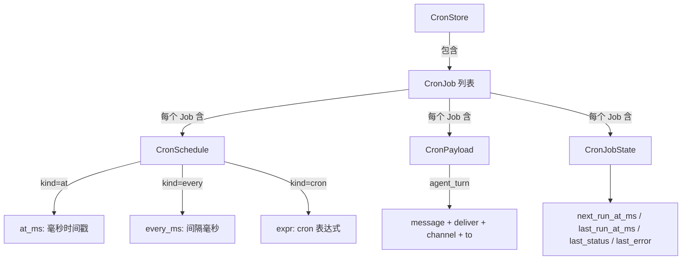
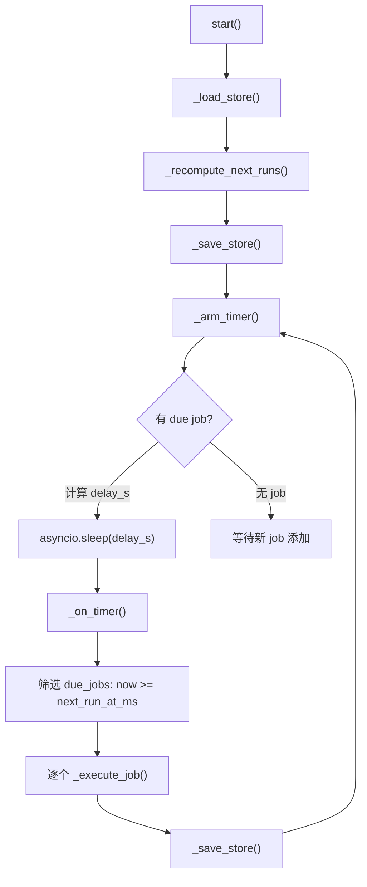
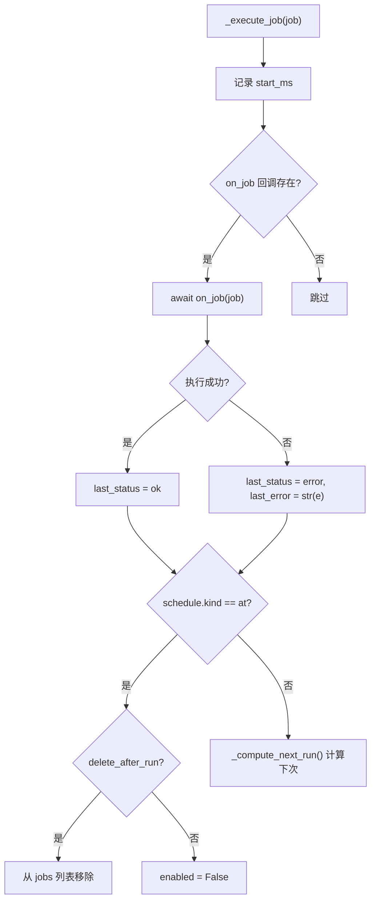

# PD-137.01 FastCode — CronService 三模式定时任务调度

> 文档编号：PD-137.01
> 来源：FastCode `nanobot/nanobot/cron/service.py`
> GitHub：https://github.com/HKUDS/FastCode.git
> 问题域：PD-137 定时任务调度 Task Scheduling
> 状态：可复用方案

---

## 第 1 章 问题与动机

### 1.1 核心问题

Agent 系统需要在无人值守时自动执行任务——定时提醒、周期性数据采集、按 cron 表达式触发的例行工作。
传统做法是依赖外部调度器（系统 crontab、Celery Beat），但这引入了额外的基础设施依赖，
且无法与 Agent 的会话上下文、工具系统和消息通道深度集成。

核心挑战：
- **多模式调度**：一次性定时（at）、固定间隔（every）、cron 表达式三种模式需统一抽象
- **持久化**：进程重启后任务不丢失，需要磁盘存储
- **Agent 集成**：调度触发后需要通过 Agent 的工具系统执行，而非简单的函数调用
- **消息投递**：执行结果需要能回推到用户所在的通道（Telegram、WhatsApp 等）

### 1.2 FastCode 的解法概述

FastCode 的 Nanobot 子项目实现了一个轻量级的进程内调度服务 `CronService`，核心设计：

1. **三模式统一调度**：`CronSchedule` 用 `kind` 字段区分 `at`/`every`/`cron` 三种模式，`_compute_next_run()` 统一计算下次执行时间 (`service.py:19-39`)
2. **JSON 文件持久化**：任务存储在 `{data_dir}/cron/jobs.json`，启动时加载、变更时写回 (`service.py:56-145`)
3. **asyncio 单定时器驱动**：不用线程池，用 `asyncio.create_task` + `asyncio.sleep` 实现最近任务唤醒 (`service.py:180-197`)
4. **回调式 Agent 集成**：`on_job` 回调注入 `AgentLoop.process_direct()`，调度触发后走完整的 Agent 推理循环 (`commands.py:366-382`)
5. **Tool 暴露给 LLM**：`CronTool` 继承 `Tool` 基类，LLM 可通过 function calling 自主创建/管理定时任务 (`cron.py:10-114`)

### 1.3 设计思想

| 设计原则 | 具体实现 | 理由 | 替代方案 |
|----------|----------|------|----------|
| 进程内调度 | asyncio.create_task 单定时器 | 零外部依赖，与 Agent 事件循环共享 | APScheduler / Celery Beat |
| 统一调度抽象 | CronSchedule.kind 三态枚举 | 一个数据结构覆盖所有场景 | 每种模式独立类 |
| 文件持久化 | JSON 文件读写 | 无需数据库，部署简单 | SQLite / Redis |
| 回调注入 | on_job 可选回调 | CronService 不依赖 AgentLoop，解耦 | 直接 import AgentLoop |
| LLM 自主调度 | CronTool 暴露 add/list/remove | Agent 可自主创建定时任务 | 仅 CLI/API 管理 |

---

## 第 2 章 源码实现分析

### 2.1 架构概览

```
┌─────────────────────────────────────────────────────────┐
│                     CLI (Typer)                          │
│  cron list / cron add / cron remove / cron enable       │
└──────────────────────┬──────────────────────────────────┘
                       │
┌──────────────────────▼──────────────────────────────────┐
│                   CronService                            │
│  ┌──────────┐  ┌──────────┐  ┌───────────────────────┐  │
│  │ _load    │  │ _save    │  │ _arm_timer            │  │
│  │ _store() │  │ _store() │  │ asyncio.create_task() │  │
│  └────┬─────┘  └────┬─────┘  └──────────┬────────────┘  │
│       │              │                   │               │
│  ┌────▼──────────────▼───┐    ┌──────────▼────────────┐  │
│  │  jobs.json (磁盘)     │    │  _on_timer → due jobs │  │
│  │  CronStore.jobs[]     │    │  → _execute_job()     │  │
│  └───────────────────────┘    └──────────┬────────────┘  │
└──────────────────────────────────────────┼──────────────┘
                                           │ on_job callback
┌──────────────────────────────────────────▼──────────────┐
│                   AgentLoop                              │
│  process_direct(message, session_key, channel, chat_id) │
│  → LLM 推理 → 工具调用 → 返回 response                   │
└──────────────────────────────────────────┬──────────────┘
                                           │ OutboundMessage
┌──────────────────────────────────────────▼──────────────┐
│                   MessageBus                             │
│  → Telegram / WhatsApp / CLI 通道投递                     │
└─────────────────────────────────────────────────────────┘
```

CronTool 作为 Agent 工具注册在 ToolRegistry 中，LLM 通过 function calling 调用：

```
┌──────────┐    function call     ┌──────────┐    add_job()    ┌─────────────┐
│   LLM    │ ──────────────────→  │ CronTool │ ─────────────→  │ CronService │
│          │ ←──────────────────  │          │ ←─────────────  │             │
└──────────┘    result string     └──────────┘    CronJob      └─────────────┘
```

### 2.2 核心实现

#### 2.2.1 数据模型：四层 dataclass 结构



对应源码 `nanobot/nanobot/cron/types.py:7-59`：

```python
@dataclass
class CronSchedule:
    """Schedule definition for a cron job."""
    kind: Literal["at", "every", "cron"]
    at_ms: int | None = None       # For "at": timestamp in ms
    every_ms: int | None = None    # For "every": interval in ms
    expr: str | None = None        # For "cron": cron expression
    tz: str | None = None          # Timezone for cron expressions

@dataclass
class CronJob:
    """A scheduled job."""
    id: str
    name: str
    enabled: bool = True
    schedule: CronSchedule = field(default_factory=lambda: CronSchedule(kind="every"))
    payload: CronPayload = field(default_factory=CronPayload)
    state: CronJobState = field(default_factory=CronJobState)
    created_at_ms: int = 0
    updated_at_ms: int = 0
    delete_after_run: bool = False
```

关键设计：`CronSchedule` 用 `kind` 字段做联合类型判别，而非继承。`CronPayload` 的 `deliver` + `channel` + `to` 三字段支持执行结果回推到消息通道。

#### 2.2.2 调度核心：单定时器 + 最近唤醒



对应源码 `nanobot/nanobot/cron/service.py:180-214`：

```python
def _arm_timer(self) -> None:
    """Schedule the next timer tick."""
    if self._timer_task:
        self._timer_task.cancel()
    
    next_wake = self._get_next_wake_ms()
    if not next_wake or not self._running:
        return
    
    delay_ms = max(0, next_wake - _now_ms())
    delay_s = delay_ms / 1000
    
    async def tick():
        await asyncio.sleep(delay_s)
        if self._running:
            await self._on_timer()
    
    self._timer_task = asyncio.create_task(tick())

async def _on_timer(self) -> None:
    """Handle timer tick - run due jobs."""
    now = _now_ms()
    due_jobs = [
        j for j in self._store.jobs
        if j.enabled and j.state.next_run_at_ms and now >= j.state.next_run_at_ms
    ]
    for job in due_jobs:
        await self._execute_job(job)
    self._save_store()
    self._arm_timer()
```

核心技巧：不用轮询，而是计算最近一个 job 的 `next_run_at_ms`，只 sleep 到那个时间点。每次 timer 触发后重新 arm，形成自驱动循环。

#### 2.2.3 任务执行与生命周期管理



对应源码 `nanobot/nanobot/cron/service.py:216-247`：

```python
async def _execute_job(self, job: CronJob) -> None:
    start_ms = _now_ms()
    try:
        response = None
        if self.on_job:
            response = await self.on_job(job)
        job.state.last_status = "ok"
        job.state.last_error = None
    except Exception as e:
        job.state.last_status = "error"
        job.state.last_error = str(e)
    
    job.state.last_run_at_ms = start_ms
    job.updated_at_ms = _now_ms()
    
    # Handle one-shot jobs
    if job.schedule.kind == "at":
        if job.delete_after_run:
            self._store.jobs = [j for j in self._store.jobs if j.id != job.id]
        else:
            job.enabled = False
            job.state.next_run_at_ms = None
    else:
        job.state.next_run_at_ms = _compute_next_run(job.schedule, _now_ms())
```

### 2.3 实现细节

**Agent 回调注入模式** (`commands.py:347-382`)：

CronService 构造时不绑定 Agent，而是在 gateway 启动流程中后置注入回调：

```python
# 1. 先创建 CronService（无回调）
cron = CronService(cron_store_path)

# 2. 创建 AgentLoop（注入 cron_service）
agent = AgentLoop(bus=bus, ..., cron_service=cron)

# 3. 后置注入回调（需要 agent 实例）
async def on_cron_job(job: CronJob) -> str | None:
    response = await agent.process_direct(
        job.payload.message,
        session_key=f"cron:{job.id}",
        channel=job.payload.channel or "cli",
        chat_id=job.payload.to or "direct",
    )
    if job.payload.deliver and job.payload.to:
        await bus.publish_outbound(OutboundMessage(
            channel=job.payload.channel or "cli",
            chat_id=job.payload.to,
            content=response or ""
        ))
    return response
cron.on_job = on_cron_job
```

这种"先构造后注入"模式解决了 CronService 和 AgentLoop 的循环依赖问题。

**LLM 自主调度** (`cron.py:10-114`)：

CronTool 继承 Tool 基类，通过 JSON Schema 定义参数，LLM 可以自主决定创建定时任务：

```python
class CronTool(Tool):
    def set_context(self, channel: str, chat_id: str) -> None:
        """Set the current session context for delivery."""
        self._channel = channel
        self._chat_id = chat_id
    
    async def execute(self, action: str, message: str = "", 
                      every_seconds: int | None = None,
                      cron_expr: str | None = None, ...) -> str:
        if action == "add":
            return self._add_job(message, every_seconds, cron_expr)
        elif action == "list":
            return self._list_jobs()
        elif action == "remove":
            return self._remove_job(job_id)
```

`set_context()` 方法让 CronTool 感知当前会话的通道和聊天 ID，创建的任务自动绑定投递目标。

**JSON 持久化格式**：

存储使用 camelCase JSON（`atMs`、`everyMs`、`nextRunAtMs`），加载时转换为 Python snake_case dataclass。版本号字段 `version: 1` 预留了未来格式迁移的能力。


---

## 第 3 章 迁移指南

### 3.1 迁移清单

**阶段 1：核心调度引擎（最小可用）**

- [ ] 创建 `cron/types.py`：复制 `CronSchedule`、`CronJob`、`CronJobState`、`CronPayload`、`CronStore` 五个 dataclass
- [ ] 创建 `cron/service.py`：复制 `CronService` 类，包含 `_compute_next_run()`、`_arm_timer()`、`_on_timer()`、`_execute_job()` 核心方法
- [ ] 安装依赖：`pip install croniter`（仅 cron 表达式模式需要）
- [ ] 集成到主事件循环：在 `asyncio.run()` 中调用 `await cron.start()`

**阶段 2：Agent 集成**

- [ ] 实现 `on_job` 回调：将 `CronJob.payload.message` 传入 Agent 推理循环
- [ ] 创建 `CronTool`：继承你的 Tool 基类，暴露 add/list/remove 给 LLM
- [ ] 注册 CronTool 到 ToolRegistry

**阶段 3：CLI 管理**

- [ ] 添加 `cron list/add/remove/enable/run` CLI 子命令
- [ ] 实现消息投递：`deliver=True` 时将结果推送到用户通道

### 3.2 适配代码模板

以下是一个可直接运行的最小调度引擎实现：

```python
"""Minimal cron service - 可直接复用的调度引擎模板。"""

import asyncio
import json
import time
import uuid
from dataclasses import dataclass, field, asdict
from pathlib import Path
from typing import Any, Callable, Coroutine, Literal


@dataclass
class Schedule:
    kind: Literal["at", "every", "cron"]
    at_ms: int | None = None
    every_ms: int | None = None
    expr: str | None = None


@dataclass
class JobState:
    next_run_at_ms: int | None = None
    last_run_at_ms: int | None = None
    last_status: str | None = None
    last_error: str | None = None


@dataclass
class Job:
    id: str
    name: str
    message: str
    schedule: Schedule
    state: JobState = field(default_factory=JobState)
    enabled: bool = True
    delete_after_run: bool = False


def _now_ms() -> int:
    return int(time.time() * 1000)


def compute_next_run(schedule: Schedule, now_ms: int) -> int | None:
    if schedule.kind == "at":
        return schedule.at_ms if schedule.at_ms and schedule.at_ms > now_ms else None
    if schedule.kind == "every" and schedule.every_ms:
        return now_ms + schedule.every_ms
    if schedule.kind == "cron" and schedule.expr:
        from croniter import croniter
        return int(croniter(schedule.expr, time.time()).get_next() * 1000)
    return None


class MiniCronService:
    """最小可用的进程内调度服务。"""

    def __init__(
        self,
        store_path: Path,
        on_job: Callable[[Job], Coroutine[Any, Any, str | None]] | None = None,
    ):
        self.store_path = store_path
        self.on_job = on_job
        self._jobs: list[Job] = []
        self._timer: asyncio.Task | None = None
        self._running = False

    def _load(self) -> None:
        if self.store_path.exists():
            data = json.loads(self.store_path.read_text())
            self._jobs = [
                Job(
                    id=j["id"], name=j["name"], message=j["message"],
                    schedule=Schedule(**j["schedule"]),
                    state=JobState(**j.get("state", {})),
                    enabled=j.get("enabled", True),
                    delete_after_run=j.get("delete_after_run", False),
                )
                for j in data.get("jobs", [])
            ]

    def _save(self) -> None:
        self.store_path.parent.mkdir(parents=True, exist_ok=True)
        data = {"jobs": [asdict(j) for j in self._jobs]}
        self.store_path.write_text(json.dumps(data, indent=2))

    async def start(self) -> None:
        self._running = True
        self._load()
        now = _now_ms()
        for job in self._jobs:
            if job.enabled:
                job.state.next_run_at_ms = compute_next_run(job.schedule, now)
        self._save()
        self._arm()

    def stop(self) -> None:
        self._running = False
        if self._timer:
            self._timer.cancel()

    def _arm(self) -> None:
        if self._timer:
            self._timer.cancel()
        times = [j.state.next_run_at_ms for j in self._jobs
                 if j.enabled and j.state.next_run_at_ms]
        if not times or not self._running:
            return
        delay_s = max(0, min(times) - _now_ms()) / 1000

        async def tick():
            await asyncio.sleep(delay_s)
            if self._running:
                await self._tick()

        self._timer = asyncio.create_task(tick())

    async def _tick(self) -> None:
        now = _now_ms()
        due = [j for j in self._jobs
               if j.enabled and j.state.next_run_at_ms and now >= j.state.next_run_at_ms]
        for job in due:
            try:
                if self.on_job:
                    await self.on_job(job)
                job.state.last_status = "ok"
            except Exception as e:
                job.state.last_status = "error"
                job.state.last_error = str(e)
            job.state.last_run_at_ms = _now_ms()
            if job.schedule.kind == "at":
                if job.delete_after_run:
                    self._jobs = [j for j in self._jobs if j.id != job.id]
                else:
                    job.enabled = False
            else:
                job.state.next_run_at_ms = compute_next_run(job.schedule, _now_ms())
        self._save()
        self._arm()

    def add_job(self, name: str, message: str, schedule: Schedule,
                delete_after_run: bool = False) -> Job:
        job = Job(
            id=str(uuid.uuid4())[:8], name=name, message=message,
            schedule=schedule,
            state=JobState(next_run_at_ms=compute_next_run(schedule, _now_ms())),
            delete_after_run=delete_after_run,
        )
        self._jobs.append(job)
        self._save()
        self._arm()
        return job

    def remove_job(self, job_id: str) -> bool:
        before = len(self._jobs)
        self._jobs = [j for j in self._jobs if j.id != job_id]
        if len(self._jobs) < before:
            self._save()
            self._arm()
            return True
        return False
```

### 3.3 适用场景

| 场景 | 适用度 | 说明 |
|------|--------|------|
| 单进程 Agent 定时任务 | ⭐⭐⭐ | 完美匹配：进程内调度，零外部依赖 |
| LLM 自主创建提醒/定时 | ⭐⭐⭐ | CronTool 模式让 LLM 自主管理调度 |
| 多通道消息投递 | ⭐⭐⭐ | payload.deliver + channel + to 原生支持 |
| 分布式多实例部署 | ⭐ | JSON 文件不支持并发写入，需换 Redis/DB |
| 高精度调度（<1s） | ⭐ | asyncio.sleep 精度受事件循环负载影响 |
| 大量任务（>1000） | ⭐⭐ | 线性扫描 due jobs，可优化为堆排序 |

---

## 第 4 章 测试用例

```python
"""Tests for CronService — 基于 FastCode 真实函数签名。"""

import asyncio
import json
import time
from pathlib import Path
from unittest.mock import AsyncMock

import pytest


# ---- 类型定义（从 types.py 复制） ----
from dataclasses import dataclass, field
from typing import Literal

@dataclass
class CronSchedule:
    kind: Literal["at", "every", "cron"]
    at_ms: int | None = None
    every_ms: int | None = None
    expr: str | None = None
    tz: str | None = None

@dataclass
class CronPayload:
    kind: Literal["system_event", "agent_turn"] = "agent_turn"
    message: str = ""
    deliver: bool = False
    channel: str | None = None
    to: str | None = None

@dataclass
class CronJobState:
    next_run_at_ms: int | None = None
    last_run_at_ms: int | None = None
    last_status: str | None = None
    last_error: str | None = None

@dataclass
class CronJob:
    id: str
    name: str
    enabled: bool = True
    schedule: CronSchedule = field(default_factory=lambda: CronSchedule(kind="every"))
    payload: CronPayload = field(default_factory=CronPayload)
    state: CronJobState = field(default_factory=CronJobState)
    created_at_ms: int = 0
    updated_at_ms: int = 0
    delete_after_run: bool = False


# ---- _compute_next_run 单元测试 ----

def _now_ms() -> int:
    return int(time.time() * 1000)

def _compute_next_run(schedule: CronSchedule, now_ms: int) -> int | None:
    """从 service.py:19-39 复制的核心函数。"""
    if schedule.kind == "at":
        return schedule.at_ms if schedule.at_ms and schedule.at_ms > now_ms else None
    if schedule.kind == "every":
        if not schedule.every_ms or schedule.every_ms <= 0:
            return None
        return now_ms + schedule.every_ms
    if schedule.kind == "cron" and schedule.expr:
        try:
            from croniter import croniter
            cron = croniter(schedule.expr, time.time())
            return int(cron.get_next() * 1000)
        except Exception:
            return None
    return None


class TestComputeNextRun:
    """测试 _compute_next_run() 三种模式。"""

    def test_at_future(self):
        now = _now_ms()
        future = now + 60_000
        schedule = CronSchedule(kind="at", at_ms=future)
        assert _compute_next_run(schedule, now) == future

    def test_at_past_returns_none(self):
        now = _now_ms()
        past = now - 60_000
        schedule = CronSchedule(kind="at", at_ms=past)
        assert _compute_next_run(schedule, now) is None

    def test_every_interval(self):
        now = _now_ms()
        schedule = CronSchedule(kind="every", every_ms=5000)
        result = _compute_next_run(schedule, now)
        assert result == now + 5000

    def test_every_zero_returns_none(self):
        schedule = CronSchedule(kind="every", every_ms=0)
        assert _compute_next_run(schedule, _now_ms()) is None

    def test_every_negative_returns_none(self):
        schedule = CronSchedule(kind="every", every_ms=-1000)
        assert _compute_next_run(schedule, _now_ms()) is None

    def test_cron_expr(self):
        schedule = CronSchedule(kind="cron", expr="* * * * *")
        result = _compute_next_run(schedule, _now_ms())
        assert result is not None
        assert result > _now_ms()

    def test_cron_invalid_expr(self):
        schedule = CronSchedule(kind="cron", expr="invalid")
        assert _compute_next_run(schedule, _now_ms()) is None

    def test_unknown_kind(self):
        schedule = CronSchedule(kind="every")  # no every_ms
        assert _compute_next_run(schedule, _now_ms()) is None


class TestCronServicePersistence:
    """测试 JSON 持久化。"""

    def test_save_and_load(self, tmp_path: Path):
        store_path = tmp_path / "cron" / "jobs.json"
        # 模拟 _save_store 的 JSON 格式
        store_path.parent.mkdir(parents=True)
        data = {
            "version": 1,
            "jobs": [{
                "id": "abc123",
                "name": "test-job",
                "enabled": True,
                "schedule": {"kind": "every", "everyMs": 5000},
                "payload": {"kind": "agent_turn", "message": "hello", "deliver": False},
                "state": {"nextRunAtMs": None, "lastRunAtMs": None},
                "createdAtMs": 1000,
                "updatedAtMs": 1000,
                "deleteAfterRun": False,
            }]
        }
        store_path.write_text(json.dumps(data))

        # 验证可以被加载
        loaded = json.loads(store_path.read_text())
        assert len(loaded["jobs"]) == 1
        assert loaded["jobs"][0]["name"] == "test-job"
        assert loaded["jobs"][0]["schedule"]["kind"] == "every"

    def test_empty_store(self, tmp_path: Path):
        store_path = tmp_path / "cron" / "jobs.json"
        assert not store_path.exists()


class TestJobLifecycle:
    """测试任务生命周期：at 模式执行后禁用/删除。"""

    def test_at_job_disables_after_run(self):
        job = CronJob(
            id="test1", name="one-shot",
            schedule=CronSchedule(kind="at", at_ms=_now_ms() - 1000),
            delete_after_run=False,
        )
        # 模拟 _execute_job 的 at 模式逻辑
        if job.schedule.kind == "at":
            if job.delete_after_run:
                pass  # would remove from list
            else:
                job.enabled = False
                job.state.next_run_at_ms = None
        assert job.enabled is False
        assert job.state.next_run_at_ms is None

    def test_at_job_deletes_after_run(self):
        jobs = [
            CronJob(id="keep", name="keep", schedule=CronSchedule(kind="every", every_ms=5000)),
            CronJob(id="delete-me", name="delete", schedule=CronSchedule(kind="at"), delete_after_run=True),
        ]
        # 模拟删除逻辑
        target = jobs[1]
        if target.schedule.kind == "at" and target.delete_after_run:
            jobs = [j for j in jobs if j.id != target.id]
        assert len(jobs) == 1
        assert jobs[0].id == "keep"

    def test_every_job_recomputes_next(self):
        now = _now_ms()
        schedule = CronSchedule(kind="every", every_ms=10_000)
        next_run = _compute_next_run(schedule, now)
        assert next_run == now + 10_000
```


---

## 第 5 章 跨域关联

| 关联域 | 关系类型 | 说明 |
|--------|----------|------|
| PD-04 工具系统 | 依赖 | CronTool 继承 Tool 基类，通过 ToolRegistry 注册，LLM 通过 function calling 调用 |
| PD-02 多 Agent 编排 | 协同 | on_job 回调通过 AgentLoop.process_direct() 触发完整 Agent 推理循环，可编排子任务 |
| PD-06 记忆持久化 | 协同 | CronService 的 JSON 持久化模式与记忆系统的文件存储模式一致，可共享存储层 |
| PD-09 Human-in-the-Loop | 协同 | CronPayload.deliver 支持将执行结果推送到用户通道，形成异步人机交互 |
| PD-03 容错与重试 | 依赖 | _execute_job 的 try/except 仅记录错误状态，未实现重试；可结合 PD-03 的重试策略增强 |
| PD-11 可观测性 | 扩展 | last_status/last_error/last_run_at_ms 提供基础可观测性，可扩展为指标上报 |

---

## 第 6 章 来源文件索引

| 文件 | 行范围 | 关键实现 |
|------|--------|----------|
| `nanobot/nanobot/cron/types.py` | L1-59 | 五个 dataclass：CronSchedule、CronPayload、CronJobState、CronJob、CronStore |
| `nanobot/nanobot/cron/service.py` | L15-39 | `_now_ms()` 和 `_compute_next_run()` 三模式调度计算 |
| `nanobot/nanobot/cron/service.py` | L42-154 | CronService 类：构造、加载、保存、启动、停止 |
| `nanobot/nanobot/cron/service.py` | L163-247 | 定时器驱动：`_recompute_next_runs`、`_arm_timer`、`_on_timer`、`_execute_job` |
| `nanobot/nanobot/cron/service.py` | L251-347 | Public API：`list_jobs`、`add_job`、`remove_job`、`enable_job`、`run_job`、`status` |
| `nanobot/nanobot/agent/tools/cron.py` | L10-114 | CronTool：LLM function calling 接口，add/list/remove 三个 action |
| `nanobot/nanobot/agent/tools/base.py` | L7-102 | Tool 抽象基类：name/description/parameters/execute + JSON Schema 验证 |
| `nanobot/nanobot/agent/loop.py` | L47-109 | AgentLoop 注册 CronTool 到 ToolRegistry |
| `nanobot/nanobot/cli/commands.py` | L332-423 | Gateway 启动流程：CronService 创建、回调注入、cron.start() |
| `nanobot/nanobot/cli/commands.py` | L670-808 | CLI cron 子命令：list/add/remove/enable/run |

---

## 第 7 章 横向对比维度

```json comparison_data
{
  "project": "FastCode",
  "dimensions": {
    "调度模式": "at/every/cron 三模式统一 CronSchedule，kind 字段判别",
    "定时器实现": "asyncio.create_task 单定时器最近唤醒，零线程",
    "持久化方式": "JSON 文件 camelCase 序列化，版本号预留迁移",
    "Agent 集成": "on_job 回调注入 AgentLoop.process_direct()，走完整推理",
    "LLM 自主调度": "CronTool 暴露 add/list/remove，LLM 通过 function calling 自主管理",
    "任务生命周期": "at 模式执行后自动禁用或删除，every/cron 自动重算下次",
    "消息投递": "payload.deliver + channel + to 支持多通道结果回推"
  }
}
```

### 域元数据补充

```json domain_metadata
{
  "solution_summary": "FastCode Nanobot 用 asyncio 单定时器 + JSON 持久化实现 at/every/cron 三模式调度，CronTool 让 LLM 通过 function calling 自主创建和管理定时任务",
  "description": "Agent 可通过工具系统自主创建定时任务，实现 LLM 驱动的自主调度",
  "sub_problems": [
    "LLM 自主创建和管理定时任务(Tool 暴露)",
    "调度结果多通道投递(Telegram/WhatsApp等)",
    "CronService 与 AgentLoop 循环依赖解耦"
  ],
  "best_practices": [
    "用回调注入解耦 CronService 和 AgentLoop 的循环依赖",
    "单定时器最近唤醒模式替代轮询，降低 CPU 开销",
    "at 模式任务执行后自动禁用而非删除，保留审计记录"
  ]
}
```

