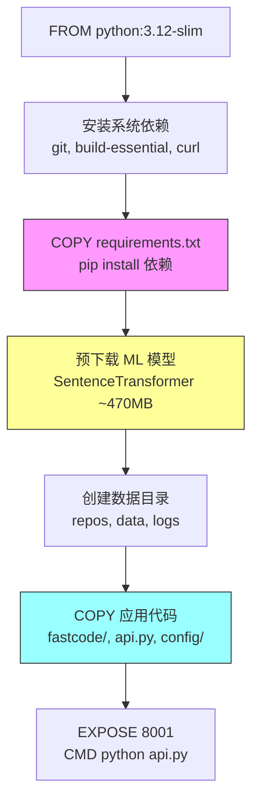
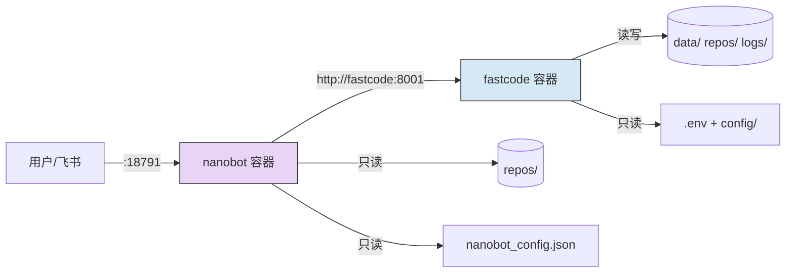
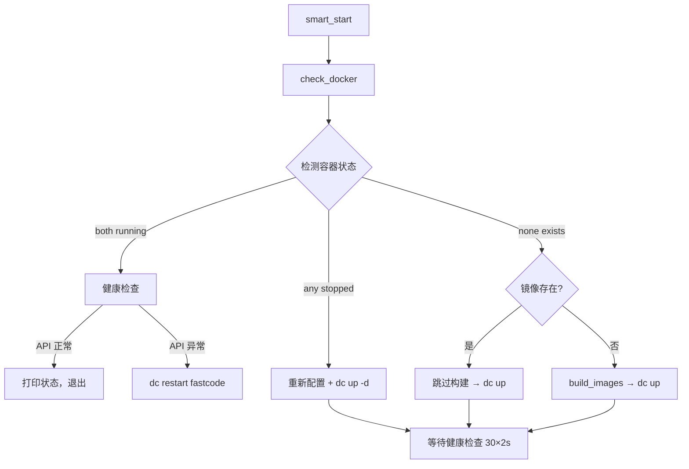
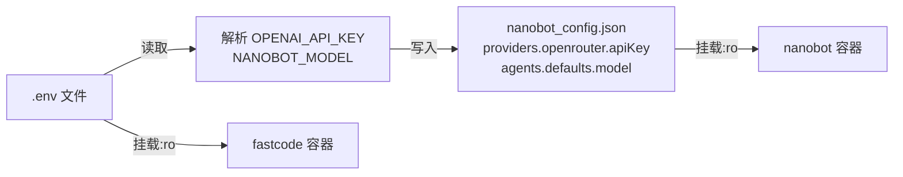

# PD-138.01 FastCode — 双服务容器化部署与智能启动脚本

> 文档编号：PD-138.01
> 来源：FastCode `Dockerfile` `docker-compose.yml` `run_nanobot.sh`
> GitHub：https://github.com/HKUDS/FastCode.git
> 问题域：PD-138 容器化部署 Container Deployment
> 状态：可复用方案

---

## 第 1 章 问题与动机

### 1.1 核心问题

AI 应用通常由多个异构服务组成——核心推理引擎、网关/代理层、消息通道桥接等。这些服务有不同的运行时依赖（Python ML 库 vs Node.js 桥接）、不同的启动顺序要求（API 先就绪，网关再连接）、以及共享配置（API Key、模型名称）的同步问题。手动管理这些服务的构建、配置、启动、健康检查和重启是脆弱且易出错的。

容器化部署需要解决：
1. **异构运行时隔离** — Python 3.12 + ML 模型 vs Python + Node.js 混合环境
2. **服务间安全通信** — 内部 API 调用不暴露到公网
3. **配置统一管理** — 多服务共享 API Key 但各有独立配置
4. **智能生命周期管理** — 自动检测状态、按需构建、健康检查、故障恢复
5. **大体积镜像优化** — ML 模型（~470MB）的 Docker 层缓存策略

### 1.2 FastCode 的解法概述

FastCode 采用 Dockerfile + docker-compose.yml 双服务架构，配合 `run_nanobot.sh` 智能启动脚本实现完整的容器化部署方案：

1. **分层构建优化** — Dockerfile 将依赖安装、模型下载、代码复制分为独立层，模型变更不触发代码重建（`Dockerfile:16-21`）
2. **Compose 内部网络** — Nanobot 通过 `http://fastcode:8001` 服务名直接访问 FastCode API，无需公网暴露（`docker-compose.yml:53`）
3. **智能启动脚本** — `run_nanobot.sh` 实现 3 态检测（running/stopped/none），自动决定跳过/重启/全新构建（`run_nanobot.sh:373-446`）
4. **配置注入链** — `.env` → `docker-compose.yml` 环境变量 → `nanobot_config.json` 自动同步，单一配置源（`run_nanobot.sh:265-320`）
5. **卷挂载策略** — 配置文件只读挂载（`:ro`），数据目录可写挂载，命名卷持久化会话数据（`docker-compose.yml:19-24,40-49`）

### 1.3 设计思想

| 设计原则 | 具体实现 | 理由 | 替代方案 |
|----------|----------|------|----------|
| 分层缓存 | 先 COPY requirements.txt 再 COPY 代码 | 代码变更不重建依赖层，节省 5-10 分钟 | 全量 COPY 后安装（每次重建） |
| 模型预下载 | RUN python -c "SentenceTransformer(...)" 独立层 | 470MB 模型层独立缓存，代码变更不重下载 | 运行时下载（首次启动慢） |
| 服务名通信 | FASTCODE_API_URL=http://fastcode:8001 | Compose 内部 DNS 解析，零配置服务发现 | 硬编码 IP / 外部服务发现 |
| 单一配置源 | .env 文件 + 启动脚本自动同步 | 避免多处配置不一致 | 每个服务独立配置文件 |
| 状态自适应 | 3 态检测 + 5 种操作路径 | 一个命令覆盖所有场景，降低运维心智负担 | 手动判断 + 多个命令 |

---

## 第 2 章 源码实现分析

### 2.1 架构概览

FastCode 的容器化部署由三个核心文件协作：

```
┌─────────────────────────────────────────────────────────┐
│                   run_nanobot.sh                         │
│  (智能启动脚本 — 状态检测/配置同步/构建/启动/健康检查)    │
└──────────────┬──────────────────────┬────────────────────┘
               │ docker compose up    │ 配置同步
               ▼                      ▼
┌──────────────────────┐   ┌──────────────────────────────┐
│  docker-compose.yml  │   │  .env (单一配置源)            │
│  ┌────────────────┐  │   │  OPENAI_API_KEY=...          │
│  │ fastcode       │  │   │  MODEL=...                   │
│  │ (Python 3.12)  │  │   │  NANOBOT_MODEL=...           │
│  │ port: 8001     │  │   └──────────────────────────────┘
│  └───────┬────────┘  │
│          │ http://    │   ┌──────────────────────────────┐
│          │ fastcode:  │   │  nanobot_config.json         │
│          │ 8001       │   │  (飞书凭据 + systemPrompt)   │
│  ┌───────▼────────┐  │   │  ← 启动脚本自动同步 API Key  │
│  │ nanobot        │──┼──→│                              │
│  │ (Python+Node)  │  │   └──────────────────────────────┘
│  │ port: 18791    │  │
│  └────────────────┘  │
│                      │
│  volumes:            │
│  ├─ .env:ro          │
│  ├─ config/:ro       │
│  ├─ data/ (rw)       │
│  ├─ repos/ (shared)  │
│  └─ named volumes    │
└──────────────────────┘
```

### 2.2 核心实现

#### 2.2.1 Dockerfile 分层构建策略



对应源码 `Dockerfile:1-38`：

```dockerfile
FROM python:3.12-slim-bookworm

# Install system dependencies for tree-sitter and git
RUN apt-get update && \
    apt-get install -y --no-install-recommends \
        git build-essential curl ca-certificates && \
    apt-get autoremove -y && \
    rm -rf /var/lib/apt/lists/*

WORKDIR /app

# Copy requirements first for better Docker layer caching
COPY requirements.txt ./
RUN pip install --no-cache-dir --retries 5 --timeout 60 -r requirements.txt

# Pre-download the embedding model BEFORE copying app code
# so that code changes don't invalidate this ~470MB cached layer
RUN python -c "from sentence_transformers import SentenceTransformer; \
    SentenceTransformer('sentence-transformers/paraphrase-multilingual-MiniLM-L12-v2')"

# Create necessary directories
RUN mkdir -p /app/repos /app/data /app/logs

# Copy application code (changes here won't re-download the model)
COPY fastcode/ fastcode/
COPY api.py ./
COPY config/ config/

EXPOSE 8001
ENV PYTHONUNBUFFERED=1
ENV TOKENIZERS_PARALLELISM=false
CMD ["python", "api.py", "--host", "0.0.0.0", "--port", "8001"]
```

关键设计：三层缓存隔离——依赖层（requirements.txt 变更才重建）→ 模型层（模型名变更才重建）→ 代码层（每次构建）。这使得日常开发迭代只需重建最后一层（秒级），而非重新下载 470MB 模型。

#### 2.2.2 Docker Compose 双服务编排



对应源码 `docker-compose.yml:10-60`：

```yaml
services:
  fastcode:
    build:
      context: .
      dockerfile: Dockerfile
    container_name: fastcode
    ports:
      - "8001:8001"
    volumes:
      - ./.env:/app/.env:ro          # 配置只读
      - ./config:/app/config:ro       # 配置只读
      - ./data:/app/data              # 数据可写
      - ./repos:/app/repos            # 仓库可写
      - ./logs:/app/logs              # 日志可写
    environment:
      - PYTHONUNBUFFERED=1
      - TOKENIZERS_PARALLELISM=false
    restart: unless-stopped

  nanobot:
    build:
      context: ./nanobot
      dockerfile: Dockerfile
    container_name: fastcode-nanobot
    command: ["gateway"]
    ports:
      - "18791:18790"                 # 端口映射
    volumes:
      - ./nanobot_config.json:/root/.nanobot/config.json:ro
      - nanobot-workspace:/root/.nanobot/workspace   # 命名卷
      - nanobot-sessions:/root/.nanobot/sessions     # 命名卷
      - ./repos:/app/repos:ro         # 共享仓库只读
    environment:
      - NANOBOT_ENV=docker
      - FASTCODE_API_URL=http://fastcode:8001  # 内部服务名通信
    depends_on:
      - fastcode
    restart: unless-stopped

volumes:
  nanobot-workspace:
  nanobot-sessions:
```

关键设计点：
- `depends_on: fastcode` 确保 API 容器先启动
- `FASTCODE_API_URL=http://fastcode:8001` 利用 Compose 内部 DNS，Nanobot 通过服务名访问 FastCode
- `repos/` 目录双向共享：FastCode 可写（clone 仓库），Nanobot 只读（访问代码）
- 命名卷 `nanobot-workspace` / `nanobot-sessions` 持久化会话数据，`docker compose down` 不丢失

#### 2.2.3 Nanobot 通过内部网络调用 FastCode API

对应源码 `nanobot/nanobot/agent/tools/fastcode.py:20-23`：

```python
def _get_fastcode_url() -> str:
    """Get FastCode API base URL from environment."""
    return os.environ.get("FASTCODE_API_URL", "http://fastcode:8001")
```

Nanobot 的 5 个 Tool（LoadRepo、Query、ListRepos、Status、Session）全部通过 `httpx.AsyncClient` 调用 FastCode REST API（`fastcode.py:72-105`），超时设置按操作类型分级：加载仓库 1800s、查询 600s、状态检查 15s。

### 2.3 实现细节

#### 智能启动脚本的 3 态状态机

`run_nanobot.sh` 的核心是 `smart_start()` 函数（`run_nanobot.sh:373-446`），实现了一个 3 态状态检测 + 5 种操作路径的自适应启动逻辑：



状态检测函数 `get_container_state()`（`run_nanobot.sh:54-71`）：

```bash
get_container_state() {
    local service_name="$1"
    local container_id
    container_id=$(dc ps -q "$service_name" 2>/dev/null)

    if [ -z "$container_id" ]; then
        echo "none"
        return
    fi

    local state
    state=$(docker inspect -f '{{.State.Status}}' "$container_id" 2>/dev/null || echo "none")
    if [ "$state" = "running" ]; then
        echo "running"
    else
        echo "stopped"
    fi
}
```

#### 配置同步链

`sync_env_to_nanobot_config()`（`run_nanobot.sh:265-320`）实现 `.env` → `nanobot_config.json` 的单向同步：



这确保了 API Key 只在 `.env` 中配置一次，启动脚本自动同步到 Nanobot 配置，避免多处维护。

---

## 第 3 章 迁移指南

### 3.1 迁移清单

#### 阶段 1：基础容器化（最小可用）

- [ ] 编写 Dockerfile，遵循分层缓存原则（依赖 → 模型/资产 → 代码）
- [ ] 编写 docker-compose.yml，定义服务、端口、卷挂载
- [ ] 创建 `.env` 文件作为统一配置源
- [ ] 配置 `restart: unless-stopped` 自动重启策略

#### 阶段 2：服务间通信

- [ ] 使用 Compose 服务名替代 IP 地址进行内部通信
- [ ] 通过环境变量注入内部 API URL（如 `SERVICE_API_URL=http://service-name:port`）
- [ ] 配置 `depends_on` 确保启动顺序
- [ ] 实现 `/health` 端点供健康检查使用

#### 阶段 3：智能启动脚本

- [ ] 实现容器状态检测（running/stopped/none 三态）
- [ ] 实现镜像存在性检查，按需构建
- [ ] 实现健康检查轮询（启动后等待 API 就绪）
- [ ] 实现配置自动同步（从 `.env` 同步到各服务配置）

#### 阶段 4：生产加固

- [ ] 配置文件只读挂载（`:ro`）
- [ ] 使用命名卷持久化会话/工作空间数据
- [ ] 实现 `clean` 命令清理容器和镜像（保留数据目录）
- [ ] 添加 `--build` 强制重建和 `--fg` 前台运行选项

### 3.2 适配代码模板

#### 模板 1：分层缓存 Dockerfile（适用于 ML 应用）

```dockerfile
FROM python:3.12-slim-bookworm

# 系统依赖层（很少变更）
RUN apt-get update && \
    apt-get install -y --no-install-recommends git build-essential curl && \
    rm -rf /var/lib/apt/lists/*

WORKDIR /app

# 依赖层（requirements.txt 变更才重建）
COPY requirements.txt ./
RUN pip install --no-cache-dir -r requirements.txt

# 模型预下载层（模型名变更才重建，体积大，独立缓存）
# 根据实际使用的模型替换
RUN python -c "from sentence_transformers import SentenceTransformer; \
    SentenceTransformer('your-model-name')"

# 数据目录层
RUN mkdir -p /app/data /app/logs

# 代码层（每次构建，但很快）
COPY your_app/ your_app/
COPY main.py ./

EXPOSE 8000
ENV PYTHONUNBUFFERED=1
CMD ["python", "main.py", "--host", "0.0.0.0", "--port", "8000"]
```

#### 模板 2：双服务 docker-compose.yml

```yaml
services:
  api:
    build:
      context: .
      dockerfile: Dockerfile
    container_name: myapp-api
    ports:
      - "${API_PORT:-8000}:8000"
    volumes:
      - ./.env:/app/.env:ro
      - ./config:/app/config:ro
      - ./data:/app/data
      - ./logs:/app/logs
    environment:
      - PYTHONUNBUFFERED=1
    restart: unless-stopped

  gateway:
    build:
      context: ./gateway
      dockerfile: Dockerfile
    container_name: myapp-gateway
    ports:
      - "${GATEWAY_PORT:-9000}:9000"
    volumes:
      - ./gateway_config.json:/app/config.json:ro
      - gateway-data:/app/data
    environment:
      - API_URL=http://api:8000    # 内部服务名通信
    depends_on:
      - api
    restart: unless-stopped

volumes:
  gateway-data:
```

#### 模板 3：智能启动脚本核心逻辑

```bash
#!/bin/bash
set -e

COMPOSE_FILE="$(dirname "$0")/docker-compose.yml"
dc() { docker compose -f "$COMPOSE_FILE" "$@"; }

# 3 态状态检测
get_state() {
    local cid=$(dc ps -q "$1" 2>/dev/null)
    [ -z "$cid" ] && echo "none" && return
    local s=$(docker inspect -f '{{.State.Status}}' "$cid" 2>/dev/null || echo "none")
    [ "$s" = "running" ] && echo "running" || echo "stopped"
}

# 健康检查轮询
wait_healthy() {
    local url="$1" max_attempts="${2:-30}"
    for i in $(seq 1 "$max_attempts"); do
        curl -sf "$url" > /dev/null 2>&1 && return 0
        sleep 2
    done
    return 1
}

# 智能启动
smart_start() {
    local api_state=$(get_state "api")
    local gw_state=$(get_state "gateway")

    if [ "$api_state" = "running" ] && [ "$gw_state" = "running" ]; then
        echo "Services already running"
        wait_healthy "http://localhost:8000/health" 5 || dc restart api
        return 0
    fi

    if [ "$api_state" = "stopped" ] || [ "$gw_state" = "stopped" ]; then
        echo "Restarting stopped services..."
        dc up -d
    else
        echo "Starting fresh..."
        dc up -d --build
    fi

    wait_healthy "http://localhost:8000/health" 30 && echo "Ready!" || echo "Still starting..."
}

case "${1:-start}" in
    start)   smart_start ;;
    stop)    dc down ;;
    restart) dc down && smart_start ;;
    logs)    dc logs -f ;;
    status)  dc ps ;;
    clean)   dc down --rmi local -v ;;
    *)       echo "Usage: $0 {start|stop|restart|logs|status|clean}" ;;
esac
```

### 3.3 适用场景

| 场景 | 适用度 | 说明 |
|------|--------|------|
| ML API + 网关/代理双服务 | ⭐⭐⭐ | 完全匹配 FastCode 架构，直接复用 |
| 多服务 AI 应用（3+ 服务） | ⭐⭐⭐ | Compose 编排 + 智能脚本模式可扩展 |
| 单服务容器化 | ⭐⭐ | Dockerfile 分层策略有价值，启动脚本过重 |
| Kubernetes 部署 | ⭐ | 需改写为 K8s manifests，但分层构建和健康检查思路通用 |
| 开发环境快速搭建 | ⭐⭐⭐ | 智能启动脚本的自适应检测非常适合开发者体验 |

---

## 第 4 章 测试用例

```python
"""
PD-138 FastCode 容器化部署测试用例
测试智能启动脚本的状态检测、配置同步、健康检查逻辑
"""
import json
import os
import subprocess
import tempfile
import time
from pathlib import Path
from unittest.mock import patch, MagicMock

import pytest


class TestContainerStateDetection:
    """测试容器状态检测逻辑（run_nanobot.sh:54-71 的 Python 等价实现）"""

    def get_container_state(self, service_name: str, compose_file: str) -> str:
        """Python 等价实现 get_container_state()"""
        try:
            result = subprocess.run(
                ["docker", "compose", "-f", compose_file, "ps", "-q", service_name],
                capture_output=True, text=True, timeout=10
            )
            container_id = result.stdout.strip()
            if not container_id:
                return "none"

            result = subprocess.run(
                ["docker", "inspect", "-f", "{{.State.Status}}", container_id],
                capture_output=True, text=True, timeout=10
            )
            state = result.stdout.strip()
            return "running" if state == "running" else "stopped"
        except (subprocess.TimeoutExpired, FileNotFoundError):
            return "none"

    def test_state_returns_none_when_no_container(self, tmp_path):
        """无容器时返回 none"""
        compose = tmp_path / "docker-compose.yml"
        compose.write_text("services:\n  test:\n    image: alpine\n")
        assert self.get_container_state("nonexistent", str(compose)) == "none"

    def test_state_enum_values(self):
        """状态值只能是 running/stopped/none 三种"""
        valid_states = {"running", "stopped", "none"}
        # 模拟各种 docker inspect 返回值
        for raw in ["running", "exited", "created", "paused", "dead", ""]:
            state = "running" if raw == "running" else ("none" if not raw else "stopped")
            assert state in valid_states


class TestConfigSync:
    """测试 .env → nanobot_config.json 配置同步逻辑"""

    def sync_env_to_config(self, env_path: str, config_path: str) -> bool:
        """Python 等价实现 sync_env_to_nanobot_config()"""
        env_vars = {}
        with open(env_path) as f:
            for line in f:
                line = line.strip()
                if line and not line.startswith('#') and '=' in line:
                    key, _, value = line.partition('=')
                    env_vars[key.strip()] = value.strip()

        api_key = env_vars.get('OPENAI_API_KEY', '')
        nanobot_model = env_vars.get('NANOBOT_MODEL', '')
        if not api_key:
            return False

        with open(config_path) as f:
            config = json.load(f)

        changed = False
        providers = config.setdefault('providers', {})
        openrouter = providers.setdefault('openrouter', {})
        if openrouter.get('apiKey') != api_key:
            openrouter['apiKey'] = api_key
            changed = True

        if nanobot_model:
            agents = config.setdefault('agents', {})
            defaults = agents.setdefault('defaults', {})
            if defaults.get('model') != nanobot_model:
                defaults['model'] = nanobot_model
                changed = True

        if changed:
            with open(config_path, 'w') as f:
                json.dump(config, f, indent=2)
        return changed

    def test_sync_api_key(self, tmp_path):
        """API Key 从 .env 同步到 config"""
        env_file = tmp_path / ".env"
        env_file.write_text("OPENAI_API_KEY=sk-test-123\nNANOBOT_MODEL=gpt-4\n")
        config_file = tmp_path / "config.json"
        config_file.write_text('{"providers": {}, "agents": {"defaults": {}}}')

        changed = self.sync_env_to_config(str(env_file), str(config_file))
        assert changed is True

        config = json.loads(config_file.read_text())
        assert config["providers"]["openrouter"]["apiKey"] == "sk-test-123"
        assert config["agents"]["defaults"]["model"] == "gpt-4"

    def test_no_sync_when_no_key(self, tmp_path):
        """无 API Key 时不同步"""
        env_file = tmp_path / ".env"
        env_file.write_text("# empty\n")
        config_file = tmp_path / "config.json"
        config_file.write_text('{}')

        changed = self.sync_env_to_config(str(env_file), str(config_file))
        assert changed is False

    def test_idempotent_sync(self, tmp_path):
        """重复同步不产生变更"""
        env_file = tmp_path / ".env"
        env_file.write_text("OPENAI_API_KEY=sk-test\n")
        config_file = tmp_path / "config.json"
        config_file.write_text('{"providers": {"openrouter": {"apiKey": "sk-test"}}}')

        changed = self.sync_env_to_config(str(env_file), str(config_file))
        assert changed is False


class TestHealthCheck:
    """测试健康检查端点逻辑（api.py:152-168）"""

    def test_health_initializing_state(self):
        """未初始化时返回 initializing"""
        # 模拟 fastcode_instance = None 的情况
        response = {
            "status": "initializing",
            "message": "FastCode system will initialize on first use",
            "repo_loaded": False,
            "repo_indexed": False,
        }
        assert response["status"] == "initializing"
        assert response["repo_loaded"] is False

    def test_health_ready_state(self):
        """已初始化时返回 healthy"""
        response = {
            "status": "healthy",
            "repo_loaded": True,
            "repo_indexed": True,
            "multi_repo_mode": False,
        }
        assert response["status"] == "healthy"
        assert response["repo_loaded"] is True


class TestVolumeStrategy:
    """测试卷挂载策略的正确性"""

    def test_readonly_config_volumes(self):
        """配置文件应为只读挂载"""
        compose_content = Path("docker-compose.yml").read_text() if Path("docker-compose.yml").exists() else ""
        readonly_mounts = [".env:/app/.env:ro", "config:/app/config:ro", "nanobot_config.json:/root/.nanobot/config.json:ro"]
        # 验证只读挂载模式
        for mount in readonly_mounts:
            assert mount.endswith(":ro"), f"Config mount should be readonly: {mount}"

    def test_data_volumes_writable(self):
        """数据目录应为可写挂载"""
        writable_mounts = ["./data:/app/data", "./repos:/app/repos", "./logs:/app/logs"]
        for mount in writable_mounts:
            assert ":ro" not in mount, f"Data mount should be writable: {mount}"
```

---

## 第 5 章 跨域关联

| 关联域 | 关系类型 | 说明 |
|--------|----------|------|
| PD-04 工具系统 | 协同 | Nanobot 的 5 个 FastCode Tool 通过容器内部网络调用 API，工具注册依赖 `FASTCODE_API_URL` 环境变量 |
| PD-05 沙箱隔离 | 协同 | Docker 容器本身提供进程级隔离，FastCode 的代码解析在独立容器内执行，不影响宿主机 |
| PD-06 记忆持久化 | 依赖 | 命名卷 `nanobot-sessions` 和 `nanobot-workspace` 确保对话历史在容器重启后不丢失 |
| PD-09 Human-in-the-Loop | 协同 | 飞书 → Nanobot → FastCode 的消息链路依赖容器间网络通信，`run_nanobot.sh` 自动配置飞书凭据 |
| PD-11 可观测性 | 协同 | `./logs` 卷挂载使容器内日志可在宿主机直接查看，`dc logs -f` 提供实时日志聚合 |
| PD-139 配置驱动架构 | 强依赖 | `.env` 单一配置源 + `config.yaml` + `nanobot_config.json` 的三层配置体系是容器化部署的基础 |

---

## 第 6 章 来源文件索引

| 文件 | 行范围 | 关键实现 |
|------|--------|----------|
| `Dockerfile` | L1-L38 | FastCode API 容器镜像，三层缓存构建策略 |
| `nanobot/Dockerfile` | L1-L41 | Nanobot 网关容器镜像，Python + Node.js 混合运行时 |
| `docker-compose.yml` | L1-L61 | 双服务编排，内部网络通信，卷挂载策略 |
| `run_nanobot.sh` | L1-L619 | 智能启动脚本全部逻辑 |
| `run_nanobot.sh` | L54-L71 | `get_container_state()` 3 态状态检测 |
| `run_nanobot.sh` | L265-L320 | `sync_env_to_nanobot_config()` 配置同步 |
| `run_nanobot.sh` | L373-L446 | `smart_start()` 自适应启动核心逻辑 |
| `run_nanobot.sh` | L335-L351 | `start_and_wait()` 健康检查轮询 |
| `api.py` | L152-L168 | `/health` 健康检查端点（懒初始化感知） |
| `nanobot/nanobot/agent/tools/fastcode.py` | L20-L23 | `_get_fastcode_url()` 内部服务名解析 |
| `nanobot/nanobot/agent/tools/fastcode.py` | L65-L105 | `FastCodeLoadRepoTool.execute()` 跨容器 HTTP 调用 |
| `config/config.yaml` | L1-L207 | FastCode 完整配置（嵌入模型、向量存储、检索策略等） |

---

## 第 7 章 横向对比维度

> **重要：** 本章用于自动填充 Butcher Wiki 的横向对比表。

```json comparison_data
{
  "project": "FastCode",
  "dimensions": {
    "容器编排方式": "docker-compose 双服务编排，depends_on 控制启动顺序",
    "镜像构建策略": "三层缓存隔离：依赖层→ML模型预下载层→代码层",
    "服务间通信": "Compose 内部 DNS 服务名解析，http://fastcode:8001",
    "配置管理": ".env 单一配置源 + 启动脚本自动同步到各服务配置",
    "生命周期管理": "智能启动脚本 3 态检测（running/stopped/none）自适应操作",
    "健康检查": "启动后轮询 /health 端点，30×2s 超时，异常自动 restart",
    "卷挂载策略": "配置:ro只读 + 数据可写 + 命名卷持久化会话",
    "混合运行时": "FastCode(Python3.12+ML) + Nanobot(Python+Node.js) 异构容器"
  }
}
```

### 域元数据补充

```json domain_metadata
{
  "solution_summary": "FastCode 用 Dockerfile 三层缓存(依赖/ML模型/代码) + docker-compose 内部 DNS 通信 + run_nanobot.sh 3态智能启动脚本实现双服务容器化部署",
  "description": "异构运行时容器隔离与 ML 模型镜像层缓存优化",
  "sub_problems": [
    "ML 模型大文件的 Docker 层缓存优化",
    "异构运行时容器构建（Python+Node.js 混合）",
    "配置单一源同步（.env → 多服务配置文件）",
    "健康检查与自动故障恢复"
  ],
  "best_practices": [
    "将 ML 模型预下载作为独立 Docker 层，代码变更不触发模型重下载",
    "用 3 态状态检测（running/stopped/none）实现一键自适应启动脚本",
    "配置文件只读挂载(:ro)、数据目录可写挂载、命名卷持久化会话数据"
  ]
}
```
