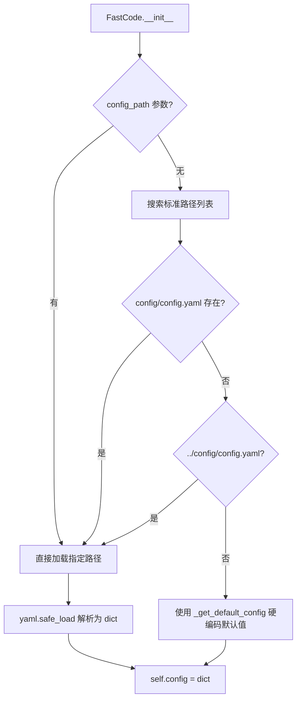
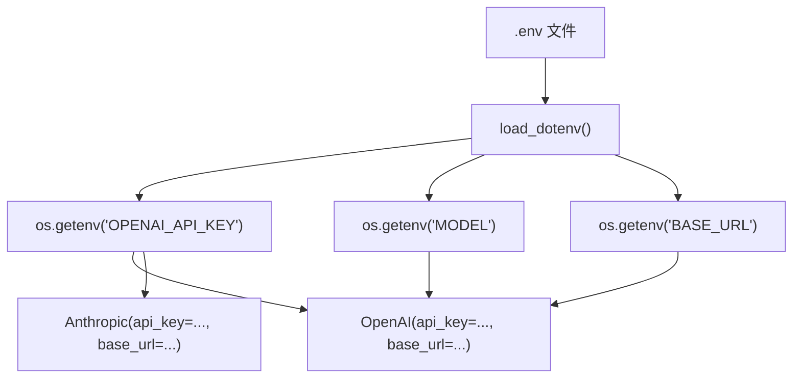
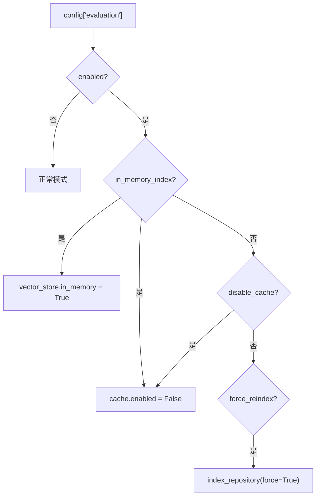

# PD-139.01 FastCode — YAML 集中配置 + .env 密钥注入 + 评估模式切换

> 文档编号：PD-139.01
> 来源：FastCode `config/config.yaml` `fastcode/utils.py` `fastcode/main.py`
> GitHub：https://github.com/HKUDS/FastCode.git
> 问题域：PD-139 配置驱动架构 Configuration-Driven Architecture
> 状态：可复用方案

---

## 第 1 章 问题与动机

### 1.1 核心问题

Agent 系统通常包含多个子系统（embedding、indexing、retrieval、generation、cache、graph、logging），每个子系统有大量可调参数。如果参数散落在各模块代码中，会导致：

1. **参数不可见** — 修改一个阈值需要翻遍多个源文件
2. **环境切换困难** — 开发/评估/生产环境需要不同参数组合，硬编码无法快速切换
3. **密钥泄露风险** — API Key 写在配置文件中容易被提交到版本控制
4. **组件耦合** — 各组件自行读取参数，缺乏统一的配置入口

FastCode 面对的是一个典型的 RAG 代码理解系统，涉及 9 个子系统（repository、parser、embedding、indexing、vector_store、retrieval、query、generation、agent），外加 cache、evaluation、logging 三个横切关注点。参数总量超过 80 个。

### 1.2 FastCode 的解法概述

FastCode 采用三层配置架构：

1. **YAML 集中配置** — `config/config.yaml` 管理全部 9 个子系统 + 3 个横切关注点的参数（`config/config.yaml:1-207`）
2. **环境变量注入** — `.env` 文件通过 `python-dotenv` 注入 API 密钥和模型标识，不进入 YAML（`fastcode/answer_generator.py:44-50`）
3. **评估模式覆盖** — `evaluation` 配置节可在运行时覆盖 cache/persistence/indexing 行为（`fastcode/main.py:57-69`）
4. **硬编码兜底** — `_get_default_config()` 提供完整默认值，即使 YAML 文件缺失也能启动（`fastcode/main.py:833-888`）
5. **CLI 参数覆盖** — Click CLI 的 `--config` 选项允许指定替代配置文件路径（`main.py:36`）

### 1.3 设计思想

| 设计原则 | 具体实现 | 理由 | 替代方案 |
|----------|----------|------|----------|
| 关注点分离 | YAML 管非敏感参数，.env 管密钥 | 防止密钥进入版本控制 | Vault/KMS（更重但更安全） |
| 约定优于配置 | 多路径自动搜索 config.yaml | 零配置即可启动 | 强制指定路径（更显式但不便） |
| 运行时可覆盖 | evaluation 节覆盖 cache/persistence | 评估场景需要隔离副作用 | 独立配置文件（更清晰但冗余） |
| 渐进式降级 | 硬编码默认值兜底 | 缺少配置文件时仍可运行 | 启动时报错退出（更严格） |
| 扁平化消费 | 各组件 `config.get("section", {})` | 简单直接，无需学习配置框架 | Pydantic BaseSettings（类型安全但重） |

---

## 第 2 章 源码实现分析

### 2.1 架构概览

FastCode 的配置流转路径：

```
┌─────────────────┐     ┌──────────────────┐     ┌─────────────────────┐
│  config.yaml    │────→│  load_config()   │────→│  FastCode.__init__  │
│  (9 子系统参数)  │     │  yaml.safe_load  │     │  (统一 config dict) │
└─────────────────┘     └──────────────────┘     └────────┬────────────┘
                                                          │
┌─────────────────┐     ┌──────────────────┐              │ config.get("section")
│  .env 文件      │────→│  load_dotenv()   │──→ 各组件 ←──┘
│  (API Key/Model)│     │  os.getenv()     │   __init__
└─────────────────┘     └──────────────────┘
                                                          │
┌─────────────────┐                                       ▼
│  evaluation:    │──→ 运行时覆盖 cache.enabled / vector_store.in_memory
│  enabled: true  │
└─────────────────┘
```

关键设计：YAML 配置和 .env 环境变量在不同层面注入——YAML 通过 `load_config()` 一次性加载为 dict，.env 通过 `load_dotenv()` 在各组件构造函数中按需读取。两者不合并，各走各的通道。

### 2.2 核心实现

#### 2.2.1 YAML 配置加载与多路径搜索



对应源码 `fastcode/utils.py:42-45` + `fastcode/main.py:31-55`：

```python
# fastcode/utils.py:42-45 — 配置加载函数
def load_config(config_path: str = "config/config.yaml") -> Dict[str, Any]:
    """Load configuration from YAML file"""
    with open(config_path, 'r') as f:
        return yaml.safe_load(f)

# fastcode/main.py:31-55 — 多路径搜索 + 兜底
class FastCode:
    def __init__(self, config_path: Optional[str] = None):
        if config_path is None:
            possible_paths = [
                "config/config.yaml",
                "../config/config.yaml",
                os.path.join(os.path.dirname(__file__), "../config/config.yaml"),
            ]
            for path in possible_paths:
                if os.path.exists(path):
                    config_path = path
                    break

        if config_path and os.path.exists(config_path):
            self.config = load_config(config_path)
        else:
            self.config = self._get_default_config()
```

#### 2.2.2 环境变量注入（密钥隔离）



对应源码 `fastcode/answer_generator.py:21-51`：

```python
class AnswerGenerator:
    def __init__(self, config: Dict[str, Any]):
        self.config = config
        self.gen_config = config.get("generation", {})
        # YAML 参数：温度、token 限制等非敏感参数
        self.provider = self.gen_config.get("provider", "openai")
        self.temperature = self.gen_config.get("temperature", 0.4)
        self.max_tokens = self.gen_config.get("max_tokens", 20000)

        # .env 参数：API 密钥和模型标识
        load_dotenv()
        self.api_key = os.getenv("OPENAI_API_KEY")
        self.anthropic_api_key = os.getenv("ANTHROPIC_API_KEY")
        self.base_url = os.getenv("BASE_URL")
        self.model = os.getenv("MODEL")
        self.client = self._initialize_client()
```

同样的模式在 `fastcode/iterative_agent.py:46-73` 中重复出现——`agent.iterative` 子节的阈值参数从 YAML 读取，LLM 密钥从 .env 读取。

#### 2.2.3 评估模式运行时覆盖



对应源码 `fastcode/main.py:57-69`：

```python
# Evaluation-specific overrides (keep core system decoupled)
self.eval_config = self.config.get("evaluation", {})
self.eval_mode = self.eval_config.get("enabled", False)
self.in_memory_index = self.eval_config.get("in_memory_index", False)

# Ensure in-memory mode disables disk-based caches/persistence
if self.in_memory_index:
    self.config.setdefault("vector_store", {})["in_memory"] = True
    self.config.setdefault("cache", {})["enabled"] = False

# Allow explicit cache disable via evaluation config
if self.eval_config.get("disable_cache", False):
    self.config.setdefault("cache", {})["enabled"] = False
```

VectorStore 消费端 `fastcode/vector_store.py:24-53`：

```python
class VectorStore:
    def __init__(self, config: Dict[str, Any]):
        # Evaluation mode can request a purely in-memory index
        self.in_memory = self.vector_config.get(
            "in_memory",
            config.get("evaluation", {}).get("in_memory_index", False),
        )
        if not self.in_memory:
            ensure_dir(self.persist_dir)
        else:
            self.logger.info("VectorStore running in in-memory mode; persistence disabled.")
```

### 2.3 实现细节

**配置消费模式统一**：所有 9 个组件使用相同的 `config.get("section", {})` 模式：

| 组件 | 配置节 | 文件 |
|------|--------|------|
| RepositoryLoader | `repository` | `fastcode/loader.py` |
| CodeParser | `parser` | `fastcode/parser.py` |
| CodeEmbedder | `embedding` | `fastcode/embedder.py` |
| VectorStore | `vector_store` | `fastcode/vector_store.py` |
| HybridRetriever | `retrieval` | `fastcode/retriever.py` |
| QueryProcessor | `query` | `fastcode/query_processor.py` |
| AnswerGenerator | `generation` | `fastcode/answer_generator.py` |
| CacheManager | `cache` | `fastcode/cache.py` |
| IterativeAgent | `agent.iterative` | `fastcode/iterative_agent.py` |

**动态配置修改**：`repo_root` 在加载仓库后被动态更新（`fastcode/main.py:134-136`）：

```python
if self.loader.repo_path:
    self.config["repo_root"] = self.loader.repo_path
```

**平台感知环境变量**：macOS 下自动设置线程限制（`main.py:9-13`）：

```python
if platform.system() == 'Darwin':
    os.environ['TOKENIZERS_PARALLELISM'] = 'false'
    os.environ['OMP_NUM_THREADS'] = '1'
```

**Nanobot 子项目对比**：FastCode 主系统用 dict + `.get()` 消费配置，而其 nanobot 子项目（`nanobot/nanobot/config/schema.py:185-249`）使用 Pydantic BaseSettings + 嵌套模型，支持 `NANOBOT_` 前缀环境变量和 `__` 嵌套分隔符。同一项目内两种配置范式并存，体现了从简单 dict 到类型安全 Pydantic 的演进路径。

---

## 第 3 章 迁移指南

### 3.1 迁移清单

**阶段 1：基础配置层（1 个文件）**

- [ ] 创建 `config/config.yaml`，按子系统分节组织参数
- [ ] 实现 `load_config()` 函数（yaml.safe_load + 多路径搜索）
- [ ] 实现 `_get_default_config()` 硬编码兜底

**阶段 2：密钥隔离层（2 个文件）**

- [ ] 创建 `.env.example` 列出所有需要的环境变量
- [ ] 在 `.gitignore` 中添加 `.env`
- [ ] 各 LLM 组件中使用 `load_dotenv()` + `os.getenv()` 读取密钥

**阶段 3：模式切换层（可选）**

- [ ] 在 YAML 中添加 `evaluation` 配置节
- [ ] 在主类 `__init__` 中实现评估模式覆盖逻辑
- [ ] 确保覆盖发生在组件初始化之前

### 3.2 适配代码模板

```python
"""可直接复用的三层配置系统模板"""

import os
import yaml
from typing import Dict, Any, Optional
from dotenv import load_dotenv


# ── Layer 1: YAML 配置加载 ──────────────────────────────────

def load_config(config_path: str = "config/config.yaml") -> Dict[str, Any]:
    """加载 YAML 配置，支持多路径搜索 + 硬编码兜底"""
    if config_path and os.path.exists(config_path):
        with open(config_path, 'r') as f:
            return yaml.safe_load(f)

    # 多路径搜索
    for path in ["config/config.yaml", "../config/config.yaml"]:
        if os.path.exists(path):
            with open(path, 'r') as f:
                return yaml.safe_load(f)

    # 硬编码兜底
    return get_default_config()


def get_default_config() -> Dict[str, Any]:
    """所有参数的默认值，确保零配置可启动"""
    return {
        "embedding": {"model": "all-MiniLM-L6-v2", "device": "cpu"},
        "retrieval": {"max_results": 5, "min_similarity": 0.15},
        "generation": {"provider": "openai", "temperature": 0.4},
        "cache": {"enabled": True, "backend": "disk"},
        "evaluation": {"enabled": False, "in_memory_index": False,
                        "disable_cache": False, "force_reindex": False},
    }


# ── Layer 2: 环境变量密钥注入 ────────────────────────────────

class LLMClient:
    """演示 YAML 参数 + .env 密钥的分离消费"""

    def __init__(self, config: Dict[str, Any]):
        gen_config = config.get("generation", {})
        # 非敏感参数从 YAML
        self.provider = gen_config.get("provider", "openai")
        self.temperature = gen_config.get("temperature", 0.4)
        self.max_tokens = gen_config.get("max_tokens", 4096)

        # 敏感参数从 .env
        load_dotenv()
        self.api_key = os.getenv("OPENAI_API_KEY")
        self.base_url = os.getenv("BASE_URL")
        self.model = os.getenv("MODEL", "gpt-4")


# ── Layer 3: 评估模式覆盖 ────────────────────────────────────

class AppBootstrap:
    """演示评估模式在组件初始化前覆盖配置"""

    def __init__(self, config_path: Optional[str] = None):
        self.config = load_config(config_path)

        # 评估模式覆盖（必须在组件初始化之前）
        eval_cfg = self.config.get("evaluation", {})
        if eval_cfg.get("in_memory_index", False):
            self.config.setdefault("vector_store", {})["in_memory"] = True
            self.config.setdefault("cache", {})["enabled"] = False
        if eval_cfg.get("disable_cache", False):
            self.config.setdefault("cache", {})["enabled"] = False

        # 组件初始化（消费已覆盖的 config）
        self.llm = LLMClient(self.config)
        # self.cache = CacheManager(self.config)
        # self.vector_store = VectorStore(self.config)
```

### 3.3 适用场景

| 场景 | 适用度 | 说明 |
|------|--------|------|
| 中小型 Agent/RAG 系统 | ⭐⭐⭐ | 参数量 50-200，dict 消费足够 |
| 需要评估/基准测试的系统 | ⭐⭐⭐ | evaluation 模式切换非常实用 |
| 多 LLM 提供商切换 | ⭐⭐⭐ | .env 切换 MODEL/BASE_URL 即可 |
| 大型微服务架构 | ⭐ | 建议用 Pydantic BaseSettings + 配置中心 |
| 需要热更新配置的系统 | ⭐ | YAML 启动时加载，不支持热更新 |

---

## 第 4 章 测试用例

```python
"""基于 FastCode 真实函数签名的测试用例"""

import os
import pytest
import tempfile
import yaml
from unittest.mock import patch


# ── 测试 load_config ──────────────────────────────────────

class TestLoadConfig:
    def test_load_valid_yaml(self, tmp_path):
        """正常加载 YAML 配置"""
        config_file = tmp_path / "config.yaml"
        config_file.write_text(yaml.dump({
            "embedding": {"model": "test-model", "device": "cpu"},
            "cache": {"enabled": True},
        }))
        from fastcode.utils import load_config
        config = load_config(str(config_file))
        assert config["embedding"]["model"] == "test-model"
        assert config["cache"]["enabled"] is True

    def test_default_config_fallback(self):
        """配置文件不存在时使用默认值"""
        from fastcode.main import FastCode
        fc = FastCode(config_path="/nonexistent/path.yaml")
        assert "embedding" in fc.config
        assert "cache" in fc.config
        assert fc.config["cache"]["enabled"] is True

    def test_empty_yaml_returns_none(self, tmp_path):
        """空 YAML 文件返回 None"""
        config_file = tmp_path / "empty.yaml"
        config_file.write_text("")
        from fastcode.utils import load_config
        config = load_config(str(config_file))
        assert config is None


# ── 测试评估模式覆盖 ──────────────────────────────────────

class TestEvaluationModeOverride:
    def test_in_memory_disables_cache(self):
        """in_memory_index=True 应禁用缓存"""
        config = {
            "evaluation": {"enabled": True, "in_memory_index": True},
            "cache": {"enabled": True},
            "vector_store": {"persist_directory": "./data"},
        }
        eval_cfg = config.get("evaluation", {})
        if eval_cfg.get("in_memory_index", False):
            config.setdefault("vector_store", {})["in_memory"] = True
            config.setdefault("cache", {})["enabled"] = False

        assert config["cache"]["enabled"] is False
        assert config["vector_store"]["in_memory"] is True

    def test_disable_cache_explicit(self):
        """disable_cache=True 单独禁用缓存"""
        config = {
            "evaluation": {"enabled": True, "disable_cache": True},
            "cache": {"enabled": True},
        }
        eval_cfg = config.get("evaluation", {})
        if eval_cfg.get("disable_cache", False):
            config.setdefault("cache", {})["enabled"] = False

        assert config["cache"]["enabled"] is False

    def test_normal_mode_preserves_cache(self):
        """evaluation.enabled=False 不影响缓存"""
        config = {
            "evaluation": {"enabled": False},
            "cache": {"enabled": True},
        }
        eval_cfg = config.get("evaluation", {})
        if eval_cfg.get("in_memory_index", False):
            config.setdefault("cache", {})["enabled"] = False
        assert config["cache"]["enabled"] is True


# ── 测试环境变量注入 ──────────────────────────────────────

class TestEnvVarInjection:
    @patch.dict(os.environ, {"OPENAI_API_KEY": "sk-test", "MODEL": "gpt-4", "BASE_URL": "https://api.test.com"})
    def test_env_vars_override(self):
        """环境变量正确注入 LLM 客户端"""
        assert os.getenv("OPENAI_API_KEY") == "sk-test"
        assert os.getenv("MODEL") == "gpt-4"
        assert os.getenv("BASE_URL") == "https://api.test.com"

    @patch.dict(os.environ, {}, clear=True)
    def test_missing_env_vars(self):
        """缺少环境变量时返回 None"""
        assert os.getenv("OPENAI_API_KEY") is None
        assert os.getenv("MODEL") is None
```

---

## 第 5 章 跨域关联

| 关联域 | 关系类型 | 说明 |
|--------|----------|------|
| PD-04 工具系统 | 协同 | 工具注册方式可由配置驱动（FastCode 的 `agent.iterative` 配置节控制 Agent 工具行为） |
| PD-01 上下文管理 | 协同 | `generation.max_context_tokens` 和 `reserve_tokens_for_response` 直接控制上下文窗口策略 |
| PD-06 记忆持久化 | 协同 | `cache.dialogue_ttl` 控制对话历史持久化时长，`evaluation.disable_persistence` 可关闭持久化 |
| PD-11 可观测性 | 协同 | `logging` 配置节集中管理日志级别、格式、输出目标 |
| PD-08 搜索与检索 | 依赖 | `retrieval` 配置节的权重参数（semantic/keyword/graph_weight）直接影响检索质量 |
| PD-133 多通道网关 | 协同 | Nanobot 子项目的 Pydantic ChannelsConfig 展示了配置驱动多通道的高级形态 |

---

## 第 6 章 来源文件索引

| 文件 | 行范围 | 关键实现 |
|------|--------|----------|
| `config/config.yaml` | L1-L207 | 全部 9 子系统 + 3 横切关注点的参数定义 |
| `fastcode/utils.py` | L42-L45 | `load_config()` YAML 加载函数 |
| `fastcode/main.py` | L31-L55 | 多路径搜索 + 默认值兜底 |
| `fastcode/main.py` | L57-L69 | 评估模式运行时覆盖逻辑 |
| `fastcode/main.py` | L80-L99 | 9 个组件统一消费 config dict |
| `fastcode/main.py` | L833-L888 | `_get_default_config()` 硬编码默认值 |
| `fastcode/answer_generator.py` | L21-L51 | YAML 参数 + .env 密钥分离消费 |
| `fastcode/iterative_agent.py` | L46-L73 | Agent 配置消费 + .env 密钥注入 |
| `fastcode/vector_store.py` | L24-L53 | `in_memory` 评估模式消费端 |
| `fastcode/cache.py` | L19-L34 | CacheManager 配置消费 |
| `main.py` | L9-L13 | 平台感知环境变量设置 |
| `main.py` | L36-L45 | CLI `--config` 参数覆盖 |
| `env.example` | L1-L18 | 环境变量模板（API Key + Model + Nanobot） |
| `nanobot/nanobot/config/schema.py` | L185-L249 | Pydantic BaseSettings 配置模型（对比参考） |
| `nanobot/nanobot/config/loader.py` | L21-L43 | JSON 配置加载 + camelCase 转换 + 迁移 |

---

## 第 7 章 横向对比维度

```json comparison_data
{
  "project": "FastCode",
  "dimensions": {
    "配置格式": "YAML 单文件集中管理 9 子系统 + 3 横切关注点，207 行",
    "密钥管理": ".env + python-dotenv，各组件独立 load_dotenv() 读取",
    "模式切换": "evaluation 配置节运行时覆盖 cache/persistence/indexing 行为",
    "配置验证": "无 schema 验证，dict.get() + 默认值兜底（nanobot 子项目用 Pydantic）",
    "多层合并": "YAML → 评估覆盖 → 动态修改（repo_root），无深度合并",
    "兜底策略": "_get_default_config() 硬编码完整默认值，零配置可启动"
  }
}
```

### 域元数据补充

```json domain_metadata
{
  "solution_summary": "FastCode 用 YAML 单文件集中管理 9 子系统 80+ 参数，.env 隔离 API 密钥，evaluation 配置节运行时覆盖 cache/persistence 实现评估模式切换",
  "description": "配置系统需要平衡简单性与类型安全，从 dict 到 Pydantic 是常见演进路径",
  "sub_problems": [
    "零配置启动与默认值兜底",
    "平台感知环境变量自动设置"
  ],
  "best_practices": [
    "评估模式覆盖必须在组件初始化之前执行",
    "硬编码默认值覆盖全部配置节确保零配置可启动"
  ]
}
```
