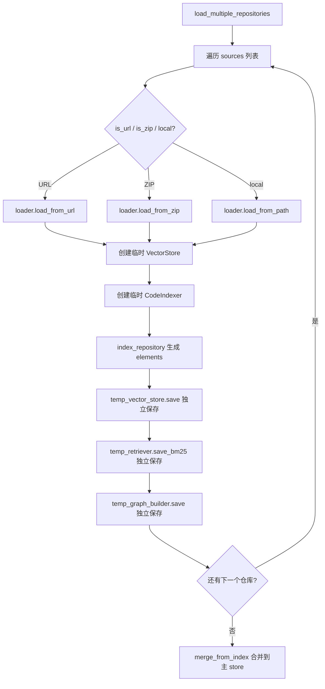
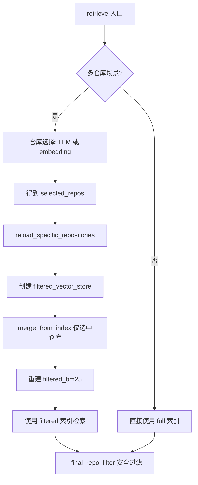

# PD-140.01 FastCode — 多仓库并行索引与 LLM/Embedding 双模式智能路由

> 文档编号：PD-140.01
> 来源：FastCode `fastcode/main.py` `fastcode/retriever.py` `fastcode/repo_selector.py` `fastcode/vector_store.py` `api.py`
> GitHub：https://github.com/HKUDS/FastCode.git
> 问题域：PD-140 多仓库管理 Multi-Repository Management
> 状态：可复用方案

---

## 第 1 章 问题与动机

### 1.1 核心问题

当代码理解系统需要同时服务多个仓库时，面临三个核心挑战：

1. **索引隔离**：多个仓库的向量索引、BM25 索引、代码图谱如何独立存储又能按需合并？如果所有仓库混在一个索引里，删除或更新单个仓库代价极高。
2. **仓库路由**：用户提问时，如何从几十个已索引仓库中快速定位到相关的 2-3 个？全量搜索所有仓库既慢又会引入噪声。
3. **生命周期管理**：仓库的增删改查（CRUD）如何在不影响其他仓库的前提下完成？包括 URL 克隆、ZIP 上传、批量索引、单仓库删除等场景。

### 1.2 FastCode 的解法概述

FastCode 采用"独立索引 + 按需合并 + 双模式路由"的三层架构：

1. **每仓库独立索引**：每个仓库生成独立的 `.faiss` + `_metadata.pkl` + `_bm25.pkl` + `_graphs.pkl` 四件套，互不干扰（`main.py:934-960`）
2. **filtered/full 双层索引隔离**：检索时维护 full 索引（永不清除）和 filtered 索引（按选中仓库动态重建），避免跨仓库结果泄漏（`retriever.py:58-74`）
3. **LLM/embedding 双模式仓库选择**：先用 repo_overview BM25 + 向量搜索粗筛，或直接用 LLM 精选，支持配置切换（`retriever.py:266-276`）
4. **repo_overview 独立存储**：仓库概览信息单独存储在 `repo_overviews.pkl`，不混入代码元素索引，支持独立的 BM25 索引（`retriever.py:143-182`）
5. **RESTful API 全生命周期**：提供 load/index/load-and-index/upload-zip/delete-repos 等完整 CRUD 端点（`api.py:218-697`）

### 1.3 设计思想

| 设计原则 | 具体实现 | 理由 | 替代方案 |
|----------|----------|------|----------|
| 索引独立性 | 每仓库 4 文件独立存储 | 单仓库删除/更新不影响其他 | 全局单索引（删除需重建） |
| 双层索引隔离 | full 索引 + filtered 索引 | 仓库选择后精确检索，避免泄漏 | 仅靠 metadata 过滤（慢且不可靠） |
| 路由可配置 | `repo_selection_method` 切换 LLM/embedding | LLM 精准但贵，embedding 快但粗 | 固定单一路由方式 |
| 概览分离 | repo_overview 独立于代码元素 | 仓库级粗筛不需要代码细节 | 混入代码元素索引（噪声大） |
| 懒初始化 | FastCode 实例首次请求时创建 | 启动快，按需加载 | 启动时全量加载（慢） |
| 三重安全过滤 | semantic/BM25/final 三层 repo_filter | 防止任何阶段的跨仓库泄漏 | 仅在最终结果过滤（不够安全） |

---

## 第 2 章 源码实现分析

### 2.1 架构概览

FastCode 的多仓库管理分为四个层次：API 层、核心引擎层、检索层、存储层。

```
┌─────────────────────────────────────────────────────────────┐
│                     API Layer (api.py)                       │
│  /load  /index  /load-and-index  /upload-zip  /delete-repos │
│  /load-repositories  /index-multiple  /repositories         │
└──────────────────────────┬──────────────────────────────────┘
                           │
┌──────────────────────────▼──────────────────────────────────┐
│              Core Engine (main.py: FastCode)                 │
│  load_multiple_repositories()  _load_multi_repo_cache()     │
│  remove_repository()  list_repositories()                   │
└──────────────────────────┬──────────────────────────────────┘
                           │
┌──────────────────────────▼──────────────────────────────────┐
│           Retrieval Layer (retriever.py + repo_selector.py) │
│  ┌─────────────┐  ┌──────────────┐  ┌───────────────────┐  │
│  │ full_bm25   │  │filtered_bm25 │  │ repo_overview_bm25│  │
│  │ (永不清除)   │  │(动态重建)     │  │ (独立索引)         │  │
│  └─────────────┘  └──────────────┘  └───────────────────┘  │
│  ┌─────────────┐  ┌──────────────────┐                      │
│  │vector_store │  │filtered_vector   │                      │
│  │  (full)     │  │  _store          │                      │
│  └─────────────┘  └──────────────────┘                      │
└──────────────────────────┬──────────────────────────────────┘
                           │
┌──────────────────────────▼──────────────────────────────────┐
│            Storage Layer (vector_store.py)                   │
│  ./data/vector_store/                                       │
│  ├── repo1.faiss + repo1_metadata.pkl                       │
│  ├── repo1_bm25.pkl + repo1_graphs.pkl                      │
│  ├── repo2.faiss + repo2_metadata.pkl                       │
│  ├── repo2_bm25.pkl + repo2_graphs.pkl                      │
│  └── repo_overviews.pkl  (所有仓库概览，共享)                  │
└─────────────────────────────────────────────────────────────┘
```

### 2.2 核心实现

#### 2.2.1 多仓库独立索引



对应源码 `fastcode/main.py:890-1034`：

```python
def load_multiple_repositories(self, sources: List[Dict[str, Any]]):
    self.multi_repo_mode = True
    successfully_indexed = []
    
    for i, source_info in enumerate(sources):
        source = source_info.get('source')
        is_url = source_info.get('is_url', True)
        is_zip = source_info.get('is_zip', False)
        
        # Load repository
        if is_zip:
            self.loader.load_from_zip(source)
        elif is_url:
            self.loader.load_from_url(source)
        else:
            self.loader.load_from_path(source)
        
        repo_info = self.loader.get_repository_info()
        repo_name = repo_info.get('name')
        
        # Create a fresh vector store for this repository
        temp_vector_store = VectorStore(self.config)
        temp_vector_store.initialize(self.embedder.embedding_dim)
        
        # Create a temporary indexer with the temp vector store
        temp_indexer = CodeIndexer(self.config, self.loader, self.parser,
                                  self.embedder, temp_vector_store)
        elements = temp_indexer.index_repository(repo_name=repo_name, repo_url=repo_url)
        
        # Save this repository's vector index separately
        temp_vector_store.save(repo_name)
        
        # Build and save BM25 index for this repository
        temp_retriever = HybridRetriever(self.config, temp_vector_store,
                                         self.embedder, self.graph_builder)
        temp_retriever.index_for_bm25(elements)
        temp_retriever.save_bm25(repo_name)
        
        successfully_indexed.append(repo_name)
    
    # Merge all into main vector store for statistics
    for repo_name in successfully_indexed:
        self.vector_store.merge_from_index(repo_name)
```

关键设计：每个仓库创建独立的 `temp_vector_store` 和 `temp_indexer`，索引完成后独立保存为 `{repo_name}.faiss` + `{repo_name}_metadata.pkl`，最后才合并到主 store 用于统计。

#### 2.2.2 filtered/full 双层索引隔离



对应源码 `fastcode/retriever.py:58-74` 和 `retriever.py:1129-1227`：

```python
class HybridRetriever:
    def __init__(self, config, vector_store, embedder, graph_builder, repo_root=None):
        # Full indexes (for repository selection - never cleared)
        self.full_bm25 = None
        self.full_bm25_corpus = []
        self.full_bm25_elements = []
        
        # Separate BM25 index for repository overviews
        self.repo_overview_bm25 = None
        self.repo_overview_bm25_corpus = []
        self.repo_overview_names = []
        
        # Filtered indexes (for actual retrieval after repo selection)
        self.filtered_bm25 = None
        self.filtered_bm25_corpus = []
        self.filtered_bm25_elements = []
        
        # Filtered vector store for selected repositories
        self.filtered_vector_store = None
    
    def reload_specific_repositories(self, repo_names: List[str]) -> bool:
        """Populate FILTERED indexes while keeping FULL indexes intact"""
        # Create/clear filtered vector store
        if self.filtered_vector_store is None:
            self.filtered_vector_store = VectorStore(self.config)
            self.filtered_vector_store.initialize(self.embedder.embedding_dim)
        else:
            self.filtered_vector_store.clear()
        
        # Load each repository's vector index into FILTERED store
        for repo_name in repo_names:
            self.filtered_vector_store.merge_from_index(repo_name)
        
        # Rebuild FILTERED BM25 with selected repositories
        for repo_name in repo_names:
            bm25_path = os.path.join(self.persist_dir, f"{repo_name}_bm25.pkl")
            with open(bm25_path, 'rb') as f:
                data = pickle.load(f)
                all_bm25_corpus.extend(data["bm25_corpus"])
                for elem_dict in data["bm25_elements"]:
                    all_bm25_elements.append(CodeElement(**elem_dict))
        
        self.filtered_bm25 = BM25Okapi(all_bm25_corpus)
```

### 2.3 实现细节

#### LLM/Embedding 双模式仓库选择

检索入口 `retrieve()` 根据配置 `repo_selection_method` 选择路由方式（`retriever.py:266-276`）：

- **LLM 模式**（默认）：调用 `_select_relevant_repositories_by_llm()`，将所有仓库概览发送给 LLM，LLM 返回相关仓库名，再通过模糊匹配（精确 → 子串 → Jaccard）对齐到实际仓库名（`repo_selector.py:280-455`）
- **Embedding 模式**：调用 `_select_relevant_repositories()`，对 repo_overview 做 semantic + BM25 双路搜索，加权合并（semantic 70% + BM25 30%），阈值过滤（`retriever.py:391-515`）

LLM 模式有三级降级：LLM 失败 → embedding 降级 → 返回用户原始 scope_repos（`retriever.py:575-592`）。

#### 三重安全过滤

为防止跨仓库结果泄漏，FastCode 在三个层次做 repo_filter 检查：

1. **语义搜索层**：`_semantic_search()` 中手动过滤非目标仓库结果（`retriever.py:758-769`）
2. **关键词搜索层**：`_keyword_search()` 中检查 `elem.repo_name not in repo_filter`（`retriever.py:815-821`）
3. **最终安全层**：`_final_repo_filter()` 作为最后防线，过滤所有非目标仓库结果并记录警告（`retriever.py:1045-1082`）

#### 仓库删除的完整清理

`remove_repository()` 删除四类文件 + 概览条目 + 源码目录（`main.py:1298-1361`）：

```python
file_patterns = [
    f"{repo_name}.faiss",           # 向量索引
    f"{repo_name}_metadata.pkl",    # 元数据
    f"{repo_name}_bm25.pkl",        # BM25 索引
    f"{repo_name}_graphs.pkl",      # 代码图谱
]
# + delete_repo_overview() 清理概览
# + shutil.rmtree(repo_dir) 清理源码
# + invalidate_scan_cache() 刷新缓存
```

#### scan_available_indexes 的采样优化

扫描可用索引时，不遍历全部 metadata，而是采样前 100 条估算文件数（`vector_store.py:705-720`）：

```python
sample_size = min(self._index_scan_sample_size, len(metadata_list))
seen_files = set()
for i in range(sample_size):
    meta = metadata_list[i]
    file_path = meta.get("file_path")
    if file_path:
        seen_files.add(file_path)
# Estimate total file count based on sample
if sample_size > 0 and sample_size < len(metadata_list):
    file_count = int(len(seen_files) * (len(metadata_list) / sample_size))
```


---

## 第 3 章 迁移指南

### 3.1 迁移清单

**阶段 1：存储层（1-2 天）**
- [ ] 设计每仓库独立的索引文件命名规范（`{repo_name}.faiss` / `{repo_name}_metadata.pkl` / `{repo_name}_bm25.pkl`）
- [ ] 实现 `save(repo_name)` 和 `merge_from_index(repo_name)` 方法
- [ ] 实现 `scan_available_indexes()` 扫描可用索引（含采样优化）
- [ ] 实现 `repo_overviews.pkl` 独立存储（与代码元素分离）

**阶段 2：检索层（2-3 天）**
- [ ] 实现 full/filtered 双层索引架构
- [ ] 实现 `reload_specific_repositories()` 动态重建 filtered 索引
- [ ] 实现 repo_overview BM25 独立索引
- [ ] 实现三重安全过滤（semantic/keyword/final）

**阶段 3：路由层（1-2 天）**
- [ ] 实现 embedding 模式仓库选择（semantic 70% + BM25 30% 加权）
- [ ] 实现 LLM 模式仓库选择（含模糊匹配降级）
- [ ] 实现 `repo_selection_method` 配置切换

**阶段 4：API 层（1 天）**
- [ ] 实现仓库 CRUD 端点（load/index/delete/list）
- [ ] 实现批量索引端点（index-multiple）
- [ ] 实现 ZIP 上传端点（upload-zip）

### 3.2 适配代码模板

#### 模板 1：每仓库独立索引存储

```python
import os
import pickle
import faiss
import numpy as np
from typing import List, Dict, Any, Optional
from dataclasses import dataclass, asdict


@dataclass
class CodeElement:
    id: str
    type: str  # file, class, function, documentation
    name: str
    file_path: str
    relative_path: str
    language: str
    start_line: int
    end_line: int
    code: str
    repo_name: Optional[str] = None
    repo_url: Optional[str] = None
    signature: Optional[str] = None
    docstring: Optional[str] = None
    summary: Optional[str] = None
    metadata: Optional[Dict[str, Any]] = None

    def to_dict(self) -> Dict[str, Any]:
        return asdict(self)


class MultiRepoVectorStore:
    """每仓库独立索引的向量存储"""

    def __init__(self, persist_dir: str = "./data/vector_store", dimension: int = 768):
        self.persist_dir = persist_dir
        self.dimension = dimension
        os.makedirs(persist_dir, exist_ok=True)

        # 主索引（合并后用于统计和全量搜索）
        self.index: Optional[faiss.IndexFlatIP] = None
        self.metadata: List[Dict[str, Any]] = []

        # 概览独立存储
        self._repo_overviews: Dict[str, Dict[str, Any]] = {}
        self._overviews_path = os.path.join(persist_dir, "repo_overviews.pkl")

        # 扫描缓存
        self._scan_cache = None
        self._scan_cache_ttl = 30  # seconds

    def save_repo_index(self, repo_name: str, vectors: np.ndarray,
                        metadata: List[Dict[str, Any]]):
        """保存单个仓库的索引"""
        index = faiss.IndexFlatIP(self.dimension)
        faiss.normalize_L2(vectors)
        index.add(vectors)

        faiss.write_index(index, os.path.join(self.persist_dir, f"{repo_name}.faiss"))
        with open(os.path.join(self.persist_dir, f"{repo_name}_metadata.pkl"), 'wb') as f:
            pickle.dump({"metadata": metadata}, f)

    def merge_from_index(self, repo_name: str) -> bool:
        """将某仓库索引合并到主索引"""
        faiss_path = os.path.join(self.persist_dir, f"{repo_name}.faiss")
        meta_path = os.path.join(self.persist_dir, f"{repo_name}_metadata.pkl")

        if not os.path.exists(faiss_path) or not os.path.exists(meta_path):
            return False

        repo_index = faiss.read_index(faiss_path)
        with open(meta_path, 'rb') as f:
            data = pickle.load(f)

        if self.index is None:
            self.index = faiss.IndexFlatIP(self.dimension)

        # 提取向量并合并
        n = repo_index.ntotal
        vectors = np.zeros((n, self.dimension), dtype=np.float32)
        for i in range(n):
            vectors[i] = faiss.rev_swig_ptr(repo_index.get_xb() + i * self.dimension,
                                             self.dimension).copy()
        self.index.add(vectors)
        self.metadata.extend(data["metadata"])
        return True

    def scan_available_indexes(self) -> List[Dict[str, Any]]:
        """扫描可用索引，采样估算文件数"""
        repos = []
        for f in os.listdir(self.persist_dir):
            if f.endswith('.faiss'):
                repo_name = f.replace('.faiss', '')
                meta_path = os.path.join(self.persist_dir, f"{repo_name}_metadata.pkl")
                if os.path.exists(meta_path):
                    with open(meta_path, 'rb') as mf:
                        data = pickle.load(mf)
                    meta_list = data.get("metadata", [])
                    # 采样前 100 条估算
                    sample = meta_list[:100]
                    seen_files = {m.get("file_path") for m in sample if m.get("file_path")}
                    file_count = int(len(seen_files) * len(meta_list) / max(len(sample), 1))
                    repos.append({
                        "name": repo_name,
                        "element_count": len(meta_list),
                        "file_count": file_count,
                    })
        return sorted(repos, key=lambda x: x["name"])

    def remove_repo(self, repo_name: str) -> List[str]:
        """删除单个仓库的所有索引文件"""
        deleted = []
        for suffix in [".faiss", "_metadata.pkl", "_bm25.pkl", "_graphs.pkl"]:
            path = os.path.join(self.persist_dir, f"{repo_name}{suffix}")
            if os.path.exists(path):
                os.remove(path)
                deleted.append(path)
        # 清理概览
        if repo_name in self._repo_overviews:
            del self._repo_overviews[repo_name]
            self._save_overviews()
            deleted.append("repo_overviews.pkl (entry)")
        return deleted

    def _save_overviews(self):
        with open(self._overviews_path, 'wb') as f:
            pickle.dump(self._repo_overviews, f)
```

#### 模板 2：双层索引检索器

```python
from rank_bm25 import BM25Okapi
from typing import List, Dict, Any, Optional, Tuple


class DualLayerRetriever:
    """full/filtered 双层索引检索器"""

    def __init__(self, store: MultiRepoVectorStore):
        self.store = store
        # Full indexes (never cleared)
        self.full_bm25: Optional[BM25Okapi] = None
        self.full_elements: List[CodeElement] = []
        # Filtered indexes (dynamically rebuilt)
        self.filtered_bm25: Optional[BM25Okapi] = None
        self.filtered_elements: List[CodeElement] = []
        self.filtered_store: Optional[MultiRepoVectorStore] = None
        self.current_repos: Optional[List[str]] = None

    def reload_for_repos(self, repo_names: List[str]) -> bool:
        """为选中仓库重建 filtered 索引"""
        if self.current_repos == repo_names:
            return True  # 已加载

        self.filtered_store = MultiRepoVectorStore(
            self.store.persist_dir, self.store.dimension
        )
        for name in repo_names:
            self.filtered_store.merge_from_index(name)

        # 重建 filtered BM25
        all_corpus, all_elements = [], []
        for name in repo_names:
            bm25_path = f"{self.store.persist_dir}/{name}_bm25.pkl"
            if os.path.exists(bm25_path):
                with open(bm25_path, 'rb') as f:
                    data = pickle.load(f)
                all_corpus.extend(data["bm25_corpus"])
                all_elements.extend(
                    CodeElement(**d) for d in data["bm25_elements"]
                )

        if all_corpus:
            self.filtered_bm25 = BM25Okapi(all_corpus)
            self.filtered_elements = all_elements

        self.current_repos = repo_names
        return True

    def retrieve(self, query: str, repo_filter: Optional[List[str]] = None,
                 top_k: int = 10) -> List[Dict[str, Any]]:
        """检索，自动选择 full 或 filtered 索引"""
        if repo_filter:
            self.reload_for_repos(repo_filter)

        # 使用 filtered 或 full 索引
        bm25 = self.filtered_bm25 if repo_filter else self.full_bm25
        elements = self.filtered_elements if repo_filter else self.full_elements

        # BM25 搜索
        tokens = query.lower().split()
        scores = bm25.get_scores(tokens) if bm25 else []

        results = []
        for idx in np.argsort(scores)[::-1][:top_k]:
            if scores[idx] > 0:
                elem = elements[idx]
                # 三重安全过滤
                if repo_filter and elem.repo_name not in repo_filter:
                    continue
                results.append({"element": elem.to_dict(), "score": float(scores[idx])})

        return results
```

### 3.3 适用场景

| 场景 | 适用度 | 说明 |
|------|--------|------|
| 多仓库代码搜索平台 | ⭐⭐⭐ | 核心场景，独立索引 + 智能路由完美匹配 |
| 企业内部代码知识库 | ⭐⭐⭐ | 仓库 CRUD 全生命周期管理，支持增量更新 |
| RAG 系统多数据源管理 | ⭐⭐ | 双层索引隔离思想可迁移到非代码场景 |
| 单仓库代码理解 | ⭐ | 过度设计，单仓库不需要路由和隔离 |
| 实时索引更新场景 | ⭐ | FAISS 不支持高效删除，需重建索引 |

---

## 第 4 章 测试用例

```python
import pytest
import os
import tempfile
import pickle
import numpy as np
from unittest.mock import MagicMock, patch


class TestMultiRepoIndexStorage:
    """测试多仓库独立索引存储"""

    def setup_method(self):
        self.temp_dir = tempfile.mkdtemp()
        self.store = MultiRepoVectorStore(persist_dir=self.temp_dir, dimension=4)

    def test_save_and_merge_single_repo(self):
        """正常路径：保存单仓库索引后合并到主索引"""
        vectors = np.random.randn(3, 4).astype(np.float32)
        metadata = [
            {"id": "1", "repo_name": "repo_a", "file_path": "a.py"},
            {"id": "2", "repo_name": "repo_a", "file_path": "b.py"},
            {"id": "3", "repo_name": "repo_a", "file_path": "a.py"},
        ]
        self.store.save_repo_index("repo_a", vectors, metadata)

        # 验证文件存在
        assert os.path.exists(os.path.join(self.temp_dir, "repo_a.faiss"))
        assert os.path.exists(os.path.join(self.temp_dir, "repo_a_metadata.pkl"))

        # 合并到主索引
        assert self.store.merge_from_index("repo_a") is True
        assert len(self.store.metadata) == 3

    def test_merge_nonexistent_repo(self):
        """边界情况：合并不存在的仓库"""
        assert self.store.merge_from_index("nonexistent") is False

    def test_scan_available_indexes(self):
        """正常路径：扫描可用索引"""
        for name in ["repo_a", "repo_b"]:
            vectors = np.random.randn(5, 4).astype(np.float32)
            metadata = [{"file_path": f"{name}/f{i}.py"} for i in range(5)]
            self.store.save_repo_index(name, vectors, metadata)

        repos = self.store.scan_available_indexes()
        assert len(repos) == 2
        names = [r["name"] for r in repos]
        assert "repo_a" in names
        assert "repo_b" in names

    def test_remove_repo_cleans_all_files(self):
        """正常路径：删除仓库清理所有文件"""
        vectors = np.random.randn(2, 4).astype(np.float32)
        self.store.save_repo_index("repo_x", vectors, [{"id": "1"}, {"id": "2"}])

        # 模拟 BM25 文件
        bm25_path = os.path.join(self.temp_dir, "repo_x_bm25.pkl")
        with open(bm25_path, 'wb') as f:
            pickle.dump({}, f)

        deleted = self.store.remove_repo("repo_x")
        assert len(deleted) >= 2
        assert not os.path.exists(os.path.join(self.temp_dir, "repo_x.faiss"))
        assert not os.path.exists(bm25_path)


class TestDualLayerRetriever:
    """测试双层索引检索器"""

    def test_repo_filter_prevents_cross_repo_leakage(self):
        """安全测试：repo_filter 阻止跨仓库泄漏"""
        store = MultiRepoVectorStore(persist_dir=tempfile.mkdtemp(), dimension=4)
        retriever = DualLayerRetriever(store)

        # 构造包含两个仓库的 full 索引
        elem_a = CodeElement(
            id="1", type="function", name="func_a", file_path="/a.py",
            relative_path="a.py", language="python", start_line=1, end_line=10,
            code="def func_a(): pass", repo_name="repo_a"
        )
        elem_b = CodeElement(
            id="2", type="function", name="func_b", file_path="/b.py",
            relative_path="b.py", language="python", start_line=1, end_line=10,
            code="def func_b(): pass", repo_name="repo_b"
        )
        retriever.full_elements = [elem_a, elem_b]
        corpus = [["func", "a"], ["func", "b"]]
        retriever.full_bm25 = BM25Okapi(corpus)

        # 只搜索 repo_a
        results = retriever.retrieve("func", repo_filter=["repo_a"], top_k=10)
        for r in results:
            assert r["element"]["repo_name"] == "repo_a"

    def test_reload_caches_current_repos(self):
        """优化测试：相同仓库列表不重复加载"""
        store = MultiRepoVectorStore(persist_dir=tempfile.mkdtemp(), dimension=4)
        retriever = DualLayerRetriever(store)
        retriever.current_repos = ["repo_a"]

        # 相同列表应直接返回 True
        assert retriever.reload_for_repos(["repo_a"]) is True


class TestRepoSelector:
    """测试仓库选择器的模糊匹配"""

    def test_fuzzy_match_exact(self):
        """精确匹配（大小写不敏感）"""
        selector = RepositorySelector.__new__(RepositorySelector)
        selector.logger = MagicMock()
        result = selector._fuzzy_match_repo("FastCode", ["fastcode", "other"])
        assert result == "fastcode"

    def test_fuzzy_match_substring(self):
        """子串匹配"""
        selector = RepositorySelector.__new__(RepositorySelector)
        selector.logger = MagicMock()
        result = selector._fuzzy_match_repo("fast", ["fastcode", "slowcode"])
        assert result == "fastcode"

    def test_fuzzy_match_jaccard(self):
        """Jaccard token 匹配"""
        selector = RepositorySelector.__new__(RepositorySelector)
        selector.logger = MagicMock()
        result = selector._fuzzy_match_repo(
            "fast-code-repo", ["fastcode", "unrelated"]
        )
        # "fast", "code", "repo" vs "fastcode" — Jaccard 应能匹配
        assert result == "fastcode"
```


---

## 第 5 章 跨域关联

| 关联域 | 关系类型 | 说明 |
|--------|----------|------|
| PD-08 搜索与检索 | 强依赖 | 多仓库管理的核心目的是支持跨仓库检索，filtered/full 双层索引直接服务于 PD-08 的混合检索流程 |
| PD-04 工具系统 | 协同 | repo_selector 使用 LLM 作为工具进行仓库选择，LLM 调用链路依赖工具系统的 provider 抽象 |
| PD-01 上下文管理 | 协同 | 仓库选择减少了需要搜索的索引范围，间接降低了 LLM 上下文窗口的压力 |
| PD-06 记忆持久化 | 协同 | 每仓库独立的 `.faiss` + `_metadata.pkl` 持久化方案与记忆系统的存储策略相似 |
| PD-03 容错与重试 | 协同 | LLM 仓库选择的三级降级（LLM → embedding → scope_repos）是容错设计的典型应用 |
| PD-139 配置驱动架构 | 依赖 | `repo_selection_method`、`enable_two_stage_retrieval` 等配置项驱动多仓库行为切换 |

---

## 第 6 章 来源文件索引

| 文件 | 行范围 | 关键实现 |
|------|--------|----------|
| `fastcode/main.py` | L890-L1034 | `load_multiple_repositories()` 多仓库独立索引核心流程 |
| `fastcode/main.py` | L1036-L1057 | `list_repositories()` 仓库列表查询 |
| `fastcode/main.py` | L1086-L1232 | `_load_multi_repo_cache()` 按需加载仓库缓存 |
| `fastcode/main.py` | L1298-L1361 | `remove_repository()` 仓库完整删除 |
| `fastcode/retriever.py` | L23-L96 | `HybridRetriever.__init__()` full/filtered 双层索引初始化 |
| `fastcode/retriever.py` | L97-L141 | `index_for_bm25()` 全量 BM25 索引构建 |
| `fastcode/retriever.py` | L143-L182 | `build_repo_overview_bm25()` 仓库概览独立 BM25 索引 |
| `fastcode/retriever.py` | L184-L389 | `retrieve()` 多仓库检索主流程（含仓库选择 + 双层索引切换） |
| `fastcode/retriever.py` | L391-L515 | `_select_relevant_repositories()` embedding 模式仓库选择 |
| `fastcode/retriever.py` | L517-L592 | `_select_relevant_repositories_by_llm()` LLM 模式仓库选择（含三级降级） |
| `fastcode/retriever.py` | L1045-L1082 | `_final_repo_filter()` 最终安全过滤 |
| `fastcode/retriever.py` | L1129-L1227 | `reload_specific_repositories()` filtered 索引动态重建 |
| `fastcode/repo_selector.py` | L16-L61 | `RepositorySelector.__init__()` LLM 客户端初始化 |
| `fastcode/repo_selector.py` | L62-L112 | `select_relevant_files()` LLM 文件选择 |
| `fastcode/repo_selector.py` | L280-L353 | `select_relevant_repos()` LLM 仓库选择 |
| `fastcode/repo_selector.py` | L359-L418 | `_fuzzy_match_repo()` 三级模糊匹配（精确→子串→Jaccard） |
| `fastcode/vector_store.py` | L647-L749 | `scan_available_indexes()` 索引扫描（含采样优化和缓存） |
| `api.py` | L218-L236 | `POST /load` 单仓库加载 |
| `api.py` | L263-L286 | `POST /load-and-index` 加载+索引一体化 |
| `api.py` | L315-L337 | `POST /index-multiple` 批量索引 |
| `api.py` | L339-L416 | `POST /upload-zip` ZIP 上传 |
| `api.py` | L669-L697 | `POST /delete-repos` 仓库删除 |

---

## 第 7 章 横向对比维度

```json comparison_data
{
  "project": "FastCode",
  "dimensions": {
    "索引架构": "每仓库独立 4 文件（faiss/metadata/bm25/graphs）+ 共享 repo_overviews.pkl",
    "仓库路由": "LLM/embedding 双模式可配置，LLM 默认，三级降级（LLM→embedding→scope_repos）",
    "索引隔离": "full/filtered 双层索引，filtered 按选中仓库动态重建，full 永不清除",
    "安全过滤": "三重 repo_filter（semantic/keyword/final），防止跨仓库结果泄漏",
    "生命周期": "RESTful CRUD 全覆盖：load/index/upload-zip/delete-repos/list",
    "扫描优化": "采样前 100 条 metadata 估算文件数，30 秒 TTL 缓存"
  }
}
```

### 域元数据补充

```json domain_metadata
{
  "solution_summary": "FastCode 用每仓库独立 4 文件索引 + full/filtered 双层隔离 + LLM/embedding 双模式路由实现多仓库并行管理，三重安全过滤防止跨仓库泄漏",
  "description": "多仓库系统中索引隔离与跨仓库安全过滤是保证检索精度的关键",
  "sub_problems": [
    "跨仓库结果泄漏防护",
    "仓库路由降级策略",
    "索引扫描性能优化"
  ],
  "best_practices": [
    "三重安全过滤（semantic/keyword/final）防止跨仓库泄漏",
    "LLM 仓库选择配合模糊匹配（精确→子串→Jaccard）提高鲁棒性",
    "采样估算 + TTL 缓存加速大规模索引扫描"
  ]
}
```

