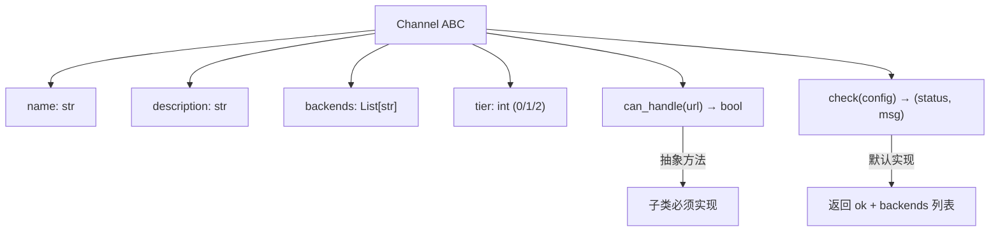
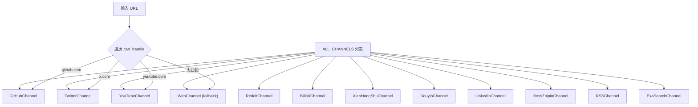
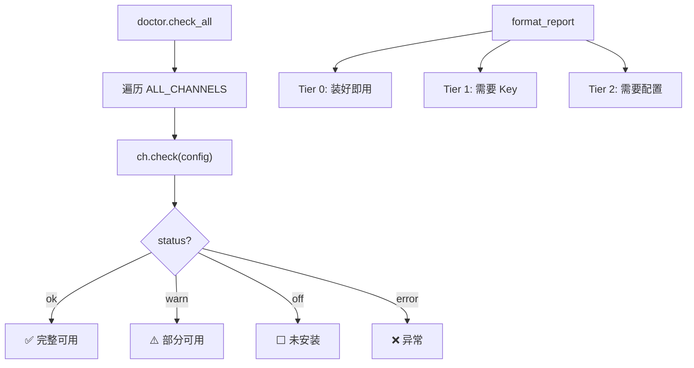

# PD-141.01 Agent Reach — Channel 抽象基类与 Tier 分级注册表

> 文档编号：PD-141.01
> 来源：Agent Reach `agent_reach/channels/base.py`, `agent_reach/channels/__init__.py`
> GitHub：https://github.com/Panniantong/Agent-Reach.git
> 问题域：PD-141 可插拔渠道架构 Pluggable Channel Architecture
> 状态：可复用方案

---

## 第 1 章 问题与动机

### 1.1 核心问题

Agent 系统需要对接多个外部平台（Twitter、YouTube、GitHub、小红书、抖音等），每个平台有不同的：
- **URL 格式**：需要识别 URL 属于哪个平台
- **后端工具**：有的用 CLI（gh、yt-dlp、bird），有的用 MCP Server，有的用 HTTP API
- **配置复杂度**：有的零配置即用，有的需要 API Key，有的需要 Docker + MCP 服务
- **可用性状态**：工具可能未安装、未认证、服务未启动

如果把所有平台逻辑写在一起，会导致巨大的 if-else 链，新增平台需要修改核心代码，违反开闭原则。

### 1.2 Agent Reach 的解法概述

Agent Reach 设计了一套 Channel 抽象体系，核心思路是"每个平台是一个 Channel 实例"：

1. **Channel 抽象基类** — 定义 `can_handle(url)` 和 `check(config)` 两个核心接口（`base.py:18-36`）
2. **12 个独立渠道文件** — 每个平台一个 `.py` 文件，单一职责（`channels/*.py`）
3. **ALL_CHANNELS 注册表** — 有序列表，特定平台在前、通用 fallback 在后（`__init__.py:25-38`）
4. **Tier 分级** — 0/1/2 三级标识配置复杂度，驱动 Doctor 报告分组（`base.py:24`）
5. **Doctor 健康检查** — 遍历所有 Channel 调用 `check()`，输出分级状态报告（`doctor.py:12-24`）

### 1.3 设计思想

| 设计原则 | 具体实现 | 理由 | 替代方案 |
|----------|----------|------|----------|
| 策略模式 | Channel ABC + 12 个子类 | 每个平台的 URL 匹配和健康检查逻辑完全不同，策略模式天然适配 | 大 switch-case / 配置表驱动 |
| 单一职责 | 每个渠道独立文件（twitter.py、github.py 等） | 修改一个平台不影响其他平台，降低合并冲突 | 全部写在一个 channels.py |
| 有序 fallback | ALL_CHANNELS 列表中 WebChannel 放最后 | URL 路由按顺序匹配，Web 作为兜底处理任意 URL | 优先级数值排序 |
| Tier 分级 | tier=0/1/2 整数属性 | 用户一眼看出哪些渠道零配置可用、哪些需要额外设置 | 布尔 is_configured |
| 自检能力 | 每个 Channel 自带 check() 方法 | 渠道自己最清楚后端工具是否可用，不需要外部探测 | 集中式 HealthChecker |

---

## 第 2 章 源码实现分析

### 2.1 架构概览

Agent Reach 的渠道系统由四层组成：

```
┌─────────────────────────────────────────────────────────┐
│                    Doctor / CLI                          │
│  check_all(config) → 遍历 ALL_CHANNELS → 分级报告       │
├─────────────────────────────────────────────────────────┤
│                Channel Registry                          │
│  ALL_CHANNELS: List[Channel] = [GitHub, Twitter, ...,   │
│                                  Web(fallback)]          │
│  get_channel(name) / get_all_channels()                  │
├─────────────────────────────────────────────────────────┤
│              Channel Implementations                     │
│  ┌──────┐ ┌───────┐ ┌───────┐ ┌─────┐ ┌──────────────┐│
│  │GitHub│ │Twitter│ │YouTube│ │ ... │ │Web (fallback)││
│  │tier=0│ │tier=1 │ │tier=0 │ │     │ │   tier=0     ││
│  └──────┘ └───────┘ └───────┘ └─────┘ └──────────────┘│
├─────────────────────────────────────────────────────────┤
│                Channel ABC (base.py)                     │
│  name / description / backends / tier                    │
│  can_handle(url) → bool                                  │
│  check(config) → (status, message)                       │
├─────────────────────────────────────────────────────────┤
│              External Backends                           │
│  gh CLI │ bird CLI │ yt-dlp │ mcporter │ Jina Reader    │
└─────────────────────────────────────────────────────────┘
```

### 2.2 核心实现

#### 2.2.1 Channel 抽象基类



对应源码 `agent_reach/channels/base.py:1-36`：

```python
class Channel(ABC):
    """Base class for all channels."""

    name: str = ""                    # e.g. "youtube"
    description: str = ""             # e.g. "YouTube 视频和字幕"
    backends: List[str] = []          # e.g. ["yt-dlp"] — what upstream tool is used
    tier: int = 0                     # 0=zero-config, 1=needs free key, 2=needs setup

    @abstractmethod
    def can_handle(self, url: str) -> bool:
        """Check if this channel can handle this URL."""
        ...

    def check(self, config=None) -> Tuple[str, str]:
        """
        Check if this channel's upstream tool is available.
        Returns (status, message) where status is 'ok'/'warn'/'off'/'error'.
        """
        return "ok", f"{'、'.join(self.backends) if self.backends else '内置'}"
```

关键设计点：
- `can_handle` 是 `@abstractmethod`，强制每个渠道实现 URL 匹配
- `check` 有默认实现（返回 ok），tier=0 的简单渠道可以不覆写
- `backends` 是声明式的，告诉用户该渠道依赖什么外部工具
- 状态码只有 4 种：`ok` / `warn` / `off` / `error`

#### 2.2.2 注册表与 URL 路由



对应源码 `agent_reach/channels/__init__.py:25-51`：

```python
ALL_CHANNELS: List[Channel] = [
    GitHubChannel(),
    TwitterChannel(),
    YouTubeChannel(),
    RedditChannel(),
    BilibiliChannel(),
    XiaoHongShuChannel(),
    DouyinChannel(),
    LinkedInChannel(),
    BossZhipinChannel(),
    RSSChannel(),
    ExaSearchChannel(),
    WebChannel(),       # Last — fallback
]

def get_channel(name: str) -> Optional[Channel]:
    """Get a channel by name."""
    for ch in ALL_CHANNELS:
        if ch.name == name:
            return ch
    return None
```

注册表设计要点：
- **有序列表**而非字典 — 顺序决定 URL 匹配优先级
- **WebChannel 放最后** — `can_handle` 永远返回 True，作为兜底（`web.py:13-14`）
- **ExaSearchChannel 不处理 URL** — `can_handle` 永远返回 False，纯搜索渠道（`exa_search.py:15-16`）
- **实例化在注册时** — 列表中是实例而非类，避免重复创建

#### 2.2.3 Tier 分级与 Doctor 健康检查



对应源码 `agent_reach/doctor.py:12-91`：

```python
def check_all(config: Config) -> Dict[str, dict]:
    """Check all channels and return status dict."""
    results = {}
    for ch in get_all_channels():
        status, message = ch.check(config)
        results[ch.name] = {
            "status": status,
            "name": ch.description,
            "message": message,
            "tier": ch.tier,
            "backends": ch.backends,
        }
    return results
```

`format_report` 按 tier 分组输出（`doctor.py:27-91`），还包含配置文件权限安全检查（`doctor.py:77-89`）。

### 2.3 实现细节

#### 三种 check() 模式

12 个渠道的 `check()` 实现可归纳为三种模式：

| 模式 | 代表渠道 | 检查方式 | Tier |
|------|----------|----------|------|
| **二进制检测** | YouTube、GitHub | `shutil.which("yt-dlp")` 检查工具是否安装 | 0 |
| **认证验证** | Twitter、Reddit | 检查工具 + 运行认证命令（`bird whoami`、`gh auth status`） | 1 |
| **MCP 三步检测** | 小红书、抖音、LinkedIn | mcporter 存在 → MCP 已配置 → 功能调用验证 | 2 |

Tier 2 渠道的三步检测模式（以小红书为例，`xiaohongshu.py:20-50`）：

```python
def check(self, config=None):
    # Step 1: mcporter 是否安装
    if not shutil.which("mcporter"):
        return "off", "需要 mcporter + xiaohongshu-mcp..."
    # Step 2: MCP 服务是否配置
    r = subprocess.run(["mcporter", "list"], ...)
    if "xiaohongshu" not in r.stdout:
        return "off", "mcporter 已装但小红书 MCP 未配置..."
    # Step 3: 功能是否可用（登录状态）
    r = subprocess.run(["mcporter", "call", "xiaohongshu.check_login_status()"], ...)
    if "已登录" in r.stdout:
        return "ok", "完整可用（阅读、搜索、发帖、评论、点赞）"
    return "warn", "MCP 已连接但未登录"
```

#### 配置系统联动

Config 类（`config.py:15-102`）通过 `FEATURE_REQUIREMENTS` 字典管理渠道依赖的配置项：

```python
FEATURE_REQUIREMENTS = {
    "exa_search": ["exa_api_key"],
    "reddit_proxy": ["reddit_proxy"],
    "twitter_bird": ["twitter_auth_token", "twitter_ct0"],
    "groq_whisper": ["groq_api_key"],
    "github_token": ["github_token"],
}
```

`config.get(key)` 先查 YAML 文件，再查环境变量（大写），实现双源配置（`config.py:61-70`）。

---

## 第 3 章 迁移指南

### 3.1 迁移清单

**阶段 1：基础框架（必须）**
- [ ] 创建 `channels/base.py`，定义 Channel ABC（4 属性 + 2 方法）
- [ ] 创建 `channels/__init__.py`，定义 ALL_CHANNELS 注册表
- [ ] 实现 `get_channel(name)` 和 `get_all_channels()` 查询函数

**阶段 2：渠道实现（按需）**
- [ ] 为每个目标平台创建独立 `.py` 文件
- [ ] 实现 `can_handle(url)` — URL 域名匹配
- [ ] 实现 `check(config)` — 后端工具可用性检测
- [ ] 设置 tier 值（0=零配置 / 1=需要 Key / 2=需要服务）

**阶段 3：集成（可选）**
- [ ] 实现 Doctor 健康检查（遍历 + 分级报告）
- [ ] 实现 URL 路由（遍历 can_handle，首个匹配即返回）
- [ ] 集成配置系统（YAML + 环境变量双源）

### 3.2 适配代码模板

#### 最小可运行的 Channel 框架

```python
"""channels/base.py — Channel 抽象基类"""
from abc import ABC, abstractmethod
from typing import List, Tuple, Optional


class Channel(ABC):
    name: str = ""
    description: str = ""
    backends: List[str] = []
    tier: int = 0  # 0=zero-config, 1=needs-key, 2=needs-setup

    @abstractmethod
    def can_handle(self, url: str) -> bool:
        """该 URL 是否属于本渠道？"""
        ...

    def check(self, config=None) -> Tuple[str, str]:
        """检查后端工具可用性。返回 (status, message)。
        status: 'ok' | 'warn' | 'off' | 'error'
        """
        return "ok", f"{'、'.join(self.backends) if self.backends else '内置'}"


class ChannelRegistry:
    """有序渠道注册表，支持 URL 路由和健康检查。"""

    def __init__(self):
        self._channels: List[Channel] = []

    def register(self, channel: Channel):
        self._channels.append(channel)

    def route(self, url: str) -> Optional[Channel]:
        """按注册顺序匹配 URL，返回首个匹配的渠道。"""
        for ch in self._channels:
            if ch.can_handle(url):
                return ch
        return None

    def check_all(self, config=None) -> dict:
        """健康检查所有渠道。"""
        results = {}
        for ch in self._channels:
            status, message = ch.check(config)
            results[ch.name] = {
                "status": status,
                "description": ch.description,
                "message": message,
                "tier": ch.tier,
                "backends": ch.backends,
            }
        return results

    @property
    def all(self) -> List[Channel]:
        return list(self._channels)
```

#### 渠道实现示例

```python
"""channels/github.py — GitHub 渠道"""
import shutil
import subprocess
from .base import Channel


class GitHubChannel(Channel):
    name = "github"
    description = "GitHub 仓库和代码"
    backends = ["gh CLI"]
    tier = 0

    def can_handle(self, url: str) -> bool:
        from urllib.parse import urlparse
        return "github.com" in urlparse(url).netloc.lower()

    def check(self, config=None):
        if not shutil.which("gh"):
            return "off", "gh CLI 未安装"
        try:
            subprocess.run(["gh", "auth", "status"],
                           capture_output=True, timeout=5)
            return "ok", "完整可用"
        except Exception:
            return "warn", "已安装但未认证"
```

#### Fallback 渠道

```python
"""channels/web.py — 通用 Web 兜底渠道（必须注册在最后）"""
from .base import Channel


class WebChannel(Channel):
    name = "web"
    description = "任意网页"
    backends = ["Jina Reader"]
    tier = 0

    def can_handle(self, url: str) -> bool:
        return True  # 兜底：处理任意 URL
```

### 3.3 适用场景

| 场景 | 适用度 | 说明 |
|------|--------|------|
| 多平台内容采集 Agent | ⭐⭐⭐ | 核心场景：不同平台用不同工具采集，Channel 天然适配 |
| MCP 工具网关 | ⭐⭐⭐ | 每个 MCP Server 封装为一个 Channel，统一管理生命周期 |
| 多搜索源聚合 | ⭐⭐ | 搜索源可建模为 Channel（如 ExaSearchChannel），但 can_handle 语义需调整 |
| 单一平台深度集成 | ⭐ | 只有一个平台时，Channel 抽象是过度设计 |
| 实时流式数据源 | ⭐ | Channel 设计面向请求-响应模式，不适合 WebSocket/SSE 长连接 |

---

## 第 4 章 测试用例

```python
"""tests/test_channel_system.py"""
import pytest
from unittest.mock import patch, MagicMock


# ---- 基础框架测试 ----

class TestChannelABC:
    """测试 Channel 抽象基类约束。"""

    def test_cannot_instantiate_abc(self):
        """Channel 是抽象类，不能直接实例化。"""
        from channels.base import Channel
        with pytest.raises(TypeError):
            Channel()

    def test_subclass_must_implement_can_handle(self):
        """子类必须实现 can_handle。"""
        from channels.base import Channel
        class BadChannel(Channel):
            name = "bad"
        with pytest.raises(TypeError):
            BadChannel()

    def test_default_check_returns_ok(self):
        """不覆写 check() 时默认返回 ok。"""
        from channels.base import Channel
        class SimpleChannel(Channel):
            name = "simple"
            backends = ["tool-a", "tool-b"]
            def can_handle(self, url): return False
        ch = SimpleChannel()
        status, msg = ch.check()
        assert status == "ok"
        assert "tool-a" in msg and "tool-b" in msg


# ---- URL 路由测试 ----

class TestURLRouting:
    """测试 URL 到渠道的路由匹配。"""

    def test_github_url_matches(self):
        from channels.github import GitHubChannel
        ch = GitHubChannel()
        assert ch.can_handle("https://github.com/user/repo") is True
        assert ch.can_handle("https://gitlab.com/user/repo") is False

    def test_twitter_handles_both_domains(self):
        from channels.twitter import TwitterChannel
        ch = TwitterChannel()
        assert ch.can_handle("https://x.com/user/status/123") is True
        assert ch.can_handle("https://twitter.com/user") is True

    def test_web_fallback_handles_anything(self):
        from channels.web import WebChannel
        ch = WebChannel()
        assert ch.can_handle("https://random-site.com/page") is True

    def test_exa_search_handles_nothing(self):
        from channels.exa_search import ExaSearchChannel
        ch = ExaSearchChannel()
        assert ch.can_handle("https://anything.com") is False


# ---- 注册表测试 ----

class TestRegistry:
    """测试渠道注册表的路由和查询。"""

    def test_route_returns_first_match(self):
        from channels.base import ChannelRegistry, Channel
        class SpecificChannel(Channel):
            name = "specific"
            def can_handle(self, url): return "specific.com" in url
        class FallbackChannel(Channel):
            name = "fallback"
            def can_handle(self, url): return True

        reg = ChannelRegistry()
        reg.register(SpecificChannel())
        reg.register(FallbackChannel())

        ch = reg.route("https://specific.com/page")
        assert ch.name == "specific"

    def test_route_falls_through_to_web(self):
        from channels.base import ChannelRegistry, Channel
        class NarrowChannel(Channel):
            name = "narrow"
            def can_handle(self, url): return False
        class FallbackChannel(Channel):
            name = "web"
            def can_handle(self, url): return True

        reg = ChannelRegistry()
        reg.register(NarrowChannel())
        reg.register(FallbackChannel())

        ch = reg.route("https://unknown.com")
        assert ch.name == "web"


# ---- 健康检查测试 ----

class TestDoctorCheck:
    """测试渠道健康检查。"""

    @patch("shutil.which", return_value="/usr/bin/yt-dlp")
    def test_youtube_ok_when_installed(self, mock_which):
        from channels.youtube import YouTubeChannel
        ch = YouTubeChannel()
        status, _ = ch.check()
        assert status == "ok"

    @patch("shutil.which", return_value=None)
    def test_youtube_off_when_missing(self, mock_which):
        from channels.youtube import YouTubeChannel
        ch = YouTubeChannel()
        status, _ = ch.check()
        assert status == "off"

    @patch("shutil.which", return_value=None)
    def test_twitter_warn_when_bird_missing(self, mock_which):
        from channels.twitter import TwitterChannel
        ch = TwitterChannel()
        status, msg = ch.check()
        assert status == "warn"
        assert "bird CLI" in msg


# ---- Tier 分级测试 ----

class TestTierClassification:
    """测试 tier 分级正确性。"""

    def test_tier_values(self):
        from channels import ALL_CHANNELS
        tier_map = {ch.name: ch.tier for ch in ALL_CHANNELS}
        # Tier 0: 零配置
        assert tier_map["web"] == 0
        assert tier_map["youtube"] == 0
        assert tier_map["github"] == 0
        # Tier 1: 需要 Key
        assert tier_map["twitter"] == 1
        assert tier_map["reddit"] == 1
        # Tier 2: 需要服务
        assert tier_map["xiaohongshu"] == 2
        assert tier_map["douyin"] == 2
```

---

## 第 5 章 跨域关联

| 关联域 | 关系类型 | 说明 |
|--------|----------|------|
| PD-04 工具系统 | 协同 | Channel 的 backends 字段声明依赖的外部工具（gh CLI、yt-dlp、mcporter），工具系统负责这些工具的注册和调用 |
| PD-03 容错与重试 | 协同 | check() 方法中的 subprocess 调用设置了 timeout（5-10s），异常统一捕获返回 warn/off 状态，是轻量级容错 |
| PD-11 可观测性 | 协同 | Doctor 报告是渠道系统的可观测性输出，format_report 按 tier 分组展示 ok/warn/off 状态 |
| PD-09 Human-in-the-Loop | 依赖 | check() 返回 warn 时附带人类可读的修复指引（安装命令、配置步骤），引导用户手动修复 |
| PD-10 中间件管道 | 互补 | Channel 是"选择哪个渠道"，中间件管道是"渠道内部的处理流程"，两者正交 |

---

## 第 6 章 来源文件索引

| 文件 | 行范围 | 关键实现 |
|------|--------|----------|
| `agent_reach/channels/base.py` | L1-L36 | Channel 抽象基类定义（4 属性 + 2 方法） |
| `agent_reach/channels/__init__.py` | L25-L38 | ALL_CHANNELS 有序注册表（12 个渠道实例） |
| `agent_reach/channels/__init__.py` | L41-L51 | get_channel / get_all_channels 查询函数 |
| `agent_reach/channels/twitter.py` | L9-L38 | Tier 1 渠道典型实现（bird CLI 检测 + 认证验证） |
| `agent_reach/channels/xiaohongshu.py` | L9-L50 | Tier 2 渠道典型实现（mcporter 三步检测） |
| `agent_reach/channels/web.py` | L7-L17 | Fallback 渠道（can_handle 永远返回 True） |
| `agent_reach/channels/exa_search.py` | L9-L36 | 纯搜索渠道（can_handle 永远返回 False） |
| `agent_reach/channels/github.py` | L9-L29 | Tier 0 渠道典型实现（gh CLI 检测） |
| `agent_reach/channels/youtube.py` | L8-L22 | Tier 0 最简实现（shutil.which 单步检测） |
| `agent_reach/doctor.py` | L12-L24 | check_all 遍历所有渠道收集状态 |
| `agent_reach/doctor.py` | L27-L91 | format_report 按 tier 分组输出 + 安全检查 |
| `agent_reach/config.py` | L22-L28 | FEATURE_REQUIREMENTS 渠道配置依赖映射 |
| `agent_reach/config.py` | L61-L70 | config.get 双源查询（YAML + 环境变量） |

---

## 第 7 章 横向对比维度

```json comparison_data
{
  "project": "Agent Reach",
  "dimensions": {
    "渠道抽象": "ABC 基类 + can_handle/check 双接口，12 个独立子类",
    "注册机制": "有序列表实例注册，WebChannel 兜底，线性遍历匹配",
    "分级体系": "tier 0/1/2 三级标识配置复杂度，驱动 Doctor 分组报告",
    "后端工具": "CLI + MCP + HTTP 三类后端，backends 字段声明式标注",
    "健康检查": "每个渠道自带 check()，三种模式：二进制检测/认证验证/MCP 三步检测",
    "配置管理": "YAML + 环境变量双源，FEATURE_REQUIREMENTS 映射渠道依赖"
  }
}
```

### 域元数据补充

```json domain_metadata
{
  "solution_summary": "Agent Reach 用 Channel ABC 定义 can_handle/check 双接口，12 个平台渠道独立文件，ALL_CHANNELS 有序列表路由 + tier 0/1/2 三级分组 Doctor 报告",
  "description": "多平台 Agent 系统中渠道选择、后端工具检测与配置复杂度分级的工程模式",
  "sub_problems": [
    "搜索型渠道与 URL 型渠道的统一建模（can_handle 返回 False 的特殊渠道）",
    "MCP 服务型后端的多步可用性探测（安装→配置→功能验证）",
    "渠道配置的双源管理（文件 + 环境变量）与敏感信息脱敏"
  ],
  "best_practices": [
    "Fallback 渠道放注册表末尾，can_handle 返回 True 兜底任意 URL",
    "check() 返回人类可读修复指引（含具体安装命令），降低用户配置门槛",
    "配置文件自动设置 0o600 权限，Doctor 报告检测权限过宽并提示修复"
  ]
}
```
