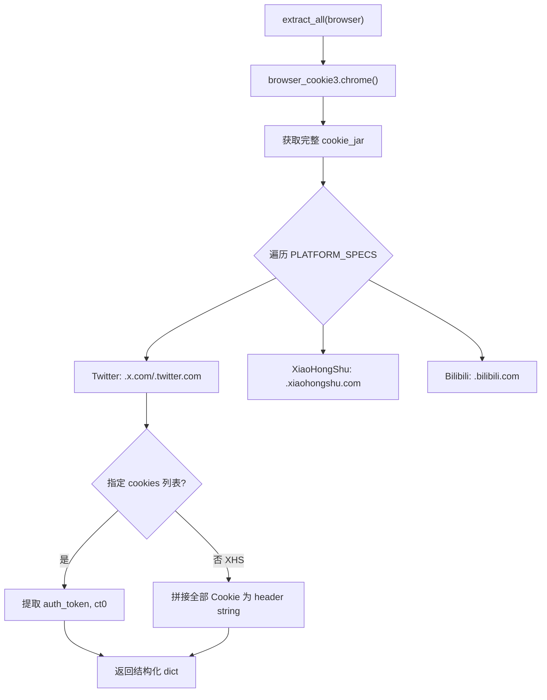

# PD-142.01 Agent Reach — YAML 凭据管理与浏览器 Cookie 自动提取

> 文档编号：PD-142.01
> 来源：Agent Reach `agent_reach/config.py` `agent_reach/cookie_extract.py` `agent_reach/doctor.py`
> GitHub：https://github.com/Panniantong/Agent-Reach.git
> 问题域：PD-142 凭据与密钥管理 Credential & Secret Management
> 状态：可复用方案

---

## 第 1 章 问题与动机

### 1.1 核心问题

Agent 系统需要访问多个外部平台（Twitter、GitHub、Reddit、Bilibili 等），每个平台有不同的认证方式——API Key、OAuth Token、浏览器 Cookie。这带来三个工程挑战：

1. **凭据分散**：不同平台的密钥散落在环境变量、配置文件、浏览器存储中，缺乏统一管理入口
2. **安全暴露**：日志输出、调试信息、状态报告中容易泄露完整密钥
3. **配置门槛**：用户需要手动从浏览器 DevTools 复制 Cookie，操作繁琐且易出错

Agent Reach 的凭据管理方案核心思想是：**零配置优先 + 渐进式解锁**。Tier 0 渠道开箱即用，Tier 1/2 渠道通过声明式映射告诉用户"缺什么"，并提供自动化手段（浏览器 Cookie 提取）降低配置门槛。

### 1.2 Agent Reach 的解法概述

1. **YAML 本地存储 + chmod 600**：凭据存储在 `~/.agent-reach/config.yaml`，写入时自动设置文件权限为 0o600（`config.py:55-58`）
2. **环境变量回退**：`Config.get()` 先查 YAML 文件，再查大写环境变量，实现双来源透明切换（`config.py:61-70`）
3. **FEATURE_REQUIREMENTS 声明式映射**：每个特性声明所需密钥列表，`is_configured()` 一次性检查完整性（`config.py:22-28`）
4. **browser_cookie3 自动提取**：从 Chrome/Firefox/Edge 等浏览器自动提取 Twitter、小红书、Bilibili 的 Cookie（`cookie_extract.py:38-112`）
5. **敏感值脱敏展示**：`to_dict()` 自动识别含 key/token/password/proxy 的字段，只显示前 8 字符（`config.py:94-102`）

### 1.3 设计思想

| 设计原则 | 具体实现 | 理由 | 替代方案 |
|----------|----------|------|----------|
| 零配置优先 | Tier 0 渠道无需任何密钥 | 降低首次使用门槛 | 全部要求 API Key |
| 声明式依赖 | FEATURE_REQUIREMENTS 字典映射 | 特性与密钥解耦，易扩展 | 硬编码 if-else 检查 |
| 最小权限 | 文件 chmod 600 + 脱敏展示 | 防止凭据泄露 | 加密存储（复杂度高） |
| 多来源透明 | YAML > 环境变量 优先级链 | 兼容容器部署和本地开发 | 只支持环境变量 |
| 自动化获取 | browser_cookie3 提取浏览器 Cookie | 消除手动复制 Cookie 的痛点 | 要求用户手动粘贴 |

---

## 第 2 章 源码实现分析

### 2.1 架构概览

Agent Reach 的凭据管理由三层组成：存储层（Config）、获取层（cookie_extract）、检查层（doctor）。

```
┌─────────────────────────────────────────────────────────┐
│                    CLI 入口 (cli.py)                     │
│  setup / configure / install / doctor                    │
├──────────┬──────────────────┬───────────────────────────┤
│          │                  │                            │
│  ┌───────▼───────┐  ┌──────▼──────┐  ┌────────────────┐│
│  │  Config 存储层 │  │ CookieExtract│  │  Doctor 检查层 ││
│  │  config.py    │  │ cookie_      │  │  doctor.py     ││
│  │               │  │ extract.py   │  │                ││
│  │ • YAML 读写   │  │ • 浏览器提取  │  │ • 渠道健康检查  ││
│  │ • 环境变量回退 │  │ • 多平台匹配  │  │ • 权限安全审计  ││
│  │ • 权限保护    │  │ • Cookie 解析 │  │ • Tier 分组报告 ││
│  │ • 脱敏展示    │  │              │  │                ││
│  └───────┬───────┘  └──────┬──────┘  └───────┬────────┘│
│          │                 │                  │         │
│  ┌───────▼─────────────────▼──────────────────▼───────┐ │
│  │         ~/.agent-reach/config.yaml (0o600)          │ │
│  └─────────────────────────────────────────────────────┘ │
│                                                          │
│  ┌──────────────────────────────────────────────────────┐│
│  │  Channel 层 (channels/*.py)                          ││
│  │  每个渠道声明 tier + check(config) 自检              ││
│  └──────────────────────────────────────────────────────┘│
└──────────────────────────────────────────────────────────┘
```

### 2.2 核心实现

#### 2.2.1 Config 存储与环境变量回退

```mermaid
graph TD
    A["Config.get(key)"] --> B{key 在 YAML 中?}
    B -->|是| C[返回 YAML 值]
    B -->|否| D{key.upper() 在环境变量中?}
    D -->|是| E[返回环境变量值]
    D -->|否| F[返回 default]
    G["Config.set(key, value)"] --> H[写入 self.data]
    H --> I["save() → yaml.dump"]
    I --> J["chmod 0o600"]
```

对应源码 `agent_reach/config.py:15-102`：

```python
class Config:
    """Manages Agent Reach configuration."""

    CONFIG_DIR = Path.home() / ".agent-reach"
    CONFIG_FILE = CONFIG_DIR / "config.yaml"

    # Feature → required config keys
    FEATURE_REQUIREMENTS = {
        "exa_search": ["exa_api_key"],
        "reddit_proxy": ["reddit_proxy"],
        "twitter_bird": ["twitter_auth_token", "twitter_ct0"],
        "groq_whisper": ["groq_api_key"],
        "github_token": ["github_token"],
    }

    def get(self, key: str, default: Any = None) -> Any:
        """Get a config value. Also checks environment variables (uppercase)."""
        if key in self.data:
            return self.data[key]
        env_val = os.environ.get(key.upper())
        if env_val:
            return env_val
        return default

    def save(self):
        """Save config to YAML file."""
        self._ensure_dir()
        with open(self.config_path, "w") as f:
            yaml.dump(self.data, f, default_flow_style=False, allow_unicode=True)
        try:
            import stat
            self.config_path.chmod(stat.S_IRUSR | stat.S_IWUSR)  # 0o600
        except OSError:
            pass  # Windows or permission edge cases

    def to_dict(self) -> dict:
        """Return config as dict (masks sensitive values)."""
        masked = {}
        for k, v in self.data.items():
            if any(s in k.lower() for s in ("key", "token", "password", "proxy")):
                masked[k] = f"{str(v)[:8]}..." if v else None
            else:
                masked[k] = v
        return masked
```

关键设计点：
- `save()` 每次写入后立即 `chmod 0o600`，确保即使文件被外部工具修改权限也能恢复（`config.py:55-58`）
- `get()` 的优先级链：YAML 文件 > 环境变量 > 默认值，环境变量名自动转大写（`config.py:67`）
- `to_dict()` 用子串匹配（key/token/password/proxy）识别敏感字段，只展示前 8 字符（`config.py:98`）

#### 2.2.2 浏览器 Cookie 自动提取



对应源码 `agent_reach/cookie_extract.py:16-112`：

```python
PLATFORM_SPECS = [
    {
        "name": "Twitter/X",
        "domains": [".x.com", ".twitter.com"],
        "cookies": ["auth_token", "ct0"],
        "config_key": "twitter",
    },
    {
        "name": "XiaoHongShu",
        "domains": [".xiaohongshu.com"],
        "cookies": None,  # None = grab all cookies as header string
        "config_key": "xhs",
    },
    {
        "name": "Bilibili",
        "domains": [".bilibili.com"],
        "cookies": ["SESSDATA", "bili_jct"],
        "config_key": "bilibili",
    },
]

def extract_all(browser: str = "chrome") -> Dict[str, dict]:
    browser_funcs = {
        "chrome": browser_cookie3.chrome,
        "firefox": browser_cookie3.firefox,
        "edge": browser_cookie3.edge,
        "brave": browser_cookie3.brave,
        "opera": browser_cookie3.opera,
    }
    cookie_jar = browser_funcs[browser]()

    results = {}
    for spec in PLATFORM_SPECS:
        for cookie in cookie_jar:
            domain_match = any(
                cookie.domain.endswith(d) or cookie.domain == d.lstrip(".")
                for d in spec["domains"]
            )
            if not domain_match:
                continue
            # ... 按 spec["cookies"] 是否为 None 分两种提取策略
    return results
```

关键设计点：
- `PLATFORM_SPECS` 用声明式数据结构定义每个平台需要的 Cookie，新增平台只需加一条 spec（`cookie_extract.py:16-35`）
- `cookies: None` 表示"抓取该域名下所有 Cookie 拼成 header string"，适用于小红书这类需要完整 Cookie 的平台（`cookie_extract.py:101-107`）
- 域名匹配用 `endswith` + `lstrip(".")` 双重检查，兼容带点和不带点的域名格式（`cookie_extract.py:88-91`）

### 2.3 实现细节

#### 声明式特性依赖检查

`FEATURE_REQUIREMENTS` 是整个凭据管理的核心数据结构。它将"特性名"映射到"所需配置键列表"，使得 `is_configured()` 和 `get_configured_features()` 可以用纯数据驱动的方式检查配置完整性：

```python
# config.py:82-92
def is_configured(self, feature: str) -> bool:
    required = self.FEATURE_REQUIREMENTS.get(feature, [])
    return all(self.get(k) for k in required)

def get_configured_features(self) -> dict:
    return {
        feature: self.is_configured(feature)
        for feature in self.FEATURE_REQUIREMENTS
    }
```

#### Doctor 安全审计

Doctor 不仅检查渠道可用性，还主动审计配置文件权限（`doctor.py:77-89`）：

```python
# doctor.py:77-89
config_path = Config.CONFIG_DIR / "config.yaml"
if config_path.exists():
    mode = config_path.stat().st_mode
    if mode & (stat.S_IRGRP | stat.S_IROTH):
        lines.append("⚠️  安全提示：config.yaml 权限过宽（其他用户可读）")
        lines.append("   修复：chmod 600 ~/.agent-reach/config.yaml")
```

#### 安装流程中的自动 Cookie 导入

`cli.py:171-193` 在本地环境安装时自动尝试从 Chrome 提取 Cookie，失败则回退到 Firefox：

```
install --env=local → 自动尝试 Chrome → 失败 → 尝试 Firefox → 失败 → 提示手动配置
```


---

## 第 3 章 迁移指南

### 3.1 迁移清单

**阶段 1：基础凭据存储（1 个文件）**
- [ ] 创建 `CredentialStore` 类，支持 YAML 读写 + chmod 600
- [ ] 实现 `get(key)` 的 YAML > 环境变量优先级链
- [ ] 实现 `to_dict()` 敏感值脱敏

**阶段 2：声明式特性映射（扩展 CredentialStore）**
- [ ] 定义 `FEATURE_REQUIREMENTS` 映射表
- [ ] 实现 `is_configured(feature)` 和 `get_configured_features()`

**阶段 3：浏览器 Cookie 提取（1 个文件）**
- [ ] 安装 `browser-cookie3` 依赖
- [ ] 定义 `PLATFORM_SPECS` 声明式平台规格
- [ ] 实现 `extract_all(browser)` 提取逻辑

**阶段 4：健康检查（可选）**
- [ ] 实现 Doctor 模块，遍历渠道检查凭据完整性
- [ ] 添加文件权限安全审计

### 3.2 适配代码模板

以下代码可直接复用，已从 Agent Reach 的实现中提炼为独立模块：

```python
"""credential_store.py — 可移植的凭据管理模块"""

import os
import stat
from pathlib import Path
from typing import Any, Dict, List, Optional

import yaml


class CredentialStore:
    """YAML-based credential store with env var fallback and masking."""

    SENSITIVE_PATTERNS = ("key", "token", "password", "secret", "proxy", "cookie")

    def __init__(
        self,
        app_name: str = "my-agent",
        feature_requirements: Optional[Dict[str, List[str]]] = None,
    ):
        self.config_dir = Path.home() / f".{app_name}"
        self.config_path = self.config_dir / "config.yaml"
        self.feature_requirements = feature_requirements or {}
        self.data: dict = {}
        self._ensure_dir()
        self._load()

    def _ensure_dir(self):
        self.config_dir.mkdir(parents=True, exist_ok=True)

    def _load(self):
        if self.config_path.exists():
            with open(self.config_path, "r") as f:
                self.data = yaml.safe_load(f) or {}

    def _save(self):
        self._ensure_dir()
        with open(self.config_path, "w") as f:
            yaml.dump(self.data, f, default_flow_style=False, allow_unicode=True)
        try:
            self.config_path.chmod(stat.S_IRUSR | stat.S_IWUSR)  # 0o600
        except OSError:
            pass

    def get(self, key: str, default: Any = None) -> Any:
        """YAML first, then uppercase env var."""
        if key in self.data:
            return self.data[key]
        env_val = os.environ.get(key.upper())
        if env_val:
            return env_val
        return default

    def set(self, key: str, value: Any):
        self.data[key] = value
        self._save()

    def delete(self, key: str):
        self.data.pop(key, None)
        self._save()

    def is_configured(self, feature: str) -> bool:
        required = self.feature_requirements.get(feature, [])
        return all(self.get(k) for k in required)

    def get_feature_status(self) -> Dict[str, bool]:
        return {f: self.is_configured(f) for f in self.feature_requirements}

    def to_safe_dict(self) -> dict:
        """Return config with sensitive values masked."""
        masked = {}
        for k, v in self.data.items():
            if any(s in k.lower() for s in self.SENSITIVE_PATTERNS):
                masked[k] = f"{str(v)[:8]}..." if v else None
            else:
                masked[k] = v
        return masked

    def check_permissions(self) -> Optional[str]:
        """Return warning message if config file has loose permissions."""
        if not self.config_path.exists():
            return None
        try:
            mode = self.config_path.stat().st_mode
            if mode & (stat.S_IRGRP | stat.S_IROTH):
                return (
                    f"Config file {self.config_path} is readable by other users. "
                    f"Fix: chmod 600 {self.config_path}"
                )
        except OSError:
            pass
        return None


# 使用示例
if __name__ == "__main__":
    store = CredentialStore(
        app_name="my-agent",
        feature_requirements={
            "search": ["search_api_key"],
            "twitter": ["twitter_auth_token", "twitter_ct0"],
        },
    )
    store.set("search_api_key", "sk-abc123456789")
    print(store.get_feature_status())   # {'search': True, 'twitter': False}
    print(store.to_safe_dict())         # {'search_api_key': 'sk-abc12...'}
    print(store.check_permissions())    # None or warning string
```

### 3.3 适用场景

| 场景 | 适用度 | 说明 |
|------|--------|------|
| 多平台 Agent（需管理 5+ 个 API Key） | ⭐⭐⭐ | FEATURE_REQUIREMENTS 声明式映射非常适合 |
| 本地 CLI 工具 | ⭐⭐⭐ | YAML + chmod 600 是 CLI 工具的标准做法 |
| 需要浏览器 Cookie 的爬虫/Agent | ⭐⭐⭐ | browser_cookie3 自动提取大幅降低配置门槛 |
| 容器化部署 | ⭐⭐ | 环境变量回退机制可用，但 YAML 文件需挂载 volume |
| 团队共享配置 | ⭐ | 单用户 YAML 不适合团队场景，需改用 Vault 等方案 |
| 需要加密存储的高安全场景 | ⭐ | 明文 YAML 不够安全，需引入 keyring 或 Vault |

---

## 第 4 章 测试用例

基于 Agent Reach 的真实测试（`tests/test_config.py`）扩展：

```python
"""test_credential_store.py — 凭据管理测试套件"""

import os
import stat
from pathlib import Path

import pytest
import yaml


class TestCredentialStore:
    """Tests for CredentialStore core functionality."""

    @pytest.fixture
    def store(self, tmp_path):
        """Create a CredentialStore with temp directory."""
        from credential_store import CredentialStore
        store = CredentialStore.__new__(CredentialStore)
        store.config_dir = tmp_path
        store.config_path = tmp_path / "config.yaml"
        store.feature_requirements = {
            "search": ["search_api_key"],
            "twitter": ["twitter_auth_token", "twitter_ct0"],
        }
        store.data = {}
        store.SENSITIVE_PATTERNS = ("key", "token", "password", "secret", "proxy", "cookie")
        return store

    # ── 正常路径 ──

    def test_set_and_get(self, store):
        store.set("test_key", "test_value")
        assert store.get("test_key") == "test_value"

    def test_get_default(self, store):
        assert store.get("nonexistent") is None
        assert store.get("nonexistent", "fallback") == "fallback"

    def test_env_var_fallback(self, store, monkeypatch):
        monkeypatch.setenv("MY_API_KEY", "from_env")
        assert store.get("my_api_key") == "from_env"

    def test_yaml_priority_over_env(self, store, monkeypatch):
        monkeypatch.setenv("MY_KEY", "from_env")
        store.data["my_key"] = "from_yaml"
        assert store.get("my_key") == "from_yaml"

    def test_is_configured_complete(self, store):
        store.data["search_api_key"] = "sk-123"
        assert store.is_configured("search") is True

    def test_is_configured_incomplete(self, store):
        store.data["twitter_auth_token"] = "tok"
        # Missing twitter_ct0
        assert store.is_configured("twitter") is False

    def test_feature_status(self, store):
        status = store.get_feature_status()
        assert status == {"search": False, "twitter": False}

    # ── 脱敏展示 ──

    def test_mask_sensitive_values(self, store):
        store.data["exa_api_key"] = "super-secret-key-12345"
        store.data["normal_setting"] = "visible"
        masked = store.to_safe_dict()
        assert masked["exa_api_key"] == "super-se..."
        assert masked["normal_setting"] == "visible"

    def test_mask_empty_value(self, store):
        store.data["api_key"] = None
        masked = store.to_safe_dict()
        assert masked["api_key"] is None

    # ── 边界情况 ──

    def test_delete_nonexistent_key(self, store):
        store.delete("does_not_exist")  # Should not raise

    def test_unknown_feature(self, store):
        assert store.is_configured("unknown_feature") is True  # No requirements = configured

    # ── 安全审计 ──

    def test_check_permissions_secure(self, store):
        store.config_path.write_text("test: value")
        store.config_path.chmod(stat.S_IRUSR | stat.S_IWUSR)
        assert store.check_permissions() is None

    def test_check_permissions_loose(self, store):
        store.config_path.write_text("test: value")
        store.config_path.chmod(stat.S_IRUSR | stat.S_IWUSR | stat.S_IRGRP)
        warning = store.check_permissions()
        assert warning is not None
        assert "readable by other users" in warning


class TestCookieExtract:
    """Tests for browser cookie extraction logic."""

    def test_domain_matching(self):
        """Verify domain matching logic from cookie_extract.py:88-91."""
        from unittest.mock import MagicMock

        # Simulate cookie with .x.com domain
        cookie = MagicMock()
        cookie.domain = ".x.com"
        domains = [".x.com", ".twitter.com"]

        match = any(
            cookie.domain.endswith(d) or cookie.domain == d.lstrip(".")
            for d in domains
        )
        assert match is True

    def test_platform_specs_structure(self):
        """Verify PLATFORM_SPECS has required fields."""
        from agent_reach.cookie_extract import PLATFORM_SPECS

        for spec in PLATFORM_SPECS:
            assert "name" in spec
            assert "domains" in spec
            assert "config_key" in spec
            assert isinstance(spec["domains"], list)
```


---

## 第 5 章 跨域关联

| 关联域 | 关系类型 | 说明 |
|--------|----------|------|
| PD-04 工具系统 | 依赖 | Channel 的 `check(config)` 依赖 Config 提供凭据，工具注册前需验证凭据完整性 |
| PD-09 Human-in-the-Loop | 协同 | `setup` 交互式向导是 HITL 的一种形式，用户决定配置哪些凭据 |
| PD-11 可观测性 | 协同 | Doctor 的健康检查报告可作为可观测性的一部分，展示渠道可用状态 |
| PD-141 可插拔渠道架构 | 强依赖 | 每个 Channel 的 `tier` 和 `check()` 直接消费 Config 中的凭据 |
| PD-143 环境检测与自动配置 | 协同 | `install --env=auto` 根据环境自动决定是否提取浏览器 Cookie |

---

## 第 6 章 来源文件索引

| 文件 | 行范围 | 关键实现 |
|------|--------|----------|
| `agent_reach/config.py` | L15-L102 | Config 类：YAML 存储、环境变量回退、chmod 600、脱敏展示 |
| `agent_reach/config.py` | L22-L28 | FEATURE_REQUIREMENTS 声明式特性-密钥映射 |
| `agent_reach/config.py` | L54-L58 | save() 中的 chmod 0o600 权限保护 |
| `agent_reach/config.py` | L61-L70 | get() 的 YAML > 环境变量优先级链 |
| `agent_reach/config.py` | L94-L102 | to_dict() 敏感值脱敏逻辑 |
| `agent_reach/cookie_extract.py` | L16-L35 | PLATFORM_SPECS 平台 Cookie 规格定义 |
| `agent_reach/cookie_extract.py` | L38-L112 | extract_all() 浏览器 Cookie 提取核心逻辑 |
| `agent_reach/cookie_extract.py` | L115-L166 | configure_from_browser() 提取并写入配置 |
| `agent_reach/doctor.py` | L12-L24 | check_all() 遍历渠道检查凭据状态 |
| `agent_reach/doctor.py` | L77-L89 | 配置文件权限安全审计 |
| `agent_reach/channels/base.py` | L18-L37 | Channel 基类：tier 分级 + check() 接口 |
| `agent_reach/channels/twitter.py` | L9-L38 | Twitter 渠道凭据检查示例 |
| `agent_reach/cli.py` | L551-L681 | _cmd_configure() 手动/自动凭据配置 |
| `agent_reach/cli.py` | L704-L750 | _cmd_setup() 交互式配置向导 |
| `agent_reach/cli.py` | L171-L193 | install 流程中的自动 Cookie 导入 |
| `tests/test_config.py` | L1-L81 | Config 单元测试（含脱敏、特性检查） |

---

## 第 7 章 横向对比维度

```json comparison_data
{
  "project": "Agent Reach",
  "dimensions": {
    "存储方式": "YAML 文件 ~/.agent-reach/config.yaml，chmod 600 权限保护",
    "获取机制": "YAML 优先 → 环境变量回退（自动大写），browser_cookie3 自动提取",
    "脱敏策略": "子串匹配 key/token/password/proxy，展示前 8 字符 + ...",
    "依赖声明": "FEATURE_REQUIREMENTS 字典映射特性名到所需密钥列表",
    "安全审计": "Doctor 主动检查 config.yaml 文件权限，警告过宽权限",
    "渐进解锁": "三级 Tier 体系：0=零配置 / 1=免费密钥 / 2=需配置"
  }
}
```

### 域元数据补充

```json domain_metadata
{
  "solution_summary": "Agent Reach 用 YAML+chmod600 本地存储凭据，FEATURE_REQUIREMENTS 声明式映射特性到密钥，browser_cookie3 自动提取浏览器 Cookie，Doctor 主动审计文件权限",
  "description": "凭据的渐进式解锁与自动化获取，降低多平台 Agent 的配置门槛",
  "sub_problems": [
    "凭据完整性的声明式检查",
    "安装流程中的自动凭据导入",
    "配置文件权限的运行时审计"
  ],
  "best_practices": [
    "save 后立即 chmod 确保权限不被外部修改",
    "Doctor 健康检查中集成安全审计",
    "Cookie 提取失败时自动回退到下一个浏览器"
  ]
}
```

