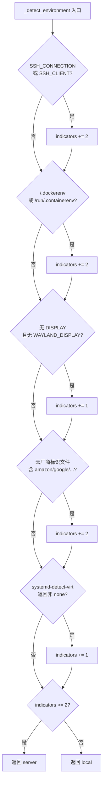
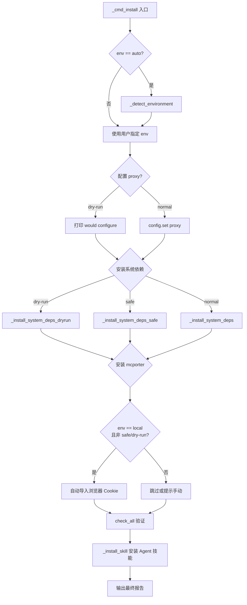
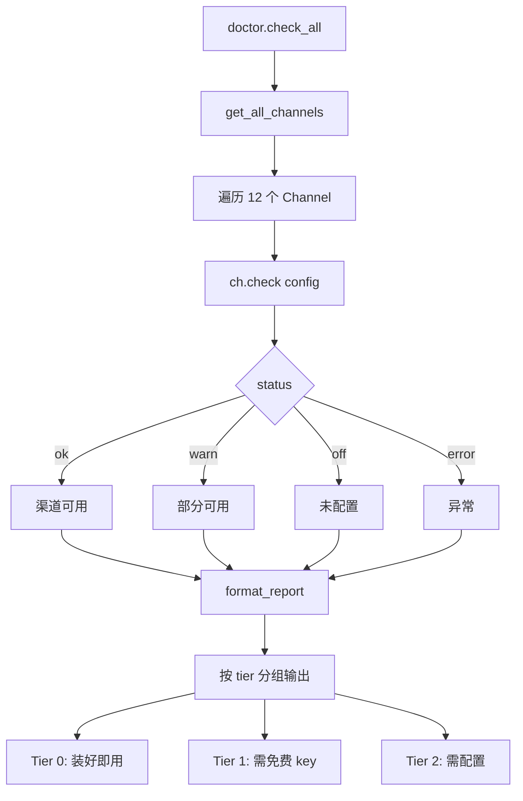

# PD-143.01 Agent Reach — 环境检测与一键安装

> 文档编号：PD-143.01
> 来源：Agent Reach `agent_reach/cli.py`, `agent_reach/doctor.py`, `agent_reach/config.py`
> GitHub：https://github.com/Panniantong/Agent-Reach.git
> 问题域：PD-143 环境检测与自动化安装 Environment Detection & Auto Setup
> 状态：可复用方案

---

## 第 1 章 问题与动机

### 1.1 核心问题

AI Agent 在实际部署时面临一个被严重低估的工程问题：**环境异构性**。同一个 Agent 可能运行在开发者的 MacBook、Linux 服务器、Docker 容器、云 VM 上，每种环境的依赖安装方式、可用工具、网络策略完全不同。

传统做法是写一份 README 让用户手动安装依赖，但这对 Agent 来说行不通——Agent 需要**自主判断环境并自动完成配置**，否则就会在第一步就卡住。

核心挑战包括：
- 如何区分本地开发机和远程服务器？（影响 Cookie 导入、代理配置等决策）
- 如何跨平台安装系统依赖（gh CLI、Node.js、bird CLI）而不破坏用户环境？
- 如何在自动化和安全之间取得平衡？（用户可能不希望 Agent 随意执行 `apt install`）
- 如何让安装过程可预览、可回滚、可诊断？

### 1.2 Agent Reach 的解法概述

Agent Reach 采用"**安装器 + 医生**"双模式架构，将环境检测与依赖安装解耦为独立的关注点：

1. **多信号环境探测** — `_detect_environment()` 通过 SSH 会话、Docker 标记、显示服务器、云厂商标识、systemd 虚拟化检测等 5 类信号综合评分，阈值 ≥2 判定为服务器（`cli.py:510-548`）
2. **三模式安装策略** — 正常模式自动安装、`--safe` 模式只报告不修改、`--dry-run` 模式预览所有操作（`cli.py:113-233`）
3. **Channel 自检体系** — 每个平台渠道（GitHub/Twitter/YouTube 等）实现 `check()` 方法自报健康状态，`doctor` 命令聚合所有渠道状态（`doctor.py:12-24`）
4. **浏览器 Cookie 自动导入** — 本地环境自动从 Chrome/Firefox 提取 Twitter、小红书、B站 Cookie（`cookie_extract.py:38-112`）
5. **MCP 服务自动发现与配置** — 自动安装 mcporter 并配置 Exa 搜索、检测本地 XiaoHongShu MCP 服务（`cli.py:424-492`）

### 1.3 设计思想

| 设计原则 | 具体实现 | 理由 | 替代方案 |
|----------|----------|------|----------|
| 信号加权投票 | 5 类环境信号各赋权重，累加 ≥2 判定为 server | 单一信号不可靠（如 SSH 可能是本地转发），多信号交叉验证提高准确率 | 硬编码 hostname 匹配、用户手动指定 |
| 渐进式安全 | normal → safe → dry-run 三级安全模式 | 不同用户对自动化的信任度不同，提供梯度选择 | 全自动或全手动二选一 |
| Channel 自治 | 每个渠道自己实现 `check()` 健康检查 | 新增渠道只需实现接口，不改动 doctor 核心逻辑 | 中心化的大 if-else 检查 |
| 配置双源 | YAML 文件优先，环境变量兜底 | 兼容手动配置和 CI/CD 环境变量注入 | 只支持文件或只支持环境变量 |
| 安装后验证 | 安装完立即运行 `check_all()` 验证 | 安装成功不等于可用，需要端到端验证 | 只检查二进制是否存在 |

---

## 第 2 章 源码实现分析

### 2.1 架构概览

Agent Reach 的核心架构是一个 CLI 驱动的安装器 + 诊断器，围绕 Channel 抽象构建：

```
┌─────────────────────────────────────────────────────────┐
│                    CLI (cli.py)                          │
│  install │ doctor │ configure │ setup │ watch            │
├──────────┬────────┬───────────┬───────┬─────────────────┤
│          │        │           │       │                  │
│  ┌───────▼──────┐ │  ┌────────▼─────┐ │  ┌────────────┐ │
│  │ _detect_env  │ │  │ Config       │ │  │ cookie_    │ │
│  │ (5 signals)  │ │  │ (YAML+env)   │ │  │ extract    │ │
│  └──────────────┘ │  └──────────────┘ │  └────────────┘ │
│                   │                   │                  │
│  ┌────────────────▼───────────────────▼──────────────┐  │
│  │              Doctor (doctor.py)                     │  │
│  │  check_all() → iterate ALL_CHANNELS → format_report│  │
│  └────────────────────────────────────────────────────┘  │
│                          │                               │
│  ┌───────────────────────▼───────────────────────────┐  │
│  │           Channel Registry (channels/)             │  │
│  │  GitHub │ Twitter │ YouTube │ Reddit │ Bilibili    │  │
│  │  XHS │ Douyin │ LinkedIn │ Boss │ RSS │ Exa │ Web  │  │
│  │  每个 Channel 实现 check() + can_handle()          │  │
│  └────────────────────────────────────────────────────┘  │
│                                                          │
│  ┌────────────────────────────────────────────────────┐  │
│  │         MCP Server (integrations/mcp_server.py)    │  │
│  │  expose get_status tool via MCP protocol           │  │
│  └────────────────────────────────────────────────────┘  │
└──────────────────────────────────────────────────────────┘
```

### 2.2 核心实现

#### 2.2.1 环境自动检测



对应源码 `agent_reach/cli.py:510-548`：

```python
def _detect_environment():
    """Auto-detect if running on local computer or server."""
    import os

    # Check common server indicators
    indicators = 0

    # SSH session
    if os.environ.get("SSH_CONNECTION") or os.environ.get("SSH_CLIENT"):
        indicators += 2

    # Docker / container
    if os.path.exists("/.dockerenv") or os.path.exists("/run/.containerenv"):
        indicators += 2

    # No display (headless)
    if not os.environ.get("DISPLAY") and not os.environ.get("WAYLAND_DISPLAY"):
        indicators += 1

    # Cloud VM identifiers
    for cloud_file in ["/sys/hypervisor/uuid", "/sys/class/dmi/id/product_name"]:
        if os.path.exists(cloud_file):
            try:
                content = open(cloud_file).read().lower()
                if any(x in content for x in ["amazon", "google", "microsoft",
                       "digitalocean", "linode", "vultr", "hetzner"]):
                    indicators += 2
            except:
                pass

    # systemd-detect-virt
    try:
        import subprocess
        result = subprocess.run(["systemd-detect-virt"],
                                capture_output=True, text=True, timeout=3)
        if result.returncode == 0 and result.stdout.strip() != "none":
            indicators += 1
    except:
        pass

    return "server" if indicators >= 2 else "local"
```

#### 2.2.2 三模式安装流水线



对应源码 `agent_reach/cli.py:113-233`，三模式分发的关键代码：

```python
def _cmd_install(args):
    """One-shot deterministic installer."""
    safe_mode = args.safe
    dry_run = args.dry_run
    config = Config()

    # Auto-detect environment
    env = args.env
    if env == "auto":
        env = _detect_environment()

    # ── Install system dependencies ──
    if dry_run:
        _install_system_deps_dryrun()
    elif safe_mode:
        _install_system_deps_safe()
    else:
        _install_system_deps()

    # ── mcporter (for Exa search + XiaoHongShu) ──
    if dry_run:
        print("📦 [dry-run] Would install mcporter and configure Exa search")
    elif safe_mode:
        _install_mcporter_safe()
    else:
        _install_mcporter()

    # Auto-import cookies on local computers
    if env == "local" and not safe_mode and not dry_run:
        from agent_reach.cookie_extract import configure_from_browser
        results = configure_from_browser("chrome", config)
        # ... fallback to firefox if chrome yields nothing
```

#### 2.2.3 Channel 自检体系



对应源码 `agent_reach/doctor.py:12-24` 和 `agent_reach/channels/base.py:18-37`：

```python
# doctor.py — 聚合所有渠道状态
def check_all(config: Config) -> Dict[str, dict]:
    results = {}
    for ch in get_all_channels():
        status, message = ch.check(config)
        results[ch.name] = {
            "status": status, "name": ch.description,
            "message": message, "tier": ch.tier, "backends": ch.backends,
        }
    return results

# channels/base.py — Channel 抽象基类
class Channel(ABC):
    name: str = ""
    description: str = ""
    backends: List[str] = []
    tier: int = 0  # 0=zero-config, 1=needs free key, 2=needs setup

    @abstractmethod
    def can_handle(self, url: str) -> bool: ...

    def check(self, config=None) -> Tuple[str, str]:
        return "ok", f"{'、'.join(self.backends) if self.backends else '内置'}"
```

### 2.3 实现细节

**配置双源查找**（`config.py:61-70`）：Config.get() 先查 YAML 文件，再查大写环境变量，实现配置文件与 CI/CD 环境变量的无缝兼容。

**安全文件权限**（`config.py:54-59`）：每次 save() 后自动 `chmod 0o600`，防止含凭据的配置文件被其他用户读取。doctor 报告中还会检查权限是否过宽（`doctor.py:78-89`）。

**跨平台依赖安装**（`cli.py:277-358`）：`_install_system_deps()` 按 `platform.system()` 分支处理 Linux（apt）和 macOS（brew），每个依赖先 `shutil.which()` 检查是否已存在，避免重复安装。安装失败不中断流程，而是打印替代方案提示。

**浏览器 Cookie 提取**（`cookie_extract.py:16-35`）：通过 `PLATFORM_SPECS` 声明式定义每个平台需要的 Cookie 名和域名匹配规则，`extract_all()` 一次遍历 cookie jar 完成所有平台的提取，避免多次读取浏览器数据库。

**Agent 技能自动安装**（`cli.py:236-274`）：安装完成后自动将 SKILL.md 部署到 `~/.openclaw/skills/`、`~/.claude/skills/`、`~/.agents/skills/` 等已知技能目录，让 Agent 立即获得使用指南。


---

## 第 3 章 迁移指南

### 3.1 迁移清单

将 Agent Reach 的环境检测与自动安装能力迁移到自己的 Agent 项目，分三个阶段：

**阶段 1：环境检测（1 个文件）**
- [ ] 移植 `_detect_environment()` 函数，根据项目需求调整信号权重
- [ ] 添加项目特有的环境信号（如特定目录是否存在、特定服务是否运行）

**阶段 2：依赖安装框架（2-3 个文件）**
- [ ] 定义依赖清单（类似 `_install_system_deps` 中的依赖列表）
- [ ] 实现三模式分发：normal / safe / dry-run
- [ ] 每个依赖实现"检查 → 安装 → 验证"三步

**阶段 3：健康检查体系（Channel 模式）**
- [ ] 定义 Channel 基类（`check()` + `can_handle()`）
- [ ] 为每个外部依赖实现 Channel 子类
- [ ] 实现 `doctor` 聚合命令和格式化报告

### 3.2 适配代码模板

#### 环境检测器（可直接复用）

```python
"""环境检测器 — 从 Agent Reach 迁移的多信号投票方案。"""
import os
import subprocess
from enum import Enum
from dataclasses import dataclass, field
from typing import List, Tuple


class EnvType(Enum):
    LOCAL = "local"
    SERVER = "server"
    CONTAINER = "container"


@dataclass
class EnvSignal:
    """单个环境信号的检测结果。"""
    name: str
    weight: int
    detected: bool
    detail: str = ""


def detect_environment(threshold: int = 2) -> Tuple[EnvType, List[EnvSignal]]:
    """
    多信号环境检测，返回环境类型和各信号详情。
    
    可自定义 threshold 调整灵敏度：
    - threshold=1: 激进判定（单个信号即判定为 server）
    - threshold=2: 默认（Agent Reach 的选择）
    - threshold=3: 保守判定（需要多个强信号）
    """
    signals: List[EnvSignal] = []
    
    # Signal 1: SSH session (weight=2)
    ssh = bool(os.environ.get("SSH_CONNECTION") or os.environ.get("SSH_CLIENT"))
    signals.append(EnvSignal("SSH Session", 2, ssh,
                             os.environ.get("SSH_CONNECTION", "")))
    
    # Signal 2: Container (weight=2)
    container = os.path.exists("/.dockerenv") or os.path.exists("/run/.containerenv")
    signals.append(EnvSignal("Container", 2, container))
    
    # Signal 3: Headless / no display (weight=1)
    headless = not os.environ.get("DISPLAY") and not os.environ.get("WAYLAND_DISPLAY")
    signals.append(EnvSignal("Headless", 1, headless))
    
    # Signal 4: Cloud VM (weight=2)
    cloud_providers = ["amazon", "google", "microsoft", "digitalocean",
                       "linode", "vultr", "hetzner"]
    cloud_detected = False
    cloud_detail = ""
    for path in ["/sys/hypervisor/uuid", "/sys/class/dmi/id/product_name"]:
        try:
            content = open(path).read().lower()
            for provider in cloud_providers:
                if provider in content:
                    cloud_detected = True
                    cloud_detail = f"{path}: {provider}"
                    break
        except (FileNotFoundError, PermissionError):
            pass
    signals.append(EnvSignal("Cloud VM", 2, cloud_detected, cloud_detail))
    
    # Signal 5: systemd-detect-virt (weight=1)
    virt_detected = False
    try:
        result = subprocess.run(["systemd-detect-virt"],
                                capture_output=True, text=True, timeout=3)
        if result.returncode == 0 and result.stdout.strip() != "none":
            virt_detected = True
    except (FileNotFoundError, subprocess.TimeoutExpired):
        pass
    signals.append(EnvSignal("Virtualization", 1, virt_detected))
    
    # 计算总分
    score = sum(s.weight for s in signals if s.detected)
    
    if container:
        env_type = EnvType.CONTAINER
    elif score >= threshold:
        env_type = EnvType.SERVER
    else:
        env_type = EnvType.LOCAL
    
    return env_type, signals
```

#### 三模式依赖安装器

```python
"""三模式依赖安装器 — normal / safe / dry-run。"""
import shutil
import subprocess
from dataclasses import dataclass
from typing import Callable, List, Optional


@dataclass
class Dependency:
    """一个系统依赖的定义。"""
    name: str
    binaries: List[str]          # 用于 shutil.which 检查
    install_cmd: str             # 自动安装命令
    install_hint: str            # safe 模式下的手动安装提示
    optional: bool = False       # 安装失败是否中断流程


class Installer:
    def __init__(self, deps: List[Dependency], mode: str = "normal"):
        assert mode in ("normal", "safe", "dry-run")
        self.deps = deps
        self.mode = mode
        self.results: List[dict] = []
    
    def run(self) -> List[dict]:
        for dep in self.deps:
            installed = any(shutil.which(b) for b in dep.binaries)
            
            if installed:
                self.results.append({"name": dep.name, "status": "exists"})
                continue
            
            if self.mode == "dry-run":
                self.results.append({
                    "name": dep.name, "status": "would_install",
                    "cmd": dep.install_cmd,
                })
            elif self.mode == "safe":
                self.results.append({
                    "name": dep.name, "status": "missing",
                    "hint": dep.install_hint,
                })
            else:  # normal
                try:
                    subprocess.run(dep.install_cmd, shell=True,
                                   capture_output=True, timeout=120)
                    verified = any(shutil.which(b) for b in dep.binaries)
                    self.results.append({
                        "name": dep.name,
                        "status": "installed" if verified else "failed",
                    })
                except Exception as e:
                    self.results.append({
                        "name": dep.name, "status": "failed", "error": str(e),
                    })
        
        return self.results
```

### 3.3 适用场景

| 场景 | 适用度 | 说明 |
|------|--------|------|
| Agent 工具链自动部署 | ⭐⭐⭐ | 核心场景：Agent 首次运行时自动安装所需工具 |
| CLI 工具的 `setup` 命令 | ⭐⭐⭐ | 任何需要检测环境并安装依赖的 CLI 工具 |
| CI/CD 环境初始化 | ⭐⭐ | 可用但需注意：CI 环境通常用 Docker 镜像预装依赖 |
| 桌面应用首次启动 | ⭐⭐ | 环境检测有用，但安装方式需适配 GUI 交互 |
| 纯云原生 / K8s 部署 | ⭐ | 容器镜像应在构建时完成依赖安装，运行时检测意义不大 |

---

## 第 4 章 测试用例

```python
"""基于 Agent Reach 真实函数签名的测试用例。"""
import os
import pytest
from unittest.mock import patch, MagicMock
from pathlib import Path


# ── 环境检测测试 ──

class TestDetectEnvironment:
    """测试 _detect_environment() 的多信号投票逻辑。"""

    def test_local_no_signals(self):
        """无任何服务器信号时应返回 local。"""
        with patch.dict(os.environ, {}, clear=True):
            with patch("os.path.exists", return_value=False):
                from agent_reach.cli import _detect_environment
                assert _detect_environment() == "local"

    def test_server_ssh_session(self):
        """SSH 会话（weight=2）应触发 server 判定。"""
        env = {"SSH_CONNECTION": "192.168.1.1 22 192.168.1.2 54321"}
        with patch.dict(os.environ, env, clear=True):
            with patch("os.path.exists", return_value=False):
                from agent_reach.cli import _detect_environment
                assert _detect_environment() == "server"

    def test_server_docker(self):
        """Docker 容器标记（weight=2）应触发 server 判定。"""
        def mock_exists(path):
            return path == "/.dockerenv"
        with patch.dict(os.environ, {}, clear=True):
            with patch("os.path.exists", side_effect=mock_exists):
                from agent_reach.cli import _detect_environment
                assert _detect_environment() == "server"

    def test_local_headless_only(self):
        """仅 headless（weight=1）不足以判定为 server。"""
        with patch.dict(os.environ, {}, clear=True):
            with patch("os.path.exists", return_value=False):
                from agent_reach.cli import _detect_environment
                # headless weight=1 < threshold=2
                assert _detect_environment() == "local"


# ── 配置系统测试 ──

class TestConfig:
    """测试 Config 的双源查找和安全特性。"""

    def test_yaml_priority_over_env(self, tmp_path, monkeypatch):
        """YAML 配置应优先于环境变量。"""
        from agent_reach.config import Config
        monkeypatch.setenv("MY_KEY", "from_env")
        config = Config(config_path=tmp_path / "config.yaml")
        config.set("my_key", "from_config")
        assert config.get("my_key") == "from_config"

    def test_env_fallback(self, tmp_path, monkeypatch):
        """YAML 中不存在时应回退到环境变量。"""
        from agent_reach.config import Config
        monkeypatch.setenv("TEST_KEY", "env_value")
        config = Config(config_path=tmp_path / "config.yaml")
        assert config.get("test_key") == "env_value"

    def test_sensitive_masking(self, tmp_path):
        """to_dict() 应遮蔽敏感字段。"""
        from agent_reach.config import Config
        config = Config(config_path=tmp_path / "config.yaml")
        config.set("exa_api_key", "super-secret-key-12345")
        masked = config.to_dict()
        assert masked["exa_api_key"] == "super-se..."

    def test_feature_requirements(self, tmp_path):
        """is_configured() 应检查所有必需 key。"""
        from agent_reach.config import Config
        config = Config(config_path=tmp_path / "config.yaml")
        assert not config.is_configured("twitter_bird")
        config.set("twitter_auth_token", "tok")
        assert not config.is_configured("twitter_bird")  # 还缺 ct0
        config.set("twitter_ct0", "ct0val")
        assert config.is_configured("twitter_bird")


# ── Doctor 健康检查测试 ──

class TestDoctor:
    """测试 Channel 自检体系。"""

    def test_check_all_returns_all_channels(self, tmp_path):
        """check_all 应返回所有注册渠道的状态。"""
        from agent_reach.config import Config
        from agent_reach.doctor import check_all
        config = Config(config_path=tmp_path / "config.yaml")
        results = check_all(config)
        assert "github" in results
        assert "twitter" in results
        assert "web" in results
        for name, r in results.items():
            assert r["status"] in ("ok", "warn", "off", "error")
            assert "tier" in r

    def test_format_report_grouped_by_tier(self, tmp_path):
        """报告应按 tier 分组显示。"""
        from agent_reach.config import Config
        from agent_reach.doctor import check_all, format_report
        config = Config(config_path=tmp_path / "config.yaml")
        results = check_all(config)
        report = format_report(results)
        assert "装好即用" in report
        assert "渠道可用" in report
```


---

## 第 5 章 跨域关联

| 关联域 | 关系类型 | 说明 |
|--------|----------|------|
| PD-04 工具系统 | 依赖 | Agent Reach 的 Channel 体系本质上是工具系统的一种实现——每个 Channel 对应一个上游工具（gh/bird/yt-dlp），`check()` 方法验证工具可用性 |
| PD-05 沙箱隔离 | 协同 | `--safe` 和 `--dry-run` 模式是沙箱思想在安装器中的体现：限制 Agent 对系统的修改权限 |
| PD-09 Human-in-the-Loop | 协同 | `--safe` 模式将自动安装降级为人工指引，`setup` 命令的交互式向导是典型的 HITL 模式 |
| PD-11 可观测性 | 协同 | `doctor` 命令和 `format_report()` 提供系统级可观测性，`watch` 命令支持定时健康监控 |
| PD-144 Agent 技能分发 | 依赖 | `_install_skill()` 将 SKILL.md 部署到多个 Agent 平台的技能目录，是技能分发的具体实现 |

---

## 第 6 章 来源文件索引

| 文件 | 行范围 | 关键实现 |
|------|--------|----------|
| `agent_reach/cli.py` | L36-108 | CLI 入口、argparse 定义（install/doctor/configure/setup 子命令） |
| `agent_reach/cli.py` | L113-233 | `_cmd_install()` 三模式安装主流程 |
| `agent_reach/cli.py` | L236-274 | `_install_skill()` Agent 技能自动部署 |
| `agent_reach/cli.py` | L277-358 | `_install_system_deps()` 跨平台依赖安装（gh/node/bird/undici） |
| `agent_reach/cli.py` | L374-401 | `_install_system_deps_safe()` 安全模式：只检查不安装 |
| `agent_reach/cli.py` | L404-422 | `_install_system_deps_dryrun()` 预览模式 |
| `agent_reach/cli.py` | L424-492 | `_install_mcporter()` MCP 服务安装与配置 |
| `agent_reach/cli.py` | L510-548 | `_detect_environment()` 5 信号环境检测 |
| `agent_reach/cli.py` | L551-681 | `_cmd_configure()` 配置管理（Cookie/proxy/token） |
| `agent_reach/cli.py` | L704-789 | `_cmd_setup()` 交互式配置向导 |
| `agent_reach/config.py` | L15-102 | Config 类：YAML 存储、环境变量兜底、敏感值遮蔽、权限控制 |
| `agent_reach/doctor.py` | L12-91 | check_all() 聚合检查 + format_report() 分层报告 |
| `agent_reach/channels/base.py` | L18-37 | Channel 抽象基类（name/description/backends/tier/check/can_handle） |
| `agent_reach/channels/__init__.py` | L25-38 | ALL_CHANNELS 注册表（12 个渠道） |
| `agent_reach/cookie_extract.py` | L16-166 | 浏览器 Cookie 提取（5 浏览器 × 3 平台） |
| `agent_reach/integrations/mcp_server.py` | L27-67 | MCP Server：暴露 get_status 工具 |

---

## 第 7 章 横向对比维度

```json comparison_data
{
  "project": "Agent Reach",
  "dimensions": {
    "检测方式": "5 类信号加权投票（SSH/Docker/Display/Cloud/Virt），阈值 ≥2 判定",
    "安装策略": "三模式分发：normal 自动装 / safe 只报告 / dry-run 预览",
    "依赖管理": "shutil.which 检查 + subprocess 安装 + 安装后验证，失败不中断",
    "健康检查": "Channel 自治模式，12 渠道各自实现 check()，doctor 聚合 + tier 分层报告",
    "凭据管理": "YAML 文件（chmod 600）+ 环境变量双源，browser_cookie3 自动提取",
    "MCP 集成": "mcporter 自动安装 + Exa/XHS MCP 服务发现与配置"
  }
}
```

### 域元数据补充

```json domain_metadata
{
  "solution_summary": "Agent Reach 用 5 类信号加权投票检测环境类型，三模式（normal/safe/dry-run）分发安装 gh/node/bird/mcporter 等依赖，Channel 自治健康检查 + browser_cookie3 自动导入凭据",
  "description": "Agent 工具链的自动化部署与运行时健康监控",
  "sub_problems": [
    "浏览器 Cookie 自动提取与多平台凭据注入",
    "Agent 技能文件跨平台自动部署",
    "安装后端到端验证与持续健康监控"
  ],
  "best_practices": [
    "Channel 自治模式：每个依赖自己实现健康检查接口",
    "安装后立即 check_all 端到端验证而非仅检查二进制存在",
    "配置文件自动 chmod 600 保护含凭据的敏感数据"
  ]
}
```

