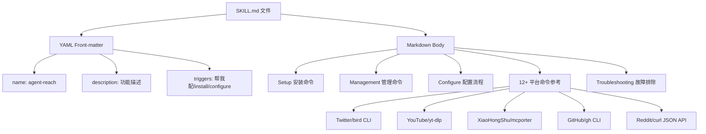
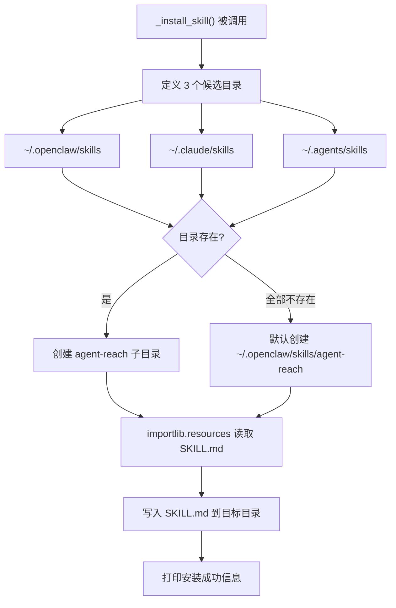

# PD-144.01 Agent Reach — SKILL.md 知识注入与多平台技能自动分发

> 文档编号：PD-144.01
> 来源：Agent Reach `agent_reach/skill/SKILL.md`, `agent_reach/cli.py`
> GitHub：https://github.com/Panniantong/Agent-Reach.git
> 问题域：PD-144 Agent 技能分发 Agent Skill Distribution
> 状态：可复用方案

---

## 第 1 章 问题与动机（≥ 30 行）

### 1.1 核心问题

AI Agent（Claude Code、Cursor、OpenClaw 等）本身不具备访问互联网平台的能力。即使底层工具（bird CLI、yt-dlp、mcporter 等）已安装，Agent 也不知道这些工具的存在、命令格式和使用场景。

传统做法是在每次对话中手动告诉 Agent 如何调用工具，或者在 system prompt 中硬编码工具说明。这带来三个问题：

1. **知识碎片化**：每个平台的命令、参数、故障排除分散在不同文档中，Agent 无法一次性获取
2. **平台不可移植**：为 Claude Code 写的 prompt 不能直接用于 Cursor 或 OpenClaw
3. **安装与知识脱节**：工具安装完成后，Agent 仍然不知道如何使用

Agent Reach 的核心洞察是：**技能 = 安装 + 知识注入**。光装工具不够，必须同时把"怎么用"写成 Agent 能理解的格式（SKILL.md），并自动放到 Agent 能读取的位置。

### 1.2 Agent Reach 的解法概述

1. **SKILL.md 作为知识载体**：一个 259 行的 Markdown 文件，包含 12+ 平台的完整命令参考、触发词定义、配置流程和故障排除指南（`agent_reach/skill/SKILL.md:1-259`）
2. **零包装层设计**：SKILL.md 教 Agent 直接调用上游工具（bird、yt-dlp、mcporter、gh、curl），不做二次封装，避免维护成本和性能损耗（`agent_reach/skill/SKILL.md:77-79`）
3. **多平台自动安装**：`_install_skill()` 函数自动检测 OpenClaw/Claude Code/通用 Agent 的 skills 目录，将 SKILL.md 复制到正确位置（`agent_reach/cli.py:236-274`）
4. **doctor 驱动的自愈**：SKILL.md 中明确指示 Agent 遇到问题时运行 `agent-reach doctor`，由 doctor 输出告诉 Agent 下一步该做什么（`agent_reach/skill/SKILL.md:46-54`）
5. **MCP Server 暴露状态**：通过 `mcp_server.py` 将 doctor 状态暴露为 MCP tool，支持 Agent 通过协议查询渠道状态（`agent_reach/integrations/mcp_server.py:36-56`）

### 1.3 设计思想

| 设计原则 | 具体实现 | 理由 | 替代方案 |
|----------|----------|------|----------|
| 知识即文件 | SKILL.md 纯 Markdown，无需解析器 | 所有 Agent 平台都能读 Markdown | JSON Schema / YAML 配置（需要解析器） |
| 零包装层 | 教 Agent 直接调 bird/yt-dlp/mcporter | 上游工具更新时无需同步修改 | 封装统一 API（维护成本高） |
| 自动发现安装 | 遍历已知 skills 目录列表 | 用户无需手动配置路径 | 环境变量指定路径（需用户操作） |
| doctor 自愈 | 所有故障排除指向 `agent-reach doctor` | 单一入口，Agent 不需记忆每个平台的修复方法 | 每个平台独立的 troubleshooting 文档 |
| 触发词双语 | 中英文触发词并列定义 | 覆盖中英文用户场景 | 仅英文触发词 |

---

## 第 2 章 源码实现分析（≥ 60 行，核心章节）

### 2.1 架构概览

Agent Reach 的技能分发架构分为三层：知识层（SKILL.md）、安装层（_install_skill）、诊断层（doctor + MCP）。

```
┌─────────────────────────────────────────────────────────┐
│                    AI Agent 运行时                        │
│  ┌──────────────┐  ┌──────────────┐  ┌───────────────┐  │
│  │ Claude Code  │  │   OpenClaw   │  │  通用 Agent   │  │
│  │ ~/.claude/   │  │ ~/.openclaw/ │  │ ~/.agents/    │  │
│  │  skills/     │  │  skills/     │  │  skills/      │  │
│  │   agent-     │  │   agent-     │  │   agent-      │  │
│  │   reach/     │  │   reach/     │  │   reach/      │  │
│  │   SKILL.md   │  │   SKILL.md   │  │   SKILL.md    │  │
│  └──────┬───────┘  └──────┬───────┘  └───────┬───────┘  │
│         │                 │                   │          │
│         └────────┬────────┴───────────────────┘          │
│                  ▼                                        │
│  ┌──────────────────────────────────────────────────┐    │
│  │          SKILL.md 知识内容                         │    │
│  │  ┌─────────┐ ┌──────────┐ ┌───────────────────┐  │    │
│  │  │ 触发词  │ │ 命令参考 │ │ 故障排除 → doctor │  │    │
│  │  └─────────┘ └──────────┘ └───────────────────┘  │    │
│  └──────────────────────────────────────────────────┘    │
│                  │                                        │
│                  ▼                                        │
│  ┌──────────────────────────────────────────────────┐    │
│  │          上游工具（Agent 直接调用）                 │    │
│  │  bird CLI · yt-dlp · mcporter · gh · curl/jina   │    │
│  └──────────────────────────────────────────────────┘    │
└─────────────────────────────────────────────────────────┘
```

### 2.2 核心实现

#### 2.2.1 SKILL.md 知识结构

SKILL.md 采用 YAML front-matter + Markdown body 的混合格式，前 12 行定义元数据和触发条件：



对应源码 `agent_reach/skill/SKILL.md:1-12`：

```yaml
---
name: agent-reach
description: >
  Give your AI agent eyes to see the entire internet. Install and configure
  upstream tools for Twitter/X, Reddit, YouTube, GitHub, Bilibili, XiaoHongShu,
  Douyin, LinkedIn, Boss直聘, RSS, and any web page — then call them directly.
  Use when: (1) setting up platform access tools for the first time,
  (2) checking which platforms are available,
  (3) user asks to configure/enable a platform channel.
  Triggers: "帮我配", "帮我添加", "帮我安装", "agent reach", "install channels",
  "configure twitter", "enable reddit".
---
```

关键设计：`description` 字段同时包含功能说明、使用场景（Use when）和触发词（Triggers），让 Agent 平台的 skill 匹配引擎能准确识别何时激活此技能。

#### 2.2.2 多平台自动安装机制



对应源码 `agent_reach/cli.py:236-274`：

```python
def _install_skill():
    """Install Agent Reach as an agent skill (OpenClaw / Claude Code)."""
    import os
    import importlib.resources

    # Determine skill install path
    skill_dirs = [
        os.path.expanduser("~/.openclaw/skills"),   # OpenClaw
        os.path.expanduser("~/.claude/skills"),      # Claude Code
        os.path.expanduser("~/.agents/skills"),      # Generic agents
    ]

    installed = False
    for skill_dir in skill_dirs:
        if os.path.isdir(skill_dir):
            target = os.path.join(skill_dir, "agent-reach")
            try:
                os.makedirs(target, exist_ok=True)
                skill_md = importlib.resources.files("agent_reach").joinpath(
                    "skill", "SKILL.md"
                ).read_text()
                with open(os.path.join(target, "SKILL.md"), "w") as f:
                    f.write(skill_md)
                platform_name = (
                    "OpenClaw" if "openclaw" in skill_dir
                    else "Claude Code" if "claude" in skill_dir
                    else "Agent"
                )
                print(f"🧩 Skill installed for {platform_name}: {target}")
                installed = True
            except Exception:
                pass

    if not installed:
        target = os.path.expanduser("~/.openclaw/skills/agent-reach")
        try:
            os.makedirs(target, exist_ok=True)
            skill_md = importlib.resources.files("agent_reach").joinpath(
                "skill", "SKILL.md"
            ).read_text()
            with open(os.path.join(target, "SKILL.md"), "w") as f:
                f.write(skill_md)
            print(f"🧩 Skill installed: {target}")
        except Exception:
            print("  ⬜ Could not install agent skill (optional)")
```

核心设计点：
- 使用 `importlib.resources` 从 Python 包内读取 SKILL.md，确保 pip 安装后文件可用（`cli.py:255`）
- 遍历所有已知 Agent 平台目录，**全部安装**而非只安装第一个匹配的（`cli.py:249-262`）
- fallback 到 OpenClaw 作为默认平台（`cli.py:265-274`）
- `pyproject.toml:60-62` 中 `force-include` 确保 skill 目录被打包进 wheel

### 2.3 实现细节

#### Channel 抽象与 Doctor 诊断

每个平台实现为一个 Channel 子类，提供 `check(config)` 方法返回 `(status, message)` 元组。Doctor 遍历所有 Channel 收集状态，按 tier 分组输出。

Channel 基类定义（`agent_reach/channels/base.py:18-37`）：

```python
class Channel(ABC):
    name: str = ""                    # e.g. "youtube"
    description: str = ""             # e.g. "YouTube 视频和字幕"
    backends: List[str] = []          # e.g. ["yt-dlp"]
    tier: int = 0                     # 0=zero-config, 1=needs free key, 2=needs setup

    @abstractmethod
    def can_handle(self, url: str) -> bool: ...

    def check(self, config=None) -> Tuple[str, str]:
        return "ok", f"{'、'.join(self.backends) if self.backends else '内置'}"
```

Channel 注册表（`agent_reach/channels/__init__.py:25-38`）使用静态列表注册 12 个 Channel 实例，`get_all_channels()` 返回全部。

Doctor 的 `format_report()` 按 tier 分三层输出（`agent_reach/doctor.py:27-91`）：
- Tier 0：装好即用（Web、YouTube、RSS、GitHub）
- Tier 1：需要 mcporter（Exa Search、XiaoHongShu）
- Tier 2：需要配置（Twitter cookies、代理等）

这个分层设计让 SKILL.md 中的 `agent-reach doctor` 指令能输出结构化的、Agent 可解析的状态报告，Agent 据此决定下一步操作。

#### 配置安全性

Config 类在保存时自动设置 `0o600` 权限（`agent_reach/config.py:55-59`），Doctor 在报告末尾检查配置文件权限是否过宽（`agent_reach/doctor.py:78-89`）。这确保了 Cookie 等敏感信息不会被其他用户读取。

#### SKILL.md 中的"不要记忆"原则

SKILL.md 第 44-54 行明确指示 Agent：

> **Do NOT memorize per-channel steps.** Always rely on `doctor` output.

这是一个关键设计决策——不让 Agent 缓存平台配置步骤，而是每次都通过 `doctor` 获取最新状态。这样当上游工具更新或平台变化时，只需更新 doctor 的检查逻辑，SKILL.md 本身不需要修改。


---

## 第 3 章 迁移指南（≥ 40 行）

### 3.1 迁移清单

将 Agent Reach 的技能分发模式迁移到自己的项目，需要完成以下步骤：

**阶段 1：知识文件编写**
- [ ] 创建 `your_project/skill/SKILL.md`，包含 YAML front-matter（name、description、triggers）
- [ ] 在 description 中定义 Use when 场景和 Triggers 触发词（中英文）
- [ ] 编写所有上游工具的完整命令参考（不是链接，是实际命令）
- [ ] 添加 Troubleshooting 章节，所有故障指向单一诊断命令

**阶段 2：自动安装机制**
- [ ] 在 `pyproject.toml` 中 `force-include` 确保 skill 目录被打包
- [ ] 实现 `_install_skill()` 函数，遍历已知 Agent 平台的 skills 目录
- [ ] 使用 `importlib.resources` 从包内读取 SKILL.md
- [ ] 在 `install` 命令末尾自动调用 `_install_skill()`

**阶段 3：诊断系统**
- [ ] 实现 Channel 抽象基类，每个平台一个子类
- [ ] 实现 `doctor` 命令，按 tier 分层输出状态
- [ ] 在 SKILL.md 中引导 Agent 使用 `doctor` 而非记忆具体步骤

### 3.2 适配代码模板

以下是一个最小可运行的技能分发实现：

```python
"""Minimal skill distribution — install SKILL.md to agent platforms."""
import os
import importlib.resources
from pathlib import Path
from typing import List, Tuple

# ── 1. 已知 Agent 平台的 skills 目录 ──
AGENT_SKILL_DIRS = [
    Path.home() / ".openclaw" / "skills",
    Path.home() / ".claude" / "skills",
    Path.home() / ".agents" / "skills",
    # 可扩展：Cursor、Windsurf 等
]

def install_skill(package_name: str, skill_filename: str = "SKILL.md") -> List[Tuple[str, bool]]:
    """
    将 SKILL.md 从 Python 包安装到所有已知 Agent 平台。
    
    Args:
        package_name: Python 包名（如 "agent_reach"）
        skill_filename: 技能文件名（默认 "SKILL.md"）
    
    Returns:
        [(平台名, 是否成功), ...]
    """
    # 从包内读取 SKILL.md
    skill_content = (
        importlib.resources.files(package_name)
        .joinpath("skill", skill_filename)
        .read_text(encoding="utf-8")
    )
    
    results = []
    installed_any = False
    
    for skill_dir in AGENT_SKILL_DIRS:
        if skill_dir.is_dir():
            target = skill_dir / package_name.replace("_", "-")
            try:
                target.mkdir(parents=True, exist_ok=True)
                (target / skill_filename).write_text(skill_content, encoding="utf-8")
                platform = _detect_platform(skill_dir)
                results.append((platform, True))
                installed_any = True
            except Exception as e:
                results.append((_detect_platform(skill_dir), False))
    
    # Fallback：如果没有任何已知目录，创建 OpenClaw 默认目录
    if not installed_any:
        fallback = Path.home() / ".openclaw" / "skills" / package_name.replace("_", "-")
        try:
            fallback.mkdir(parents=True, exist_ok=True)
            (fallback / skill_filename).write_text(skill_content, encoding="utf-8")
            results.append(("OpenClaw (default)", True))
        except Exception:
            results.append(("OpenClaw (default)", False))
    
    return results

def _detect_platform(skill_dir: Path) -> str:
    """根据目录路径推断 Agent 平台名。"""
    path_str = str(skill_dir).lower()
    if "openclaw" in path_str:
        return "OpenClaw"
    elif "claude" in path_str:
        return "Claude Code"
    elif "cursor" in path_str:
        return "Cursor"
    return "Generic Agent"


# ── 2. SKILL.md 模板 ──
SKILL_TEMPLATE = """---
name: {project_name}
description: >
  {description}
  Use when: {use_when}
  Triggers: {triggers}
---

# {project_name}

{body}

## Troubleshooting

Run `{cli_name} doctor` for diagnosis.
"""
```

### 3.3 适用场景

| 场景 | 适用度 | 说明 |
|------|--------|------|
| CLI 工具需要被 Agent 调用 | ⭐⭐⭐ | 最佳场景：工具已有 CLI，只需教 Agent 怎么用 |
| MCP Server 需要被发现 | ⭐⭐⭐ | SKILL.md 可包含 MCP 端点和调用示例 |
| 多 Agent 平台统一分发 | ⭐⭐⭐ | 一次编写，自动安装到所有平台 |
| 复杂 API 需要 Agent 学习 | ⭐⭐ | 适合，但命令参考可能很长 |
| 纯 Python 库（无 CLI） | ⭐ | 不太适合，Agent 通常通过 CLI/MCP 调用工具 |

---

## 第 4 章 测试用例（≥ 20 行）

```python
"""Tests for Agent Reach skill distribution mechanism."""
import os
import pytest
from pathlib import Path
from unittest.mock import patch, MagicMock


class TestSkillInstall:
    """Test _install_skill() multi-platform installation."""

    def test_install_to_existing_openclaw_dir(self, tmp_path):
        """When ~/.openclaw/skills exists, SKILL.md should be installed there."""
        openclaw_dir = tmp_path / ".openclaw" / "skills"
        openclaw_dir.mkdir(parents=True)
        
        skill_dirs = [str(openclaw_dir)]
        
        # Simulate _install_skill logic
        for skill_dir in skill_dirs:
            if os.path.isdir(skill_dir):
                target = os.path.join(skill_dir, "agent-reach")
                os.makedirs(target, exist_ok=True)
                skill_path = os.path.join(target, "SKILL.md")
                with open(skill_path, "w") as f:
                    f.write("# Test SKILL.md\n")
                assert os.path.exists(skill_path)
                content = open(skill_path).read()
                assert "SKILL.md" in content

    def test_install_to_multiple_platforms(self, tmp_path):
        """When multiple platform dirs exist, install to ALL of them."""
        platforms = [".openclaw/skills", ".claude/skills", ".agents/skills"]
        for p in platforms:
            (tmp_path / p).mkdir(parents=True)
        
        installed_count = 0
        for p in platforms:
            skill_dir = str(tmp_path / p)
            if os.path.isdir(skill_dir):
                target = os.path.join(skill_dir, "agent-reach")
                os.makedirs(target, exist_ok=True)
                with open(os.path.join(target, "SKILL.md"), "w") as f:
                    f.write("# SKILL\n")
                installed_count += 1
        
        assert installed_count == 3  # All three platforms

    def test_fallback_creates_openclaw_default(self, tmp_path):
        """When no known dirs exist, create OpenClaw dir as default."""
        # No existing dirs
        default_target = tmp_path / ".openclaw" / "skills" / "agent-reach"
        default_target.mkdir(parents=True)
        skill_path = default_target / "SKILL.md"
        skill_path.write_text("# Fallback SKILL\n")
        
        assert skill_path.exists()

    def test_skill_md_has_yaml_frontmatter(self):
        """SKILL.md must have YAML front-matter with required fields."""
        import importlib.resources
        skill_md = (
            importlib.resources.files("agent_reach")
            .joinpath("skill", "SKILL.md")
            .read_text()
        )
        assert skill_md.startswith("---")
        assert "name:" in skill_md
        assert "description:" in skill_md
        assert "Triggers:" in skill_md

    def test_skill_md_contains_upstream_commands(self):
        """SKILL.md must contain actual CLI commands, not just descriptions."""
        import importlib.resources
        skill_md = (
            importlib.resources.files("agent_reach")
            .joinpath("skill", "SKILL.md")
            .read_text()
        )
        # Must contain actual executable commands
        assert "bird search" in skill_md
        assert "yt-dlp" in skill_md
        assert "mcporter call" in skill_md
        assert "gh search" in skill_md
        assert "curl" in skill_md


class TestDoctorDrivenSelfHeal:
    """Test that doctor output guides Agent actions."""

    def test_doctor_returns_structured_status(self, tmp_path):
        from agent_reach.config import Config
        from agent_reach.doctor import check_all
        
        config = Config(config_path=tmp_path / "config.yaml")
        results = check_all(config)
        
        assert isinstance(results, dict)
        for key, val in results.items():
            assert "status" in val
            assert val["status"] in ("ok", "warn", "off", "error")
            assert "message" in val
            assert "tier" in val

    def test_doctor_report_contains_actionable_hints(self, tmp_path):
        from agent_reach.config import Config
        from agent_reach.doctor import check_all, format_report
        
        config = Config(config_path=tmp_path / "config.yaml")
        results = check_all(config)
        report = format_report(results)
        
        # Report should contain tier labels
        assert "装好即用" in report
        # Report should contain status indicators
        assert any(s in report for s in ["✅", "⚠️", "⬜", "❌"])
```


---

## 第 5 章 跨域关联

| 关联域 | 关系类型 | 说明 |
|--------|----------|------|
| PD-04 工具系统 | 依赖 | SKILL.md 本质是工具系统的知识层；Agent Reach 的 Channel 抽象与 PD-04 的工具注册模式同构 |
| PD-09 Human-in-the-Loop | 协同 | Cookie 配置、代理设置等需要人类参与的步骤，SKILL.md 中有明确的人机交互流程定义 |
| PD-11 可观测性 | 协同 | doctor 命令提供渠道级健康检查，是可观测性在工具层的具体实现 |
| PD-06 记忆持久化 | 协同 | Config 类将 API Key、Cookie 等持久化到 `~/.agent-reach/config.yaml`，是技能配置的记忆层 |
| PD-141 可插拔渠道架构 | 依赖 | Agent Reach 的 Channel 注册表是可插拔架构的实例，SKILL.md 的命令参考依赖渠道的实际实现 |

---

## 第 6 章 来源文件索引

| 文件 | 行范围 | 关键实现 |
|------|--------|----------|
| `agent_reach/skill/SKILL.md` | L1-L259 | 完整技能知识文件：YAML front-matter + 12 平台命令参考 + 故障排除 |
| `agent_reach/cli.py` | L236-L274 | `_install_skill()` 多平台自动安装逻辑 |
| `agent_reach/cli.py` | L113-L233 | `_cmd_install()` 一键安装流程，末尾调用 `_install_skill()` |
| `agent_reach/channels/base.py` | L18-L37 | Channel 抽象基类：name/description/backends/tier + check() |
| `agent_reach/channels/__init__.py` | L25-L38 | 12 个 Channel 实例的静态注册表 |
| `agent_reach/doctor.py` | L12-L24 | `check_all()` 遍历所有 Channel 收集状态 |
| `agent_reach/doctor.py` | L27-L91 | `format_report()` 按 tier 分层格式化输出 |
| `agent_reach/config.py` | L15-L102 | Config 类：YAML 持久化 + 环境变量回退 + 0o600 权限保护 |
| `agent_reach/integrations/mcp_server.py` | L27-L57 | MCP Server：将 doctor 状态暴露为 `get_status` tool |
| `agent_reach/cookie_extract.py` | L16-L35 | PLATFORM_SPECS：平台 Cookie 规格定义 |
| `agent_reach/cookie_extract.py` | L38-L112 | `extract_all()` 从浏览器自动提取多平台 Cookie |
| `pyproject.toml` | L57-L62 | `force-include` 确保 skill/ 和 guides/ 目录被打包 |

---

## 第 7 章 横向对比维度

> **重要：** 本章用于自动填充 Butcher Wiki 的横向对比表。

```json comparison_data
{
  "project": "Agent-Reach",
  "dimensions": {
    "知识载体": "SKILL.md 纯 Markdown + YAML front-matter，259 行覆盖 12 平台",
    "安装机制": "遍历 3 个已知 Agent 平台 skills 目录，全部安装 + OpenClaw fallback",
    "工具调用方式": "零包装层：SKILL.md 教 Agent 直接调用上游 CLI（bird/yt-dlp/mcporter/gh）",
    "诊断自愈": "doctor 命令按 tier 分层输出状态，SKILL.md 指示 Agent 不记忆而依赖 doctor",
    "触发词设计": "YAML front-matter 中定义中英文触发词，覆盖配置/安装/启用场景",
    "平台覆盖": "OpenClaw + Claude Code + 通用 Agent 三平台自动检测安装"
  }
}
```

### 域元数据补充

```json domain_metadata
{
  "solution_summary": "Agent Reach 通过 SKILL.md（YAML front-matter + 12 平台命令参考）向 Agent 注入工具知识，_install_skill() 自动检测并安装到 OpenClaw/Claude Code/通用 Agent 的 skills 目录，配合 doctor 命令实现 Agent 自愈式故障排除",
  "description": "技能分发的核心是知识注入而非工具封装，Agent 应直接调用上游工具",
  "sub_problems": [
    "零包装层设计与上游工具版本跟踪",
    "doctor 驱动的 Agent 自愈式故障排除",
    "配置文件权限安全（Cookie/Token 保护）"
  ],
  "best_practices": [
    "SKILL.md 指示 Agent 不记忆步骤而依赖 doctor 实时输出",
    "importlib.resources 从 pip 包内读取技能文件确保分发一致性",
    "pyproject.toml force-include 确保 skill 目录被打包进 wheel"
  ]
}
```

