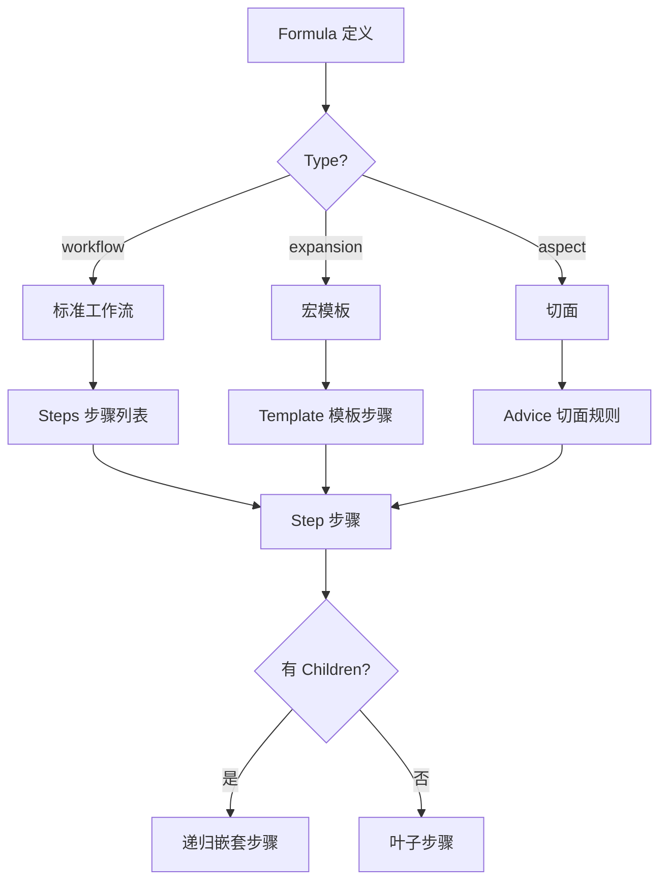
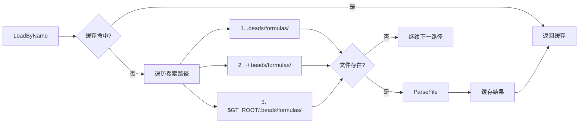
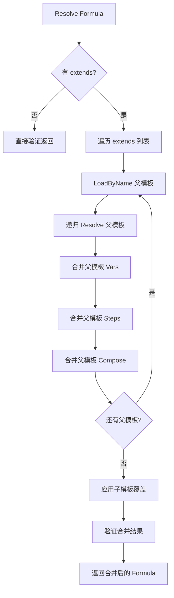
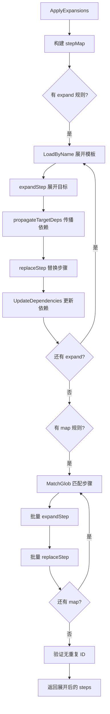

# PD-145.01 beads — Formula 声明式工作流引擎

> 文档编号：PD-145.01
> 来源：beads `internal/formula/types.go`, `internal/formula/parser.go`, `internal/formula/expand.go`
> GitHub：https://github.com/steveyegge/beads.git
> 问题域：PD-145 声明式工作流引擎 Declarative Workflow Engine
> 状态：可复用方案

---

## 第 1 章 问题与动机

### 1.1 核心问题

Agent 工程中的工作流编排面临三大挑战：

1. **可复用性困境** — 工作流逻辑硬编码在代码中，无法跨项目复用，每次都要重写相似的步骤编排
2. **组合性缺失** — 无法将小的工作流模板组合成复杂流程，缺乏继承、扩展、切面等组合机制
3. **可读性差** — 用 Python/TypeScript 代码定义工作流，非技术人员无法参与编写和维护

这些问题导致 Agent 工程的工作流管理成本高、迭代慢、难以标准化。

### 1.2 beads 的解法概述

beads 通过 **Formula 系统** 实现声明式工作流引擎，核心特性：

1. **TOML/JSON 声明式定义** (`internal/formula/types.go:60-109`) — 用 TOML 格式定义工作流模板，支持变量、步骤、依赖、条件分支，可读性强
2. **三层搜索路径** (`internal/formula/parser.go:56-76`) — 支持 project/user/orchestrator 三级搜索路径，实现工作流模板的层级复用
3. **模板继承机制** (`internal/formula/parser.go:158-238`) — 通过 `extends` 字段实现多继承，子模板可覆盖父模板的变量和步骤
4. **宏展开系统** (`internal/formula/expand.go:34-164`) — 支持 expand/map 操作符，将模板步骤内联展开，实现工作流的组合式构建
5. **变量验证与默认值** (`internal/formula/parser.go:362-416`) — 支持变量的 required/default/enum/pattern 约束，确保工作流实例化时参数正确

### 1.3 设计思想

| 设计原则 | 具体实现 | 理由 | 替代方案 |
|----------|----------|------|----------|
| 声明式优先 | TOML/JSON 格式定义工作流，支持 `{{variable}}` 模板语法 (`types.go:60-109`) | 降低编写门槛，非程序员也能维护工作流模板 | YAML（可读性略差）、DSL（学习成本高） |
| 层级搜索路径 | project → user → orchestrator 三级搜索 (`parser.go:56-76`) | 支持项目级定制、用户级偏好、组织级标准的优先级覆盖 | 单一路径（无法分层复用）、环境变量配置（不够直观） |
| 模板继承 | `extends: ["parent1", "parent2"]` 多继承，子覆盖父 (`parser.go:182-238`) | 避免重复定义，支持工作流模板的渐进式扩展 | 组合模式（需要手动合并）、Mixin（Go 不支持） |
| 宏展开 | expand/map 操作符，将模板步骤内联替换 (`expand.go:34-164`) | 实现工作流的组合式构建，一个步骤可展开为多个子步骤 | 运行时动态生成（难以调试）、硬编码（无法复用） |
| 变量约束 | required/default/enum/pattern 四种约束 (`parser.go:362-416`) | 在实例化时提前验证参数，避免运行时错误 | 运行时校验（错误发现晚）、无校验（容易出错） |

---

## 第 2 章 源码实现分析

### 2.1 架构概览

beads Formula 系统采用 **三阶段架构**：Rig（组合） → Cook（展开） → Run（执行）

```
┌─────────────────────────────────────────────────────────────┐
│                    Formula 系统架构                          │
├─────────────────────────────────────────────────────────────┤
│                                                              │
│  [1] Rig 阶段 (组合)                                         │
│      ┌──────────────┐                                        │
│      │ .formula.toml│ ──extends──> Parent Formulas          │
│      └──────────────┘                                        │
│            │                                                 │
│            v                                                 │
│      Parser.Resolve() ──> 合并继承链                         │
│                                                              │
│  [2] Cook 阶段 (展开)                                        │
│      ┌──────────────┐                                        │
│      │ Merged Formula│                                       │
│      └──────────────┘                                        │
│            │                                                 │
│            v                                                 │
│      ApplyExpansions() ──> 宏展开 (expand/map)               │
│            │                                                 │
│            v                                                 │
│      ApplyInlineExpansions() ──> 内联展开                    │
│            │                                                 │
│            v                                                 │
│      ValidateVars() ──> 变量验证                             │
│                                                              │
│  [3] Run 阶段 (执行)                                         │
│      ┌──────────────┐                                        │
│      │ Cooked Steps │ ──> Agent 执行引擎                     │
│      └──────────────┘                                        │
│                                                              │
└─────────────────────────────────────────────────────────────┘
```

**关键组件关系：**

- **Parser** (`parser.go:21-38`) — 负责加载和解析 Formula 文件，管理搜索路径和缓存
- **Formula** (`types.go:60-109`) — 核心数据结构，包含 vars/steps/extends/compose 等字段
- **Step** (`types.go:179-255`) — 工作流步骤定义，支持依赖、条件、嵌套子步骤
- **Expander** (`expand.go`) — 宏展开引擎，处理 expand/map 操作符

### 2.2 核心实现

#### 2.2.1 Formula 数据结构



对应源码 `internal/formula/types.go:60-109`：

```go
// Formula 是 .formula.json/.formula.toml 文件的根结构
type Formula struct {
	// Formula 是唯一标识符/名称
	// 约定：mol-<name> 用于分子模板，exp-<name> 用于展开模板
	Formula string `json:"formula"`

	// Description 说明这个 formula 的用途
	Description string `json:"description,omitempty"`

	// Version 是 schema 版本（当前为 1）
	Version int `json:"version"`

	// Type 分类：workflow（工作流）、expansion（展开模板）、aspect（切面）
	Type FormulaType `json:"type"`

	// Extends 是父 formula 列表，用于继承
	// 子 formula 继承所有 vars、steps 和 compose 规则
	// 子定义会覆盖同 ID 的父定义
	Extends []string `json:"extends,omitempty"`

	// Vars 定义模板变量，支持默认值和验证
	Vars map[string]*VarDef `json:"vars,omitempty"`

	// Steps 定义要创建的工作项
	Steps []*Step `json:"steps,omitempty"`

	// Template 定义展开模板步骤（用于 TypeExpansion formulas）
	// 模板步骤使用 {target} 和 {target.description} 占位符
	// 在应用到目标步骤时会被替换
	Template []*Step `json:"template,omitempty"`

	// Compose 定义组合/绑定规则
	Compose *ComposeRules `json:"compose,omitempty"`

	// Phase 指示推荐的实例化阶段："liquid"（pour）或 "vapor"（wisp）
	// 如果是 "vapor"，bd pour 会警告并建议使用 bd mol wisp
	// Patrol 和 release 工作流通常应使用 "vapor"，因为它们是操作性的
	Phase string `json:"phase,omitempty"`

	// Source 跟踪这个 formula 从哪里加载（由 parser 设置）
	Source string `json:"source,omitempty"`
}
```

**关键设计点：**

1. **Type 三分类** (`types.go:35-58`) — workflow/expansion/aspect 三种类型，分别对应标准流程、宏模板、切面增强
2. **Extends 多继承** (`types.go:75-78`) — 支持继承多个父模板，子定义覆盖父定义
3. **Phase 提示** (`types.go:102-105`) — 通过 phase 字段提示用户使用 pour（持久化）还是 wisp（临时）

#### 2.2.2 三层搜索路径



对应源码 `internal/formula/parser.go:56-76`：

```go
// defaultSearchPaths 返回默认的 formula 搜索路径
func defaultSearchPaths() []string {
	var paths []string

	// 项目级 formulas
	if cwd, err := os.Getwd(); err == nil {
		paths = append(paths, filepath.Join(cwd, ".beads", "formulas"))
	}

	// 用户级 formulas
	if home, err := os.UserHomeDir(); err == nil {
		paths = append(paths, filepath.Join(home, ".beads", "formulas"))
	}

	// Orchestrator formulas（通过 GT_ROOT 环境变量）
	if gtRoot := os.Getenv("GT_ROOT"); gtRoot != "" {
		paths = append(paths, filepath.Join(gtRoot, ".beads", "formulas"))
	}

	return paths
}
```

**搜索优先级：** project > user > orchestrator，前面的路径会覆盖后面的同名 formula。

#### 2.2.3 模板继承机制



对应源码 `internal/formula/parser.go:158-238`：

```go
// Resolve 完全解析一个 formula，处理 extends 和 expansions
// 返回一个应用了所有继承的新 formula
func (p *Parser) Resolve(formula *Formula) (*Formula, error) {
	// 检查循环依赖
	if p.resolvingSet[formula.Formula] {
		// 构建循环链以提供清晰的错误信息
		chain := append(p.resolvingChain, formula.Formula)
		return nil, fmt.Errorf("circular extends detected: %s", strings.Join(chain, " -> "))
	}
	p.resolvingSet[formula.Formula] = true
	p.resolvingChain = append(p.resolvingChain, formula.Formula)
	defer func() {
		delete(p.resolvingSet, formula.Formula)
		p.resolvingChain = p.resolvingChain[:len(p.resolvingChain)-1]
	}()

	// 如果没有 extends，直接验证并返回
	if len(formula.Extends) == 0 {
		if err := formula.Validate(); err != nil {
			return nil, err
		}
		return formula, nil
	}

	// 从父模板构建合并后的 formula
	merged := &Formula{
		Formula:     formula.Formula,
		Description: formula.Description,
		Version:     formula.Version,
		Type:        formula.Type,
		Source:      formula.Source,
		Vars:        make(map[string]*VarDef),
		Steps:       nil,
		Compose:     nil,
	}

	// 按顺序应用每个父模板
	for _, parentName := range formula.Extends {
		parent, err := p.loadFormula(parentName)
		if err != nil {
			return nil, fmt.Errorf("extends %s: %w", parentName, err)
		}

		// 递归解析父模板
		parent, err = p.Resolve(parent)
		if err != nil {
			return nil, fmt.Errorf("resolve parent %s: %w", parentName, err)
		}

		// 合并父模板的 vars（父 vars 被继承，子覆盖）
		for name, varDef := range parent.Vars {
			if _, exists := merged.Vars[name]; !exists {
				merged.Vars[name] = varDef
			}
		}

		// 合并父模板的 steps（追加，子 steps 在后）
		merged.Steps = append(merged.Steps, parent.Steps...)

		// 合并父模板的 compose 规则
		merged.Compose = mergeComposeRules(merged.Compose, parent.Compose)
	}

	// 应用子模板的覆盖
	for name, varDef := range formula.Vars {
		merged.Vars[name] = varDef
	}
	merged.Steps = append(merged.Steps, formula.Steps...)
	merged.Compose = mergeComposeRules(merged.Compose, formula.Compose)

	// 使用子模板的 description（如果设置了）
	if formula.Description != "" {
		merged.Description = formula.Description
	}

	if err := merged.Validate(); err != nil {
		return nil, err
	}

	return merged, nil
}
```

**关键特性：**

1. **循环检测** (`parser.go:162-172`) — 使用 resolvingSet 和 resolvingChain 检测循环继承
2. **多继承顺序** (`parser.go:195-219`) — 按 extends 列表顺序合并，后面的父模板覆盖前面的
3. **子覆盖父** (`parser.go:222-226`) — 子模板的同名 var/step 会覆盖父模板

#### 2.2.4 宏展开系统



对应源码 `internal/formula/expand.go:34-164`：

```go
// ApplyExpansions 将所有 expand 和 map 规则应用到 formula 的 steps
// 返回应用了展开的新 steps 切片
// 原始 steps 切片不会被修改
//
// parser 用于按名称加载引用的展开 formulas
// 如果 parser 为 nil，不应用任何展开
func ApplyExpansions(steps []*Step, compose *ComposeRules, parser *Parser) ([]*Step, error) {
	if compose == nil || parser == nil {
		return steps, nil
	}

	if len(compose.Expand) == 0 && len(compose.Map) == 0 {
		return steps, nil
	}

	// 构建 step ID -> step 的映射以便快速查找
	stepMap := buildStepMap(steps)

	// 跟踪哪些步骤已被展开（避免重复展开）
	expanded := make(map[string]bool)

	// 首先应用 expand 规则（特定目标）
	result := steps
	for _, rule := range compose.Expand {
		targetStep, ok := stepMap[rule.Target]
		if !ok {
			return nil, fmt.Errorf("expand: target step %q not found", rule.Target)
		}

		if expanded[rule.Target] {
			continue // 已经展开
		}

		// 加载展开 formula
		expFormula, err := parser.LoadByName(rule.With)
		if err != nil {
			return nil, fmt.Errorf("expand: loading %q: %w", rule.With, err)
		}

		if expFormula.Type != TypeExpansion {
			return nil, fmt.Errorf("expand: %q is not an expansion formula (type=%s)", rule.With, expFormula.Type)
		}

		if len(expFormula.Template) == 0 {
			return nil, fmt.Errorf("expand: %q has no template steps", rule.With)
		}

		// 合并 formula 默认 vars 和规则覆盖
		vars := mergeVars(expFormula, rule.Vars)

		// 展开目标步骤（从深度 0 开始）
		expandedSteps, err := expandStep(targetStep, expFormula.Template, 0, vars)
		if err != nil {
			return nil, fmt.Errorf("expand %q: %w", rule.Target, err)
		}

		// 将目标步骤的依赖传播到展开的根步骤
		// 根步骤是那些 needs/dependsOn 只引用展开内部 ID（或为空）的步骤 — 它们是入口点
		propagateTargetDeps(targetStep, expandedSteps)

		// 用展开的步骤替换目标步骤
		result = replaceStep(result, rule.Target, expandedSteps)
		expanded[rule.Target] = true

		// 更新依赖：任何依赖目标的步骤现在应该依赖展开的最后一个步骤
		if len(expandedSteps) > 0 {
			lastStepID := expandedSteps[len(expandedSteps)-1].ID
			result = UpdateDependenciesForExpansion(result, rule.Target, lastStepID)
		}

		// 从 result 重建 stepMap，以便后续迭代看到解析后的依赖
		stepMap = buildStepMap(result)
	}

	// 应用 map 规则（模式匹配）
	for _, rule := range compose.Map {
		// 加载展开 formula
		expFormula, err := parser.LoadByName(rule.With)
		if err != nil {
			return nil, fmt.Errorf("map: loading %q: %w", rule.With, err)
		}

		if expFormula.Type != TypeExpansion {
			return nil, fmt.Errorf("map: %q is not an expansion formula (type=%s)", rule.With, expFormula.Type)
		}

		if len(expFormula.Template) == 0 {
			return nil, fmt.Errorf("map: %q has no template steps", rule.With)
		}

		// 合并 formula 默认 vars 和规则覆盖
		vars := mergeVars(expFormula, rule.Vars)

		// 查找所有匹配的步骤（包括嵌套子步骤）
		// 重建 stepMap 以捕获之前展开的任何更改
		stepMap = buildStepMap(result)
		var toExpand []*Step
		for id, step := range stepMap {
			if MatchGlob(rule.Select, id) && !expanded[id] {
				toExpand = append(toExpand, step)
			}
		}

		// 展开每个匹配的步骤
		for _, targetStep := range toExpand {
			expandedSteps, err := expandStep(targetStep, expFormula.Template, 0, vars)
			if err != nil {
				return nil, fmt.Errorf("map %q -> %q: %w", rule.Select, targetStep.ID, err)
			}

			// 将目标步骤的依赖传播到展开的根步骤
			propagateTargetDeps(targetStep, expandedSteps)

			result = replaceStep(result, targetStep.ID, expandedSteps)
			expanded[targetStep.ID] = true

			// 更新依赖：任何依赖目标的步骤现在应该依赖展开的最后一个步骤
			if len(expandedSteps) > 0 {
				lastStepID := expandedSteps[len(expandedSteps)-1].ID
				result = UpdateDependenciesForExpansion(result, targetStep.ID, lastStepID)
			}

			// 从 result 重建 stepMap，以便后续迭代看到解析后的依赖
			stepMap = buildStepMap(result)
		}
	}

	// 验证展开后没有重复的 step ID
	if dups := findDuplicateStepIDs(result); len(dups) > 0 {
		return nil, fmt.Errorf("duplicate step IDs after expansion: %v", dups)
	}

	return result, nil
}
```

**关键机制：**

1. **expand vs map** — expand 针对单个目标步骤，map 针对 glob 模式匹配的多个步骤
2. **依赖传播** (`expand.go:372-408`) — 展开后，目标步骤的依赖会传播到展开后的根步骤
3. **深度限制** (`expand.go:23-26`) — 默认最大展开深度 5 层，防止无限递归

### 2.3 实现细节

#### 2.3.1 变量验证

`internal/formula/parser.go:362-416` 实现了完整的变量验证逻辑：

```go
// ValidateVars 检查所有必需的变量是否已提供
// 以及所有值是否通过其约束
func ValidateVars(formula *Formula, values map[string]string) error {
	var errs []string

	for name, def := range formula.Vars {
		val, provided := values[name]

		// 检查 required
		if def.Required && !provided {
			errs = append(errs, fmt.Sprintf("variable %q is required", name))
			continue
		}

		// 如果未提供则使用默认值
		if !provided && def.Default != nil {
			val = *def.Default
		}

		// 如果没有值则跳过进一步验证
		if val == "" {
			continue
		}

		// 检查 enum 约束
		if len(def.Enum) > 0 {
			found := false
			for _, allowed := range def.Enum {
				if val == allowed {
					found = true
					break
				}
			}
			if !found {
				errs = append(errs, fmt.Sprintf("variable %q: value %q not in allowed values %v", name, val, def.Enum))
			}
		}

		// 检查 pattern 约束
		if def.Pattern != "" {
			re, err := regexp.Compile(def.Pattern)
			if err != nil {
				errs = append(errs, fmt.Sprintf("variable %q: invalid pattern %q: %v", name, def.Pattern, err))
			} else if !re.MatchString(val) {
				errs = append(errs, fmt.Sprintf("variable %q: value %q does not match pattern %q", name, val, def.Pattern))
			}
		}
	}

	if len(errs) > 0 {
		return fmt.Errorf("variable validation failed:\n  - %s", strings.Join(errs, "\n  - "))
	}

	return nil
}
```

**验证顺序：** required → default → enum → pattern，确保参数在实例化时就是正确的。

#### 2.3.2 TOML 格式支持

`internal/formula/types.go:134-177` 实现了 TOML 的自定义反序列化：

```go
// UnmarshalTOML 为 VarDef 实现 toml.Unmarshaler
// 这允许 vars 被定义为简单字符串或表：
//
//	[vars]
//	wisp_type = "patrol"           # 简单字符串 -> Default = "patrol"
//
//	[vars.component]               # 带完整定义的表
//	description = "Component name"
//	required = true
func (v *VarDef) UnmarshalTOML(data interface{}) error {
	switch val := data.(type) {
	case string:
		// 简单字符串值成为默认值
		v.Default = &val
		return nil
	case map[string]interface{}:
		// 表格式 - 解析每个字段
		if desc, ok := val["description"].(string); ok {
			v.Description = desc
		}
		if def, ok := val["default"].(string); ok {
			v.Default = &def
		}
		if req, ok := val["required"].(bool); ok {
			v.Required = req
		}
		if enum, ok := val["enum"].([]interface{}); ok {
			for _, e := range enum {
				if s, ok := e.(string); ok {
					v.Enum = append(v.Enum, s)
				}
			}
		}
		if pattern, ok := val["pattern"].(string); ok {
			v.Pattern = pattern
		}
		if typ, ok := val["type"].(string); ok {
			v.Type = typ
		}
		return nil
	default:
		return fmt.Errorf("type mismatch for formula.VarDef: expected string or table but found %T", data)
	}
}
```

**语法糖：** 支持 `var = "value"` 简写形式，自动转换为 `default = "value"`。

---

## 第 3 章 迁移指南

### 3.1 迁移清单

将 beads Formula 系统迁移到自己的 Agent 项目，需要完成以下步骤：

**阶段 1：核心数据结构（1-2 天）**
- [ ] 定义 Formula/Step/VarDef 数据结构（参考 `types.go:60-255`）
- [ ] 实现 TOML/JSON 解析器（使用 `github.com/BurntSushi/toml` 或等价库）
- [ ] 实现 Validate() 方法，验证 formula 结构完整性

**阶段 2：搜索路径与缓存（1 天）**
- [ ] 实现三层搜索路径逻辑（project/user/orchestrator）
- [ ] 实现 Parser 缓存机制，避免重复加载
- [ ] 支持 .formula.toml 和 .formula.json 两种格式

**阶段 3：模板继承（2-3 天）**
- [ ] 实现 Resolve() 方法，处理 extends 继承链
- [ ] 实现循环依赖检测（resolvingSet + resolvingChain）
- [ ] 实现 mergeComposeRules() 合并逻辑

**阶段 4：宏展开（3-4 天）**
- [ ] 实现 ApplyExpansions() 处理 expand/map 规则
- [ ] 实现 expandStep() 递归展开逻辑
- [ ] 实现 propagateTargetDeps() 依赖传播
- [ ] 实现深度限制（DefaultMaxExpansionDepth = 5）

**阶段 5：变量系统（1-2 天）**
- [ ] 实现 ValidateVars() 验证 required/enum/pattern
- [ ] 实现 ApplyDefaults() 填充默认值
- [ ] 实现 Substitute() 替换 `{{variable}}` 占位符

**阶段 6：集成与测试（2-3 天）**
- [ ] 编写单元测试覆盖核心逻辑
- [ ] 编写集成测试验证完整流程
- [ ] 编写示例 formula 文件作为文档

**总计：10-15 天**

### 3.2 适配代码模板

#### 3.2.1 Python 版本的 Formula 数据结构

```python
from dataclasses import dataclass, field
from typing import Optional, List, Dict
from enum import Enum

class FormulaType(str, Enum):
    WORKFLOW = "workflow"
    EXPANSION = "expansion"
    ASPECT = "aspect"

@dataclass
class VarDef:
    """变量定义，支持默认值和验证约束"""
    description: str = ""
    default: Optional[str] = None
    required: bool = False
    enum: List[str] = field(default_factory=list)
    pattern: str = ""
    type: str = "string"

@dataclass
class Step:
    """工作流步骤定义"""
    id: str
    title: str
    description: str = ""
    type: str = "task"
    priority: Optional[int] = None
    labels: List[str] = field(default_factory=list)
    depends_on: List[str] = field(default_factory=list)
    needs: List[str] = field(default_factory=list)
    condition: str = ""
    children: List['Step'] = field(default_factory=list)
    
    # 源追踪字段
    source_formula: str = ""
    source_location: str = ""

@dataclass
class Formula:
    """Formula 根结构"""
    formula: str
    version: int = 1
    type: FormulaType = FormulaType.WORKFLOW
    description: str = ""
    extends: List[str] = field(default_factory=list)
    vars: Dict[str, VarDef] = field(default_factory=dict)
    steps: List[Step] = field(default_factory=list)
    template: List[Step] = field(default_factory=list)
    phase: str = ""
    source: str = ""
    
    def validate(self) -> List[str]:
        """验证 formula 结构，返回错误列表"""
        errors = []
        
        if not self.formula:
            errors.append("formula: name is required")
        
        if self.version < 1:
            errors.append("version: must be >= 1")
        
        # 验证变量
        for name, var_def in self.vars.items():
            if var_def.required and var_def.default is not None:
                errors.append(f"vars.{name}: cannot have both required=True and default")
        
        # 验证步骤 ID 唯一性
        step_ids = set()
        for i, step in enumerate(self.steps):
            if not step.id:
                errors.append(f"steps[{i}]: id is required")
            elif step.id in step_ids:
                errors.append(f"steps[{i}]: duplicate id '{step.id}'")
            else:
                step_ids.add(step.id)
        
        return errors
```

#### 3.2.2 Parser 实现（Python）

```python
import os
import tomli  # pip install tomli
import json
from pathlib import Path
from typing import Optional, List, Dict

class FormulaParser:
    """Formula 解析器，支持三层搜索路径和缓存"""
    
    def __init__(self, search_paths: Optional[List[str]] = None):
        self.search_paths = search_paths or self._default_search_paths()
        self.cache: Dict[str, Formula] = {}
        self.resolving_set: set = set()
        self.resolving_chain: List[str] = []
    
    def _default_search_paths(self) -> List[str]:
        """返回默认搜索路径：project → user → orchestrator"""
        paths = []
        
        # 项目级
        cwd = Path.cwd()
        paths.append(str(cwd / ".beads" / "formulas"))
        
        # 用户级
        home = Path.home()
        paths.append(str(home / ".beads" / "formulas"))
        
        # Orchestrator 级（通过环境变量）
        gt_root = os.getenv("GT_ROOT")
        if gt_root:
            paths.append(str(Path(gt_root) / ".beads" / "formulas"))
        
        return paths
    
    def load_by_name(self, name: str) -> Formula:
        """按名称加载 formula，优先尝试 TOML，回退到 JSON"""
        # 检查缓存
        if name in self.cache:
            return self.cache[name]
        
        # 搜索文件
        for search_dir in self.search_paths:
            # 优先 TOML
            toml_path = Path(search_dir) / f"{name}.formula.toml"
            if toml_path.exists():
                return self.parse_file(str(toml_path))
            
            # 回退 JSON
            json_path = Path(search_dir) / f"{name}.formula.json"
            if json_path.exists():
                return self.parse_file(str(json_path))
        
        raise FileNotFoundError(f"Formula '{name}' not found in search paths")
    
    def parse_file(self, path: str) -> Formula:
        """解析 formula 文件（TOML 或 JSON）"""
        path_obj = Path(path)
        
        # 检查缓存
        abs_path = str(path_obj.absolute())
        if abs_path in self.cache:
            return self.cache[abs_path]
        
        # 读取文件
        content = path_obj.read_text()
        
        # 根据扩展名解析
        if path.endswith(".formula.toml"):
            data = tomli.loads(content)
        else:
            data = json.loads(content)
        
        # 转换为 Formula 对象
        formula = self._dict_to_formula(data)
        formula.source = abs_path
        
        # 缓存
        self.cache[abs_path] = formula
        self.cache[formula.formula] = formula
        
        return formula
    
    def resolve(self, formula: Formula) -> Formula:
        """解析 formula，处理 extends 继承链"""
        # 循环检测
        if formula.formula in self.resolving_set:
            chain = self.resolving_chain + [formula.formula]
            raise ValueError(f"Circular extends detected: {' -> '.join(chain)}")
        
        self.resolving_set.add(formula.formula)
        self.resolving_chain.append(formula.formula)
        
        try:
            # 无继承，直接返回
            if not formula.extends:
                errors = formula.validate()
                if errors:
                    raise ValueError(f"Validation failed:\n  - " + "\n  - ".join(errors))
                return formula
            
            # 构建合并后的 formula
            merged = Formula(
                formula=formula.formula,
                description=formula.description,
                version=formula.version,
                type=formula.type,
                source=formula.source,
            )
            
            # 按顺序应用每个父模板
            for parent_name in formula.extends:
                parent = self.load_by_name(parent_name)
                parent = self.resolve(parent)
                
                # 合并 vars（父 vars 被继承，子覆盖）
                for name, var_def in parent.vars.items():
                    if name not in merged.vars:
                        merged.vars[name] = var_def
                
                # 合并 steps（追加）
                merged.steps.extend(parent.steps)
            
            # 应用子模板覆盖
            merged.vars.update(formula.vars)
            merged.steps.extend(formula.steps)
            
            # 验证
            errors = merged.validate()
            if errors:
                raise ValueError(f"Validation failed:\n  - " + "\n  - ".join(errors))
            
            return merged
        
        finally:
            self.resolving_set.remove(formula.formula)
            self.resolving_chain.pop()
    
    def _dict_to_formula(self, data: dict) -> Formula:
        """将字典转换为 Formula 对象"""
        # 简化实现，实际需要递归处理 steps/vars
        return Formula(
            formula=data.get("formula", ""),
            version=data.get("version", 1),
            type=FormulaType(data.get("type", "workflow")),
            description=data.get("description", ""),
            extends=data.get("extends", []),
            vars={k: VarDef(**v) if isinstance(v, dict) else VarDef(default=v) 
                  for k, v in data.get("vars", {}).items()},
            steps=[self._dict_to_step(s) for s in data.get("steps", [])],
            template=[self._dict_to_step(s) for s in data.get("template", [])],
            phase=data.get("phase", ""),
        )
    
    def _dict_to_step(self, data: dict) -> Step:
        """将字典转换为 Step 对象"""
        return Step(
            id=data.get("id", ""),
            title=data.get("title", ""),
            description=data.get("description", ""),
            type=data.get("type", "task"),
            priority=data.get("priority"),
            labels=data.get("labels", []),
            depends_on=data.get("depends_on", []),
            needs=data.get("needs", []),
            condition=data.get("condition", ""),
            children=[self._dict_to_step(c) for c in data.get("children", [])],
        )
```

#### 3.2.3 变量验证与替换（Python）

```python
import re
from typing import Dict, List

def validate_vars(formula: Formula, values: Dict[str, str]) -> List[str]:
    """验证变量值是否满足约束"""
    errors = []
    
    for name, var_def in formula.vars.items():
        val = values.get(name)
        
        # 检查 required
        if var_def.required and not val:
            errors.append(f"variable '{name}' is required")
            continue
        
        # 使用默认值
        if not val and var_def.default:
            val = var_def.default
        
        if not val:
            continue
        
        # 检查 enum
        if var_def.enum and val not in var_def.enum:
            errors.append(f"variable '{name}': value '{val}' not in {var_def.enum}")
        
        # 检查 pattern
        if var_def.pattern:
            if not re.match(var_def.pattern, val):
                errors.append(f"variable '{name}': value '{val}' does not match pattern '{var_def.pattern}'")
    
    return errors

def substitute_vars(text: str, values: Dict[str, str]) -> str:
    """替换 {{variable}} 占位符"""
    def replacer(match):
        var_name = match.group(1)
        return values.get(var_name, match.group(0))
    
    return re.sub(r'\{\{([a-zA-Z_][a-zA-Z0-9_]*)\}\}', replacer, text)

def apply_defaults(formula: Formula, values: Dict[str, str]) -> Dict[str, str]:
    """填充默认值"""
    result = values.copy()
    
    for name, var_def in formula.vars.items():
        if name not in result and var_def.default:
            result[name] = var_def.default
    
    return result
```

### 3.3 适用场景

| 场景 | 适用度 | 说明 |
|------|--------|------|
| 多项目工作流复用 | ⭐⭐⭐⭐⭐ | 核心场景，通过三层搜索路径实现组织级/用户级/项目级模板复用 |
| 工作流模板继承 | ⭐⭐⭐⭐⭐ | 通过 extends 实现基础模板的渐进式扩展，避免重复定义 |
| 非技术人员参与 | ⭐⭐⭐⭐ | TOML 格式可读性强，产品经理/项目经理可直接编辑工作流 |
| 复杂工作流编排 | ⭐⭐⭐⭐ | 支持步骤依赖、条件分支、嵌套子步骤，适合复杂流程 |
| 宏展开式组合 | ⭐⭐⭐⭐ | expand/map 操作符支持工作流的组合式构建 |
| 动态工作流生成 | ⭐⭐⭐ | 支持变量替换和条件步骤，但不支持运行时动态生成 |
| 实时工作流调整 | ⭐⭐ | 需要重新加载 formula 文件，不支持热更新 |
| 分布式工作流 | ⭐⭐ | 本身不处理分布式执行，需要配合执行引擎 |

---

## 第 4 章 测试用例

基于真实函数签名的测试代码（Go 语言）：

```go
package formula_test

import (
	"testing"
	"github.com/steveyegge/beads/internal/formula"
	"github.com/stretchr/testify/assert"
	"github.com/stretchr/testify/require"
)

// TestParserSearchPaths 测试三层搜索路径
func TestParserSearchPaths(t *testing.T) {
	// 创建临时目录结构
	tmpDir := t.TempDir()
	projectDir := tmpDir + "/project/.beads/formulas"
	userDir := tmpDir + "/user/.beads/formulas"
	
	require.NoError(t, os.MkdirAll(projectDir, 0755))
	require.NoError(t, os.MkdirAll(userDir, 0755))
	
	// 在两个路径下创建同名 formula
	projectFormula := `formula = "test"
version = 1
type = "workflow"
description = "project-level"`
	
	userFormula := `formula = "test"
version = 1
type = "workflow"
description = "user-level"`
	
	require.NoError(t, os.WriteFile(projectDir+"/test.formula.toml", []byte(projectFormula), 0644))
	require.NoError(t, os.WriteFile(userDir+"/test.formula.toml", []byte(userFormula), 0644))
	
	// 创建 parser，project 路径优先
	parser := formula.NewParser(projectDir, userDir)
	f, err := parser.LoadByName("test")
	require.NoError(t, err)
	
	// 应该加载 project-level 的 formula（优先级高）
	assert.Equal(t, "project-level", f.Description)
}

// TestFormulaInheritance 测试模板继承
func TestFormulaInheritance(t *testing.T) {
	tmpDir := t.TempDir()
	formulaDir := tmpDir + "/.beads/formulas"
	require.NoError(t, os.MkdirAll(formulaDir, 0755))
	
	// 父模板
	parentFormula := `formula = "parent"
version = 1
type = "workflow"

[vars.env]
default = "staging"

[[steps]]
id = "setup"
title = "Setup environment"`
	
	// 子模板（继承父模板）
	childFormula := `formula = "child"
version = 1
type = "workflow"
extends = ["parent"]

[vars.env]
default = "production"

[[steps]]
id = "deploy"
title = "Deploy to {{env}}"`
	
	require.NoError(t, os.WriteFile(formulaDir+"/parent.formula.toml", []byte(parentFormula), 0644))
	require.NoError(t, os.WriteFile(formulaDir+"/child.formula.toml", []byte(childFormula), 0644))
	
	parser := formula.NewParser(formulaDir)
	child, err := parser.ParseFile(formulaDir + "/child.formula.toml")
	require.NoError(t, err)
	
	// 解析继承链
	resolved, err := parser.Resolve(child)
	require.NoError(t, err)
	
	// 验证继承结果
	assert.Len(t, resolved.Steps, 2) // setup + deploy
	assert.Equal(t, "setup", resolved.Steps[0].ID)
	assert.Equal(t, "deploy", resolved.Steps[1].ID)
	
	// 验证变量覆盖
	assert.Equal(t, "production", *resolved.Vars["env"].Default) // 子覆盖父
}

// TestCircularInheritance 测试循环继承检测
func TestCircularInheritance(t *testing.T) {
	tmpDir := t.TempDir()
	formulaDir := tmpDir + "/.beads/formulas"
	require.NoError(t, os.MkdirAll(formulaDir, 0755))
	
	// A extends B
	formulaA := `formula = "a"
version = 1
extends = ["b"]`
	
	// B extends A（循环）
	formulaB := `formula = "b"
version = 1
extends = ["a"]`
	
	require.NoError(t, os.WriteFile(formulaDir+"/a.formula.toml", []byte(formulaA), 0644))
	require.NoError(t, os.WriteFile(formulaDir+"/b.formula.toml", []byte(formulaB), 0644))
	
	parser := formula.NewParser(formulaDir)
	a, err := parser.ParseFile(formulaDir + "/a.formula.toml")
	require.NoError(t, err)
	
	// 应该检测到循环依赖
	_, err = parser.Resolve(a)
	assert.Error(t, err)
	assert.Contains(t, err.Error(), "circular extends detected")
}

// TestVariableValidation 测试变量验证
func TestVariableValidation(t *testing.T) {
	f := &formula.Formula{
		Formula: "test",
		Version: 1,
		Vars: map[string]*formula.VarDef{
			"env": {
				Required: true,
			},
			"version": {
				Pattern: `^\d+\.\d+\.\d+$`,
			},
			"region": {
				Enum: []string{"us-east", "us-west", "eu-west"},
			},
		},
	}
	
	// 测试 required 验证
	err := formula.ValidateVars(f, map[string]string{})
	assert.Error(t, err)
	assert.Contains(t, err.Error(), "env")
	
	// 测试 pattern 验证
	err = formula.ValidateVars(f, map[string]string{
		"env":     "prod",
		"version": "invalid",
	})
	assert.Error(t, err)
	assert.Contains(t, err.Error(), "version")
	
	// 测试 enum 验证
	err = formula.ValidateVars(f, map[string]string{
		"env":     "prod",
		"version": "1.0.0",
		"region":  "asia",
	})
	assert.Error(t, err)
	assert.Contains(t, err.Error(), "region")
	
	// 测试通过验证
	err = formula.ValidateVars(f, map[string]string{
		"env":     "prod",
		"version": "1.0.0",
		"region":  "us-east",
	})
	assert.NoError(t, err)
}

// TestExpansion 测试宏展开
func TestExpansion(t *testing.T) {
	tmpDir := t.TempDir()
	formulaDir := tmpDir + "/.beads/formulas"
	require.NoError(t, os.MkdirAll(formulaDir, 0755))
	
	// 展开模板
	expansionFormula := `formula = "test-suite"
version = 1
type = "expansion"

[[template]]
id = "{target}.unit"
title = "Unit tests for {target.title}"

[[template]]
id = "{target}.integration"
title = "Integration tests for {target.title}"`
	
	// 主工作流
	mainFormula := `formula = "main"
version = 1
type = "workflow"

[[steps]]
id = "backend"
title = "Backend service"

[compose]
[[compose.expand]]
target = "backend"
with = "test-suite"`
	
	require.NoError(t, os.WriteFile(formulaDir+"/test-suite.formula.toml", []byte(expansionFormula), 0644))
	require.NoError(t, os.WriteFile(formulaDir+"/main.formula.toml", []byte(mainFormula), 0644))
	
	parser := formula.NewParser(formulaDir)
	main, err := parser.ParseFile(formulaDir + "/main.formula.toml")
	require.NoError(t, err)
	
	// 应用展开
	expanded, err := formula.ApplyExpansions(main.Steps, main.Compose, parser)
	require.NoError(t, err)
	
	// 验证展开结果
	assert.Len(t, expanded, 2) // backend 被展开为 2 个步骤
	assert.Equal(t, "backend.unit", expanded[0].ID)
	assert.Equal(t, "backend.integration", expanded[1].ID)
	assert.Contains(t, expanded[0].Title, "Backend service")
}

// TestMaxExpansionDepth 测试展开深度限制
func TestMaxExpansionDepth(t *testing.T) {
	// 创建一个递归展开的模板（会超过深度限制）
	target := &formula.Step{
		ID:    "root",
		Title: "Root step",
	}
	
	// 创建一个深度超过 5 层的模板
	template := []*formula.Step{
		{
			ID:    "level1",
			Title: "Level 1",
			Children: []*formula.Step{
				{
					ID:    "level2",
					Title: "Level 2",
					Children: []*formula.Step{
						{
							ID:    "level3",
							Title: "Level 3",
							Children: []*formula.Step{
								{
									ID:    "level4",
									Title: "Level 4",
									Children: []*formula.Step{
										{
											ID:    "level5",
											Title: "Level 5",
											Children: []*formula.Step{
												{
													ID:    "level6",
													Title: "Level 6", // 超过限制
												},
											},
										},
									},
								},
							},
						},
					},
				},
			},
		},
	}
	
	// 应该返回深度限制错误
	_, err := formula.ExpandStep(target, template, 0, nil)
	assert.Error(t, err)
	assert.Contains(t, err.Error(), "expansion depth limit exceeded")
}
```

---

## 第 5 章 跨域关联

| 关联域 | 关系类型 | 说明 |
|--------|----------|------|
| PD-02 多 Agent 编排 | 协同 | Formula 的 steps 依赖图（needs/depends_on）本质上是 DAG 编排，可作为多 Agent 任务分配的输入 |
| PD-04 工具系统 | 协同 | Formula 的 expand/map 操作符类似工具注册机制，可将工具调用封装为可复用的展开模板 |
| PD-09 Human-in-the-Loop | 依赖 | Formula 的 Gate 机制（`types.go:257-269`）支持 human 类型的审批门控，需要 HITL 系统配合 |
| PD-10 中间件管道 | 协同 | Formula 的 Aspect 类型（`types.go:46-48`）实现了类似 AOP 的切面机制，可与中间件管道互补 |
| PD-146 依赖图调度 | 依赖 | Formula 的 steps 依赖关系（needs/depends_on/waits_for）需要依赖图调度引擎来执行 |
| PD-150 模板分子系统 | 协同 | Formula 是 beads 分子系统的模板层，Formula → Cook → Proto → Pour → Mol 的生命周期与模板分子系统紧密关联 |

---

## 第 6 章 来源文件索引

| 文件 | 行范围 | 关键实现 |
|------|--------|----------|
| `internal/formula/types.go` | L1-L834 | Formula/Step/VarDef/ComposeRules 等核心数据结构定义，Validate() 验证逻辑 |
| `internal/formula/parser.go` | L1-L463 | Parser 解析器，三层搜索路径，Resolve() 继承解析，变量验证与替换 |
| `internal/formula/expand.go` | L1-L521 | ApplyExpansions() 宏展开引擎，expand/map 操作符，深度限制，依赖传播 |
| `cmd/bd/formula.go` | L1-L770 | CLI 命令实现，formula list/show/convert 子命令 |
| `cmd/bd/pour.go` | L1-L150 | Pour 命令实现，Formula 实例化为持久化分子 |
| `website/docs/workflows/formulas.md` | L1-L253 | 用户文档，Formula 格式说明、变量定义、步骤类型、依赖关系 |

---

## 第 7 章 横向对比维度

> **重要：** 本章用于自动填充 Butcher Wiki 的横向对比表。
> 必须严格按以下 JSON 格式输出，放在 `comparison_data` 代码块中。

```json comparison_data
{
  "project": "beads",
  "dimensions": {
    "模板格式": "TOML/JSON 双格式，TOML 优先，支持 {{var}} 模板语法",
    "继承机制": "多继承 extends 列表，子覆盖父，循环检测",
    "组合能力": "expand/map 宏展开 + aspect 切面 + bond 组合点",
    "变量系统": "required/default/enum/pattern 四种约束，TOML 简写语法糖",
    "搜索路径": "project → user → orchestrator 三层优先级搜索",
    "类型系统": "workflow/expansion/aspect 三种 Formula 类型",
    "深度保护": "DefaultMaxExpansionDepth=5 防止无限递归展开",
    "依赖编排": "needs/depends_on/waits_for 三种依赖关系 + fork-join 分支"
  }
}
```

### 域元数据补充

```json domain_metadata
{
  "solution_summary": "beads 用 TOML/JSON Formula 系统实现三类模板（workflow/expansion/aspect），支持多继承 extends、expand/map 宏展开、三层搜索路径和四种变量约束",
  "description": "声明式工作流引擎需要解决模板组合、继承和宏展开的复杂性管理",
  "sub_problems": [
    "宏展开与深度限制",
    "切面（Aspect）横切关注点注入",
    "循环继承检测",
    "展开后依赖关系传播"
  ],
  "best_practices": [
    "expand/map 操作符实现宏展开式组合",
    "循环检测用 resolvingSet + resolvingChain 双重追踪",
    "展开深度限制（默认5层）防止无限递归",
    "TOML 变量简写语法糖降低编写门槛"
  ]
}
```
