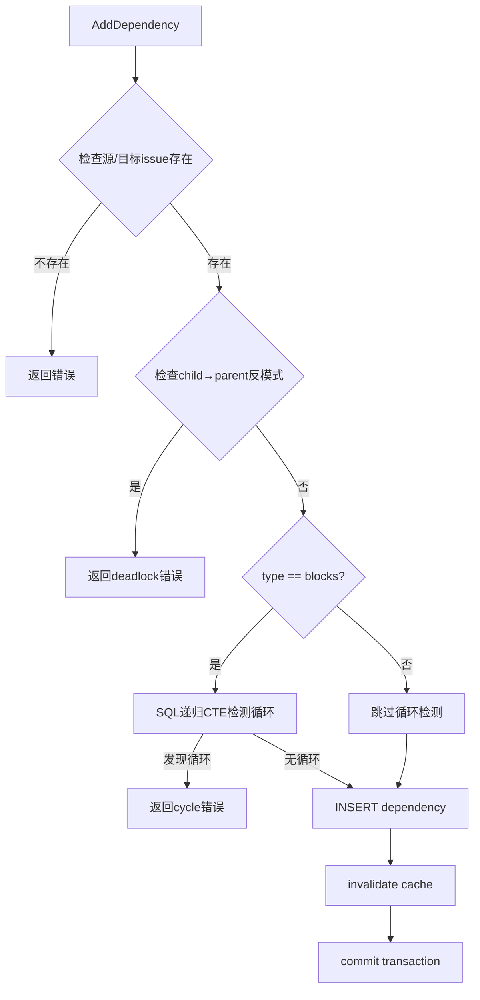
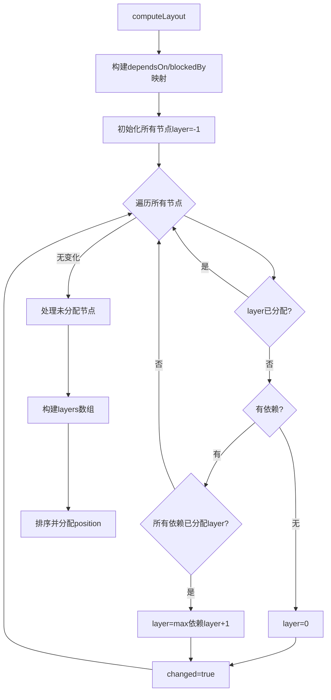
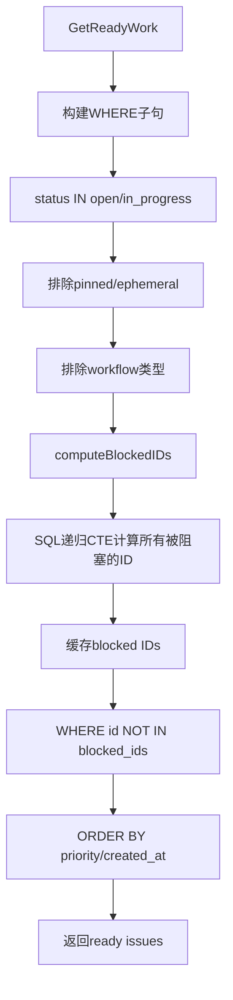

# PD-146.01 beads — DAG依赖图与拓扑排序调度

> 文档编号：PD-146.01
> 来源：beads `cmd/bd/dep.go`, `cmd/bd/graph.go`, `internal/storage/dolt/dependencies.go`
> GitHub：https://github.com/steveyegge/beads.git
> 问题域：PD-146 依赖图与任务调度 Dependency Graph & Task Scheduling
> 状态：可复用方案

---

## 第 1 章 问题与动机（≥ 30 行）

### 1.1 核心问题

在 Agent 工程系统中，任务之间存在复杂的依赖关系。如何高效地：
1. **建模依赖关系** — 支持多种依赖类型（blocks/relates_to/duplicates/supersedes/replies_to）
2. **计算可执行任务** — 通过拓扑排序找出当前可以并行执行的任务（ready front）
3. **检测循环依赖** — 在添加依赖时早期检测并阻止循环依赖
4. **分析并行度** — 计算 wave（层级），评估任务可并行执行的程度

这是 Agent 编排系统的核心调度问题。

### 1.2 beads 的解法概述

beads 实现了完整的 DAG 依赖图系统，核心特性：

1. **多类型依赖关系** (`internal/storage/dolt/dependencies.go:12-107`) — 支持 10+ 种依赖类型，通过 `dependencies` 表统一存储
2. **拓扑排序计算层级** (`cmd/bd/graph.go:450-547`) — 使用 longest path 算法计算每个节点的 layer（波次）
3. **循环依赖早期检测** (`internal/storage/dolt/dependencies.go:52-73`) — 在添加依赖时通过 SQL 递归 CTE 检测循环
4. **ready front 计算** (`internal/storage/dolt/queries.go:353-500`) — 通过 `GetReadyWork` 查询所有无阻塞依赖的任务
5. **wave 分析** (`cmd/bd/graph.go:450-547`) — 将任务分层，同一层的任务可并行执行

### 1.3 设计思想

| 设计原则 | 具体实现 | 理由 | 替代方案 |
|----------|----------|------|----------|
| 依赖关系统一建模 | 所有依赖类型存储在同一张 `dependencies` 表，通过 `type` 字段区分 | 简化查询逻辑，支持跨类型依赖分析 | 每种依赖类型单独建表（复杂度高） |
| 循环依赖早期检测 | 在 `AddDependency` 时通过 SQL 递归 CTE 检测循环 | 防止无效依赖进入系统，保证 DAG 性质 | 延迟检测（会导致调度失败） |
| 拓扑排序用 longest path | 计算每个节点到源节点的最长路径作为 layer | 确保依赖链上的任务按正确顺序执行 | BFS/DFS（无法保证最优层级） |
| ready front 用 SQL 查询 | 通过 `NOT IN (SELECT issue_id FROM dependencies WHERE ...)` 过滤被阻塞的任务 | 利用数据库索引加速查询 | 内存图遍历（扩展性差） |
| wave 分析可视化 | `bd graph` 命令生成 ASCII/DOT/HTML 可视化 | 帮助开发者理解依赖关系和并行度 | 纯文本列表（难以理解） |

---

## 第 2 章 源码实现分析（≥ 60 行，核心章节）

### 2.1 架构概览

beads 的依赖图系统由三层组成：

```
┌─────────────────────────────────────────────────────────────┐
│                     CLI Commands Layer                       │
│  bd dep add/remove/list/tree/cycles  │  bd graph  │  bd ready│
└──────────────────────┬──────────────────────────────────────┘
                       │
┌──────────────────────▼──────────────────────────────────────┐
│                  Storage Layer (DoltStore)                   │
│  AddDependency │ GetDependencies │ DetectCycles │ GetReadyWork│
└──────────────────────┬──────────────────────────────────────┘
                       │
┌──────────────────────▼──────────────────────────────────────┐
│                    Database Layer (Dolt)                     │
│  dependencies table │ issues table │ SQL recursive CTE       │
└─────────────────────────────────────────────────────────────┘
```

### 2.2 核心实现

#### 2.2.1 依赖关系添加与循环检测



对应源码 `internal/storage/dolt/dependencies.go:15-107`：

```go
func (s *DoltStore) AddDependency(ctx context.Context, dep *types.Dependency, actor string) error {
	tx, err := s.db.BeginTx(ctx, nil)
	if err != nil {
		return fmt.Errorf("failed to begin transaction: %w", err)
	}
	defer func() { _ = tx.Rollback() }()

	// Validate that the source issue exists
	var issueExists int
	if err := tx.QueryRowContext(ctx, `SELECT COUNT(*) FROM issues WHERE id = ?`, dep.IssueID).Scan(&issueExists); err != nil {
		return fmt.Errorf("failed to check issue existence: %w", err)
	}
	if issueExists == 0 {
		return fmt.Errorf("issue %s not found", dep.IssueID)
	}

	// Cycle detection for blocking dependency types: check if adding this edge
	// would create a cycle by seeing if depends_on_id can already reach issue_id.
	if dep.Type == types.DepBlocks {
		var reachable int
		if err := tx.QueryRowContext(ctx, `
			WITH RECURSIVE reachable AS (
				SELECT ? AS node, 0 AS depth
				UNION ALL
				SELECT d.depends_on_id, r.depth + 1
				FROM reachable r
				JOIN dependencies d ON d.issue_id = r.node
				WHERE d.type = 'blocks'
				  AND r.depth < 100
			)
			SELECT COUNT(*) FROM reachable WHERE node = ?
		`, dep.DependsOnID, dep.IssueID).Scan(&reachable); err != nil {
			return fmt.Errorf("failed to check for dependency cycle: %w", err)
		}
		if reachable > 0 {
			return fmt.Errorf("adding dependency would create a cycle")
		}
	}

	if _, err := tx.ExecContext(ctx, `
		INSERT INTO dependencies (issue_id, depends_on_id, type, created_at, created_by, metadata, thread_id)
		VALUES (?, ?, ?, NOW(), ?, ?, ?)
	`, dep.IssueID, dep.DependsOnID, dep.Type, actor, metadata, dep.ThreadID); err != nil {
		return fmt.Errorf("failed to add dependency: %w", err)
	}

	s.invalidateBlockedIDsCache()
	return tx.Commit()
}
```

**关键设计点**：
- **递归 CTE 深度限制** (`depth < 100`) — 防止无限递归，同时支持深度依赖链
- **只检测 blocks 类型** — 其他依赖类型（如 relates_to）不影响调度，无需检测循环
- **事务保证原子性** — 检测和插入在同一事务中，避免并发竞态

#### 2.2.2 拓扑排序与层级计算



对应源码 `cmd/bd/graph.go:450-547`：

```go
func computeLayout(subgraph *TemplateSubgraph) *GraphLayout {
	layout := &GraphLayout{
		Nodes:  make(map[string]*GraphNode),
		RootID: subgraph.Root.ID,
	}

	// Build dependency map (only "blocks" dependencies, not parent-child)
	dependsOn := make(map[string][]string)
	blockedBy := make(map[string][]string)

	for _, dep := range subgraph.Dependencies {
		if dep.Type == types.DepBlocks {
			dependsOn[dep.IssueID] = append(dependsOn[dep.IssueID], dep.DependsOnID)
			blockedBy[dep.DependsOnID] = append(blockedBy[dep.DependsOnID], dep.IssueID)
		}
	}

	// Initialize nodes
	for _, issue := range subgraph.Issues {
		layout.Nodes[issue.ID] = &GraphNode{
			Issue:     issue,
			Layer:     -1, // Unassigned
			DependsOn: dependsOn[issue.ID],
		}
	}

	// Assign layers using longest path from sources
	// Layer 0 = nodes with no dependencies
	changed := true
	for changed {
		changed = false
		for id, node := range layout.Nodes {
			if node.Layer >= 0 {
				continue // Already assigned
			}

			deps := dependsOn[id]
			if len(deps) == 0 {
				// No dependencies - layer 0
				node.Layer = 0
				changed = true
			} else {
				// Check if all dependencies have layers assigned
				maxDepLayer := -1
				allAssigned := true
				for _, depID := range deps {
					depNode := layout.Nodes[depID]
					if depNode == nil || depNode.Layer < 0 {
						allAssigned = false
						break
					}
					if depNode.Layer > maxDepLayer {
						maxDepLayer = depNode.Layer
					}
				}
				if allAssigned {
					node.Layer = maxDepLayer + 1
					changed = true
				}
			}
		}
	}

	// Build layers array
	for _, node := range layout.Nodes {
		if node.Layer > layout.MaxLayer {
			layout.MaxLayer = node.Layer
		}
	}

	layout.Layers = make([][]string, layout.MaxLayer+1)
	for id, node := range layout.Nodes {
		layout.Layers[node.Layer] = append(layout.Layers[node.Layer], id)
	}

	return layout
}
```

**关键设计点**：
- **longest path 算法** — 确保每个节点的 layer 是其所有依赖的最大 layer + 1
- **迭代收敛** — 通过 `changed` 标志判断是否还有节点需要更新
- **只考虑 blocks 依赖** — parent-child 等关系不影响执行顺序

#### 2.2.3 ready front 计算



对应源码 `internal/storage/dolt/queries.go:353-500`：

```go
func (s *DoltStore) GetReadyWork(ctx context.Context, filter types.WorkFilter) ([]*types.Issue, error) {
	s.mu.RLock()
	defer s.mu.RUnlock()

	// Status filtering: default to open OR in_progress
	var statusClause string
	if filter.Status != "" {
		statusClause = "status = ?"
	} else {
		statusClause = "status IN ('open', 'in_progress')"
	}
	whereClauses := []string{
		statusClause,
		"(pinned = 0 OR pinned IS NULL)", // Exclude pinned issues
	}
	if !filter.IncludeEphemeral {
		whereClauses = append(whereClauses, "(ephemeral = 0 OR ephemeral IS NULL)")
	}

	// Exclude workflow/identity types from ready work
	excludeTypes := []string{"merge-request", "gate", "molecule", "message", "agent", "role", "rig"}
	placeholders := make([]string, len(excludeTypes))
	for i, t := range excludeTypes {
		placeholders[i] = "?"
		args = append(args, t)
	}
	whereClauses = append(whereClauses, fmt.Sprintf("id IN (SELECT id FROM issues WHERE issue_type NOT IN (%s))", strings.Join(placeholders, ",")))

	// Compute blocked IDs using recursive CTE
	blockedIDs, err := s.computeBlockedIDs(ctx)
	if err != nil {
		return nil, fmt.Errorf("failed to compute blocked IDs: %w", err)
	}

	// Exclude blocked issues
	if len(blockedIDs) > 0 {
		placeholders := make([]string, len(blockedIDs))
		for i, id := range blockedIDs {
			placeholders[i] = "?"
			args = append(args, id)
		}
		whereClauses = append(whereClauses, fmt.Sprintf("id NOT IN (%s)", strings.Join(placeholders, ",")))
	}

	// Execute query
	querySQL := fmt.Sprintf(`
		SELECT id FROM issues
		WHERE %s
		ORDER BY priority ASC, created_at DESC
		LIMIT ?
	`, strings.Join(whereClauses, " AND "))

	rows, err := s.queryContext(ctx, querySQL, args...)
	if err != nil {
		return nil, fmt.Errorf("failed to get ready work: %w", err)
	}
	defer rows.Close()

	return s.scanIssueIDs(ctx, rows)
}
```

**关键设计点**：
- **blocked IDs 缓存** — `computeBlockedIDs` 结果缓存，避免重复计算
- **排除非工作类型** — gate/molecule 等是内部协调类型，不是可执行任务
- **优先级排序** — 先按 priority 升序（P0 最高），再按创建时间降序

### 2.3 实现细节

#### 2.3.1 循环依赖检测的 SQL 实现

beads 使用 SQL 递归 CTE（Common Table Expression）检测循环：

```sql
WITH RECURSIVE reachable AS (
  SELECT ? AS node, 0 AS depth
  UNION ALL
  SELECT d.depends_on_id, r.depth + 1
  FROM reachable r
  JOIN dependencies d ON d.issue_id = r.node
  WHERE d.type = 'blocks'
    AND r.depth < 100
)
SELECT COUNT(*) FROM reachable WHERE node = ?
```

这个查询从 `depends_on_id` 开始，递归遍历所有可达节点，如果能到达 `issue_id`，说明添加这条边会形成循环。

#### 2.3.2 wave 分析的数据流

```
Issues + Dependencies
        ↓
computeLayout (拓扑排序)
        ↓
GraphLayout {
  Nodes: map[id]→{Issue, Layer, Position}
  Layers: [[layer0_ids], [layer1_ids], ...]
}
        ↓
renderGraph (可视化)
        ↓
ASCII/DOT/HTML output
```

每个 layer 代表一个 wave（波次），同一 wave 的任务可以并行执行。

---

## 第 3 章 迁移指南（≥ 40 行）

### 3.1 迁移清单

**阶段 1：数据模型设计**
- [ ] 设计 `dependencies` 表 schema（issue_id, depends_on_id, type, created_at, created_by）
- [ ] 定义依赖类型枚举（blocks, relates_to, duplicates, supersedes, replies_to 等）
- [ ] 添加索引：`(issue_id, depends_on_id)` 唯一索引，`(depends_on_id)` 索引

**阶段 2：循环检测实现**
- [ ] 实现 `AddDependency` 方法，包含事务和循环检测
- [ ] 编写 SQL 递归 CTE 查询（注意数据库兼容性）
- [ ] 添加 child→parent 反模式检测（防止层级死锁）

**阶段 3：拓扑排序实现**
- [ ] 实现 `computeLayout` 函数（longest path 算法）
- [ ] 构建 dependsOn/blockedBy 映射
- [ ] 迭代分配 layer，直到收敛

**阶段 4：ready front 计算**
- [ ] 实现 `GetReadyWork` 查询
- [ ] 实现 `computeBlockedIDs` 递归 CTE
- [ ] 添加缓存机制（invalidate on dependency change）

**阶段 5：可视化**
- [ ] 实现 ASCII 树状图渲染
- [ ] 实现 Graphviz DOT 格式输出
- [ ] 实现 HTML + D3.js 交互式可视化

### 3.2 适配代码模板

#### 3.2.1 依赖关系添加（Python 示例）

```python
from sqlalchemy import text
from contextlib import contextmanager

class DependencyManager:
    def __init__(self, db_session):
        self.db = db_session
        self._blocked_cache = None

    @contextmanager
    def transaction(self):
        """事务上下文管理器"""
        try:
            yield
            self.db.commit()
        except Exception:
            self.db.rollback()
            raise

    def add_dependency(self, issue_id: str, depends_on_id: str, dep_type: str, actor: str):
        """添加依赖关系，包含循环检测"""
        with self.transaction():
            # 1. 检查源/目标 issue 存在
            if not self._issue_exists(issue_id):
                raise ValueError(f"Issue {issue_id} not found")
            if not self._issue_exists(depends_on_id):
                raise ValueError(f"Issue {depends_on_id} not found")

            # 2. 检查 child→parent 反模式
            if self._is_child_of(issue_id, depends_on_id):
                raise ValueError(f"Cannot add dependency: {issue_id} is already a child of {depends_on_id}")

            # 3. 循环检测（仅 blocks 类型）
            if dep_type == "blocks":
                if self._would_create_cycle(issue_id, depends_on_id):
                    raise ValueError("Adding dependency would create a cycle")

            # 4. 插入依赖记录
            self.db.execute(text("""
                INSERT INTO dependencies (issue_id, depends_on_id, type, created_at, created_by)
                VALUES (:issue_id, :depends_on_id, :type, NOW(), :actor)
            """), {
                "issue_id": issue_id,
                "depends_on_id": depends_on_id,
                "type": dep_type,
                "actor": actor
            })

            # 5. 清除缓存
            self._blocked_cache = None

    def _would_create_cycle(self, issue_id: str, depends_on_id: str) -> bool:
        """检测是否会形成循环"""
        result = self.db.execute(text("""
            WITH RECURSIVE reachable AS (
                SELECT :start AS node, 0 AS depth
                UNION ALL
                SELECT d.depends_on_id, r.depth + 1
                FROM reachable r
                JOIN dependencies d ON d.issue_id = r.node
                WHERE d.type = 'blocks' AND r.depth < 100
            )
            SELECT COUNT(*) FROM reachable WHERE node = :target
        """), {"start": depends_on_id, "target": issue_id})
        return result.scalar() > 0

    def _issue_exists(self, issue_id: str) -> bool:
        result = self.db.execute(text("SELECT COUNT(*) FROM issues WHERE id = :id"), {"id": issue_id})
        return result.scalar() > 0

    def _is_child_of(self, child_id: str, parent_id: str) -> bool:
        """检查是否是层级子节点"""
        return child_id.startswith(parent_id + ".")
```

#### 3.2.2 拓扑排序（Python 示例）

```python
from typing import Dict, List, Set

class TopologicalScheduler:
    def __init__(self, issues: List[dict], dependencies: List[dict]):
        self.issues = {issue["id"]: issue for issue in issues}
        self.depends_on = self._build_dependency_map(dependencies)

    def _build_dependency_map(self, dependencies: List[dict]) -> Dict[str, List[str]]:
        """构建依赖映射（只考虑 blocks 类型）"""
        dep_map = {}
        for dep in dependencies:
            if dep["type"] == "blocks":
                issue_id = dep["issue_id"]
                depends_on_id = dep["depends_on_id"]
                if issue_id not in dep_map:
                    dep_map[issue_id] = []
                dep_map[issue_id].append(depends_on_id)
        return dep_map

    def compute_layers(self) -> Dict[str, int]:
        """计算每个节点的 layer（longest path）"""
        layers = {issue_id: -1 for issue_id in self.issues}

        changed = True
        while changed:
            changed = False
            for issue_id in self.issues:
                if layers[issue_id] >= 0:
                    continue  # Already assigned

                deps = self.depends_on.get(issue_id, [])
                if not deps:
                    # No dependencies - layer 0
                    layers[issue_id] = 0
                    changed = True
                else:
                    # Check if all dependencies have layers assigned
                    max_dep_layer = -1
                    all_assigned = True
                    for dep_id in deps:
                        if dep_id not in layers or layers[dep_id] < 0:
                            all_assigned = False
                            break
                        max_dep_layer = max(max_dep_layer, layers[dep_id])

                    if all_assigned:
                        layers[issue_id] = max_dep_layer + 1
                        changed = True

        # Handle unassigned nodes (cycles or disconnected)
        for issue_id in layers:
            if layers[issue_id] < 0:
                layers[issue_id] = 0

        return layers

    def get_ready_front(self, layers: Dict[str, int]) -> List[str]:
        """获取 layer 0 的所有任务（ready front）"""
        return [issue_id for issue_id, layer in layers.items() if layer == 0]

    def get_wave_analysis(self, layers: Dict[str, int]) -> Dict[int, List[str]]:
        """按 wave 分组任务"""
        waves = {}
        for issue_id, layer in layers.items():
            if layer not in waves:
                waves[layer] = []
            waves[layer].append(issue_id)
        return waves
```

### 3.3 适用场景

| 场景 | 适用度 | 说明 |
|------|--------|------|
| Agent 任务编排 | ⭐⭐⭐ | 核心场景，管理 Agent 任务依赖 |
| CI/CD 流水线 | ⭐⭐⭐ | 管理构建步骤依赖关系 |
| 项目管理系统 | ⭐⭐⭐ | 管理 issue/task 依赖 |
| 工作流引擎 | ⭐⭐ | 需要结合状态机 |
| 数据处理管道 | ⭐⭐ | 适合 DAG 型数据流 |

---

## 第 4 章 测试用例（≥ 20 行）

基于真实函数签名的测试代码：

```python
import pytest
from dependency_manager import DependencyManager, TopologicalScheduler

class TestDependencyManager:
    def test_add_dependency_normal(self, db_session):
        """测试正常添加依赖"""
        dm = DependencyManager(db_session)
        # Setup: create two issues
        db_session.execute("INSERT INTO issues (id, title, status) VALUES ('bd-001', 'Task 1', 'open')")
        db_session.execute("INSERT INTO issues (id, title, status) VALUES ('bd-002', 'Task 2', 'open')")
        db_session.commit()

        # Act: add dependency
        dm.add_dependency("bd-001", "bd-002", "blocks", "test-user")

        # Assert: dependency exists
        result = db_session.execute("SELECT COUNT(*) FROM dependencies WHERE issue_id='bd-001' AND depends_on_id='bd-002'")
        assert result.scalar() == 1

    def test_add_dependency_cycle_detection(self, db_session):
        """测试循环依赖检测"""
        dm = DependencyManager(db_session)
        # Setup: create three issues with A→B→C chain
        for id in ["bd-a", "bd-b", "bd-c"]:
            db_session.execute(f"INSERT INTO issues (id, title, status) VALUES ('{id}', 'Task', 'open')")
        db_session.commit()

        dm.add_dependency("bd-a", "bd-b", "blocks", "test-user")
        dm.add_dependency("bd-b", "bd-c", "blocks", "test-user")

        # Act & Assert: adding C→A should fail
        with pytest.raises(ValueError, match="cycle"):
            dm.add_dependency("bd-c", "bd-a", "blocks", "test-user")

    def test_child_parent_anti_pattern(self, db_session):
        """测试 child→parent 反模式检测"""
        dm = DependencyManager(db_session)
        # Setup: create parent and child issues
        db_session.execute("INSERT INTO issues (id, title, status) VALUES ('bd-parent', 'Parent', 'open')")
        db_session.execute("INSERT INTO issues (id, title, status) VALUES ('bd-parent.1', 'Child', 'open')")
        db_session.commit()

        # Act & Assert: adding child→parent dependency should fail
        with pytest.raises(ValueError, match="already a child"):
            dm.add_dependency("bd-parent.1", "bd-parent", "blocks", "test-user")

class TestTopologicalScheduler:
    def test_compute_layers_simple_chain(self):
        """测试简单链式依赖的层级计算"""
        issues = [
            {"id": "bd-a", "title": "Task A"},
            {"id": "bd-b", "title": "Task B"},
            {"id": "bd-c", "title": "Task C"},
        ]
        dependencies = [
            {"issue_id": "bd-b", "depends_on_id": "bd-a", "type": "blocks"},
            {"issue_id": "bd-c", "depends_on_id": "bd-b", "type": "blocks"},
        ]

        scheduler = TopologicalScheduler(issues, dependencies)
        layers = scheduler.compute_layers()

        assert layers["bd-a"] == 0  # No dependencies
        assert layers["bd-b"] == 1  # Depends on A
        assert layers["bd-c"] == 2  # Depends on B

    def test_compute_layers_diamond(self):
        """测试菱形依赖的层级计算"""
        issues = [
            {"id": "bd-a", "title": "Task A"},
            {"id": "bd-b", "title": "Task B"},
            {"id": "bd-c", "title": "Task C"},
            {"id": "bd-d", "title": "Task D"},
        ]
        dependencies = [
            {"issue_id": "bd-b", "depends_on_id": "bd-a", "type": "blocks"},
            {"issue_id": "bd-c", "depends_on_id": "bd-a", "type": "blocks"},
            {"issue_id": "bd-d", "depends_on_id": "bd-b", "type": "blocks"},
            {"issue_id": "bd-d", "depends_on_id": "bd-c", "type": "blocks"},
        ]

        scheduler = TopologicalScheduler(issues, dependencies)
        layers = scheduler.compute_layers()

        assert layers["bd-a"] == 0
        assert layers["bd-b"] == 1
        assert layers["bd-c"] == 1
        assert layers["bd-d"] == 2  # Longest path: A→B→D or A→C→D

    def test_get_ready_front(self):
        """测试 ready front 计算"""
        issues = [
            {"id": "bd-a", "title": "Task A"},
            {"id": "bd-b", "title": "Task B"},
            {"id": "bd-c", "title": "Task C"},
        ]
        dependencies = [
            {"issue_id": "bd-c", "depends_on_id": "bd-b", "type": "blocks"},
        ]

        scheduler = TopologicalScheduler(issues, dependencies)
        layers = scheduler.compute_layers()
        ready = scheduler.get_ready_front(layers)

        assert set(ready) == {"bd-a", "bd-b"}  # A and B have no dependencies

    def test_wave_analysis(self):
        """测试 wave 分析"""
        issues = [
            {"id": "bd-a", "title": "Task A"},
            {"id": "bd-b", "title": "Task B"},
            {"id": "bd-c", "title": "Task C"},
            {"id": "bd-d", "title": "Task D"},
        ]
        dependencies = [
            {"issue_id": "bd-b", "depends_on_id": "bd-a", "type": "blocks"},
            {"issue_id": "bd-c", "depends_on_id": "bd-a", "type": "blocks"},
            {"issue_id": "bd-d", "depends_on_id": "bd-b", "type": "blocks"},
        ]

        scheduler = TopologicalScheduler(issues, dependencies)
        layers = scheduler.compute_layers()
        waves = scheduler.get_wave_analysis(layers)

        assert len(waves[0]) == 1  # Wave 0: A
        assert len(waves[1]) == 2  # Wave 1: B, C (can run in parallel)
        assert len(waves[2]) == 1  # Wave 2: D
```

---

## 第 5 章 跨域关联

| 关联域 | 关系类型 | 说明 |
|--------|----------|------|
| PD-02 多 Agent 编排 | 依赖 | 依赖图是编排系统的调度基础 |
| PD-03 容错与重试 | 协同 | 依赖失败时需要重试或降级策略 |
| PD-11 可观测性 | 协同 | 需要追踪依赖图执行进度和阻塞原因 |
| PD-145 声明式工作流 | 依赖 | Formula 工作流引擎依赖 DAG 调度 |
| PD-153 层级 Epic 系统 | 协同 | Epic 层级结构与依赖图结合使用 |

---

## 第 6 章 来源文件索引

| 文件 | 行范围 | 关键实现 |
|------|--------|----------|
| `cmd/bd/dep.go` | L44-L74 | 循环依赖检测与警告 |
| `cmd/bd/dep.go` | L165-L297 | 依赖添加命令实现 |
| `cmd/bd/dep.go` | L606-L640 | 循环检测命令 |
| `cmd/bd/graph.go` | L16-L30 | GraphNode 和 GraphLayout 数据结构 |
| `cmd/bd/graph.go` | L175-L274 | 子图加载（BFS 遍历） |
| `cmd/bd/graph.go` | L450-L547 | 拓扑排序与层级计算 |
| `cmd/bd/graph.go` | L638-L711 | 紧凑树状图渲染 |
| `cmd/bd/ready.go` | L18-L273 | ready work 命令实现 |
| `internal/storage/dolt/dependencies.go` | L15-L107 | AddDependency 实现（含循环检测） |
| `internal/storage/dolt/dependencies.go` | L627-L675 | GetDependencyTree 实现 |
| `internal/storage/dolt/dependencies.go` | L677-L749 | DetectCycles 实现（DFS） |
| `internal/storage/dolt/queries.go` | L353-L500 | GetReadyWork 实现 |
| `internal/types/types.go` | L1-L200 | Issue 和 Dependency 数据结构 |

---

## 第 7 章 横向对比维度

```json comparison_data
{
  "project": "beads",
  "dimensions": {
    "依赖关系建模": "单表多类型（10+ 种依赖类型通过 type 字段区分）",
    "拓扑排序算法": "longest path 迭代收敛（确保最优层级）",
    "循环依赖检测": "SQL 递归 CTE 早期检测（添加时阻止）",
    "并行度分析": "wave 分层（同层任务可并行执行）",
    "可视化支持": "ASCII/DOT/HTML 三种格式（含 D3.js 交互式）",
    "外部依赖支持": "external: 前缀跨项目依赖（routing 解析）"
  }
}
```

### 域元数据补充

```json domain_metadata
{
  "solution_summary": "beads 用 SQL 递归 CTE + longest path 拓扑排序实现 DAG 依赖图调度，支持 10+ 种依赖类型、循环早期检测、wave 并行度分析和三格式可视化",
  "description": "支持跨项目外部依赖和多种依赖类型（blocks/relates_to/duplicates/supersedes）",
  "sub_problems": [
    "外部依赖解析（跨项目依赖通过 routing 系统解析）",
    "依赖图可视化（ASCII/DOT/HTML 三种格式）",
    "child→parent 反模式检测（防止层级死锁）"
  ],
  "best_practices": [
    "SQL 递归 CTE 深度限制（防止无限递归）",
    "blocked IDs 缓存（避免重复计算）",
    "longest path 算法（确保最优层级分配）",
    "依赖类型分离（只对 blocks 类型检测循环）"
  ]
}
```

