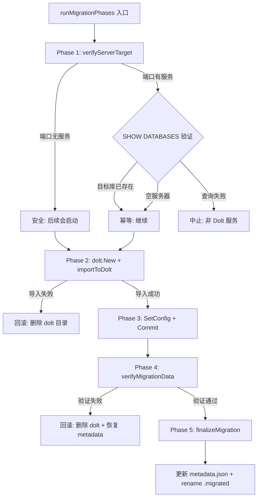
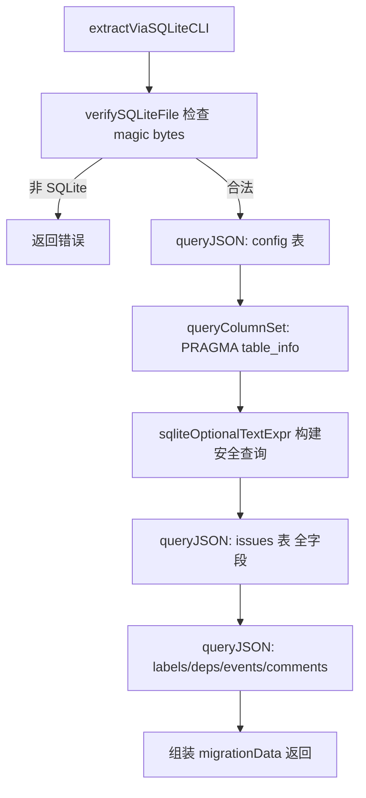
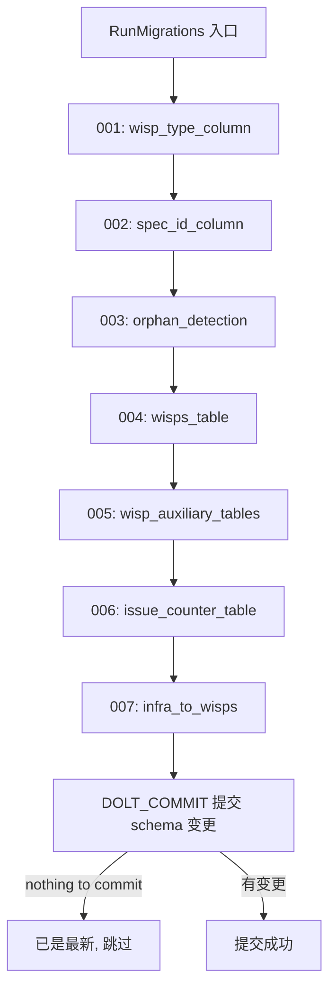

# PD-147.01 beads — 版本化数据库迁移与双路径安全切换

> 文档编号：PD-147.01
> 来源：beads `internal/storage/dolt/migrations.go` `cmd/bd/migrate_auto.go` `cmd/bd/migrate_shim.go` `cmd/bd/migrate_safety.go`
> GitHub：https://github.com/steveyegge/beads.git
> 问题域：PD-147 数据迁移框架 Data Migration Framework
> 状态：可复用方案

---

## 第 1 章 问题与动机

### 1.1 核心问题

当一个持久化系统需要从旧存储引擎（SQLite）迁移到新引擎（Dolt — 一个 Git-for-data 的版本化数据库）时，面临以下挑战：

1. **零停机迁移**：用户执行任何 `bd` 命令时自动触发迁移，不需要手动操作
2. **数据安全**：迁移失败不能丢失数据，必须有完整的备份和回滚机制
3. **Schema 演进**：Dolt 数据库的 schema 需要随版本迭代增量更新，且每次迁移必须幂等
4. **编译环境兼容**：CGO 不是所有平台都可用，需要无 CGO 依赖的备选迁移路径
5. **迁移验证**：不能只靠导入返回值判断成功，需要独立重查验证数据完整性

### 1.2 beads 的解法概述

beads 实现了一套完整的双路径迁移框架：

1. **CGO 路径** (`migrate_auto.go:44`)：直接通过 Go SQLite 驱动读取数据，适用于 CGO 可用的环境
2. **Shim 路径** (`migrate_shim.go:32`)：通过系统 `sqlite3` CLI 以 JSON 模式导出数据，零 CGO 依赖
3. **共享安全层** (`migrate_safety.go:302`)：两条路径共享同一套 5 阶段安全迁移流程（verify → import → commit → verify data → finalize）
4. **顺序 Schema 迁移** (`migrations.go:34`)：7 个编号迁移函数按序执行，每个都是幂等的
5. **Doctor 诊断** (`doctor/migration_validation.go:49`)：迁移前后的健康检查，输出机器可解析的 JSON 结果

### 1.3 设计思想

| 设计原则 | 具体实现 | 理由 | 替代方案 |
|----------|----------|------|----------|
| 备份优先 | 迁移第一步必须创建带时间戳的 `.backup-pre-dolt-{timestamp}` 文件 | 任何后续步骤失败都能恢复 | 事务回滚（但跨引擎迁移无法用事务） |
| 双路径兼容 | CGO 路径 + sqlite3 CLI shim 路径，共享 `runMigrationPhases` | 覆盖所有编译环境，不强制 CGO | 只支持 CGO（限制平台） |
| 幂等迁移 | 每个 migration 先检查 column/table 是否存在再执行 | 重复运行安全，支持断点续传 | 版本号追踪（需额外状态表） |
| 独立验证 | 迁移后通过独立 SQL 连接重查数据，含 count 校验 + 首尾 spot-check | 捕获导入返回值无法发现的问题 | 只信任导入返回值（不可靠） |
| 原子切换 | 验证通过后才更新 metadata.json 并 rename SQLite 文件 | 确保只有完全成功才切换后端 | 先切换再验证（危险） |

---

## 第 2 章 源码实现分析

### 2.1 架构概览

beads 的迁移系统分为三层：数据迁移层（SQLite→Dolt 整库搬迁）、Schema 迁移层（Dolt 内部 schema 演进）、诊断修复层（Doctor 健康检查）。

```
┌─────────────────────────────────────────────────────────┐
│                    bd CLI 入口                           │
│  (每次命令执行前自动检测是否需要迁移)                      │
└──────────────┬──────────────────────┬───────────────────┘
               │                      │
    ┌──────────▼──────────┐  ┌───────▼────────────┐
    │  CGO 路径            │  │  Shim 路径          │
    │  migrate_auto.go     │  │  migrate_shim.go    │
    │  (Go SQLite 驱动)    │  │  (sqlite3 CLI JSON) │
    └──────────┬──────────┘  └───────┬────────────┘
               │                      │
               └──────────┬───────────┘
                          │
              ┌───────────▼───────────────┐
              │  共享安全迁移流程            │
              │  migrate_safety.go         │
              │  runMigrationPhases()      │
              │  5 阶段: verify → import   │
              │  → commit → verify → final │
              └───────────┬───────────────┘
                          │
              ┌───────────▼───────────────┐
              │  Schema 迁移引擎           │
              │  migrations.go            │
              │  RunMigrations()          │
              │  7 个编号迁移 (001-007)    │
              └───────────┬───────────────┘
                          │
              ┌───────────▼───────────────┐
              │  Doctor 诊断修复           │
              │  doctor/migration_*.go    │
              │  迁移前后健康检查           │
              └───────────────────────────┘
```

### 2.2 核心实现

#### 2.2.1 共享安全迁移流程



对应源码 `cmd/bd/migrate_safety.go:302-377`：

```go
func runMigrationPhases(ctx context.Context, params *migrationParams) (imported int, skipped int, err error) {
    // Phase 1: Verify server target — don't write to the wrong Dolt server
    if err := verifyServerTarget(dbName, params.serverPort); err != nil {
        return 0, 0, fmt.Errorf("server check failed: %w\n\nTo fix:\n"+
            "  1. Stop the other project's Dolt server\n"+
            "  2. Or set BEADS_DOLT_SERVER_PORT to a unique port for this project\n"+
            "  Your SQLite database is intact. Backup at: %s", err, backupPath)
    }

    // Save original config for rollback
    originalCfg, _ := configfile.Load(beadsDir)

    // Phase 2: Create Dolt store and import
    doltStore, err := dolt.New(ctx, doltCfg)
    if err != nil {
        return 0, 0, fmt.Errorf("dolt init failed: %w\n"+
            "  Your SQLite database is intact. Backup at: %s", err, backupPath)
    }
    imported, skipped, importErr := importToDolt(ctx, doltStore, data)
    if importErr != nil {
        _ = doltStore.Close()
        _ = os.RemoveAll(doltPath)
        return 0, 0, fmt.Errorf("import failed: %w", importErr)
    }

    // Phase 3: Commit
    commitMsg := fmt.Sprintf("Auto-migrate from SQLite: %d issues imported", imported)
    _ = doltStore.Commit(ctx, commitMsg)
    _ = doltStore.Close()

    // Phase 4: Independent verification
    if err := verifyMigrationData(data, dbName, params.serverHost,
        params.serverPort, params.serverUser, params.serverPassword); err != nil {
        _ = os.RemoveAll(doltPath)
        if originalCfg != nil {
            _ = rollbackMetadata(beadsDir, originalCfg)
        }
        return 0, 0, fmt.Errorf("verification failed: %w", err)
    }

    // Phase 5: Finalize — atomic cutover
    if err := finalizeMigration(beadsDir, sqlitePath, dbName); err != nil {
        return imported, skipped, fmt.Errorf("finalization failed: %w", err)
    }
    return imported, skipped, nil
}
```

#### 2.2.2 Shim 层无 CGO 数据提取



对应源码 `cmd/bd/migrate_shim.go:196-427`：

```go
func extractViaSQLiteCLI(_ context.Context, dbPath string) (*migrationData, error) {
    // 1. 验证 SQLite magic bytes
    if err := verifySQLiteFile(dbPath); err != nil {
        return nil, err
    }

    // 2. 通过 PRAGMA table_info 获取实际列集合
    issueCols := queryColumnSet(dbPath, "issues")

    // 3. 用 sqliteOptionalTextExpr 安全处理缺失列
    opt := func(col, fallback string) string {
        return sqliteOptionalTextExpr(issueCols, col, fallback)
    }

    // 4. 构建动态 SELECT（缺失列用 fallback 值替代）
    issueQuery := fmt.Sprintf(`SELECT id, %s as content_hash, ...`, opt("content_hash", "''"))
    issueRows, err := queryJSON(dbPath, issueQuery)
    // ...
}

// queryJSON 通过 sqlite3 CLI 的 .mode json 输出
func queryJSON(dbPath, query string) ([]map[string]interface{}, error) {
    input := fmt.Sprintf(".mode json\n%s\n", strings.TrimSpace(query))
    cmd := exec.Command("sqlite3", "-readonly", dbPath)
    cmd.Stdin = strings.NewReader(input)
    out, err := cmd.Output()
    // 解析 JSON 数组
    var rows []map[string]interface{}
    json.Unmarshal([]byte(output), &rows)
    return rows, nil
}
```

#### 2.2.3 顺序幂等 Schema 迁移



对应源码 `internal/storage/dolt/migrations.go:21-51`：

```go
var migrationsList = []Migration{
    {"wisp_type_column", migrations.MigrateWispTypeColumn},
    {"spec_id_column", migrations.MigrateSpecIDColumn},
    {"orphan_detection", migrations.DetectOrphanedChildren},
    {"wisps_table", migrations.MigrateWispsTable},
    {"wisp_auxiliary_tables", migrations.MigrateWispAuxiliaryTables},
    {"issue_counter_table", migrations.MigrateIssueCounterTable},
    {"infra_to_wisps", migrations.MigrateInfraToWisps},
}

func RunMigrations(db *sql.DB) error {
    for _, m := range migrationsList {
        if err := m.Func(db); err != nil {
            return fmt.Errorf("dolt migration %q failed: %w", m.Name, err)
        }
    }
    // Commit schema changes (idempotent)
    _, err := db.Exec("CALL DOLT_COMMIT('-Am', 'schema: auto-migrate')")
    if err != nil && !strings.Contains(strings.ToLower(err.Error()), "nothing to commit") {
        log.Printf("dolt migration commit warning: %v", err)
    }
    return nil
}
```

### 2.3 实现细节

**幂等检查模式**：每个 migration 函数内部先用 `columnExists()` 或 `tableExists()` 检查目标是否已存在（`migrations/helpers.go:31-63`），避免重复执行报错。这些 helper 使用 `SHOW COLUMNS FROM ... LIKE` 而非 `information_schema`，因为 Dolt 的 catalog 在 worktree 清理后可能包含过期条目（GH#2051）。

**数据流向**：

```
SQLite beads.db
    │
    ├─ CGO 路径: Go sql.DB 直接读取
    │
    └─ Shim 路径: sqlite3 CLI → .mode json → JSON 数组
                                                │
                                    ┌───────────▼───────────┐
                                    │   migrationData 结构   │
                                    │   issues []*Issue      │
                                    │   labelsMap            │
                                    │   depsMap              │
                                    │   eventsMap            │
                                    │   commentsMap          │
                                    │   config map           │
                                    └───────────┬───────────┘
                                                │
                                    ┌───────────▼───────────┐
                                    │   importToDolt()       │
                                    │   事务内批量 INSERT     │
                                    │   ON DUPLICATE KEY     │
                                    │   UPDATE (幂等)        │
                                    └───────────┬───────────┘
                                                │
                                    ┌───────────▼───────────┐
                                    │   verifyMigrationData  │
                                    │   独立连接重查          │
                                    │   count + spot-check   │
                                    └───────────┬───────────┘
                                                │
                                    ┌───────────▼───────────┐
                                    │   finalizeMigration    │
                                    │   metadata.json 更新   │
                                    │   beads.db → .migrated │
                                    └───────────────────────┘
```

**边界情况处理** (`migrate_auto.go:37-43`)：
- 空文件（0 bytes）→ 删除，不是真正的数据库
- metadata.json 已标记 dolt → 重命名残留 SQLite
- `.migrated` 文件已存在 → 跳过
- Dolt 目录已存在 → SQLite 是残留，重命名
- 用户显式设置 SQLite 后端 → 不自动迁移（GH#2016）

---

## 第 3 章 迁移指南

### 3.1 迁移清单

**阶段 1：基础设施**
- [ ] 定义 `Migration` 结构体（名称 + 迁移函数）
- [ ] 实现 `columnExists()` / `tableExists()` 幂等检查 helper
- [ ] 创建有序迁移列表 `migrationsList`
- [ ] 实现 `RunMigrations()` 顺序执行器

**阶段 2：数据迁移**
- [ ] 定义 `migrationData` 中间数据结构
- [ ] 实现源数据提取函数（适配你的源存储引擎）
- [ ] 实现目标数据导入函数（事务内批量写入）
- [ ] 实现备份函数（带时间戳 + 计数器防冲突）

**阶段 3：安全层**
- [ ] 实现 `verifyServerTarget()` 目标验证
- [ ] 实现 `verifyMigrationData()` 独立重查验证（count + spot-check）
- [ ] 实现 `runMigrationPhases()` 5 阶段编排
- [ ] 实现 `rollbackMetadata()` 回滚逻辑
- [ ] 实现 `finalizeMigration()` 原子切换

**阶段 4：诊断**
- [ ] 实现 `MigrationValidationResult` 机器可解析的诊断输出
- [ ] 实现迁移前/后健康检查

### 3.2 适配代码模板

以下是一个可直接复用的 Go 迁移框架模板：

```go
package migrations

import (
    "database/sql"
    "fmt"
    "log"
    "strings"
)

// Migration 表示一个 schema 迁移步骤
type Migration struct {
    Name string
    Func func(*sql.DB) error
}

// 有序迁移列表 — 新迁移追加到末尾
var migrationsList = []Migration{
    // {"001_add_column_x", MigrateAddColumnX},
}

// RunMigrations 按序执行所有迁移，每个迁移必须幂等
func RunMigrations(db *sql.DB) error {
    for _, m := range migrationsList {
        if err := m.Func(db); err != nil {
            return fmt.Errorf("migration %q failed: %w", m.Name, err)
        }
    }
    return nil
}

// columnExists 检查列是否存在（幂等 helper）
func columnExists(db *sql.DB, table, column string) (bool, error) {
    rows, err := db.Query("SHOW COLUMNS FROM `" + table + "` LIKE '" + column + "'")
    if err != nil {
        return false, err
    }
    defer rows.Close()
    return rows.Next(), nil
}

// tableExists 检查表是否存在
func tableExists(db *sql.DB, table string) (bool, error) {
    rows, err := db.Query("SHOW TABLES LIKE '" + table + "'")
    if err != nil {
        return false, err
    }
    defer rows.Close()
    return rows.Next(), nil
}
```

安全迁移流程模板：

```go
package migration

import (
    "context"
    "fmt"
    "os"
    "time"
)

// MigrationParams 迁移参数
type MigrationParams struct {
    SourcePath string
    TargetPath string
    BackupPath string
}

// RunSafeMigration 5 阶段安全迁移
func RunSafeMigration(ctx context.Context, params *MigrationParams) error {
    // Phase 1: 备份
    backupPath, err := createBackup(params.SourcePath)
    if err != nil {
        return fmt.Errorf("backup failed: %w", err)
    }

    // Phase 2: 提取 + 导入
    data, err := extractFromSource(ctx, params.SourcePath)
    if err != nil {
        return fmt.Errorf("extract failed (backup at %s): %w", backupPath, err)
    }
    if err := importToTarget(ctx, params.TargetPath, data); err != nil {
        _ = os.RemoveAll(params.TargetPath) // 回滚
        return fmt.Errorf("import failed (backup at %s): %w", backupPath, err)
    }

    // Phase 3: 独立验证
    if err := verifyMigration(ctx, data, params.TargetPath); err != nil {
        _ = os.RemoveAll(params.TargetPath) // 回滚
        return fmt.Errorf("verification failed: %w", err)
    }

    // Phase 4: 原子切换
    return finalize(params.SourcePath, params.TargetPath)
}

func createBackup(path string) (string, error) {
    timestamp := time.Now().Format("20060102-150405")
    backupPath := fmt.Sprintf("%s.backup-%s", path, timestamp)
    // ... 复制文件 ...
    return backupPath, nil
}
```

### 3.3 适用场景

| 场景 | 适用度 | 说明 |
|------|--------|------|
| 存储引擎整体替换（如 SQLite→PostgreSQL） | ⭐⭐⭐ | 完全匹配：双路径提取 + 5 阶段安全迁移 |
| Schema 增量演进（加列、加表） | ⭐⭐⭐ | 幂等迁移列表模式直接可用 |
| 数据格式升级（JSON→Protobuf） | ⭐⭐ | 需要适配提取/导入逻辑，安全层可复用 |
| 多租户数据隔离迁移 | ⭐⭐ | verifyServerTarget 模式可复用于租户隔离验证 |
| 实时在线迁移（零停机） | ⭐ | beads 是离线迁移，在线迁移需要双写 + 追赶 |

---

## 第 4 章 测试用例

```go
package migration_test

import (
    "context"
    "database/sql"
    "os"
    "path/filepath"
    "testing"
    "time"

    _ "github.com/go-sql-driver/mysql"
)

// TestBackupCreation 验证备份文件创建
func TestBackupCreation(t *testing.T) {
    dir := t.TempDir()
    dbPath := filepath.Join(dir, "test.db")
    os.WriteFile(dbPath, []byte("SQLite format 3\x00test data"), 0600)

    backupPath, err := backupSQLite(dbPath)
    if err != nil {
        t.Fatalf("backup failed: %v", err)
    }

    // 验证备份文件存在且内容一致
    original, _ := os.ReadFile(dbPath)
    backup, _ := os.ReadFile(backupPath)
    if string(original) != string(backup) {
        t.Error("backup content mismatch")
    }

    // 验证文件名包含时间戳
    base := filepath.Base(backupPath)
    if !containsTimestamp(base) {
        t.Errorf("backup name %q missing timestamp", base)
    }
}

// TestBackupCollisionHandling 验证同秒备份不冲突
func TestBackupCollisionHandling(t *testing.T) {
    dir := t.TempDir()
    dbPath := filepath.Join(dir, "test.db")
    os.WriteFile(dbPath, []byte("SQLite format 3\x00data"), 0600)

    path1, _ := backupSQLite(dbPath)
    // 创建同名文件模拟冲突
    os.WriteFile(path1, []byte("occupied"), 0600)
    os.WriteFile(dbPath, []byte("SQLite format 3\x00data"), 0600)

    path2, err := backupSQLite(dbPath)
    if err != nil {
        t.Fatalf("second backup failed: %v", err)
    }
    if path1 == path2 {
        t.Error("backup paths should differ on collision")
    }
}

// TestIdempotentMigration 验证迁移幂等性
func TestIdempotentMigration(t *testing.T) {
    db := setupTestDB(t)

    // 第一次执行：应该创建列
    err := MigrateWispTypeColumn(db)
    if err != nil {
        t.Fatalf("first migration failed: %v", err)
    }

    // 第二次执行：应该跳过（幂等）
    err = MigrateWispTypeColumn(db)
    if err != nil {
        t.Fatalf("idempotent migration failed: %v", err)
    }

    // 验证列只存在一次
    exists, _ := columnExists(db, "issues", "wisp_type")
    if !exists {
        t.Error("wisp_type column should exist after migration")
    }
}

// TestVerifyMigrationCounts 验证迁移计数校验
func TestVerifyMigrationCounts(t *testing.T) {
    tests := []struct {
        name        string
        srcIssues   int
        srcDeps     int
        doltIssues  int
        doltDeps    int
        expectError bool
    }{
        {"exact match", 100, 50, 100, 50, false},
        {"dolt has more (pre-existing)", 100, 50, 120, 60, false},
        {"issue count mismatch", 100, 50, 90, 50, true},
        {"dep count mismatch", 100, 50, 100, 40, true},
        {"empty source", 0, 0, 0, 0, false},
    }

    for _, tt := range tests {
        t.Run(tt.name, func(t *testing.T) {
            err := verifyMigrationCounts(tt.srcIssues, tt.srcDeps, tt.doltIssues, tt.doltDeps)
            if (err != nil) != tt.expectError {
                t.Errorf("expected error=%v, got %v", tt.expectError, err)
            }
        })
    }
}

// TestEdgeCaseEmptyDB 验证空数据库迁移
func TestEdgeCaseEmptyDB(t *testing.T) {
    dir := t.TempDir()
    dbPath := filepath.Join(dir, "empty.db")
    os.WriteFile(dbPath, []byte{}, 0600)

    // 空文件应该被检测并删除
    info, _ := os.Stat(dbPath)
    if info.Size() == 0 {
        os.Remove(dbPath)
    }

    _, err := os.Stat(dbPath)
    if !os.IsNotExist(err) {
        t.Error("empty db file should have been removed")
    }
}

// TestRollbackOnVerificationFailure 验证验证失败时回滚
func TestRollbackOnVerificationFailure(t *testing.T) {
    dir := t.TempDir()
    doltPath := filepath.Join(dir, "dolt")
    os.MkdirAll(doltPath, 0755)

    // 模拟验证失败后的回滚
    os.RemoveAll(doltPath)

    _, err := os.Stat(doltPath)
    if !os.IsNotExist(err) {
        t.Error("dolt directory should be removed on rollback")
    }
}
```

---

## 第 5 章 跨域关联

| 关联域 | 关系类型 | 说明 |
|--------|----------|------|
| PD-03 容错与重试 | 协同 | 迁移的 5 阶段安全流程本质上是容错设计：备份→执行→验证→回滚/提交。`runMigrationPhases` 在每个阶段失败时都有明确的回滚路径 |
| PD-06 记忆持久化 | 依赖 | 迁移框架的目标是将持久化数据从一种存储引擎搬到另一种。beads 的 issues/labels/deps/events/comments 就是 Agent 的记忆数据 |
| PD-07 质量检查 | 协同 | Doctor 诊断系统 (`doctor/migration_validation.go`) 提供迁移前后的健康检查，输出 `MigrationValidationResult` 结构化报告 |
| PD-11 可观测性 | 协同 | 迁移过程通过 `debug.Logf` 记录详细日志，`fmt.Fprintf(os.Stderr)` 输出用户可见进度，支持问题排查 |
| PD-04 工具系统 | 协同 | Shim 路径通过 `exec.Command("sqlite3")` 调用外部工具，类似工具系统的外部工具集成模式 |

---

## 第 6 章 来源文件索引

| 文件 | 行范围 | 关键实现 |
|------|--------|----------|
| `cmd/bd/migrate_auto.go` | L19-185 | CGO 路径自动迁移入口，边界情况处理（空文件、残留、已迁移） |
| `cmd/bd/migrate_safety.go` | L23-64 | `backupSQLite()` 带时间戳+计数器的备份函数 |
| `cmd/bd/migrate_safety.go` | L90-172 | `verifyServerTarget()` Dolt 服务器目标验证 |
| `cmd/bd/migrate_safety.go` | L177-193 | `verifyMigrationCounts()` 源/目标行数校验 |
| `cmd/bd/migrate_safety.go` | L204-273 | `verifyMigrationData()` 独立连接重查 + 首尾 spot-check |
| `cmd/bd/migrate_safety.go` | L302-377 | `runMigrationPhases()` 5 阶段安全迁移编排 |
| `cmd/bd/migrate_safety.go` | L382-415 | `finalizeMigration()` 原子切换（metadata + rename） |
| `cmd/bd/migrate_safety.go` | L419-424 | `rollbackMetadata()` 配置回滚 |
| `cmd/bd/migrate_shim.go` | L32-191 | Shim 路径：sqlite3 CLI 无 CGO 迁移 |
| `cmd/bd/migrate_shim.go` | L196-427 | `extractViaSQLiteCLI()` JSON 模式数据提取 |
| `cmd/bd/migrate_shim.go` | L444-473 | `queryJSON()` sqlite3 CLI JSON 查询封装 |
| `cmd/bd/migrate_shim.go` | L476-494 | `verifySQLiteFile()` magic bytes 校验 |
| `cmd/bd/migrate_import.go` | L18-27 | `migrationData` 中间数据结构定义 |
| `cmd/bd/migrate_import.go` | L67-150 | `importToDolt()` 事务内批量导入 + ON DUPLICATE KEY UPDATE |
| `internal/storage/dolt/migrations.go` | L13-16 | `Migration` 结构体定义 |
| `internal/storage/dolt/migrations.go` | L21-29 | `migrationsList` 7 个编号迁移 |
| `internal/storage/dolt/migrations.go` | L34-51 | `RunMigrations()` 顺序执行 + DOLT_COMMIT |
| `internal/storage/dolt/migrations/helpers.go` | L14-63 | `columnExists()` / `tableExists()` 幂等检查 |
| `internal/storage/dolt/migrations/001_wisp_type_column.go` | L12-27 | 典型幂等迁移：检查→跳过/执行 |
| `internal/storage/dolt/migrations/004_wisps_table.go` | L16-52 | dolt_ignore + 表创建的有序迁移 |
| `internal/storage/dolt/migrations/007_infra_to_wisps.go` | L19-147 | 数据迁移：INSERT IGNORE + DELETE 原始数据 |
| `internal/configfile/configfile.go` | L14-42 | `Config` 结构体，backend 字段控制存储引擎 |
| `internal/configfile/configfile.go` | L54-95 | `Load()` 含 legacy config.json 自动迁移 |
| `cmd/bd/doctor/migration_validation.go` | L20-40 | `MigrationValidationResult` 机器可解析诊断结构 |

---

## 第 7 章 横向对比维度

```json comparison_data
{
  "project": "beads",
  "dimensions": {
    "迁移架构": "双路径（CGO + sqlite3 CLI shim），共享 5 阶段安全流程",
    "幂等机制": "每个 migration 内部 columnExists/tableExists 检查，无版本号表",
    "验证策略": "独立连接重查 + count 校验 + 首尾 spot-check",
    "回滚机制": "带时间戳备份 + 失败时删除目标目录 + 恢复 metadata.json",
    "兼容层设计": "sqlite3 CLI JSON 模式 + PRAGMA table_info 动态列检测",
    "诊断能力": "Doctor 系统输出 MigrationValidationResult JSON，支持自动化消费"
  }
}
```

```json domain_metadata
{
  "solution_summary": "beads 用双路径提取（CGO + sqlite3 CLI shim）+ 5 阶段安全流程（verify→import→commit→verify→finalize）实现 SQLite 到 Dolt 的零操作自动迁移",
  "description": "跨存储引擎整库迁移的安全编排与独立验证",
  "sub_problems": [
    "跨引擎数据提取的编译环境兼容",
    "迁移目标服务器身份验证",
    "迁移后独立重查验证"
  ],
  "best_practices": [
    "双路径提取覆盖所有编译环境",
    "独立连接重查而非信任导入返回值",
    "原子切换：验证通过后才更新配置和重命名源文件",
    "Doctor 诊断输出机器可解析 JSON 供自动化消费"
  ]
}
```
