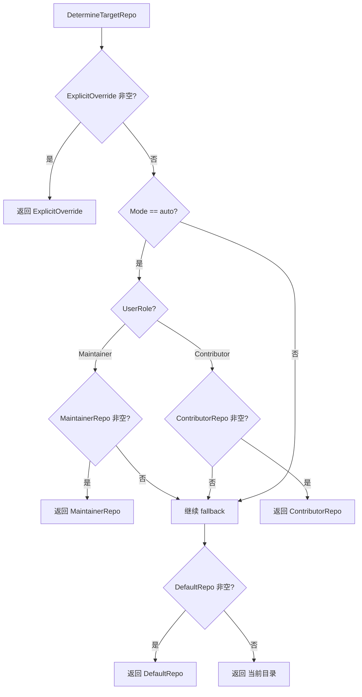
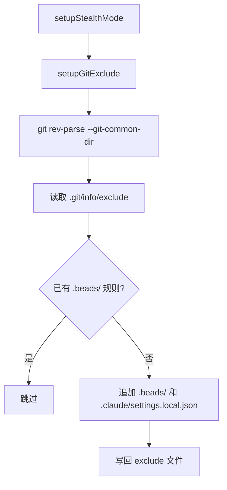

# PD-149.01 beads — 基于 Git 信号的角色路由与 Contributor 隔离

> 文档编号：PD-149.01
> 来源：beads `internal/routing/routing.go`
> GitHub：https://github.com/steveyegge/beads.git
> 问题域：PD-149 角色路由系统 Role-Based Routing
> 状态：可复用方案

---

## 第 1 章 问题与动机

### 1.1 核心问题

当一个 issue 追踪工具（如 beads）被用于自身项目的开发时，会出现**自举递归问题**：contributor 用 `bd create` 创建的个人规划 issue 会混入项目的 `.beads/` 数据库，导致 PR diff 中出现无关的 issue 数据变更。这不仅污染代码审查，还会引发合并冲突和隐私泄露。

更广泛地说，任何多角色协作的 Agent 系统都面临类似问题：不同角色（maintainer vs contributor、admin vs user）产生的数据需要路由到不同的存储位置，且路由决策应尽可能自动化，减少人工配置负担。

### 1.2 beads 的解法概述

beads 通过 `internal/routing/routing.go` 实现了一套三层优先级的角色路由系统：

1. **显式 git config 优先**：`git config beads.role` 作为最高优先级的角色声明（`routing.go:36-46`）
2. **URL 启发式降级**：当无显式配置时，通过 push URL 协议（SSH vs HTTPS）推断角色（`routing.go:57-82`）
3. **RoutingConfig 策略路由**：`DetermineTargetRepo` 根据角色 + 配置决定 issue 写入哪个仓库（`routing.go:95-118`）
4. **Stealth Mode 隐身**：通过 `.git/info/exclude` 实现 beads 文件对 git 不可见（`init_stealth.go:21-35`）
5. **Contributor Wizard 一键配置**：`bd init --contributor` 自动创建 planning repo 并配置路由（`init_contributor.go:18-263`）

### 1.3 设计思想

| 设计原则 | 具体实现 | 理由 | 替代方案 |
|----------|----------|------|----------|
| 显式优于隐式 | `git config beads.role` 优先于 URL 启发式 | URL 启发式不可靠（fork contributor 也可能用 SSH） | 仅依赖 URL 推断 |
| 安全降级 | 无配置时默认 Contributor（路由到个人库） | 避免意外污染上游 PR | 默认 Maintainer（风险更高） |
| 零摩擦自动化 | `bd init --contributor` 一键完成全部配置 | 降低 contributor 的使用门槛 | 手动编辑配置文件 |
| 存储完全隔离 | planning repo 是独立的 git 仓库 + 独立数据库 | 物理隔离比逻辑标记更可靠 | issue 加 visibility flag |
| 环境变量兜底 | `BEADS_DIR` 优先级高于所有路由配置 | 向后兼容 + CI 环境支持 | 仅支持配置文件 |

---

## 第 2 章 源码实现分析

### 2.1 架构概览

beads 的角色路由系统由三个核心模块组成，形成从角色检测到存储切换的完整链路：

```
┌─────────────────────────────────────────────────────────────────┐
│                     bd create "Fix bug" -p 1                     │
└──────────────────────────┬──────────────────────────────────────┘
                           │
                           ▼
┌──────────────────────────────────────────────────────────────────┐
│  DetectUserRole (routing.go:34)                                  │
│  ┌─────────────────┐   ┌──────────────────┐   ┌──────────────┐ │
│  │ git config       │──→│ URL 启发式        │──→│ 默认 Maintainer│ │
│  │ beads.role       │   │ SSH→M / HTTPS→C  │   │ (无 remote)   │ │
│  └─────────────────┘   └──────────────────┘   └──────────────┘ │
└──────────────────────────┬──────────────────────────────────────┘
                           │ UserRole
                           ▼
┌──────────────────────────────────────────────────────────────────┐
│  DetermineTargetRepo (routing.go:95)                             │
│  ┌──────────────┐   ┌──────────────┐   ┌──────────────────────┐ │
│  │ --repo 显式   │──→│ auto 模式     │──→│ 默认 fallback (".")  │ │
│  │ 覆盖          │   │ 按角色路由    │   │                      │ │
│  └──────────────┘   └──────────────┘   └──────────────────────┘ │
└──────────────────────────┬──────────────────────────────────────┘
                           │ repoPath
                           ▼
┌──────────────────────────────────────────────────────────────────┐
│  Store Switching (create.go:407-431)                             │
│  repoPath == "." → 使用当前 store                                │
│  repoPath != "." → ExpandPath → 打开 target store → 替换全局 store│
└──────────────────────────────────────────────────────────────────┘
```

### 2.2 核心实现

#### 角色检测：三层降级策略

```mermaid
graph TD
    A[DetectUserRole 调用] --> B{git config beads.role?}
    B -->|maintainer| C[返回 Maintainer]
    B -->|contributor| D[返回 Contributor]
    B -->|未设置/无效| E[detectFromURL fallback]
    E --> F{push URL 协议?}
    F -->|git@ / ssh://| G[返回 Maintainer]
    F -->|https:// + @| G
    F -->|https:// 无凭证| H[返回 Contributor]
    F -->|无 remote| I[返回 Maintainer - 本地项目]
```

对应源码 `internal/routing/routing.go:34-82`：

```go
func DetectUserRole(repoPath string) (UserRole, error) {
	// First check for explicit role in git config (preferred source)
	output, err := gitCommandRunner(repoPath, "config", "--get", "beads.role")
	if err == nil {
		role := strings.TrimSpace(string(output))
		if role == string(Maintainer) {
			return Maintainer, nil
		}
		if role == string(Contributor) {
			return Contributor, nil
		}
		// Invalid role value - fall through with warning
	}

	// Fallback to URL heuristic (deprecated, with warning)
	fmt.Fprintln(os.Stderr, "warning: beads.role not configured. Run 'bd init' to set.")
	return detectFromURL(repoPath), nil
}

func detectFromURL(repoPath string) UserRole {
	output, err := gitCommandRunner(repoPath, "remote", "get-url", "--push", "origin")
	if err != nil {
		output, err = gitCommandRunner(repoPath, "remote", "get-url", "origin")
		if err != nil {
			return Maintainer // No remote means local project
		}
	}
	pushURL := strings.TrimSpace(string(output))
	if strings.HasPrefix(pushURL, "git@") ||
		strings.HasPrefix(pushURL, "ssh://") ||
		strings.Contains(pushURL, "@") {
		return Maintainer
	}
	return Contributor
}
```

关键设计点：
- `gitCommandRunner` 是可替换的函数变量（`routing.go:11-17`），支持测试时注入 stub
- URL 启发式被标记为 deprecated，每次触发都输出 warning 引导用户配置
- 无 remote 时默认 Maintainer，因为本地项目不存在 PR 污染问题

#### 路由决策：优先级链



对应源码 `internal/routing/routing.go:84-118`：

```go
type RoutingConfig struct {
	Mode             string // "auto" or "explicit"
	DefaultRepo      string // Default repo for new issues
	MaintainerRepo   string // Repo for maintainers (in auto mode)
	ContributorRepo  string // Repo for contributors (in auto mode)
	ExplicitOverride string // Explicit --repo flag override
}

func DetermineTargetRepo(config *RoutingConfig, userRole UserRole, repoPath string) string {
	if config.ExplicitOverride != "" {
		return config.ExplicitOverride
	}
	if config.Mode == "auto" {
		if userRole == Maintainer && config.MaintainerRepo != "" {
			return config.MaintainerRepo
		}
		if userRole == Contributor && config.ContributorRepo != "" {
			return config.ContributorRepo
		}
	}
	if config.DefaultRepo != "" {
		return config.DefaultRepo
	}
	return "."
}
```

#### Stealth Mode：git 级别隐身



对应源码 `cmd/bd/init_stealth.go:40-107`：

```go
func setupGitExclude(verbose bool) error {
	// Use --git-common-dir to handle worktrees correctly (GH#1053)
	gitDir, err := exec.Command("git", "rev-parse", "--git-common-dir").Output()
	if err != nil {
		return fmt.Errorf("not a git repository")
	}
	gitDirPath := strings.TrimSpace(string(gitDir))
	excludePath := filepath.Join(gitDirPath, "info", "exclude")

	// Read existing exclude file
	var existingContent string
	if content, err := os.ReadFile(excludePath); err == nil {
		existingContent = string(content)
	}

	// Use relative patterns (work correctly in .git/info/exclude)
	beadsPattern := ".beads/"
	claudePattern := ".claude/settings.local.json"

	hasBeads := strings.Contains(existingContent, beadsPattern)
	hasClaude := strings.Contains(existingContent, claudePattern)

	if hasBeads && hasClaude {
		return nil // Already configured
	}
	// ... append missing patterns and write back
}
```

关键设计点：
- 使用 `.git/info/exclude` 而非 `.gitignore`，因为 exclude 是 per-repo、per-user 的，不会被提交
- 使用 `--git-common-dir` 而非 `--git-dir`，正确处理 git worktree 场景（GH#1053）
- Fork 保护（`setupForkExclude`）额外排除 `**/RECOVERY*.md` 和 `**/SESSION*.md`

### 2.3 实现细节

#### 向后兼容的配置键迁移

`create.go:382-394` 展示了配置键从 `contributor.*` 到 `routing.*` 的平滑迁移：

```go
// Build routing config with backward compatibility for legacy contributor.* keys
routingMode := config.GetString("routing.mode")
contributorRepo := config.GetString("routing.contributor")

// NFR-001: Backward compatibility - fall back to legacy contributor.* keys
if routingMode == "" {
    if config.GetString("contributor.auto_route") == "true" {
        routingMode = "auto"
    }
}
if contributorRepo == "" {
    contributorRepo = config.GetString("contributor.planning_repo")
}
```

#### Doctor 诊断：多源角色检查

`cmd/bd/doctor/role.go:17-58` 实现了三层角色配置检查：

1. 先查 `git config beads.role`（规范位置）
2. 再查数据库 config 表（兼容 `bd config set role maintainer` 的旧用法）
3. 检查是否在 git 仓库中（非 git 仓库跳过检查）

#### 可测试性设计

`routing.go:11-17` 通过函数变量实现 git 命令的可替换：

```go
var gitCommandRunner = func(repoPath string, args ...string) ([]byte, error) {
	cmd := exec.Command("git", args...)
	if repoPath != "" {
		cmd.Dir = repoPath
	}
	return cmd.Output()
}
```

测试中通过 `gitStub` 结构体注入预设响应（`routing_test.go:151-187`），实现了对 git 命令的完全 mock，无需真实 git 仓库。

#### 多仓库 Hydration

Contributor 的 issue 路由到 planning repo 后，通过 `repos.additional` 配置实现跨仓库聚合：

```yaml
routing:
  mode: auto
  contributor: ~/.beads-planning
repos:
  primary: "."
  additional:
    - ~/.beads-planning
```

`bd list` 会从所有配置的仓库中拉取 issue，每个 issue 带有 `source_repo` 标记来源。


---

## 第 3 章 迁移指南

### 3.1 迁移清单

#### 阶段 1：角色检测模块（1-2 天）

- [ ] 创建 `routing` 包，定义 `UserRole` 枚举（Maintainer/Contributor）
- [ ] 实现 `DetectUserRole(repoPath string) (UserRole, error)`
  - 优先读取 `git config <namespace>.role`
  - 降级到 URL 启发式（SSH → Maintainer，HTTPS → Contributor）
  - 无 remote 时默认 Maintainer
- [ ] 实现 `gitCommandRunner` 函数变量，支持测试注入
- [ ] 编写单元测试覆盖所有分支（git config、SSH URL、HTTPS URL、无 remote）

#### 阶段 2：路由配置与决策（1 天）

- [ ] 定义 `RoutingConfig` 结构体（Mode、DefaultRepo、MaintainerRepo、ContributorRepo、ExplicitOverride）
- [ ] 实现 `DetermineTargetRepo(config, userRole, repoPath) string`
  - 优先级：ExplicitOverride > auto 模式角色路由 > DefaultRepo > 当前目录
- [ ] 实现 `ExpandPath(path string) string` 处理 `~` 和相对路径
- [ ] 编写单元测试验证优先级链

#### 阶段 3：存储切换集成（2-3 天）

- [ ] 在 `create` 命令中集成 `DetectUserRole` 和 `DetermineTargetRepo`
- [ ] 当 `repoPath != "."` 时，打开 target store 并替换全局 store
- [ ] 确保 target store 继承 prefix 配置（避免 prefix 不匹配）
- [ ] 添加 `--repo` flag 支持显式覆盖
- [ ] 编写 E2E 测试验证 issue 确实写入 target repo

#### 阶段 4：Contributor Wizard（2 天）

- [ ] 实现 `bd init --contributor` 向导
  - 检测 fork 关系（`git remote get-url upstream`）
  - 检测 push 权限（SSH vs HTTPS）
  - 创建 planning repo（默认 `~/.beads-planning`）
  - 配置 `routing.mode=auto` 和 `routing.contributor=<path>`
  - 配置 `repos.additional` 启用 hydration
- [ ] 实现 stealth mode（`bd init --stealth`）
  - 配置 `.git/info/exclude` 排除 `.beads/` 和 `.claude/settings.local.json`
- [ ] 添加 `bd doctor` 检查项：角色配置、路由配置、hydration 配置

#### 阶段 5：向后兼容与文档（1 天）

- [ ] 支持旧配置键 fallback（如 `contributor.auto_route` → `routing.mode`）
- [ ] 编写迁移文档：从手动 `BEADS_DIR` 迁移到 auto-routing
- [ ] 编写故障排查文档：routing 不生效、prefix 不匹配、hydration 缺失

### 3.2 适配代码模板

#### 模板 1：角色检测（Go）

```go
package routing

import (
	"fmt"
	"os"
	"os/exec"
	"strings"
)

type UserRole string

const (
	Maintainer  UserRole = "maintainer"
	Contributor UserRole = "contributor"
)

var gitCommandRunner = func(repoPath string, args ...string) ([]byte, error) {
	cmd := exec.Command("git", args...)
	if repoPath != "" {
		cmd.Dir = repoPath
	}
	return cmd.Output()
}

func DetectUserRole(repoPath string) (UserRole, error) {
	// 1. Check git config for explicit role
	output, err := gitCommandRunner(repoPath, "config", "--get", "myapp.role")
	if err == nil {
		role := strings.TrimSpace(string(output))
		if role == string(Maintainer) || role == string(Contributor) {
			return UserRole(role), nil
		}
	}

	// 2. Fallback to URL heuristic
	fmt.Fprintln(os.Stderr, "warning: myapp.role not configured. Run 'myapp init' to set.")
	return detectFromURL(repoPath), nil
}

func detectFromURL(repoPath string) UserRole {
	output, err := gitCommandRunner(repoPath, "remote", "get-url", "--push", "origin")
	if err != nil {
		output, err = gitCommandRunner(repoPath, "remote", "get-url", "origin")
		if err != nil {
			return Maintainer // No remote = local project
		}
	}
	pushURL := strings.TrimSpace(string(output))
	if strings.HasPrefix(pushURL, "git@") ||
		strings.HasPrefix(pushURL, "ssh://") ||
		strings.Contains(pushURL, "@") {
		return Maintainer
	}
	return Contributor
}
```

#### 模板 2：路由决策（Go）

```go
type RoutingConfig struct {
	Mode             string
	DefaultRepo      string
	MaintainerRepo   string
	ContributorRepo  string
	ExplicitOverride string
}

func DetermineTargetRepo(config *RoutingConfig, userRole UserRole, repoPath string) string {
	if config.ExplicitOverride != "" {
		return config.ExplicitOverride
	}
	if config.Mode == "auto" {
		if userRole == Maintainer && config.MaintainerRepo != "" {
			return config.MaintainerRepo
		}
		if userRole == Contributor && config.ContributorRepo != "" {
			return config.ContributorRepo
		}
	}
	if config.DefaultRepo != "" {
		return config.DefaultRepo
	}
	return "."
}

func ExpandPath(path string) string {
	if path == "" || path == "." {
		return path
	}
	if strings.HasPrefix(path, "~/") {
		home, err := os.UserHomeDir()
		if err == nil {
			path = filepath.Join(home, path[2:])
		}
	}
	if !filepath.IsAbs(path) {
		if abs, err := filepath.Abs(path); err == nil {
			path = abs
		}
	}
	return path
}
```

#### 模板 3：Stealth Mode（Shell）

```bash
#!/bin/bash
# Setup stealth mode for beads-like tools

setup_stealth() {
    local git_dir=$(git rev-parse --git-common-dir 2>/dev/null)
    if [ -z "$git_dir" ]; then
        echo "Error: not a git repository"
        return 1
    fi

    local exclude_file="$git_dir/info/exclude"
    mkdir -p "$git_dir/info"

    # Check if patterns already exist
    if grep -q "^\.myapp/$" "$exclude_file" 2>/dev/null; then
        echo "Stealth mode already configured"
        return 0
    fi

    # Append patterns
    cat >> "$exclude_file" <<EOF

# MyApp stealth mode (added by myapp init --stealth)
.myapp/
.myapp-config/settings.local.json
EOF

    echo "Stealth mode configured: $exclude_file"
}

setup_stealth
```

#### 模板 4：Contributor Wizard（Python）

```python
import os
import subprocess
from pathlib import Path

def run_contributor_wizard():
    """Guide user through contributor setup."""
    print("Contributor Workflow Setup Wizard\n")
    
    # Step 1: Detect fork
    is_fork, upstream_url = detect_fork()
    if is_fork:
        print(f"✓ Detected fork (upstream: {upstream_url})")
    else:
        print("⚠ No upstream remote detected")
        if input("Continue anyway? [y/N]: ").lower() != 'y':
            return
    
    # Step 2: Check push access
    has_push, origin_url = check_push_access()
    if has_push:
        print(f"✓ You have push access to origin ({origin_url})")
        if input("Use separate planning repo anyway? [Y/n]: ").lower() == 'n':
            return
    
    # Step 3: Configure planning repo
    home = Path.home()
    default_planning = home / ".myapp-planning"
    planning_path = input(f"Planning repo path [{default_planning}]: ").strip()
    planning_path = Path(planning_path) if planning_path else default_planning
    
    # Create planning repo
    planning_path.mkdir(parents=True, exist_ok=True)
    subprocess.run(["git", "init"], cwd=planning_path, check=True)
    (planning_path / ".myapp").mkdir(exist_ok=True)
    
    # Step 4: Configure routing
    set_config("routing.mode", "auto")
    set_config("routing.contributor", str(planning_path))
    
    print("\n✓ Contributor setup complete!")
    print(f"  Planning repo: {planning_path}")

def detect_fork():
    try:
        url = subprocess.check_output(
            ["git", "remote", "get-url", "upstream"],
            stderr=subprocess.DEVNULL
        ).decode().strip()
        return True, url
    except subprocess.CalledProcessError:
        return False, ""

def check_push_access():
    try:
        url = subprocess.check_output(
            ["git", "remote", "get-url", "origin"]
        ).decode().strip()
        has_push = url.startswith("git@") or url.startswith("ssh://")
        return has_push, url
    except subprocess.CalledProcessError:
        return False, ""

def set_config(key, value):
    # Implement config storage (SQLite, YAML, etc.)
    pass
```

### 3.3 适用场景

| 场景 | 适用度 | 说明 |
|------|--------|------|
| OSS 项目 contributor 工作流 | ⭐⭐⭐ | 核心场景：fork contributor 需要隔离个人规划 |
| 多租户 Agent 系统 | ⭐⭐⭐ | 不同租户的数据路由到不同存储 |
| 企业内部工具（多角色） | ⭐⭐ | admin/user 角色路由到不同数据库 |
| 单用户本地工具 | ⭐ | 无角色区分需求，路由系统是冗余的 |
| CI/CD 环境 | ⭐⭐ | 需要显式配置角色（URL 启发式不可靠） |
| Git worktree 场景 | ⭐⭐⭐ | stealth mode 必须用 `--git-common-dir` |

---

## 第 4 章 测试用例

基于 beads 的测试套件（`routing_test.go` 和 `contributor_routing_e2e_test.go`），以下是可直接运行的测试代码。

### 测试 1：角色检测优先级

```go
package routing_test

import (
	"errors"
	"reflect"
	"testing"
)

type gitCall struct {
	repo string
	args []string
}

type gitResponse struct {
	expect gitCall
	output string
	err    error
}

type gitStub struct {
	t         *testing.T
	responses []gitResponse
	idx       int
}

func (s *gitStub) run(repo string, args ...string) ([]byte, error) {
	if s.idx >= len(s.responses) {
		s.t.Fatalf("unexpected git call %v in repo %s", args, repo)
	}
	resp := s.responses[s.idx]
	s.idx++
	if resp.expect.repo != repo {
		s.t.Fatalf("repo mismatch: got %q want %q", repo, resp.expect.repo)
	}
	if !reflect.DeepEqual(resp.expect.args, args) {
		s.t.Fatalf("args mismatch: got %v want %v", args, resp.expect.args)
	}
	return []byte(resp.output), resp.err
}

func TestDetectUserRole_ConfigOverride(t *testing.T) {
	tests := []struct {
		name         string
		configOutput string
		configErr    error
		urlOutput    string
		urlErr       error
		wantRole     UserRole
	}{
		{
			name:         "explicit maintainer in git config",
			configOutput: "maintainer\n",
			wantRole:     Maintainer,
		},
		{
			name:         "explicit contributor in git config",
			configOutput: "contributor\n",
			wantRole:     Contributor,
		},
		{
			name:      "fallback to SSH URL",
			configErr: errors.New("not set"),
			urlOutput: "git@github.com:owner/repo.git",
			wantRole:  Maintainer,
		},
		{
			name:      "fallback to HTTPS URL",
			configErr: errors.New("not set"),
			urlOutput: "https://github.com/owner/repo.git",
			wantRole:  Contributor,
		},
	}

	for _, tt := range tests {
		t.Run(tt.name, func(t *testing.T) {
			stub := &gitStub{t: t}
			stub.responses = []gitResponse{
				{expect: gitCall{"/repo", []string{"config", "--get", "myapp.role"}}, output: tt.configOutput, err: tt.configErr},
			}
			if tt.configErr != nil {
				stub.responses = append(stub.responses,
					gitResponse{expect: gitCall{"/repo", []string{"remote", "get-url", "--push", "origin"}}, output: tt.urlOutput, err: tt.urlErr},
				)
			}

			orig := gitCommandRunner
			gitCommandRunner = stub.run
			defer func() { gitCommandRunner = orig }()

			role, err := DetectUserRole("/repo")
			if err != nil {
				t.Fatalf("DetectUserRole error = %v", err)
			}
			if role != tt.wantRole {
				t.Errorf("got role %s, want %s", role, tt.wantRole)
			}
		})
	}
}
```

### 测试 2：路由决策优先级

```go
func TestDetermineTargetRepo(t *testing.T) {
	tests := []struct {
		name     string
		config   *RoutingConfig
		userRole UserRole
		want     string
	}{
		{
			name: "explicit override takes precedence",
			config: &RoutingConfig{
				Mode:             "auto",
				MaintainerRepo:   ".",
				ContributorRepo:  "~/planning",
				ExplicitOverride: "/tmp/custom",
			},
			userRole: Maintainer,
			want:     "/tmp/custom",
		},
		{
			name: "auto mode - maintainer uses maintainer repo",
			config: &RoutingConfig{
				Mode:            "auto",
				MaintainerRepo:  ".",
				ContributorRepo: "~/planning",
			},
			userRole: Maintainer,
			want:     ".",
		},
		{
			name: "auto mode - contributor uses contributor repo",
			config: &RoutingConfig{
				Mode:            "auto",
				MaintainerRepo:  ".",
				ContributorRepo: "~/planning",
			},
			userRole: Contributor,
			want:     "~/planning",
		},
		{
			name: "no config defaults to current directory",
			config: &RoutingConfig{
				Mode: "auto",
			},
			userRole: Maintainer,
			want:     ".",
		},
	}

	for _, tt := range tests {
		t.Run(tt.name, func(t *testing.T) {
			got := DetermineTargetRepo(tt.config, tt.userRole, ".")
			if got != tt.want {
				t.Errorf("got %v, want %v", got, tt.want)
			}
		})
	}
}
```

### 测试 3：E2E 存储隔离

```go
func TestContributorRoutingIsolation(t *testing.T) {
	tmpDir := t.TempDir()
	projectDir := filepath.Join(tmpDir, "project")
	planningDir := filepath.Join(tmpDir, "planning")

	// Create project and planning databases
	projectStore := createStore(t, projectDir, "proj-")
	defer projectStore.Close()
	planningStore := createStore(t, planningDir, "plan-")
	defer planningStore.Close()

	// Configure routing
	projectStore.SetConfig("routing.mode", "auto")
	projectStore.SetConfig("routing.contributor", planningDir)

	// Simulate contributor creating issue
	routingConfig := &RoutingConfig{
		Mode:            "auto",
		ContributorRepo: planningDir,
	}
	targetRepo := DetermineTargetRepo(routingConfig, Contributor, projectDir)
	if targetRepo != planningDir {
		t.Fatalf("routing failed: got %s, want %s", targetRepo, planningDir)
	}

	// Create issue in planning store
	issue := &Issue{Title: "Test contributor issue", Priority: 2}
	planningStore.CreateIssue(issue)

	// Verify isolation
	if projectStore.GetIssue(issue.ID) != nil {
		t.Error("issue leaked to project store")
	}
	if planningStore.GetIssue(issue.ID) == nil {
		t.Error("issue not found in planning store")
	}
}

func createStore(t *testing.T, dir, prefix string) *Store {
	beadsDir := filepath.Join(dir, ".myapp")
	os.MkdirAll(beadsDir, 0755)
	store := NewStore(beadsDir)
	store.SetConfig("issue_prefix", prefix)
	return store
}
```

### 测试 4：向后兼容

```go
func TestBackwardCompatContributorConfig(t *testing.T) {
	store := createStore(t, t.TempDir(), "test-")
	defer store.Close()

	// Set LEGACY keys
	store.SetConfig("contributor.auto_route", "true")
	store.SetConfig("contributor.planning_repo", "/legacy/planning")

	// Simulate backward compat read
	routingMode := store.GetConfig("routing.mode")
	contributorRepo := store.GetConfig("routing.contributor")

	// Fallback to legacy keys
	if routingMode == "" {
		if store.GetConfig("contributor.auto_route") == "true" {
			routingMode = "auto"
		}
	}
	if contributorRepo == "" {
		contributorRepo = store.GetConfig("contributor.planning_repo")
	}

	// Verify backward compat works
	if routingMode != "auto" {
		t.Errorf("backward compat routing.mode = %q, want %q", routingMode, "auto")
	}
	if contributorRepo != "/legacy/planning" {
		t.Errorf("backward compat routing.contributor = %q, want %q", contributorRepo, "/legacy/planning")
	}
}
```


---

## 第 5 章 跨域关联

| 关联域 | 关系类型 | 说明 |
|--------|----------|------|
| PD-06 记忆持久化 | 依赖 | 路由决策依赖配置存储（`routing.mode`、`routing.contributor` 等配置项需要持久化） |
| PD-08 搜索与检索 | 协同 | 多仓库 hydration 需要跨仓库搜索能力（`repos.additional` 配置的仓库需要被聚合查询） |
| PD-11 可观测性 | 协同 | 路由决策应记录日志（哪个 issue 路由到哪个仓库、为什么），便于故障排查 |
| PD-04 工具系统 | 依赖 | `bd init --contributor` 向导依赖 git 工具调用（`git remote get-url`、`git config` 等） |
| PD-09 Human-in-the-Loop | 协同 | Contributor wizard 是典型的交互式配置流程，需要多轮用户输入 |

**关键洞察**：角色路由本质上是一个**元数据路由层**，它不改变业务逻辑（issue 的创建、查询、更新），只改变数据的物理存储位置。因此它与其他域的关系主要是**配置依赖**和**可观测性协同**。

---

## 第 6 章 来源文件索引

| 文件 | 行范围 | 关键实现 |
|------|--------|----------|
| `internal/routing/routing.go` | L19-L26 | `UserRole` 枚举定义 |
| `internal/routing/routing.go` | L34-L52 | `DetectUserRole` 三层检测策略 |
| `internal/routing/routing.go` | L54-L82 | `detectFromURL` URL 启发式 |
| `internal/routing/routing.go` | L84-L91 | `RoutingConfig` 结构体 |
| `internal/routing/routing.go` | L95-L118 | `DetermineTargetRepo` 优先级链 |
| `internal/routing/routing.go` | L120-L143 | `ExpandPath` 路径展开 |
| `cmd/bd/create.go` | L370-L405 | 路由决策集成到 create 命令 |
| `cmd/bd/create.go` | L407-L431 | Store 切换逻辑 |
| `cmd/bd/init_contributor.go` | L18-L263 | Contributor wizard 完整流程 |
| `cmd/bd/init_contributor.go` | L266-L277 | `detectForkSetup` fork 检测 |
| `cmd/bd/init_contributor.go` | L279-L302 | `checkPushAccess` 权限检测 |
| `cmd/bd/init_stealth.go` | L14-L35 | `setupStealthMode` 入口 |
| `cmd/bd/init_stealth.go` | L40-L107 | `setupGitExclude` git exclude 配置 |
| `cmd/bd/init_stealth.go` | L109-L175 | `setupForkExclude` fork 保护 |
| `cmd/bd/doctor/role.go` | L17-L58 | `CheckBeadsRole` 角色诊断 |
| `cmd/bd/doctor/role.go` | L90-L113 | `getRoleFromDatabase` 数据库 fallback |
| `internal/routing/routing_test.go` | L12-L84 | `DetermineTargetRepo` 单元测试 |
| `internal/routing/routing_test.go` | L189-L227 | 角色检测 git config 覆盖测试 |
| `internal/routing/routing_test.go` | L229-L291 | URL 启发式测试 |
| `cmd/bd/contributor_routing_e2e_test.go` | L80-L192 | E2E 路由隔离测试 |
| `cmd/bd/contributor_routing_e2e_test.go` | L194-L256 | 向后兼容测试 |
| `cmd/bd/contributor_routing_e2e_test.go` | L416-L645 | 多 sync 模式路由测试 |
| `docs/ROUTING.md` | L1-L243 | 路由系统完整文档 |
| `docs/CONTRIBUTOR_NAMESPACE_ISOLATION.md` | L1-L477 | Contributor 隔离设计文档 |
| `website/docs/multi-agent/routing.md` | L1-L117 | 用户文档：路由配置 |

---

## 第 7 章 横向对比维度

```json comparison_data
{
  "project": "beads",
  "dimensions": {
    "角色检测方式": "git config 显式配置 + URL 启发式（SSH/HTTPS）双层降级",
    "路由策略": "五级优先级链：--repo flag > auto 模式 > DefaultRepo > 当前目录",
    "隔离级别": "物理隔离（独立 git 仓库 + 独立数据库），非逻辑标记",
    "配置自动化": "bd init --contributor 一键向导，自动检测 fork + 创建 planning repo",
    "Stealth 支持": ".git/info/exclude 实现 git 级别隐身，支持 worktree",
    "向后兼容": "配置键迁移（contributor.* → routing.*）+ 数据库 fallback",
    "可测试性": "gitCommandRunner 函数变量注入 + gitStub mock 框架"
  }
}
```

### 域元数据补充

```json domain_metadata
{
  "solution_summary": "beads 通过 git config + URL 启发式双层角色检测，结合五级优先级路由链，实现 contributor issue 自动路由到独立 planning repo，配合 .git/info/exclude 实现 stealth mode，避免 PR 污染",
  "description": "",
  "sub_problems": [
    "URL 启发式不可靠性（fork contributor 也可能用 SSH）",
    "多仓库 hydration 配置复杂性",
    "Stealth mode 与 git worktree 兼容性"
  ],
  "best_practices": [
    "安全降级：无配置时默认 Contributor 避免污染",
    "环境变量兜底：BEADS_DIR 优先级高于所有路由配置",
    "物理隔离优于逻辑标记：独立仓库比 visibility flag 更可靠",
    "可测试性设计：函数变量注入支持 git 命令 mock"
  ]
}
```

---

## 附录 A：故障排查清单

### 问题 1：路由不生效，issue 仍写入当前仓库

**诊断步骤**：
1. 检查 `routing.mode` 是否为 `auto`：`bd config get routing.mode`
2. 检查 `routing.contributor` 是否配置：`bd config get routing.contributor`
3. 检查角色检测结果：`git config beads.role` 或 `git remote get-url --push origin`
4. 检查是否设置了 `BEADS_DIR` 环境变量（会覆盖路由配置）

**常见原因**：
- `routing.mode` 未设置或为空（默认禁用路由）
- `git config beads.role` 设置为 `maintainer`（显式覆盖）
- `BEADS_DIR` 环境变量存在（优先级最高）

### 问题 2：Routed issue 在 `bd list` 中不可见

**诊断步骤**：
1. 检查 `repos.additional` 是否包含 planning repo：`bd repo list`
2. 检查 planning repo 的 Dolt server 是否运行：`cd ~/.beads-planning && bd dolt status`
3. 手动触发 hydration：`bd hydrate`

**常见原因**：
- `bd init --contributor` 在旧版本中不会自动配置 `repos.additional`
- Planning repo 的 Dolt server 未启动，hydration 拿到的是旧数据

### 问题 3：Prefix 不匹配错误

**诊断步骤**：
1. 检查当前仓库 prefix：`bd config get issue_prefix`
2. 检查 planning repo prefix：`cd ~/.beads-planning && bd config get issue_prefix`
3. 检查 issue ID 是否匹配 planning repo prefix

**常见原因**：
- Planning repo 在初始化时未继承项目 prefix
- 手动修改了 planning repo 的 prefix

**解决方案**：
```bash
cd ~/.beads-planning
bd config set issue_prefix <project-prefix>  # 与项目保持一致
```

### 问题 4：Stealth mode 在 worktree 中失效

**诊断步骤**：
1. 检查是否在 worktree 中：`git rev-parse --is-inside-work-tree`
2. 检查 exclude 文件位置：`git rev-parse --git-common-dir`
3. 检查 exclude 文件内容：`cat $(git rev-parse --git-common-dir)/info/exclude`

**常见原因**：
- 使用了 `--git-dir` 而非 `--git-common-dir`，导致 worktree 的 exclude 文件未生效

**解决方案**：
```bash
bd init --stealth  # 重新运行，确保使用 --git-common-dir
```

---

## 附录 B：与其他方案的对比

| 方案 | 隔离方式 | 角色检测 | 配置复杂度 | 适用场景 |
|------|----------|----------|-----------|----------|
| **beads** | 物理隔离（独立仓库） | git config + URL 启发式 | 低（一键向导） | OSS contributor 工作流 |
| **BEADS_DIR 环境变量** | 物理隔离（环境变量指定） | 无（手动指定） | 中（需手动设置） | CI/CD、多项目切换 |
| **Issue visibility flag** | 逻辑隔离（数据库字段） | 无需角色检测 | 低 | 单仓库多角色 |
| **Git branch 隔离** | 逻辑隔离（分支） | 无需角色检测 | 高（需手动合并） | 临时实验性工作 |
| **Prefix-based namespace** | 逻辑隔离（ID 前缀） | 无需角色检测 | 中（需配置 gitignore） | 单仓库多项目 |

**beads 方案的优势**：
- 物理隔离最彻底，不存在"忘记设置 flag"的风险
- 角色检测自动化，contributor 无需手动配置
- 一键向导降低使用门槛

**beads 方案的劣势**：
- URL 启发式不可靠（需要显式 git config 兜底）
- 多仓库 hydration 增加配置复杂度
- Planning repo 需要独立的 git 管理（额外的 commit/push 操作）

---

## 附录 C：未来演进方向

基于 beads 的设计文档（`docs/CONTRIBUTOR_NAMESPACE_ISOLATION.md`），以下是已规划但未实现的功能：

### 1. Issue 晋升机制（bd migrate）

允许将 planning repo 的 issue "晋升"到项目仓库：

```bash
bd migrate plan-42 --to . --dry-run  # 预览
bd migrate plan-42 --to .            # 执行
```

实现要点：
- 在目标仓库创建新 issue，保留原 issue 的 metadata
- 在原 issue 中添加 `migrated_to: proj-123` 引用
- 可选：自动关闭原 issue

### 2. PR 污染检测（bd preflight）

在 `bd preflight --check` 中检测 PR diff 是否包含个人 issue：

```go
func checkBeadsPollution(ctx context.Context) (CheckResult, error) {
    diff := gitDiff(".beads/issues.jsonl")
    addedIssues := parseAddedIssues(diff)
    for _, issue := range addedIssues {
        if issue.SourceRepo != "." {
            return CheckResult{
                Status: Fail,
                Message: fmt.Sprintf("Personal issue %s in diff", issue.ID),
            }, nil
        }
    }
    return CheckResult{Status: Pass}, nil
}
```

### 3. 首次使用提示

当 contributor 首次运行 `bd create` 且未配置路由时，弹出交互式提示：

```
▶ Detected fork/contributor setup
▶ Personal issues would pollute upstream PRs

Options:
  1. Configure auto-routing (recommended)
     Creates ~/.beads-planning for personal tracking

  2. Continue to current repo
     Issue will appear in the project database (affects PRs)

Choice [1]:
```

### 4. 多角色切换

支持在同一台机器上快速切换角色：

```bash
bd role switch contributor  # 临时切换到 contributor 模式
bd role switch maintainer   # 切换回 maintainer 模式
bd role status              # 查看当前角色
```

实现要点：
- 修改 `git config beads.role`
- 可选：切换 `BEADS_DIR` 环境变量

