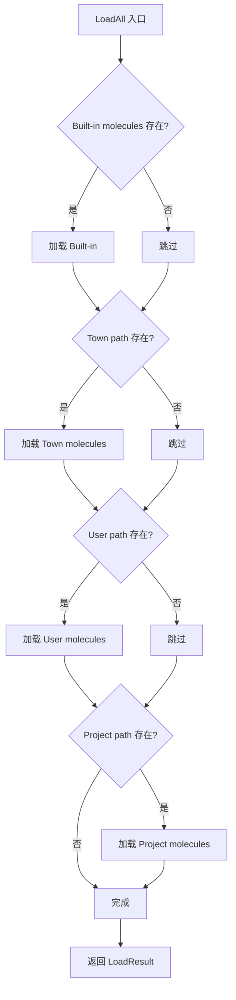
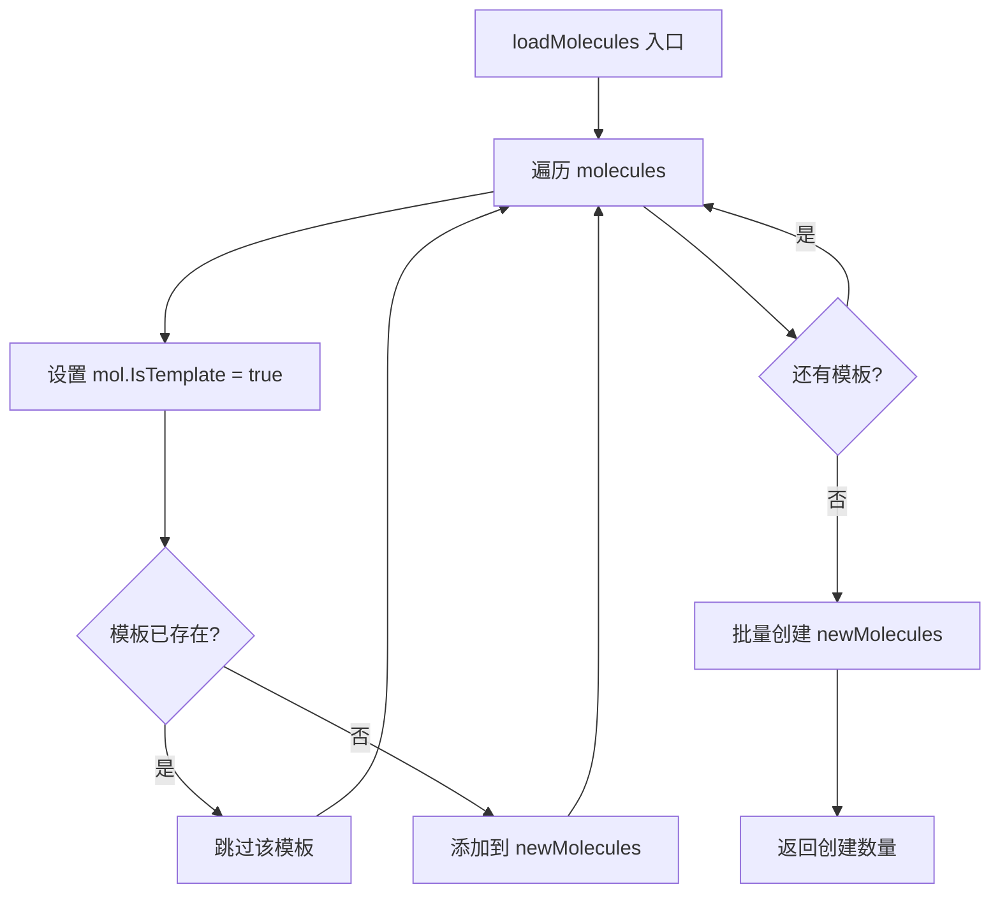
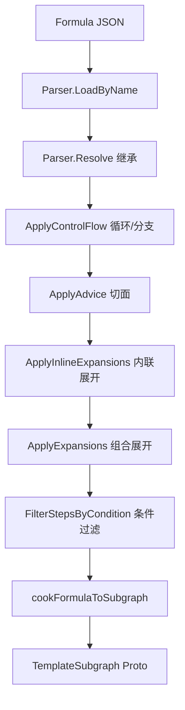
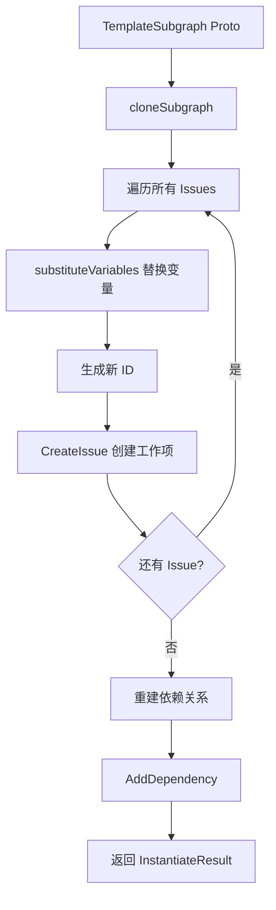

# PD-150.01 beads — 模板分子系统与层级加载

> 文档编号：PD-150.01
> 来源：beads `internal/molecules/molecules.go`, `cmd/bd/pour.go`, `internal/formula/types.go`
> GitHub：https://github.com/steveyegge/beads.git
> 问题域：PD-150 模板分子系统 Template & Molecule System
> 状态：可复用方案

---

## 第 1 章 问题与动机

### 1.1 核心问题

Agent 工程中，工作流模板（workflow template）是提升效率的关键。但传统模板系统存在以下痛点：

1. **模板存储混乱** — 模板与工作项混在一起，难以区分和管理
2. **无层级覆盖机制** — 无法实现"内置模板 < 团队模板 < 用户模板 < 项目模板"的优先级覆盖
3. **模板实例化不透明** — 从模板到工作项的转换过程缺乏可追溯性
4. **变量替换不灵活** — 模板中的占位符替换机制不够强大，无法支持复杂场景

这些问题导致团队难以复用工作流模板，每次都要从头定义，浪费大量时间。

### 1.2 beads 的解法概述

beads 通过 **molecules（分子）** 系统实现了一套完整的模板管理方案：

1. **模板与工作项分离** — 模板标记为 `is_template: true`，存储在独立的 `molecules.jsonl` 文件中，不出现在常规工作项列表（`internal/molecules/molecules.go:17-21`）
2. **四级层级加载** — 支持 built-in（内置）、town（团队）、user（用户）、project（项目）四级模板目录，后者覆盖前者（`internal/molecules/molecules.go:9-14`）
3. **Formula → Proto → Molecule 三阶段** — Formula（配方）编译为 Proto（原型），实例化为 Molecule（分子），清晰的转换链路（`cmd/bd/cook.go:419-477`）
4. **强大的变量系统** — 支持 `{{variable}}` 占位符、默认值、必填校验、条件过滤（`internal/formula/types.go:111-132`）
5. **模板只读保护** — 模板被标记为只读，防止误修改（`internal/molecules/molecules.go:133`）

### 1.3 设计思想

| 设计原则 | 具体实现 | 理由 | 替代方案 |
|----------|----------|------|----------|
| 模板与工作项分离 | `is_template: true` + 独立 `molecules.jsonl` 文件 | 避免模板污染工作项列表，便于管理 | 用标签过滤（但无法物理隔离） |
| 层级覆盖机制 | built-in < town < user < project 四级加载 | 支持团队共享 + 个人定制 + 项目特化 | 单一全局目录（无法定制） |
| 三阶段转换 | Formula → Proto → Molecule | 分离模板定义、编译、实例化三个阶段 | 直接从模板实例化（缺乏中间态） |
| 变量系统 | `{{var}}` + VarDef（默认值、必填、枚举） | 灵活的占位符替换 + 编译时校验 | 简单字符串替换（无校验） |
| 模板只读 | `IsTemplate` 字段 + 创建时强制设置 | 防止误修改模板 | 权限控制（更复杂） |

---

## 第 2 章 源码实现分析

### 2.1 架构概览

beads 的模板系统分为三层：

```
┌─────────────────────────────────────────────────────────────┐
│                    Formula Layer (配方层)                     │
│  .formula.json 文件 → Parser → Resolved Formula             │
│  支持：变量定义、步骤定义、继承、组合规则                      │
└─────────────────────────────────────────────────────────────┘
                              ↓ cook (编译)
┌─────────────────────────────────────────────────────────────┐
│                    Proto Layer (原型层)                       │
│  TemplateSubgraph (内存中的模板图)                            │
│  包含：Root Issue + 所有子 Issue + 依赖关系                   │
└─────────────────────────────────────────────────────────────┘
                              ↓ pour/wisp (实例化)
┌─────────────────────────────────────────────────────────────┐
│                  Molecule Layer (分子层)                      │
│  真实的工作项（Issues）存储在 .beads/issues.jsonl            │
│  变量已替换，依赖关系已建立，可以开始执行                      │
└─────────────────────────────────────────────────────────────┘
```

**层级加载路径**（`internal/molecules/molecules.go:59-123`）：

```
1. Built-in molecules (嵌入在二进制中)
   ↓
2. Town-level: $GT_ROOT/.beads/molecules.jsonl
   ↓
3. User-level: ~/.beads/molecules.jsonl
   ↓
4. Project-level: .beads/molecules.jsonl
```

后加载的同名模板会覆盖先加载的。

### 2.2 核心实现

#### 2.2.1 层级加载机制



对应源码 `internal/molecules/molecules.go:59-123`：

```go
// LoadAll loads molecules from all available catalog locations.
// Molecules are loaded in priority order: built-in < town < user < project.
// Later sources override earlier ones if they have the same ID.
func (l *Loader) LoadAll(ctx context.Context, beadsDir string) (*LoadResult, error) {
	result := &LoadResult{
		Sources: make([]string, 0),
	}

	// 1. Load built-in molecules (embedded in binary)
	builtinMolecules := getBuiltinMolecules()
	if len(builtinMolecules) > 0 {
		count, err := l.loadMolecules(ctx, builtinMolecules)
		if err != nil {
			debug.Logf("warning: failed to load built-in molecules: %v", err)
		} else {
			result.BuiltinCount = count
			result.Loaded += count
			result.Sources = append(result.Sources, "<built-in>")
		}
	}

	// 2. Load town-level molecules ($GT_ROOT/.beads/molecules.jsonl)
	townPath := getTownMoleculesPath()
	if townPath != "" {
		if molecules, err := loadMoleculesFromFile(townPath); err == nil && len(molecules) > 0 {
			count, err := l.loadMolecules(ctx, molecules)
			if err != nil {
				debug.Logf("warning: failed to load town molecules: %v", err)
			} else {
				result.Loaded += count
				result.Sources = append(result.Sources, townPath)
			}
		}
	}

	// 3. Load user-level molecules (~/.beads/molecules.jsonl)
	userPath := getUserMoleculesPath()
	if userPath != "" && userPath != townPath {
		if molecules, err := loadMoleculesFromFile(userPath); err == nil && len(molecules) > 0 {
			count, err := l.loadMolecules(ctx, molecules)
			if err != nil {
				debug.Logf("warning: failed to load user molecules: %v", err)
			} else {
				result.Loaded += count
				result.Sources = append(result.Sources, userPath)
			}
		}
	}

	// 4. Load project-level molecules (.beads/molecules.jsonl)
	if beadsDir != "" {
		projectPath := filepath.Join(beadsDir, MoleculeFileName)
		if molecules, err := loadMoleculesFromFile(projectPath); err == nil && len(molecules) > 0 {
			count, err := l.loadMolecules(ctx, molecules)
			if err != nil {
				debug.Logf("warning: failed to load project molecules: %v", err)
			} else {
				result.Loaded += count
				result.Sources = append(result.Sources, projectPath)
			}
		}
	}

	return result, nil
}
```

**关键设计**：
- 每个层级的加载失败不会中断整个流程，只记录警告（`debug.Logf`）
- 同名模板后加载的覆盖先加载的（通过 `GetIssue` 检查是否已存在，存在则跳过）
- 返回 `LoadResult` 包含加载统计信息，便于调试

#### 2.2.2 模板只读保护



对应源码 `internal/molecules/molecules.go:128-160`：

```go
// loadMolecules loads a slice of molecules into the store.
// Each molecule is marked as a template (IsTemplate = true).
// Returns the number of molecules successfully loaded.
func (l *Loader) loadMolecules(ctx context.Context, molecules []*types.Issue) (int, error) {
	// Filter out molecules that already exist
	var newMolecules []*types.Issue
	for _, mol := range molecules {
		// Ensure molecule is marked as a template
		mol.IsTemplate = true

		// Check if molecule already exists
		existing, err := l.store.GetIssue(ctx, mol.ID)
		if err == nil && existing != nil {
			// Already exists - skip (or could update if newer)
			debug.Logf("molecule %s already exists, skipping", mol.ID)
			continue
		}

		newMolecules = append(newMolecules, mol)
	}

	if len(newMolecules) == 0 {
		return 0, nil
	}

	// Use batch creation with prefix validation skipped.
	// Molecules have their own ID namespace (mol-*) independent of project prefix.
	opts := storage.BatchCreateOptions{
		SkipPrefixValidation: true, // Molecules use their own prefix
		OrphanHandling:       storage.OrphanAllow,
	}
	if err := l.store.CreateIssuesWithFullOptions(ctx, newMolecules, "molecules-loader", opts); err != nil {
		return 0, fmt.Errorf("batch create molecules: %w", err)
	}
	return len(newMolecules), nil
}
```

**关键设计**：
- 强制设置 `mol.IsTemplate = true`（L133），即使 JSONL 文件中忘记设置也会自动补上
- 使用 `SkipPrefixValidation`（L153），允许模板使用自己的 ID 前缀（如 `mol-feature`），不受项目前缀限制
- 批量创建提升性能，避免逐个插入的开销


#### 2.2.3 Formula → Proto 编译



对应源码 `cmd/bd/cook.go:658-762`：

```go
// resolveAndCookFormulaWithVars loads a formula and optionally filters steps by condition.
// If conditionVars is provided, steps with conditions that evaluate to false are excluded.
// Pass nil for conditionVars to include all steps (condition filtering skipped).
func resolveAndCookFormulaWithVars(formulaName string, searchPaths []string, conditionVars map[string]string) (*TemplateSubgraph, error) {
	// Create parser with search paths
	parser := formula.NewParser(searchPaths...)

	// Load formula by name
	f, err := parser.LoadByName(formulaName)
	if err != nil {
		return nil, fmt.Errorf("loading formula %q: %w", formulaName, err)
	}

	// Resolve inheritance
	resolved, err := parser.Resolve(f)
	if err != nil {
		return nil, fmt.Errorf("resolving formula %q: %w", formulaName, err)
	}

	// Apply control flow operators - loops, branches, gates
	controlFlowSteps, err := formula.ApplyControlFlow(resolved.Steps, resolved.Compose)
	if err != nil {
		return nil, fmt.Errorf("applying control flow to %q: %w", formulaName, err)
	}
	resolved.Steps = controlFlowSteps

	// Apply advice transformations
	if len(resolved.Advice) > 0 {
		resolved.Steps = formula.ApplyAdvice(resolved.Steps, resolved.Advice)
	}

	// Apply inline step expansions
	inlineExpandedSteps, err := formula.ApplyInlineExpansions(resolved.Steps, parser)
	if err != nil {
		return nil, fmt.Errorf("applying inline expansions to %q: %w", formulaName, err)
	}
	resolved.Steps = inlineExpandedSteps

	// Apply expansion operators
	if resolved.Compose != nil && (len(resolved.Compose.Expand) > 0 || len(resolved.Compose.Map) > 0) {
		expandedSteps, err := formula.ApplyExpansions(resolved.Steps, resolved.Compose, parser)
		if err != nil {
			return nil, fmt.Errorf("applying expansions to %q: %w", formulaName, err)
		}
		resolved.Steps = expandedSteps
	}

	// Apply aspects from compose.aspects
	if resolved.Compose != nil && len(resolved.Compose.Aspects) > 0 {
		for _, aspectName := range resolved.Compose.Aspects {
			aspectFormula, err := parser.LoadByName(aspectName)
			if err != nil {
				return nil, fmt.Errorf("loading aspect %q: %w", aspectName, err)
			}
			if aspectFormula.Type != formula.TypeAspect {
				return nil, fmt.Errorf("%q is not an aspect formula (type=%s)", aspectName, aspectFormula.Type)
			}
			if len(aspectFormula.Advice) > 0 {
				resolved.Steps = formula.ApplyAdvice(resolved.Steps, aspectFormula.Advice)
			}
		}
	}

	// Apply step condition filtering if vars provided (bd-7zka.1)
	// This filters out steps whose conditions evaluate to false
	if conditionVars != nil {
		// Merge with formula defaults for complete evaluation
		mergedVars := make(map[string]string)
		for name, def := range resolved.Vars {
			if def != nil && def.Default != nil {
				mergedVars[name] = *def.Default
			}
		}
		for k, v := range conditionVars {
			mergedVars[k] = v
		}

		filteredSteps, err := formula.FilterStepsByCondition(resolved.Steps, mergedVars)
		if err != nil {
			return nil, fmt.Errorf("filtering steps by condition: %w", err)
		}
		resolved.Steps = filteredSteps
	}

	// Cook to in-memory subgraph, including variable definitions for default handling
	return cookFormulaToSubgraphWithVars(resolved, resolved.Formula, resolved.Vars)
}
```

**关键设计**：
- 多阶段转换管道，每个阶段职责单一
- 支持条件过滤（`condition: "{{var}} == value"`），在编译时就能剔除不需要的步骤
- 最终生成的 `TemplateSubgraph` 是纯内存结构，不依赖数据库

#### 2.2.4 Proto → Molecule 实例化



对应源码 `cmd/bd/template.go:712-813`：

```go
// cloneSubgraph creates new issues from the template with variable substitution.
// Uses CloneOptions to control all spawn/bond behavior including dynamic bonding.
func cloneSubgraph(ctx context.Context, s *dolt.DoltStore, subgraph *TemplateSubgraph, opts CloneOptions) (*InstantiateResult, error) {
	if s == nil {
		return nil, fmt.Errorf("no database connection")
	}

	// Generate new IDs and create mapping
	idMapping := make(map[string]string)

	// Use transaction for atomicity
	err := transact(ctx, s, "bd: clone template subgraph", func(tx storage.Transaction) error {
		// First pass: create all issues with new IDs
		for _, oldIssue := range subgraph.Issues {
			// Determine assignee: use override for root epic, otherwise keep template's
			issueAssignee := oldIssue.Assignee
			if oldIssue.ID == subgraph.Root.ID && opts.Assignee != "" {
				issueAssignee = opts.Assignee
			}

			newIssue := &types.Issue{
				// ID will be set below based on bonding options
				Title:              substituteVariables(oldIssue.Title, opts.Vars),
				Description:        substituteVariables(oldIssue.Description, opts.Vars),
				Design:             substituteVariables(oldIssue.Design, opts.Vars),
				AcceptanceCriteria: substituteVariables(oldIssue.AcceptanceCriteria, opts.Vars),
				Notes:              substituteVariables(oldIssue.Notes, opts.Vars),
				Status:             types.StatusOpen, // Always start fresh
				Priority:           oldIssue.Priority,
				IssueType:          oldIssue.IssueType,
				Assignee:           issueAssignee,
				EstimatedMinutes:   oldIssue.EstimatedMinutes,
				Ephemeral:          opts.Ephemeral, // mark for cleanup when closed
				IDPrefix:           opts.Prefix,    // distinct prefixes for mols/wisps
				// Gate fields (for async coordination)
				AwaitType: oldIssue.AwaitType,
				AwaitID:   substituteVariables(oldIssue.AwaitID, opts.Vars),
				Timeout:   oldIssue.Timeout,
				CreatedAt: time.Now(),
				UpdatedAt: time.Now(),
			}

			// Generate custom ID for dynamic bonding if ParentID is set
			if opts.ParentID != "" {
				bondedID, err := generateBondedID(oldIssue.ID, subgraph.Root.ID, opts)
				if err != nil {
					return fmt.Errorf("failed to generate bonded ID for %s: %w", oldIssue.ID, err)
				}
				newIssue.ID = bondedID
			}

			if err := tx.CreateIssue(ctx, newIssue, opts.Actor); err != nil {
				return fmt.Errorf("failed to create issue from %s: %w", oldIssue.ID, err)
			}

			idMapping[oldIssue.ID] = newIssue.ID
		}

		// Second pass: recreate dependencies with new IDs
		for _, dep := range subgraph.Dependencies {
			newFromID, ok1 := idMapping[dep.IssueID]
			newToID, ok2 := idMapping[dep.DependsOnID]
			if !ok1 || !ok2 {
				continue // Skip if either end is outside the subgraph
			}

			newDep := &types.Dependency{
				IssueID:     newFromID,
				DependsOnID: newToID,
				Type:        dep.Type,
			}
			if err := tx.AddDependency(ctx, newDep, opts.Actor); err != nil {
				return fmt.Errorf("failed to create dependency: %w", err)
			}
		}

		// Atomic attachment: link spawned root to target molecule within
		// the same transaction (bd-wvplu: prevents orphaned spawns)
		if opts.AttachToID != "" {
			attachDep := &types.Dependency{
				IssueID:     idMapping[subgraph.Root.ID],
				DependsOnID: opts.AttachToID,
				Type:        opts.AttachDepType,
			}
			if err := tx.AddDependency(ctx, attachDep, opts.Actor); err != nil {
				return fmt.Errorf("attaching to molecule: %w", err)
			}
		}

		return nil
	})

	if err != nil {
		return nil, err
	}

	return &InstantiateResult{
		NewEpicID: idMapping[subgraph.Root.ID],
		IDMapping: idMapping,
		Created:   len(subgraph.Issues),
	}, nil
}
```

**关键设计**：
- 两阶段提交：先创建所有 Issue，再创建依赖关系，避免外键约束问题
- 事务保证原子性，要么全部成功，要么全部回滚
- 支持 `Ephemeral` 标记，用于临时工作流（wisp）的自动清理
- 支持 `AttachToID` 原子附加，防止孤儿分子

### 2.3 实现细节

#### 2.3.1 变量系统

Formula 中的变量定义（`internal/formula/types.go:111-132`）：

```go
// VarDef defines a template variable with optional validation.
type VarDef struct {
	// Description explains what this variable is for.
	Description string `json:"description,omitempty"`

	// Default is the value to use if not provided.
	// nil means no default (variable must be provided if referenced).
	// Non-nil (including &"") means the variable has an explicit default.
	Default *string `json:"default,omitempty"`

	// Required indicates the variable must be provided (no default).
	Required bool `json:"required,omitempty"`

	// Enum lists the allowed values (if non-empty).
	Enum []string `json:"enum,omitempty"`

	// Pattern is a regex pattern the value must match.
	Pattern string `json:"pattern,omitempty"`

	// Type is the expected value type: string (default), int, bool.
	Type string `json:"type,omitempty"`
}
```

变量替换函数（`cmd/bd/template.go:22-23`）：

```go
// variablePattern matches {{variable}} placeholders
var variablePattern = regexp.MustCompile(`\{\{([a-zA-Z_][a-zA-Z0-9_]*)\}\}`)
```

支持在 Title、Description、Design、AcceptanceCriteria、Notes 等所有文本字段中使用 `{{variable}}` 占位符。

#### 2.3.2 模板目录组织

```
~/.beads/
├── molecules.jsonl          # 用户级模板
└── formulas/                # 用户级 Formula 定义
    ├── mol-feature.formula.json
    └── mol-bugfix.formula.json

$GT_ROOT/.beads/             # 团队级（orchestrator）
├── molecules.jsonl
└── formulas/

.beads/                      # 项目级
├── molecules.jsonl
├── issues.jsonl             # 工作项（非模板）
└── formulas/
```

**最佳实践**：
- Built-in 模板：通用工作流（feature、bugfix、release）
- Town 模板：团队共享的特定工作流（如公司的发布流程）
- User 模板：个人常用的工作流模板
- Project 模板：项目特定的工作流（如特定功能的开发流程）

---

## 第 3 章 迁移指南

### 3.1 迁移清单

将 beads 的模板分子系统迁移到自己的项目，需要以下步骤：

**阶段 1：基础结构**
- [ ] 定义 `Issue` 数据结构，添加 `IsTemplate` 字段
- [ ] 创建独立的模板存储文件（如 `templates.jsonl`）
- [ ] 实现模板与工作项的物理隔离

**阶段 2：层级加载**
- [ ] 设计层级目录结构（built-in / team / user / project）
- [ ] 实现 `Loader` 类，支持多路径加载
- [ ] 实现同名模板覆盖逻辑

**阶段 3：变量系统**
- [ ] 定义 `VarDef` 结构（默认值、必填、枚举、正则）
- [ ] 实现 `{{variable}}` 占位符解析
- [ ] 实现变量替换函数

**阶段 4：三阶段转换**
- [ ] 设计 Formula 格式（JSON/YAML）
- [ ] 实现 Formula → Proto 编译器
- [ ] 实现 Proto → Molecule 实例化器

**阶段 5：高级特性**
- [ ] 实现条件过滤（`condition: "{{var}} == value"`）
- [ ] 实现模板继承（`extends`）
- [ ] 实现模板组合（bonding）

### 3.2 适配代码模板

#### 3.2.1 Python 实现示例

```python
from dataclasses import dataclass, field
from typing import Optional, List, Dict
import json
import re
from pathlib import Path

@dataclass
class VarDef:
    """变量定义"""
    description: str = ""
    default: Optional[str] = None
    required: bool = False
    enum: List[str] = field(default_factory=list)
    pattern: Optional[str] = None
    type: str = "string"

@dataclass
class Issue:
    """工作项/模板"""
    id: str
    title: str
    description: str = ""
    is_template: bool = False
    # ... 其他字段

@dataclass
class TemplateSubgraph:
    """模板子图（Proto）"""
    root: Issue
    issues: List[Issue]
    dependencies: List[Dict]
    var_defs: Dict[str, VarDef] = field(default_factory=dict)

class MoleculeLoader:
    """模板加载器"""
    
    def __init__(self, store):
        self.store = store
    
    def load_all(self, project_dir: Path) -> Dict:
        """四级层级加载"""
        result = {
            "loaded": 0,
            "sources": []
        }
        
        # 1. Built-in molecules
        builtin = self._load_builtin()
        result["loaded"] += len(builtin)
        result["sources"].append("<built-in>")
        
        # 2. Team-level (if GT_ROOT set)
        team_path = Path(os.getenv("GT_ROOT", "")) / ".beads" / "molecules.jsonl"
        if team_path.exists():
            team_mols = self._load_from_file(team_path)
            result["loaded"] += len(team_mols)
            result["sources"].append(str(team_path))
        
        # 3. User-level
        user_path = Path.home() / ".beads" / "molecules.jsonl"
        if user_path.exists():
            user_mols = self._load_from_file(user_path)
            result["loaded"] += len(user_mols)
            result["sources"].append(str(user_path))
        
        # 4. Project-level
        project_path = project_dir / ".beads" / "molecules.jsonl"
        if project_path.exists():
            project_mols = self._load_from_file(project_path)
            result["loaded"] += len(project_mols)
            result["sources"].append(str(project_path))
        
        return result
    
    def _load_from_file(self, path: Path) -> List[Issue]:
        """从 JSONL 文件加载模板"""
        molecules = []
        with open(path) as f:
            for line in f:
                if line.strip():
                    data = json.loads(line)
                    issue = Issue(**data)
                    issue.is_template = True  # 强制标记
                    
                    # 检查是否已存在（覆盖逻辑）
                    if not self.store.exists(issue.id):
                        self.store.create(issue)
                        molecules.append(issue)
        return molecules

class VariableSubstitutor:
    """变量替换器"""
    
    VAR_PATTERN = re.compile(r'\{\{([a-zA-Z_][a-zA-Z0-9_]*)\}\}')
    
    @classmethod
    def substitute(cls, text: str, vars: Dict[str, str]) -> str:
        """替换 {{variable}} 占位符"""
        def replacer(match):
            var_name = match.group(1)
            return vars.get(var_name, match.group(0))  # 未找到则保留原样
        return cls.VAR_PATTERN.sub(replacer, text)
    
    @classmethod
    def extract_vars(cls, text: str) -> List[str]:
        """提取文本中的所有变量名"""
        return cls.VAR_PATTERN.findall(text)

class MoleculeInstantiator:
    """模板实例化器"""
    
    def instantiate(self, proto: TemplateSubgraph, vars: Dict[str, str]) -> Dict:
        """实例化模板为工作项"""
        # 1. 校验必填变量
        self._validate_vars(proto.var_defs, vars)
        
        # 2. 应用默认值
        merged_vars = self._apply_defaults(proto.var_defs, vars)
        
        # 3. 克隆所有 Issue
        id_mapping = {}
        new_issues = []
        
        for old_issue in proto.issues:
            new_issue = Issue(
                id=self._generate_id(),
                title=VariableSubstitutor.substitute(old_issue.title, merged_vars),
                description=VariableSubstitutor.substitute(old_issue.description, merged_vars),
                is_template=False  # 实例化后不再是模板
            )
            id_mapping[old_issue.id] = new_issue.id
            new_issues.append(new_issue)
        
        # 4. 重建依赖关系
        for dep in proto.dependencies:
            new_dep = {
                "from": id_mapping[dep["from"]],
                "to": id_mapping[dep["to"]],
                "type": dep["type"]
            }
            self.store.add_dependency(new_dep)
        
        return {
            "root_id": id_mapping[proto.root.id],
            "created": len(new_issues),
            "id_mapping": id_mapping
        }
    
    def _validate_vars(self, var_defs: Dict[str, VarDef], vars: Dict[str, str]):
        """校验变量"""
        for name, defn in var_defs.items():
            if defn.required and name not in vars:
                raise ValueError(f"Missing required variable: {name}")
            
            if name in vars:
                value = vars[name]
                # 枚举校验
                if defn.enum and value not in defn.enum:
                    raise ValueError(f"Variable {name} must be one of {defn.enum}")
                # 正则校验
                if defn.pattern and not re.match(defn.pattern, value):
                    raise ValueError(f"Variable {name} does not match pattern {defn.pattern}")
    
    def _apply_defaults(self, var_defs: Dict[str, VarDef], vars: Dict[str, str]) -> Dict[str, str]:
        """应用默认值"""
        merged = vars.copy()
        for name, defn in var_defs.items():
            if name not in merged and defn.default is not None:
                merged[name] = defn.default
        return merged
```

### 3.3 适用场景

| 场景 | 适用度 | 说明 |
|------|--------|------|
| Agent 工作流管理 | ⭐⭐⭐⭐⭐ | 核心场景，支持复用工作流模板 |
| 多团队协作 | ⭐⭐⭐⭐⭐ | 层级加载支持团队共享 + 个人定制 |
| 项目脚手架 | ⭐⭐⭐⭐ | 可用于生成项目初始结构 |
| CI/CD 流水线 | ⭐⭐⭐⭐ | 模板化发布流程 |
| 单人项目 | ⭐⭐⭐ | 层级加载有些过度设计，但变量系统仍有价值 |
| 简单任务管理 | ⭐⭐ | 如果不需要复杂工作流，可能过于复杂 |

---

## 第 4 章 测试用例

```python
import pytest
from pathlib import Path
import tempfile
import json

class TestMoleculeLoader:
    """测试模板加载器"""
    
    def test_load_from_file(self):
        """测试从文件加载模板"""
        with tempfile.NamedTemporaryFile(mode='w', suffix='.jsonl', delete=False) as f:
            # 写入测试数据
            json.dump({"id": "mol-test", "title": "Test Template", "is_template": True}, f)
            f.write('\n')
            json.dump({"id": "mol-test2", "title": "Test Template 2"}, f)
            f.write('\n')
            temp_path = Path(f.name)
        
        try:
            store = MockStore()
            loader = MoleculeLoader(store)
            molecules = loader._load_from_file(temp_path)
            
            assert len(molecules) == 2
            assert all(m.is_template for m in molecules)  # 强制标记
            assert molecules[0].id == "mol-test"
        finally:
            temp_path.unlink()
    
    def test_hierarchical_loading(self):
        """测试层级加载覆盖"""
        with tempfile.TemporaryDirectory() as tmpdir:
            project_dir = Path(tmpdir)
            beads_dir = project_dir / ".beads"
            beads_dir.mkdir()
            
            # 创建项目级模板（覆盖内置）
            mol_file = beads_dir / "molecules.jsonl"
            with open(mol_file, 'w') as f:
                json.dump({"id": "mol-feature", "title": "Custom Feature Template"}, f)
                f.write('\n')
            
            store = MockStore()
            loader = MoleculeLoader(store)
            result = loader.load_all(project_dir)
            
            # 项目级模板应该覆盖内置模板
            loaded_mol = store.get("mol-feature")
            assert loaded_mol.title == "Custom Feature Template"

class TestVariableSubstitutor:
    """测试变量替换"""
    
    def test_substitute_simple(self):
        """测试简单变量替换"""
        text = "Implement {{feature}} in {{component}}"
        vars = {"feature": "dark mode", "component": "UI"}
        result = VariableSubstitutor.substitute(text, vars)
        assert result == "Implement dark mode in UI"
    
    def test_substitute_missing_var(self):
        """测试缺失变量保留原样"""
        text = "Implement {{feature}} in {{component}}"
        vars = {"feature": "dark mode"}
        result = VariableSubstitutor.substitute(text, vars)
        assert result == "Implement dark mode in {{component}}"
    
    def test_extract_vars(self):
        """测试提取变量名"""
        text = "Implement {{feature}} in {{component}} for {{version}}"
        vars = VariableSubstitutor.extract_vars(text)
        assert set(vars) == {"feature", "component", "version"}

class TestMoleculeInstantiator:
    """测试模板实例化"""
    
    def test_instantiate_with_vars(self):
        """测试带变量实例化"""
        proto = TemplateSubgraph(
            root=Issue(id="mol-feature", title="Feature: {{name}}", is_template=True),
            issues=[
                Issue(id="mol-feature", title="Feature: {{name}}", is_template=True),
                Issue(id="mol-feature.1", title="Design {{name}}", is_template=True),
                Issue(id="mol-feature.2", title="Implement {{name}}", is_template=True),
            ],
            dependencies=[
                {"from": "mol-feature.1", "to": "mol-feature", "type": "parent-child"},
                {"from": "mol-feature.2", "to": "mol-feature", "type": "parent-child"},
                {"from": "mol-feature.2", "to": "mol-feature.1", "type": "blocks"},
            ],
            var_defs={"name": VarDef(description="Feature name", required=True)}
        )
        
        store = MockStore()
        instantiator = MoleculeInstantiator(store)
        result = instantiator.instantiate(proto, {"name": "authentication"})
        
        assert result["created"] == 3
        root_issue = store.get(result["root_id"])
        assert root_issue.title == "Feature: authentication"
        assert not root_issue.is_template
    
    def test_validate_required_var(self):
        """测试必填变量校验"""
        proto = TemplateSubgraph(
            root=Issue(id="mol-test", title="Test", is_template=True),
            issues=[Issue(id="mol-test", title="Test", is_template=True)],
            dependencies=[],
            var_defs={"name": VarDef(required=True)}
        )
        
        instantiator = MoleculeInstantiator(MockStore())
        with pytest.raises(ValueError, match="Missing required variable: name"):
            instantiator.instantiate(proto, {})
    
    def test_apply_defaults(self):
        """测试默认值应用"""
        proto = TemplateSubgraph(
            root=Issue(id="mol-test", title="{{title}}", is_template=True),
            issues=[Issue(id="mol-test", title="{{title}}", is_template=True)],
            dependencies=[],
            var_defs={"title": VarDef(default="Default Title")}
        )
        
        store = MockStore()
        instantiator = MoleculeInstantiator(store)
        result = instantiator.instantiate(proto, {})
        
        root_issue = store.get(result["root_id"])
        assert root_issue.title == "Default Title"

class MockStore:
    """模拟存储"""
    def __init__(self):
        self.data = {}
    
    def exists(self, id: str) -> bool:
        return id in self.data
    
    def create(self, issue: Issue):
        self.data[issue.id] = issue
    
    def get(self, id: str) -> Optional[Issue]:
        return self.data.get(id)
    
    def add_dependency(self, dep: Dict):
        pass  # 简化实现
```


---

## 第 5 章 跨域关联

| 关联域 | 关系类型 | 说明 |
|--------|----------|------|
| PD-04 工具系统 | 协同 | Formula 中的 steps 可以定义工具调用，模板实例化时工具配置也会被复制 |
| PD-02 多 Agent 编排 | 协同 | Molecule 可以作为 Agent 的工作单元，支持并行/串行编排 |
| PD-06 记忆持久化 | 依赖 | 模板和实例化结果都需要持久化存储（JSONL 文件 + Dolt 数据库） |
| PD-08 搜索与检索 | 协同 | 需要支持按模板 ID、变量、标签搜索模板 |
| PD-11 可观测性 | 协同 | 模板实例化过程需要记录日志，便于调试和审计 |

---

## 第 6 章 来源文件索引

| 文件 | 行范围 | 关键实现 |
|------|--------|----------|
| `internal/molecules/molecules.go` | L1-L254 | 模板加载器核心实现，层级加载逻辑 |
| `internal/molecules/molecules.go` | L59-L123 | `LoadAll` 四级层级加载 |
| `internal/molecules/molecules.go` | L128-L160 | `loadMolecules` 模板只读保护 |
| `internal/formula/types.go` | L60-L109 | `Formula` 结构定义 |
| `internal/formula/types.go` | L111-L132 | `VarDef` 变量定义 |
| `internal/formula/types.go` | L179-L255 | `Step` 步骤定义 |
| `cmd/bd/cook.go` | L419-L477 | `cookFormulaToSubgraph` Formula → Proto 编译 |
| `cmd/bd/cook.go` | L658-L762 | `resolveAndCookFormulaWithVars` 完整编译管道 |
| `cmd/bd/template.go` | L25-L33 | `TemplateSubgraph` Proto 结构 |
| `cmd/bd/template.go` | L712-L813 | `cloneSubgraph` Proto → Molecule 实例化 |
| `cmd/bd/pour.go` | L1-L267 | `pour` 命令实现，持久化实例化 |
| `cmd/bd/mol.go` | L65-L85 | `spawnMolecule` 实例化入口 |
| `website/docs/workflows/molecules.md` | L1-L167 | 用户文档，使用示例 |

---

## 第 7 章 横向对比维度

```json comparison_data
{
  "project": "beads",
  "dimensions": {
    "模板存储": "独立 molecules.jsonl 文件，is_template 标记隔离",
    "层级加载": "四级覆盖（built-in < town < user < project）",
    "实例化方式": "Formula → Proto → Molecule 三阶段转换",
    "变量系统": "VarDef 支持默认值、必填、枚举、正则校验",
    "模板保护": "IsTemplate 强制标记 + 只读保护"
  }
}
```

### 域元数据补充

```json domain_metadata
{
  "solution_summary": "beads 用四级层级加载（built-in/town/user/project）+ Formula→Proto→Molecule 三阶段转换实现可复用模板系统",
  "description": "",
  "sub_problems": [],
  "best_practices": []
}
```

