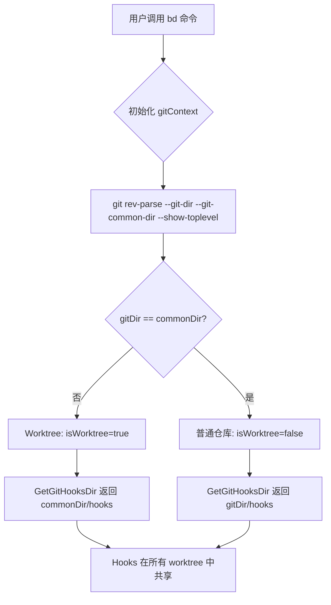
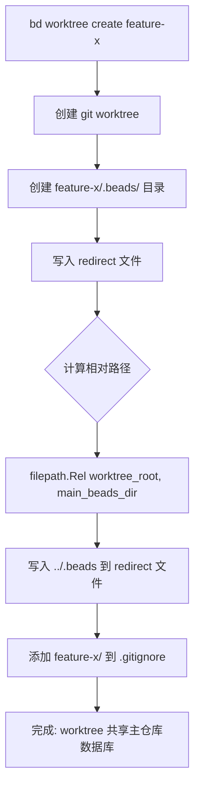
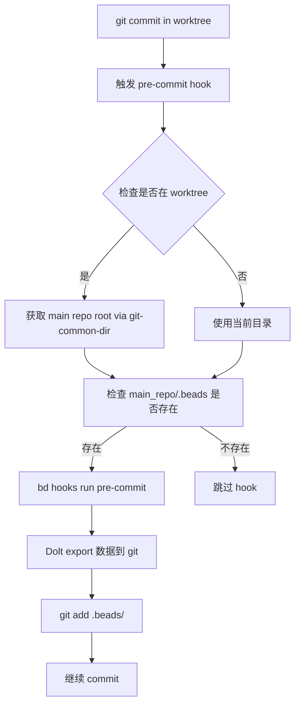

# PD-151.01 beads — Git 工作树深度集成与数据隔离

> 文档编号：PD-151.01
> 来源：beads `cmd/bd/worktree_cmd.go`, `internal/git/gitdir.go`, `cmd/bd/init_git_hooks.go`
> GitHub：https://github.com/steveyegge/beads.git
> 问题域：PD-151 Git 工作树集成 Git Worktree Integration
> 状态：可复用方案

---

## 第 1 章 问题与动机（≥ 30 行）

### 1.1 核心问题

在 Agent 工程中，多分支并行开发是常见需求：多个 Agent 可能同时在不同分支上工作，或者开发者需要在不同特性分支间快速切换而不丢失工作状态。传统的 git clone 多份仓库方案存在以下问题：

1. **存储浪费**：每个分支都需要完整的 .git 目录，占用大量磁盘空间
2. **数据不一致**：每个分支有独立的数据库副本，状态难以同步
3. **切换成本高**：分支切换需要 stash/commit，打断工作流
4. **合并冲突复杂**：多个数据库副本的合并需要手动协调

Git worktree 提供了轻量级的多分支工作目录方案，但引入了新的挑战：

- **数据隔离问题**：每个 worktree 应该有独立的数据库实例，还是共享同一个？
- **Git hooks 共享**：hooks 存储在共享的 .git/hooks/ 目录，如何确保在所有 worktree 中生效？
- **分支切换同步**：worktree 间切换时，如何自动同步数据库状态？
- **合并冲突处理**：多个 worktree 同时修改数据时，如何检测和解决冲突？

### 1.2 beads 的解法概述

beads 深度集成 git worktree，通过以下机制实现多分支并行开发：

1. **Redirect 文件机制**（`internal/beads/beads.go:38-92`）：worktree 中的 `.beads/redirect` 文件指向主仓库的 `.beads` 目录，实现数据库共享
2. **Worktree-aware Git 路径解析**（`internal/git/gitdir.go:90-119`）：使用 `git rev-parse --git-common-dir` 区分 worktree 特定路径和共享路径
3. **Git hooks 自动安装**（`cmd/bd/init_git_hooks.go:120-192`）：hooks 安装到共享的 `.git/hooks/` 目录，所有 worktree 自动生效
4. **Post-commit/post-merge hooks**（`cmd/bd/init_git_hooks.go:236-297`）：自动同步 Dolt 数据库，确保分支切换后数据一致
5. **Worktree 命令封装**（`cmd/bd/worktree_cmd.go:142-252`）：`bd worktree create` 自动创建 redirect 文件和 .gitignore 条目

### 1.3 设计思想

| 设计原则 | 具体实现 | 理由 | 替代方案 |
|----------|----------|------|----------|
| 数据库共享而非隔离 | Worktree 通过 redirect 文件指向主仓库 .beads | 避免数据不一致，简化合并流程 | 每个 worktree 独立数据库（需要复杂的同步机制） |
| Git hooks 集中管理 | Hooks 安装到 `--git-common-dir/hooks/`，所有 worktree 共享 | 确保行为一致，避免重复安装 | 每个 worktree 独立 hooks（维护成本高） |
| 路径解析 worktree-aware | 使用 `git rev-parse --git-common-dir` 而非硬编码 `.git` | 正确处理 worktree 的 .git 文件（非目录） | 假设 .git 总是目录（worktree 中会失败） |
| Redirect 单层不递归 | `FollowRedirect` 只跟随一层，检测到链式 redirect 时警告 | 防止无限循环，保持行为可预测 | 递归跟随（可能死循环） |
| Worktree 路径自动 gitignore | `bd worktree create` 自动添加 worktree 路径到 .gitignore | 防止 worktree 目录被误提交 | 手动管理（容易遗漏） |

---

## 第 2 章 源码实现分析（≥ 60 行，核心章节）

### 2.1 架构概览

beads 的 worktree 集成分为三层：

```
┌─────────────────────────────────────────────────────────────┐
│                    CLI 层 (cmd/bd/)                          │
│  worktree_cmd.go: bd worktree create/list/remove/info       │
│  init_git_hooks.go: bd hooks install (worktree-aware)       │
└──────────────────────┬──────────────────────────────────────┘
                       │
┌──────────────────────▼──────────────────────────────────────┐
│              Git 抽象层 (internal/git/)                      │
│  gitdir.go: GetGitDir(), GetGitCommonDir(), IsWorktree()    │
│  缓存 git rev-parse 结果，区分 worktree 特定路径和共享路径   │
└──────────────────────┬──────────────────────────────────────┘
                       │
┌──────────────────────▼──────────────────────────────────────┐
│            Beads 核心层 (internal/beads/)                    │
│  beads.go: FollowRedirect(), FindBeadsDir()                 │
│  context.go: RepoContext (worktree-aware 路径解析)          │
└─────────────────────────────────────────────────────────────┘
```

关键组件关系：
- **gitdir.go** 提供 worktree-aware 的 Git 路径解析，是所有 worktree 操作的基础
- **beads.go** 的 redirect 机制实现数据库共享
- **worktree_cmd.go** 封装用户友好的 worktree 管理命令
- **init_git_hooks.go** 确保 hooks 在所有 worktree 中生效

### 2.2 核心实现

#### 2.2.1 Worktree 检测与路径解析



对应源码 `internal/git/gitdir.go:28-79`：

```go
// gitContext holds cached git repository information.
// All fields are populated with a single git call for efficiency.
type gitContext struct {
	gitDir     string // Result of --git-dir
	commonDir  string // Result of --git-common-dir (absolute)
	repoRoot   string // Result of --show-toplevel (normalized, symlinks resolved)
	isWorktree bool   // Derived: gitDir != commonDir
	err        error  // Any error during initialization
}

// initGitContext populates the gitContext with a single git call.
// This is called once per process via sync.Once.
func initGitContext() {
	// Get all three values with a single git call
	cmd := exec.Command("git", "rev-parse", "--git-dir", "--git-common-dir", "--show-toplevel")
	output, err := cmd.Output()
	if err != nil {
		gitCtx.err = fmt.Errorf("not a git repository: %w", err)
		return
	}

	lines := strings.Split(strings.TrimSpace(string(output)), "\n")
	if len(lines) < 3 {
		gitCtx.err = fmt.Errorf("unexpected git rev-parse output: got %d lines, expected 3", len(lines))
		return
	}

	gitCtx.gitDir = strings.TrimSpace(lines[0])
	commonDirRaw := strings.TrimSpace(lines[1])
	repoRootRaw := strings.TrimSpace(lines[2])

	// Convert commonDir to absolute for reliable comparison
	absCommon, err := filepath.Abs(commonDirRaw)
	if err != nil {
		gitCtx.err = fmt.Errorf("failed to resolve common dir path: %w", err)
		return
	}
	gitCtx.commonDir = absCommon

	// Convert gitDir to absolute for worktree comparison
	absGitDir, err := filepath.Abs(gitCtx.gitDir)
	if err != nil {
		gitCtx.err = fmt.Errorf("failed to resolve git dir path: %w", err)
		return
	}

	// Derive isWorktree from comparing absolute paths
	gitCtx.isWorktree = absGitDir != absCommon
	// ... (repoRoot 处理省略)
}
```

**关键设计**：
- 使用 `sync.Once` 缓存 git 路径信息，避免重复调用 git 命令
- 通过比较 `gitDir` 和 `commonDir` 的绝对路径判断是否为 worktree
- 所有路径都转换为绝对路径，避免相对路径比较错误

#### 2.2.2 Redirect 文件机制



对应源码 `cmd/bd/worktree_cmd.go:198-223`：

```go
// Create .beads directory in worktree
worktreeBeadsDir := filepath.Join(worktreePath, ".beads")
if err := os.MkdirAll(worktreeBeadsDir, 0755); err != nil {
	cleanupWorktree()
	return fmt.Errorf("failed to create .beads directory: %w", err)
}

// Create redirect file
redirectPath := filepath.Join(worktreeBeadsDir, beads.RedirectFileName)
// Ensure mainBeadsDir is absolute for correct filepath.Rel() computation (GH#1098)
// beads.FindBeadsDir() may return a relative path in some contexts
absMainBeadsDir := utils.CanonicalizeIfRelative(mainBeadsDir)
// Compute relative path from worktree root (not .beads dir) because
// FollowRedirect resolves paths relative to the parent of .beads
worktreeRoot := filepath.Dir(worktreeBeadsDir)
relPath, err := filepath.Rel(worktreeRoot, absMainBeadsDir)
if err != nil {
	// Fall back to absolute path
	relPath = absMainBeadsDir
}
// #nosec G306 - redirect file needs to be readable
if err := os.WriteFile(redirectPath, []byte(relPath+"\n"), 0644); err != nil {
	cleanupWorktree()
	return fmt.Errorf("failed to create redirect file: %w", err)
}
```

Redirect 文件读取逻辑 `internal/beads/beads.go:38-92`：

```go
func FollowRedirect(beadsDir string) string {
	redirectFile := filepath.Join(beadsDir, RedirectFileName)
	data, err := os.ReadFile(redirectFile)
	if err != nil {
		// No redirect file or can't read it - use original path
		return beadsDir
	}

	// Parse the redirect target (trim whitespace and handle comments)
	target := strings.TrimSpace(string(data))

	// Skip empty lines and comments to find the actual path
	lines := strings.Split(target, "\n")
	target = ""
	for _, line := range lines {
		line = strings.TrimSpace(line)
		if line != "" && !strings.HasPrefix(line, "#") {
			target = line
			break
		}
	}

	if target == "" {
		return beadsDir
	}

	// Resolve relative paths from the parent of the .beads directory (project root)
	if !filepath.IsAbs(target) {
		projectRoot := filepath.Dir(beadsDir)
		target = filepath.Join(projectRoot, target)
	}

	// Canonicalize the target path
	target = utils.CanonicalizePath(target)

	// Verify the target exists and is a directory
	info, err := os.Stat(target)
	if err != nil || !info.IsDir() {
		// Invalid redirect target - fall back to original
		fmt.Fprintf(os.Stderr, "Warning: redirect target does not exist or is not a directory: %s\n", target)
		return beadsDir
	}

	// Prevent redirect chains - don't follow if target also has a redirect
	targetRedirect := filepath.Join(target, RedirectFileName)
	if _, err := os.Stat(targetRedirect); err == nil {
		fmt.Fprintf(os.Stderr, "Warning: redirect chains not allowed, ignoring redirect in %s\n", target)
	}

	return target
}
```

**关键设计**：
- Redirect 路径优先使用相对路径（便于仓库移动）
- 相对路径从 worktree 根目录解析，而非 .beads 目录
- 单层 redirect，检测到链式 redirect 时警告并忽略
- 失败时 fallback 到原始路径，保证鲁棒性

#### 2.2.3 Git Hooks 自动同步



对应源码 `cmd/bd/init_git_hooks.go:236-251`：

```go
// preCommitHookBody returns the common pre-commit hook logic.
// Delegates to 'bd hooks run pre-commit' which handles Dolt export
// and sync-branch routing without lock deadlocks.
func preCommitHookBody() string {
	return `# Check if bd is available
if ! command -v bd >/dev/null 2>&1; then
    echo "Warning: bd command not found, skipping pre-commit flush" >&2
    exit 0
fi

# Delegate to bd hooks run pre-commit.
# The Go code handles Dolt export in-process (no lock deadlocks)
# and sync-branch routing.
exec bd hooks run pre-commit "$@"
`
}
```

Worktree 检测逻辑（嵌入到 hook 脚本中）`cmd/bd/init_git_hooks.go:426-443`：

```bash
# Check if we're in a bd workspace
# For worktrees, .beads is in the main repository root, not the worktree
BEADS_DIR=""
if git rev-parse --git-dir >/dev/null 2>&1; then
    # Check if we're in a worktree
    if [ "$(git rev-parse --git-dir)" != "$(git rev-parse --git-common-dir)" ]; then
        # Worktree: .beads is in main repo root
        MAIN_REPO_ROOT="$(git rev-parse --git-common-dir)"
        MAIN_REPO_ROOT="$(dirname "$MAIN_REPO_ROOT")"
        if [ -d "$MAIN_REPO_ROOT/.beads" ]; then
            BEADS_DIR="$MAIN_REPO_ROOT/.beads"
        fi
    else
        # Regular repo: check current directory
        if [ -d .beads ]; then
            BEADS_DIR=".beads"
        fi
    fi
fi
```

**关键设计**：
- Hooks 安装到 `--git-common-dir/hooks/`，所有 worktree 自动共享
- Hook 脚本内嵌 worktree 检测逻辑，自动定位主仓库 .beads 目录
- 使用 `exec bd hooks run` 委托给 Go 代码，避免 shell 脚本复杂性
- Post-merge hook 在 Dolt 后端下是 no-op（Dolt 自动处理同步）

### 2.3 实现细节

#### 2.3.1 RepoContext 的 Worktree 感知

`internal/beads/context.go:60-78` 定义了 `RepoContext` 结构，封装了 worktree 相关的路径信息：

```go
type RepoContext struct {
	// BeadsDir is the actual .beads directory path (after following redirects).
	BeadsDir string

	// RepoRoot is the repository root containing BeadsDir.
	// Git commands for beads operations should run here.
	RepoRoot string

	// CWDRepoRoot is the repository root containing the current working directory.
	// May differ from RepoRoot when BEADS_DIR points elsewhere.
	CWDRepoRoot string

	// IsRedirected is true if BeadsDir resolves to a different repository than CWD.
	// This covers explicit BEADS_DIR usage and redirect files.
	IsRedirected bool

	// IsWorktree is true if CWD is in a git worktree.
	IsWorktree bool
}
```

`GitCmd` 方法确保 git 命令在正确的仓库中执行（`context.go:235-252`）：

```go
func (rc *RepoContext) GitCmd(ctx context.Context, args ...string) *exec.Cmd {
	cmd := exec.CommandContext(ctx, "git", args...)
	cmd.Dir = rc.RepoRoot

	// GH#2538: Ensure git uses the target repository, not the worktree we may be running from.
	// This fixes "pathspec outside repository" errors when bd sync runs from a worktree.
	gitDir := filepath.Join(rc.RepoRoot, ".git")

	// Security: Disable git hooks and templates to prevent code execution
	// in potentially malicious repositories (SEC-001, SEC-002)
	cmd.Env = append(os.Environ(),
		"GIT_HOOKS_PATH=",            // Disable hooks
		"GIT_TEMPLATE_DIR=",          // Disable templates
		"GIT_DIR="+gitDir,            // Ensure git uses the correct .git directory
		"GIT_WORK_TREE="+rc.RepoRoot, // Ensure git uses the correct work tree
	)
	return cmd
}
```

**关键点**：
- 显式设置 `GIT_DIR` 和 `GIT_WORK_TREE` 环境变量，防止 git 继承 worktree 的环境
- 这修复了 GH#2538：从 worktree 运行 `bd sync` 时的 "pathspec outside repository" 错误

#### 2.3.2 Worktree 安全检查

`cmd/bd/worktree_cmd.go:643-666` 实现了 worktree 删除前的安全检查：

```go
func checkWorktreeSafety(ctx context.Context, worktreePath string) error {
	// Check for uncommitted changes
	gitCmd := gitCmdInDir(ctx, worktreePath, "status", "--porcelain")
	output, err := gitCmd.CombinedOutput()
	if err != nil {
		return fmt.Errorf("failed to check git status: %w", err)
	}
	if len(strings.TrimSpace(string(output))) > 0 {
		return fmt.Errorf("worktree has uncommitted changes")
	}

	// Check for unpushed commits
	gitCmd = gitCmdInDir(ctx, worktreePath, "log", "@{upstream}..", "--oneline")
	output, _ = gitCmd.CombinedOutput() // Ignore error (no upstream is ok)
	if len(strings.TrimSpace(string(output))) > 0 {
		return fmt.Errorf("worktree has unpushed commits")
	}

	// Note: We intentionally don't check stashes here because git stashes
	// are stored globally in the main repo, not per-worktree. Checking
	// stashes would give misleading results.

	return nil
}
```

**设计权衡**：
- 不检查 stash，因为 stash 是全局的（存储在主仓库），检查会产生误导
- 允许 `--force` 跳过检查，但默认保守（防止数据丢失）

---

## 第 3 章 迁移指南（≥ 40 行）

### 3.1 迁移清单

将 beads 的 worktree 集成方案迁移到自己的项目，需要以下步骤：

**阶段 1：Git 路径抽象层**
- [ ] 实现 `GetGitDir()` 和 `GetGitCommonDir()` 函数，使用 `git rev-parse`
- [ ] 实现 `IsWorktree()` 检测函数（比较 gitDir 和 commonDir）
- [ ] 使用 `sync.Once` 缓存 git 路径信息，避免重复调用
- [ ] 所有直接访问 `.git` 的代码改为调用 `GetGitDir()`

**阶段 2：Redirect 文件机制**
- [ ] 定义 redirect 文件名常量（如 `redirect`）
- [ ] 实现 `FollowRedirect(dataDir)` 函数，支持相对路径和绝对路径
- [ ] 添加 redirect 链检测，防止无限循环
- [ ] 在数据目录查找逻辑中调用 `FollowRedirect()`

**阶段 3：Worktree 命令封装**
- [ ] 实现 `worktree create` 命令，自动创建 redirect 文件
- [ ] 计算主仓库数据目录的相对路径（从 worktree 根目录）
- [ ] 自动添加 worktree 路径到 .gitignore
- [ ] 实现 `worktree list` 显示 redirect 状态
- [ ] 实现 `worktree remove` 带安全检查（uncommitted changes, unpushed commits）

**阶段 4：Git Hooks 集成**
- [ ] Hooks 安装到 `GetGitCommonDir()/hooks/`，而非 `GetGitDir()/hooks/`
- [ ] Hook 脚本内嵌 worktree 检测逻辑（比较 `--git-dir` 和 `--git-common-dir`）
- [ ] Hook 中自动定位主仓库数据目录（通过 `--git-common-dir` 的父目录）
- [ ] 实现 post-commit hook 自动同步数据到 git
- [ ] 实现 post-merge hook 处理分支切换后的数据同步

**阶段 5：RepoContext 封装**
- [ ] 定义 `RepoContext` 结构，包含 `DataDir`, `RepoRoot`, `CWDRepoRoot`, `IsWorktree`
- [ ] 实现 `GetRepoContext()` 函数，自动检测 worktree 和 redirect
- [ ] 实现 `GitCmd(ctx, args...)` 方法，显式设置 `GIT_DIR` 和 `GIT_WORK_TREE`
- [ ] 所有 git 命令调用改为使用 `RepoContext.GitCmd()`

### 3.2 适配代码模板

#### 模板 1：Git 路径抽象层（Go）

```go
package git

import (
	"fmt"
	"os/exec"
	"path/filepath"
	"strings"
	"sync"
)

type gitContext struct {
	gitDir     string
	commonDir  string
	repoRoot   string
	isWorktree bool
	err        error
}

var (
	gitCtxOnce sync.Once
	gitCtx     gitContext
)

func initGitContext() {
	cmd := exec.Command("git", "rev-parse", "--git-dir", "--git-common-dir", "--show-toplevel")
	output, err := cmd.Output()
	if err != nil {
		gitCtx.err = fmt.Errorf("not a git repository: %w", err)
		return
	}

	lines := strings.Split(strings.TrimSpace(string(output)), "\n")
	if len(lines) < 3 {
		gitCtx.err = fmt.Errorf("unexpected git rev-parse output")
		return
	}

	gitCtx.gitDir = strings.TrimSpace(lines[0])
	commonDirRaw := strings.TrimSpace(lines[1])
	gitCtx.repoRoot = strings.TrimSpace(lines[2])

	absCommon, _ := filepath.Abs(commonDirRaw)
	gitCtx.commonDir = absCommon

	absGitDir, _ := filepath.Abs(gitCtx.gitDir)
	gitCtx.isWorktree = absGitDir != absCommon
}

func GetGitDir() (string, error) {
	gitCtxOnce.Do(initGitContext)
	if gitCtx.err != nil {
		return "", gitCtx.err
	}
	return gitCtx.gitDir, nil
}

func GetGitCommonDir() (string, error) {
	gitCtxOnce.Do(initGitContext)
	if gitCtx.err != nil {
		return "", gitCtx.err
	}
	return gitCtx.commonDir, nil
}

func IsWorktree() bool {
	gitCtxOnce.Do(initGitContext)
	return gitCtx.isWorktree
}

func GetGitHooksDir() (string, error) {
	commonDir, err := GetGitCommonDir()
	if err != nil {
		return "", err
	}
	return filepath.Join(commonDir, "hooks"), nil
}
```

#### 模板 2：Redirect 文件机制（Go）

```go
package data

import (
	"os"
	"path/filepath"
	"strings"
)

const RedirectFileName = "redirect"

func FollowRedirect(dataDir string) string {
	redirectFile := filepath.Join(dataDir, RedirectFileName)
	data, err := os.ReadFile(redirectFile)
	if err != nil {
		return dataDir // No redirect
	}

	target := strings.TrimSpace(string(data))
	if target == "" {
		return dataDir
	}

	// Resolve relative paths from parent of dataDir
	if !filepath.IsAbs(target) {
		projectRoot := filepath.Dir(dataDir)
		target = filepath.Join(projectRoot, target)
	}

	// Verify target exists
	info, err := os.Stat(target)
	if err != nil || !info.IsDir() {
		return dataDir // Invalid redirect
	}

	// Prevent redirect chains
	targetRedirect := filepath.Join(target, RedirectFileName)
	if _, err := os.Stat(targetRedirect); err == nil {
		return dataDir // Chain detected, ignore
	}

	return target
}
```

#### 模板 3：Worktree Create 命令（Go）

```go
func CreateWorktree(name, branch, mainDataDir string) error {
	ctx := context.Background()
	repoRoot := git.GetRepoRoot()
	worktreePath := filepath.Join(repoRoot, name)

	// Create git worktree
	cmd := exec.CommandContext(ctx, "git", "worktree", "add", "-b", branch, worktreePath)
	if err := cmd.Run(); err != nil {
		return fmt.Errorf("failed to create worktree: %w", err)
	}

	// Create data directory with redirect
	worktreeDataDir := filepath.Join(worktreePath, ".data")
	if err := os.MkdirAll(worktreeDataDir, 0755); err != nil {
		return err
	}

	// Write redirect file (relative path from worktree root)
	relPath, err := filepath.Rel(worktreePath, mainDataDir)
	if err != nil {
		relPath = mainDataDir // Fallback to absolute
	}
	redirectPath := filepath.Join(worktreeDataDir, RedirectFileName)
	if err := os.WriteFile(redirectPath, []byte(relPath+"\n"), 0644); err != nil {
		return err
	}

	// Add to .gitignore
	gitignorePath := filepath.Join(repoRoot, ".gitignore")
	f, err := os.OpenFile(gitignorePath, os.O_APPEND|os.O_CREATE|os.O_WRONLY, 0644)
	if err != nil {
		return err
	}
	defer f.Close()
	fmt.Fprintf(f, "# Worktree\n%s/\n", name)

	return nil
}
```

#### 模板 4：Pre-commit Hook 脚本（Bash）

```bash
#!/bin/sh
# my-tool pre-commit hook

# Check if we're in a worktree
if [ "$(git rev-parse --git-dir)" != "$(git rev-parse --git-common-dir)" ]; then
    # Worktree: data dir is in main repo root
    MAIN_REPO_ROOT="$(git rev-parse --git-common-dir)"
    MAIN_REPO_ROOT="$(dirname "$MAIN_REPO_ROOT")"
    DATA_DIR="$MAIN_REPO_ROOT/.data"
else
    # Regular repo
    DATA_DIR=".data"
fi

if [ ! -d "$DATA_DIR" ]; then
    exit 0 # No data dir, skip
fi

# Sync data to git
my-tool sync --data-dir="$DATA_DIR"
git add "$DATA_DIR"

exit 0
```

### 3.3 适用场景

| 场景 | 适用度 | 说明 |
|------|--------|------|
| Agent 多分支并行开发 | ⭐⭐⭐ | 多个 Agent 在不同分支工作，共享数据库避免冲突 |
| 特性分支快速切换 | ⭐⭐⭐ | 开发者在多个特性间切换，无需 stash/commit |
| 数据库版本控制 | ⭐⭐⭐ | 数据库文件需要 git 管理，worktree 避免重复存储 |
| 单分支开发 | ⭐ | 不需要 worktree，redirect 机制无用 |
| 数据库需要完全隔离 | ⭐ | 如果每个分支需要独立数据库，不适合共享方案 |
| 非 Git 项目 | ⭐ | 依赖 git worktree，无法迁移到其他 VCS |

---

## 第 4 章 测试用例（≥ 20 行）

```go
package worktree_test

import (
	"os"
	"path/filepath"
	"testing"

	"github.com/stretchr/testify/assert"
	"github.com/stretchr/testify/require"
	"your-project/internal/git"
	"your-project/internal/data"
)

func TestWorktreeDetection(t *testing.T) {
	// Setup: create a test repo with worktree
	tmpDir := t.TempDir()
	mainRepo := filepath.Join(tmpDir, "main")
	require.NoError(t, os.MkdirAll(mainRepo, 0755))
	require.NoError(t, os.Chdir(mainRepo))
	
	// Init git repo
	runGit(t, "init")
	runGit(t, "commit", "--allow-empty", "-m", "initial")
	
	// Create worktree
	worktreePath := filepath.Join(tmpDir, "feature")
	runGit(t, "worktree", "add", "-b", "feature", worktreePath)
	
	// Test: IsWorktree should return false in main repo
	assert.False(t, git.IsWorktree())
	
	// Test: IsWorktree should return true in worktree
	require.NoError(t, os.Chdir(worktreePath))
	git.ResetCaches() // Clear cache for new context
	assert.True(t, git.IsWorktree())
	
	// Test: GetGitCommonDir should return main repo's .git
	commonDir, err := git.GetGitCommonDir()
	require.NoError(t, err)
	assert.Equal(t, filepath.Join(mainRepo, ".git"), commonDir)
}

func TestRedirectFile(t *testing.T) {
	tmpDir := t.TempDir()
	mainDataDir := filepath.Join(tmpDir, "main", ".data")
	worktreeDataDir := filepath.Join(tmpDir, "worktree", ".data")
	
	// Setup: create main data dir
	require.NoError(t, os.MkdirAll(mainDataDir, 0755))
	require.NoError(t, os.WriteFile(filepath.Join(mainDataDir, "test.db"), []byte("data"), 0644))
	
	// Setup: create worktree data dir with redirect
	require.NoError(t, os.MkdirAll(worktreeDataDir, 0755))
	redirectPath := filepath.Join(worktreeDataDir, data.RedirectFileName)
	relPath, _ := filepath.Rel(filepath.Dir(worktreeDataDir), mainDataDir)
	require.NoError(t, os.WriteFile(redirectPath, []byte(relPath+"\n"), 0644))
	
	// Test: FollowRedirect should resolve to main data dir
	resolved := data.FollowRedirect(worktreeDataDir)
	assert.Equal(t, mainDataDir, resolved)
	
	// Test: Resolved dir should contain test.db
	_, err := os.Stat(filepath.Join(resolved, "test.db"))
	assert.NoError(t, err)
}

func TestRedirectChainPrevention(t *testing.T) {
	tmpDir := t.TempDir()
	dir1 := filepath.Join(tmpDir, "dir1")
	dir2 := filepath.Join(tmpDir, "dir2")
	
	require.NoError(t, os.MkdirAll(dir1, 0755))
	require.NoError(t, os.MkdirAll(dir2, 0755))
	
	// Create redirect chain: dir1 -> dir2 -> dir1
	redirect1 := filepath.Join(dir1, data.RedirectFileName)
	redirect2 := filepath.Join(dir2, data.RedirectFileName)
	require.NoError(t, os.WriteFile(redirect1, []byte(dir2+"\n"), 0644))
	require.NoError(t, os.WriteFile(redirect2, []byte(dir1+"\n"), 0644))
	
	// Test: FollowRedirect should detect chain and return original
	resolved := data.FollowRedirect(dir1)
	assert.Equal(t, dir1, resolved)
}

func TestWorktreeCreateCommand(t *testing.T) {
	tmpDir := t.TempDir()
	mainRepo := filepath.Join(tmpDir, "main")
	require.NoError(t, os.MkdirAll(mainRepo, 0755))
	require.NoError(t, os.Chdir(mainRepo))
	
	// Init git repo with data dir
	runGit(t, "init")
	runGit(t, "commit", "--allow-empty", "-m", "initial")
	mainDataDir := filepath.Join(mainRepo, ".data")
	require.NoError(t, os.MkdirAll(mainDataDir, 0755))
	
	// Test: Create worktree with redirect
	err := CreateWorktree("feature-x", "feature-x", mainDataDir)
	require.NoError(t, err)
	
	// Verify: Worktree exists
	worktreePath := filepath.Join(mainRepo, "feature-x")
	_, err = os.Stat(worktreePath)
	assert.NoError(t, err)
	
	// Verify: Redirect file exists
	redirectPath := filepath.Join(worktreePath, ".data", data.RedirectFileName)
	_, err = os.Stat(redirectPath)
	assert.NoError(t, err)
	
	// Verify: Redirect points to main data dir
	redirectContent, err := os.ReadFile(redirectPath)
	require.NoError(t, err)
	assert.Contains(t, string(redirectContent), ".data")
	
	// Verify: .gitignore contains worktree path
	gitignoreContent, err := os.ReadFile(filepath.Join(mainRepo, ".gitignore"))
	require.NoError(t, err)
	assert.Contains(t, string(gitignoreContent), "feature-x/")
}

func runGit(t *testing.T, args ...string) {
	cmd := exec.Command("git", args...)
	err := cmd.Run()
	require.NoError(t, err)
}
```

---

## 第 5 章 跨域关联

| 关联域 | 关系类型 | 说明 |
|--------|----------|------|
| PD-05 沙箱隔离 | 协同 | Worktree 提供进程级隔离（不同 worktree 可运行不同 Agent），redirect 机制确保数据共享 |
| PD-06 记忆持久化 | 依赖 | Redirect 机制是数据库共享的基础，所有 worktree 访问同一个持久化存储 |
| PD-11 可观测性 | 协同 | Git hooks 可以注入 tracing/logging，worktree 信息可作为 span attribute |
| PD-152 Hash ID 冲突防止 | 协同 | 多 worktree 并发创建 issue 时，hash ID 生成需要避免冲突（beads 使用 Dolt 的 ULID） |

---

## 第 6 章 来源文件索引

| 文件 | 行范围 | 关键实现 |
|------|--------|----------|
| `internal/git/gitdir.go` | L28-L79 | gitContext 结构和 initGitContext 函数，worktree 检测核心逻辑 |
| `internal/git/gitdir.go` | L90-L119 | GetGitDir, GetGitCommonDir, GetGitHooksDir 函数，worktree-aware 路径解析 |
| `internal/git/gitdir.go` | L189-L199 | IsWorktree 函数，通过比较 gitDir 和 commonDir 判断 |
| `internal/beads/beads.go` | L38-L92 | FollowRedirect 函数，redirect 文件解析和链检测 |
| `internal/beads/context.go` | L60-L78 | RepoContext 结构定义，封装 worktree 相关路径 |
| `internal/beads/context.go` | L235-L252 | RepoContext.GitCmd 方法，显式设置 GIT_DIR 和 GIT_WORK_TREE |
| `cmd/bd/worktree_cmd.go` | L142-L252 | runWorktreeCreate 函数，worktree 创建和 redirect 文件生成 |
| `cmd/bd/worktree_cmd.go` | L198-L223 | Redirect 文件写入逻辑，相对路径计算 |
| `cmd/bd/worktree_cmd.go` | L643-L666 | checkWorktreeSafety 函数，删除前的安全检查 |
| `cmd/bd/init_git_hooks.go` | L120-L192 | installGitHooks 函数，hooks 安装到 common dir |
| `cmd/bd/init_git_hooks.go` | L236-L251 | preCommitHookBody 函数，hook 脚本生成 |
| `cmd/bd/init_git_hooks.go` | L426-L443 | Jujutsu pre-commit hook 中的 worktree 检测逻辑（Bash） |
| `cmd/bd/hooks.go` | L56-L97 | CheckGitHooks 函数，检查 hooks 状态（worktree-aware） |

---

## 第 7 章 横向对比维度

```json comparison_data
{
  "project": "beads",
  "dimensions": {
    "数据隔离策略": "Redirect 文件实现共享数据库，避免多副本不一致",
    "Worktree 检测": "git rev-parse --git-common-dir 比较，单次调用缓存结果",
    "Hooks 管理": "安装到 common dir，所有 worktree 自动共享",
    "路径解析": "显式设置 GIT_DIR/GIT_WORK_TREE 环境变量，防止继承错误上下文",
    "安全检查": "删除前检查 uncommitted changes 和 unpushed commits"
  }
}
```

### 域元数据补充

```json domain_metadata
{
  "solution_summary": "beads 通过 redirect 文件机制实现 worktree 间数据库共享，使用 git rev-parse --git-common-dir 区分 worktree 特定路径和共享路径，hooks 自动安装到共享目录确保所有 worktree 行为一致",
  "description": "通过 redirect 文件和 git-common-dir 实现 worktree 数据共享与路径隔离",
  "sub_problems": [
    "Redirect 文件相对路径解析（从 worktree 根目录而非 .beads 目录）",
    "GIT_DIR/GIT_WORK_TREE 环境变量显式设置（防止继承 worktree 上下文）"
  ],
  "best_practices": [
    "使用 sync.Once 缓存 git rev-parse 结果，避免重复调用",
    "Redirect 文件优先使用相对路径，便于仓库移动",
    "Hooks 脚本内嵌 worktree 检测逻辑，自动定位主仓库数据目录"
  ]
}
```

---

## 附录 A：Worktree 工作流示例

### A.1 创建 Worktree 并行开发

```bash
# 主仓库初始化
cd my-project
bd init

# 创建 worktree 用于特性开发
bd worktree create feature-auth
cd feature-auth

# 验证 redirect 配置
cat .beads/redirect
# 输出: ../.beads

# 在 worktree 中工作
bd issue create "Implement OAuth"
# 数据自动写入主仓库的 .beads/beads.db

# 提交时自动同步（pre-commit hook）
git add .
git commit -m "Add OAuth implementation"
# Hook 自动运行: bd hooks run pre-commit
# Dolt export 数据到 git，git add .beads/
```

### A.2 多 Worktree 并发开发

```bash
# 主仓库
cd my-project
bd worktree create agent-1
bd worktree create agent-2

# Agent 1 在 worktree 1 工作
cd agent-1
bd issue create "Task A"
git commit -am "Complete task A"

# Agent 2 在 worktree 2 工作（同时进行）
cd ../agent-2
bd issue create "Task B"
git commit -am "Complete task B"

# 两个 worktree 共享同一个 .beads/beads.db
# Dolt 的 MVCC 机制处理并发写入
# 每次 commit 时 hook 自动同步数据到 git
```

### A.3 Worktree 清理

```bash
# 列出所有 worktree
bd worktree list
# 输出:
# NAME       PATH                    BRANCH       BEADS
# (main)     /path/to/my-project     main         shared
# agent-1    /path/to/agent-1        feature-1    redirect → my-project
# agent-2    /path/to/agent-2        feature-2    redirect → my-project

# 删除 worktree（带安全检查）
bd worktree remove agent-1
# 检查: uncommitted changes, unpushed commits
# 自动从 .gitignore 移除 agent-1/

# 强制删除（跳过检查）
bd worktree remove agent-2 --force
```

---

## 附录 B：常见问题

### B.1 Worktree 中 `bd sync` 报错 "pathspec outside repository"

**原因**：Git 命令继承了 worktree 的 `GIT_DIR` 环境变量，导致路径解析错误。

**解决方案**：在 `RepoContext.GitCmd()` 中显式设置 `GIT_DIR` 和 `GIT_WORK_TREE`：

```go
cmd.Env = append(os.Environ(),
	"GIT_DIR="+filepath.Join(rc.RepoRoot, ".git"),
	"GIT_WORK_TREE="+rc.RepoRoot,
)
```

参考：beads GH#2538

### B.2 Redirect 文件使用绝对路径导致仓库移动后失效

**原因**：Redirect 文件写入了绝对路径，仓库移动到其他目录后路径失效。

**解决方案**：优先使用相对路径（从 worktree 根目录计算）：

```go
relPath, err := filepath.Rel(worktreeRoot, mainBeadsDir)
if err != nil {
	relPath = mainBeadsDir // Fallback to absolute
}
```

### B.3 Hooks 在 Worktree 中不生效

**原因**：Hooks 安装到了 worktree 特定的 `.git/worktrees/<name>/hooks/` 目录，而非共享的 `.git/hooks/`。

**解决方案**：使用 `GetGitCommonDir()` 获取共享 hooks 目录：

```go
hooksDir, err := git.GetGitCommonDir()
if err != nil {
	return err
}
hooksDir = filepath.Join(hooksDir, "hooks")
```

### B.4 多 Worktree 并发写入导致数据冲突

**原因**：多个 worktree 同时修改数据库，传统 SQLite 无法处理并发写入。

**解决方案**：beads 使用 Dolt（Git-like 数据库），支持 MVCC 并发控制。每个 worktree 的 commit 创建独立的 Dolt commit，merge 时自动处理冲突。

如果使用传统数据库，需要实现锁机制或使用消息队列序列化写入。

---

## 附录 C：与其他项目的对比

| 项目 | Worktree 支持 | 数据隔离策略 | Hooks 管理 |
|------|--------------|-------------|-----------|
| beads | ✅ 深度集成 | Redirect 文件共享数据库 | 安装到 common dir，自动共享 |
| Git LFS | ✅ 原生支持 | 每个 worktree 独立 LFS cache | 无特殊处理 |
| DVC | ⚠️ 部分支持 | 每个 worktree 独立 .dvc/cache | 需要手动配置 |
| Jujutsu | ✅ 原生支持（colocated） | 共享 .jj/repo/store | Git hooks 正常工作 |

**beads 的优势**：
- Redirect 机制简单透明，用户可以手动创建/修改
- Hooks 自动检测 worktree，无需用户配置
- RepoContext 封装屏蔽了 worktree 复杂性，业务代码无感知

**beads 的局限**：
- 依赖 Dolt 的 MVCC 处理并发，传统数据库需要额外实现
- Redirect 单层限制，无法支持复杂的多级重定向场景
- Worktree 删除时的安全检查不包括 stash（stash 是全局的）

