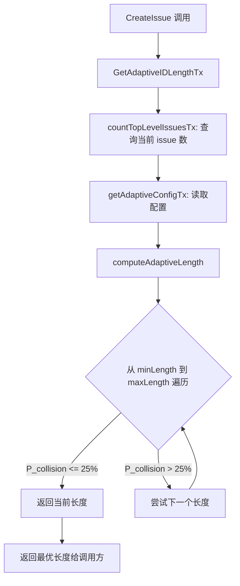
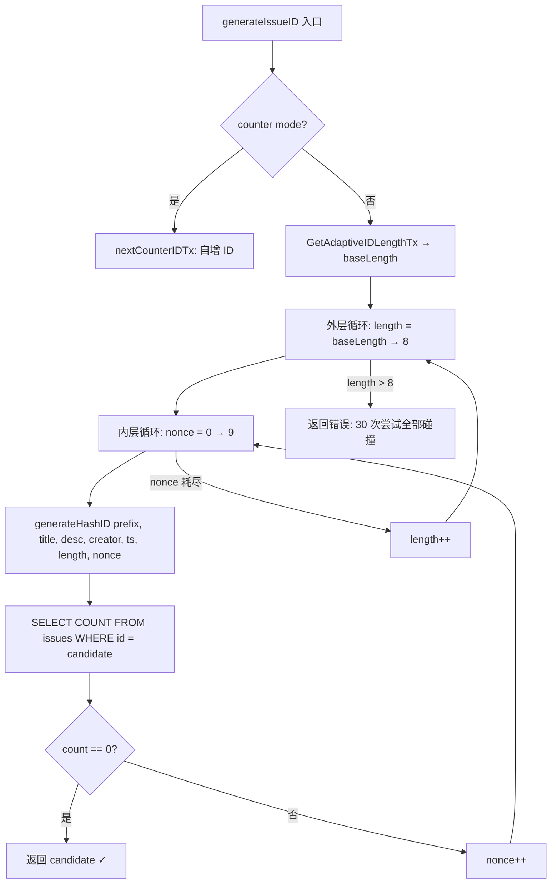

# PD-152.01 beads — SHA256+Base36 自适应长度哈希 ID 系统

> 文档编号：PD-152.01
> 来源：beads `internal/idgen/hash.go` `internal/storage/dolt/adaptive_length.go`
> GitHub：https://github.com/steveyegge/beads.git
> 问题域：PD-152 哈希 ID 防冲突 Hash-Based ID Collision Prevention
> 状态：可复用方案

---

## 第 1 章 问题与动机

### 1.1 核心问题

传统的自增 ID（`#1`, `#2`, `#3`）在以下场景中会崩溃：

- **多 Agent 并发创建**：两个 Agent 同时创建 issue，自增计数器产生竞争条件
- **Git 分支分叉**：不同分支独立编号，合并时 ID 冲突不可调和
- **Fork 后合并**：Fork 仓库的 issue 编号与上游完全独立，PR 合并时数据库冲突
- **离线创建**：无网络环境下创建的 issue 无法获取全局递增序号

beads 是一个 Git-native 的 issue tracker，数据存储在 Dolt（Git-for-data）数据库中。
它的核心场景是多 Agent、多分支并发操作同一个 issue 数据库，因此 ID 唯一性是生存级需求。

### 1.2 beads 的解法概述

beads 采用 **SHA256 哈希 → Base36 编码 → 自适应长度 → 碰撞检测重试** 的四层策略：

1. **内容哈希**：用 `title|description|creator|timestamp|nonce` 拼接后 SHA256 哈希，确保确定性（`internal/idgen/hash.go:58`）
2. **Base36 编码**：将哈希字节转为 `[0-9a-z]` 字符，比 hex 编码信息密度高 2.25 倍（`internal/idgen/hash.go:16-50`）
3. **自适应长度**：根据数据库当前 issue 数量，用生日悖论公式动态计算最优 ID 长度（3-8 字符）（`internal/storage/dolt/adaptive_length.go:50-61`）
4. **碰撞重试**：生成 ID 后查数据库，碰撞则递增 nonce 重试，最多 30 次（`internal/storage/dolt/issues.go:1295-1311`）
5. **层级 ID**：子 issue 用 `parent.N` 格式，无需独立哈希（`internal/types/id_generator.go:47-49`）

### 1.3 设计思想

| 设计原则 | 具体实现 | 理由 | 替代方案 |
|----------|----------|------|----------|
| 内容寻址 | SHA256(title+desc+creator+ts+nonce) | 相同内容产生相同 ID，支持幂等创建 | UUID v4（随机，不可复现） |
| 信息密度优先 | Base36 编码（36 字符集） | 4 字符 Base36 ≈ 6 字符 Hex 容量 | Hex 编码（16 字符集，ID 更长） |
| 渐进式扩展 | 自适应长度 3→8 字符 | 小库短 ID 可读，大库长 ID 防碰撞 | 固定长度（浪费或不安全） |
| 乐观并发 | 先生成再查重，碰撞时 nonce+1 | 97% 情况无碰撞，避免分布式锁 | 悲观锁（性能差，需中心协调） |
| 零协调 | 无需中心化 ID 分配服务 | Git 分支/Fork 场景天然去中心化 | Snowflake（需要 worker ID 分配） |
| 层级复用 | 子 ID = parent.N，无需独立哈希 | 父子关系内嵌 ID，查询高效 | 独立哈希 + 外键关联 |

---

## 第 2 章 源码实现分析

### 2.1 架构概览

beads 的 ID 生成系统分为三层，各层职责清晰：

```
┌─────────────────────────────────────────────────────────┐
│                  Storage Layer (Dolt)                     │
│  issues.go:generateIssueID()                             │
│  ┌─────────────────┐  ┌──────────────────────────────┐  │
│  │ Counter Mode     │  │ Hash Mode (default)          │  │
│  │ nextCounterIDTx  │  │ ┌────────────────────────┐  │  │
│  │ bd-1, bd-2, ...  │  │ │ Adaptive Length Calc   │  │  │
│  └─────────────────┘  │ │ adaptive_length.go     │  │  │
│                        │ │ Birthday Paradox Math  │  │  │
│                        │ └────────────────────────┘  │  │
│                        │ ┌────────────────────────┐  │  │
│                        │ │ Collision Retry Loop   │  │  │
│                        │ │ 3 lengths × 10 nonces  │  │  │
│                        │ │ = 30 attempts max      │  │  │
│                        │ └────────────────────────┘  │  │
│                        └──────────────────────────────┘  │
└──────────────────────────┬──────────────────────────────┘
                           │ calls
┌──────────────────────────▼──────────────────────────────┐
│                  ID Generation Layer                     │
│  idgen/hash.go:GenerateHashID()                         │
│  ┌──────────────┐  ┌─────────────┐  ┌───────────────┐  │
│  │ SHA256 Hash   │→│ Byte Slice  │→│ Base36 Encode │  │
│  │ content→32B   │  │ [:numBytes] │  │ big.Int→[a-z] │  │
│  └──────────────┘  └─────────────┘  └───────────────┘  │
└─────────────────────────────────────────────────────────┘
┌─────────────────────────────────────────────────────────┐
│                  Hierarchy Layer                          │
│  types/id_generator.go                                   │
│  ┌──────────────────┐  ┌────────────────────────────┐   │
│  │ GenerateChildID   │  │ ParseHierarchicalID        │   │
│  │ parent.N format   │  │ rootID, parentID, depth    │   │
│  └──────────────────┘  └────────────────────────────┘   │
│  MaxHierarchyDepth = 3                                   │
└─────────────────────────────────────────────────────────┘
```

### 2.2 核心实现

#### 2.2.1 SHA256 + Base36 哈希生成

```mermaid
graph TD
    A[输入: title, desc, creator, timestamp, nonce] --> B[拼接: title|desc|creator|ts_nano|nonce]
    B --> C[SHA256 哈希 → 32 字节]
    C --> D{根据目标长度选字节数}
    D -->|3 chars| E[取前 2 字节]
    D -->|4 chars| F[取前 3 字节]
    D -->|5-6 chars| G[取前 4 字节]
    D -->|7-8 chars| H[取前 5 字节]
    E --> I[big.Int 转 Base36]
    F --> I
    G --> I
    H --> I
    I --> J[补零/截断到精确长度]
    J --> K[输出: prefix-hash]
```

对应源码 `internal/idgen/hash.go:52-85`：

```go
func GenerateHashID(prefix, title, description, creator string, timestamp time.Time, length, nonce int) string {
    // 拼接所有输入为稳定的内容字符串，nonce 用于碰撞重试
    content := fmt.Sprintf("%s|%s|%s|%d|%d", title, description, creator, timestamp.UnixNano(), nonce)

    // SHA256 哈希
    hash := sha256.Sum256([]byte(content))

    // 根据目标长度决定使用多少字节
    var numBytes int
    switch length {
    case 3:  numBytes = 2  // 2 bytes = 16 bits ≈ 3.09 base36 chars
    case 4:  numBytes = 3  // 3 bytes = 24 bits ≈ 4.63 base36 chars
    case 5:  numBytes = 4  // 4 bytes = 32 bits ≈ 6.18 base36 chars
    case 6:  numBytes = 4
    case 7:  numBytes = 5  // 5 bytes = 40 bits ≈ 7.73 base36 chars
    case 8:  numBytes = 5
    default: numBytes = 3
    }

    shortHash := EncodeBase36(hash[:numBytes], length)
    return fmt.Sprintf("%s-%s", prefix, shortHash)
}
```

Base36 编码核心（`internal/idgen/hash.go:16-50`）使用 `math/big` 做大整数除法：

```go
func EncodeBase36(data []byte, length int) string {
    num := new(big.Int).SetBytes(data)
    base := big.NewInt(36)
    zero := big.NewInt(0)
    mod := new(big.Int)

    // 逆序构建 base36 字符串
    chars := make([]byte, 0, length)
    for num.Cmp(zero) > 0 {
        num.DivMod(num, base, mod)
        chars = append(chars, base36Alphabet[mod.Int64()])
    }

    // 反转 + 补零 + 截断到精确长度
    // ...
}
```

#### 2.2.2 自适应长度计算



对应源码 `internal/storage/dolt/adaptive_length.go:39-61`：

```go
// 生日悖论公式: P(collision) ≈ 1 - e^(-n²/2N)
func collisionProbability(numIssues int, idLength int) float64 {
    const base = 36.0
    totalPossibilities := math.Pow(base, float64(idLength))
    exponent := -float64(numIssues*numIssues) / (2.0 * totalPossibilities)
    return 1.0 - math.Exp(exponent)
}

func computeAdaptiveLength(numIssues int, config AdaptiveIDConfig) int {
    for length := config.MinLength; length <= config.MaxLength; length++ {
        prob := collisionProbability(numIssues, length)
        if prob <= config.MaxCollisionProbability {
            return length
        }
    }
    return config.MaxLength
}
```

默认配置（`adaptive_length.go:31-37`）：MinLength=3, MaxLength=8, MaxCollisionProbability=0.25。

#### 2.2.3 碰撞检测与重试



对应源码 `internal/storage/dolt/issues.go:1272-1314`：

```go
func generateIssueID(ctx context.Context, tx *sql.Tx, prefix string,
    issue *types.Issue, actor string) (string, error) {
    counterMode, _ := isCounterModeTx(ctx, tx)
    if counterMode {
        return nextCounterIDTx(ctx, tx, prefix)
    }

    baseLength, err := GetAdaptiveIDLengthTx(ctx, tx, prefix)
    if err != nil {
        baseLength = 6 // 安全回退
    }

    maxLength := 8
    for length := baseLength; length <= maxLength; length++ {
        for nonce := 0; nonce < 10; nonce++ {
            candidate := generateHashID(prefix, issue.Title,
                issue.Description, actor, issue.CreatedAt, length, nonce)

            var count int
            err = tx.QueryRowContext(ctx,
                `SELECT COUNT(*) FROM issues WHERE id = ?`, candidate).Scan(&count)
            if err != nil {
                return "", fmt.Errorf("failed to check for ID collision: %w", err)
            }
            if count == 0 {
                return candidate, nil
            }
        }
    }
    return "", fmt.Errorf("failed to generate unique ID after trying lengths %d-%d with 10 nonces each",
        baseLength, maxLength)
}
```

### 2.3 实现细节

**层级 ID 系统**（`internal/types/id_generator.go:42-49`）：

子 issue 不需要独立哈希，直接用 `parent.N` 格式：
- `bd-a3f8.1` — 第一个子 issue
- `bd-a3f8.1.2` — 孙级 issue
- 最大深度 3 层（`MaxHierarchyDepth = 3`）

**ID 前缀解析**（`internal/utils/issue_id.go:21-54`）：

beads 支持多段前缀（如 `beads-vscode-a3f8`），通过 `isLikelyHash()` 函数区分哈希后缀和英文单词后缀：
- 3 字符后缀：直接接受（word collision 概率 ~2%，可接受）
- 4+ 字符后缀：要求至少含一个数字，避免把 `test`、`gate` 等英文单词误判为哈希

**碰撞概率数学**（`docs/COLLISION_MATH.md`）：

| DB 规模 | 4-char | 5-char | 6-char | 7-char |
|---------|--------|--------|--------|--------|
| 500     | 7.17%  | 0.21%  | 0.01%  | 0.00%  |
| 1,000   | 25.75% | 0.82%  | 0.02%  | 0.00%  |
| 5,000   | 99.94% | 18.68% | 0.57%  | 0.02%  |
| 10,000  | 100%   | 56.26% | 2.27%  | 0.06%  |

默认 25% 阈值下的自适应策略：
- 0-500 issues → 4 字符 ID
- 501-1,500 → 5 字符
- 1,501-5,000 → 5 字符（18.68% < 25%）
- 5,001+ → 6 字符

---

## 第 3 章 迁移指南

### 3.1 迁移清单

**Phase 1：核心 ID 生成器**
- [ ] 实现 SHA256 + Base36 编码函数（移植 `idgen/hash.go`）
- [ ] 实现 `EncodeBase36` 大整数转换（或用目标语言的等价库）
- [ ] 编写确定性测试向量验证（参考 `hash_test.go` 的 Jira 向量）

**Phase 2：自适应长度**
- [ ] 实现生日悖论碰撞概率计算
- [ ] 实现 `computeAdaptiveLength` 遍历逻辑
- [ ] 添加配置项：`max_collision_prob`、`min_hash_length`、`max_hash_length`
- [ ] 实现数据库 issue 计数查询

**Phase 3：碰撞检测**
- [ ] 实现双层循环重试（length × nonce）
- [ ] 在事务内执行 `SELECT COUNT(*) WHERE id = ?` 检查
- [ ] 设置合理的最大重试次数（beads 用 30 次）

**Phase 4：层级 ID（可选）**
- [ ] 实现 `parent.N` 格式的子 ID 生成
- [ ] 实现层级解析（提取 rootID、parentID、depth）
- [ ] 设置最大深度限制

### 3.2 适配代码模板

**Python 版本的核心 ID 生成器：**

```python
import hashlib
import math
from typing import Optional

BASE36_ALPHABET = "0123456789abcdefghijklmnopqrstuvwxyz"

def encode_base36(data: bytes, length: int) -> str:
    """将字节数组转为指定长度的 base36 字符串"""
    num = int.from_bytes(data, byteorder='big')
    if num == 0:
        return '0' * length

    chars = []
    while num > 0:
        num, remainder = divmod(num, 36)
        chars.append(BASE36_ALPHABET[remainder])
    result = ''.join(reversed(chars))

    # 补零或截断
    if len(result) < length:
        result = '0' * (length - len(result)) + result
    elif len(result) > length:
        result = result[-length:]
    return result


# 字节数映射表：目标长度 → 需要的 SHA256 字节数
BYTES_MAP = {3: 2, 4: 3, 5: 4, 6: 4, 7: 5, 8: 5}

def generate_hash_id(
    prefix: str, title: str, description: str,
    creator: str, timestamp_ns: int, length: int = 4, nonce: int = 0
) -> str:
    """生成 beads 风格的哈希 ID"""
    content = f"{title}|{description}|{creator}|{timestamp_ns}|{nonce}"
    hash_bytes = hashlib.sha256(content.encode()).digest()
    num_bytes = BYTES_MAP.get(length, 3)
    short_hash = encode_base36(hash_bytes[:num_bytes], length)
    return f"{prefix}-{short_hash}"


def collision_probability(num_issues: int, id_length: int) -> float:
    """生日悖论碰撞概率"""
    total = 36 ** id_length
    return 1.0 - math.exp(-(num_issues ** 2) / (2.0 * total))


def compute_adaptive_length(
    num_issues: int,
    min_length: int = 3,
    max_length: int = 8,
    max_prob: float = 0.25
) -> int:
    """根据数据库规模计算最优 ID 长度"""
    for length in range(min_length, max_length + 1):
        if collision_probability(num_issues, length) <= max_prob:
            return length
    return max_length


def generate_unique_id(
    prefix: str, title: str, description: str, creator: str,
    timestamp_ns: int, existing_ids: set, num_issues: int
) -> str:
    """带碰撞检测的完整 ID 生成"""
    base_length = compute_adaptive_length(num_issues)
    for length in range(base_length, 9):  # max 8
        for nonce in range(10):
            candidate = generate_hash_id(
                prefix, title, description, creator,
                timestamp_ns, length, nonce
            )
            if candidate not in existing_ids:
                return candidate
    raise RuntimeError(f"Failed to generate unique ID after 30 attempts")
```

### 3.3 适用场景

| 场景 | 适用度 | 说明 |
|------|--------|------|
| 多 Agent 并发创建 issue | ⭐⭐⭐ | 核心设计目标，零协调 |
| Git 分支并行开发 | ⭐⭐⭐ | 内容哈希天然去中心化，合并无冲突 |
| 离线优先应用 | ⭐⭐⭐ | 无需网络即可生成唯一 ID |
| 小规模项目（<500 issues） | ⭐⭐⭐ | 4 字符短 ID，可读性极佳 |
| 大规模项目（>10K issues） | ⭐⭐ | 自适应扩展到 6-8 字符，仍可用 |
| 需要人类记忆 ID 的场景 | ⭐⭐ | Base36 比 UUID 短很多，但不如自增 ID 直观 |
| 需要严格有序的场景 | ⭐ | 哈希 ID 无序，需额外排序字段 |

---

## 第 4 章 测试用例

基于 beads 的真实测试向量（`internal/idgen/hash_test.go:8-30`）：

```python
import unittest
from datetime import datetime, timezone

class TestHashIDGeneration(unittest.TestCase):
    def test_jira_vector_deterministic(self):
        """验证与 beads Go 实现的互操作性"""
        timestamp = datetime(2024, 1, 2, 3, 4, 5, 6000, tzinfo=timezone.utc)
        timestamp_ns = int(timestamp.timestamp() * 1e9)
        prefix = "bd"
        title = "Fix login"
        description = "Details"
        creator = "jira-import"

        # beads 的确定性测试向量
        expected = {
            3: "bd-vju",
            4: "bd-8d8e",
            5: "bd-bi3tk",
            6: "bd-8bi3tk",
            7: "bd-r5sr6bm",
            8: "bd-8r5sr6bm",
        }

        for length, want in expected.items():
            got = generate_hash_id(prefix, title, description, creator,
                                   timestamp_ns, length, nonce=0)
            self.assertEqual(got, want,
                f"Length {length}: expected {want}, got {got}")

    def test_collision_probability_math(self):
        """验证生日悖论公式"""
        # 500 issues, 4-char ID → 7.17% 碰撞概率
        prob = collision_probability(500, 4)
        self.assertAlmostEqual(prob, 0.0717, places=3)

        # 1000 issues, 5-char ID → 0.82% 碰撞概率
        prob = collision_probability(1000, 5)
        self.assertAlmostEqual(prob, 0.0082, places=3)

    def test_adaptive_length_scaling(self):
        """验证自适应长度策略"""
        # 默认 25% 阈值
        self.assertEqual(compute_adaptive_length(500), 4)
        self.assertEqual(compute_adaptive_length(1000), 5)
        self.assertEqual(compute_adaptive_length(5000), 5)
        self.assertEqual(compute_adaptive_length(10000), 6)

    def test_collision_retry(self):
        """验证碰撞重试机制"""
        existing = set()
        # 生成 100 个 ID，不应有碰撞
        for i in range(100):
            id_ = generate_unique_id(
                "test", f"Issue {i}", "desc", "creator",
                int(datetime.now(timezone.utc).timestamp() * 1e9) + i,
                existing, num_issues=100
            )
            self.assertNotIn(id_, existing)
            existing.add(id_)

    def test_hierarchical_id(self):
        """验证层级 ID 格式"""
        parent = "bd-a3f8e9"
        child1 = f"{parent}.1"
        child2 = f"{parent}.2"
        grandchild = f"{child1}.1"

        self.assertEqual(child1, "bd-a3f8e9.1")
        self.assertEqual(grandchild, "bd-a3f8e9.1.1")

        # 解析层级
        root, parent_id, depth = parse_hierarchical_id(grandchild)
        self.assertEqual(root, "bd-a3f8e9")
        self.assertEqual(parent_id, "bd-a3f8e9.1")
        self.assertEqual(depth, 2)

    def test_nonce_changes_hash(self):
        """验证 nonce 改变哈希值"""
        ts = int(datetime.now(timezone.utc).timestamp() * 1e9)
        id0 = generate_hash_id("bd", "Title", "Desc", "creator", ts, 4, 0)
        id1 = generate_hash_id("bd", "Title", "Desc", "creator", ts, 4, 1)
        self.assertNotEqual(id0, id1)

    def test_base36_encoding(self):
        """验证 Base36 编码正确性"""
        # 0 应该编码为全零
        self.assertEqual(encode_base36(b'\x00\x00', 4), "0000")

        # 最大 2 字节值 (65535) 的 base36
        self.assertEqual(encode_base36(b'\xff\xff', 4), "1ekf")


def parse_hierarchical_id(id_: str):
    """解析层级 ID（辅助函数）"""
    parts = id_.split('.')
    depth = len(parts) - 1
    if depth == 0:
        return id_, "", 0
    root = parts[0]
    parent = '.'.join(parts[:-1])
    return root, parent, depth


if __name__ == '__main__':
    unittest.main()
```

---

## 第 5 章 跨域关联

| 关联域 | 关系类型 | 说明 |
|--------|----------|------|
| PD-02 多 Agent 编排 | 依赖 | 多 Agent 并发创建 issue 时，哈希 ID 避免了分布式锁 |
| PD-03 容错与重试 | 协同 | 碰撞重试机制是容错策略的一部分，30 次失败后才报错 |
| PD-05 沙箱隔离 | 协同 | Git worktree 场景下，不同 worktree 可独立生成 ID 无冲突 |
| PD-06 记忆持久化 | 依赖 | ID 作为主键，必须在持久化前确保唯一性 |
| PD-08 搜索与检索 | 协同 | 短 ID 支持前缀匹配（`bd show a3f` 匹配 `bd-a3f8e9`） |
| PD-151 Git Worktree 集成 | 强依赖 | beads 的核心场景，哈希 ID 是 worktree 并发安全的基础 |
| PD-153 层级 Epic 系统 | 强依赖 | 层级 ID（`parent.N`）是 Epic 子任务的实现基础 |

---

## 第 6 章 来源文件索引

| 文件 | 行范围 | 关键实现 |
|------|--------|----------|
| `internal/idgen/hash.go` | L52-L85 | `GenerateHashID` 主函数：SHA256 + Base36 编码 |
| `internal/idgen/hash.go` | L16-L50 | `EncodeBase36` 大整数转换 |
| `internal/storage/dolt/adaptive_length.go` | L39-L61 | 生日悖论碰撞概率计算 + 自适应长度 |
| `internal/storage/dolt/issues.go` | L1272-L1314 | `generateIssueID` 碰撞检测与重试循环 |
| `internal/types/id_generator.go` | L28-L40 | `GenerateHashID` 类型层封装（SHA256 版本） |
| `internal/types/id_generator.go` | L42-L49 | `GenerateChildID` 层级 ID 生成 |
| `internal/types/id_generator.go` | L51-L89 | `ParseHierarchicalID` 层级解析 |
| `internal/utils/issue_id.go` | L21-L98 | `ExtractIssuePrefix` 前缀解析 + `isLikelyHash` 启发式 |
| `docs/COLLISION_MATH.md` | L1-L147 | 碰撞概率数学推导与阈值表 |
| `docs/ADAPTIVE_IDS.md` | L1-L222 | 自适应 ID 配置与使用指南 |
| `internal/idgen/hash_test.go` | L8-L30 | Jira 向量确定性测试 |
| `internal/types/id_generator_test.go` | L8-L255 | 完整测试套件（确定性、碰撞、层级） |

---

## 第 7 章 横向对比维度

```json comparison_data
{
  "project": "beads",
  "dimensions": {
    "哈希算法": "SHA256（安全性高，32 字节输出）",
    "编码方式": "Base36（0-9a-z，信息密度 2.25x hex）",
    "ID 长度策略": "自适应 3-8 字符，生日悖论公式动态计算",
    "碰撞检测": "生成后查数据库，3 长度 × 10 nonce = 30 次重试",
    "层级 ID": "parent.N 格式，无需独立哈希，最大深度 3",
    "分布式协调": "零协调，内容哈希天然去中心化",
    "可读性优化": "小库 4 字符短 ID，大库渐进扩展到 6-8 字符"
  }
}
```

### 域元数据补充

```json domain_metadata
{
  "solution_summary": "beads 用 SHA256+Base36 编码生成 3-8 字符自适应长度哈希 ID，通过生日悖论公式动态计算最优长度，碰撞时 nonce 重试最多 30 次，支持 parent.N 层级 ID",
  "description": "通过内容哈希 + 自适应长度 + 碰撞重试三层机制，在可读性和唯一性间动态平衡",
  "sub_problems": [
    "Base36 vs Hex 编码权衡",
    "自适应长度阈值选择（25% 碰撞概率）",
    "层级 ID 与独立哈希的性能对比",
    "多段前缀解析（beads-vscode-a3f8）"
  ],
  "best_practices": [
    "SHA256 比 FNV-1a 更安全，适合公开系统",
    "Base36 编码提升信息密度，4 字符 ≈ 6 字符 hex",
    "生日悖论公式精确计算碰撞概率，避免过度保守",
    "层级 ID 复用父哈希，查询性能优于外键关联",
    "nonce 重试比预留 ID 池更节省空间"
  ]
}
```
