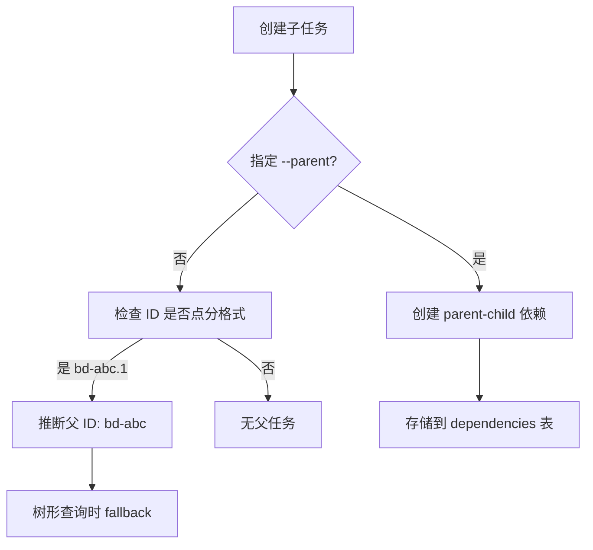
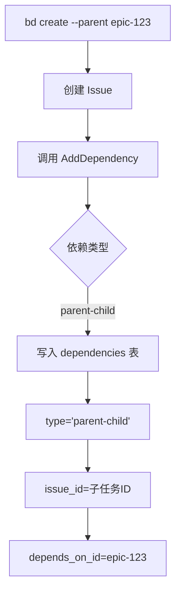
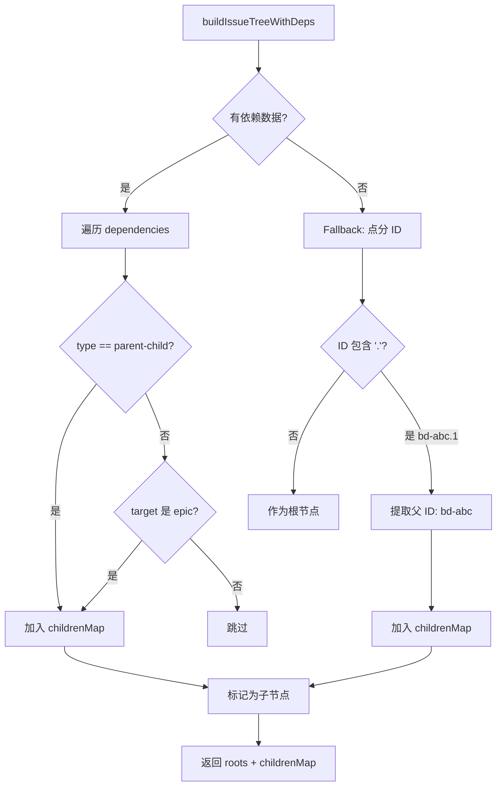
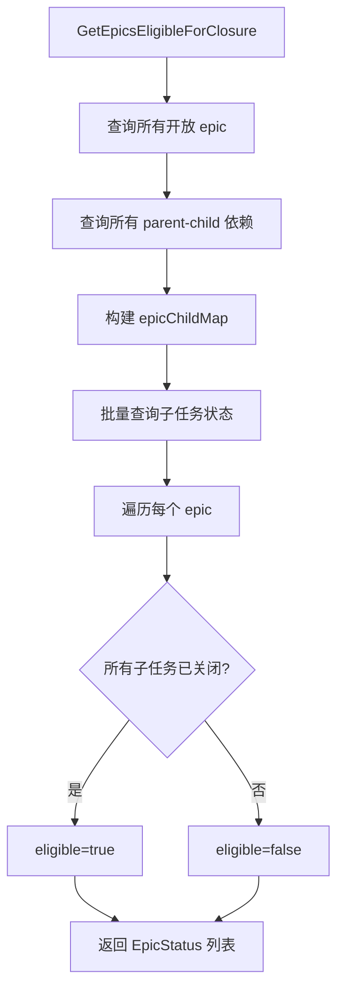
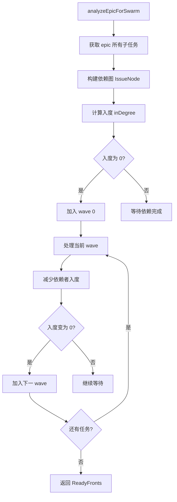

# PD-153.01 beads — 层级 Epic 系统与 Swarm 并行协调

> 文档编号：PD-153.01
> 来源：beads `internal/types/types.go`, `cmd/bd/epic.go`, `cmd/bd/swarm.go`, `cmd/bd/list_tree.go`
> GitHub：https://github.com/steveyegge/beads.git
> 问题域：PD-153 层级 Epic 系统 Hierarchical Epic System
> 状态：可复用方案

---

## 第 1 章 问题与动机

### 1.1 核心问题

Agent 工程中的复杂任务需要分解为层级化的子任务树，支持：
1. **任务分解**：将大型 epic 拆分为可并行执行的子任务
2. **层级查询**：快速查找某个 epic 的所有子任务（递归或单层）
3. **状态聚合**：自动计算 epic 的完成进度（已完成子任务数/总子任务数）
4. **并行协调**：识别可并行执行的任务波次（wave），支持 swarm 多 agent 协作
5. **层级 ID 设计**：支持点分 ID（如 `bd-a3f8.1.1`）表达层级关系，同时兼容显式依赖

### 1.2 beads 的解法概述

beads 通过 **parent-child 依赖类型 + 点分 ID 双轨制** 实现层级 epic 系统：

1. **显式层级**：`parent-child` 依赖类型（`internal/types/types.go:677`）作为一等公民，明确表达父子关系
2. **隐式层级**：点分 ID（如 `bd-abc.1.2`）作为 fallback，无需显式依赖即可推断层级
3. **Epic 状态聚合**：`GetEpicsEligibleForClosure` 查询（`internal/storage/dolt/queries.go:681`）批量计算所有 epic 的子任务完成度
4. **Swarm 波次计算**：Kahn 拓扑排序算法（`cmd/bd/swarm.go:442`）计算可并行执行的任务波次
5. **树形渲染**：优先级排序的树形展示（`cmd/bd/list_tree.go:13`），支持依赖关系和点分 ID 双重驱动

### 1.3 设计思想

| 设计原则 | 具体实现 | 理由 | 替代方案 |
|----------|----------|------|----------|
| 双轨层级表达 | parent-child 依赖 + 点分 ID fallback | 显式依赖更灵活（跨 epic 引用），点分 ID 更直观（人类可读） | 单一方案：纯依赖（需手动维护）或纯 ID（不支持跨 epic） |
| 依赖类型语义化 | `DepParentChild` 作为独立类型，与 `DepBlocks` 区分 | 父子关系不阻塞工作（epic 可关闭而子任务仍开放），blocks 才阻塞 | 复用 blocks 类型（语义混淆，无法区分层级和阻塞） |
| Epic 状态批量查询 | 单表扫描 + 内存聚合，避免 JOIN | Dolt 的 JOIN 性能问题（joinIter panic），单表查询更稳定 | 多表 JOIN（触发 Dolt bug，见 `queries.go:682` 注释） |
| Swarm 波次计算 | Kahn 拓扑排序 + 层级标记 | 自动识别可并行任务，支持 DAG 依赖，检测循环依赖 | 手动标记波次（易出错）或贪心算法（不保证最优并行度） |
| 树形渲染优先级 | 优先级 → ID 二级排序 | P0 任务优先展示，同优先级按 ID 排序保证稳定性 | 仅按创建时间（不体现优先级）或仅按 ID（不稳定） |

---

## 第 2 章 源码实现分析

### 2.1 架构概览

beads 的层级 epic 系统由 4 个核心组件构成：

```
┌─────────────────────────────────────────────────────────────┐
│                    Hierarchical Epic System                  │
├─────────────────────────────────────────────────────────────┤
│                                                               │
│  ┌──────────────┐      ┌──────────────┐      ┌───────────┐ │
│  │ Dependency   │─────→│ Tree Builder │─────→│ Renderer  │ │
│  │ Type System  │      │ (list_tree)  │      │ (pretty)  │ │
│  └──────────────┘      └──────────────┘      └───────────┘ │
│         │                      │                     │       │
│         │                      ↓                     │       │
│         │              ┌──────────────┐              │       │
│         └─────────────→│ Epic Status  │←─────────────┘       │
│                        │ Aggregator   │                      │
│                        └──────────────┘                      │
│                               │                              │
│                               ↓                              │
│                        ┌──────────────┐                      │
│                        │ Swarm Wave   │                      │
│                        │ Calculator   │                      │
│                        └──────────────┘                      │
│                                                               │
└─────────────────────────────────────────────────────────────┘
         │                      │                      │
         ↓                      ↓                      ↓
  ┌────────────┐        ┌────────────┐        ┌────────────┐
  │ issues     │        │dependencies│        │ CLI        │
  │ (Dolt)     │        │ (Dolt)     │        │ Commands   │
  └────────────┘        └────────────┘        └────────────┘
```

**关键数据流**：
1. `bd create --parent <epic-id>` → 创建 parent-child 依赖（`cmd/bd/create.go:573`）
2. `bd list --parent <epic-id>` → 查询子任务 → 树形渲染（`cmd/bd/list_tree.go:19`）
3. `bd epic status` → 批量查询 epic 状态 → 计算完成度（`internal/storage/dolt/queries.go:681`）
4. `bd swarm validate <epic-id>` → 构建依赖图 → Kahn 排序 → 输出波次（`cmd/bd/swarm.go:214`）

### 2.2 核心实现

#### 2.2.1 parent-child 依赖类型定义



对应源码 `internal/types/types.go:670-733`：
```go
// DependencyType categorizes the relationship
type DependencyType string

const (
	// Workflow types (affect ready work calculation)
	DepBlocks            DependencyType = "blocks"
	DepParentChild       DependencyType = "parent-child"  // L677: 层级关系
	DepConditionalBlocks DependencyType = "conditional-blocks"
	DepWaitsFor          DependencyType = "waits-for"
	// ... 其他类型
)

// AffectsReadyWork returns true if this dependency type blocks work.
// Only blocking types affect the ready work calculation.
func (d DependencyType) AffectsReadyWork() bool {
	return d == DepBlocks || d == DepParentChild || d == DepConditionalBlocks || d == DepWaitsFor
}
```

**关键设计**：
- `parent-child` 作为独立类型，与 `blocks` 区分（L677）
- `AffectsReadyWork()` 返回 true（L732），表示父任务未完成时子任务不进入 ready 队列
- 但 epic 本身可以关闭而子任务仍开放（epic 是容器，不是阻塞器）

#### 2.2.2 创建子任务时自动建立层级关系



对应源码 `cmd/bd/create.go:573-585`：
```go
// If parent was specified, add parent-child dependency
if parentID != "" {
	dep := &types.Dependency{
		IssueID:     issue.ID,
		DependsOnID: parentID,
		Type:        types.DepParentChild,  // L578: 显式指定类型
	}
	if err := store.AddDependency(ctx, dep, actor); err != nil {
		WarnError("failed to add parent-child dependency %s -> %s: %v", issue.ID, parentID, err)
	} else {
		postCreateWrites = true
	}
}
```

#### 2.2.3 树形查询：依赖优先 + 点分 ID fallback



对应源码 `cmd/bd/list_tree.go:19-97`：
```go
// buildIssueTreeWithDeps builds parent-child tree using dependency records
// If allDeps is nil, falls back to dotted ID hierarchy (e.g., "parent.1")
// Treats any dependency on an epic as a parent-child relationship
func buildIssueTreeWithDeps(issues []*types.Issue, allDeps map[string][]*types.Dependency) (roots []*types.Issue, childrenMap map[string][]*types.Issue) {
	issueMap := make(map[string]*types.Issue)
	childrenMap = make(map[string][]*types.Issue)
	isChild := make(map[string]bool)

	// Build issue map and identify epics
	epicIDs := make(map[string]bool)
	for _, issue := range issues {
		issueMap[issue.ID] = issue
		if issue.IssueType == "epic" {
			epicIDs[issue.ID] = true
		}
	}

	// If we have dependency records, use them to find parent-child relationships
	if allDeps != nil {
		addedChild := make(map[string]bool)
		for issueID, deps := range allDeps {
			for _, dep := range deps {
				parentID := dep.DependsOnID
				child, childOk := issueMap[issueID]
				_, parentOk := issueMap[parentID]
				if !childOk || !parentOk {
					continue
				}

				// Treat as parent-child if:
				// 1. Explicit parent-child dependency type, OR
				// 2. Any dependency where the target is an epic
				if dep.Type == types.DepParentChild || epicIDs[parentID] {  // L52: 双重判断
					key := parentID + ":" + issueID
					if !addedChild[key] {
						childrenMap[parentID] = append(childrenMap[parentID], child)
						addedChild[key] = true
					}
					isChild[issueID] = true
				}
			}
		}
	}

	// Fallback: check for hierarchical subtask IDs (e.g., "parent.1")
	for _, issue := range issues {
		if isChild[issue.ID] {
			continue // Already a child via dependency
		}
		if strings.Contains(issue.ID, ".") {  // L69: 点分 ID 检测
			parts := strings.Split(issue.ID, ".")
			parentID := strings.Join(parts[:len(parts)-1], ".")
			if _, exists := issueMap[parentID]; exists {
				childrenMap[parentID] = append(childrenMap[parentID], issue)
				isChild[issue.ID] = true
				continue
			}
		}
	}

	// Roots are issues that aren't children of any other issue
	for _, issue := range issues {
		if !isChild[issue.ID] {
			roots = append(roots, issue)
		}
	}

	// Sort roots and children by priority
	slices.SortFunc(roots, compareIssuesByPriority)
	for parentID := range childrenMap {
		slices.SortFunc(childrenMap[parentID], compareIssuesByPriority)
	}

	return roots, childrenMap
}
```

**关键逻辑**：
- L52：优先使用 `parent-child` 依赖，同时兼容"任何指向 epic 的依赖都视为父子关系"
- L69：Fallback 到点分 ID（如 `bd-abc.1` → 父 ID 为 `bd-abc`）
- L89：优先级排序（P0 > P1 > P2），同优先级按 ID 排序

#### 2.2.4 Epic 状态聚合：批量查询 + 内存计算



对应源码 `internal/storage/dolt/queries.go:681-760`：
```go
func (s *DoltStore) GetEpicsEligibleForClosure(ctx context.Context) ([]*types.EpicStatus, error) {
	// Step 1: Get open epic IDs (single-table scan)
	epicRows, err := s.queryContext(ctx, `
		SELECT id FROM issues
		WHERE issue_type = 'epic'
		  AND status != 'closed'
	`)
	// ... 收集 epicIDs

	// Step 2: Get parent-child dependencies (single-table scan)
	depRows, err := s.queryContext(ctx, `
		SELECT depends_on_id, issue_id FROM dependencies
		WHERE type = 'parent-child'  // L712: 只查询父子关系
	`)
	epicChildMap := make(map[string][]string)
	for depRows.Next() {
		var parentID, childID string
		depRows.Scan(&parentID, &childID)
		if epicSet[parentID] {
			epicChildMap[parentID] = append(epicChildMap[parentID], childID)
		}
	}

	// Step 3: Batch-fetch statuses for all child issues
	allChildIDs := make([]string, 0)
	for _, children := range epicChildMap {
		allChildIDs = append(allChildIDs, children...)
	}
	childStatusMap := make(map[string]string)
	if len(allChildIDs) > 0 {
		statusQuery := fmt.Sprintf("SELECT id, status FROM issues WHERE id IN (%s)", placeholders)
		// ... 批量查询子任务状态
	}

	// Step 4: Compute epic status
	var results []*types.EpicStatus
	for _, epicID := range epicIDs {
		epic, _ := s.GetIssue(ctx, epicID)
		children := epicChildMap[epicID]
		closedCount := 0
		for _, childID := range children {
			if childStatusMap[childID] == "closed" {
				closedCount++
			}
		}
		eligible := len(children) > 0 && closedCount == len(children)
		results = append(results, &types.EpicStatus{
			Epic:             epic,
			TotalChildren:    len(children),
			ClosedChildren:   closedCount,
			EligibleForClose: eligible,
		})
	}
	return results, nil
}
```

**性能优化**：
- 避免 JOIN（Dolt 的 joinIter 有 panic 风险，见 L682 注释）
- 3 次单表查询 + 内存聚合，复杂度 O(epics + deps + children)
- 批量查询子任务状态（L749），避免 N+1 查询


#### 2.2.5 Swarm 波次计算：Kahn 拓扑排序



对应源码 `cmd/bd/swarm.go:442-509`：
```go
// computeReadyFronts calculates the waves of parallel work.
func computeReadyFronts(analysis *SwarmAnalysis) {
	if len(analysis.Errors) > 0 {
		return // Can't compute if there are cycles
	}

	// Use Kahn's algorithm for topological sort with level tracking
	inDegree := make(map[string]int)
	for id, node := range analysis.Issues {
		inDegree[id] = len(node.DependsOn)  // L452: 计算入度
	}

	// Start with all nodes that have no dependencies (wave 0)
	var currentWave []string
	for id, degree := range inDegree {
		if degree == 0 {
			currentWave = append(currentWave, id)
			analysis.Issues[id].Wave = 0
		}
	}

	wave := 0
	for len(currentWave) > 0 {
		sort.Strings(currentWave)  // L467: 确定性输出

		// Build titles for this wave
		var titles []string
		for _, id := range currentWave {
			if node, ok := analysis.Issues[id]; ok {
				titles = append(titles, node.Title)
			}
		}

		front := ReadyFront{
			Wave:   wave,
			Issues: currentWave,
			Titles: titles,
		}
		analysis.ReadyFronts = append(analysis.ReadyFronts, front)

		// Track max parallelism
		if len(currentWave) > analysis.MaxParallelism {
			analysis.MaxParallelism = len(currentWave)
		}

		// Find next wave
		var nextWave []string
		for _, id := range currentWave {
			if node, ok := analysis.Issues[id]; ok {
				for _, dependentID := range node.DependedOnBy {
					inDegree[dependentID]--  // L494: 减少依赖者入度
					if inDegree[dependentID] == 0 {
						nextWave = append(nextWave, dependentID)
						analysis.Issues[dependentID].Wave = wave + 1
					}
				}
			}
		}

		currentWave = nextWave
		wave++
	}

	// Estimated sessions = total issues
	analysis.EstimatedSessions = analysis.TotalIssues
}
```

**算法特点**：
- Kahn 拓扑排序（L449），时间复杂度 O(V+E)
- 自动检测循环依赖（入度永远不为 0 的节点）
- 输出波次（wave）：wave 0 可立即执行，wave 1 依赖 wave 0 完成，以此类推
- 最大并行度 = 最大 wave 的任务数（L485）

### 2.3 实现细节

#### 2.3.1 Epic 子任务查询

`cmd/bd/swarm.go:109-133`：
```go
// getEpicChildren returns all child issues of an epic (via parent-child dependencies).
func getEpicChildren(ctx context.Context, s SwarmStorage, epicID string) ([]*types.Issue, error) {
	allDependents, err := s.GetDependents(ctx, epicID)
	if err != nil {
		return nil, fmt.Errorf("failed to get epic dependents: %w", err)
	}

	// Filter to only parent-child relationships
	var children []*types.Issue
	for _, dependent := range allDependents {
		deps, err := s.GetDependencyRecords(ctx, dependent.ID)
		if err != nil {
			continue
		}
		for _, dep := range deps {
			if dep.DependsOnID == epicID && dep.Type == types.DepParentChild {  // L125: 过滤父子关系
				children = append(children, dependent)
				break
			}
		}
	}

	return children, nil
}
```

**关键点**：
- 先查询所有依赖该 epic 的任务（`GetDependents`）
- 再过滤出 `parent-child` 类型的依赖（L125）
- 避免将 `blocks` 或 `relates-to` 等其他依赖类型误认为子任务

#### 2.3.2 树形渲染的优先级排序

`cmd/bd/list_tree.go:99-109`：
```go
// compareIssuesByPriority provides stable sorting for tree display
// Primary sort: priority (P0 before P1 before P2...)
// Secondary sort: ID for deterministic ordering when priorities match
func compareIssuesByPriority(a, b *types.Issue) int {
	// Primary: priority (ascending: P0 before P1 before P2...)
	if result := cmp.Compare(a.Priority, b.Priority); result != 0 {
		return result
	}
	// Secondary: ID for deterministic order when priorities match
	return cmp.Compare(a.ID, b.ID)
}
```

**排序策略**：
- 优先级升序（P0=0 < P1=1 < P2=2）
- 同优先级按 ID 字典序排序（确保稳定性）
- 应用于根节点和每个父节点的子节点列表

#### 2.3.3 Epic 自动关闭

`cmd/bd/epic.go:74-136`：
```go
var closeEligibleEpicsCmd = &cobra.Command{
	Use:   "close-eligible",
	Short: "Close epics where all children are complete",
	Run: func(cmd *cobra.Command, args []string) {
		dryRun, _ := cmd.Flags().GetBool("dry-run")
		if !dryRun {
			CheckReadonly("epic close-eligible")
		}

		epics, err := store.GetEpicsEligibleForClosure(ctx)
		// ... 过滤 eligible=true 的 epic

		// Actually close the epics
		closedIDs := []string{}
		for _, epicStatus := range eligibleEpics {
			err := store.CloseIssue(ctx, epicStatus.Epic.ID, "All children completed", "system", "")  // L117: 自动关闭
			if err != nil {
				fmt.Fprintf(os.Stderr, "Error closing %s: %v\n", epicStatus.Epic.ID, err)
				continue
			}
			closedIDs = append(closedIDs, epicStatus.Epic.ID)
		}
		// ... 输出结果
	},
}
```

**自动化流程**：
1. 查询所有开放 epic 的子任务完成度
2. 过滤出所有子任务已关闭的 epic
3. 批量关闭这些 epic，关闭原因为 "All children completed"
4. 支持 `--dry-run` 预览模式

---

## 第 3 章 迁移指南

### 3.1 迁移清单

#### 阶段 1：数据模型准备
- [ ] 在依赖表中添加 `parent-child` 类型支持
- [ ] 设计 ID 生成策略：是否支持点分 ID（如 `task-123.1.2`）
- [ ] 定义 Epic 类型（issue_type='epic' 或独立表）

#### 阶段 2：核心查询实现
- [ ] 实现 `GetEpicChildren(epicID)` 查询（过滤 parent-child 依赖）
- [ ] 实现 `GetEpicsEligibleForClosure()` 批量状态聚合
- [ ] 实现树形查询（依赖优先 + 点分 ID fallback）

#### 阶段 3：Swarm 协调（可选）
- [ ] 实现 Kahn 拓扑排序算法
- [ ] 实现循环依赖检测
- [ ] 实现波次（wave）计算和输出

#### 阶段 4：CLI/API 集成
- [ ] 添加 `--parent` 参数到创建任务命令
- [ ] 添加 `epic status` 命令展示完成度
- [ ] 添加 `swarm validate` 命令分析并行度
- [ ] 添加树形渲染模式（`--tree` 或 `--pretty`）

### 3.2 适配代码模板

#### 模板 1：创建子任务时建立层级关系（Python）

```python
from dataclasses import dataclass
from typing import Optional

@dataclass
class Dependency:
    issue_id: str
    depends_on_id: str
    type: str  # "parent-child", "blocks", etc.

class IssueStore:
    def create_issue_with_parent(
        self,
        title: str,
        parent_id: Optional[str] = None,
        **kwargs
    ) -> str:
        """创建任务并自动建立父子关系"""
        # 1. 创建任务
        issue_id = self.create_issue(title=title, **kwargs)
        
        # 2. 如果指定了父任务，创建 parent-child 依赖
        if parent_id:
            dep = Dependency(
                issue_id=issue_id,
                depends_on_id=parent_id,
                type="parent-child"
            )
            self.add_dependency(dep)
        
        # 3. Fallback：如果 ID 是点分格式（如 task-123.1），自动推断父 ID
        elif "." in issue_id:
            parts = issue_id.rsplit(".", 1)
            inferred_parent = parts[0]
            if self.issue_exists(inferred_parent):
                dep = Dependency(
                    issue_id=issue_id,
                    depends_on_id=inferred_parent,
                    type="parent-child"
                )
                self.add_dependency(dep)
        
        return issue_id
```

#### 模板 2：Epic 状态聚合查询（SQL + Python）

```python
from typing import List, Dict
from dataclasses import dataclass

@dataclass
class EpicStatus:
    epic_id: str
    epic_title: str
    total_children: int
    closed_children: int
    eligible_for_close: bool

class EpicAggregator:
    def get_epics_eligible_for_closure(self) -> List[EpicStatus]:
        """批量计算所有 epic 的完成度"""
        # Step 1: 查询所有开放 epic
        epic_rows = self.db.execute("""
            SELECT id, title FROM issues
            WHERE issue_type = 'epic' AND status != 'closed'
        """)
        epics = {row['id']: row['title'] for row in epic_rows}
        
        # Step 2: 查询所有 parent-child 依赖
        dep_rows = self.db.execute("""
            SELECT depends_on_id, issue_id FROM dependencies
            WHERE type = 'parent-child'
        """)
        epic_children: Dict[str, List[str]] = {}
        for row in dep_rows:
            parent_id = row['depends_on_id']
            if parent_id in epics:
                epic_children.setdefault(parent_id, []).append(row['issue_id'])
        
        # Step 3: 批量查询子任务状态
        all_child_ids = [cid for children in epic_children.values() for cid in children]
        if all_child_ids:
            placeholders = ','.join(['?'] * len(all_child_ids))
            status_rows = self.db.execute(
                f"SELECT id, status FROM issues WHERE id IN ({placeholders})",
                all_child_ids
            )
            child_status = {row['id']: row['status'] for row in status_rows}
        else:
            child_status = {}
        
        # Step 4: 计算每个 epic 的完成度
        results = []
        for epic_id, epic_title in epics.items():
            children = epic_children.get(epic_id, [])
            closed_count = sum(1 for cid in children if child_status.get(cid) == 'closed')
            eligible = len(children) > 0 and closed_count == len(children)
            
            results.append(EpicStatus(
                epic_id=epic_id,
                epic_title=epic_title,
                total_children=len(children),
                closed_children=closed_count,
                eligible_for_close=eligible
            ))
        
        return results
```

#### 模板 3：Swarm 波次计算（Python）

```python
from typing import Dict, List, Set
from collections import defaultdict, deque

@dataclass
class IssueNode:
    id: str
    title: str
    depends_on: List[str]
    depended_on_by: List[str]
    wave: int = -1

@dataclass
class ReadyFront:
    wave: int
    issues: List[str]

class SwarmAnalyzer:
    def compute_ready_fronts(self, issues: Dict[str, IssueNode]) -> List[ReadyFront]:
        """Kahn 拓扑排序计算可并行执行的波次"""
        # 计算入度
        in_degree = {id: len(node.depends_on) for id, node in issues.items()}
        
        # Wave 0: 入度为 0 的任务（无依赖）
        current_wave = [id for id, degree in in_degree.items() if degree == 0]
        for id in current_wave:
            issues[id].wave = 0
        
        ready_fronts = []
        wave = 0
        
        while current_wave:
            current_wave.sort()  # 确定性输出
            ready_fronts.append(ReadyFront(wave=wave, issues=current_wave[:]))
            
            # 计算下一波次
            next_wave = []
            for id in current_wave:
                for dependent_id in issues[id].depended_on_by:
                    in_degree[dependent_id] -= 1
                    if in_degree[dependent_id] == 0:
                        next_wave.append(dependent_id)
                        issues[dependent_id].wave = wave + 1
            
            current_wave = next_wave
            wave += 1
        
        # 检测循环依赖
        unprocessed = [id for id, degree in in_degree.items() if degree > 0]
        if unprocessed:
            raise ValueError(f"Cycle detected involving: {unprocessed}")
        
        return ready_fronts
```

### 3.3 适用场景

| 场景 | 适用度 | 说明 |
|------|--------|------|
| Agent 任务分解 | ⭐⭐⭐ | Epic 作为大任务，子任务作为 agent 可执行单元 |
| 多 Agent 并行协作 | ⭐⭐⭐ | Swarm 波次计算自动识别可并行任务 |
| 项目管理看板 | ⭐⭐⭐ | Epic 状态聚合展示项目进度 |
| CI/CD 流水线 | ⭐⭐ | 波次计算可用于构建 DAG 流水线 |
| 单 Agent 串行执行 | ⭐ | 层级关系有用，但 swarm 波次计算过度设计 |

---

## 第 4 章 测试用例

```python
import pytest
from typing import List

class TestHierarchicalEpicSystem:
    def test_create_child_with_parent_dependency(self, store):
        """测试创建子任务时自动建立 parent-child 依赖"""
        # 创建 epic
        epic_id = store.create_issue(title="Epic: User Auth", issue_type="epic")
        
        # 创建子任务并指定父任务
        child_id = store.create_issue_with_parent(
            title="Implement login API",
            parent_id=epic_id
        )
        
        # 验证依赖关系
        deps = store.get_dependency_records(child_id)
        assert len(deps) == 1
        assert deps[0].depends_on_id == epic_id
        assert deps[0].type == "parent-child"
    
    def test_dotted_id_fallback(self, store):
        """测试点分 ID 自动推断父任务"""
        # 创建父任务
        parent_id = "task-abc"
        store.create_issue(id=parent_id, title="Parent Task")
        
        # 创建子任务（点分 ID）
        child_id = "task-abc.1"
        store.create_issue(id=child_id, title="Child Task 1")
        
        # 构建树形结构
        issues = [store.get_issue(parent_id), store.get_issue(child_id)]
        roots, children_map = build_issue_tree(issues)
        
        # 验证树形结构
        assert len(roots) == 1
        assert roots[0].id == parent_id
        assert len(children_map[parent_id]) == 1
        assert children_map[parent_id][0].id == child_id
    
    def test_epic_status_aggregation(self, store):
        """测试 epic 状态聚合"""
        # 创建 epic 和 3 个子任务
        epic_id = store.create_issue(title="Epic", issue_type="epic")
        child1 = store.create_issue_with_parent("Task 1", parent_id=epic_id)
        child2 = store.create_issue_with_parent("Task 2", parent_id=epic_id)
        child3 = store.create_issue_with_parent("Task 3", parent_id=epic_id)
        
        # 关闭 2 个子任务
        store.close_issue(child1)
        store.close_issue(child2)
        
        # 查询 epic 状态
        statuses = store.get_epics_eligible_for_closure()
        epic_status = next(s for s in statuses if s.epic_id == epic_id)
        
        assert epic_status.total_children == 3
        assert epic_status.closed_children == 2
        assert epic_status.eligible_for_close == False  # 还有 1 个未完成
        
        # 关闭最后一个子任务
        store.close_issue(child3)
        statuses = store.get_epics_eligible_for_closure()
        epic_status = next(s for s in statuses if s.epic_id == epic_id)
        assert epic_status.eligible_for_close == True
    
    def test_swarm_wave_calculation(self, analyzer):
        """测试 swarm 波次计算"""
        # 构建依赖图：
        #   A (wave 0)
        #   ├─ B (wave 1, depends on A)
        #   └─ C (wave 1, depends on A)
        #      └─ D (wave 2, depends on C)
        issues = {
            "A": IssueNode(id="A", title="Task A", depends_on=[], depended_on_by=["B", "C"]),
            "B": IssueNode(id="B", title="Task B", depends_on=["A"], depended_on_by=[]),
            "C": IssueNode(id="C", title="Task C", depends_on=["A"], depended_on_by=["D"]),
            "D": IssueNode(id="D", title="Task D", depends_on=["C"], depended_on_by=[]),
        }
        
        fronts = analyzer.compute_ready_fronts(issues)
        
        assert len(fronts) == 3
        assert fronts[0].wave == 0 and fronts[0].issues == ["A"]
        assert fronts[1].wave == 1 and set(fronts[1].issues) == {"B", "C"}
        assert fronts[2].wave == 2 and fronts[2].issues == ["D"]
    
    def test_cycle_detection(self, analyzer):
        """测试循环依赖检测"""
        # 构建循环依赖：A -> B -> C -> A
        issues = {
            "A": IssueNode(id="A", title="Task A", depends_on=["C"], depended_on_by=["B"]),
            "B": IssueNode(id="B", title="Task B", depends_on=["A"], depended_on_by=["C"]),
            "C": IssueNode(id="C", title="Task C", depends_on=["B"], depended_on_by=["A"]),
        }
        
        with pytest.raises(ValueError, match="Cycle detected"):
            analyzer.compute_ready_fronts(issues)
    
    def test_priority_based_tree_sorting(self, store):
        """测试树形渲染的优先级排序"""
        epic_id = store.create_issue(title="Epic", issue_type="epic")
        
        # 创建不同优先级的子任务
        p2_task = store.create_issue_with_parent("P2 Task", parent_id=epic_id, priority=2)
        p0_task = store.create_issue_with_parent("P0 Task", parent_id=epic_id, priority=0)
        p1_task = store.create_issue_with_parent("P1 Task", parent_id=epic_id, priority=1)
        
        # 构建树形结构
        issues = [
            store.get_issue(epic_id),
            store.get_issue(p2_task),
            store.get_issue(p0_task),
            store.get_issue(p1_task),
        ]
        roots, children_map = build_issue_tree(issues)
        
        # 验证子任务按优先级排序（P0 > P1 > P2）
        children = children_map[epic_id]
        assert children[0].id == p0_task
        assert children[1].id == p1_task
        assert children[2].id == p2_task
```


---

## 第 5 章 跨域关联

| 关联域 | 关系类型 | 说明 |
|--------|----------|------|
| PD-02 多 Agent 编排 | 协同 | Swarm 波次计算为多 agent 并行编排提供任务分配依据，wave 0 可立即分配，wave 1 等待 wave 0 完成 |
| PD-08 搜索与检索 | 依赖 | Epic 子任务查询依赖高效的依赖关系检索（parent-child 类型过滤） |
| PD-04 工具系统 | 协同 | Epic 可作为 agent 工具的输入（如 `get_epic_children` 工具），返回可执行任务列表 |
| PD-11 可观测性 | 协同 | Epic 状态聚合可用于进度追踪和成本估算（已完成子任务数 × 平均成本） |
| PD-07 质量检查 | 协同 | Epic 自动关闭前可触发质量检查（所有子任务的测试覆盖率、代码审查状态） |

---

## 第 6 章 来源文件索引

| 文件 | 行范围 | 关键实现 |
|------|--------|----------|
| `internal/types/types.go` | L670-733 | DependencyType 定义，parent-child 类型，AffectsReadyWork 方法 |
| `cmd/bd/create.go` | L573-585 | 创建子任务时自动建立 parent-child 依赖 |
| `cmd/bd/list_tree.go` | L19-97 | 树形查询：依赖优先 + 点分 ID fallback，优先级排序 |
| `cmd/bd/list_tree.go` | L99-109 | compareIssuesByPriority 排序函数 |
| `cmd/bd/epic.go` | L16-73 | Epic 状态展示命令 |
| `cmd/bd/epic.go` | L74-136 | Epic 自动关闭命令 |
| `cmd/bd/swarm.go` | L109-133 | getEpicChildren 查询函数 |
| `cmd/bd/swarm.go` | L214-307 | analyzeEpicForSwarm 分析函数 |
| `cmd/bd/swarm.go` | L442-509 | computeReadyFronts Kahn 拓扑排序 |
| `internal/storage/dolt/queries.go` | L681-760 | GetEpicsEligibleForClosure 批量状态聚合 |
| `internal/storage/dolt/dependencies.go` | L440-499 | 依赖关系查询（blockedByMap, parentMap） |
| `cmd/bd/children.go` | L7-34 | children 命令（list --parent 的别名） |
| `cmd/bd/show_children.go` | L14-83 | showIssueChildren 展示子任务 |
| `cmd/bd/update.go` | L380-414 | 更新任务的父任务（移除旧依赖 + 添加新依赖） |
| `cmd/bd/ready.go` | L170-206 | Ready work 查询中的 parent 计算 |
| `cmd/bd/graph.go` | L640-699 | 图形渲染中的 parent-child 树形展示 |

---

## 第 7 章 横向对比维度

```json comparison_data
{
  "project": "beads",
  "dimensions": {
    "层级表达方式": "parent-child 依赖 + 点分 ID 双轨制",
    "状态聚合策略": "批量单表查询 + 内存计算，避免 JOIN",
    "并行度计算": "Kahn 拓扑排序输出波次（wave）",
    "树形渲染": "优先级 → ID 二级排序，支持依赖和点分 ID 双驱动",
    "自动化能力": "Epic 自动关闭（所有子任务完成时）"
  }
}
```

### 域元数据补充

```json domain_metadata
{
  "solution_summary": "beads 用 parent-child 依赖类型 + 点分 ID fallback 实现双轨层级表达，配合 Kahn 拓扑排序计算 swarm 波次，支持多 agent 并行协调",
  "description": "",
  "sub_problems": [
    "双轨层级表达（显式依赖 + 隐式 ID）",
    "批量状态聚合性能优化",
    "Swarm 波次自动计算"
  ],
  "best_practices": [
    "parent-child 与 blocks 类型分离（语义清晰）",
    "避免 JOIN 的单表查询 + 内存聚合",
    "优先级驱动的树形排序（P0 优先展示）",
    "Kahn 算法自动检测循环依赖"
  ]
}
```

---

## 附录 A：设计决策记录

### A.1 为什么 parent-child 不阻塞工作？

**问题**：Epic 作为父任务，是否应该阻塞子任务的执行？

**决策**：parent-child 依赖 **影响 ready work 计算**（`AffectsReadyWork() = true`），但 **epic 本身可以关闭而子任务仍开放**。

**理由**：
1. Epic 是容器（container），不是前置条件（prerequisite）
2. Epic 关闭表示"整体工作已完成"，但子任务可能需要后续维护
3. 如果需要阻塞语义，应使用 `blocks` 依赖类型

**代码证据**：
- `types.go:732`：`AffectsReadyWork()` 返回 true，表示父任务未完成时子任务不进入 ready 队列
- `epic.go:117`：Epic 关闭时不检查子任务状态，只在 `close-eligible` 命令中才检查

### A.2 为什么需要点分 ID fallback？

**问题**：已有 parent-child 依赖，为什么还需要点分 ID？

**决策**：点分 ID 作为 **fallback 机制**，在没有显式依赖时自动推断层级。

**理由**：
1. **人类可读性**：`bd-abc.1.2` 比 `bd-xyz789` 更直观表达层级
2. **向后兼容**：早期版本可能只有点分 ID，没有依赖表
3. **快速原型**：创建子任务时无需手动添加依赖，ID 即层级

**代码证据**：
- `list_tree.go:64-78`：先查询依赖，再 fallback 到点分 ID
- `list_tree.go:69`：`strings.Contains(issue.ID, ".")` 检测点分格式

### A.3 为什么避免 JOIN 查询？

**问题**：Epic 状态聚合为什么不用 JOIN？

**决策**：使用 **3 次单表查询 + 内存聚合**，避免多表 JOIN。

**理由**：
1. **Dolt 稳定性**：Dolt 的 joinIter 有 panic 风险（见 `queries.go:682` 注释）
2. **性能可控**：单表查询性能可预测，内存聚合复杂度 O(n)
3. **批量优化**：批量查询子任务状态（`WHERE id IN (...)`），避免 N+1 查询

**代码证据**：
- `queries.go:682`：注释明确说明避免 Dolt 的 joinIter panic
- `queries.go:749`：批量查询子任务状态，使用 IN 子句

---

## 附录 B：性能分析

### B.1 Epic 状态聚合性能

**查询复杂度**：
- Step 1：扫描 issues 表（WHERE issue_type='epic'），O(total_issues)
- Step 2：扫描 dependencies 表（WHERE type='parent-child'），O(total_deps)
- Step 3：批量查询子任务状态（WHERE id IN (...)），O(total_children)
- Step 4：内存聚合，O(epics + children)

**总复杂度**：O(total_issues + total_deps + total_children)

**优化点**：
- 使用索引：`issues(issue_type, status)`, `dependencies(type, depends_on_id)`
- 批量查询：避免 N+1 查询（每个 epic 单独查询子任务）

### B.2 Swarm 波次计算性能

**算法复杂度**：
- Kahn 拓扑排序：O(V + E)，V = 任务数，E = 依赖数
- 循环依赖检测：O(V + E)（DFS）

**空间复杂度**：
- inDegree map：O(V)
- 依赖图：O(V + E)

**适用规模**：
- V < 1000，E < 5000：毫秒级
- V < 10000，E < 50000：秒级
- V > 10000：考虑分批处理或增量计算

---

## 附录 C：常见问题

### C.1 Epic 可以嵌套吗？

**可以**。Epic 本身也是 issue，可以作为另一个 epic 的子任务：

```bash
bd create --type epic --title "Phase 1" --parent epic-root
bd create --type task --title "Task 1.1" --parent epic-phase1
```

生成层级：
```
epic-root (Epic)
└── epic-phase1 (Epic)
    └── task-1.1 (Task)
```

### C.2 点分 ID 和 parent-child 依赖冲突怎么办？

**优先级**：parent-child 依赖 > 点分 ID

如果同时存在：
- ID 为 `bd-abc.1`（隐式父任务 `bd-abc`）
- 显式依赖指向 `bd-xyz`（parent-child）

则树形查询使用显式依赖（`bd-xyz`），忽略点分 ID。

**代码证据**：`list_tree.go:65-67`：
```go
if isChild[issue.ID] {
    continue // Already a child via dependency
}
```

### C.3 Swarm 波次计算支持条件依赖吗？

**部分支持**。beads 有 `conditional-blocks` 依赖类型（仅当前置任务失败时才执行），但 swarm 波次计算 **只考虑 blocks 和 parent-child**（见 `swarm.go:273`）。

如需支持条件依赖，需修改 `analyzeEpicForSwarm` 函数，根据前置任务的 `close_reason` 动态调整依赖图。

### C.4 如何处理跨 Epic 的依赖？

**场景**：Task A 属于 Epic 1，但依赖 Epic 2 的 Task B。

**方案**：
1. 使用 `blocks` 依赖（不是 parent-child）：
   ```bash
   bd dep add task-a blocks task-b
   ```
2. Swarm 分析时会检测到外部依赖，输出警告：
   ```
   task-a depends on task-b (outside epic)
   ```
3. 需要手动协调两个 epic 的执行顺序

---

## 附录 D：与其他系统对比

| 特性 | beads | Jira | Linear | GitHub Projects |
|------|-------|------|--------|-----------------|
| 层级表达 | parent-child 依赖 + 点分 ID | Epic → Story → Subtask（固定 3 层） | Issue → Sub-issue（2 层） | 无原生层级 |
| 状态聚合 | 自动计算（SQL 查询） | 自动计算 | 自动计算 | 手动标记 |
| 并行度分析 | Kahn 拓扑排序 | 无 | 无 | 无 |
| 循环依赖检测 | 自动检测 | 无 | 无 | 无 |
| 点分 ID | 支持 | 不支持 | 不支持 | 不支持 |
| 跨 Epic 依赖 | 支持（blocks 类型） | 支持 | 支持 | 支持 |

**beads 的独特优势**：
1. **双轨层级表达**：显式依赖 + 隐式 ID，兼顾灵活性和可读性
2. **Swarm 波次计算**：自动识别可并行任务，支持多 agent 协作
3. **Git-native**：所有数据存储在 Dolt（Git for data），支持分支、合并、回滚

