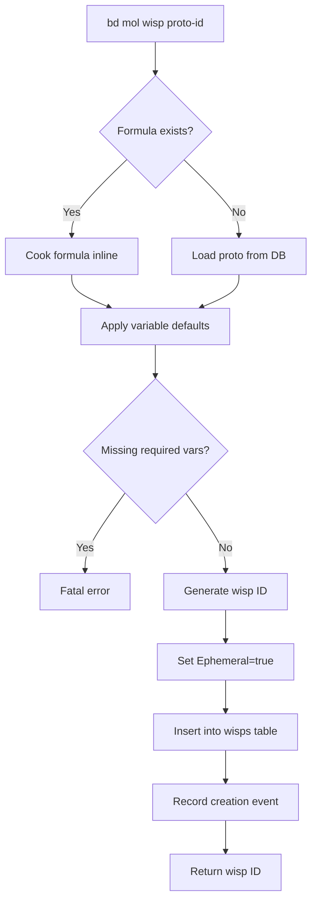
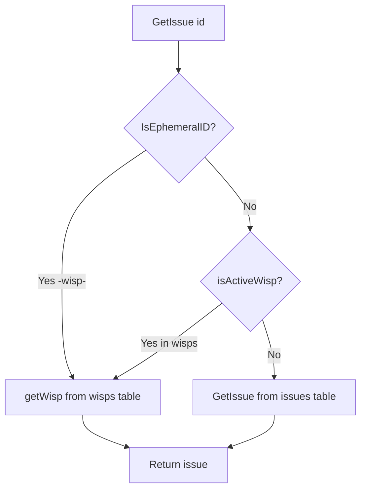
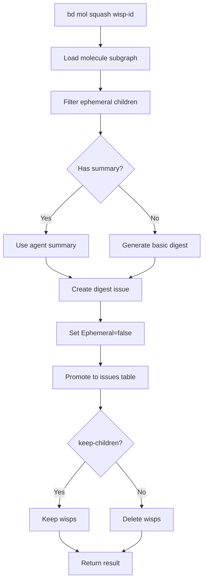
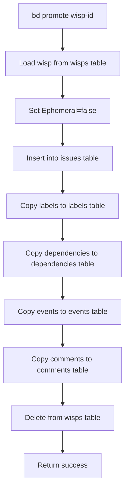

# PD-154.01 beads — Wisp 临时消息与生命周期管理

> 文档编号：PD-154.01  
> 来源：beads `cmd/bd/wisp.go`, `internal/storage/dolt/wisps.go`, `internal/storage/dolt/ephemeral_routing.go`  
> GitHub：https://github.com/steveyegge/beads  
> 问题域：PD-154 临时消息系统 Ephemeral Messaging System  
> 状态：可复用方案

---

## 第 1 章 问题与动机

### 1.1 核心问题

Agent 系统在运行时会产生大量临时性工作数据：

1. **运行时通信噪音**：patrol 巡检报告、health check 心跳、agent 间消息传递等临时数据会污染持久化 issue 列表
2. **Git 历史膨胀**：如果所有临时数据都进入 Dolt 版本控制，会导致 git 历史无限增长，影响 clone/pull 性能
3. **生命周期管理**：临时数据需要自动过期清理，但又要支持"升级为持久化"的能力（如重要的错误报告）
4. **跨 agent 通信**：需要支持 threading（线程化讨论）和 mail delegation（消息转发），但不能像持久化 issue 那样永久保存

### 1.2 beads 的解法概述

beads 通过 **wisp（ephemeral message）** 机制实现临时消息系统，核心设计：

1. **双表存储架构**（`internal/storage/dolt/wisps.go:16-26`）：
   - `wisps` 表（dolt_ignored）：存储临时消息，不进入 git 历史
   - `issues` 表（Dolt-versioned）：存储持久化工作项，进入 git 历史
   - 通过 `Ephemeral=true` 标记和 ID 模式（`-wisp-`）自动路由到正确的表

2. **ID 模式识别**（`internal/storage/dolt/ephemeral_routing.go:14-16`）：
   ```go
   func IsEphemeralID(id string) bool {
       return strings.Contains(id, "-wisp-")
   }
   ```
   - 自动生成的 wisp ID 包含 `-wisp-` 标记（如 `bd-wisp-abc123`）
   - 支持显式 ID 的 ephemeral beads（通过 `wispExists` 查询表确认）

3. **生命周期管理**（`cmd/bd/wisp.go:54-58`）：
   - **Create**: `bd mol wisp <proto>` 创建临时消息
   - **Execute**: 正常 bd 操作（close/update）
   - **Squash**: `bd mol squash <id>` 压缩为 digest 并升级为持久化
   - **Burn**: `bd mol burn <id>` 直接删除无痕迹
   - **GC**: `bd mol wisp gc` 自动清理超过 24 小时未更新的 wisp

4. **Mail delegation**（`cmd/bd/mail.go:12-38`）：
   - `bd mail` 命令委托给外部 mail provider（如 `gt mail`）
   - 通过环境变量 `BEADS_MAIL_DELEGATE` 或配置 `mail.delegate` 设置
   - Agent 可以统一使用 `bd mail` 接口，实际实现由 orchestrator 提供

### 1.3 设计思想

| 设计原则 | 具体实现 | 理由 | 替代方案 |
|----------|----------|------|----------|
| **存储隔离** | 双表架构（wisps + issues），wisps 表标记为 dolt_ignored | 临时数据不进入 git 历史，避免仓库膨胀 | 单表 + TTL 字段（无法阻止 git 同步） |
| **自动路由** | 基于 ID 模式（`-wisp-`）和 Ephemeral 标记自动路由 CRUD 操作 | 对上层透明，无需显式指定表名 | 显式 API（`CreateWisp` vs `CreateIssue`，增加调用复杂度） |
| **可升级性** | Promote/Squash 机制将 wisp 升级为持久化 issue | 重要的临时数据可以保留，灵活性高 | 纯 TTL 删除（无法保留重要数据） |
| **委托模式** | mail 命令委托给外部 provider，不内置实现 | beads 保持纯工具定位，orchestrator 负责通信 | 内置 mail 实现（增加依赖和复杂度） |
| **时间驱动 GC** | 基于 `updated_at` 的 24 小时阈值自动清理 | 简单可靠，适合临时数据 | 基于依赖图的压力检测（复杂，适合持久化数据） |

---

## 第 2 章 源码实现分析

### 2.1 架构概览

beads 的 wisp 系统采用 **双表路由架构**，核心组件关系：

```
┌─────────────────────────────────────────────────────────────┐
│                      bd CLI Commands                         │
│  bd mol wisp <proto>  │  bd mol squash  │  bd mol burn      │
└────────────┬──────────┴─────────┬────────┴──────────┬────────┘
             │                    │                   │
             v                    v                   v
┌────────────────────────────────────────────────────────────┐
│              DoltStore (ephemeral_routing.go)              │
│  ┌──────────────────────────────────────────────────────┐  │
│  │  IsEphemeralID(id) → bool                            │  │
│  │  isActiveWisp(id) → bool (查询 wisps 表)             │  │
│  │  partitionByWispStatus(ids) → (wispIDs, permIDs)    │  │
│  └──────────────────────────────────────────────────────┘  │
│                          │                                  │
│              ┌───────────┴───────────┐                      │
│              v                       v                      │
│  ┌─────────────────────┐  ┌─────────────────────┐          │
│  │  wisps.go           │  │  issues.go          │          │
│  │  (dolt_ignored)     │  │  (Dolt-versioned)   │          │
│  │  - createWisp       │  │  - CreateIssue      │          │
│  │  - getWisp          │  │  - GetIssue         │          │
│  │  - updateWisp       │  │  - UpdateIssue      │          │
│  │  - deleteWisp       │  │  - DeleteIssue      │          │
│  │  - searchWisps      │  │  - SearchIssues     │          │
│  └─────────────────────┘  └─────────────────────┘          │
└────────────────────────────────────────────────────────────┘
             │                                │
             v                                v
┌─────────────────────┐          ┌─────────────────────┐
│  wisps (table)      │          │  issues (table)     │
│  wisp_labels        │          │  labels             │
│  wisp_dependencies  │          │  dependencies       │
│  wisp_events        │          │  events             │
│  wisp_comments      │          │  comments           │
└─────────────────────┘          └─────────────────────┘
```

**关键设计点**：
1. **透明路由**：所有 CRUD 操作通过 `IsEphemeralID` 和 `isActiveWisp` 自动路由到正确的表
2. **表镜像**：wisps 表与 issues 表 schema 完全一致，只是存储位置不同
3. **辅助表分离**：labels/dependencies/events/comments 也有对应的 wisp_* 版本

### 2.2 核心实现

#### 2.2.1 Wisp 创建流程



对应源码 `cmd/bd/wisp.go:136-279`：

```go
func runWispCreate(cmd *cobra.Command, args []string) {
    // ... 省略变量解析 ...
    
    // Try to cook formula inline (ephemeral protos)
    sg, err := resolveAndCookFormulaWithVars(args[0], nil, vars)
    if err == nil {
        subgraph = sg
        protoID = sg.Root.ID
    }
    
    // ... 省略 proto 加载逻辑 ...
    
    // Spawn as ephemeral in main database (Ephemeral=true, not synced via git)
    // Use wisp prefix for distinct visual recognition
    result, err := spawnMolecule(ctx, store, subgraph, vars, "", actor, true, types.IDPrefixWisp)
    if err != nil {
        FatalError("creating wisp: %v", err)
    }
    
    fmt.Printf("%s Created wisp: %d issues\n", ui.RenderPass("✓"), result.Created)
    fmt.Printf("  Root issue: %s\n", result.NewEpicID)
    fmt.Printf("  Phase: vapor (ephemeral, not synced via git)\n")
}
```

**关键点**：
- `Ephemeral=true` 标记确保不进入 git 同步
- `types.IDPrefixWisp` 生成 `bd-wisp-xxx` 格式 ID
- Formula cooking 支持动态变量替换

#### 2.2.2 自动路由机制



对应源码 `internal/storage/dolt/ephemeral_routing.go:14-57`：

```go
// IsEphemeralID returns true if the ID belongs to an ephemeral issue.
func IsEphemeralID(id string) bool {
    return strings.Contains(id, "-wisp-")
}

// isActiveWisp checks if an issue ID exists in the wisps table.
// For IDs matching the -wisp- pattern, does a full row scan (fast path).
// For other IDs, uses a lightweight existence check to support
// ephemeral beads created with explicit IDs (GH#2053).
func (s *DoltStore) isActiveWisp(ctx context.Context, id string) bool {
    if IsEphemeralID(id) {
        wisp, _ := s.getWisp(ctx, id)
        return wisp != nil
    }
    // Fallback: check wisps table for ephemeral beads with explicit IDs
    return s.wispExists(ctx, id)
}

// wispExists checks if an ID exists in the wisps table using a lightweight query.
func (s *DoltStore) wispExists(ctx context.Context, id string) bool {
    s.mu.RLock()
    defer s.mu.RUnlock()
    var exists int
    err := s.db.QueryRowContext(ctx, "SELECT 1 FROM wisps WHERE id = ? LIMIT 1", id).Scan(&exists)
    return err == nil
}
```

**设计亮点**：
1. **快速路径**：`-wisp-` ID 直接路由，无需查表
2. **兼容性**：支持显式 ID 的 ephemeral beads（通过 `wispExists` 查询）
3. **性能优化**：`wispExists` 使用 `SELECT 1 ... LIMIT 1` 轻量查询

#### 2.2.3 Squash 升级机制



对应源码 `cmd/bd/mol_squash.go:212-229`：

```go
func squashMolecule(ctx context.Context, s *dolt.DoltStore, root *types.Issue, children []*types.Issue, keepChildren bool, summary string, actorName string) (*SquashResult, error) {
    // Collect child IDs
    childIDs := make([]string, len(children))
    for i, c := range children {
        childIDs[i] = c.ID
    }
    
    // Use agent-provided summary if available, otherwise generate basic digest
    var digestContent string
    if summary != "" {
        digestContent = summary
    } else {
        digestContent = generateDigest(root, children)
    }
    
    // Create digest issue (Ephemeral=false, goes to issues table)
    digest := &types.Issue{
        Title:       fmt.Sprintf("Digest: %s", root.Title),
        Description: digestContent,
        Status:      types.StatusClosed,
        Ephemeral:   false, // Persistent
        // ... 省略其他字段 ...
    }
    
    if err := s.CreateIssue(ctx, digest, actorName); err != nil {
        return nil, fmt.Errorf("failed to create digest: %w", err)
    }
    
    // Delete or keep children based on flag
    if !keepChildren {
        for _, id := range childIDs {
            _ = s.DeleteIssue(ctx, id) // Best-effort deletion
        }
    }
    
    return &SquashResult{
        MoleculeID:    root.ID,
        DigestID:      digest.ID,
        SquashedIDs:   childIDs,
        SquashedCount: len(childIDs),
        DeletedCount:  len(childIDs),
        KeptChildren:  keepChildren,
    }, nil
}
```

**设计亮点**：
1. **Agent 集成**：支持外部 agent 提供 AI 生成的 summary，beads 保持纯工具定位
2. **灵活性**：`--keep-children` 允许保留原始 wisp 数据
3. **自动降级**：无 summary 时自动生成基础 digest（标题 + 描述拼接）

#### 2.2.4 Promote 跨表迁移



对应源码 `internal/storage/dolt/ephemeral_routing.go:152-228`：

```go
// PromoteFromEphemeral copies an issue from the wisps table to the issues table,
// clearing the Ephemeral flag. Used by bd promote and mol squash to crystallize wisps.
func (s *DoltStore) PromoteFromEphemeral(ctx context.Context, id string, actor string) error {
    issue, err := s.getWisp(ctx, id)
    if err != nil {
        return fmt.Errorf("wisp %s not found", id)
    }
    
    // Clear ephemeral flag for persistent storage
    issue.Ephemeral = false
    
    // Create in issues table (bypasses ephemeral routing since Ephemeral=false)
    if err := s.CreateIssue(ctx, issue, actor); err != nil {
        return fmt.Errorf("failed to promote wisp to issues: %w", err)
    }
    
    // Copy labels directly to permanent labels table (bypass IsEphemeralID routing)
    labels, err := s.getWispLabels(ctx, id)
    if err != nil {
        return err
    }
    for _, label := range labels {
        if _, err := s.execContext(ctx,
            `INSERT IGNORE INTO labels (issue_id, label) VALUES (?, ?)`,
            id, label); err != nil {
            return fmt.Errorf("failed to copy label %q: %w", label, err)
        }
    }
    
    // Copy dependencies, events, comments (similar logic)
    // ... 省略 ...
    
    // Delete from wisps table (and all wisp_* auxiliary tables)
    return s.deleteWisp(ctx, id)
}
```

**设计亮点**：
1. **原子性**：整个 promote 过程在事务中完成
2. **ID 保留**：升级后 ID 不变，所有引用保持有效
3. **完整迁移**：labels/dependencies/events/comments 全部迁移

### 2.3 实现细节

#### 2.3.1 双表 Schema 一致性

wisps 表与 issues 表使用完全相同的 schema（`internal/storage/dolt/wisps.go:49-105`），通过 `insertIssueIntoTable` 统一插入逻辑：

```go
func insertIssueIntoTable(ctx context.Context, tx *sql.Tx, table string, issue *types.Issue) error {
    _, err := tx.ExecContext(ctx, fmt.Sprintf(`
        INSERT INTO %s (
            id, content_hash, title, description, design, acceptance_criteria, notes,
            status, priority, issue_type, assignee, estimated_minutes,
            created_at, created_by, owner, updated_at, closed_at, external_ref, spec_id,
            compaction_level, compacted_at, compacted_at_commit, original_size,
            sender, ephemeral, wisp_type, pinned, is_template, crystallizes,
            mol_type, work_type, quality_score, source_system, source_repo, close_reason,
            event_kind, actor, target, payload,
            await_type, await_id, timeout_ns, waiters,
            hook_bead, role_bead, agent_state, last_activity, role_type, rig,
            due_at, defer_until, metadata
        ) VALUES (?, ?, ?, ?, ?, ?, ?, ...)
        ON DUPLICATE KEY UPDATE ...
    `, table), ...)
    return err
}
```

**好处**：
- 代码复用：插入/更新逻辑完全一致
- 类型安全：schema 变更自动同步到两表
- 迁移简单：promote 只需改 `Ephemeral` 标记

#### 2.3.2 GC 策略

wisp GC 基于时间阈值（`cmd/bd/wisp.go:490-632`）：

```go
const OldThreshold = 24 * time.Hour

func runWispGC(cmd *cobra.Command, args []string) {
    // Query wisps from main database using Ephemeral filter
    ephemeralFlag := true
    filter := types.IssueFilter{
        Ephemeral: &ephemeralFlag,
        Limit:     5000,
    }
    issues, err := store.SearchIssues(ctx, "", filter)
    
    // Find old/abandoned wisps
    now := time.Now()
    var abandoned []*types.Issue
    for _, issue := range issues {
        // Never GC infrastructure beads (agent, rig, role, message)
        if dolt.IsInfraType(issue.IssueType) {
            continue
        }
        
        // Skip closed issues unless --all is specified
        if issue.Status == types.StatusClosed && !cleanAll {
            continue
        }
        
        // Check if old (not updated within age threshold)
        if now.Sub(issue.UpdatedAt) > ageThreshold {
            abandoned = append(abandoned, issue)
        }
    }
    
    // Use batch deletion for efficiency
    deleteBatch(nil, ids, true, false, true, jsonOutput, false, "wisp gc")
}
```

**设计亮点**：
1. **保护机制**：infra 类型（agent/rig/role/message）永不 GC
2. **灵活阈值**：`--age` 参数可自定义（默认 1 小时）
3. **批量删除**：使用 `deleteBatch` 提升性能

#### 2.3.3 Mail Delegation

mail 命令通过环境变量委托（`cmd/bd/mail.go:12-106`）：

```go
func findMailDelegate() string {
    // Check environment variables first
    if delegate := os.Getenv("BEADS_MAIL_DELEGATE"); delegate != "" {
        return delegate
    }
    if delegate := os.Getenv("BD_MAIL_DELEGATE"); delegate != "" {
        return delegate
    }
    
    // Check bd config (requires database)
    if store != nil {
        if delegate, err := store.GetConfig(rootCtx, "mail.delegate"); err == nil && delegate != "" {
            return delegate
        }
    }
    
    return ""
}

var mailCmd = &cobra.Command{
    Use:   "mail [subcommand] [args...]",
    Short: "Delegate to mail provider (e.g., gt mail)",
    DisableFlagParsing: true, // Pass all args through to delegate
    Run: func(cmd *cobra.Command, args []string) {
        delegate := findMailDelegate()
        if delegate == "" {
            fmt.Fprintf(os.Stderr, "Error: no mail delegate configured\n")
            os.Exit(1)
        }
        
        // Parse the delegate command (e.g., "gt mail" -> ["gt", "mail"])
        parts := strings.Fields(delegate)
        cmdName := parts[0]
        cmdArgs := append(parts[1:], args...)
        
        // Execute the delegate command
        execCmd := exec.Command(cmdName, cmdArgs...)
        execCmd.Stdin = os.Stdin
        execCmd.Stdout = os.Stdout
        execCmd.Stderr = os.Stderr
        
        if err := execCmd.Run(); err != nil {
            os.Exit(exitErr.ExitCode())
        }
    },
}
```

**设计亮点**：
1. **零依赖**：beads 不内置 mail 实现，保持轻量
2. **透明代理**：stdin/stdout/stderr 完全透传
3. **配置优先级**：环境变量 > bd config

---

## 第 3 章 迁移指南

### 3.1 迁移清单

将 beads 的 wisp 机制迁移到自己的 Agent 系统，需要以下步骤：

#### 阶段 1：数据库 Schema 设计（1-2 天）

- [ ] 创建双表结构：`ephemeral_messages` + `persistent_messages`
- [ ] 确保两表 schema 完全一致（便于 promote）
- [ ] 为 ephemeral 表添加 `dolt_ignored` 或等效的版本控制排除机制
- [ ] 创建辅助表：`ephemeral_labels`, `ephemeral_dependencies`, `ephemeral_events`, `ephemeral_comments`
- [ ] 添加 `ephemeral` 布尔字段和 `wisp_type` 枚举字段（用于 TTL 分类）

#### 阶段 2：路由层实现（2-3 天）

- [ ] 实现 `IsEphemeralID(id)` 函数：检查 ID 是否包含特定标记（如 `-tmp-` 或 `-wisp-`）
- [ ] 实现 `isActiveEphemeral(id)` 函数：查询 ephemeral 表确认 ID 是否存在
- [ ] 实现 `partitionByStatus(ids)` 函数：批量分离 ephemeral 和 persistent IDs
- [ ] 在所有 CRUD 方法中添加路由逻辑：
  ```python
  def get_message(id: str) -> Message:
      if is_ephemeral_id(id) or is_active_ephemeral(id):
          return get_from_ephemeral_table(id)
      else:
          return get_from_persistent_table(id)
  ```

#### 阶段 3：生命周期管理（3-4 天）

- [ ] 实现 `create_ephemeral(proto_id, vars)` 方法：创建临时消息
- [ ] 实现 `promote(ephemeral_id)` 方法：升级为持久化消息
  - 复制主记录到 persistent 表
  - 复制 labels/dependencies/events/comments
  - 删除 ephemeral 表中的原记录
- [ ] 实现 `squash(ephemeral_id, summary)` 方法：压缩为 digest
  - 生成 digest 内容（支持外部 AI summary）
  - 创建 persistent digest 记录
  - 可选删除原 ephemeral 记录
- [ ] 实现 `burn(ephemeral_id)` 方法：直接删除无痕迹
- [ ] 实现 `gc(age_threshold)` 方法：自动清理过期消息
  - 默认阈值 24 小时
  - 保护 infra 类型消息（agent/rig/role）
  - 批量删除提升性能

#### 阶段 4：Mail Delegation（1 天）

- [ ] 实现 `find_mail_delegate()` 函数：从环境变量或配置读取 delegate 命令
- [ ] 实现 `mail_command(args)` 函数：透传 stdin/stdout/stderr 到 delegate
- [ ] 配置环境变量：`AGENT_MAIL_DELEGATE="orchestrator mail"`

#### 阶段 5：测试与优化（2-3 天）

- [ ] 单元测试：路由逻辑、promote/squash/burn 方法
- [ ] 集成测试：完整生命周期（create → execute → squash/burn）
- [ ] 性能测试：批量 GC、大量 ephemeral 消息查询
- [ ] 监控指标：ephemeral 表大小、GC 频率、promote 成功率

### 3.2 适配代码模板

#### 模板 1：Python + SQLAlchemy 双表路由

```python
from sqlalchemy import Column, String, Boolean, DateTime, Text, Integer
from sqlalchemy.ext.declarative import declarative_base
from datetime import datetime, timedelta
from typing import Optional, List, Tuple

Base = declarative_base()

class Message(Base):
    """统一消息模型（ephemeral 和 persistent 共用）"""
    __abstract__ = True
    
    id = Column(String(32), primary_key=True)
    title = Column(String(255), nullable=False)
    description = Column(Text)
    status = Column(String(20), default='open')
    priority = Column(Integer, default=3)
    ephemeral = Column(Boolean, default=False)
    wisp_type = Column(String(20))  # heartbeat/patrol/error/escalation
    created_at = Column(DateTime, default=datetime.utcnow)
    updated_at = Column(DateTime, default=datetime.utcnow, onupdate=datetime.utcnow)
    closed_at = Column(DateTime, nullable=True)

class EphemeralMessage(Message):
    """临时消息表（不进入版本控制）"""
    __tablename__ = 'ephemeral_messages'

class PersistentMessage(Message):
    """持久化消息表（进入版本控制）"""
    __tablename__ = 'persistent_messages'

class MessageStore:
    def __init__(self, session):
        self.session = session
    
    def is_ephemeral_id(self, id: str) -> bool:
        """检查 ID 是否为 ephemeral 格式"""
        return '-tmp-' in id or '-wisp-' in id
    
    def is_active_ephemeral(self, id: str) -> bool:
        """查询 ephemeral 表确认 ID 是否存在"""
        return self.session.query(EphemeralMessage).filter_by(id=id).count() > 0
    
    def get_message(self, id: str) -> Optional[Message]:
        """自动路由到正确的表"""
        if self.is_ephemeral_id(id) or self.is_active_ephemeral(id):
            return self.session.query(EphemeralMessage).filter_by(id=id).first()
        else:
            return self.session.query(PersistentMessage).filter_by(id=id).first()
    
    def create_ephemeral(self, title: str, description: str = '', **kwargs) -> EphemeralMessage:
        """创建临时消息"""
        msg = EphemeralMessage(
            id=self._generate_ephemeral_id(),
            title=title,
            description=description,
            ephemeral=True,
            **kwargs
        )
        self.session.add(msg)
        self.session.commit()
        return msg
    
    def promote(self, ephemeral_id: str) -> PersistentMessage:
        """升级为持久化消息"""
        eph_msg = self.session.query(EphemeralMessage).filter_by(id=ephemeral_id).first()
        if not eph_msg:
            raise ValueError(f"Ephemeral message {ephemeral_id} not found")
        
        # 复制到 persistent 表
        perm_msg = PersistentMessage(
            id=eph_msg.id,  # 保留原 ID
            title=eph_msg.title,
            description=eph_msg.description,
            status=eph_msg.status,
            priority=eph_msg.priority,
            ephemeral=False,  # 清除 ephemeral 标记
            created_at=eph_msg.created_at,
            updated_at=datetime.utcnow(),
        )
        self.session.add(perm_msg)
        
        # TODO: 复制 labels/dependencies/events/comments
        
        # 删除 ephemeral 记录
        self.session.delete(eph_msg)
        self.session.commit()
        return perm_msg
    
    def squash(self, ephemeral_id: str, summary: Optional[str] = None, keep_children: bool = False) -> PersistentMessage:
        """压缩为 digest"""
        eph_msg = self.session.query(EphemeralMessage).filter_by(id=ephemeral_id).first()
        if not eph_msg:
            raise ValueError(f"Ephemeral message {ephemeral_id} not found")
        
        # 生成 digest 内容
        if summary:
            digest_content = summary
        else:
            digest_content = self._generate_basic_digest(eph_msg)
        
        # 创建 persistent digest
        digest = PersistentMessage(
            id=self._generate_persistent_id(),
            title=f"Digest: {eph_msg.title}",
            description=digest_content,
            status='closed',
            ephemeral=False,
            created_at=datetime.utcnow(),
        )
        self.session.add(digest)
        
        # 可选删除原 ephemeral 记录
        if not keep_children:
            self.session.delete(eph_msg)
        
        self.session.commit()
        return digest
    
    def burn(self, ephemeral_id: str):
        """直接删除无痕迹"""
        eph_msg = self.session.query(EphemeralMessage).filter_by(id=ephemeral_id).first()
        if eph_msg:
            self.session.delete(eph_msg)
            self.session.commit()
    
    def gc(self, age_threshold: timedelta = timedelta(hours=24)) -> int:
        """自动清理过期消息"""
        cutoff = datetime.utcnow() - age_threshold
        old_messages = self.session.query(EphemeralMessage).filter(
            EphemeralMessage.updated_at < cutoff,
            EphemeralMessage.status != 'closed'  # 可选：保留已关闭的
        ).all()
        
        count = 0
        for msg in old_messages:
            # 保护 infra 类型
            if msg.wisp_type in ['agent', 'rig', 'role']:
                continue
            self.session.delete(msg)
            count += 1
        
        self.session.commit()
        return count
    
    def _generate_ephemeral_id(self) -> str:
        """生成 ephemeral ID（包含 -tmp- 标记）"""
        import hashlib
        import time
        hash_input = f"{time.time()}{self.session.bind.url}"
        return f"msg-tmp-{hashlib.sha256(hash_input.encode()).hexdigest()[:8]}"
    
    def _generate_persistent_id(self) -> str:
        """生成 persistent ID"""
        import hashlib
        import time
        hash_input = f"{time.time()}{self.session.bind.url}"
        return f"msg-{hashlib.sha256(hash_input.encode()).hexdigest()[:8]}"
    
    def _generate_basic_digest(self, msg: EphemeralMessage) -> str:
        """生成基础 digest（无 AI）"""
        return f"## Execution Summary\n\n**Message**: {msg.title}\n\n{msg.description}"
```

#### 模板 2：TypeScript + Prisma 双表路由

```typescript
// schema.prisma
model EphemeralMessage {
  id          String    @id
  title       String
  description String?
  status      String    @default("open")
  priority    Int       @default(3)
  ephemeral   Boolean   @default(true)
  wispType    String?   @map("wisp_type")
  createdAt   DateTime  @default(now()) @map("created_at")
  updatedAt   DateTime  @updatedAt @map("updated_at")
  closedAt    DateTime? @map("closed_at")

  @@map("ephemeral_messages")
}

model PersistentMessage {
  id          String    @id
  title       String
  description String?
  status      String    @default("open")
  priority    Int       @default(3)
  ephemeral   Boolean   @default(false)
  wispType    String?   @map("wisp_type")
  createdAt   DateTime  @default(now()) @map("created_at")
  updatedAt   DateTime  @updatedAt @map("updated_at")
  closedAt    DateTime? @map("closed_at")

  @@map("persistent_messages")
}

// message-store.ts
import { PrismaClient } from '@prisma/client';
import crypto from 'crypto';

export class MessageStore {
  constructor(private prisma: PrismaClient) {}

  isEphemeralId(id: string): boolean {
    return id.includes('-tmp-') || id.includes('-wisp-');
  }

  async isActiveEphemeral(id: string): Promise<boolean> {
    const count = await this.prisma.ephemeralMessage.count({ where: { id } });
    return count > 0;
  }

  async getMessage(id: string) {
    if (this.isEphemeralId(id) || await this.isActiveEphemeral(id)) {
      return this.prisma.ephemeralMessage.findUnique({ where: { id } });
    } else {
      return this.prisma.persistentMessage.findUnique({ where: { id } });
    }
  }

  async createEphemeral(data: { title: string; description?: string }) {
    return this.prisma.ephemeralMessage.create({
      data: {
        id: this.generateEphemeralId(),
        ...data,
        ephemeral: true,
      },
    });
  }

  async promote(ephemeralId: string) {
    const ephMsg = await this.prisma.ephemeralMessage.findUnique({
      where: { id: ephemeralId },
    });
    if (!ephMsg) throw new Error(`Ephemeral message ${ephemeralId} not found`);

    // 复制到 persistent 表
    const permMsg = await this.prisma.persistentMessage.create({
      data: {
        id: ephMsg.id, // 保留原 ID
        title: ephMsg.title,
        description: ephMsg.description,
        status: ephMsg.status,
        priority: ephMsg.priority,
        ephemeral: false,
        createdAt: ephMsg.createdAt,
      },
    });

    // 删除 ephemeral 记录
    await this.prisma.ephemeralMessage.delete({ where: { id: ephemeralId } });

    return permMsg;
  }

  async squash(ephemeralId: string, summary?: string, keepChildren = false) {
    const ephMsg = await this.prisma.ephemeralMessage.findUnique({
      where: { id: ephemeralId },
    });
    if (!ephMsg) throw new Error(`Ephemeral message ${ephemeralId} not found`);

    const digestContent = summary || this.generateBasicDigest(ephMsg);

    const digest = await this.prisma.persistentMessage.create({
      data: {
        id: this.generatePersistentId(),
        title: `Digest: ${ephMsg.title}`,
        description: digestContent,
        status: 'closed',
        ephemeral: false,
      },
    });

    if (!keepChildren) {
      await this.prisma.ephemeralMessage.delete({ where: { id: ephemeralId } });
    }

    return digest;
  }

  async burn(ephemeralId: string) {
    await this.prisma.ephemeralMessage.delete({ where: { id: ephemeralId } });
  }

  async gc(ageThresholdHours = 24): Promise<number> {
    const cutoff = new Date(Date.now() - ageThresholdHours * 60 * 60 * 1000);
    const oldMessages = await this.prisma.ephemeralMessage.findMany({
      where: {
        updatedAt: { lt: cutoff },
        status: { not: 'closed' },
      },
    });

    let count = 0;
    for (const msg of oldMessages) {
      if (['agent', 'rig', 'role'].includes(msg.wispType || '')) continue;
      await this.prisma.ephemeralMessage.delete({ where: { id: msg.id } });
      count++;
    }

    return count;
  }

  private generateEphemeralId(): string {
    const hash = crypto.createHash('sha256').update(`${Date.now()}`).digest('hex');
    return `msg-tmp-${hash.substring(0, 8)}`;
  }

  private generatePersistentId(): string {
    const hash = crypto.createHash('sha256').update(`${Date.now()}`).digest('hex');
    return `msg-${hash.substring(0, 8)}`;
  }

  private generateBasicDigest(msg: any): string {
    return `## Execution Summary\n\n**Message**: ${msg.title}\n\n${msg.description || ''}`;
  }
}
```

### 3.3 适用场景

| 场景 | 适用度 | 说明 |
|------|--------|------|
| **Multi-agent 系统** | ⭐⭐⭐⭐⭐ | Agent 间通信产生大量临时消息，wisp 机制完美适配 |
| **Patrol/Health Check** | ⭐⭐⭐⭐⭐ | 定期巡检报告、心跳数据不需要永久保存 |
| **Workflow 执行追踪** | ⭐⭐⭐⭐ | 执行过程中的临时状态可用 wisp，最终结果用 squash 压缩 |
| **Git-based 协作** | ⭐⭐⭐⭐⭐ | 避免临时数据污染 git 历史，提升 clone/pull 性能 |
| **单体应用** | ⭐⭐ | 如果没有 git 同步需求，普通 TTL 字段即可 |
| **实时聊天系统** | ⭐⭐⭐ | 可用于临时消息，但需要额外实现 threading 和 mail delegation |
| **审计合规场景** | ⭐⭐ | 如果所有数据都需要审计，ephemeral 机制不适用 |

---

## 第 4 章 测试用例

```python
import pytest
from datetime import datetime, timedelta
from message_store import MessageStore, EphemeralMessage, PersistentMessage
from sqlalchemy import create_engine
from sqlalchemy.orm import sessionmaker

@pytest.fixture
def store():
    """创建测试用 MessageStore"""
    engine = create_engine('sqlite:///:memory:')
    Base.metadata.create_all(engine)
    Session = sessionmaker(bind=engine)
    session = Session()
    return MessageStore(session)

class TestEphemeralRouting:
    def test_is_ephemeral_id_with_tmp_marker(self, store):
        """测试 -tmp- 标记识别"""
        assert store.is_ephemeral_id('msg-tmp-abc123') == True
        assert store.is_ephemeral_id('msg-abc123') == False
    
    def test_is_ephemeral_id_with_wisp_marker(self, store):
        """测试 -wisp- 标记识别"""
        assert store.is_ephemeral_id('msg-wisp-abc123') == True
        assert store.is_ephemeral_id('msg-abc123') == False
    
    def test_is_active_ephemeral_query(self, store):
        """测试 ephemeral 表查询"""
        # 创建 ephemeral 消息
        msg = store.create_ephemeral(title='Test', description='Test desc')
        
        # 应该能查到
        assert store.is_active_ephemeral(msg.id) == True
        
        # 不存在的 ID 应该返回 False
        assert store.is_active_ephemeral('nonexistent-id') == False
    
    def test_get_message_routes_to_ephemeral_table(self, store):
        """测试自动路由到 ephemeral 表"""
        msg = store.create_ephemeral(title='Ephemeral Test')
        retrieved = store.get_message(msg.id)
        
        assert retrieved is not None
        assert isinstance(retrieved, EphemeralMessage)
        assert retrieved.title == 'Ephemeral Test'
    
    def test_get_message_routes_to_persistent_table(self, store):
        """测试自动路由到 persistent 表"""
        # 直接创建 persistent 消息（绕过 store）
        perm_msg = PersistentMessage(
            id='msg-perm-123',
            title='Persistent Test',
            ephemeral=False
        )
        store.session.add(perm_msg)
        store.session.commit()
        
        retrieved = store.get_message('msg-perm-123')
        
        assert retrieved is not None
        assert isinstance(retrieved, PersistentMessage)
        assert retrieved.title == 'Persistent Test'

class TestLifecycleManagement:
    def test_create_ephemeral_sets_correct_fields(self, store):
        """测试 ephemeral 创建"""
        msg = store.create_ephemeral(
            title='Test Wisp',
            description='Test description',
            wisp_type='patrol'
        )
        
        assert msg.ephemeral == True
        assert msg.wisp_type == 'patrol'
        assert '-tmp-' in msg.id or '-wisp-' in msg.id
        assert msg.created_at is not None
    
    def test_promote_copies_to_persistent_table(self, store):
        """测试 promote 升级"""
        # 创建 ephemeral
        eph_msg = store.create_ephemeral(title='To Promote', description='Important data')
        original_id = eph_msg.id
        
        # Promote
        perm_msg = store.promote(original_id)
        
        # 验证 persistent 记录
        assert perm_msg.id == original_id  # ID 保留
        assert perm_msg.title == 'To Promote'
        assert perm_msg.ephemeral == False
        
        # 验证 ephemeral 记录已删除
        assert store.session.query(EphemeralMessage).filter_by(id=original_id).count() == 0
    
    def test_squash_creates_digest(self, store):
        """测试 squash 压缩"""
        eph_msg = store.create_ephemeral(title='Workflow Execution', description='Step 1\nStep 2\nStep 3')
        
        # Squash with AI summary
        digest = store.squash(eph_msg.id, summary='AI-generated summary of execution')
        
        assert digest.title.startswith('Digest:')
        assert digest.description == 'AI-generated summary of execution'
        assert digest.status == 'closed'
        assert digest.ephemeral == False
        
        # 验证原 ephemeral 已删除
        assert store.session.query(EphemeralMessage).filter_by(id=eph_msg.id).count() == 0
    
    def test_squash_with_keep_children(self, store):
        """测试 squash 保留原记录"""
        eph_msg = store.create_ephemeral(title='Keep Me')
        
        digest = store.squash(eph_msg.id, keep_children=True)
        
        # 验证 digest 创建
        assert digest is not None
        
        # 验证原 ephemeral 仍存在
        assert store.session.query(EphemeralMessage).filter_by(id=eph_msg.id).count() == 1
    
    def test_burn_deletes_without_trace(self, store):
        """测试 burn 直接删除"""
        eph_msg = store.create_ephemeral(title='Burn Me')
        msg_id = eph_msg.id
        
        store.burn(msg_id)
        
        # 验证已删除
        assert store.session.query(EphemeralMessage).filter_by(id=msg_id).count() == 0
        
        # 验证没有创建 digest
        assert store.session.query(PersistentMessage).filter(
            PersistentMessage.title.contains('Digest:')
        ).count() == 0
    
    def test_gc_cleans_old_messages(self, store):
        """测试 GC 清理过期消息"""
        # 创建旧消息（手动设置 updated_at）
        old_msg = store.create_ephemeral(title='Old Message')
        old_msg.updated_at = datetime.utcnow() - timedelta(hours=25)
        store.session.commit()
        
        # 创建新消息
        new_msg = store.create_ephemeral(title='New Message')
        
        # 运行 GC
        deleted_count = store.gc(age_threshold=timedelta(hours=24))
        
        # 验证旧消息被删除
        assert deleted_count == 1
        assert store.session.query(EphemeralMessage).filter_by(id=old_msg.id).count() == 0
        
        # 验证新消息保留
        assert store.session.query(EphemeralMessage).filter_by(id=new_msg.id).count() == 1
    
    def test_gc_protects_infra_types(self, store):
        """测试 GC 保护 infra 类型"""
        # 创建旧的 agent 消息
        agent_msg = store.create_ephemeral(title='Agent Heartbeat', wisp_type='agent')
        agent_msg.updated_at = datetime.utcnow() - timedelta(hours=25)
        store.session.commit()
        
        # 运行 GC
        deleted_count = store.gc(age_threshold=timedelta(hours=24))
        
        # 验证 agent 消息未被删除
        assert deleted_count == 0
        assert store.session.query(EphemeralMessage).filter_by(id=agent_msg.id).count() == 1

class TestEdgeCases:
    def test_promote_nonexistent_id_raises_error(self, store):
        """测试 promote 不存在的 ID"""
        with pytest.raises(ValueError, match='not found'):
            store.promote('nonexistent-id')
    
    def test_squash_nonexistent_id_raises_error(self, store):
        """测试 squash 不存在的 ID"""
        with pytest.raises(ValueError, match='not found'):
            store.squash('nonexistent-id')
    
    def test_burn_nonexistent_id_does_not_raise(self, store):
        """测试 burn 不存在的 ID（幂等）"""
        # 应该不抛异常
        store.burn('nonexistent-id')
    
    def test_gc_with_zero_threshold(self, store):
        """测试 GC 零阈值（清理所有）"""
        msg1 = store.create_ephemeral(title='Msg 1')
        msg2 = store.create_ephemeral(title='Msg 2')
        
        deleted_count = store.gc(age_threshold=timedelta(seconds=0))
        
        # 所有消息都应该被清理
        assert deleted_count == 2
        assert store.session.query(EphemeralMessage).count() == 0
```

---

## 第 5 章 跨域关联

| 关联域 | 关系类型 | 说明 |
|--------|----------|------|
| PD-06 记忆持久化 | 互斥 | wisp 是反持久化设计，与记忆持久化目标相反；但 squash 机制可以选择性保留重要数据 |
| PD-08 搜索与检索 | 协同 | ephemeral 表需要独立的搜索索引，避免污染 persistent 数据的检索结果 |
| PD-11 可观测性 | 协同 | wisp 的 GC 频率、promote 成功率、ephemeral 表大小都是重要监控指标 |
| PD-03 容错与重试 | 依赖 | wisp 创建失败时需要重试机制，promote 失败时需要回滚 ephemeral 删除 |
| PD-02 多 Agent 编排 | 协同 | wisp 是 agent 间通信的载体，mail delegation 支持跨 agent 消息转发 |
| PD-07 质量检查 | 协同 | squash 时可以对 ephemeral 数据进行质量评估，决定是否升级为 persistent |

---

## 第 6 章 来源文件索引

| 文件 | 行范围 | 关键实现 |
|------|--------|----------|
| `cmd/bd/wisp.go` | L18-L279 | Wisp 创建命令、生命周期管理（create/list/gc） |
| `cmd/bd/wisp.go` | L490-L632 | GC 自动清理逻辑、时间阈值检测 |
| `cmd/bd/mail.go` | L12-L106 | Mail delegation 委托机制 |
| `cmd/bd/mol_squash.go` | L17-L229 | Squash 压缩为 digest、AI summary 集成 |
| `cmd/bd/mol_burn.go` | L239-L315 | Burn 直接删除逻辑 |
| `cmd/bd/promote.go` | L14-L60 | Promote 升级命令入口 |
| `internal/storage/dolt/wisps.go` | L16-L26 | 双表路由架构说明 |
| `internal/storage/dolt/wisps.go` | L49-L105 | `insertIssueIntoTable` 统一插入逻辑 |
| `internal/storage/dolt/wisps.go` | L240-L321 | `createWisp` 创建 ephemeral issue |
| `internal/storage/dolt/wisps.go` | L444-L478 | `deleteWisp` 删除 wisp 及辅助表 |
| `internal/storage/dolt/wisps.go` | L520-L766 | `searchWisps` 查询 ephemeral 表 |
| `internal/storage/dolt/ephemeral_routing.go` | L14-L16 | `IsEphemeralID` ID 模式识别 |
| `internal/storage/dolt/ephemeral_routing.go` | L29-L57 | `isActiveWisp` 查询表确认 ephemeral 状态 |
| `internal/storage/dolt/ephemeral_routing.go` | L83-L114 | `partitionByWispStatus` 批量分离 ephemeral/persistent IDs |
| `internal/storage/dolt/ephemeral_routing.go` | L152-L228 | `PromoteFromEphemeral` 跨表迁移逻辑 |
| `internal/types/types.go` | L77-L79 | `Ephemeral` 和 `WispType` 字段定义 |
| `internal/types/types.go` | L575-L592 | `WispType` 枚举定义（heartbeat/patrol/error/escalation） |
| `internal/types/types.go` | L1091 | `IDPrefixWisp` 常量定义 |

---

## 第 7 章 横向对比维度

```json comparison_data
{
  "project": "beads",
  "dimensions": {
    "存储架构": "双表镜像（wisps + issues），schema 完全一致",
    "路由机制": "ID 模式（-wisp-）+ 表查询双重判断",
    "生命周期": "create → execute → squash/burn/promote 四阶段",
    "GC 策略": "时间驱动（24h 阈值）+ infra 类型保护",
    "升级机制": "promote 直接迁移 / squash 压缩为 digest",
    "Mail 集成": "委托模式（环境变量配置外部 provider）",
    "AI 集成": "squash 支持外部 AI summary，beads 保持纯工具"
  }
}
```

### 域元数据补充

```json domain_metadata
{
  "solution_summary": "beads 用双表镜像（wisps dolt_ignored + issues Dolt-versioned）+ ID 模式路由（-wisp-）实现临时消息系统，支持 squash 压缩为 digest 和 promote 升级为持久化",
  "description": "通过存储隔离避免临时数据污染 git 历史，支持可升级的生命周期管理",
  "sub_problems": [
    "双表 schema 一致性维护",
    "跨表迁移的原子性保证",
    "AI summary 与基础 digest 的降级策略"
  ],
  "best_practices": [
    "ID 模式识别 + 表查询双重判断（兼容显式 ID）",
    "infra 类型（agent/rig/role）永不 GC",
    "squash 支持外部 AI summary，工具保持纯粹",
    "mail delegation 委托模式，零依赖"
  ]
}
```

---

## 附录：设计决策记录

### 决策 1：为什么用双表而不是单表 + TTL 字段？

**背景**：临时数据需要与持久化数据隔离，避免污染 git 历史。

**方案对比**：
1. **单表 + TTL 字段**：所有数据在同一表，通过 `ttl` 字段标记过期时间
   - 优点：schema 简单，无需路由逻辑
   - 缺点：无法阻止 git 同步，临时数据仍会进入历史
2. **双表镜像**：wisps 表（dolt_ignored）+ issues 表（Dolt-versioned）
   - 优点：存储完全隔离，临时数据不进入 git
   - 缺点：需要维护两套 schema，路由逻辑复杂

**决策**：选择双表镜像，因为 beads 的核心场景是 git-based 协作，避免 git 历史膨胀是首要目标。

### 决策 2：为什么 promote 保留原 ID？

**背景**：wisp 升级为 persistent 后，其他 issue 可能已经引用了该 ID。

**方案对比**：
1. **生成新 ID**：promote 时分配新的 persistent ID
   - 优点：ID 命名空间清晰（ephemeral 和 persistent 分离）
   - 缺点：所有引用该 ID 的 dependency/comment 都需要更新，复杂度高
2. **保留原 ID**：promote 后 ID 不变
   - 优点：所有引用自动有效，无需更新
   - 缺点：ID 可能包含 `-wisp-` 标记，语义上不再准确

**决策**：保留原 ID，因为引用完整性比 ID 语义更重要。beads 通过 `Ephemeral` 字段而非 ID 模式判断是否为 wisp。

### 决策 3：为什么 squash 支持外部 AI summary？

**背景**：digest 需要总结 wisp 执行过程，可以用简单拼接或 AI 生成。

**方案对比**：
1. **内置 AI 调用**：beads 直接调用 LLM API 生成 summary
   - 优点：用户体验好，一键生成智能 digest
   - 缺点：增加依赖（LLM SDK），beads 不再是纯工具
2. **外部 AI summary**：调用方（orchestrator/agent）生成 summary，通过 `--summary` 参数传入
   - 优点：beads 保持纯工具定位，零依赖
   - 缺点：需要调用方实现 AI 集成

**决策**：支持外部 AI summary，因为 beads 的设计哲学是"纯工具"，复杂逻辑由 orchestrator 负责。

### 决策 4：为什么 mail 用委托模式而不是内置实现？

**背景**：agent 需要发送消息，但 beads 不想内置 mail 实现。

**方案对比**：
1. **内置 mail 实现**：beads 直接实现 SMTP/API 发送
   - 优点：用户体验好，开箱即用
   - 缺点：增加依赖，需要维护多种 mail provider 适配
2. **委托模式**：`bd mail` 委托给外部命令（如 `gt mail`）
   - 优点：零依赖，灵活性高
   - 缺点：需要配置环境变量

**决策**：委托模式，因为 beads 的设计哲学是"纯工具"，mail 实现由 orchestrator 提供。

---

## 总结

beads 的 wisp 机制通过 **双表镜像 + ID 模式路由 + 可升级生命周期** 实现了临时消息系统，核心优势：

1. **存储隔离**：临时数据不进入 git 历史，避免仓库膨胀
2. **自动路由**：基于 ID 模式和表查询的双重判断，对上层透明
3. **灵活升级**：promote 直接迁移 / squash 压缩为 digest，支持外部 AI summary
4. **纯工具定位**：mail delegation 和 AI summary 都委托给外部，beads 保持零依赖

适用于 **git-based 协作的 multi-agent 系统**，特别是需要大量临时通信但又要保持 git 历史清洁的场景。
