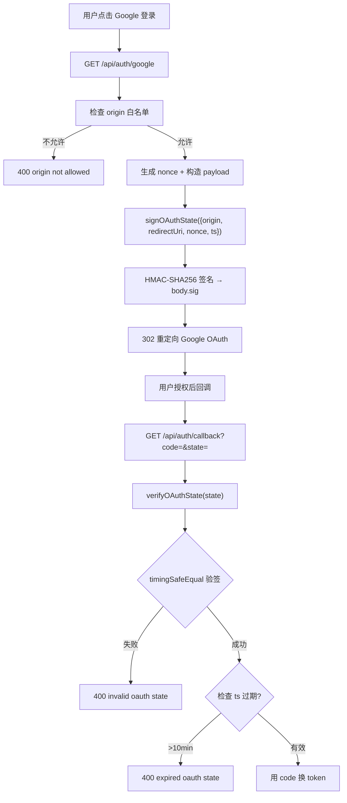
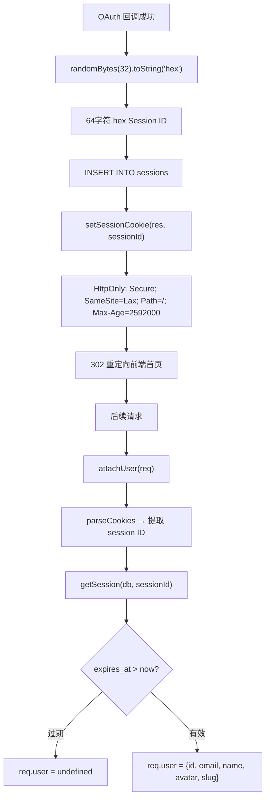
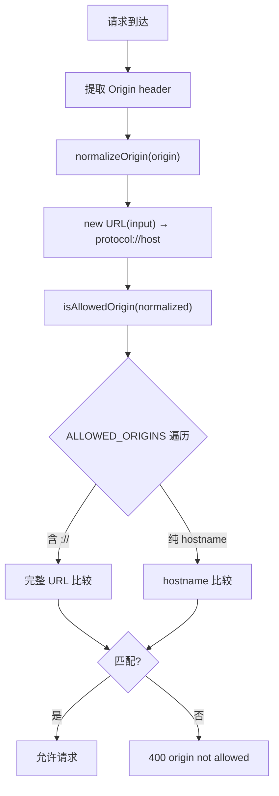

# PD-155.01 ClawFeed — Google OAuth 2.0 + HMAC State + Cookie Session 全栈认证

> 文档编号：PD-155.01
> 来源：ClawFeed `src/server.mjs` `src/db.mjs` `migrations/002_auth.sql`
> GitHub：https://github.com/kevinho/clawfeed
> 问题域：PD-155 认证与会话管理 Authentication & Session Management
> 状态：可复用方案

---

## 第 1 章 问题与动机

### 1.1 核心问题

多用户 Web 应用需要解决三个层面的认证问题：

1. **身份验证**：如何安全地确认用户身份？OAuth 2.0 是主流方案，但 OAuth 流程中的 state 参数如果不做签名验证，极易遭受 CSRF 攻击。
2. **会话管理**：用户登录后如何维持状态？Cookie 是浏览器原生方案，但配置不当（缺少 HttpOnly/Secure/SameSite）会导致 XSS 窃取或 CSRF 利用。
3. **API 鉴权**：服务端 API 如何区分"浏览器用户"和"程序化调用"？需要同时支持 Cookie Session 和 Bearer Token 两种鉴权模式。
4. **跨域安全**：前后端分离架构下，CORS 配置不当会导致任意域名可以发起认证请求。

### 1.2 ClawFeed 的解法概述

ClawFeed 是一个 AI 信息聚合工具，在单文件 `src/server.mjs` 中实现了完整的认证体系：

1. **HMAC-SHA256 签名 OAuth state**：用 `createHmac('sha256', secret)` 对 state payload 签名，回调时用 `timingSafeEqual` 验证，防 CSRF + 防时序攻击（`src/server.mjs:111-129`）
2. **随机 Session ID + SQLite 持久化**：`randomBytes(32)` 生成 64 字符 hex session ID，存入 SQLite sessions 表，带过期时间（`src/server.mjs:487-489`）
3. **HttpOnly+Secure+SameSite=Lax Cookie**：一行代码设置全部安全属性，30 天过期（`src/server.mjs:83-86`）
4. **Bearer Token API Key 鉴权**：写入类 API 用 `Authorization: Bearer <key>` 鉴权，与 Cookie Session 互不干扰（`src/server.mjs:531-533`）
5. **CORS Origin 白名单**：`ALLOWED_ORIGINS` 环境变量控制允许的来源域名，支持完整 URL 和纯 hostname 两种格式（`src/server.mjs:101-109`）

### 1.3 设计思想

| 设计原则 | 具体实现 | 理由 | 替代方案 |
|----------|----------|------|----------|
| 零依赖认证 | 纯 Node.js crypto 模块实现 HMAC/随机数 | 减少供应链攻击面，无需 passport/express-session | passport.js + express-session |
| State 签名防 CSRF | HMAC-SHA256 签名 `{origin, redirectUri, nonce, ts}` | 比随机 state 更安全，可携带上下文且防篡改 | 随机 UUID state 存 Redis |
| 时序安全比较 | `timingSafeEqual` 比较签名 | 防止通过响应时间差推断签名内容 | 普通 `===` 比较（不安全） |
| 双轨鉴权 | Cookie Session（浏览器）+ Bearer Token（API） | 浏览器用户和自动化脚本各走各的路 | 统一 JWT（但 JWT 无法服务端撤销） |
| 数据库 Session | SQLite sessions 表 + expires_at | 可服务端主动撤销，比 JWT 更可控 | JWT 无状态 token |
| Origin 白名单 | 环境变量 `ALLOWED_ORIGINS` 逗号分隔 | 部署时灵活配置，不硬编码 | 硬编码允许域名列表 |

---

## 第 2 章 源码实现分析

### 2.1 架构概览

ClawFeed 的认证体系在单文件 `src/server.mjs` 中实现，无框架依赖，纯 Node.js HTTP server：

```
┌─────────────────────────────────────────────────────────────┐
│                    HTTP Request 入口                         │
│                  createServer() L324                         │
├─────────────────────────────────────────────────────────────┤
│  ┌──────────┐   ┌──────────────┐   ┌─────────────────────┐ │
│  │ CORS     │──→│ attachUser() │──→│ Route Dispatcher     │ │
│  │ Headers  │   │ Cookie→User  │   │                     │ │
│  │ L325-328 │   │ L194-204     │   │ Auth Routes:        │ │
│  └──────────┘   └──────────────┘   │ /api/auth/google    │ │
│                                     │ /api/auth/callback  │ │
│  ┌──────────────────────────────┐  │ /api/auth/me        │ │
│  │ OAuth State 签名/验证        │  │ /api/auth/logout    │ │
│  │ signOAuthState()   L111-115 │  │                     │ │
│  │ verifyOAuthState() L117-129 │  │ Protected Routes:   │ │
│  └──────────────────────────────┘  │ /api/marks (Cookie) │ │
│                                     │ /api/digests (Key)  │ │
│  ┌──────────────────────────────┐  └─────────────────────┘ │
│  │ Session 持久化 (SQLite)      │                           │
│  │ sessions 表  002_auth.sql   │                           │
│  │ createSession() db.mjs:219  │                           │
│  │ getSession()   db.mjs:223   │                           │
│  └──────────────────────────────┘                           │
└─────────────────────────────────────────────────────────────┘
```

### 2.2 核心实现

#### 2.2.1 HMAC-SHA256 OAuth State 签名与验证



对应源码 `src/server.mjs:111-129`：

```javascript
function signOAuthState(payload) {
  const body = Buffer.from(JSON.stringify(payload)).toString('base64url');
  const sig = createHmac('sha256', OAUTH_STATE_SECRET).update(body).digest('base64url');
  return `${body}.${sig}`;
}

function verifyOAuthState(state) {
  if (!state || !state.includes('.')) return null;
  const [body, sig] = state.split('.', 2);
  const expected = createHmac('sha256', OAUTH_STATE_SECRET).update(body).digest('base64url');
  const a = Buffer.from(sig);
  const b = Buffer.from(expected);
  if (a.length !== b.length || !timingSafeEqual(a, b)) return null;
  try {
    return JSON.parse(Buffer.from(body, 'base64url').toString());
  } catch {
    return null;
  }
}
```

关键设计点：
- State 格式为 `base64url(JSON).base64url(HMAC)`，类似 JWT 但更轻量
- Payload 包含 `{origin, redirectUri, nonce, ts}`，回调时可恢复上下文
- `timingSafeEqual` 防止通过比较耗时推断签名（`src/server.mjs:123`）
- 10 分钟过期检查防止 state 被长期重放（`src/server.mjs:463`）

#### 2.2.2 Cookie Session 管理



对应源码 `src/server.mjs:83-86` 和 `src/server.mjs:194-204`：

```javascript
// Cookie 设置 — 一行搞定全部安全属性
function setSessionCookie(res, value, maxAge = 30 * 86400) {
  const cookie = `${COOKIE_NAME}=${value}; HttpOnly; Secure; SameSite=Lax; Path=/; Max-Age=${maxAge}`;
  res.setHeader('Set-Cookie', cookie);
}

// 请求级中间件 — 从 Cookie 恢复用户身份
function attachUser(req) {
  const cookies = parseCookies(req);
  const sessionVal = cookies[COOKIE_NAME];
  if (sessionVal) {
    const sess = getSession(db, sessionVal);
    if (sess) {
      req.user = { id: sess.uid, email: sess.email, name: sess.name, avatar: sess.avatar, slug: sess.slug };
      req.sessionId = sessionVal;
    }
  }
}
```

Session 数据库层 `src/db.mjs:219-233`：

```javascript
export function createSession(db, { id, userId, expiresAt }) {
  db.prepare('INSERT INTO sessions (id, user_id, expires_at) VALUES (?, ?, ?)').run(id, userId, expiresAt);
}

export function getSession(db, sessionId) {
  return db.prepare(`
    SELECT s.*, u.id as uid, u.google_id, u.email, u.name, u.avatar, u.slug
    FROM sessions s JOIN users u ON s.user_id = u.id
    WHERE s.id = ? AND s.expires_at > datetime('now')
  `).get(sessionId);
}

export function deleteSession(db, sessionId) {
  db.prepare('DELETE FROM sessions WHERE id = ?').run(sessionId);
}
```

#### 2.2.3 CORS Origin 白名单校验



对应源码 `src/server.mjs:92-109`：

```javascript
function normalizeOrigin(input) {
  try {
    const u = new URL(input);
    return `${u.protocol}//${u.host}`;
  } catch {
    return null;
  }
}

function isAllowedOrigin(origin) {
  const normalized = normalizeOrigin(origin);
  if (!normalized) return false;
  if (!ALLOWED_ORIGINS.length) return false;
  return ALLOWED_ORIGINS.some((allowed) => {
    if (allowed.includes('://')) return normalizeOrigin(allowed) === normalized;
    try { return new URL(normalized).hostname === allowed; } catch { return false; }
  });
}
```

### 2.3 实现细节

#### Bearer Token API Key 鉴权

写入类 API（创建 digest、管理 config）使用独立的 API Key 鉴权，与 Cookie Session 互不干扰：

```javascript
// src/server.mjs:531-533 — Digest 创建需要 API Key
if (req.method === 'POST' && path === '/api/digests') {
  const authHeader = req.headers.authorization || '';
  const bearerKey = authHeader.startsWith('Bearer ') ? authHeader.slice(7) : '';
  if (!API_KEY || bearerKey !== API_KEY) return json(res, { error: 'invalid api key' }, 401);
  // ...
}
```

#### 用户 Upsert 与自动订阅

新用户首次 OAuth 登录时，自动创建用户记录并订阅所有公开源（`src/db.mjs:190-217`）：

```javascript
export function upsertUser(db, { googleId, email, name, avatar }) {
  const existing = db.prepare('SELECT * FROM users WHERE google_id = ?').get(googleId);
  if (existing) {
    db.prepare('UPDATE users SET email = ?, name = ?, avatar = ? WHERE google_id = ?')
      .run(email, name, avatar, googleId);
    return db.prepare('SELECT * FROM users WHERE google_id = ?').get(googleId);
  }
  // 生成唯一 slug，插入新用户
  let slug = _generateSlug(email, name);
  // ...
  db.prepare('INSERT INTO users (google_id, email, name, avatar, slug) VALUES (?, ?, ?, ?, ?)')
    .run(googleId, email, name, avatar, candidate);
  const newUser = db.prepare('SELECT * FROM users WHERE google_id = ?').get(googleId);
  // 自动订阅所有公开源
  db.prepare('INSERT OR IGNORE INTO user_subscriptions (user_id, source_id) SELECT ?, id FROM sources WHERE is_public = 1')
    .run(newUser.id);
  return newUser;
}
```

#### 数据隔离

所有用户数据操作都带 `user_id` 过滤，确保多用户隔离：
- `listMarks(db, { userId: req.user.id })` — `src/server.mjs:544`
- `createMark(db, { ...body, userId: req.user.id })` — `src/server.mjs:550`
- `deleteMark(db, id, req.user.id)` — `src/server.mjs:557`
- Source 删除检查 `s.created_by !== req.user.id` — `src/server.mjs:674`


---

## 第 3 章 迁移指南

### 3.1 迁移清单

**阶段 1：数据库准备**
- [ ] 创建 `users` 表（google_id, email, name, avatar, slug）
- [ ] 创建 `sessions` 表（id TEXT PK, user_id FK, expires_at）
- [ ] 给业务表添加 `user_id` 外键列

**阶段 2：OAuth 流程**
- [ ] 注册 Google Cloud OAuth 2.0 客户端，获取 client_id 和 client_secret
- [ ] 配置环境变量：`GOOGLE_CLIENT_ID`, `GOOGLE_CLIENT_SECRET`, `SESSION_SECRET`, `OAUTH_STATE_SECRET`, `ALLOWED_ORIGINS`
- [ ] 实现 `signOAuthState()` / `verifyOAuthState()` 函数
- [ ] 实现 `/auth/google`（发起）和 `/auth/callback`（回调）路由

**阶段 3：会话管理**
- [ ] 实现 `setSessionCookie()` / `clearSessionCookie()` 函数
- [ ] 实现 `attachUser()` 中间件，每个请求自动解析 Cookie → User
- [ ] 实现 `/auth/me`（查询当前用户）和 `/auth/logout`（登出）路由

**阶段 4：API Key 鉴权**
- [ ] 配置 `API_KEY` 环境变量
- [ ] 在写入类 API 中添加 Bearer Token 校验

**阶段 5：CORS 配置**
- [ ] 配置 `ALLOWED_ORIGINS` 环境变量
- [ ] 实现 `isAllowedOrigin()` 校验函数
- [ ] 在 OAuth 发起路由中校验 origin

### 3.2 适配代码模板

以下是可直接复用的 Node.js 认证模块（零依赖，纯 `node:crypto`）：

```javascript
// auth.mjs — 可独立复用的认证工具函数
import { randomBytes, createHmac, timingSafeEqual } from 'node:crypto';

// ── OAuth State 签名 ──
export function signOAuthState(secret, payload) {
  const body = Buffer.from(JSON.stringify(payload)).toString('base64url');
  const sig = createHmac('sha256', secret).update(body).digest('base64url');
  return `${body}.${sig}`;
}

export function verifyOAuthState(secret, state, maxAgeMs = 10 * 60 * 1000) {
  if (!state || !state.includes('.')) return null;
  const [body, sig] = state.split('.', 2);
  const expected = createHmac('sha256', secret).update(body).digest('base64url');
  const a = Buffer.from(sig);
  const b = Buffer.from(expected);
  if (a.length !== b.length || !timingSafeEqual(a, b)) return null;
  try {
    const payload = JSON.parse(Buffer.from(body, 'base64url').toString());
    if (maxAgeMs && Date.now() - (payload.ts || 0) > maxAgeMs) return null;
    return payload;
  } catch {
    return null;
  }
}

// ── Session Cookie ──
export function setSessionCookie(res, name, value, maxAge = 30 * 86400) {
  const cookie = `${name}=${value}; HttpOnly; Secure; SameSite=Lax; Path=/; Max-Age=${maxAge}`;
  res.setHeader('Set-Cookie', cookie);
}

export function clearSessionCookie(res, name) {
  setSessionCookie(res, name, '', 0);
}

export function generateSessionId() {
  return randomBytes(32).toString('hex'); // 64 字符
}

// ── CORS Origin 白名单 ──
export function isAllowedOrigin(origin, allowedList) {
  let normalized;
  try {
    const u = new URL(origin);
    normalized = `${u.protocol}//${u.host}`;
  } catch {
    return false;
  }
  return allowedList.some((allowed) => {
    if (allowed.includes('://')) {
      try { const u = new URL(allowed); return `${u.protocol}//${u.host}` === normalized; }
      catch { return false; }
    }
    try { return new URL(normalized).hostname === allowed; }
    catch { return false; }
  });
}

// ── Bearer Token 校验 ──
export function extractBearerToken(req) {
  const auth = req.headers.authorization || '';
  return auth.startsWith('Bearer ') ? auth.slice(7) : '';
}
```

### 3.3 适用场景

| 场景 | 适用度 | 说明 |
|------|--------|------|
| 单体 Node.js 应用 + Google 登录 | ⭐⭐⭐ | 完美匹配，零依赖直接复用 |
| Express/Fastify 应用 | ⭐⭐⭐ | 工具函数可直接用，中间件需适配框架 |
| 多 OAuth Provider（GitHub/Apple） | ⭐⭐ | State 签名和 Session 管理可复用，需扩展 Provider 配置 |
| 微服务架构 | ⭐ | Session 存 SQLite 不适合分布式，需换 Redis/JWT |
| Serverless（Lambda/Vercel） | ⭐ | SQLite 不适合无状态环境，需换 DynamoDB/Planetscale |

---

## 第 4 章 测试用例

```javascript
import { describe, it, expect, beforeEach } from 'vitest';
import { randomBytes, createHmac, timingSafeEqual } from 'node:crypto';

// ── 被测函数（从 auth.mjs 提取） ──
function signOAuthState(secret, payload) {
  const body = Buffer.from(JSON.stringify(payload)).toString('base64url');
  const sig = createHmac('sha256', secret).update(body).digest('base64url');
  return `${body}.${sig}`;
}

function verifyOAuthState(secret, state, maxAgeMs = 10 * 60 * 1000) {
  if (!state || !state.includes('.')) return null;
  const [body, sig] = state.split('.', 2);
  const expected = createHmac('sha256', secret).update(body).digest('base64url');
  const a = Buffer.from(sig);
  const b = Buffer.from(expected);
  if (a.length !== b.length || !timingSafeEqual(a, b)) return null;
  try {
    const payload = JSON.parse(Buffer.from(body, 'base64url').toString());
    if (maxAgeMs && Date.now() - (payload.ts || 0) > maxAgeMs) return null;
    return payload;
  } catch { return null; }
}

function isAllowedOrigin(origin, allowedList) {
  let normalized;
  try { const u = new URL(origin); normalized = `${u.protocol}//${u.host}`; }
  catch { return false; }
  return allowedList.some((allowed) => {
    if (allowed.includes('://')) {
      try { const u = new URL(allowed); return `${u.protocol}//${u.host}` === normalized; }
      catch { return false; }
    }
    try { return new URL(normalized).hostname === allowed; }
    catch { return false; }
  });
}

// ── 测试 ──
const SECRET = 'test-secret-key-for-hmac';

describe('OAuth State 签名与验证', () => {
  it('正常签名和验证', () => {
    const payload = { origin: 'https://app.example.com', nonce: 'abc123', ts: Date.now() };
    const state = signOAuthState(SECRET, payload);
    const result = verifyOAuthState(SECRET, state);
    expect(result).toMatchObject({ origin: 'https://app.example.com', nonce: 'abc123' });
  });

  it('篡改 payload 后验证失败', () => {
    const state = signOAuthState(SECRET, { origin: 'https://good.com', ts: Date.now() });
    const [body, sig] = state.split('.');
    const tampered = Buffer.from(JSON.stringify({ origin: 'https://evil.com', ts: Date.now() })).toString('base64url');
    expect(verifyOAuthState(SECRET, `${tampered}.${sig}`)).toBeNull();
  });

  it('篡改签名后验证失败', () => {
    const state = signOAuthState(SECRET, { origin: 'https://good.com', ts: Date.now() });
    const [body] = state.split('.');
    expect(verifyOAuthState(SECRET, `${body}.fakesig`)).toBeNull();
  });

  it('过期 state 验证失败', () => {
    const payload = { origin: 'https://app.example.com', ts: Date.now() - 15 * 60 * 1000 };
    const state = signOAuthState(SECRET, payload);
    expect(verifyOAuthState(SECRET, state, 10 * 60 * 1000)).toBeNull();
  });

  it('空值和无效格式返回 null', () => {
    expect(verifyOAuthState(SECRET, null)).toBeNull();
    expect(verifyOAuthState(SECRET, '')).toBeNull();
    expect(verifyOAuthState(SECRET, 'no-dot-here')).toBeNull();
  });

  it('不同 secret 验证失败', () => {
    const state = signOAuthState(SECRET, { origin: 'https://app.com', ts: Date.now() });
    expect(verifyOAuthState('wrong-secret', state)).toBeNull();
  });
});

describe('CORS Origin 白名单', () => {
  const allowed = ['https://app.example.com', 'localhost', 'staging.example.com'];

  it('完整 URL 匹配', () => {
    expect(isAllowedOrigin('https://app.example.com', allowed)).toBe(true);
    expect(isAllowedOrigin('https://app.example.com/', allowed)).toBe(true);
  });

  it('hostname 匹配', () => {
    expect(isAllowedOrigin('http://localhost:3000', allowed)).toBe(true);
    expect(isAllowedOrigin('https://staging.example.com', allowed)).toBe(true);
  });

  it('未授权 origin 拒绝', () => {
    expect(isAllowedOrigin('https://evil.com', allowed)).toBe(false);
    expect(isAllowedOrigin('https://app.example.com.evil.com', allowed)).toBe(false);
  });

  it('无效 origin 返回 false', () => {
    expect(isAllowedOrigin('not-a-url', allowed)).toBe(false);
    expect(isAllowedOrigin('', allowed)).toBe(false);
  });
});
```


---

## 第 5 章 跨域关联

| 关联域 | 关系类型 | 说明 |
|--------|----------|------|
| PD-158 SSRF 防护 | 协同 | ClawFeed 的 `assertSafeFetchUrl()` 和 `isPrivateOrSpecialIp()` 在 `src/server.mjs:131-161` 实现了完整的 SSRF 防护，与认证体系配合保护服务端请求安全 |
| PD-06 记忆持久化 | 依赖 | Session 持久化依赖 SQLite 数据库层（`src/db.mjs`），sessions 表的 CRUD 操作复用了 better-sqlite3 的同步 API |
| PD-157 多租户隔离 | 协同 | 认证系统提供 `req.user.id`，所有业务查询通过 `user_id` 过滤实现数据隔离，是多租户的基础设施 |
| PD-04 工具系统 | 依赖 | API Key 鉴权用于保护自动化工具调用（如 digest 创建），是工具系统安全边界的一部分 |

---

## 第 6 章 来源文件索引

| 文件 | 行范围 | 关键实现 |
|------|--------|----------|
| `src/server.mjs` | L7 | `import { randomBytes, createHmac, timingSafeEqual } from 'crypto'` — 核心加密依赖 |
| `src/server.mjs` | L27-33 | 环境变量加载：GOOGLE_CLIENT_ID, SESSION_SECRET, OAUTH_STATE_SECRET, ALLOWED_ORIGINS |
| `src/server.mjs` | L72-80 | `parseCookies()` — 手写 Cookie 解析器 |
| `src/server.mjs` | L82-90 | `setSessionCookie()` / `clearSessionCookie()` — Cookie 安全属性设置 |
| `src/server.mjs` | L92-109 | `normalizeOrigin()` / `isAllowedOrigin()` — CORS Origin 白名单 |
| `src/server.mjs` | L111-129 | `signOAuthState()` / `verifyOAuthState()` — HMAC State 签名验证 |
| `src/server.mjs` | L194-204 | `attachUser()` — 请求级认证中间件 |
| `src/server.mjs` | L431-498 | OAuth 路由：`/api/auth/google` 发起 + `/api/auth/callback` 回调 |
| `src/server.mjs` | L502-512 | `/api/auth/me` + `/api/auth/logout` |
| `src/server.mjs` | L531-533 | Bearer Token API Key 鉴权 |
| `src/db.mjs` | L190-217 | `upsertUser()` — 用户 Upsert + 自动订阅 |
| `src/db.mjs` | L219-233 | `createSession()` / `getSession()` / `deleteSession()` — Session CRUD |
| `migrations/002_auth.sql` | L1-20 | users 表 + sessions 表 DDL |

---

## 第 7 章 横向对比维度

```json comparison_data
{
  "project": "ClawFeed",
  "dimensions": {
    "认证协议": "Google OAuth 2.0 + Authorization Code Flow",
    "State 防护": "HMAC-SHA256 签名 payload + timingSafeEqual 验证",
    "会话存储": "SQLite sessions 表 + randomBytes(32) hex ID",
    "Cookie 安全": "HttpOnly + Secure + SameSite=Lax + 30天过期",
    "API 鉴权": "Bearer Token API Key，与 Cookie Session 双轨并行",
    "CORS 策略": "环境变量白名单，支持完整 URL 和纯 hostname 匹配",
    "多用户隔离": "所有业务查询带 user_id 过滤 + 资源 ownership 检查",
    "依赖复杂度": "零外部依赖，纯 node:crypto 实现"
  }
}
```

### 域元数据补充

```json domain_metadata
{
  "solution_summary": "ClawFeed 用纯 Node.js crypto 实现零依赖认证：HMAC-SHA256 签名 OAuth state 携带上下文、randomBytes(32) Session ID 存 SQLite、Bearer Token 双轨鉴权",
  "description": "涵盖 OAuth state 上下文传递、服务端 Session 撤销能力、双轨鉴权模式选择",
  "sub_problems": [
    "OAuth state 上下文传递（origin/redirectUri 恢复）",
    "Session 过期与服务端主动撤销",
    "新用户自动初始化（upsert + 默认订阅）"
  ],
  "best_practices": [
    "OAuth state 用 base64url(JSON).base64url(HMAC) 格式携带上下文",
    "Session ID 用 randomBytes(32) 生成 64 字符 hex 确保不可预测",
    "Bearer Token 和 Cookie Session 双轨鉴权互不干扰"
  ]
}
```

