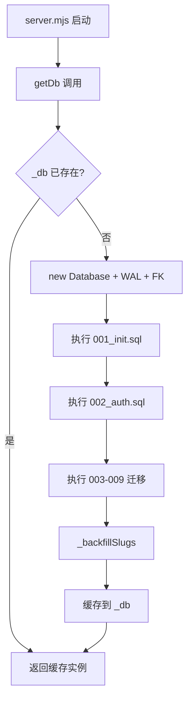
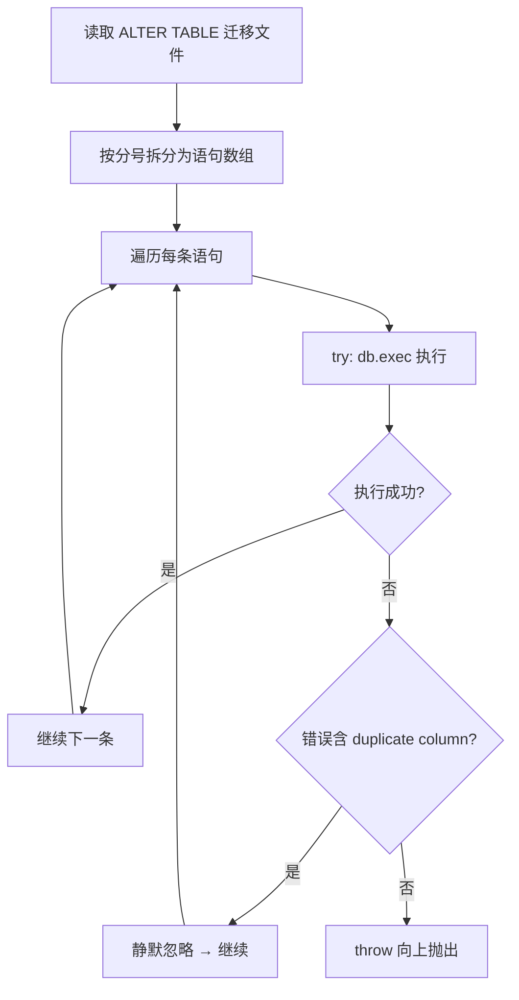
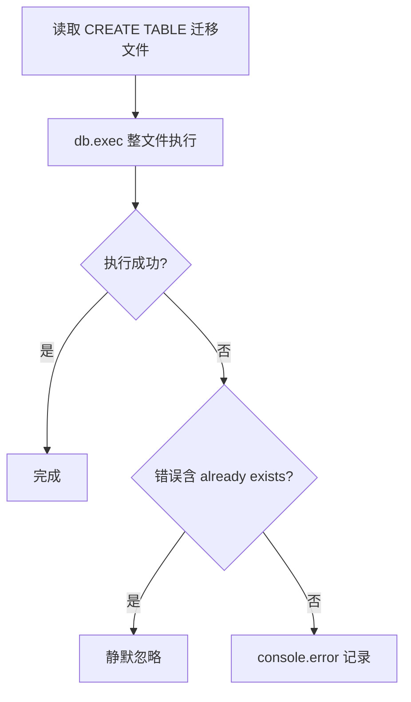

# PD-156.01 ClawFeed — 顺序编号 SQL 迁移与异常驱动幂等

> 文档编号：PD-156.01
> 来源：ClawFeed `src/db.mjs` `migrations/001-009`
> GitHub：https://github.com/kevinho/clawfeed
> 问题域：PD-156 数据库迁移 Database Migration
> 状态：可复用方案

---

## 第 1 章 问题与动机

### 1.1 核心问题

数据库 schema 随产品迭代不断演进，需要一套机制保证：
- **增量演进**：每次发版只执行新增的 schema 变更，不影响已有数据
- **幂等安全**：同一迁移重复执行不报错、不破坏数据
- **零依赖**：不引入 ORM 或迁移框架（Knex/Prisma/TypeORM），保持极简
- **启动即就绪**：应用启动时自动完成所有迁移，无需手动运行命令

对于 SQLite 这类嵌入式数据库，传统的迁移框架（版本表 + 锁机制）显得过重。ClawFeed 选择了一种极简但有效的方案：顺序编号文件 + 异常捕获幂等。

### 1.2 ClawFeed 的解法概述

1. **顺序编号文件**：`migrations/001_init.sql` 到 `009_feedback_v2.sql`，文件名即执行顺序（`src/db.mjs:29-104`）
2. **启动时全量执行**：`getDb()` 函数在首次调用时依次读取并执行全部 9 个迁移文件（`src/db.mjs:23-107`）
3. **异常驱动幂等**：通过 try-catch 捕获 `duplicate column` 和 `already exists` 错误实现幂等，而非使用版本表（`src/db.mjs:37-39`）
4. **两种幂等策略**：CREATE TABLE 用 `IF NOT EXISTS`（DDL 级），ALTER TABLE 用 try-catch（异常级）（`migrations/003_sources.sql:1` vs `src/db.mjs:37-39`）
5. **数据回填**：迁移后自动执行数据回填逻辑，如 `_backfillSlugs()`（`src/db.mjs:106, 115-128`）

### 1.3 设计思想

| 设计原则 | 具体实现 | 理由 | 替代方案 |
|----------|----------|------|----------|
| 零依赖迁移 | 纯 SQL 文件 + `readFileSync` 读取执行 | SQLite 嵌入式场景不需要重量级 ORM | Knex/Prisma migrate |
| 异常驱动幂等 | try-catch 捕获 `duplicate column` / `already exists` | SQLite 的 ALTER TABLE 不支持 `IF NOT EXISTS` | 版本表记录已执行迁移 |
| 启动即迁移 | `getDb()` 单例初始化时执行全部迁移 | 消除手动迁移步骤，部署即就绪 | CLI 命令 `migrate up` |
| 只增不删 | 9 个迁移文件只有 CREATE 和 ALTER，无 DROP | 保证任何版本都能安全回滚到前一版本 | 双向迁移（up/down） |
| 语句级隔离 | ALTER TABLE 迁移按分号拆分逐条执行 | 单条失败不影响其他列的添加 | 整个文件作为事务执行 |

---

## 第 2 章 源码实现分析

### 2.1 架构概览

ClawFeed 的迁移系统完全内嵌在数据库初始化函数 `getDb()` 中，没有独立的迁移模块：

```
┌─────────────────────────────────────────────────────────┐
│                    server.mjs                           │
│  const db = getDb(DB_PATH);  ← 启动时调用一次          │
└──────────────────────┬──────────────────────────────────┘
                       │
                       ▼
┌─────────────────────────────────────────────────────────┐
│                    db.mjs: getDb()                      │
│                                                         │
│  1. new Database(path)                                  │
│  2. pragma('journal_mode = WAL')                        │
│  3. pragma('foreign_keys = ON')                         │
│  4. ┌─────────────────────────────────┐                 │
│     │ 001_init.sql      → exec()     │ CREATE TABLE    │
│     │ 002_auth.sql      → split+try  │ ALTER TABLE     │
│     │ 003_sources.sql   → exec()     │ CREATE TABLE    │
│     │ 004_feed.sql      → split+try  │ ALTER TABLE     │
│     │ 005_source_packs  → exec()     │ CREATE TABLE    │
│     │ 006_subscriptions → exec()     │ CREATE TABLE    │
│     │ 007_soft_delete   → split+try  │ ALTER TABLE     │
│     │ 008_feedback.sql  → exec()     │ CREATE TABLE    │
│     │ 009_feedback_v2   → split+try  │ ALTER TABLE     │
│     └─────────────────────────────────┘                 │
│  5. _backfillSlugs(db)                                  │
│  6. return db                                           │
└─────────────────────────────────────────────────────────┘
```

迁移文件分为两类，执行策略不同：

| 类型 | 文件 | 幂等策略 | 执行方式 |
|------|------|----------|----------|
| CREATE TABLE | 001, 003, 005, 006, 008 | `IF NOT EXISTS` | `db.exec(sql)` 整文件执行 |
| ALTER TABLE | 002, 004, 007, 009 | try-catch 捕获异常 | 按 `;` 拆分逐条执行 |

### 2.2 核心实现

#### 迁移执行主流程



对应源码 `src/db.mjs:23-108`：

```javascript
let _db;

export function getDb(dbPath) {
  if (_db) return _db;
  const p = dbPath || join(ROOT, 'data', 'digest.db');
  _db = new Database(p);
  _db.pragma('journal_mode = WAL');
  _db.pragma('foreign_keys = ON');
  // Run migrations
  const sql = readFileSync(join(ROOT, 'migrations', '001_init.sql'), 'utf8');
  _db.exec(sql);
  // ... 002-009 migrations ...
  _backfillSlugs(_db);
  return _db;
}
```

#### ALTER TABLE 异常驱动幂等



对应源码 `src/db.mjs:33-43`（002_auth.sql 的执行逻辑）：

```javascript
// Run auth migration (idempotent)
try {
  const sql2 = readFileSync(join(ROOT, 'migrations', '002_auth.sql'), 'utf8');
  // Execute each statement separately since ALTER TABLE may fail if column exists
  for (const stmt of sql2.split(';').map(s => s.trim()).filter(Boolean)) {
    try { _db.exec(stmt + ';'); } catch (e) {
      if (!e.message.includes('duplicate column')) throw e;
    }
  }
} catch (e) {
  if (!e.message.includes('duplicate column')) console.error('Migration 002:', e.message);
}
```

#### CREATE TABLE 的 DDL 级幂等



对应源码 `migrations/003_sources.sql:1`：

```sql
CREATE TABLE IF NOT EXISTS sources (
  id INTEGER PRIMARY KEY AUTOINCREMENT,
  name TEXT NOT NULL,
  type TEXT NOT NULL,
  config TEXT NOT NULL DEFAULT '{}',
  is_active INTEGER DEFAULT 1,
  is_public INTEGER DEFAULT 0,
  created_by INTEGER REFERENCES users(id),
  created_at TEXT DEFAULT (datetime('now')),
  updated_at TEXT DEFAULT (datetime('now')),
  last_fetched_at TEXT,
  fetch_count INTEGER DEFAULT 0
);
```

### 2.3 实现细节

#### Schema 演进时间线

ClawFeed 的 9 个迁移文件记录了完整的产品演进历程：

```
001_init.sql     → 核心表: digests, marks, config
002_auth.sql     → 用户系统: users, sessions + marks.user_id
003_sources.sql  → 数据源: sources + 索引
004_feed.sql     → Feed 功能: users.slug + digests.user_id
005_source_packs → 源包分享: source_packs
006_subscriptions→ 订阅系统: user_subscriptions
007_soft_delete  → 软删除: sources.is_deleted + deleted_at
008_feedback.sql → 反馈系统: feedback
009_feedback_v2  → 反馈增强: feedback.category + read_at
```

#### 数据回填模式

迁移完成后，`_backfillSlugs()` 自动为缺少 slug 的用户生成唯一标识（`src/db.mjs:115-128`）：

```javascript
function _backfillSlugs(db) {
  const users = db.prepare('SELECT id, email, name, slug FROM users WHERE slug IS NULL').all();
  const SLUG_MAP = { 'freefacefly@gmail.com': 'kevin', 'kevin@coco.xyz': 'kevinhe' };
  for (const u of users) {
    let slug = SLUG_MAP[u.email] || _generateSlug(u.email, u.name);
    let candidate = slug;
    let i = 1;
    while (db.prepare('SELECT 1 FROM users WHERE slug = ? AND id != ?').get(candidate, u.id)) {
      candidate = slug + i++;
    }
    db.prepare('UPDATE users SET slug = ? WHERE id = ?').run(candidate, u.id);
  }
}
```

这种"迁移 + 回填"模式确保 schema 变更和数据修复在同一个启动周期内完成。

#### WAL 模式与外键约束

数据库初始化时设置两个关键 pragma（`src/db.mjs:27-28`）：
- `journal_mode = WAL`：Write-Ahead Logging，提升并发读写性能，迁移执行期间不阻塞读操作
- `foreign_keys = ON`：启用外键约束，确保迁移中的 REFERENCES 声明生效

---

## 第 3 章 迁移指南

### 3.1 迁移清单

将 ClawFeed 的迁移模式移植到自己的项目，分 3 个阶段：

**阶段 1：基础设施（1 个文件）**
- [ ] 创建 `migrations/` 目录
- [ ] 创建 `001_init.sql`，包含核心表定义（使用 `CREATE TABLE IF NOT EXISTS`）
- [ ] 在数据库初始化函数中添加迁移执行逻辑

**阶段 2：迁移执行器（核心）**
- [ ] 实现 `runMigrations(db)` 函数，自动扫描 `migrations/` 目录
- [ ] 对 CREATE TABLE 文件使用 `IF NOT EXISTS` 幂等
- [ ] 对 ALTER TABLE 文件使用语句拆分 + try-catch 幂等
- [ ] 添加错误分类：可忽略错误（duplicate column, already exists）vs 致命错误

**阶段 3：增强（可选）**
- [ ] 添加迁移版本表（记录已执行的迁移，避免每次全量执行）
- [ ] 添加数据回填钩子（迁移后自动执行数据修复）
- [ ] 添加迁移日志（记录每次迁移的执行时间和结果）

### 3.2 适配代码模板

以下是一个通用化的迁移执行器，基于 ClawFeed 的模式但做了自动化增强：

```javascript
import Database from 'better-sqlite3';
import { readFileSync, readdirSync } from 'fs';
import { join } from 'path';

// 可忽略的 SQLite 错误模式
const IGNORABLE_ERRORS = [
  'duplicate column',
  'already exists',
  'table .* already exists',
];

function isIgnorableError(message) {
  return IGNORABLE_ERRORS.some(pattern => 
    new RegExp(pattern, 'i').test(message)
  );
}

/**
 * 自动扫描 migrations/ 目录，按编号顺序执行全部 SQL 文件。
 * - CREATE TABLE 文件：整文件执行（依赖 IF NOT EXISTS）
 * - ALTER TABLE 文件：按分号拆分逐条执行 + try-catch 幂等
 */
export function runMigrations(db, migrationsDir) {
  const files = readdirSync(migrationsDir)
    .filter(f => f.endsWith('.sql'))
    .sort(); // 001_xxx.sql, 002_xxx.sql, ...

  for (const file of files) {
    const sql = readFileSync(join(migrationsDir, file), 'utf8');
    const hasAlterTable = /ALTER\s+TABLE/i.test(sql);

    if (hasAlterTable) {
      // 逐条执行，捕获 duplicate column 等幂等错误
      const stmts = sql.split(';').map(s => s.trim()).filter(Boolean);
      for (const stmt of stmts) {
        try {
          db.exec(stmt + ';');
        } catch (e) {
          if (!isIgnorableError(e.message)) throw e;
        }
      }
    } else {
      // 整文件执行（CREATE TABLE IF NOT EXISTS 自带幂等）
      try {
        db.exec(sql);
      } catch (e) {
        if (!isIgnorableError(e.message)) {
          console.error(`Migration ${file}:`, e.message);
          throw e;
        }
      }
    }
  }
}

// 使用示例
export function initDb(dbPath, migrationsDir) {
  const db = new Database(dbPath);
  db.pragma('journal_mode = WAL');
  db.pragma('foreign_keys = ON');
  runMigrations(db, migrationsDir);
  return db;
}
```

### 3.3 适用场景

| 场景 | 适用度 | 说明 |
|------|--------|------|
| SQLite 嵌入式应用 | ⭐⭐⭐ | 最佳场景，无需外部迁移工具 |
| 单实例 Node.js 服务 | ⭐⭐⭐ | 启动即迁移，部署简单 |
| Electron 桌面应用 | ⭐⭐⭐ | 本地数据库，用户无感升级 |
| 多实例并发部署 | ⭐ | 无锁机制，多实例同时迁移可能冲突 |
| PostgreSQL/MySQL 生产环境 | ⭐⭐ | 可用但建议加版本表和锁 |
| 需要回滚的场景 | ⭐ | 只增不删设计不支持 down 迁移 |

---

## 第 4 章 测试用例

```javascript
import { describe, it, expect, beforeEach, afterEach } from 'vitest';
import Database from 'better-sqlite3';
import { mkdtempSync, writeFileSync, mkdirSync, rmSync } from 'fs';
import { join } from 'path';
import { tmpdir } from 'os';

// 复用第 3 章的 runMigrations
import { runMigrations } from './migrate.mjs';

describe('顺序编号 SQL 迁移', () => {
  let db;
  let tmpDir;
  let migrationsDir;

  beforeEach(() => {
    tmpDir = mkdtempSync(join(tmpdir(), 'migrate-test-'));
    migrationsDir = join(tmpDir, 'migrations');
    mkdirSync(migrationsDir);
    db = new Database(':memory:');
    db.pragma('foreign_keys = ON');
  });

  afterEach(() => {
    db.close();
    rmSync(tmpDir, { recursive: true });
  });

  it('正常路径：按顺序创建表', () => {
    writeFileSync(join(migrationsDir, '001_init.sql'),
      `CREATE TABLE IF NOT EXISTS items (
        id INTEGER PRIMARY KEY, name TEXT NOT NULL
      );`);
    writeFileSync(join(migrationsDir, '002_tags.sql'),
      `CREATE TABLE IF NOT EXISTS tags (
        id INTEGER PRIMARY KEY, label TEXT UNIQUE
      );`);

    runMigrations(db, migrationsDir);

    const tables = db.prepare(
      "SELECT name FROM sqlite_master WHERE type='table' ORDER BY name"
    ).all().map(r => r.name);
    expect(tables).toContain('items');
    expect(tables).toContain('tags');
  });

  it('幂等性：重复执行不报错', () => {
    writeFileSync(join(migrationsDir, '001_init.sql'),
      `CREATE TABLE IF NOT EXISTS items (id INTEGER PRIMARY KEY, name TEXT);`);
    writeFileSync(join(migrationsDir, '002_add_col.sql'),
      `ALTER TABLE items ADD COLUMN status TEXT DEFAULT 'active';`);

    // 第一次执行
    runMigrations(db, migrationsDir);
    // 第二次执行 — 不应抛出异常
    expect(() => runMigrations(db, migrationsDir)).not.toThrow();

    // 验证列只存在一次
    const cols = db.prepare("PRAGMA table_info(items)").all().map(c => c.name);
    expect(cols).toEqual(['id', 'name', 'status']);
  });

  it('ALTER TABLE 部分失败不影响其他列', () => {
    writeFileSync(join(migrationsDir, '001_init.sql'),
      `CREATE TABLE IF NOT EXISTS items (id INTEGER PRIMARY KEY, name TEXT);`);
    // 手动添加 status 列，模拟部分迁移已执行
    runMigrations(db, migrationsDir);
    db.exec("ALTER TABLE items ADD COLUMN status TEXT DEFAULT 'active'");

    // 迁移文件同时添加 status 和 priority
    writeFileSync(join(migrationsDir, '002_extend.sql'),
      `ALTER TABLE items ADD COLUMN status TEXT DEFAULT 'active';
       ALTER TABLE items ADD COLUMN priority INTEGER DEFAULT 0;`);

    runMigrations(db, migrationsDir);

    const cols = db.prepare("PRAGMA table_info(items)").all().map(c => c.name);
    expect(cols).toContain('status');
    expect(cols).toContain('priority');
  });

  it('致命错误正常抛出', () => {
    writeFileSync(join(migrationsDir, '001_bad.sql'),
      `CREATE TABLE items (id INTEGER PRIMARY KEY);
       INSERT INTO nonexistent_table VALUES (1);`);

    expect(() => runMigrations(db, migrationsDir)).toThrow();
  });
});
```

---

## 第 5 章 跨域关联

| 关联域 | 关系类型 | 说明 |
|--------|----------|------|
| PD-06 记忆持久化 | 协同 | 迁移系统是持久化层的基础设施，schema 演进直接影响数据存储结构 |
| PD-03 容错与重试 | 协同 | 异常驱动幂等本质上是一种容错模式——预期错误被捕获并安全忽略 |
| PD-07 质量检查 | 依赖 | 迁移后的数据回填（`_backfillSlugs`）是一种数据质量保证机制 |
| PD-163 软删除模式 | 协同 | `007_soft_delete.sql` 通过 ALTER TABLE 为 sources 表添加软删除字段，迁移系统是软删除落地的载体 |

---

## 第 6 章 来源文件索引

| 文件 | 行范围 | 关键实现 |
|------|--------|----------|
| `src/db.mjs` | L23-L108 | `getDb()` 迁移执行主函数，包含全部 9 个迁移的加载和执行逻辑 |
| `src/db.mjs` | L27-L28 | WAL 模式和外键约束设置 |
| `src/db.mjs` | L33-L43 | ALTER TABLE 异常驱动幂等模式（002_auth 示例） |
| `src/db.mjs` | L44-L50 | CREATE TABLE 幂等模式（003_sources 示例） |
| `src/db.mjs` | L76-L86 | 软删除迁移执行（007_soft_delete） |
| `src/db.mjs` | L94-L104 | 最新迁移 009_feedback_v2 的执行 |
| `src/db.mjs` | L106, L115-L128 | `_backfillSlugs()` 数据回填逻辑 |
| `src/server.mjs` | L38 | `getDb(DB_PATH)` 启动时触发迁移 |
| `migrations/001_init.sql` | L1-L27 | 初始 schema：digests, marks, config 三表 |
| `migrations/002_auth.sql` | L1-L19 | 用户认证：users, sessions 表 + marks.user_id |
| `migrations/003_sources.sql` | L1-L17 | 数据源表 + 索引 |
| `migrations/004_feed.sql` | L1-L8 | Feed 功能：users.slug + digests.user_id |
| `migrations/005_source_packs.sql` | L1-L12 | 源包分享表 |
| `migrations/006_subscriptions.sql` | L1-L10 | 用户订阅关系表 |
| `migrations/007_soft_delete.sql` | L1-L2 | 软删除字段：is_deleted + deleted_at |
| `migrations/008_feedback.sql` | L1-L14 | 反馈系统表 |
| `migrations/009_feedback_v2.sql` | L1-L3 | 反馈增强：category + read_at |

---

## 第 7 章 横向对比维度

> **重要：** 本章用于自动填充 Butcher Wiki 的横向对比表。

```json comparison_data
{
  "project": "ClawFeed",
  "dimensions": {
    "迁移编排": "顺序编号文件（001-009），启动时全量执行",
    "幂等策略": "双轨制：CREATE 用 IF NOT EXISTS，ALTER 用 try-catch 异常捕获",
    "版本追踪": "无版本表，依赖文件编号隐式排序",
    "回滚支持": "只增不删设计，无 down 迁移",
    "执行时机": "应用启动时自动执行（getDb 单例初始化）",
    "数据回填": "迁移后自动执行 _backfillSlugs 数据修复"
  }
}
```

### 域元数据补充

```json domain_metadata
{
  "solution_summary": "ClawFeed 用顺序编号 SQL 文件（001-009）+ 异常驱动幂等（try-catch 捕获 duplicate column）实现零依赖启动时自动迁移",
  "description": "嵌入式数据库的轻量迁移方案，无需 ORM 或迁移框架",
  "sub_problems": [
    "迁移后数据回填（schema 变更后的存量数据修复）",
    "DDL 级与异常级幂等策略的选择"
  ],
  "best_practices": [
    "WAL 模式下执行迁移避免阻塞读操作",
    "ALTER TABLE 按分号拆分逐条执行实现语句级隔离"
  ]
}
```
