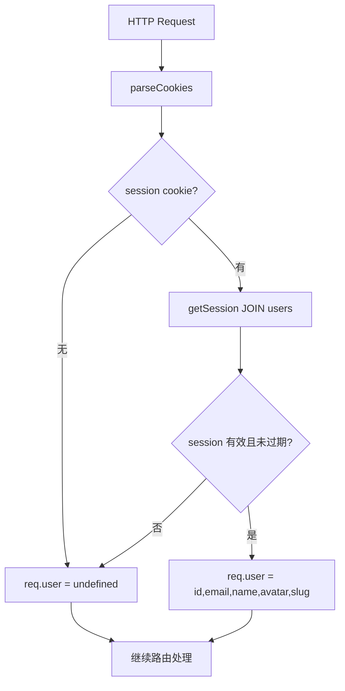
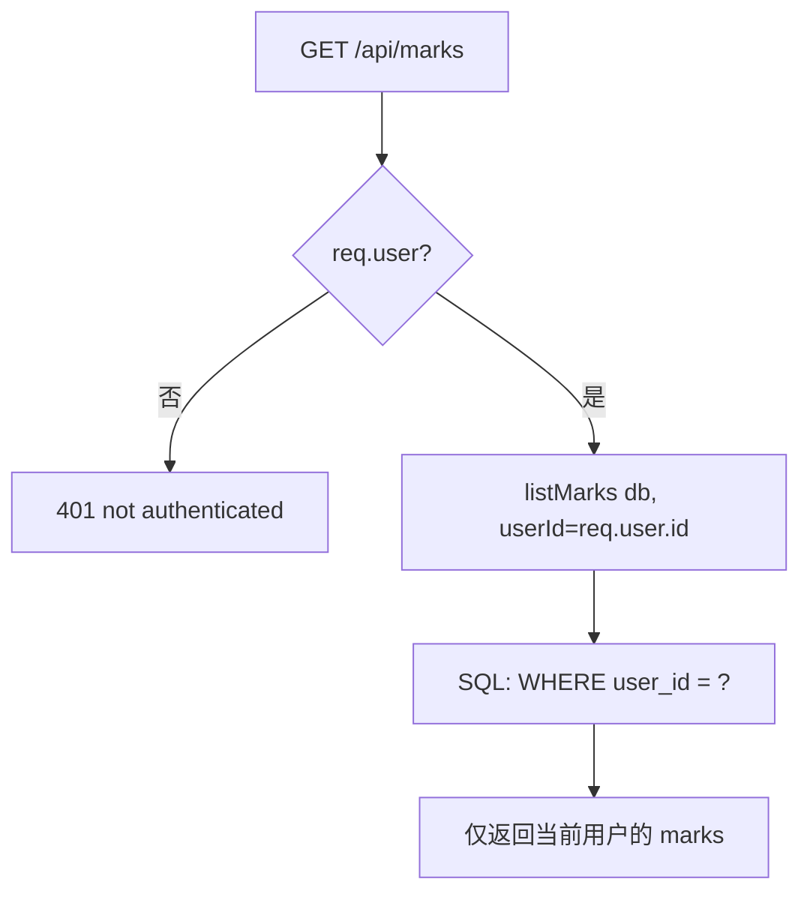
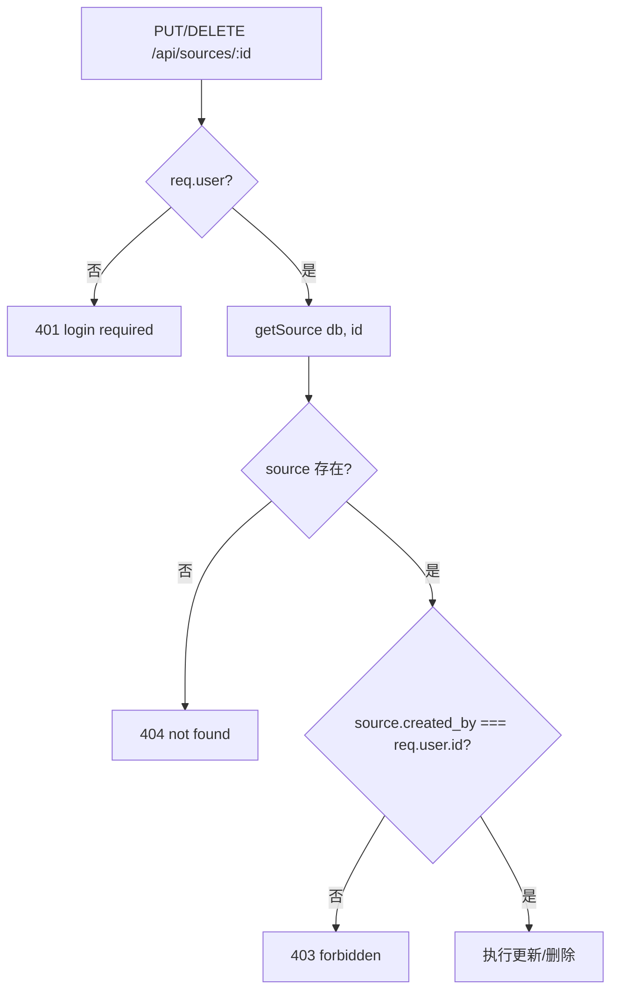
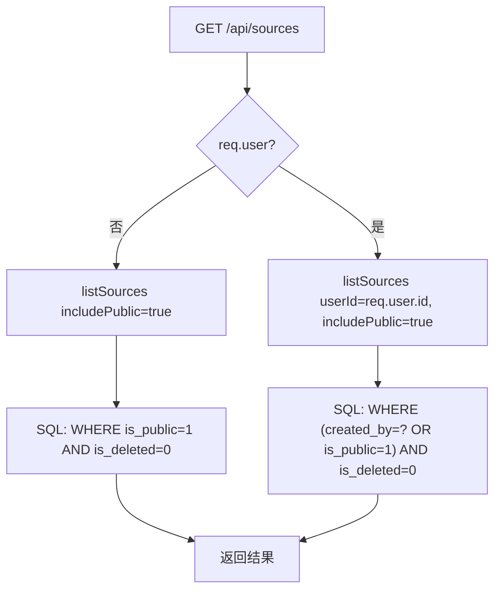

# PD-157.01 ClawFeed — 用户级数据隔离与所有权校验

> 文档编号：PD-157.01
> 来源：ClawFeed `src/server.mjs` `src/db.mjs` `migrations/002_auth.sql` `migrations/003_sources.sql` `migrations/006_subscriptions.sql` `migrations/007_soft_delete.sql`
> GitHub：https://github.com/kevinho/clawfeed
> 问题域：PD-157 多租户数据隔离 Multi-Tenant Data Isolation
> 状态：可复用方案

---

## 第 1 章 问题与动机

### 1.1 核心问题

多用户 SaaS 应用中，不同用户的数据必须严格隔离。一个用户不能看到、修改或删除另一个用户的私有数据。这不仅是功能需求，更是安全底线——数据泄露会直接导致用户信任崩塌。

具体子问题包括：
- **查询隔离**：列表接口必须按 user_id 过滤，不能返回其他用户的数据
- **写入归属**：创建资源时自动绑定当前用户 ID
- **所有权校验**：修改/删除操作前必须验证 created_by 是否匹配当前用户
- **可见性分层**：public 资源所有人可见，private 资源仅创建者可见
- **关联数据一致性**：删除资源时，订阅者的视图需要正确反映状态变化
- **新用户冷启动**：新注册用户需要有合理的默认数据（如自动订阅公共源）

### 1.2 ClawFeed 的解法概述

ClawFeed 是一个 AI 信息聚合工具，用户可以创建信息源（RSS、Twitter、Reddit 等）、收藏文章（marks）、管理订阅关系。它采用 SQLite 单库 + 行级隔离的轻量方案：

1. **行级 user_id 过滤**：marks、digests 等私有数据表通过 `WHERE user_id = ?` 实现查询隔离（`src/db.mjs:156-165`）
2. **created_by 所有权校验**：sources 的 PUT/DELETE 操作在 API 层校验 `created_by !== req.user.id` 返回 403（`src/server.mjs:664`）
3. **is_public 可见性控制**：sources 表通过 `is_public` 字段实现公私分层，查询时用 `(created_by = ? OR is_public = 1)` 组合条件（`src/db.mjs:266-268`）
4. **user_subscriptions 多对多关系**：独立的订阅表实现用户与信息源的多对多关系，支持独立的订阅/退订操作（`migrations/006_subscriptions.sql:1-10`）
5. **新用户自动订阅公共源**：`upsertUser` 中用一条 `INSERT OR IGNORE ... SELECT` 批量订阅所有公共源（`src/db.mjs:215`）

### 1.3 设计思想

| 设计原则 | 具体实现 | 理由 | 替代方案 |
|----------|----------|------|----------|
| 行级隔离优于库级隔离 | 所有表共享一个 SQLite 数据库，通过 WHERE 子句过滤 | 单库部署简单，SQLite 无连接开销 | 每用户独立数据库文件（复杂度高） |
| API 层双重校验 | 先 attachUser 解析 session，再在路由中校验 created_by | 防止越权操作，即使 SQL 层漏过也有 API 层兜底 | 仅依赖 SQL WHERE 条件（不够安全） |
| 软删除保留关联 | sources 用 is_deleted 标记而非物理删除 | 订阅者仍能看到"已停用"状态，不会出现悬空引用 | 物理删除 + CASCADE（订阅记录丢失） |
| 默认私有，显式公开 | sources.is_public 默认 0 | 安全默认值，避免意外暴露 | 默认公开（危险） |
| 幂等订阅操作 | INSERT OR IGNORE + UNIQUE 约束 | 重复订阅不报错，前端无需额外判断 | 先查后插（竞态风险） |

---

## 第 2 章 源码实现分析

### 2.1 架构概览

ClawFeed 的数据隔离架构分为三层：认证层、API 路由层、数据访问层。

```
┌─────────────────────────────────────────────────────────┐
│                    HTTP Request                          │
├─────────────────────────────────────────────────────────┤
│  Auth Layer: attachUser(req)                             │
│  ├─ parseCookies → session cookie                        │
│  ├─ getSession(db, sessionId) → JOIN users               │
│  └─ req.user = { id, email, name, avatar, slug }        │
├─────────────────────────────────────────────────────────┤
│  API Route Layer: server.mjs 路由分发                     │
│  ├─ 公开端点: /api/digests, /feed/:slug (无需 auth)       │
│  ├─ 认证端点: /api/marks, /api/subscriptions (401)       │
│  └─ 所有权端点: PUT/DELETE /api/sources/:id (403)        │
├─────────────────────────────────────────────────────────┤
│  Data Access Layer: db.mjs 查询函数                       │
│  ├─ listMarks(db, { userId }) → WHERE user_id = ?       │
│  ├─ listSources(db, { userId, includePublic })           │
│  ├─ deleteMark(db, id, userId) → WHERE id=? AND user_id=?│
│  └─ deleteSource(db, id, userId) → WHERE id=? AND created_by=? │
└─────────────────────────────────────────────────────────┘
```

### 2.2 核心实现

#### 2.2.1 认证中间件与用户注入



对应源码 `src/server.mjs:194-204`：
```javascript
function attachUser(req) {
  const cookies = parseCookies(req);
  const sessionVal = cookies[COOKIE_NAME];
  if (sessionVal) {
    const sess = getSession(db, sessionVal);
    if (sess) {
      req.user = { id: sess.uid, email: sess.email, name: sess.name, avatar: sess.avatar, slug: sess.slug };
      req.sessionId = sessionVal;
    }
  }
}
```

`getSession` 通过 JOIN 一次性获取用户信息（`src/db.mjs:224-229`）：
```sql
SELECT s.*, u.id as uid, u.google_id, u.email, u.name, u.avatar, u.slug
FROM sessions s JOIN users u ON s.user_id = u.id
WHERE s.id = ? AND s.expires_at > datetime('now')
```

#### 2.2.2 行级数据过滤（Marks 为例）



对应源码 `src/db.mjs:156-166`：
```javascript
export function listMarks(db, { status, limit = 100, offset = 0, userId } = {}) {
  let sql = 'SELECT * FROM marks';
  const params = [];
  const conditions = [];
  if (status) { conditions.push('status = ?'); params.push(status); }
  if (userId) { conditions.push('user_id = ?'); params.push(userId); }
  if (conditions.length) sql += ' WHERE ' + conditions.join(' AND ');
  sql += ' ORDER BY created_at DESC LIMIT ? OFFSET ?';
  params.push(limit, offset);
  return db.prepare(sql).all(...params);
}
```

删除操作同样在 SQL 层绑定 user_id（`src/db.mjs:176-178`）：
```javascript
export function deleteMark(db, id, userId) {
  return db.prepare('DELETE FROM marks WHERE id = ? AND user_id = ?').run(id, userId);
}
```

#### 2.2.3 所有权校验（Sources CRUD）



对应源码 `src/server.mjs:660-677`：
```javascript
// PUT /api/sources/:id
if (req.method === 'PUT' && sourceMatch) {
  if (!req.user) return json(res, { error: 'login required' }, 401);
  const s = getSource(db, parseInt(sourceMatch[1]));
  if (!s) return json(res, { error: 'not found' }, 404);
  if (s.created_by !== req.user.id) return json(res, { error: 'forbidden' }, 403);
  const body = await parseBody(req);
  updateSource(db, parseInt(sourceMatch[1]), body);
  return json(res, { ok: true });
}

// DELETE /api/sources/:id
if (req.method === 'DELETE' && sourceMatch) {
  if (!req.user) return json(res, { error: 'login required' }, 401);
  const s = getSource(db, parseInt(sourceMatch[1]));
  if (!s) return json(res, { error: 'not found' }, 404);
  if (s.created_by !== req.user.id) return json(res, { error: 'forbidden' }, 403);
  deleteSource(db, parseInt(sourceMatch[1]), req.user.id);
  return json(res, { ok: true });
}
```

#### 2.2.4 可见性分层查询（Sources）



对应源码 `src/db.mjs:261-278`：
```javascript
export function listSources(db, { activeOnly, userId, includePublic } = {}) {
  let sql = 'SELECT sources.*, users.name as creator_name FROM sources LEFT JOIN users ON sources.created_by = users.id';
  const conditions = ['sources.is_deleted = 0'];
  const params = [];
  if (userId && includePublic) {
    conditions.push('(created_by = ? OR is_public = 1)');
    params.push(userId);
  } else if (userId) {
    conditions.push('created_by = ?');
    params.push(userId);
  }
  sql += ' WHERE ' + conditions.join(' AND ');
  sql += ' ORDER BY created_at DESC';
  return db.prepare(sql).all(...params);
}
```

### 2.3 实现细节

#### 新用户自动订阅公共源

`upsertUser` 在创建新用户后，用一条 SQL 批量订阅所有公共源（`src/db.mjs:214-216`）：

```javascript
const newUser = db.prepare('SELECT * FROM users WHERE google_id = ?').get(googleId);
// Auto-subscribe new user to all public sources
db.prepare('INSERT OR IGNORE INTO user_subscriptions (user_id, source_id) SELECT ?, id FROM sources WHERE is_public = 1').run(newUser.id);
```

这条 `INSERT ... SELECT` 语句是原子操作，利用 `OR IGNORE` 处理重复，无需事务包装。

#### 软删除与订阅者视图

Sources 的删除是软删除（`src/db.mjs:315-320`）：

```javascript
export function deleteSource(db, id, userId) {
  if (userId) {
    return db.prepare("UPDATE sources SET is_deleted = 1, deleted_at = datetime('now') WHERE id = ? AND created_by = ?").run(id, userId);
  }
  return db.prepare("UPDATE sources SET is_deleted = 1, deleted_at = datetime('now') WHERE id = ?").run(id);
}
```

订阅列表中通过 JOIN 返回 `is_deleted` 字段，前端据此显示"已停用"标记（`src/db.mjs:371-379`）：

```javascript
export function listSubscriptions(db, userId) {
  return db.prepare(`
    SELECT s.*, us.created_at as subscribed_at, u.name as creator_name, s.is_deleted
    FROM user_subscriptions us
    JOIN sources s ON us.source_id = s.id
    LEFT JOIN users u ON s.created_by = u.id
    WHERE us.user_id = ?
    ORDER BY us.created_at DESC
  `).all(userId);
}
```

#### 订阅表的幂等设计

`user_subscriptions` 表通过 `UNIQUE(user_id, source_id)` 约束 + `INSERT OR IGNORE` 实现幂等（`migrations/006_subscriptions.sql:7`，`src/db.mjs:382-384`）：

```sql
CREATE TABLE IF NOT EXISTS user_subscriptions (
  id INTEGER PRIMARY KEY AUTOINCREMENT,
  user_id INTEGER NOT NULL REFERENCES users(id) ON DELETE CASCADE,
  source_id INTEGER NOT NULL REFERENCES sources(id) ON DELETE CASCADE,
  is_active INTEGER NOT NULL DEFAULT 1,
  created_at TEXT NOT NULL DEFAULT (datetime('now')),
  UNIQUE(user_id, source_id)
);
```

批量订阅使用事务包装（`src/db.mjs:390-401`）：

```javascript
export function bulkSubscribe(db, userId, sourceIds) {
  const stmt = db.prepare('INSERT OR IGNORE INTO user_subscriptions (user_id, source_id) VALUES (?, ?)');
  const run = db.transaction((ids) => {
    let added = 0;
    for (const sid of ids) {
      const r = stmt.run(userId, sid);
      added += r.changes;
    }
    return added;
  });
  return run(sourceIds);
}
```

---

## 第 3 章 迁移指南

### 3.1 迁移清单

**阶段 1：数据库层（Schema）**

- [ ] 为所有私有数据表添加 `user_id` 外键列（可 nullable 以兼容旧数据）
- [ ] 为共享资源表添加 `created_by` 外键列
- [ ] 为需要可见性控制的表添加 `is_public` 列（默认 0）
- [ ] 创建 `user_subscriptions` 多对多关联表（含 UNIQUE 约束）
- [ ] 为 `user_id`、`created_by` 列创建索引
- [ ] 添加软删除列 `is_deleted`、`deleted_at`

**阶段 2：数据访问层（DAO/Repository）**

- [ ] 所有查询函数增加 `userId` 参数，SQL 中附加 `WHERE user_id = ?`
- [ ] 写入函数自动绑定 `userId`（从调用方传入，不从 SQL 层获取）
- [ ] 删除函数在 WHERE 中同时匹配 `id` 和 `user_id`/`created_by`
- [ ] 列表查询支持 `includePublic` 参数，组合 `(created_by = ? OR is_public = 1)`
- [ ] 软删除查询默认过滤 `is_deleted = 0`

**阶段 3：API 路由层**

- [ ] 实现认证中间件，从 session/token 解析 `req.user`
- [ ] 所有私有端点检查 `req.user` 存在性（401）
- [ ] 修改/删除端点先查资源再校验 `created_by`（403）
- [ ] 创建端点自动注入 `createdBy: req.user.id`

**阶段 4：E2E 测试**

- [ ] 创建多用户测试夹具（至少 3 个用户）
- [ ] 测试跨用户数据不可见（check_not 模式）
- [ ] 测试所有权校验返回 403
- [ ] 测试未认证访问返回 401
- [ ] 测试软删除后订阅者视图正确

### 3.2 适配代码模板

以下是一个通用的行级隔离 + 所有权校验模板（Node.js + better-sqlite3）：

```javascript
// ── 通用行级隔离查询模板 ──

/**
 * 创建带 user_id 过滤的列表查询
 * @param {string} table - 表名
 * @param {Object} opts - 查询选项
 * @param {number} opts.userId - 当前用户 ID（必须）
 * @param {Object} opts.filters - 额外过滤条件 { column: value }
 * @param {number} opts.limit - 分页大小
 * @param {number} opts.offset - 偏移量
 */
export function listByUser(db, table, { userId, filters = {}, limit = 100, offset = 0 } = {}) {
  const conditions = ['user_id = ?'];
  const params = [userId];
  for (const [col, val] of Object.entries(filters)) {
    conditions.push(`${col} = ?`);
    params.push(val);
  }
  const sql = `SELECT * FROM ${table} WHERE ${conditions.join(' AND ')} ORDER BY created_at DESC LIMIT ? OFFSET ?`;
  params.push(limit, offset);
  return db.prepare(sql).all(...params);
}

/**
 * 所有权校验删除
 * @returns {{ changes: number }} - changes=0 表示无权或不存在
 */
export function deleteByOwner(db, table, id, userId, ownerColumn = 'user_id') {
  return db.prepare(`DELETE FROM ${table} WHERE id = ? AND ${ownerColumn} = ?`).run(id, userId);
}

/**
 * 软删除（带所有权校验）
 */
export function softDeleteByOwner(db, table, id, userId) {
  return db.prepare(
    `UPDATE ${table} SET is_deleted = 1, deleted_at = datetime('now') WHERE id = ? AND created_by = ?`
  ).run(id, userId);
}

/**
 * 可见性分层查询
 * 返回：用户自己的 + 公开的（排除软删除）
 */
export function listWithVisibility(db, table, { userId, includePublic = true } = {}) {
  const conditions = [`${table}.is_deleted = 0`];
  const params = [];
  if (userId && includePublic) {
    conditions.push('(created_by = ? OR is_public = 1)');
    params.push(userId);
  } else if (userId) {
    conditions.push('created_by = ?');
    params.push(userId);
  } else if (includePublic) {
    conditions.push('is_public = 1');
  }
  return db.prepare(`SELECT * FROM ${table} WHERE ${conditions.join(' AND ')} ORDER BY created_at DESC`).all(...params);
}

// ── 认证中间件模板 ──

function requireAuth(req, res) {
  if (!req.user) {
    res.writeHead(401, { 'Content-Type': 'application/json' });
    res.end(JSON.stringify({ error: 'not authenticated' }));
    return false;
  }
  return true;
}

function requireOwnership(res, resource, userId, field = 'created_by') {
  if (resource[field] !== userId) {
    res.writeHead(403, { 'Content-Type': 'application/json' });
    res.end(JSON.stringify({ error: 'forbidden' }));
    return false;
  }
  return true;
}

// ── 新用户冷启动模板 ──

export function onUserCreated(db, userId) {
  // 自动订阅所有公共资源
  db.prepare(
    'INSERT OR IGNORE INTO user_subscriptions (user_id, source_id) SELECT ?, id FROM sources WHERE is_public = 1'
  ).run(userId);
}
```

### 3.3 适用场景

| 场景 | 适用度 | 说明 |
|------|--------|------|
| 单库多租户 SaaS（中小规模） | ⭐⭐⭐ | ClawFeed 方案的最佳适用场景，SQLite/PostgreSQL 均可 |
| 内容订阅/社交类应用 | ⭐⭐⭐ | 公私可见性 + 订阅关系是核心需求 |
| 企业级多租户（大规模） | ⭐⭐ | 行级隔离在大数据量下需要索引优化，可能需要分库 |
| 严格合规场景（金融/医疗） | ⭐ | 行级隔离不满足物理隔离要求，需要独立数据库或加密 |
| 纯公开数据应用（Wiki/博客） | ⭐ | 无需隔离，过度设计 |

---

## 第 4 章 测试用例

基于 ClawFeed E2E 测试模式（`test/e2e.sh`），以下是等价的 pytest 测试用例：

```python
import pytest
import sqlite3
from dataclasses import dataclass
from typing import Optional


@dataclass
class User:
    id: int
    name: str


@dataclass
class Source:
    id: int
    name: str
    is_public: int
    created_by: int
    is_deleted: int = 0


class MultiTenantDB:
    """简化的多租户数据访问层（测试用）"""

    def __init__(self, db_path=":memory:"):
        self.conn = sqlite3.connect(db_path)
        self.conn.row_factory = sqlite3.Row
        self._init_schema()

    def _init_schema(self):
        self.conn.executescript("""
            CREATE TABLE users (id INTEGER PRIMARY KEY, name TEXT);
            CREATE TABLE sources (
                id INTEGER PRIMARY KEY AUTOINCREMENT,
                name TEXT, is_public INTEGER DEFAULT 0,
                created_by INTEGER REFERENCES users(id),
                is_deleted INTEGER DEFAULT 0
            );
            CREATE TABLE marks (
                id INTEGER PRIMARY KEY AUTOINCREMENT,
                url TEXT, user_id INTEGER REFERENCES users(id)
            );
            CREATE TABLE user_subscriptions (
                id INTEGER PRIMARY KEY AUTOINCREMENT,
                user_id INTEGER NOT NULL, source_id INTEGER NOT NULL,
                UNIQUE(user_id, source_id)
            );
        """)

    def create_user(self, uid, name):
        self.conn.execute("INSERT INTO users VALUES (?, ?)", (uid, name))
        return User(uid, name)

    def create_source(self, name, created_by, is_public=0):
        cur = self.conn.execute(
            "INSERT INTO sources (name, is_public, created_by) VALUES (?, ?, ?)",
            (name, is_public, created_by),
        )
        return cur.lastrowid

    def list_sources(self, user_id=None, include_public=True):
        conditions = ["is_deleted = 0"]
        params = []
        if user_id and include_public:
            conditions.append("(created_by = ? OR is_public = 1)")
            params.append(user_id)
        elif user_id:
            conditions.append("created_by = ?")
            params.append(user_id)
        elif include_public:
            conditions.append("is_public = 1")
        sql = f"SELECT * FROM sources WHERE {' AND '.join(conditions)}"
        return self.conn.execute(sql, params).fetchall()

    def create_mark(self, url, user_id):
        cur = self.conn.execute("INSERT INTO marks (url, user_id) VALUES (?, ?)", (url, user_id))
        return cur.lastrowid

    def list_marks(self, user_id):
        return self.conn.execute("SELECT * FROM marks WHERE user_id = ?", (user_id,)).fetchall()

    def delete_mark(self, mark_id, user_id):
        return self.conn.execute("DELETE FROM marks WHERE id = ? AND user_id = ?", (mark_id, user_id)).rowcount

    def soft_delete_source(self, source_id, user_id):
        return self.conn.execute(
            "UPDATE sources SET is_deleted = 1 WHERE id = ? AND created_by = ?",
            (source_id, user_id),
        ).rowcount

    def subscribe(self, user_id, source_id):
        self.conn.execute("INSERT OR IGNORE INTO user_subscriptions (user_id, source_id) VALUES (?, ?)", (user_id, source_id))

    def auto_subscribe_public(self, user_id):
        self.conn.execute(
            "INSERT OR IGNORE INTO user_subscriptions (user_id, source_id) SELECT ?, id FROM sources WHERE is_public = 1",
            (user_id,),
        )

    def list_subscriptions(self, user_id):
        return self.conn.execute(
            "SELECT s.*, s.is_deleted FROM user_subscriptions us JOIN sources s ON us.source_id = s.id WHERE us.user_id = ?",
            (user_id,),
        ).fetchall()


@pytest.fixture
def db():
    d = MultiTenantDB()
    d.create_user(1, "Alice")
    d.create_user(2, "Bob")
    d.create_user(3, "Carol")
    return d


class TestDataIsolation:
    """对应 test/e2e.sh 第 10-11 节"""

    def test_marks_isolated_between_users(self, db):
        db.create_mark("https://a.com", user_id=1)
        db.create_mark("https://b.com", user_id=2)
        alice_marks = db.list_marks(user_id=1)
        bob_marks = db.list_marks(user_id=2)
        assert len(alice_marks) == 1
        assert alice_marks[0]["url"] == "https://a.com"
        assert len(bob_marks) == 1
        assert bob_marks[0]["url"] == "https://b.com"

    def test_user_cannot_delete_others_mark(self, db):
        mark_id = db.create_mark("https://a.com", user_id=1)
        deleted = db.delete_mark(mark_id, user_id=2)  # Bob tries to delete Alice's
        assert deleted == 0  # No rows affected
        assert len(db.list_marks(user_id=1)) == 1  # Alice's mark still exists

    def test_carol_sees_no_marks(self, db):
        db.create_mark("https://a.com", user_id=1)
        db.create_mark("https://b.com", user_id=2)
        assert len(db.list_marks(user_id=3)) == 0


class TestOwnershipVerification:
    """对应 test/e2e.sh 第 4 节"""

    def test_owner_can_soft_delete(self, db):
        sid = db.create_source("Alice RSS", created_by=1)
        result = db.soft_delete_source(sid, user_id=1)
        assert result == 1

    def test_non_owner_cannot_delete(self, db):
        sid = db.create_source("Alice RSS", created_by=1)
        result = db.soft_delete_source(sid, user_id=2)  # Bob tries
        assert result == 0  # No rows affected

    def test_soft_deleted_hidden_from_list(self, db):
        sid = db.create_source("Alice RSS", created_by=1, is_public=1)
        db.soft_delete_source(sid, user_id=1)
        sources = db.list_sources(user_id=1)
        assert all(s["name"] != "Alice RSS" for s in sources)


class TestVisibility:
    """对应 test/e2e.sh 第 3 节"""

    def test_public_visible_to_all(self, db):
        db.create_source("Public RSS", created_by=1, is_public=1)
        db.create_source("Private RSS", created_by=1, is_public=0)
        # Visitor (no user_id) sees only public
        visitor_sources = db.list_sources(user_id=None, include_public=True)
        assert len(visitor_sources) == 1
        assert visitor_sources[0]["name"] == "Public RSS"

    def test_owner_sees_own_plus_public(self, db):
        db.create_source("Alice Public", created_by=1, is_public=1)
        db.create_source("Alice Private", created_by=1, is_public=0)
        db.create_source("Bob Public", created_by=2, is_public=1)
        sources = db.list_sources(user_id=1, include_public=True)
        names = [s["name"] for s in sources]
        assert "Alice Public" in names
        assert "Alice Private" in names
        assert "Bob Public" in names


class TestSubscriptions:
    """对应 test/e2e.sh 第 6, 9, 15 节"""

    def test_new_user_auto_subscribes_public(self, db):
        db.create_source("Public 1", created_by=1, is_public=1)
        db.create_source("Public 2", created_by=1, is_public=1)
        db.create_source("Private", created_by=1, is_public=0)
        db.auto_subscribe_public(user_id=3)  # Carol
        subs = db.list_subscriptions(user_id=3)
        assert len(subs) == 2  # Only public sources

    def test_idempotent_subscribe(self, db):
        sid = db.create_source("RSS", created_by=1, is_public=1)
        db.subscribe(user_id=2, source_id=sid)
        db.subscribe(user_id=2, source_id=sid)  # Duplicate
        subs = db.list_subscriptions(user_id=2)
        assert len(subs) == 1  # No duplicate

    def test_soft_delete_visible_in_subscriptions(self, db):
        sid = db.create_source("RSS", created_by=1, is_public=1)
        db.subscribe(user_id=2, source_id=sid)
        db.soft_delete_source(sid, user_id=1)
        subs = db.list_subscriptions(user_id=2)
        assert len(subs) == 1
        assert subs[0]["is_deleted"] == 1  # Marked as deleted
```

---

## 第 5 章 跨域关联

| 关联域 | 关系类型 | 说明 |
|--------|----------|------|
| PD-155 认证与会话管理 | 依赖 | 数据隔离依赖认证层提供 req.user.id，ClawFeed 用 Google OAuth + session cookie 实现 |
| PD-158 SSRF 防护 | 协同 | ClawFeed 的 `assertSafeFetchUrl` 在 source resolve 时防止 SSRF，与数据隔离互补 |
| PD-163 软删除模式 | 依赖 | Sources 的软删除直接影响订阅者视图，is_deleted 字段是隔离层的一部分 |
| PD-06 记忆持久化 | 协同 | marks 和 subscriptions 本质上是用户级持久化数据，隔离策略决定了持久化的粒度 |
| PD-07 质量检查 | 协同 | E2E 测试中的跨用户数据不可见检查（check_not）是隔离质量的核心验证手段 |

---

## 第 6 章 来源文件索引

| 文件 | 行范围 | 关键实现 |
|------|--------|----------|
| `src/server.mjs` | L194-L204 | attachUser 认证中间件，从 session cookie 解析用户 |
| `src/server.mjs` | L541-L558 | Marks CRUD 端点，req.user.id 注入 |
| `src/server.mjs` | L632-L677 | Sources CRUD 端点，所有权校验（403） |
| `src/server.mjs` | L584-L613 | Subscriptions 端点，用户级订阅管理 |
| `src/server.mjs` | L644-L650 | GET /api/sources/:id 私有源可见性校验 |
| `src/db.mjs` | L156-L178 | listMarks + createMark + deleteMark，行级 user_id 过滤 |
| `src/db.mjs` | L261-L278 | listSources，可见性分层查询（is_public + created_by） |
| `src/db.mjs` | L315-L320 | deleteSource，软删除 + created_by 校验 |
| `src/db.mjs` | L371-L404 | 订阅相关函数（list/subscribe/unsubscribe/bulk） |
| `src/db.mjs` | L190-L216 | upsertUser，新用户自动订阅公共源 |
| `migrations/002_auth.sql` | L1-L19 | users/sessions 表 + marks 添加 user_id 列 |
| `migrations/003_sources.sql` | L1-L17 | sources 表定义（is_public, created_by） |
| `migrations/006_subscriptions.sql` | L1-L10 | user_subscriptions 多对多表（UNIQUE 约束） |
| `migrations/007_soft_delete.sql` | L1-L2 | sources 添加 is_deleted + deleted_at |
| `test/e2e.sh` | L236-L291 | Marks 隔离测试（跨用户不可见） |
| `test/e2e.sh` | L126-L143 | Source 所有权测试（Bob 不能删 Alice 的源） |
| `test/e2e.sh` | L390-L438 | 软删除级联测试（16 节） |

---

## 第 7 章 横向对比维度

> **重要：** 本章用于自动填充 Butcher Wiki 的横向对比表。

```json comparison_data
{
  "project": "ClawFeed",
  "dimensions": {
    "隔离粒度": "行级隔离，单 SQLite 库，WHERE user_id = ? 过滤",
    "所有权校验": "API 层先查资源再比对 created_by，不匹配返回 403",
    "可见性模型": "is_public 字段二级分层，默认私有，组合条件查询",
    "删除策略": "软删除 is_deleted 标记，订阅者可见已停用状态",
    "订阅关系": "user_subscriptions 多对多表，UNIQUE 约束 + INSERT OR IGNORE 幂等",
    "冷启动策略": "新用户注册时 INSERT...SELECT 批量订阅所有公共源",
    "测试覆盖": "Bash E2E 脚本，4 用户 + visitor，check_not 验证跨用户不可见"
  }
}
```

### 域元数据补充

```json domain_metadata
{
  "solution_summary": "ClawFeed 用 SQLite 行级 user_id 过滤 + API 层 created_by 校验实现用户数据隔离，配合 is_public 可见性分层和 user_subscriptions 多对多订阅表",
  "description": "涵盖软删除对订阅者视图的影响以及新用户冷启动的自动订阅机制",
  "sub_problems": [
    "软删除资源后订阅者视图一致性",
    "Pack 安装时跳过已软删除的源（防僵尸）"
  ],
  "best_practices": [
    "INSERT OR IGNORE + UNIQUE 约束实现幂等订阅",
    "INSERT...SELECT 原子批量订阅公共源实现冷启动",
    "is_public 默认 0 确保安全默认值"
  ]
}
```
