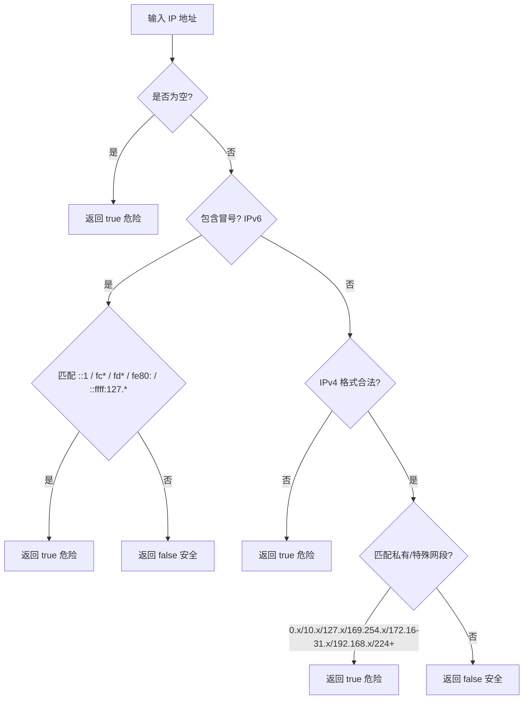
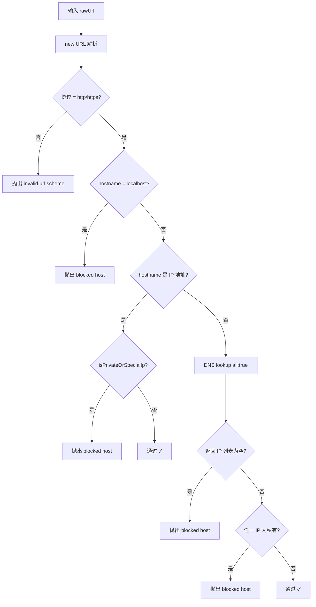

# PD-158.01 ClawFeed — assertSafeFetchUrl 多层 SSRF 防护

> 文档编号：PD-158.01
> 来源：ClawFeed `src/server.mjs`
> GitHub：https://github.com/kevinho/clawfeed
> 问题域：PD-158 SSRF 防护 Server-Side Request Forgery Protection
> 状态：可复用方案

---

## 第 1 章 问题与动机

### 1.1 核心问题

ClawFeed 是一个 AI 新闻聚合工具，核心功能是让用户添加自定义信息源（RSS、Twitter、Reddit、网站等），服务端代为抓取内容。这意味着服务端会根据用户输入的 URL 发起 HTTP 请求——这是 SSRF（Server-Side Request Forgery）攻击的经典入口。

攻击者可以构造恶意 URL，诱使服务端访问内网资源：
- `http://127.0.0.1:6379/` 访问本地 Redis
- `http://169.254.169.254/latest/meta-data/` 读取云厂商元数据（AWS/GCP/Azure）
- `http://10.0.0.1/admin` 访问内网管理面板
- `http://[::1]:8080/` 通过 IPv6 回环绕过 IPv4 检查
- DNS Rebinding：域名首次解析到公网 IP 通过检查，实际请求时解析到内网 IP

ClawFeed 的场景尤其危险：用户可以通过 `/api/sources/resolve` 端点提交任意 URL，服务端会主动 fetch 该 URL 来检测内容类型（RSS/JSON Feed/HTML）。如果没有 SSRF 防护，这等于给攻击者提供了一个开放的内网代理。

### 1.2 ClawFeed 的解法概述

ClawFeed 采用"前置断言 + 递归保护"的 SSRF 防护策略，核心是 `assertSafeFetchUrl` 函数（`src/server.mjs:151-161`）：

1. **协议白名单**：仅允许 `http:` 和 `https:`，拒绝 `file:`、`ftp:`、`gopher:` 等危险协议（`src/server.mjs:153`）
2. **主机名黑名单**：直接拦截 `localhost` 和 `*.localhost`（`src/server.mjs:155`）
3. **IP 直连检查**：如果 hostname 是 IP 地址，立即检查是否为私有/特殊 IP（`src/server.mjs:156`）
4. **DNS 解析后全量检查**：对域名执行 `dns.lookup(host, { all: true })`，检查所有返回的 IP 地址（含 IPv6），任一为私有 IP 则拒绝（`src/server.mjs:157-160`）
5. **重定向链递归保护**：`httpFetch` 跟随重定向时递归调用 `assertSafeFetchUrl`，每次重定向都重新验证目标 URL（`src/server.mjs:215-225`）

### 1.3 设计思想

| 设计原则 | 具体实现 | 理由 | 替代方案 |
|----------|----------|------|----------|
| 前置断言模式 | `assertSafeFetchUrl` 在 `httpFetch` 第一行调用 | 确保所有出站请求都经过检查，不可绕过 | 中间件拦截（更重但更通用） |
| DNS 全量检查 | `lookup(host, { all: true })` 检查所有 A/AAAA 记录 | 防止 DNS 返回多个 IP 中混入私有地址 | 只检查第一个 IP（不安全） |
| 递归重定向保护 | 重定向时递归调用 `httpFetch` → 再次触发 `assertSafeFetchUrl` | 防止通过 302 跳转绕过检查 | 只检查初始 URL（可被绕过） |
| 零依赖实现 | 仅用 Node.js 内置 `dns/promises` + `net.isIP` | 无第三方依赖，减少供应链风险 | 使用 ssrf-req-filter 等库 |
| 宽泛 IP 黑名单 | 覆盖 RFC 1918 + 链路本地 + 组播 + IPv6 ULA/回环 | 防止各种变体绕过 | 仅检查 127.x 和 10.x（不完整） |

---

## 第 2 章 源码实现分析

### 2.1 架构概览

ClawFeed 的 SSRF 防护由三个函数组成，形成一个防护链：

```
┌─────────────────────────────────────────────────────────┐
│                    用户请求                               │
│  POST /api/sources/resolve  { url: "http://evil.com" }  │
└──────────────────────┬──────────────────────────────────┘
                       ▼
┌──────────────────────────────────────────────────────────┐
│  resolveSourceUrl(url)  ← src/server.mjs:253             │
│  ├─ 特殊域名快速路由（x.com/reddit/github/hn）            │
│  └─ 通用路径 → httpFetch(url)                             │
└──────────────────────┬──────────────────────────────────┘
                       ▼
┌──────────────────────────────────────────────────────────┐
│  httpFetch(url, timeout=5000, redirectsLeft=3)           │
│  ← src/server.mjs:215                                    │
│  ├─ ① await assertSafeFetchUrl(url)  ← 前置断言          │
│  ├─ ② http/https.get(url)                                │
│  ├─ ③ 3xx 重定向 → 递归 httpFetch(nextUrl, redirects-1)  │
│  └─ ④ 响应体限制 200KB + 超时 5s                          │
└──────────────────────┬──────────────────────────────────┘
                       ▼
┌──────────────────────────────────────────────────────────┐
│  assertSafeFetchUrl(rawUrl)  ← src/server.mjs:151        │
│  ├─ 协议白名单: http/https only                           │
│  ├─ 主机名黑名单: localhost / *.localhost                  │
│  ├─ IP 直连检查: isIP(host) → isPrivateOrSpecialIp()     │
│  └─ DNS 解析: lookup(host, {all:true}) → 全量 IP 检查     │
└──────────────────────┬──────────────────────────────────┘
                       ▼
┌──────────────────────────────────────────────────────────┐
│  isPrivateOrSpecialIp(ip)  ← src/server.mjs:131          │
│  ├─ IPv6: ::1, fc*, fd*, fe80:*, ::ffff:127.*            │
│  └─ IPv4: 0.x, 10.x, 127.x, 169.254.x, 172.16-31.x,   │
│           192.168.x, 224+(组播/保留)                       │
└──────────────────────────────────────────────────────────┘
```

### 2.2 核心实现

#### isPrivateOrSpecialIp — IP 地址分类器



对应源码 `src/server.mjs:131-149`：

```javascript
function isPrivateOrSpecialIp(ip) {
  if (!ip) return true;
  if (ip.includes(':')) {
    const n = ip.toLowerCase();
    return n === '::1' || n.startsWith('fc') || n.startsWith('fd')
      || n.startsWith('fe80:') || n.startsWith('::ffff:127.');
  }
  const p = ip.split('.').map(Number);
  if (p.length !== 4 || p.some((x) => Number.isNaN(x) || x < 0 || x > 255))
    return true;
  const [a, b] = p;
  return (
    a === 0 ||          // 0.0.0.0/8 — 当前网络
    a === 10 ||         // 10.0.0.0/8 — RFC 1918 A 类私有
    a === 127 ||        // 127.0.0.0/8 — 回环
    (a === 169 && b === 254) ||  // 169.254.0.0/16 — 链路本地
    (a === 172 && b >= 16 && b <= 31) ||  // 172.16.0.0/12 — RFC 1918 B 类私有
    (a === 192 && b === 168) ||  // 192.168.0.0/16 — RFC 1918 C 类私有
    a >= 224            // 224.0.0.0+ — 组播 + 保留
  );
}
```

覆盖的网段清单：

| 网段 | 类型 | 风险 |
|------|------|------|
| `0.0.0.0/8` | 当前网络 | 可能解析到本机 |
| `10.0.0.0/8` | RFC 1918 A 类 | 内网服务 |
| `127.0.0.0/8` | 回环 | 本机服务 |
| `169.254.0.0/16` | 链路本地 | 云元数据端点 |
| `172.16.0.0/12` | RFC 1918 B 类 | 内网服务 |
| `192.168.0.0/16` | RFC 1918 C 类 | 内网服务 |
| `224.0.0.0+` | 组播/保留 | 不应被访问 |
| `::1` | IPv6 回环 | 本机服务 |
| `fc00::/7` (fc*/fd*) | IPv6 ULA | 内网服务 |
| `fe80::/10` | IPv6 链路本地 | 本地链路 |
| `::ffff:127.*` | IPv4-mapped IPv6 | 绕过 IPv4 检查 |

#### assertSafeFetchUrl — 多层断言链



对应源码 `src/server.mjs:151-161`：

```javascript
async function assertSafeFetchUrl(rawUrl) {
  const u = new URL(rawUrl);
  if (!['http:', 'https:'].includes(u.protocol))
    throw new Error('invalid url scheme');
  const host = u.hostname;
  if (host === 'localhost' || host.endsWith('.localhost'))
    throw new Error('blocked host');
  if (isIP(host) && isPrivateOrSpecialIp(host))
    throw new Error('blocked host');
  const resolved = await lookup(host, { all: true });
  if (!resolved.length || resolved.some((r) => isPrivateOrSpecialIp(r.address))) {
    throw new Error('blocked host');
  }
}
```

### 2.3 实现细节

#### 重定向链递归保护

`httpFetch` 在跟随 3xx 重定向时，递归调用自身，每次递归都会重新执行 `assertSafeFetchUrl`。这防止了"首次请求指向公网 → 302 跳转到内网"的攻击模式。

对应源码 `src/server.mjs:215-238`：

```javascript
async function httpFetch(url, timeout = 5000, redirectsLeft = 3) {
  await assertSafeFetchUrl(url);  // ← 每次请求都检查
  return new Promise((resolve, reject) => {
    const mod = url.startsWith('https') ? https : http;
    const r = mod.get(url, { /* headers */ }, async (resp) => {
      if (resp.statusCode >= 300 && resp.statusCode < 400
          && resp.headers.location) {
        if (redirectsLeft <= 0)
          return reject(new Error('too many redirects'));
        const nextUrl = new URL(resp.headers.location, url).toString();
        // 递归调用 → 再次触发 assertSafeFetchUrl
        return resolve(await httpFetch(
          nextUrl,
          Math.max(1000, timeout - 1000),
          redirectsLeft - 1
        ));
      }
      // ... 读取响应体
    });
    const timer = setTimeout(() => {
      r.destroy();
      reject(new Error('timeout'));
    }, timeout);
  });
}
```

关键设计点：
- **重定向次数限制**：`redirectsLeft = 3`，每次递归减 1，防止无限重定向
- **超时递减**：每次重定向超时减少 1s（最低 1s），总超时不会无限累加
- **响应体限制**：`data.length > 200000` 时销毁连接，防止大文件 DoS
- **超时保护**：5s 硬超时，超时后销毁请求

#### 调用链路

SSRF 防护的触发路径：

```
POST /api/sources/resolve
  → resolveSourceUrl(url)           // src/server.mjs:623
    → httpFetch(url)                // src/server.mjs:289
      → assertSafeFetchUrl(url)     // src/server.mjs:216
        → isPrivateOrSpecialIp()    // src/server.mjs:156,158
```

所有用户可控的 URL 抓取都经过 `httpFetch`，而 `httpFetch` 的第一行就是 `assertSafeFetchUrl`，形成不可绕过的防护链。

---

## 第 3 章 迁移指南

### 3.1 迁移清单

#### 阶段 1：核心防护（必须）

- [ ] 复制 `isPrivateOrSpecialIp` 函数，根据部署环境调整网段
- [ ] 复制 `assertSafeFetchUrl` 函数，确保引入 `dns/promises` 和 `net.isIP`
- [ ] 在所有出站 HTTP 请求前调用 `assertSafeFetchUrl`
- [ ] 确保重定向跟随时递归检查每个跳转目标

#### 阶段 2：增强防护（推荐）

- [ ] 添加 DNS Rebinding 防护：缓存 DNS 解析结果，请求时使用缓存的 IP 而非再次解析
- [ ] 添加请求频率限制，防止 SSRF 被用于端口扫描
- [ ] 添加 URL 规范化，处理 `http://0x7f000001`（十六进制 IP）等变体
- [ ] 添加日志记录被拦截的 SSRF 尝试，用于安全审计

#### 阶段 3：生产加固（可选）

- [ ] 使用网络策略（iptables/安全组）作为第二层防护
- [ ] 配置出站代理，所有外部请求通过代理发出
- [ ] 添加域名白名单模式（仅允许已知安全域名）

### 3.2 适配代码模板

以下是可直接复用的 Node.js SSRF 防护模块：

```javascript
// ssrf-guard.mjs — 可独立使用的 SSRF 防护模块
import { lookup } from 'dns/promises';
import { isIP } from 'net';

/**
 * 检查 IP 是否为私有/特殊地址
 * 覆盖: RFC 1918, 回环, 链路本地, 组播, IPv6 ULA/回环
 */
export function isPrivateOrSpecialIp(ip) {
  if (!ip) return true;

  // IPv6 检查
  if (ip.includes(':')) {
    const n = ip.toLowerCase();
    return (
      n === '::1' ||
      n.startsWith('fc') || n.startsWith('fd') ||  // ULA
      n.startsWith('fe80:') ||                       // 链路本地
      n.startsWith('::ffff:127.')                    // IPv4-mapped 回环
    );
  }

  // IPv4 检查
  const p = ip.split('.').map(Number);
  if (p.length !== 4 || p.some(x => Number.isNaN(x) || x < 0 || x > 255))
    return true;  // 格式非法视为危险

  const [a, b] = p;
  return (
    a === 0 ||                          // 当前网络
    a === 10 ||                         // 10.0.0.0/8
    a === 127 ||                        // 回环
    (a === 169 && b === 254) ||         // 链路本地 (AWS 元数据!)
    (a === 172 && b >= 16 && b <= 31) || // 172.16.0.0/12
    (a === 192 && b === 168) ||         // 192.168.0.0/16
    a >= 224                            // 组播 + 保留
  );
}

/**
 * 断言 URL 可安全抓取（非 SSRF 目标）
 * 抛出 Error 如果 URL 不安全
 */
export async function assertSafeFetchUrl(rawUrl) {
  const u = new URL(rawUrl);

  // 1. 协议白名单
  if (!['http:', 'https:'].includes(u.protocol)) {
    throw new Error(`blocked: invalid scheme ${u.protocol}`);
  }

  // 2. 主机名黑名单
  const host = u.hostname;
  if (host === 'localhost' || host.endsWith('.localhost')) {
    throw new Error('blocked: localhost');
  }

  // 3. IP 直连检查
  if (isIP(host) && isPrivateOrSpecialIp(host)) {
    throw new Error(`blocked: private IP ${host}`);
  }

  // 4. DNS 解析后全量检查
  const resolved = await lookup(host, { all: true });
  if (!resolved.length) {
    throw new Error(`blocked: DNS resolution failed for ${host}`);
  }
  const blocked = resolved.find(r => isPrivateOrSpecialIp(r.address));
  if (blocked) {
    throw new Error(`blocked: ${host} resolves to private IP ${blocked.address}`);
  }
}

/**
 * 安全的 HTTP 抓取，内置 SSRF 防护 + 重定向保护
 */
export async function safeFetch(url, {
  timeout = 5000,
  maxRedirects = 3,
  maxBodyBytes = 200_000
} = {}) {
  await assertSafeFetchUrl(url);

  const controller = new AbortController();
  const timer = setTimeout(() => controller.abort(), timeout);

  try {
    const resp = await fetch(url, {
      signal: controller.signal,
      redirect: 'manual',  // 手动处理重定向以逐跳检查
      headers: { 'User-Agent': 'SafeFetcher/1.0' }
    });

    // 处理重定向
    if (resp.status >= 300 && resp.status < 400 && resp.headers.get('location')) {
      if (maxRedirects <= 0) throw new Error('too many redirects');
      const nextUrl = new URL(resp.headers.get('location'), url).toString();
      return safeFetch(nextUrl, {
        timeout: Math.max(1000, timeout - 1000),
        maxRedirects: maxRedirects - 1,
        maxBodyBytes
      });
    }

    const body = await resp.text();
    if (body.length > maxBodyBytes) {
      return { body: body.slice(0, maxBodyBytes), truncated: true, contentType: resp.headers.get('content-type') || '' };
    }
    return { body, truncated: false, contentType: resp.headers.get('content-type') || '' };
  } finally {
    clearTimeout(timer);
  }
}
```

### 3.3 适用场景

| 场景 | 适用度 | 说明 |
|------|--------|------|
| RSS/Feed 聚合服务 | ⭐⭐⭐ | 完美匹配，ClawFeed 原始场景 |
| Webhook 回调验证 | ⭐⭐⭐ | 验证用户提供的 callback URL |
| URL 预览/OG 抓取 | ⭐⭐⭐ | 社交平台链接预览 |
| 代理/转发服务 | ⭐⭐ | 需额外添加域名白名单 |
| 爬虫/搜索引擎 | ⭐⭐ | 需考虑性能，DNS 查询有延迟 |
| 内网微服务间调用 | ⭐ | 不适用，内网调用需要访问私有 IP |

---

## 第 4 章 测试用例

```javascript
import { describe, it, expect } from 'vitest';
// 假设已将 isPrivateOrSpecialIp 和 assertSafeFetchUrl 导出

describe('isPrivateOrSpecialIp', () => {
  // 应被拦截的 IP
  it.each([
    ['127.0.0.1', 'IPv4 回环'],
    ['127.0.0.2', 'IPv4 回环段'],
    ['10.0.0.1', 'RFC 1918 A 类'],
    ['10.255.255.255', 'RFC 1918 A 类边界'],
    ['172.16.0.1', 'RFC 1918 B 类起始'],
    ['172.31.255.255', 'RFC 1918 B 类结束'],
    ['192.168.0.1', 'RFC 1918 C 类'],
    ['192.168.255.255', 'RFC 1918 C 类边界'],
    ['169.254.169.254', 'AWS 元数据端点'],
    ['0.0.0.0', '当前网络'],
    ['224.0.0.1', '组播'],
    ['255.255.255.255', '广播'],
    ['::1', 'IPv6 回环'],
    ['fc00::1', 'IPv6 ULA fc'],
    ['fd12:3456::1', 'IPv6 ULA fd'],
    ['fe80::1', 'IPv6 链路本地'],
    ['::ffff:127.0.0.1', 'IPv4-mapped 回环'],
  ])('should block %s (%s)', (ip) => {
    expect(isPrivateOrSpecialIp(ip)).toBe(true);
  });

  // 应放行的 IP
  it.each([
    ['8.8.8.8', 'Google DNS'],
    ['1.1.1.1', 'Cloudflare DNS'],
    ['203.0.113.1', '文档用 IP'],
    ['172.15.255.255', 'RFC 1918 B 类之前'],
    ['172.32.0.0', 'RFC 1918 B 类之后'],
    ['192.167.0.1', '非 192.168 段'],
  ])('should allow %s (%s)', (ip) => {
    expect(isPrivateOrSpecialIp(ip)).toBe(false);
  });

  // 边界情况
  it('should block null/undefined/empty', () => {
    expect(isPrivateOrSpecialIp(null)).toBe(true);
    expect(isPrivateOrSpecialIp(undefined)).toBe(true);
    expect(isPrivateOrSpecialIp('')).toBe(true);
  });

  it('should block malformed IPv4', () => {
    expect(isPrivateOrSpecialIp('999.999.999.999')).toBe(true);
    expect(isPrivateOrSpecialIp('1.2.3')).toBe(true);
    expect(isPrivateOrSpecialIp('not-an-ip')).toBe(true);
  });
});

describe('assertSafeFetchUrl', () => {
  it('should reject non-http protocols', async () => {
    await expect(assertSafeFetchUrl('file:///etc/passwd'))
      .rejects.toThrow('invalid url scheme');
    await expect(assertSafeFetchUrl('ftp://evil.com/file'))
      .rejects.toThrow('invalid url scheme');
    await expect(assertSafeFetchUrl('gopher://evil.com'))
      .rejects.toThrow('invalid url scheme');
  });

  it('should reject localhost variants', async () => {
    await expect(assertSafeFetchUrl('http://localhost/'))
      .rejects.toThrow('blocked host');
    await expect(assertSafeFetchUrl('http://sub.localhost/'))
      .rejects.toThrow('blocked host');
  });

  it('should reject direct private IPs', async () => {
    await expect(assertSafeFetchUrl('http://127.0.0.1/'))
      .rejects.toThrow('blocked host');
    await expect(assertSafeFetchUrl('http://10.0.0.1/'))
      .rejects.toThrow('blocked host');
    await expect(assertSafeFetchUrl('http://169.254.169.254/'))
      .rejects.toThrow('blocked host');
  });

  it('should allow public URLs', async () => {
    // 注意：此测试需要网络访问
    await expect(assertSafeFetchUrl('https://example.com'))
      .resolves.toBeUndefined();
  });
});
```

---

## 第 5 章 跨域关联

| 关联域 | 关系类型 | 说明 |
|--------|----------|------|
| PD-03 容错与重试 | 协同 | `httpFetch` 的超时保护和重定向限制属于容错设计，SSRF 防护与超时/重试策略需协调 |
| PD-04 工具系统 | 协同 | 如果工具系统允许 Agent 发起 HTTP 请求（如 MCP 工具），需在工具层集成 SSRF 防护 |
| PD-05 沙箱隔离 | 协同 | SSRF 防护是网络层隔离的一部分，与进程/文件系统沙箱互补 |
| PD-08 搜索与检索 | 依赖 | 搜索系统抓取外部内容时必须经过 SSRF 检查，ClawFeed 的 `resolveSourceUrl` 就是搜索入口 |
| PD-11 可观测性 | 协同 | 被拦截的 SSRF 尝试应记录到审计日志，当前 ClawFeed 未实现此功能 |

---

## 第 6 章 来源文件索引

| 文件 | 行范围 | 关键实现 |
|------|--------|----------|
| `src/server.mjs` | L1-L9 | 模块导入：`dns/promises.lookup`、`net.isIP`、`crypto` |
| `src/server.mjs` | L131-L149 | `isPrivateOrSpecialIp` — IPv4/IPv6 私有地址分类器 |
| `src/server.mjs` | L151-L161 | `assertSafeFetchUrl` — 多层 SSRF 断言链 |
| `src/server.mjs` | L215-L238 | `httpFetch` — 安全 HTTP 抓取（含递归重定向保护） |
| `src/server.mjs` | L253-L322 | `resolveSourceUrl` — URL 类型检测（SSRF 防护的调用入口） |
| `src/server.mjs` | L616-L628 | `POST /api/sources/resolve` — 用户触发的 URL 解析端点 |
| `docs/prd/source-personalization.md` | L179-L183 | PRD 中的安全需求定义 |

---

## 第 7 章 横向对比维度

> **重要：** 本章用于自动填充 Butcher Wiki 的横向对比表。

```json comparison_data
{
  "project": "ClawFeed",
  "dimensions": {
    "防护架构": "前置断言函数 assertSafeFetchUrl，在 httpFetch 第一行强制调用",
    "IP 检查范围": "IPv4 全 RFC 1918 + 链路本地 + 组播 + IPv6 ULA/回环/mapped",
    "DNS 解析策略": "lookup(host, {all:true}) 全量检查所有 A/AAAA 记录",
    "重定向保护": "递归调用 httpFetch，每跳重新执行 assertSafeFetchUrl，限 3 次",
    "实现依赖": "零第三方依赖，仅用 Node.js 内置 dns/promises + net.isIP",
    "响应限制": "200KB 响应体上限 + 5s 超时 + 递减超时策略"
  }
}
```

### 域元数据补充

```json domain_metadata
{
  "solution_summary": "ClawFeed 用 assertSafeFetchUrl 前置断言 + dns.lookup(all:true) 全量 IP 检查 + 递归重定向逐跳验证实现零依赖 SSRF 防护",
  "description": "用户可控 URL 抓取场景下的纵深防御策略",
  "sub_problems": [
    "IPv4-mapped IPv6 地址绕过检测",
    "响应体大小限制防止资源耗尽",
    "递减超时策略防止重定向链累积延迟"
  ],
  "best_practices": [
    "前置断言模式确保所有出站请求不可绕过检查",
    "对格式非法的 IP 地址默认视为危险（fail-closed）",
    "零第三方依赖减少供应链攻击面"
  ]
}
```
