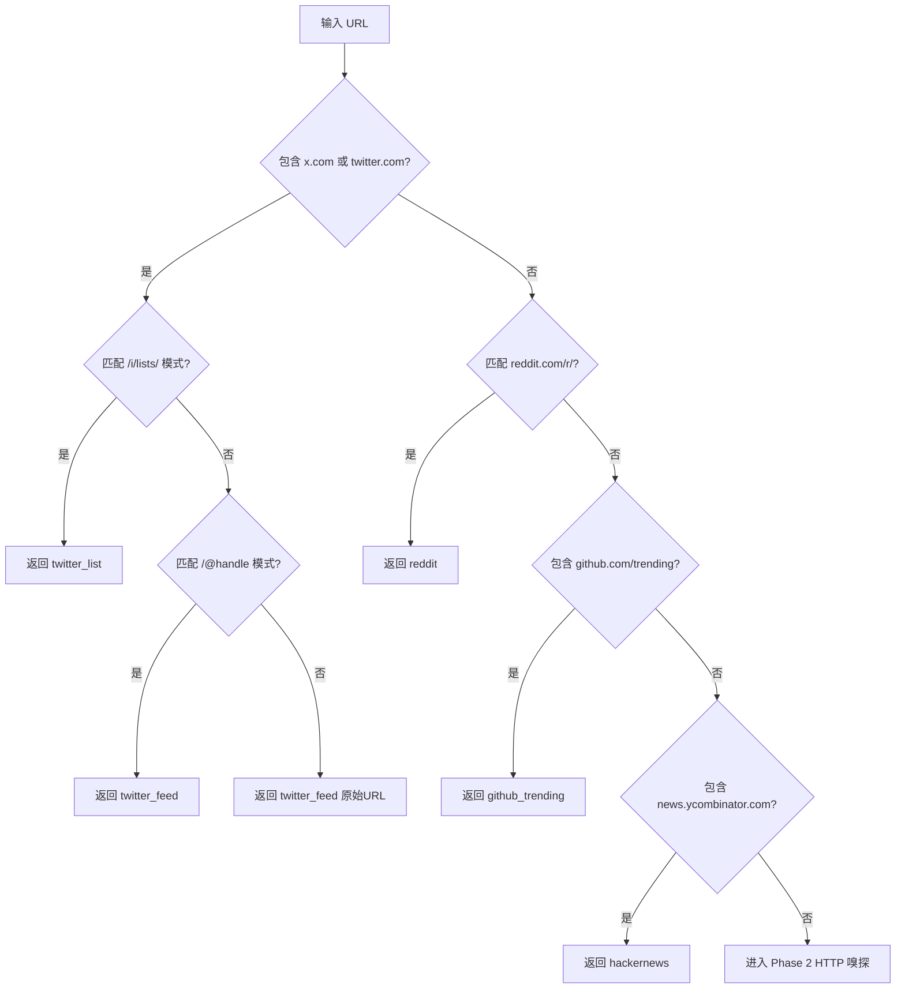
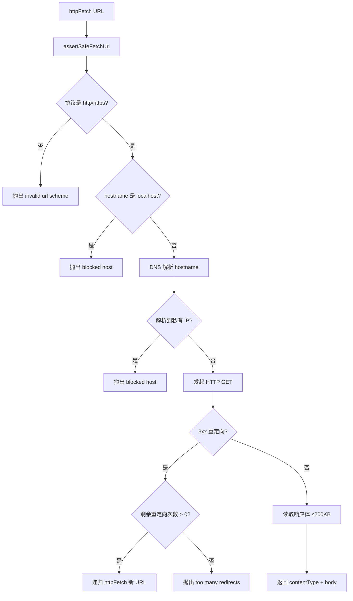
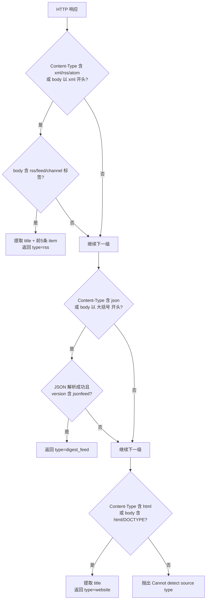

# PD-159.01 ClawFeed — URL 模式匹配与 HTTP 内容嗅探源类型自动检测

> 文档编号：PD-159.01
> 来源：ClawFeed `src/server.mjs`
> GitHub：https://github.com/kevinho/clawfeed
> 问题域：PD-159 内容源自动检测 Content Source Auto-Detection
> 状态：可复用方案

---

## 第 1 章 问题与动机（≥ 30 行）

### 1.1 核心问题

信息聚合类产品需要用户添加各种信息源（RSS、Twitter、Reddit、HN 等），但用户通常只有一个 URL，不知道也不关心底层是什么协议。如果要求用户手动选择源类型、填写配置参数，会极大增加使用门槛。

核心挑战：
- 同一个 URL 可能是 RSS feed、Atom feed、JSON Feed、普通网页，甚至是 Twitter handle 页面
- 已知平台（Twitter、Reddit、HN、GitHub Trending）有固定 URL 模式，可以直接识别
- 未知 URL 需要实际发起 HTTP 请求，通过 Content-Type 和响应体内容来判断
- 检测过程需要安全（防 SSRF）、快速（超时控制）、准确（多层降级）

### 1.2 ClawFeed 的解法概述

ClawFeed 在 `src/server.mjs:253-322` 实现了 `resolveSourceUrl` 函数，采用两阶段检测策略：

1. **URL 正则快速匹配**（`server.mjs:256-286`）— 对 Twitter/X、Reddit、GitHub Trending、Hacker News 四大已知平台，用 URL 正则直接返回结构化结果，零网络开销
2. **HTTP 内容嗅探降级链**（`server.mjs:289-321`）— 对未知 URL，发起 HTTP GET 请求，按 Content-Type + 响应体特征依次尝试 RSS/Atom → JSON Feed → HTML → 报错
3. **SSRF 防护前置**（`server.mjs:151-161`）— 所有 HTTP 请求前通过 `assertSafeFetchUrl` 做 DNS 解析 + 私有 IP 检查
4. **预览数据返回**（`server.mjs:240-251`）— RSS 检测成功时提取前 5 条 item 作为预览，帮助用户确认源是否正确
5. **统一返回结构** — 所有检测结果返回 `{ name, type, config, icon, preview? }` 统一格式

### 1.3 设计思想

| 设计原则 | 具体实现 | 理由 | 替代方案 |
|----------|----------|------|----------|
| 快路径优先 | URL 正则匹配在前，HTTP 嗅探在后 | 已知平台无需网络请求，响应 <1ms | 全部走 HTTP 嗅探（慢且浪费） |
| 降级链模式 | XML → JSON → HTML → Error 逐级尝试 | 一个 URL 只可能是一种类型，按概率排序 | 并行检测所有格式（复杂且无必要） |
| 安全前置 | assertSafeFetchUrl 在 httpFetch 内部调用 | 防止 SSRF 攻击内网 | 仅靠 URL scheme 检查（不够） |
| 预览辅助确认 | RSS 检测返回前 5 条 item | 用户可视化确认源是否正确 | 只返回类型不返回预览（体验差） |
| 结构化输出 | 统一 { name, type, config, icon } | 下游 createSource 直接消费 | 返回原始数据让前端解析（耦合） |

---

## 第 2 章 源码实现分析（≥ 60 行，核心章节）

### 2.1 架构概览

ClawFeed 的源检测系统由三个核心函数组成，形成一条从 URL 输入到结构化源对象输出的管道：

```
┌──────────────────────────────────────────────────────────────────┐
│                    POST /api/sources/resolve                     │
│                      (server.mjs:616-628)                        │
└──────────────────┬───────────────────────────────────────────────┘
                   │ url
                   ▼
┌──────────────────────────────────────────────────────────────────┐
│              resolveSourceUrl(url)  (L253-322)                   │
│                                                                  │
│  Phase 1: URL Pattern Match (L256-286)                          │
│  ┌─────────┐  ┌─────────┐  ┌──────────┐  ┌─────────┐          │
│  │Twitter/X│  │ Reddit  │  │GH Trend  │  │   HN    │          │
│  │ L257-268│  │ L270-274│  │ L277-281 │  │ L284-286│          │
│  └────┬────┘  └────┬────┘  └────┬─────┘  └────┬────┘          │
│       └──────┬─────┴──────┬─────┘              │               │
│              ▼            ▼                     ▼               │
│         直接返回 { name, type, config, icon }                    │
│                                                                  │
│  Phase 2: HTTP Content Sniff (L289-321)                         │
│  ┌──────────────┐                                               │
│  │ httpFetch(url)│──→ assertSafeFetchUrl (SSRF 防护)            │
│  │   (L215-238) │                                               │
│  └──────┬───────┘                                               │
│         │ { contentType, body }                                  │
│         ▼                                                        │
│  ┌──────────┐  ┌───────────┐  ┌──────────┐  ┌───────┐         │
│  │ RSS/Atom │→│ JSON Feed │→│  HTML    │→│ Error │         │
│  │ L294-301 │  │ L304-312  │  │ L315-319│  │ L321  │         │
│  └──────────┘  └───────────┘  └──────────┘  └───────┘         │
└──────────────────────────────────────────────────────────────────┘
```

### 2.2 核心实现

#### 2.2.1 URL 正则快速匹配



对应源码 `src/server.mjs:253-286`：

```javascript
async function resolveSourceUrl(url) {
  const u = url.toLowerCase();

  // Twitter/X — 区分 list 和 handle 两种子类型
  if (u.includes('x.com') || u.includes('twitter.com')) {
    const listMatch = url.match(/\/i\/lists\/(\d+)/);
    if (listMatch) {
      return { name: `X List ${listMatch[1]}`, type: 'twitter_list',
               config: { list_url: url }, icon: '🐦' };
    }
    const handleMatch = url.match(/(?:x\.com|twitter\.com)\/(@?[A-Za-z0-9_]+)/);
    if (handleMatch && !['i','search','explore','home','notifications',
        'messages','settings'].includes(handleMatch[1].toLowerCase())) {
      const handle = handleMatch[1].replace(/^@/, '');
      return { name: `@${handle}`, type: 'twitter_feed',
               config: { handle: `@${handle}` }, icon: '🐦' };
    }
    return { name: 'X Feed', type: 'twitter_feed',
             config: { handle: url }, icon: '🐦' };
  }

  // Reddit — 提取 subreddit 名称，预设 hot 排序和 20 条限制
  const redditMatch = url.match(/reddit\.com\/r\/([A-Za-z0-9_]+)/);
  if (redditMatch) {
    return { name: `r/${redditMatch[1]}`, type: 'reddit',
             config: { subreddit: redditMatch[1], sort: 'hot', limit: 20 },
             icon: '👽' };
  }

  // GitHub Trending — 可选语言过滤
  if (u.includes('github.com/trending')) {
    const langMatch = url.match(/\/trending\/([a-z0-9+#.-]+)/i);
    const lang = langMatch ? langMatch[1] : '';
    return { name: `GitHub Trending${lang ? ' - ' + lang : ''}`,
             type: 'github_trending',
             config: { language: lang || 'all', since: 'daily' }, icon: '⭐' };
  }

  // Hacker News — 固定配置
  if (u.includes('news.ycombinator.com')) {
    return { name: 'Hacker News', type: 'hackernews',
             config: { filter: 'top', min_score: 100 }, icon: '🔶' };
  }
  // ... 进入 Phase 2
}
```

关键设计点：
- Twitter handle 匹配排除了系统路径（`i`, `search`, `explore` 等），避免误判（`server.mjs:263`）
- Reddit 预设了 `sort: 'hot'` 和 `limit: 20` 的合理默认值（`server.mjs:273`）
- GitHub Trending 支持可选的语言过滤（`server.mjs:278-280`）

#### 2.2.2 HTTP 内容嗅探与 SSRF 防护



对应源码 `src/server.mjs:151-238`：

```javascript
// SSRF 防护：DNS 解析后检查所有 IP 是否为私有地址
async function assertSafeFetchUrl(rawUrl) {
  const u = new URL(rawUrl);
  if (!['http:', 'https:'].includes(u.protocol)) throw new Error('invalid url scheme');
  const host = u.hostname;
  if (host === 'localhost' || host.endsWith('.localhost')) throw new Error('blocked host');
  if (isIP(host) && isPrivateOrSpecialIp(host)) throw new Error('blocked host');
  const resolved = await lookup(host, { all: true });
  if (!resolved.length || resolved.some((r) => isPrivateOrSpecialIp(r.address))) {
    throw new Error('blocked host');
  }
}

// HTTP 请求：支持重定向跟踪、超时控制、响应体大小限制
async function httpFetch(url, timeout = 5000, redirectsLeft = 3) {
  await assertSafeFetchUrl(url);
  return new Promise((resolve, reject) => {
    const mod = url.startsWith('https') ? https : http;
    const r = mod.get(url, {
      headers: { 'User-Agent': 'AI-Digest/1.0',
                 'Accept': 'text/html,application/xhtml+xml,application/xml,application/json,*/*' }
    }, async (resp) => {
      // 重定向跟踪（最多 3 次）
      if (resp.statusCode >= 300 && resp.statusCode < 400 && resp.headers.location) {
        clearTimeout(timer);
        if (redirectsLeft <= 0) return reject(new Error('too many redirects'));
        const nextUrl = new URL(resp.headers.location, url).toString();
        return resolve(await httpFetch(nextUrl, Math.max(1000, timeout - 1000), redirectsLeft - 1));
      }
      let data = '';
      // 响应体大小限制 200KB，防止内存溢出
      resp.on('data', c => { data += c; if (data.length > 200000) resp.destroy(); });
      resp.on('end', () => { clearTimeout(timer);
        resolve({ contentType: resp.headers['content-type'] || '', body: data }); });
    });
    const timer = setTimeout(() => { r.destroy(); reject(new Error('timeout')); }, timeout);
    r.on('error', (e) => { clearTimeout(timer); reject(e); });
  });
}
```

#### 2.2.3 内容类型降级链



对应源码 `src/server.mjs:289-322`：

```javascript
// Phase 2: HTTP 内容嗅探
const resp = await httpFetch(url);
const ct = resp.contentType.toLowerCase();
const body = resp.body;

// RSS/Atom 检测：Content-Type + 响应体双重判断
if (ct.includes('xml') || ct.includes('rss') || ct.includes('atom')
    || body.trimStart().startsWith('<?xml') || body.includes('<rss')
    || body.includes('<feed')) {
  if (body.includes('<rss') || body.includes('<feed') || body.includes('<channel')) {
    const titleMatch = body.match(/<title[^>]*>(?:<!\[CDATA\[)?(.*?)(?:\]\]>)?<\/title>/);
    const name = titleMatch ? titleMatch[1].trim() : new URL(url).hostname;
    const preview = extractRssPreview(body);
    return { name, type: 'rss', config: { url }, icon: '📡', preview };
  }
}

// JSON Feed 检测：Content-Type + JSON 解析 + version 字段
if (ct.includes('json') || body.trimStart().startsWith('{')) {
  try {
    const j = JSON.parse(body);
    if (j.version && j.version.includes('jsonfeed')) {
      const preview = (j.items || []).slice(0, 5).map(i =>
        ({ title: i.title || '(untitled)', url: i.url }));
      return { name: j.title || new URL(url).hostname,
               type: 'digest_feed', config: { url }, icon: '📰', preview };
    }
  } catch {}
}

// HTML 降级：最后兜底
if (ct.includes('html') || body.includes('<html') || body.includes('<!DOCTYPE')) {
  const titleMatch = body.match(/<title[^>]*>(.*?)<\/title>/is);
  const name = titleMatch ? titleMatch[1].trim().replace(/\s+/g, ' ').slice(0, 100)
               : new URL(url).hostname;
  return { name, type: 'website', config: { url }, icon: '🌐' };
}

throw new Error('Cannot detect source type');
```

### 2.3 实现细节

**RSS 预览提取**（`server.mjs:240-251`）：

`extractRssPreview` 用正则同时匹配 RSS 的 `<item>` 和 Atom 的 `<entry>` 标签，提取前 5 条的 title 和 link。支持 CDATA 包裹的 title 和两种 link 格式（属性式 `href=` 和内容式 `<link>text</link>`）。

**API 端点集成**（`server.mjs:616-628`）：

`POST /api/sources/resolve` 接收 `{ url }` 请求体，调用 `resolveSourceUrl`，成功返回检测结果，失败返回 422。前端拿到结果后可直接调用 `POST /api/sources` 创建源。

**数据流**：

```
用户输入 URL → POST /api/sources/resolve
  → resolveSourceUrl(url)
    → Phase 1: URL 正则 → 命中则直接返回
    → Phase 2: httpFetch → assertSafeFetchUrl → HTTP GET
      → Content-Type + body 降级链
  → 返回 { name, type, config, icon, preview? }
  → 前端展示预览 → 用户确认 → POST /api/sources 创建
```

---

## 第 3 章 迁移指南（≥ 40 行）

### 3.1 迁移清单

**阶段 1：核心检测函数**
- [ ] 实现 `resolveSourceUrl(url)` 主函数，包含 URL 正则匹配和 HTTP 嗅探两阶段
- [ ] 定义统一返回结构 `{ name, type, config, icon, preview? }`
- [ ] 为每个已知平台编写 URL 正则（根据你的业务需求增减平台）

**阶段 2：安全层**
- [ ] 实现 SSRF 防护：DNS 解析 + 私有 IP 检查
- [ ] 实现 HTTP 请求封装：超时控制、重定向跟踪、响应体大小限制
- [ ] 添加 User-Agent 和 Accept 头（部分站点会拒绝无 UA 的请求）

**阶段 3：内容解析**
- [ ] 实现 RSS/Atom XML 解析和预览提取
- [ ] 实现 JSON Feed 检测（检查 `version` 字段包含 `jsonfeed`）
- [ ] 实现 HTML 降级（提取 `<title>` 作为源名称）

**阶段 4：API 集成**
- [ ] 暴露 HTTP 端点（如 `POST /api/sources/resolve`）
- [ ] 前端集成：输入框 → 调用检测 → 展示预览 → 确认创建

### 3.2 适配代码模板

以下 TypeScript 模板可直接复用，覆盖核心检测逻辑：

```typescript
// source-resolver.ts — 可直接复用的源检测模块

interface SourceResult {
  name: string;
  type: string;
  config: Record<string, unknown>;
  icon: string;
  preview?: Array<{ title: string; url: string }>;
}

// 已知平台正则表（可按需扩展）
const PLATFORM_MATCHERS: Array<{
  test: (url: string) => boolean;
  resolve: (url: string) => SourceResult;
}> = [
  {
    test: (u) => u.includes('x.com') || u.includes('twitter.com'),
    resolve: (url) => {
      const listMatch = url.match(/\/i\/lists\/(\d+)/);
      if (listMatch) return { name: `X List ${listMatch[1]}`, type: 'twitter_list', config: { list_url: url }, icon: '🐦' };
      const handleMatch = url.match(/(?:x\.com|twitter\.com)\/(@?[A-Za-z0-9_]+)/);
      const reserved = new Set(['i','search','explore','home','notifications','messages','settings']);
      if (handleMatch && !reserved.has(handleMatch[1].toLowerCase())) {
        const handle = handleMatch[1].replace(/^@/, '');
        return { name: `@${handle}`, type: 'twitter_feed', config: { handle: `@${handle}` }, icon: '🐦' };
      }
      return { name: 'X Feed', type: 'twitter_feed', config: { handle: url }, icon: '🐦' };
    }
  },
  {
    test: (u) => /reddit\.com\/r\//.test(u),
    resolve: (url) => {
      const m = url.match(/reddit\.com\/r\/([A-Za-z0-9_]+)/);
      return { name: `r/${m![1]}`, type: 'reddit', config: { subreddit: m![1], sort: 'hot', limit: 20 }, icon: '👽' };
    }
  },
  {
    test: (u) => u.includes('github.com/trending'),
    resolve: (url) => {
      const m = url.match(/\/trending\/([a-z0-9+#.-]+)/i);
      const lang = m ? m[1] : '';
      return { name: `GitHub Trending${lang ? ' - ' + lang : ''}`, type: 'github_trending', config: { language: lang || 'all', since: 'daily' }, icon: '⭐' };
    }
  },
  {
    test: (u) => u.includes('news.ycombinator.com'),
    resolve: () => ({ name: 'Hacker News', type: 'hackernews', config: { filter: 'top', min_score: 100 }, icon: '🔶' })
  }
];

// 内容嗅探降级链
const CONTENT_SNIFFERS: Array<{
  test: (ct: string, body: string) => boolean;
  parse: (body: string, url: string) => SourceResult | null;
}> = [
  {
    test: (ct, body) => ct.includes('xml') || ct.includes('rss') || ct.includes('atom')
      || body.trimStart().startsWith('<?xml') || body.includes('<rss') || body.includes('<feed'),
    parse: (body, url) => {
      if (!body.includes('<rss') && !body.includes('<feed') && !body.includes('<channel')) return null;
      const titleMatch = body.match(/<title[^>]*>(?:<!\[CDATA\[)?(.*?)(?:\]\]>)?<\/title>/);
      const name = titleMatch ? titleMatch[1].trim() : new URL(url).hostname;
      return { name, type: 'rss', config: { url }, icon: '📡', preview: extractRssPreview(body) };
    }
  },
  {
    test: (ct, body) => ct.includes('json') || body.trimStart().startsWith('{'),
    parse: (body, url) => {
      try {
        const j = JSON.parse(body);
        if (j.version?.includes('jsonfeed')) {
          const preview = (j.items || []).slice(0, 5).map((i: any) => ({ title: i.title || '(untitled)', url: i.url }));
          return { name: j.title || new URL(url).hostname, type: 'json_feed', config: { url }, icon: '📰', preview };
        }
      } catch {}
      return null;
    }
  },
  {
    test: (ct, body) => ct.includes('html') || body.includes('<html') || body.includes('<!DOCTYPE'),
    parse: (body, url) => {
      const m = body.match(/<title[^>]*>(.*?)<\/title>/is);
      const name = m ? m[1].trim().replace(/\s+/g, ' ').slice(0, 100) : new URL(url).hostname;
      return { name, type: 'website', config: { url }, icon: '🌐' };
    }
  }
];

function extractRssPreview(xml: string): Array<{ title: string; url: string }> {
  const items: Array<{ title: string; url: string }> = [];
  const re = /<item[^>]*>([\s\S]*?)<\/item>|<entry[^>]*>([\s\S]*?)<\/entry>/gi;
  let m;
  while ((m = re.exec(xml)) && items.length < 5) {
    const block = m[1] || m[2];
    const t = block.match(/<title[^>]*>(?:<!\[CDATA\[)?(.*?)(?:\]\]>)?<\/title>/i);
    const l = block.match(/<link[^>]*href=["']([^"']+)["']/i) || block.match(/<link[^>]*>(.*?)<\/link>/i);
    items.push({ title: t ? t[1].trim() : '(untitled)', url: l ? l[1].trim() : '' });
  }
  return items;
}

export async function resolveSourceUrl(url: string): Promise<SourceResult> {
  const lower = url.toLowerCase();

  // Phase 1: URL 正则快速匹配
  for (const matcher of PLATFORM_MATCHERS) {
    if (matcher.test(lower)) return matcher.resolve(url);
  }

  // Phase 2: HTTP 内容嗅探
  const resp = await safeFetch(url); // 你的 SSRF 安全 fetch 实现
  const ct = (resp.headers.get('content-type') || '').toLowerCase();
  const body = await resp.text();

  for (const sniffer of CONTENT_SNIFFERS) {
    if (sniffer.test(ct, body)) {
      const result = sniffer.parse(body, url);
      if (result) return result;
    }
  }

  throw new Error('Cannot detect source type');
}
```

### 3.3 适用场景

| 场景 | 适用度 | 说明 |
|------|--------|------|
| RSS 阅读器 / 信息聚合 | ⭐⭐⭐ | 核心场景，直接复用 |
| 监控系统（网站变更检测） | ⭐⭐⭐ | URL 检测 + 类型识别是基础能力 |
| 爬虫框架（自动识别页面类型） | ⭐⭐ | 需要扩展更多内容类型 |
| 社交媒体聚合 | ⭐⭐⭐ | 已覆盖 Twitter/Reddit/HN/GitHub |
| 通用 URL 元数据提取 | ⭐⭐ | 需要补充 OpenGraph/meta 解析 |

---

## 第 4 章 测试用例（≥ 20 行）

```python
import pytest
from unittest.mock import AsyncMock, patch, MagicMock

class TestResolveSourceUrl:
    """基于 ClawFeed resolveSourceUrl 的测试用例"""

    # ── Phase 1: URL 正则匹配 ──

    async def test_twitter_handle(self):
        result = await resolve_source_url("https://x.com/karpathy")
        assert result["type"] == "twitter_feed"
        assert result["config"]["handle"] == "@karpathy"
        assert result["icon"] == "🐦"

    async def test_twitter_list(self):
        result = await resolve_source_url("https://x.com/i/lists/123456")
        assert result["type"] == "twitter_list"
        assert result["config"]["list_url"] == "https://x.com/i/lists/123456"

    async def test_twitter_reserved_path_not_matched(self):
        """系统路径 /search /explore 等不应被识别为 handle"""
        result = await resolve_source_url("https://x.com/search")
        assert result["type"] == "twitter_feed"
        assert result["config"]["handle"] == "https://x.com/search"  # 降级为原始 URL

    async def test_reddit_subreddit(self):
        result = await resolve_source_url("https://reddit.com/r/MachineLearning")
        assert result["type"] == "reddit"
        assert result["config"]["subreddit"] == "MachineLearning"
        assert result["config"]["sort"] == "hot"

    async def test_github_trending_with_language(self):
        result = await resolve_source_url("https://github.com/trending/python")
        assert result["type"] == "github_trending"
        assert result["config"]["language"] == "python"

    async def test_github_trending_no_language(self):
        result = await resolve_source_url("https://github.com/trending")
        assert result["type"] == "github_trending"
        assert result["config"]["language"] == "all"

    async def test_hackernews(self):
        result = await resolve_source_url("https://news.ycombinator.com")
        assert result["type"] == "hackernews"
        assert result["config"]["min_score"] == 100

    # ── Phase 2: HTTP 内容嗅探 ──

    @patch("source_resolver.safe_fetch")
    async def test_rss_detection(self, mock_fetch):
        mock_fetch.return_value = mock_response(
            content_type="application/rss+xml",
            body='<?xml version="1.0"?><rss><channel><title>My Blog</title><item><title>Post 1</title><link>https://example.com/1</link></item></channel></rss>'
        )
        result = await resolve_source_url("https://example.com/feed")
        assert result["type"] == "rss"
        assert result["name"] == "My Blog"
        assert len(result["preview"]) == 1

    @patch("source_resolver.safe_fetch")
    async def test_json_feed_detection(self, mock_fetch):
        mock_fetch.return_value = mock_response(
            content_type="application/json",
            body='{"version":"https://jsonfeed.org/version/1.1","title":"My Feed","items":[{"title":"Item 1","url":"https://example.com/1"}]}'
        )
        result = await resolve_source_url("https://example.com/feed.json")
        assert result["type"] == "digest_feed"
        assert result["name"] == "My Feed"

    @patch("source_resolver.safe_fetch")
    async def test_html_fallback(self, mock_fetch):
        mock_fetch.return_value = mock_response(
            content_type="text/html",
            body='<!DOCTYPE html><html><head><title>Example Site</title></head></html>'
        )
        result = await resolve_source_url("https://example.com")
        assert result["type"] == "website"
        assert result["name"] == "Example Site"

    @patch("source_resolver.safe_fetch")
    async def test_unknown_content_raises(self, mock_fetch):
        mock_fetch.return_value = mock_response(
            content_type="application/octet-stream",
            body=b'\x00\x01\x02'
        )
        with pytest.raises(Exception, match="Cannot detect"):
            await resolve_source_url("https://example.com/binary")

    # ── SSRF 防护 ──

    async def test_ssrf_localhost_blocked(self):
        with pytest.raises(Exception, match="blocked"):
            await safe_fetch("http://localhost:8080/admin")

    async def test_ssrf_private_ip_blocked(self):
        with pytest.raises(Exception, match="blocked"):
            await safe_fetch("http://192.168.1.1/internal")

    async def test_ssrf_valid_url_allowed(self):
        """公网 URL 应正常通过"""
        # 需要 mock DNS 解析返回公网 IP
        pass


def mock_response(content_type: str, body: str):
    resp = MagicMock()
    resp.headers = {"content-type": content_type}
    resp.text = AsyncMock(return_value=body)
    return resp
```

---

## 第 5 章 跨域关联

| 关联域 | 关系类型 | 说明 |
|--------|----------|------|
| PD-158 SSRF 防护 | 强依赖 | `resolveSourceUrl` 的 HTTP 嗅探阶段依赖 `assertSafeFetchUrl` 做 SSRF 防护，两者在同一文件中实现。没有 SSRF 防护的源检测是危险的 |
| PD-162 Feed 生成 | 协同 | 源检测识别出 RSS/JSON Feed 后，ClawFeed 的 feed 端点（`/feed/:slug.json`、`/feed/:slug.rss`）负责生成输出。检测是输入侧，生成是输出侧 |
| PD-163 软删除 | 协同 | 源检测创建的 source 记录支持软删除（`is_deleted` 字段），Pack 安装时会检查已软删除的源不再复活（`server.mjs:700-703`） |
| PD-08 搜索与检索 | 协同 | 源检测是搜索系统的前置步骤——先识别源类型，才能用对应的 fetcher 去抓取内容 |

---

## 第 6 章 来源文件索引

| 文件 | 行范围 | 关键实现 |
|------|--------|----------|
| `src/server.mjs` | L131-149 | `isPrivateOrSpecialIp` — IPv4/IPv6 私有地址检测 |
| `src/server.mjs` | L151-161 | `assertSafeFetchUrl` — SSRF 防护（DNS 解析 + IP 检查） |
| `src/server.mjs` | L215-238 | `httpFetch` — HTTP 请求封装（重定向、超时、大小限制） |
| `src/server.mjs` | L240-251 | `extractRssPreview` — RSS/Atom 预览提取（前 5 条） |
| `src/server.mjs` | L253-322 | `resolveSourceUrl` — 核心源检测函数（两阶段策略） |
| `src/server.mjs` | L616-628 | `POST /api/sources/resolve` — API 端点 |
| `src/db.mjs` | L284-296 | `createSource` — 源记录创建 + 自动订阅 |
| `src/db.mjs` | L322-324 | `getSourceByTypeConfig` — 按 type+config 查重 |
| `migrations/003_sources.sql` | L1-17 | sources 表结构定义 |

---

## 第 7 章 横向对比维度

> **重要：** 本章用于自动填充 Butcher Wiki 的横向对比表。
> 必须严格按以下 JSON 格式输出，放在 `comparison_data` 代码块中。

```json comparison_data
{
  "project": "ClawFeed",
  "dimensions": {
    "检测策略": "两阶段：URL 正则快速匹配 + HTTP Content-Type 嗅探降级链",
    "平台覆盖": "Twitter/X（handle+list）、Reddit、GitHub Trending、HN 四大平台",
    "Feed 格式": "RSS 2.0、Atom、JSON Feed 1.1 三种格式自动识别",
    "安全防护": "DNS 解析 + 私有 IP 检查 + 重定向限制 + 响应体 200KB 上限",
    "预览能力": "RSS/JSON Feed 返回前 5 条 item 预览，HTML 提取 title",
    "降级行为": "XML → JSON → HTML → Error 四级降级，HTML 为最终兜底"
  }
}
```

### 域元数据补充

```json domain_metadata
{
  "solution_summary": "ClawFeed 用 URL 正则快速匹配四大平台 + HTTP Content-Type 嗅探降级链（XML→JSON→HTML）自动识别信息源类型，内置 SSRF 防护和预览提取",
  "description": "服务端源检测需要同时考虑安全性（SSRF）和用户体验（预览确认）",
  "sub_problems": [
    "SSRF 防护与 DNS rebinding 防御",
    "重定向跟踪与循环检测",
    "响应体大小限制与超时控制"
  ],
  "best_practices": [
    "HTTP 嗅探前必须做 DNS 解析级 SSRF 检查",
    "已知平台用 URL 正则排除系统保留路径避免误判",
    "统一返回结构让下游 createSource 零适配消费"
  ]
}
```
