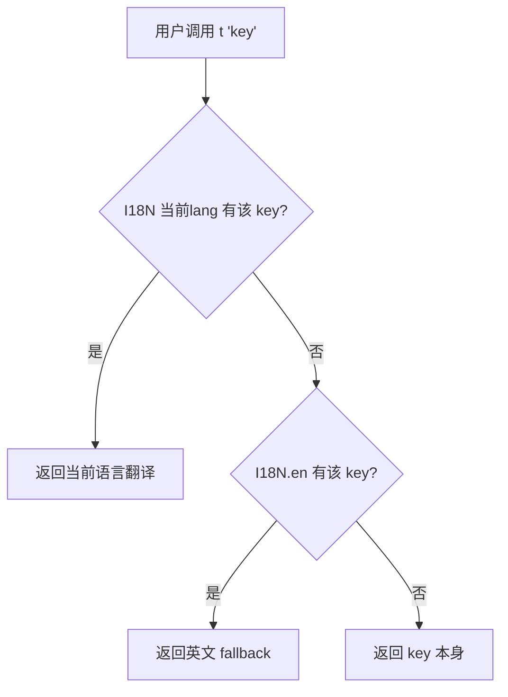
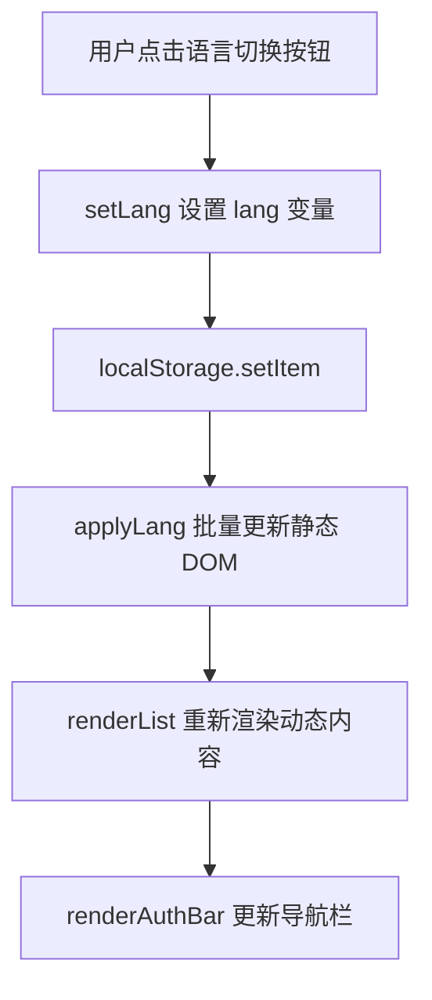
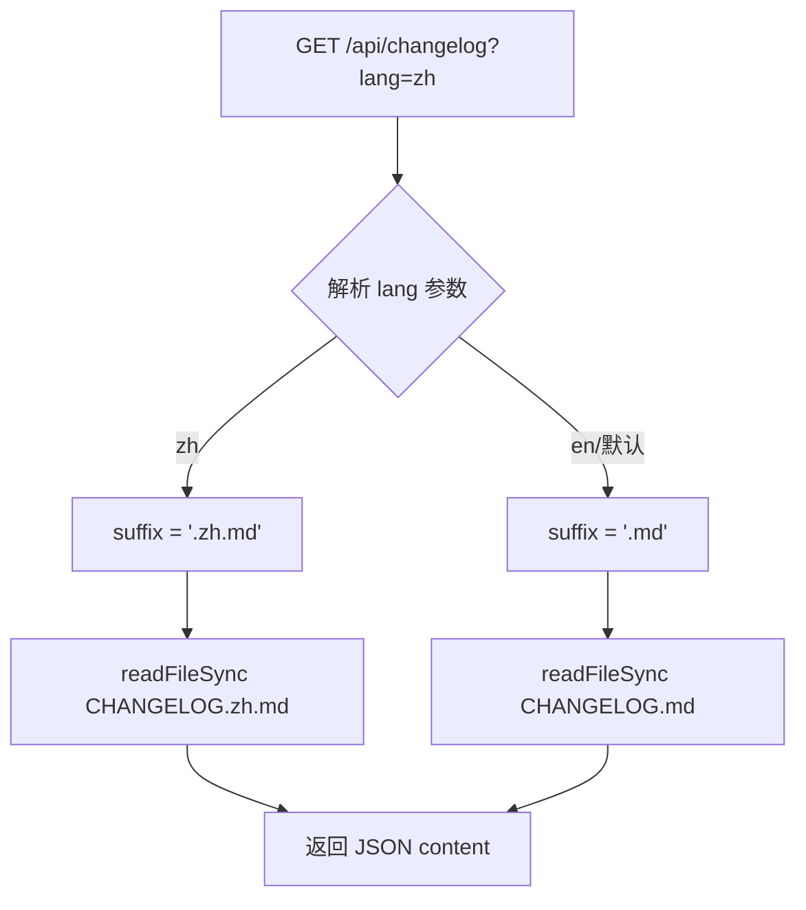

# PD-160.01 ClawFeed — 客户端 i18n 字典与多语言内容分发

> 文档编号：PD-160.01
> 来源：ClawFeed `web/index.html` `src/server.mjs`
> GitHub：https://github.com/kevinho/clawfeed
> 问题域：PD-160 国际化 Internationalization (i18n)
> 状态：可复用方案

---

## 第 1 章 问题与动机（≥ 30 行）

### 1.1 核心问题

ClawFeed 是一个 AI 新闻摘要聚合平台，面向中英文双语用户群体。核心 i18n 挑战包括：

1. **前端 UI 全量翻译** — 单页应用中有 80+ 个 UI 文案需要中英文切换，涵盖导航、Tab、表单、Toast 提示、空状态引导等
2. **语言偏好持久化** — 用户切换语言后刷新页面不丢失，且无需登录即可记住偏好
3. **后端内容多语言** — Changelog 和 Roadmap 等长文档内容需要按语言返回不同版本
4. **内联翻译混合** — 部分 UI 文案无法通过简单 key 查找完成，需要内联三元表达式处理复杂场景
5. **函数式翻译** — 日期分组标签等需要带参数的翻译函数（如"2026 第 7 周"vs"2026 Week 7"）

### 1.2 ClawFeed 的解法概述

ClawFeed 采用纯客户端 i18n 方案，零依赖、零构建步骤：

1. **I18N 字典对象** — 在 `web/index.html:249-372` 定义包含 zh/en 两套完整翻译的 JavaScript 对象，约 120 个 key
2. **t(key) 查找函数** — `web/index.html:375` 一行代码实现带 fallback 的翻译查找：先查当前语言，再 fallback 到 en，最后返回 key 本身
3. **localStorage 持久化** — `web/index.html:374` 用 `digest_lang` key 存储语言偏好，默认 en
4. **applyLang() 全量刷新** — `web/index.html:384-397` 切换语言时批量更新 DOM 元素文案
5. **后端 lang 参数** — `src/server.mjs:827-843` API 端点接受 `?lang=zh|en` 参数，按语言后缀读取对应 Markdown 文件

### 1.3 设计思想

| 设计原则 | 具体实现 | 理由 | 替代方案 |
|----------|----------|------|----------|
| 零依赖 | 纯 JS 对象 + 函数，无 i18next/vue-i18n | 单 HTML 文件 SPA，引入库增加复杂度 | i18next、react-intl |
| 字典内聚 | zh/en 翻译放在同一个 I18N 对象中 | 方便对照检查遗漏，一眼看到两种语言 | 按语言拆分文件 |
| Fallback 链 | `I18N[lang]?.[key] ?? I18N.en[key] ?? key` | 新增 key 时只写 en 也不会崩溃 | 严格模式报错 |
| 混合策略 | t(key) + 内联三元表达式并存 | 简单文案用 t()，复杂上下文用内联 | 全部走 t() |
| 文件后缀约定 | CHANGELOG.zh.md / ROADMAP.en.md | 后端零逻辑，直接拼文件名读取 | 数据库存储多语言内容 |

---

## 第 2 章 源码实现分析（≥ 60 行，核心章节）

### 2.1 架构概览

ClawFeed 的 i18n 架构分为前端和后端两层：

```
┌─────────────────────────────────────────────────────────┐
│                    前端 (web/index.html)                  │
│                                                          │
│  ┌──────────┐    ┌──────────┐    ┌───────────────────┐  │
│  │ I18N 字典 │───→│  t(key)  │───→│  DOM 渲染函数     │  │
│  │ {zh, en}  │    │ 查找函数  │    │ applyLang()       │  │
│  └──────────┘    └──────────┘    │ renderAuthBar()    │  │
│       ↑                          │ renderSources()    │  │
│  ┌──────────┐                    │ renderPacksSection()│  │
│  │localStorage│                   └───────────────────┘  │
│  │digest_lang │                          │               │
│  └──────────┘                            │ fetch(?lang=) │
│                                          ↓               │
├──────────────────────────────────────────────────────────┤
│                   后端 (src/server.mjs)                   │
│                                                          │
│  GET /api/changelog?lang=zh  →  readFile(CHANGELOG.zh.md)│
│  GET /api/roadmap?lang=en    →  readFile(ROADMAP.en.md)  │
└──────────────────────────────────────────────────────────┘
```

### 2.2 核心实现

#### 2.2.1 I18N 字典与 t() 函数



对应源码 `web/index.html:248-375`：

```javascript
// ── i18n ──
const I18N = {
  zh: {
    title: '☀️ ClawFeed',
    subtitle: 'AI 新闻简报 — POWERED BY ...',
    tab4h: '4H 简报', tabDaily: '日报', tabWeekly: '周报', tabMonthly: '月报',
    loading: '加载中...', noData: '暂无数据', loadMore: '加载更多',
    today: '今天', yesterday: '昨天', articles: '篇',
    weekLabel: (y, w) => `📅 ${y} 第 ${w} 周`,
    monthLabel: (y, m) => `📅 ${y} 年 ${m} 月`,
    // ... 约 60 个 key
  },
  en: {
    title: '☀️ ClawFeed',
    subtitle: 'AI NEWS DIGEST — POWERED BY ...',
    tab4h: '4H Briefs', tabDaily: 'Daily', tabWeekly: 'Weekly', tabMonthly: 'Monthly',
    loading: 'Loading...', noData: 'No data', loadMore: 'Load More',
    today: 'Today', yesterday: 'Yesterday', articles: 'articles',
    weekLabel: (y, w) => `📅 ${y} Week ${w}`,
    monthLabel: (y, m) => `📅 ${['','Jan','Feb','Mar','Apr','May','Jun','Jul','Aug','Sep','Oct','Nov','Dec'][m]} ${y}`,
    // ... 约 60 个 key
  }
};

let lang = localStorage.getItem('digest_lang') || 'en';
function t(key) { return I18N[lang]?.[key] ?? I18N.en[key] ?? key; }
```

关键设计点：
- `web/index.html:259-260` — 翻译值可以是**函数**，如 `weekLabel: (y, w) => ...`，调用时 `t('weekLabel')(2026, 7)` 返回格式化字符串
- `web/index.html:375` — 三级 fallback 链：当前语言 → en → key 原文，用可选链 `?.` 防止语言不存在时崩溃
- `web/index.html:374` — 默认语言 `en`，通过 `||` 短路实现

#### 2.2.2 语言切换与 DOM 刷新



对应源码 `web/index.html:377-397`：

```javascript
function setLang(l) {
  lang = l;
  localStorage.setItem('digest_lang', l);
  applyLang();
  renderList();
}

function applyLang() {
  document.querySelector('h1').textContent = t('title');
  document.getElementById('subtitleText').innerHTML = t('subtitle');
  const ib = document.getElementById('infoBanner'); if (ib) ib.innerHTML = t('infoBanner');
  const cl = document.getElementById('changelogLink'); if (cl) cl.textContent = t('changelog');
  document.querySelector('[data-type="4h"]').textContent = t('tab4h');
  document.querySelector('[data-type="daily"]').textContent = t('tabDaily');
  document.querySelector('[data-type="weekly"]').textContent = t('tabWeekly');
  document.querySelector('[data-type="monthly"]').textContent = t('tabMonthly');
  document.querySelector('[data-type="marks"]').textContent = t('tabMarks');
  const banner = document.getElementById('loginBanner');
  if (banner) banner.querySelector('span').textContent = t('loginBanner');
  renderAuthBar();
}
```

关键设计点：
- `web/index.html:384-397` — `applyLang()` 只更新**静态 DOM 元素**（标题、Tab、Banner），动态内容通过 `renderList()` 重新渲染
- `web/index.html:486-489` — 语言切换按钮通过 `ghLangHtml()` 生成，显示对面语言名称（中文时显示"EN"，英文时显示"中文"）
- `web/index.html:518-519` — 切换逻辑：`setLang(lang === 'zh' ? 'en' : 'zh')`，简单二值翻转

### 2.3 实现细节

#### 内联三元表达式模式

除了 `t(key)` 统一入口，ClawFeed 在复杂渲染场景中大量使用内联三元表达式：

```javascript
// web/index.html:902 — 按钮 title 属性
title="${lang==='zh'?'退订':'Unsubscribe'}"

// web/index.html:918 — 状态标签
⚠️ ${lang==='zh'?'已停用':'Deactivated'}

// web/index.html:940 — 标题拼接
📡 ${lang==='zh'?'信息源':'Sources'}

// web/index.html:1453 — 长文案
${lang==='zh' ? '💡 将你所有活跃的信息源打包生成一个公开链接...' : '💡 Packages all your active sources into a shareable link...'}
```

这种混合策略的原因：这些文案出现在模板字符串拼接的 HTML 中，如果全部提取到 I18N 字典会导致字典膨胀且上下文断裂。

#### 后端多语言文件约定



对应源码 `src/server.mjs:827-843`：

```javascript
// GET /api/changelog?lang=zh|en
if (req.method === 'GET' && path === '/api/changelog') {
  const l = params.get('lang') || 'en';
  const suffix = l === 'zh' ? '.zh.md' : '.md';
  try {
    const content = readFileSync(join(__dirname, '..', `CHANGELOG${suffix}`), 'utf-8');
    return json(res, { content });
  } catch { return json(res, { content: '# Changelog\n\nNo changelog found.' }); }
}

// GET /api/roadmap?lang=zh|en
if (req.method === 'GET' && path === '/api/roadmap') {
  const l = params.get('lang') || 'en';
  const suffix = l === 'zh' ? '.zh.md' : l === 'en' ? '.en.md' : '.md';
  try {
    const content = readFileSync(join(__dirname, '..', `ROADMAP${suffix}`), 'utf-8');
    return json(res, { content });
  } catch { return json(res, { content: '# Roadmap\n\nNo roadmap found.' }); }
}
```

注意 Roadmap 的后缀逻辑与 Changelog 不同：
- Changelog: en → `.md`（默认），zh → `.zh.md`
- Roadmap: en → `.en.md`，zh → `.zh.md`，其他 → `.md`

这是因为项目先有中文 ROADMAP.md，后加英文版本时用了 `.en.md` 后缀。

#### 日期本地化

`web/index.html:608-629` 的 `formatGroupLabel()` 函数通过调用翻译函数实现日期分组标签的本地化：

```javascript
function formatGroupLabel(type, key) {
  if (type === '4h') {
    const d = new Date(key + 'T00:00:00+08:00');
    const wd = WEEKDAYS()[d.getDay()]; // t('weekdays') 返回本地化星期数组
    const today = new Date(); today.setHours(0,0,0,0);
    const diff = Math.round((today - new Date(d.toDateString())) / 86400000);
    if (diff === 0) return `📅 ${t('today')} · ${key} ${wd}`;
    if (diff === 1) return `📅 ${t('yesterday')} · ${key} ${wd}`;
    return `📅 ${key} ${wd}`;
  }
  if (type === 'daily') {
    const [y, w] = key.split('-W');
    return t('weekLabel')(y, parseInt(w)); // 函数式翻译
  }
  // ...
}
```

`web/index.html:551` — `WEEKDAYS()` 函数封装了 `t('weekdays')` 调用，返回 `['周日','周一',...]` 或 `['Sun','Mon',...]`。

---

## 第 3 章 迁移指南（≥ 40 行）

### 3.1 迁移清单

#### 阶段 1：基础 i18n 框架（前端）

- [ ] 创建 I18N 字典对象，包含默认语言（en）的所有 key
- [ ] 实现 `t(key)` 查找函数，带 fallback 链
- [ ] 添加 localStorage 持久化语言偏好
- [ ] 实现 `setLang(l)` 切换函数
- [ ] 实现 `applyLang()` 批量 DOM 更新函数
- [ ] 在导航栏添加语言切换按钮

#### 阶段 2：翻译覆盖

- [ ] 提取所有硬编码文案到 I18N 字典
- [ ] 为复杂场景添加函数式翻译值（日期格式、复数等）
- [ ] 对无法提取的文案使用内联三元表达式
- [ ] 添加第二语言（zh）的完整翻译

#### 阶段 3：后端多语言

- [ ] 为 Changelog/Roadmap 等内容创建多语言文件（`.zh.md`、`.en.md`）
- [ ] API 端点添加 `?lang=` 参数支持
- [ ] 前端 fetch 请求携带当前语言参数

### 3.2 适配代码模板

#### 最小可用 i18n 模块（可直接复用）

```javascript
// ── i18n.js — 零依赖客户端 i18n ──

const I18N = {
  en: {
    greeting: 'Hello',
    items: 'items',
    weekLabel: (y, w) => `Week ${w}, ${y}`,
    weekdays: ['Sun','Mon','Tue','Wed','Thu','Fri','Sat'],
  },
  zh: {
    greeting: '你好',
    items: '条',
    weekLabel: (y, w) => `${y} 第 ${w} 周`,
    weekdays: ['周日','周一','周二','周三','周四','周五','周六'],
  }
};

const STORAGE_KEY = 'app_lang';
const DEFAULT_LANG = 'en';

let currentLang = localStorage.getItem(STORAGE_KEY) || DEFAULT_LANG;

/**
 * 翻译查找函数，三级 fallback：当前语言 → 默认语言 → key 本身
 * 支持普通字符串和函数式翻译值
 */
function t(key) {
  return I18N[currentLang]?.[key] ?? I18N[DEFAULT_LANG]?.[key] ?? key;
}

/**
 * 切换语言并持久化
 * @param {string} lang - 目标语言代码
 * @param {Function} onSwitch - 切换后的回调（用于刷新 UI）
 */
function setLang(lang, onSwitch) {
  if (!I18N[lang]) return;
  currentLang = lang;
  localStorage.setItem(STORAGE_KEY, lang);
  if (onSwitch) onSwitch();
}

/** 获取当前语言 */
function getLang() { return currentLang; }

/** 获取所有支持的语言列表 */
function getSupportedLangs() { return Object.keys(I18N); }

export { t, setLang, getLang, getSupportedLangs, I18N };
```

#### 后端多语言文件读取模板（Node.js）

```javascript
// Express/Koa 路由示例
app.get('/api/content/:slug', (req, res) => {
  const lang = req.query.lang || 'en';
  const validLangs = ['en', 'zh'];
  const safeLang = validLangs.includes(lang) ? lang : 'en';
  
  const suffix = safeLang === 'en' ? '.md' : `.${safeLang}.md`;
  const filePath = path.join(CONTENT_DIR, `${req.params.slug}${suffix}`);
  
  try {
    const content = fs.readFileSync(filePath, 'utf-8');
    res.json({ content, lang: safeLang });
  } catch {
    // Fallback 到默认语言
    try {
      const fallback = fs.readFileSync(path.join(CONTENT_DIR, `${req.params.slug}.md`), 'utf-8');
      res.json({ content: fallback, lang: 'en' });
    } catch {
      res.status(404).json({ error: 'content not found' });
    }
  }
});
```

### 3.3 适用场景

| 场景 | 适用度 | 说明 |
|------|--------|------|
| 单 HTML 文件 SPA | ⭐⭐⭐ | 完美匹配，零依赖零构建 |
| 小型 Vanilla JS 项目 | ⭐⭐⭐ | 翻译 key < 200 个时维护成本低 |
| 双语（中英）产品 | ⭐⭐⭐ | 二值切换逻辑简单高效 |
| React/Vue 组件化项目 | ⭐⭐ | 可用但不如 react-intl/vue-i18n 与框架集成好 |
| 3+ 语言支持 | ⭐ | 字典对象会膨胀，建议拆分文件 |
| 需要 ICU 消息格式 | ⭐ | 不支持复数规则、性别变化等复杂格式 |

---

## 第 4 章 测试用例（≥ 20 行）

```javascript
// test_i18n.test.js — 基于 ClawFeed i18n 实现的测试用例

// 模拟 localStorage
const storage = {};
const localStorage = {
  getItem: (k) => storage[k] || null,
  setItem: (k, v) => { storage[k] = v; },
  removeItem: (k) => { delete storage[k]; },
};

// 复制 ClawFeed 的 I18N 结构
const I18N = {
  zh: {
    title: '☀️ ClawFeed',
    loading: '加载中...',
    weekLabel: (y, w) => `📅 ${y} 第 ${w} 周`,
    weekdays: ['周日','周一','周二','周三','周四','周五','周六'],
  },
  en: {
    title: '☀️ ClawFeed',
    loading: 'Loading...',
    weekLabel: (y, w) => `📅 ${y} Week ${w}`,
    weekdays: ['Sun','Mon','Tue','Wed','Thu','Fri','Sat'],
  }
};

let lang = 'en';
function t(key) { return I18N[lang]?.[key] ?? I18N.en[key] ?? key; }
function setLang(l) { lang = l; localStorage.setItem('digest_lang', l); }

describe('ClawFeed i18n', () => {
  beforeEach(() => { lang = 'en'; });

  test('t() 返回当前语言翻译', () => {
    expect(t('loading')).toBe('Loading...');
    setLang('zh');
    expect(t('loading')).toBe('加载中...');
  });

  test('t() fallback 到 en', () => {
    setLang('zh');
    // 假设 zh 缺少某个 key
    I18N.zh._test_missing = undefined;
    expect(t('title')).toBe('☀️ ClawFeed'); // zh 有此 key
  });

  test('t() 未知 key 返回 key 本身', () => {
    expect(t('nonexistent_key_xyz')).toBe('nonexistent_key_xyz');
  });

  test('函数式翻译值正确调用', () => {
    expect(t('weekLabel')(2026, 7)).toBe('📅 2026 Week 7');
    setLang('zh');
    expect(t('weekLabel')(2026, 7)).toBe('📅 2026 第 7 周');
  });

  test('weekdays 数组按语言返回', () => {
    expect(t('weekdays')[0]).toBe('Sun');
    setLang('zh');
    expect(t('weekdays')[0]).toBe('周日');
  });

  test('localStorage 持久化语言偏好', () => {
    setLang('zh');
    expect(localStorage.getItem('digest_lang')).toBe('zh');
    setLang('en');
    expect(localStorage.getItem('digest_lang')).toBe('en');
  });

  test('默认语言为 en', () => {
    const defaultLang = localStorage.getItem('digest_lang') || 'en';
    expect(defaultLang).toBe('en');
  });

  test('不存在的语言 fallback 到 en', () => {
    lang = 'fr'; // 不存在的语言
    expect(t('loading')).toBe('Loading...'); // fallback 到 en
  });
});

describe('后端多语言文件路由', () => {
  test('changelog lang=zh 返回 .zh.md 后缀', () => {
    const l = 'zh';
    const suffix = l === 'zh' ? '.zh.md' : '.md';
    expect(suffix).toBe('.zh.md');
  });

  test('changelog lang=en 返回 .md 后缀', () => {
    const l = 'en';
    const suffix = l === 'zh' ? '.zh.md' : '.md';
    expect(suffix).toBe('.md');
  });

  test('roadmap lang 后缀逻辑', () => {
    const getSuffix = (l) => l === 'zh' ? '.zh.md' : l === 'en' ? '.en.md' : '.md';
    expect(getSuffix('zh')).toBe('.zh.md');
    expect(getSuffix('en')).toBe('.en.md');
    expect(getSuffix('ja')).toBe('.md');
  });

  test('默认 lang 参数为 en', () => {
    const params = new URLSearchParams('');
    const l = params.get('lang') || 'en';
    expect(l).toBe('en');
  });
});
```

---

## 第 5 章 跨域关联

| 关联域 | 关系类型 | 说明 |
|--------|----------|------|
| PD-06 记忆持久化 | 协同 | localStorage 持久化语言偏好是轻量级客户端记忆的典型应用 |
| PD-09 Human-in-the-Loop | 协同 | 语言切换是用户偏好交互的一种形式，影响后续所有 UI 展示 |
| PD-04 工具系统 | 依赖 | 后端 API 的 `lang` 参数设计可扩展为工具调用时的语言上下文传递 |
| PD-07 质量检查 | 协同 | 翻译完整性检查（zh/en key 数量一致性）是 i18n 质量保障的关键 |

---

## 第 6 章 来源文件索引

| 文件 | 行范围 | 关键实现 |
|------|--------|----------|
| `web/index.html` | L248-L372 | I18N 字典对象定义（zh/en 两套翻译，约 120 个 key） |
| `web/index.html` | L374-L375 | `lang` 变量初始化 + `t(key)` 查找函数 |
| `web/index.html` | L377-L397 | `setLang()` 切换 + `applyLang()` DOM 批量更新 |
| `web/index.html` | L486-L519 | `ghLangHtml()` 语言切换按钮 + `renderAuthBar()` 中的绑定 |
| `web/index.html` | L551 | `WEEKDAYS()` 本地化星期数组封装 |
| `web/index.html` | L608-L629 | `formatGroupLabel()` 日期分组标签本地化 |
| `web/index.html` | L902,918,940 | 内联三元表达式 i18n 示例 |
| `src/server.mjs` | L827-L833 | `/api/changelog?lang=` 多语言文件读取 |
| `src/server.mjs` | L837-L843 | `/api/roadmap?lang=` 多语言文件读取 |
| `CHANGELOG.zh.md` | 全文 | 中文更新日志 |
| `CHANGELOG.md` | 全文 | 英文更新日志（默认） |
| `ROADMAP.zh.md` | 全文 | 中文路线图 |
| `ROADMAP.en.md` | 全文 | 英文路线图 |

---

## 第 7 章 横向对比维度

```json comparison_data
{
  "project": "ClawFeed",
  "dimensions": {
    "翻译架构": "纯 JS 对象字典，t(key) 三级 fallback 查找，零依赖",
    "语言切换": "二值翻转 zh↔en，localStorage 持久化，applyLang() 全量 DOM 刷新",
    "后端多语言": "文件后缀约定（.zh.md/.en.md），API ?lang= 参数路由",
    "函数式翻译": "字典值支持函数类型，weekLabel(y,w) 带参数格式化",
    "混合策略": "t(key) + 内联三元表达式并存，简单文案走字典、复杂上下文走内联"
  }
}
```

### 域元数据补充

```json domain_metadata
{
  "solution_summary": "ClawFeed 用纯 JS 对象字典 + t(key) 三级 fallback 函数实现零依赖客户端 i18n，字典值支持函数类型处理日期格式化，后端用文件后缀约定(.zh.md)实现内容多语言",
  "description": "零依赖轻量 i18n 方案在单文件 SPA 中的工程实践",
  "sub_problems": [
    "函数式翻译值（带参数的格式化翻译）",
    "t(key) 与内联三元表达式的混合策略选择",
    "多语言文件后缀命名不一致问题"
  ],
  "best_practices": [
    "翻译值支持函数类型实现参数化格式化",
    "applyLang() 静态 DOM + renderList() 动态内容分层刷新",
    "文件后缀约定(.zh.md)实现后端零逻辑多语言"
  ]
}
```
