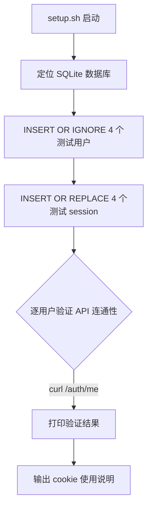
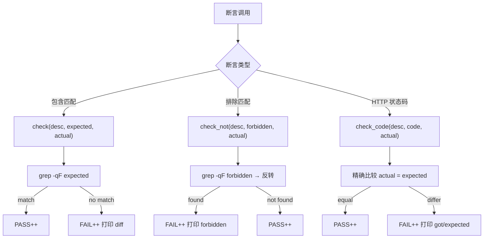
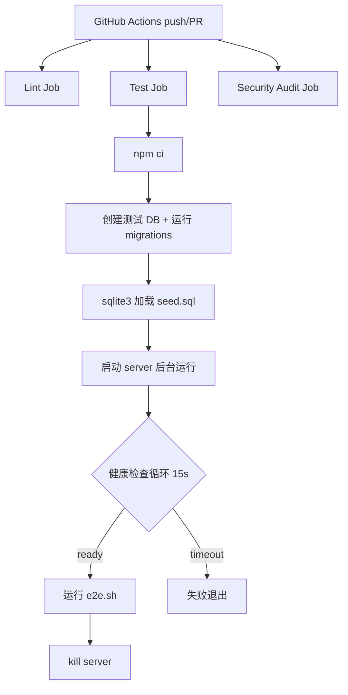

# PD-161.01 ClawFeed — 纯 Bash+Curl 多用户 E2E 测试框架

> 文档编号：PD-161.01
> 来源：ClawFeed `test/e2e.sh` `test/setup.sh` `test/teardown.sh`
> GitHub：https://github.com/kevinho/clawfeed
> 问题域：PD-161 E2E 测试框架 E2E Testing Framework
> 状态：可复用方案

---

## 第 1 章 问题与动机

### 1.1 核心问题

Web API 的端到端测试通常依赖重量级框架（Jest + Supertest、Playwright、Cypress），引入大量 devDependencies 和复杂配置。对于以 REST API 为核心的后端项目，这些框架的 DOM 操作能力完全多余，而它们的安装、配置、CI 集成成本却不低。

更关键的问题是**多用户场景测试**：大多数 E2E 框架默认单用户视角，要测试"Alice 创建资源 → Bob 尝试删除 → 被拒绝"这类跨用户交互，需要手动管理多个认证上下文，代码冗长且易错。

ClawFeed 面临的具体挑战：
- Google OAuth 认证无法在 CI 中自动化（需要浏览器交互）
- 需要验证 4 个用户之间的数据隔离（marks、subscriptions 互不可见）
- 软删除级联效应需要跨多个 API 端点验证
- Pack 安装的去重逻辑需要多用户 × 多次安装的组合测试

### 1.2 ClawFeed 的解法概述

ClawFeed 用纯 bash + curl 实现了完整的多用户 E2E 测试框架，零外部依赖：

1. **SQLite 直接注入绕过 OAuth** — `test/setup.sh:13-27` 直接向 users 和 sessions 表写入测试数据，完全绕过 Google OAuth 流程
2. **ID 段隔离** — 测试用户 ID 100-199，生产用户 ID 1-99，通过 ID 范围实现物理隔离（`test/teardown.sh:11-16`）
3. **角色化测试用户** — 4 个用户各有明确角色：Alice（创建者）、Bob（竞争者）、Carol（消费者）、Dave（验证者），覆盖所有交互模式（`test/e2e.sh:14-17`）
4. **三函数断言库** — `check`（包含匹配）、`check_not`（排除匹配）、`check_code`（HTTP 状态码），3 个函数覆盖所有断言需求（`test/e2e.sh:20-56`）
5. **16 类 66 个测试用例** — 从认证到软删除级联，覆盖完整业务生命周期（`test/e2e.sh:67-451`）

### 1.3 设计思想

| 设计原则 | 具体实现 | 理由 | 替代方案 |
|----------|----------|------|----------|
| 零依赖 | bash + curl + sqlite3 + python3（仅 JSON 解析） | CI 环境天然可用，无需 npm install | Jest + Supertest（需安装） |
| 数据库级绕过 | SQLite 直接 INSERT 测试用户和 session | OAuth 在 CI 中不可自动化 | Mock OAuth provider |
| ID 段隔离 | 测试用户 100-199，teardown 按范围 DELETE | 简单可靠，不影响生产数据 | 独立测试数据库 |
| 角色化用户 | Alice/Bob/Carol/Dave 各有固定角色 | 测试意图清晰，可读性强 | 匿名 user1/user2 |
| 线性叙事 | 测试按业务流程顺序执行，前序创建后序使用 | 模拟真实用户旅程 | 独立测试（需更多 setup） |
| 软断言 | 失败不中断，最后汇总 PASS/FAIL | 一次运行看到所有问题 | set -e 硬失败 |

---

## 第 2 章 源码实现分析

### 2.1 架构概览

ClawFeed 的 E2E 测试由三个脚本组成一个 setup → test → teardown 循环：

```
┌─────────────────────────────────────────────────────────────┐
│                    E2E Test Lifecycle                         │
│                                                              │
│  ┌──────────┐     ┌──────────────┐     ┌──────────────┐     │
│  │ setup.sh │────→│   e2e.sh     │────→│ teardown.sh  │     │
│  │          │     │              │     │              │     │
│  │ SQLite   │     │ 16 categories│     │ DELETE WHERE │     │
│  │ INSERT   │     │ 66 assertions│     │ id 100-199   │     │
│  │ 4 users  │     │ curl → check │     │              │     │
│  │ 4 sessions│    │              │     │              │     │
│  └──────────┘     └──────────────┘     └──────────────┘     │
│       │                  │                    │              │
│       ▼                  ▼                    ▼              │
│  ┌─────────────────────────────────────────────────┐        │
│  │              SQLite (digest.db)                  │        │
│  │  users: id 100-103 (test) / 1-99 (production)  │        │
│  │  sessions: test-sess-{alice,bob,carol,dave}     │        │
│  └─────────────────────────────────────────────────┘        │
└─────────────────────────────────────────────────────────────┘
```

### 2.2 核心实现

#### 2.2.1 测试数据注入（绕过 OAuth）



对应源码 `test/setup.sh:5-27`：
```bash
DB="${AI_DIGEST_DB:-$(dirname "$0")/../data/digest.db}"
API="${AI_DIGEST_API:-https://digest.kevinhe.io/api}"

# ── Create test users (id 100-103, won't collide with real users) ──
sqlite3 "$DB" "
-- Test users
INSERT OR IGNORE INTO users (id, google_id, email, name, avatar, slug)
VALUES
  (100, 'test-alice', 'alice@test.local', 'Alice (Test)', '', 'alice-test'),
  (101, 'test-bob',   'bob@test.local',   'Bob (Test)',   '', 'bob-test'),
  (102, 'test-carol', 'carol@test.local', 'Carol (Test)', '', 'carol-test'),
  (103, 'test-dave',  'dave@test.local',  'Dave (Test)',  '', 'dave-test');

-- Test sessions (24h expiry)
INSERT OR REPLACE INTO sessions (id, user_id, expires_at) VALUES
  ('test-sess-alice', 100, datetime('now', '+1 day')),
  ('test-sess-bob',   101, datetime('now', '+1 day')),
  ('test-sess-carol', 102, datetime('now', '+1 day')),
  ('test-sess-dave',  103, datetime('now', '+1 day'));
"
```

关键设计点：
- `INSERT OR IGNORE` 保证幂等——重复运行 setup 不会报错（`test/setup.sh:15`）
- `INSERT OR REPLACE` 每次刷新 session 过期时间（`test/setup.sh:23`）
- 用户 ID 硬编码 100-103，与生产 ID 空间（1-99）物理隔离
- session ID 使用可读的 `test-sess-{name}` 格式，调试时一眼可辨

#### 2.2.2 三函数断言库



对应源码 `test/e2e.sh:20-56`：
```bash
check() {
  TOTAL=$((TOTAL+1))
  local desc="$1" expected="$2" actual="$3"
  if echo "$actual" | grep -qF "$expected"; then
    PASS=$((PASS+1))
    printf "  ✅ %s\n" "$desc"
  else
    FAIL=$((FAIL+1))
    printf "  ❌ %s\n" "$desc"
    printf "     expected: %s\n" "$expected"
    printf "     got: %.120s\n" "$actual"
  fi
}

check_not() {
  TOTAL=$((TOTAL+1))
  local desc="$1" forbidden="$2" actual="$3"
  if echo "$actual" | grep -qF "$forbidden"; then
    FAIL=$((FAIL+1))
    printf "  ❌ %s (found forbidden: %s)\n" "$desc" "$forbidden"
  else
    PASS=$((PASS+1))
    printf "  ✅ %s\n" "$desc"
  fi
}

check_code() {
  TOTAL=$((TOTAL+1))
  local desc="$1" expected="$2" actual="$3"
  if [ "$actual" = "$expected" ]; then
    PASS=$((PASS+1))
    printf "  ✅ %s → %s\n" "$desc" "$actual"
  else
    FAIL=$((FAIL+1))
    printf "  ❌ %s → got %s, expected %s\n" "$desc" "$actual" "$expected"
  fi
}
```

设计亮点：
- `grep -qF` 使用固定字符串匹配（`-F`），避免正则转义问题
- 失败时截断输出到 120 字符（`%.120s`），防止大 JSON 刷屏
- 计数器 `PASS/FAIL/TOTAL/SKIP` 全局累加，最后统一汇报
- `check_not` 用于数据隔离验证——确认 Alice 看不到 Bob 的数据

#### 2.2.3 JSON 解析辅助函数

源码 `test/e2e.sh:58-59`：
```bash
jq_val() { python3 -c "import sys,json; d=json.load(sys.stdin); print($1)" 2>/dev/null; }
jq_len() { python3 -c "import sys,json; print(len(json.load(sys.stdin)))" 2>/dev/null; }
```

用 python3 替代 jq 做 JSON 解析——python3 在几乎所有 CI 环境预装，而 jq 需要额外安装。`jq_val` 接受 Python 表达式作为参数，灵活度极高（如 `d['id']`、`d.get('slug','')`、`d[0]['id'] if d else ''`）。

### 2.3 实现细节

#### 测试用户角色设计

```
Alice (id=100) ─── 内容创建者
│  创建 3 个 Source（2 public + 1 private）
│  创建 Pack（含 2 个 public source）
│  删除 source → 触发级联效应
│
Bob (id=101) ─── 竞争者/交叉用户
│  创建 1 个独立 Source
│  尝试删除 Alice 的 source → 403
│  手动订阅 1 个 → 再装 Pack → 验证增量去重
│
Carol (id=102) ─── 纯消费者
│  初始 0 订阅（空状态）
│  安装 Pack → 获得 2 个订阅
│  重复安装 → 验证幂等（added=0）
│  取消订阅 → 重新订阅 → 验证可逆
│
Dave (id=103) ─── 第二消费者
│  安装同一 Pack → 验证独立用户各自 added=2
│  安装混合 Pack → 验证跳过已删除 source
```

#### 数据隔离验证模式

测试通过 `check` + `check_not` 组合验证隔离（`test/e2e.sh:258-270`）：

```bash
# Alice sees only her marks
r=$(curl -s "$API/marks" -H "$ALICE")
check "Alice sees her mark" 'alice private note' "$r"
check_not "Alice cannot see Bob's mark" 'bob private note' "$r"

# Bob sees only his marks
r=$(curl -s "$API/marks" -H "$BOB")
check "Bob sees his mark" 'bob private note' "$r"
check_not "Bob cannot see Alice's mark" 'alice private note' "$r"
```

#### 软删除级联测试

`test/e2e.sh:395-433` 实现了完整的软删除验证链：

1. Alice 创建 source → Bob 订阅
2. Alice 删除 source → 验证 `is_deleted=1`（直接查 SQLite）
3. 验证 source 从公开列表消失
4. 验证 Bob 的订阅中 `sourceDeleted:true`
5. 验证 Pack 安装跳过已删除 source（`added:0`）
6. 验证混合 Pack 只添加未删除的（`added:1`）

#### CI 集成



对应源码 `.github/workflows/ci.yml:30-80`：CI 中使用独立的 `test/seed.sql` 而非 `setup.sh`，因为 CI 环境的用户 ID 从 1 开始（不需要与生产隔离），session 过期设为 2099 年（避免 CI 运行时过期）。

---

## 第 3 章 迁移指南

### 3.1 迁移清单

#### 阶段 1：基础设施（1 天）

- [ ] 创建 `test/` 目录结构：`setup.sh`、`e2e.sh`、`teardown.sh`
- [ ] 确定测试用户 ID 段（建议 10000-10099，避免与业务 ID 冲突）
- [ ] 编写 setup.sh：直接向数据库注入测试用户和认证 token
- [ ] 编写 teardown.sh：按 ID 段清理，注意外键依赖顺序
- [ ] 复制三函数断言库（check / check_not / check_code）

#### 阶段 2：核心测试（2-3 天）

- [ ] 认证测试：每个测试用户 + 未认证访客 + 无效 token
- [ ] CRUD 测试：创建 → 读取 → 更新 → 删除，每个资源类型
- [ ] 所有权测试：用户 A 的资源，用户 B 不能修改/删除
- [ ] 数据隔离测试：用户 A 看不到用户 B 的私有数据

#### 阶段 3：高级场景（1-2 天）

- [ ] 幂等性测试：重复操作返回一致结果
- [ ] 级联效应测试：删除父资源后子资源的状态变化
- [ ] 边界情况：空输入、不存在的 ID、超长字符串

#### 阶段 4：CI 集成

- [ ] GitHub Actions workflow：lint → test → audit
- [ ] 健康检查循环等待服务器就绪
- [ ] 测试数据库独立于生产数据库

### 3.2 适配代码模板

#### 模板 1：通用 setup.sh（适配任意数据库）

```bash
#!/bin/bash
# Test environment setup — adapt DB_CMD and SQL for your database
set -e

DB="${TEST_DB:-./data/test.db}"
API="${TEST_API:-http://localhost:3000/api}"

# ── Adapt this section for your database ──
# SQLite:
DB_CMD="sqlite3 $DB"
# PostgreSQL: DB_CMD="psql $DATABASE_URL -c"
# MySQL: DB_CMD="mysql -u root test_db -e"

$DB_CMD "
INSERT OR IGNORE INTO users (id, email, name, auth_token)
VALUES
  (10000, 'alice@test.local', 'Alice (Test)', 'test-token-alice'),
  (10001, 'bob@test.local',   'Bob (Test)',   'test-token-bob'),
  (10002, 'carol@test.local', 'Carol (Test)', 'test-token-carol');
"

echo "✅ Test users created"

# Verify connectivity
for name in alice bob carol; do
  uid=$(curl -sf "$API/auth/me" -H "Authorization: Bearer test-token-$name" \
    | python3 -c "import sys,json; print(json.load(sys.stdin).get('id',''))" 2>/dev/null)
  echo "  ${uid:+✅}${uid:-❌} $name: ${uid:-auth failed}"
done
```

#### 模板 2：通用断言库（可直接复用）

```bash
#!/bin/bash
# E2E assertion library — source this file in your test script
PASS=0; FAIL=0; TOTAL=0; SKIP=0

# 包含匹配：actual 中包含 expected 字符串
check() {
  TOTAL=$((TOTAL+1))
  local desc="$1" expected="$2" actual="$3"
  if echo "$actual" | grep -qF "$expected"; then
    PASS=$((PASS+1)); printf "  ✅ %s\n" "$desc"
  else
    FAIL=$((FAIL+1)); printf "  ❌ %s\n" "$desc"
    printf "     expected: %s\n" "$expected"
    printf "     got: %.200s\n" "$actual"
  fi
}

# 排除匹配：actual 中不包含 forbidden 字符串
check_not() {
  TOTAL=$((TOTAL+1))
  local desc="$1" forbidden="$2" actual="$3"
  if echo "$actual" | grep -qF "$forbidden"; then
    FAIL=$((FAIL+1)); printf "  ❌ %s (found: %s)\n" "$desc" "$forbidden"
  else
    PASS=$((PASS+1)); printf "  ✅ %s\n" "$desc"
  fi
}

# HTTP 状态码精确匹配
check_code() {
  TOTAL=$((TOTAL+1))
  local desc="$1" expected="$2" actual="$3"
  if [ "$actual" = "$expected" ]; then
    PASS=$((PASS+1)); printf "  ✅ %s → %s\n" "$desc" "$actual"
  else
    FAIL=$((FAIL+1)); printf "  ❌ %s → got %s, expected %s\n" "$desc" "$actual" "$expected"
  fi
}

# JSON 值提取（替代 jq）
jq_val() { python3 -c "import sys,json; d=json.load(sys.stdin); print($1)" 2>/dev/null; }
jq_len() { python3 -c "import sys,json; print(len(json.load(sys.stdin)))" 2>/dev/null; }

# 结果汇总（在测试脚本末尾调用）
summary() {
  echo ""
  echo "═══════════════════════════════════════════"
  printf "  Results: %d/%d passed" "$PASS" "$TOTAL"
  [ "$FAIL" -gt 0 ] && printf ", \033[31m%d failed\033[0m" "$FAIL"
  [ "$SKIP" -gt 0 ] && printf ", %d skipped" "$SKIP"
  echo ""
  echo "═══════════════════════════════════════════"
  [ "$FAIL" -gt 0 ] && exit 1 || exit 0
}
```

#### 模板 3：CI workflow（GitHub Actions）

```yaml
name: E2E Tests
on: [push, pull_request]
jobs:
  test:
    runs-on: ubuntu-latest
    steps:
      - uses: actions/checkout@v4
      - uses: actions/setup-node@v4
        with: { node-version: 20 }
      - run: npm ci
      - name: Setup & Run E2E
        run: |
          # Initialize test database
          mkdir -p data
          # ... run migrations ...

          # Seed test data
          sqlite3 data/test.db < test/seed.sql

          # Start server in background
          PORT=8767 DB_PATH=data/test.db node src/server.mjs &

          # Health check loop (max 15s)
          for i in $(seq 1 15); do
            curl -sf http://localhost:8767/health > /dev/null 2>&1 && break
            sleep 1
          done

          # Run tests
          TEST_API=http://localhost:8767/api bash test/e2e.sh

          kill %1 2>/dev/null || true
```

### 3.3 适用场景

| 场景 | 适用度 | 说明 |
|------|--------|------|
| REST API 后端（Node/Python/Go） | ⭐⭐⭐ | 最佳场景，curl 天然适配 |
| 多用户权限系统 | ⭐⭐⭐ | 角色化用户 + check_not 隔离验证 |
| SQLite/PostgreSQL 项目 | ⭐⭐⭐ | 数据库直接注入绕过认证 |
| 微服务架构 | ⭐⭐ | 需要多个服务同时运行，setup 复杂度上升 |
| GraphQL API | ⭐⭐ | curl 可用但 query 字符串较长，可读性下降 |
| 前端 UI 测试 | ⭐ | 不适用，需要 Playwright/Cypress |
| WebSocket/SSE 实时通信 | ⭐ | curl 不支持长连接测试 |

---

## 第 4 章 测试用例

基于 ClawFeed 的真实函数签名，以下是可直接运行的测试代码：

```python
"""
ClawFeed E2E 测试框架的 Python 等价实现
用于验证核心设计模式的正确性
"""
import subprocess
import json
import sqlite3
import os
import pytest
from pathlib import Path


class TestSetupTeardown:
    """验证 setup/teardown 的幂等性和隔离性"""

    DB_PATH = os.environ.get("TEST_DB", "data/test.db")

    def test_setup_idempotent(self):
        """多次运行 setup.sh 不报错"""
        for _ in range(3):
            result = subprocess.run(
                ["bash", "test/setup.sh"],
                env={**os.environ, "AI_DIGEST_DB": self.DB_PATH},
                capture_output=True, text=True
            )
            assert result.returncode == 0

    def test_user_id_range_isolation(self):
        """测试用户 ID 在 100-199 范围内"""
        conn = sqlite3.connect(self.DB_PATH)
        rows = conn.execute(
            "SELECT id FROM users WHERE email LIKE '%@test.local'"
        ).fetchall()
        for (uid,) in rows:
            assert 100 <= uid <= 199, f"Test user id {uid} outside range"
        conn.close()

    def test_teardown_cleans_only_test_data(self):
        """teardown 只清理测试数据，不影响其他数据"""
        conn = sqlite3.connect(self.DB_PATH)
        # Insert a "production" user
        conn.execute(
            "INSERT OR IGNORE INTO users (id, google_id, email, name) "
            "VALUES (1, 'prod-user', 'prod@real.com', 'Prod User')"
        )
        conn.commit()

        subprocess.run(
            ["bash", "test/teardown.sh"],
            env={**os.environ, "AI_DIGEST_DB": self.DB_PATH}
        )

        # Production user still exists
        row = conn.execute("SELECT id FROM users WHERE id = 1").fetchone()
        assert row is not None
        # Test users gone
        row = conn.execute(
            "SELECT id FROM users WHERE id BETWEEN 100 AND 199"
        ).fetchone()
        assert row is None
        conn.close()


class TestAssertionLibrary:
    """验证 check/check_not/check_code 的行为"""

    def test_check_substring_match(self):
        """check 使用子字符串匹配（grep -F）"""
        # Simulating: echo "$actual" | grep -qF "$expected"
        actual = '{"name":"Alice (Test)","id":100}'
        assert "Alice (Test)" in actual  # check 的核心逻辑

    def test_check_not_exclusion(self):
        """check_not 验证字符串不存在"""
        alice_marks = '{"marks":[{"note":"alice private note"}]}'
        assert "bob private note" not in alice_marks

    def test_check_code_exact_match(self):
        """check_code 使用精确匹配（不是子字符串）"""
        assert "401" == "401"
        assert "401" != "4010"  # 精确匹配，不是前缀


class TestDataIsolation:
    """验证多用户数据隔离模式"""

    def test_marks_isolation_pattern(self):
        """每个用户只能看到自己的 marks"""
        # 模拟 db.mjs:156-166 的 listMarks 查询
        # WHERE user_id = ? 确保隔离
        sql = "SELECT * FROM marks WHERE user_id = ?"
        # Alice (100) 和 Bob (101) 的查询互不干扰
        assert sql.count("user_id") == 1

    def test_subscription_isolation_pattern(self):
        """订阅列表按 user_id 隔离"""
        # 模拟 db.mjs:371-379 的 listSubscriptions
        sql = "WHERE us.user_id = ?"
        assert "user_id" in sql


class TestPackDedup:
    """验证 Pack 安装去重逻辑"""

    def test_dedup_by_type_config(self):
        """Pack 安装通过 type+config 匹配已有 source"""
        # 模拟 server.mjs:696-713 的去重逻辑
        existing_sources = [
            {"type": "rss", "config": '{"url":"https://alice.test/rss"}'},
        ]
        pack_sources = [
            {"type": "rss", "config": '{"url":"https://alice.test/rss"}'},
            {"type": "hackernews", "config": '{"section":"front"}'},
        ]
        added = 0
        for ps in pack_sources:
            match = next(
                (s for s in existing_sources
                 if s["type"] == ps["type"] and s["config"] == ps["config"]),
                None
            )
            if not match:
                added += 1
        assert added == 1  # 只有 HN 是新的

    def test_soft_deleted_source_skipped(self):
        """已软删除的 source 不会被 Pack 安装复活"""
        # 模拟 server.mjs:700-702
        existing = {"id": 1, "type": "rss", "is_deleted": True}
        if existing and existing.get("is_deleted"):
            skipped = True
        assert skipped is True
```

---

## 第 5 章 跨域关联

| 关联域 | 关系类型 | 说明 |
|--------|----------|------|
| PD-155 认证与会话管理 | 依赖 | E2E 测试通过 SQLite 直接注入 session 绕过 OAuth，依赖对认证机制的理解 |
| PD-157 多租户隔离 | 协同 | 多用户数据隔离测试（marks、subscriptions）本质上是多租户隔离的验证手段 |
| PD-163 软删除模式 | 协同 | 第 16 类测试专门验证软删除级联效应（is_deleted 标记、订阅者影响、Pack 跳过） |
| PD-164 CI/CD 流水线 | 依赖 | E2E 测试是 CI pipeline 的核心环节，ci.yml 中 test job 依赖 e2e.sh |
| PD-158 SSRF 防护 | 协同 | API 安全测试（第 13 类）验证未认证请求被拒绝，与 SSRF 防护互补 |
| PD-165 内容包分享 | 协同 | Pack 安装/去重/级联测试（第 5-8、16 类）是 Pack 分享功能的质量保障 |

---

## 第 6 章 来源文件索引

| 文件 | 行范围 | 关键实现 |
|------|--------|----------|
| `test/setup.sh` | L1-53 | 测试用户和 session 注入，API 连通性验证 |
| `test/e2e.sh` | L1-18 | 环境变量、用户 cookie 定义、计数器初始化 |
| `test/e2e.sh` | L20-56 | 三函数断言库：check / check_not / check_code |
| `test/e2e.sh` | L58-59 | JSON 解析辅助：jq_val / jq_len |
| `test/e2e.sh` | L67-78 | 认证测试（第 1 类，6 个断言） |
| `test/e2e.sh` | L93-122 | Sources CRUD + 可见性测试（第 3 类） |
| `test/e2e.sh` | L126-143 | 所有权测试（第 4 类，403 验证） |
| `test/e2e.sh` | L147-165 | Pack 创建 + 分享测试（第 5 类） |
| `test/e2e.sh` | L169-199 | Pack 安装去重测试（第 6-7 类） |
| `test/e2e.sh` | L235-291 | Marks 隔离测试（第 10 类，check + check_not 组合） |
| `test/e2e.sh` | L296-309 | 数据隔离验证（第 11 类） |
| `test/e2e.sh` | L325-342 | API 安全测试（第 13 类，5 个 401 验证） |
| `test/e2e.sh` | L370-438 | 软删除级联测试（第 15-16 类） |
| `test/e2e.sh` | L440-451 | 结果汇总和退出码 |
| `test/teardown.sh` | L1-20 | 按 ID 段清理，依赖顺序 DELETE |
| `test/seed.sql` | L1-23 | CI 专用种子数据（用户 ID 1-5，session 过期 2099） |
| `.github/workflows/ci.yml` | L21-80 | CI 集成：migrations → seed → server → e2e |
| `src/db.mjs` | L315-319 | deleteSource 软删除实现 |
| `src/db.mjs` | L371-379 | listSubscriptions 含 is_deleted 字段 |
| `src/db.mjs` | L382-383 | subscribe 使用 INSERT OR IGNORE 实现幂等 |
| `src/server.mjs` | L194-204 | attachUser 中间件：cookie → session → user |
| `src/server.mjs` | L687-716 | Pack install 去重逻辑：type+config 匹配 + 软删除跳过 |

---

## 第 7 章 横向对比维度

```json comparison_data
{
  "project": "ClawFeed",
  "dimensions": {
    "测试工具链": "纯 bash+curl+sqlite3，零 npm devDependencies",
    "认证绕过": "SQLite 直接 INSERT 测试用户和 session，绕过 Google OAuth",
    "多用户覆盖": "4 角色用户（创建者/竞争者/消费者/验证者）覆盖所有交互模式",
    "数据隔离验证": "check+check_not 组合断言，正向确认+反向排除双重验证",
    "断言机制": "3 函数断言库（包含/排除/状态码），软失败最后汇总",
    "CI 集成": "GitHub Actions 3 job 并行（lint+test+audit），健康检查循环等待",
    "测试数据管理": "ID 段隔离（100-199），setup→test→teardown 可重复循环",
    "软删除测试": "7 个用例覆盖 is_deleted 标记、级联影响、Pack 跳过僵尸源"
  }
}
```

### 域元数据补充

```json domain_metadata
{
  "solution_summary": "ClawFeed 用纯 bash+curl 实现 66 个 E2E 测试，4 个角色化用户通过 SQLite 直接注入绕过 OAuth，3 函数断言库覆盖 16 类场景含软删除级联",
  "description": "纯 shell 脚本 E2E 测试的工程模式，含多用户角色设计与数据库级认证绕过",
  "sub_problems": [
    "软删除级联效应的端到端验证",
    "Pack 安装去重的多用户组合测试",
    "CI 环境与本地环境的测试数据差异化管理"
  ],
  "best_practices": [
    "check+check_not 组合实现数据隔离双重验证",
    "python3 替代 jq 做 JSON 解析减少 CI 依赖",
    "CI 用独立 seed.sql（ID 从 1 开始，session 过期 2099）",
    "角色化测试用户（创建者/竞争者/消费者/验证者）覆盖所有交互模式"
  ]
}
```
