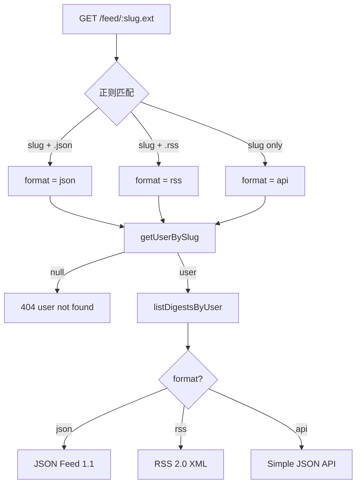
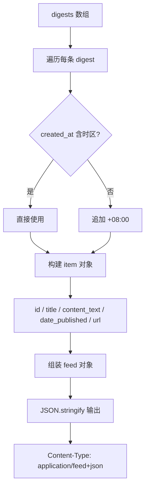
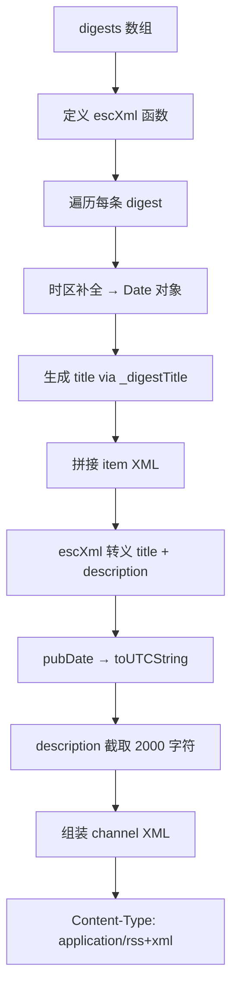

# PD-162.01 ClawFeed — 双格式 Feed 生成与用户级 Slug 路由

> 文档编号：PD-162.01
> 来源：ClawFeed `src/server.mjs`
> GitHub：https://github.com/kevinho/clawfeed
> 问题域：PD-162 Feed 生成 RSS & JSON Feed Generation
> 状态：可复用方案

---

## 第 1 章 问题与动机

### 1.1 核心问题

AI 驱动的内容聚合系统（如 ClawFeed 的 digest 摘要）产出的结构化内容，需要以标准订阅格式分发给下游消费者——RSS 阅读器、播客客户端、自动化工作流（Zapier/n8n）、以及其他 Agent 系统。核心挑战在于：

1. **双格式兼容**：RSS 2.0（XML）和 JSON Feed 1.1 是两套完全不同的序列化协议，需要同时支持
2. **用户隔离**：多用户系统中每个用户需要独立的 feed URL，且公开可访问（无需认证）
3. **时区一致性**：digest 数据的 `created_at` 字段可能缺少时区信息，feed 输出必须包含明确时区
4. **XML 安全**：用户生成内容中的 `<`, `>`, `&`, `"` 等字符必须正确转义，否则会破坏 XML 解析
5. **内容截断**：RSS description 字段需要合理截断，避免 feed 体积过大

### 1.2 ClawFeed 的解法概述

ClawFeed 采用零依赖、内联实现的方式，在单个 HTTP handler 中同时生成 RSS 2.0 和 JSON Feed 1.1：

1. **路由格式协商**：通过 URL 扩展名 `/feed/:slug.json` 和 `/feed/:slug.rss` 区分格式，无扩展名时返回 JSON API（`src/server.mjs:340-343`）
2. **用户 slug 路由**：每个用户有唯一 slug（从 email 前缀自动生成），feed URL 为 `/feed/{slug}.{format}`（`src/server.mjs:344`）
3. **时区补全**：对缺少时区的 `created_at` 自动追加 `+08:00`（SGT），确保 ISO 8601 合规（`src/server.mjs:363`）
4. **内联 XML 转义**：4 字符替换函数 `escXml`，覆盖 `& < > "` 四种危险字符（`src/server.mjs:381`）
5. **公开访问设计**：feed 端点位于认证中间件之前，无需登录即可订阅（`src/server.mjs:339`）

### 1.3 设计思想

| 设计原则 | 具体实现 | 理由 | 替代方案 |
|----------|----------|------|----------|
| 零依赖 | 不使用 `feed`/`rss` 等 npm 包，手写 XML 拼接 | 项目仅 1 个运行时依赖（better-sqlite3），保持极简 | 使用 `feed` npm 包自动生成 |
| URL 扩展名协商 | `.json` / `.rss` 后缀决定格式 | 比 Accept header 更直观，便于浏览器直接访问 | Content Negotiation（Accept header） |
| 认证前置 | feed 路由在 `attachUser()` 之前处理 | feed 必须公开可订阅，不能要求 cookie/token | 使用 API key 参数认证 |
| 时区硬编码 | 默认 `+08:00`（Asia/Singapore） | 项目面向新加坡用户，简化实现 | 从用户 profile 读取时区偏好 |
| 内容截断 | RSS description 截取前 2000 字符 | 防止单条 digest 过大导致 feed 膨胀 | 只放摘要，全文通过 link 访问 |

---

## 第 2 章 源码实现分析

### 2.1 架构概览

ClawFeed 的 feed 生成是一个请求驱动的实时渲染流程，不做预生成缓存：

```
┌──────────────────────────────────────────────────────────┐
│                    HTTP Request                          │
│              GET /feed/:slug.{json|rss}                  │
└──────────────┬───────────────────────────────────────────┘
               │
               ▼
┌──────────────────────────┐
│  URL Pattern Match       │
│  /feed/([a-z0-9_-]+?)    │
│  (?:\.(json|rss))?       │
│  src/server.mjs:340      │
└──────────┬───────────────┘
           │
           ▼
┌──────────────────────────┐     ┌─────────────────────┐
│  getUserBySlug(db, slug) │────→│  users table        │
│  src/db.mjs:237          │     │  slug UNIQUE INDEX   │
└──────────┬───────────────┘     └─────────────────────┘
           │ user found?
           ▼
┌──────────────────────────┐     ┌─────────────────────┐
│  listDigestsByUser()     │────→│  digests table      │
│  src/db.mjs:241          │     │  user_id + type     │
│  filter: type, limit,   │     │  ORDER BY created_at│
│          since           │     └─────────────────────┘
└──────────┬───────────────┘
           │
     ┌─────┴──────┐
     │  format?   │
     ├────────────┤
     │            │
     ▼            ▼
┌─────────┐  ┌──────────┐
│ JSON    │  │ RSS 2.0  │
│ Feed    │  │ XML      │
│ 1.1     │  │ escXml() │
└─────────┘  └──────────┘
```

### 2.2 核心实现

#### 2.2.1 路由匹配与格式协商



对应源码 `src/server.mjs:339-401`：

```javascript
// Feed endpoints (public, before auth)
const feedMatch = path.match(/^\/feed\/([a-z0-9_-]+?)(?:\.(json|rss))?$/);
if (req.method === 'GET' && feedMatch) {
    const slug = feedMatch[1];
    const format = feedMatch[2] || 'api'; // 'json', 'rss', or 'api'
    const user = getUserBySlug(db, slug);
    if (!user) return json(res, { error: 'user not found' }, 404);

    const type = params.get('type') || '4h';
    const limit = Math.min(parseInt(params.get('limit') || '10'), 50);
    const since = params.get('since') || undefined;
    const digests = listDigestsByUser(db, user.id, { type, limit, since });
    const total = countDigestsByUser(db, user.id, { type });
    const BASE = 'https://clawfeed.kevinhe.io';
    // ... format-specific rendering follows
}
```

关键设计点：
- 正则 `([a-z0-9_-]+?)` 使用非贪婪匹配，确保 `.json`/`.rss` 后缀被正确捕获（`src/server.mjs:340`）
- `limit` 硬上限 50，防止恶意请求拉取全量数据（`src/server.mjs:348`）
- `since` 参数支持增量拉取，减少重复传输（`src/server.mjs:349`）

#### 2.2.2 JSON Feed 1.1 生成



对应源码 `src/server.mjs:354-377`：

```javascript
if (format === 'json') {
    // JSON Feed 1.1
    const feed = {
        version: 'https://jsonfeed.org/version/1.1',
        title: `${user.name}'s ClawFeed`,
        home_page_url: BASE,
        feed_url: `${BASE}/feed/${slug}.json`,
        items: digests.map(d => {
            const ca = d.created_at;
            const dt = ca.includes('+') ? ca : ca.replace(' ', 'T') + '+08:00';
            const title = _digestTitle(d, ca);
            return {
                id: String(d.id),
                title,
                content_text: d.content,
                date_published: dt,
                url: `${BASE}/#digest-${d.id}`
            };
        })
    };
    res.writeHead(200, { 'Content-Type': 'application/feed+json; charset=utf-8' });
    res.end(JSON.stringify(feed));
    return;
}
```

关键细节：
- `version` 字段使用完整 URL `https://jsonfeed.org/version/1.1`，符合 JSON Feed 规范（`src/server.mjs:357`）
- `feed_url` 自引用，让阅读器知道 feed 的规范 URL（`src/server.mjs:360`）
- `content_text` 而非 `content_html`，因为 digest 内容是纯文本/Markdown（`src/server.mjs:368`）
- `id` 强制转为 String，JSON Feed 规范要求 id 为字符串类型（`src/server.mjs:366`）

#### 2.2.3 RSS 2.0 XML 生成



对应源码 `src/server.mjs:379-393`：

```javascript
if (format === 'rss') {
    // RSS 2.0
    const escXml = s => s.replace(/&/g,'&amp;')
                         .replace(/</g,'&lt;')
                         .replace(/>/g,'&gt;')
                         .replace(/"/g,'&quot;');
    let items = '';
    for (const d of digests) {
        const ca = d.created_at;
        const dt = new Date(ca.includes('+') ? ca : ca.replace(' ', 'T') + '+08:00');
        const title = _digestTitle(d, ca);
        items += `<item><title>${escXml(title)}</title>` +
                 `<link>${BASE}/#digest-${d.id}</link>` +
                 `<guid isPermaLink="false">${d.id}</guid>` +
                 `<pubDate>${dt.toUTCString()}</pubDate>` +
                 `<description>${escXml(d.content.slice(0, 2000))}</description></item>\n`;
    }
    const rss = `<?xml version="1.0" encoding="UTF-8"?>\n` +
                `<rss version="2.0"><channel>` +
                `<title>${escXml(user.name)}'s ClawFeed</title>` +
                `<link>${BASE}</link>` +
                `<description>ClawFeed Feed</description>\n` +
                `${items}</channel></rss>`;
    res.writeHead(200, { 'Content-Type': 'application/rss+xml; charset=utf-8' });
    res.end(rss);
    return;
}
```

### 2.3 实现细节

#### Digest 标题生成（`src/server.mjs:206-212`）

`_digestTitle` 函数根据 digest 类型生成带 emoji 和时间戳的标题：

```javascript
function _digestTitle(d, ca) {
    const dt = new Date(ca.includes('+') ? ca : ca.replace(' ', 'T') + '+08:00');
    const timeStr = dt.toLocaleString('en-SG', {
        timeZone: 'Asia/Singapore',
        year: 'numeric', month: '2-digit', day: '2-digit',
        hour: '2-digit', minute: '2-digit', hour12: false
    });
    const icons = { '4h': '☀️', daily: '📰', weekly: '📅', monthly: '📊' };
    const labels = { '4h': 'AI 简报', daily: 'AI 日报', weekly: 'AI 周报', monthly: 'AI 月报' };
    return `${icons[d.type] || '📝'} ${labels[d.type] || 'ClawFeed'} | ${timeStr} SGT`;
}
```

输出示例：`☀️ AI 简报 | 28/02/2026, 14:30 SGT`

#### 用户 Slug 生成与唯一性保证（`src/db.mjs:110-128`）

```javascript
function _generateSlug(email, name) {
    const base = (email ? email.split('@')[0] : name || 'user').toLowerCase();
    return base.replace(/[^a-z0-9_-]/g, '').slice(0, 30) || 'user';
}
```

slug 唯一性通过数据库 UNIQUE INDEX + 应用层递增后缀双重保证（`migrations/004_feed.sql:7`）。

#### 数据库查询层（`src/db.mjs:241-257`）

`listDigestsByUser` 同时返回用户私有 digest 和系统公共 digest（`user_id IS NULL`），实现"系统 + 个人"混合 feed：

```javascript
export function listDigestsByUser(db, userId, { type, limit = 10, since } = {}) {
    let sql = 'SELECT id, type, content, created_at FROM digests WHERE (user_id = ? OR user_id IS NULL)';
    const params = [userId];
    if (type) { sql += ' AND type = ?'; params.push(type); }
    if (since) { sql += ' AND created_at >= ?'; params.push(since); }
    sql += ' ORDER BY created_at DESC LIMIT ?';
    params.push(Math.min(limit, 50));
    return db.prepare(sql).all(...params);
}
```

---

## 第 3 章 迁移指南

### 3.1 迁移清单

**阶段 1：数据模型准备**
- [ ] 确保用户表有 `slug` 字段（UNIQUE INDEX）
- [ ] 确保内容表有 `created_at` 时间戳字段
- [ ] 确保内容表支持按用户 ID 过滤

**阶段 2：Feed 端点实现**
- [ ] 实现 URL 路由 `/feed/:slug.{json|rss}`
- [ ] 实现 `escXml()` XML 转义函数
- [ ] 实现 JSON Feed 1.1 序列化
- [ ] 实现 RSS 2.0 XML 序列化
- [ ] 设置正确的 Content-Type 响应头

**阶段 3：安全与性能**
- [ ] feed 端点放在认证中间件之前（公开访问）
- [ ] 添加 `limit` 硬上限（建议 50）
- [ ] RSS description 内容截断（建议 2000 字符）
- [ ] 添加 `Cache-Control` 头（源项目未实现，建议补充）

### 3.2 适配代码模板

以下是一个可直接复用的 Express.js 版本 feed 生成模块：

```javascript
// feed-generator.js — 可复用的双格式 Feed 生成器
// 适配任何有 user slug + content 的系统

const FEED_LIMIT_MAX = 50;

function escXml(s) {
    return s.replace(/&/g, '&amp;')
            .replace(/</g, '&lt;')
            .replace(/>/g, '&gt;')
            .replace(/"/g, '&quot;')
            .replace(/'/g, '&apos;');  // 比源项目多一个单引号转义
}

function ensureTimezone(dateStr, defaultTz = '+08:00') {
    if (!dateStr) return new Date().toISOString();
    if (dateStr.includes('+') || dateStr.includes('Z')) return dateStr;
    return dateStr.replace(' ', 'T') + defaultTz;
}

/**
 * 生成 JSON Feed 1.1
 * @param {Object} opts
 * @param {string} opts.title - feed 标题
 * @param {string} opts.baseUrl - 站点根 URL
 * @param {string} opts.feedPath - feed 路径（如 /feed/kevin.json）
 * @param {Array} opts.items - 内容条目 [{id, title, content, created_at, url}]
 * @returns {string} JSON 字符串
 */
function generateJsonFeed({ title, baseUrl, feedPath, items }) {
    return JSON.stringify({
        version: 'https://jsonfeed.org/version/1.1',
        title,
        home_page_url: baseUrl,
        feed_url: `${baseUrl}${feedPath}`,
        items: items.map(item => ({
            id: String(item.id),
            title: item.title,
            content_text: item.content,
            date_published: ensureTimezone(item.created_at),
            url: item.url || `${baseUrl}/#item-${item.id}`
        }))
    });
}

/**
 * 生成 RSS 2.0 XML
 * @param {Object} opts - 同 generateJsonFeed
 * @param {number} opts.descriptionMaxLen - description 最大长度，默认 2000
 * @returns {string} XML 字符串
 */
function generateRss({ title, baseUrl, feedPath, items, descriptionMaxLen = 2000 }) {
    const itemsXml = items.map(item => {
        const dt = new Date(ensureTimezone(item.created_at));
        return `<item>` +
            `<title>${escXml(item.title)}</title>` +
            `<link>${escXml(item.url || `${baseUrl}/#item-${item.id}`)}</link>` +
            `<guid isPermaLink="false">${item.id}</guid>` +
            `<pubDate>${dt.toUTCString()}</pubDate>` +
            `<description>${escXml(item.content.slice(0, descriptionMaxLen))}</description>` +
            `</item>`;
    }).join('\n');

    return `<?xml version="1.0" encoding="UTF-8"?>\n` +
        `<rss version="2.0" xmlns:atom="http://www.w3.org/2005/Atom">` +
        `<channel>` +
        `<title>${escXml(title)}</title>` +
        `<link>${baseUrl}</link>` +
        `<atom:link href="${baseUrl}${feedPath}" rel="self" type="application/rss+xml"/>` +
        `<description>${escXml(title)}</description>\n` +
        `${itemsXml}` +
        `</channel></rss>`;
}

// Express 路由示例
function mountFeedRoutes(app, { getUser, getItems, baseUrl }) {
    app.get('/feed/:slug.:format(json|rss)', async (req, res) => {
        const user = await getUser(req.params.slug);
        if (!user) return res.status(404).json({ error: 'user not found' });

        const limit = Math.min(parseInt(req.query.limit || '10'), FEED_LIMIT_MAX);
        const items = await getItems(user.id, { limit, since: req.query.since });
        const title = `${user.name}'s Feed`;
        const feedPath = `/feed/${req.params.slug}.${req.params.format}`;

        if (req.params.format === 'json') {
            res.type('application/feed+json; charset=utf-8');
            return res.send(generateJsonFeed({ title, baseUrl, feedPath, items }));
        }
        res.type('application/rss+xml; charset=utf-8');
        res.send(generateRss({ title, baseUrl, feedPath, items }));
    });
}

export { generateJsonFeed, generateRss, escXml, ensureTimezone, mountFeedRoutes };
```

### 3.3 适用场景

| 场景 | 适用度 | 说明 |
|------|--------|------|
| AI 内容聚合/摘要分发 | ⭐⭐⭐ | ClawFeed 的核心场景，digest → feed 直接复用 |
| 博客/CMS 系统 | ⭐⭐⭐ | 文章列表 → RSS/JSON Feed，最经典的用例 |
| 多用户 SaaS 通知 | ⭐⭐ | 每用户独立 feed URL，但需考虑隐私（公开 vs 私有 feed） |
| 实时数据流 | ⭐ | feed 是拉取模式，不适合低延迟推送场景，考虑 WebSocket/SSE |
| 大规模 feed（>1000 条/用户） | ⭐ | 无分页 cursor，无缓存，每次请求都查库，需要加缓存层 |

---

## 第 4 章 测试用例

基于 ClawFeed 的 e2e 测试模式（`test/e2e.sh:311-321`），以下是 Node.js 版本的测试用例：

```javascript
import { describe, it, expect, beforeAll } from 'vitest';
import { generateJsonFeed, generateRss, escXml, ensureTimezone } from './feed-generator.js';

describe('escXml', () => {
    it('should escape all XML special characters', () => {
        expect(escXml('Tom & Jerry <script>"alert"</script>'))
            .toBe('Tom &amp; Jerry &lt;script&gt;&quot;alert&quot;&lt;/script&gt;');
    });

    it('should handle empty string', () => {
        expect(escXml('')).toBe('');
    });

    it('should handle string with no special chars', () => {
        expect(escXml('Hello World')).toBe('Hello World');
    });

    it('should handle consecutive ampersands', () => {
        expect(escXml('a&&b')).toBe('a&amp;&amp;b');
    });
});

describe('ensureTimezone', () => {
    it('should append default timezone to bare datetime', () => {
        expect(ensureTimezone('2026-01-15 10:30:00')).toBe('2026-01-15T10:30:00+08:00');
    });

    it('should preserve existing timezone', () => {
        expect(ensureTimezone('2026-01-15T10:30:00+09:00')).toBe('2026-01-15T10:30:00+09:00');
    });

    it('should preserve Z suffix', () => {
        expect(ensureTimezone('2026-01-15T10:30:00Z')).toBe('2026-01-15T10:30:00Z');
    });

    it('should handle null/undefined with ISO now', () => {
        const result = ensureTimezone(null);
        expect(result).toMatch(/^\d{4}-\d{2}-\d{2}T/);
    });
});

describe('generateJsonFeed', () => {
    const items = [
        { id: 1, title: 'AI 日报 #1', content: 'Today in AI...', created_at: '2026-01-15 10:00:00' },
        { id: 2, title: 'AI 日报 #2', content: 'More AI news', created_at: '2026-01-16T08:00:00+08:00' },
    ];

    it('should produce valid JSON Feed 1.1 structure', () => {
        const result = JSON.parse(generateJsonFeed({
            title: "Kevin's Feed", baseUrl: 'https://example.com',
            feedPath: '/feed/kevin.json', items
        }));
        expect(result.version).toBe('https://jsonfeed.org/version/1.1');
        expect(result.items).toHaveLength(2);
        expect(result.items[0].id).toBe('1'); // string, not number
        expect(result.feed_url).toBe('https://example.com/feed/kevin.json');
    });

    it('should set content_text not content_html', () => {
        const result = JSON.parse(generateJsonFeed({
            title: 'Test', baseUrl: 'https://x.com', feedPath: '/f.json', items
        }));
        expect(result.items[0]).toHaveProperty('content_text');
        expect(result.items[0]).not.toHaveProperty('content_html');
    });
});

describe('generateRss', () => {
    const items = [
        { id: 1, title: 'Test <Item>', content: 'Content & more', created_at: '2026-01-15 10:00:00' },
    ];

    it('should produce valid RSS 2.0 XML', () => {
        const xml = generateRss({
            title: "Kevin's Feed", baseUrl: 'https://example.com',
            feedPath: '/feed/kevin.rss', items
        });
        expect(xml).toContain('<?xml version="1.0"');
        expect(xml).toContain('<rss version="2.0"');
        expect(xml).toContain('<pubDate>');
        expect(xml).toContain('&lt;Item&gt;'); // escaped
        expect(xml).not.toContain('<Item>');    // not raw
    });

    it('should truncate description to maxLen', () => {
        const longContent = 'A'.repeat(5000);
        const xml = generateRss({
            title: 'Test', baseUrl: 'https://x.com', feedPath: '/f.rss',
            items: [{ id: 1, title: 'T', content: longContent, created_at: '2026-01-15T00:00:00Z' }],
            descriptionMaxLen: 100
        });
        // description content should be truncated
        const descMatch = xml.match(/<description>(.*?)<\/description>/);
        expect(descMatch[1].length).toBeLessThanOrEqual(100);
    });

    it('should use guid with isPermaLink=false', () => {
        const xml = generateRss({
            title: 'T', baseUrl: 'https://x.com', feedPath: '/f.rss', items
        });
        expect(xml).toContain('isPermaLink="false"');
    });
});
```

---

## 第 5 章 跨域关联

| 关联域 | 关系类型 | 说明 |
|--------|----------|------|
| PD-155 认证与会话管理 | 协同 | feed 端点刻意放在认证中间件之前（`src/server.mjs:339` 在 `attachUser` 之前），实现公开订阅。认证系统提供 user slug 生成和 session 管理 |
| PD-157 多租户隔离 | 依赖 | feed 按用户 slug 隔离，`listDigestsByUser` 通过 `user_id` 过滤实现租户数据隔离，同时 `user_id IS NULL` 的系统 digest 对所有用户可见 |
| PD-156 数据库迁移 | 依赖 | feed 功能依赖 `004_feed.sql` 迁移（添加 `slug` 字段和 `user_id` 外键），迁移采用幂等 `IF NOT EXISTS` 模式 |
| PD-163 软删除 | 协同 | 源数据（sources）使用软删除模式，但 digest 内容不做软删除，feed 输出直接查询活跃数据 |
| PD-158 SSRF 防护 | 协同 | `resolveSourceUrl`（`src/server.mjs:253`）在检测 RSS/JSON Feed 源时使用 `assertSafeFetchUrl` 防止 SSRF，与 feed 输出形成输入-输出闭环 |
| PD-159 内容源检测 | 协同 | `resolveSourceUrl` 自动检测 URL 是 RSS/Atom/JSON Feed/HTML，与 feed 生成共享 XML 解析逻辑（`extractRssPreview`） |

---

## 第 6 章 来源文件索引

| 文件 | 行范围 | 关键实现 |
|------|--------|----------|
| `src/server.mjs` | L206-L212 | `_digestTitle()` — digest 标题生成（emoji + 时间戳 + 类型标签） |
| `src/server.mjs` | L339-L401 | feed 端点主逻辑 — 路由匹配、格式协商、JSON Feed/RSS 生成 |
| `src/server.mjs` | L340 | 正则路由 `/feed/([a-z0-9_-]+?)(?:\.(json|rss))?$/` |
| `src/server.mjs` | L354-L377 | JSON Feed 1.1 生成 — version/title/items 构建 |
| `src/server.mjs` | L379-L393 | RSS 2.0 生成 — escXml/item 拼接/channel 包装 |
| `src/server.mjs` | L381 | `escXml()` — 4 字符 XML 转义函数 |
| `src/db.mjs` | L237-L239 | `getUserBySlug()` — 按 slug 查询用户 |
| `src/db.mjs` | L241-L249 | `listDigestsByUser()` — 按用户 ID 查询 digest（含系统 digest） |
| `src/db.mjs` | L252-L257 | `countDigestsByUser()` — digest 计数 |
| `src/db.mjs` | L110-L113 | `_generateSlug()` — email 前缀 → slug 生成 |
| `src/db.mjs` | L115-L128 | `_backfillSlugs()` — 存量用户 slug 回填 |
| `migrations/004_feed.sql` | L1-L8 | feed 迁移 — slug 字段 + user_id 外键 + UNIQUE INDEX |
| `migrations/001_init.sql` | L1-L7 | digests 表定义 — type CHECK 约束 + created_at 默认值 |
| `test/e2e.sh` | L311-L321 | feed 端点 e2e 测试 — JSON Feed/RSS 200、无效 slug 404 |

---

## 第 7 章 横向对比维度

```json comparison_data
{
  "project": "ClawFeed",
  "dimensions": {
    "输出格式": "RSS 2.0 + JSON Feed 1.1 双格式，URL 扩展名协商",
    "序列化方式": "零依赖手写拼接，escXml 4 字符转义",
    "路由策略": "用户 slug 路由 /feed/:slug.{json|rss}，公开无认证",
    "时区处理": "缺失时区自动补 +08:00（SGT），toUTCString 输出 pubDate",
    "内容截断": "RSS description 截取前 2000 字符，JSON Feed 全文输出",
    "缓存策略": "无缓存，每次请求实时查库渲染"
  }
}
```

### 域元数据补充

```json domain_metadata
{
  "solution_summary": "ClawFeed 用零依赖手写 XML/JSON 拼接实现 RSS 2.0 + JSON Feed 1.1 双格式输出，通过用户 slug URL 扩展名协商格式，feed 端点前置于认证中间件实现公开订阅",
  "description": "零依赖实现双格式 feed 输出，关注序列化安全与公开访问设计",
  "sub_problems": [
    "feed 端点与认证中间件的前后顺序设计",
    "digest 类型标签与 emoji 标题生成",
    "系统级与用户级内容混合 feed",
    "增量拉取（since 参数）支持"
  ],
  "best_practices": [
    "feed 端点放在认证中间件之前确保公开可订阅",
    "JSON Feed id 字段强制转为 String 类型",
    "limit 参数设硬上限防止恶意全量拉取",
    "slug 唯一性通过数据库 UNIQUE INDEX + 应用层递增后缀双重保证"
  ]
}
```
