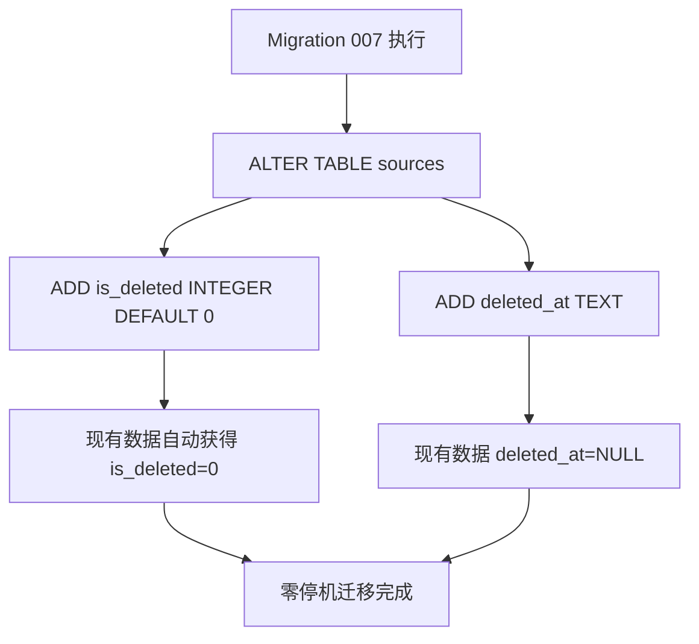
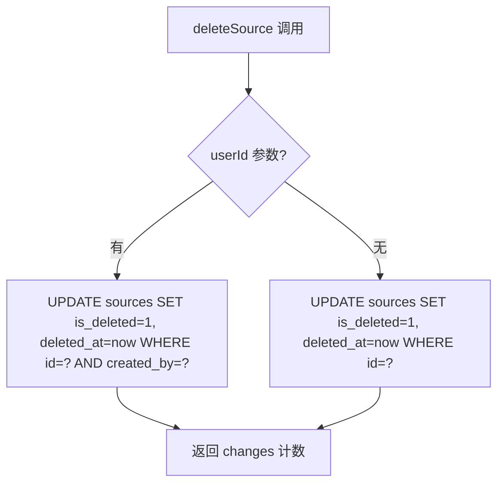
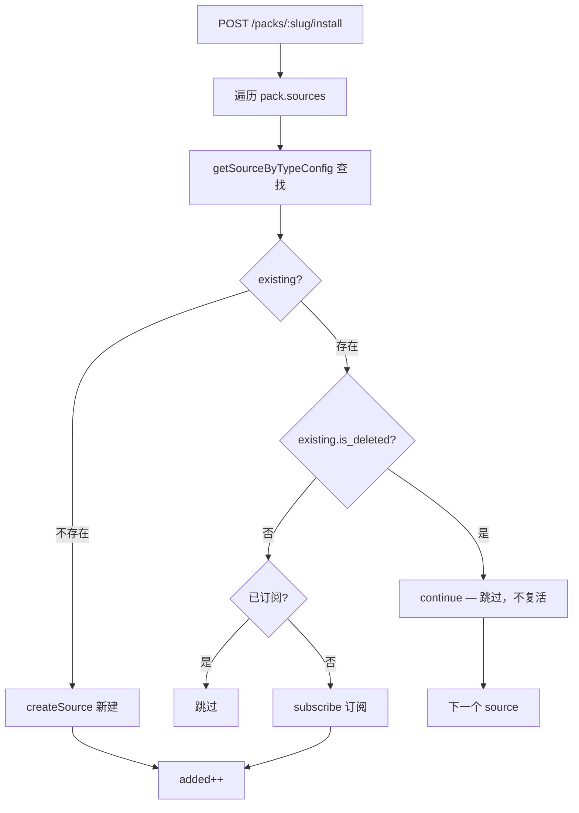

# PD-163.01 ClawFeed — 软删除模式与僵尸数据防护

> 文档编号：PD-163.01
> 来源：ClawFeed `src/db.mjs` `src/server.mjs` `migrations/007_soft_delete.sql`
> GitHub：https://github.com/kevinho/clawfeed
> 问题域：PD-163 软删除模式 Soft Delete Pattern
> 状态：可复用方案

---

## 第 1 章 问题与动机

### 1.1 核心问题

在多用户订阅制系统中，数据删除面临一个根本矛盾：**创建者想删除数据，但订阅者仍持有引用**。

硬删除（`DELETE FROM`）会导致三类问题：

1. **外键断裂** — 订阅关系 `user_subscriptions` 中的 `source_id` 指向不存在的记录，查询报错或返回空
2. **僵尸复活** — Source Pack（预设源集合）安装时，如果按 `type + config` 匹配发现记录不存在，会重新创建已被删除的源，形成"僵尸数据"
3. **审计轨迹丢失** — 无法追溯"谁在什么时候删了什么"，对运营排查和数据合规不利

ClawFeed 是一个 AI 信息聚合工具，用户可以创建信息源（RSS、Twitter、Reddit 等），其他用户可以订阅这些源。Source Pack 机制允许用户打包分享源集合。这种多对多的引用关系使得硬删除代价极高。

### 1.2 ClawFeed 的解法概述

ClawFeed 采用经典的**标志位软删除**方案，但在三个关键点做了工程化处理：

1. **双字段标记** — `is_deleted` (INTEGER 0/1) + `deleted_at` (TEXT ISO 时间戳)，兼顾快速过滤和审计需求（`migrations/007_soft_delete.sql:1-2`）
2. **查询层默认过滤** — `listSources()` 的 WHERE 条件硬编码 `sources.is_deleted = 0`，所有正常查询自动排除已删数据（`src/db.mjs:263`）
3. **Pack 安装防僵尸** — 安装 Pack 时检查 `existing.is_deleted`，已删源直接 `continue` 跳过，不创建也不复活（`src/server.mjs:700-701`）
4. **订阅者感知** — 订阅列表 JOIN 查询携带 `s.is_deleted` 字段，API 层转换为 `sourceDeleted: true` 布尔标记（`src/server.mjs:587`）
5. **前端降级展示** — 已删源在订阅列表中以灰色半透明卡片 + "已停用" 标签展示，禁用交互（`web/index.html:913-925`）

### 1.3 设计思想

| 设计原则 | 具体实现 | 理由 | 替代方案 |
|----------|----------|------|----------|
| UPDATE 替代 DELETE | `deleteSource()` 执行 `UPDATE SET is_deleted=1` | 保留数据完整性，不破坏外键引用 | 物理删除 + 级联 CASCADE |
| 查询层隐式过滤 | `listSources()` 硬编码 `is_deleted = 0` | 防止开发者遗忘过滤条件 | 数据库视图 / ORM 全局 scope |
| 时间戳审计 | `deleted_at = datetime('now')` | 支持"何时删除"的审计查询 | 单独审计日志表 |
| 订阅不级联删除 | 软删后订阅关系保留 | 订阅者可以看到"源已停用"而非莫名消失 | 级联删除订阅关系 |
| 防僵尸检查 | Pack install 检查 `is_deleted` 后 skip | 防止已删源通过 Pack 安装被重新创建 | 物理删除 + 唯一约束 |

---

## 第 2 章 源码实现分析

### 2.1 架构概览

ClawFeed 的软删除涉及 4 层：数据库 Schema → 数据访问层 → API 路由层 → 前端展示层。

```
┌─────────────────────────────────────────────────────────────┐
│                     前端 (web/index.html)                     │
│  renderDeletedSourceCard() → 灰色卡片 + "已停用" 标签         │
│  sourceDeleted 字段驱动 UI 分支                               │
└──────────────────────┬──────────────────────────────────────┘
                       │ GET /api/subscriptions
                       ▼
┌─────────────────────────────────────────────────────────────┐
│                   API 路由 (src/server.mjs)                   │
│  DELETE /sources/:id → deleteSource(db, id, userId)          │
│  GET /subscriptions → subs.map(s => sourceDeleted: !!s.is_deleted) │
│  POST /packs/:slug/install → if(existing.is_deleted) continue │
└──────────────────────┬──────────────────────────────────────┘
                       │
                       ▼
┌─────────────────────────────────────────────────────────────┐
│                  数据访问层 (src/db.mjs)                      │
│  deleteSource()  → UPDATE SET is_deleted=1, deleted_at=now   │
│  listSources()   → WHERE is_deleted = 0 (硬编码)             │
│  listSubscriptions() → JOIN sources, 携带 s.is_deleted       │
│  getSourceByTypeConfig() → 不过滤 is_deleted (故意的)         │
└──────────────────────┬──────────────────────────────────────┘
                       │
                       ▼
┌─────────────────────────────────────────────────────────────┐
│              数据库 Schema (migrations/007_soft_delete.sql)    │
│  ALTER TABLE sources ADD COLUMN is_deleted INTEGER DEFAULT 0  │
│  ALTER TABLE sources ADD COLUMN deleted_at TEXT                │
└─────────────────────────────────────────────────────────────┘
```

### 2.2 核心实现

#### 2.2.1 数据库迁移：双字段软删除标记



对应源码 `migrations/007_soft_delete.sql:1-2`：
```sql
ALTER TABLE sources ADD COLUMN is_deleted INTEGER DEFAULT 0;
ALTER TABLE sources ADD COLUMN deleted_at TEXT;
```

迁移在 `src/db.mjs:76-86` 中以幂等方式执行，每条 ALTER 语句独立 try-catch，`duplicate column` 错误被静默忽略：

```javascript
// src/db.mjs:76-86
// Run soft delete migration (idempotent)
try {
  const sql7 = readFileSync(join(ROOT, 'migrations', '007_soft_delete.sql'), 'utf8');
  for (const stmt of sql7.split(';').map(s => s.trim()).filter(Boolean)) {
    try { _db.exec(stmt + ';'); } catch (e) {
      if (!e.message.includes('duplicate column')) throw e;
    }
  }
} catch (e) {
  if (!e.message.includes('duplicate column')) console.error('Migration 007:', e.message);
}
```

#### 2.2.2 deleteSource：UPDATE 替代 DELETE



对应源码 `src/db.mjs:315-320`：
```javascript
export function deleteSource(db, id, userId) {
  if (userId) {
    return db.prepare("UPDATE sources SET is_deleted = 1, deleted_at = datetime('now') WHERE id = ? AND created_by = ?").run(id, userId);
  }
  return db.prepare("UPDATE sources SET is_deleted = 1, deleted_at = datetime('now') WHERE id = ?").run(id);
}
```

关键设计点：
- `userId` 参数实现**所有权校验**，只有创建者能软删自己的源
- `datetime('now')` 使用 SQLite 内置函数记录 UTC 时间戳
- 无 `userId` 的重载用于管理员/系统级删除

#### 2.2.3 listSources：查询层默认过滤

对应源码 `src/db.mjs:261-278`：
```javascript
export function listSources(db, { activeOnly, userId, includePublic } = {}) {
  let sql = 'SELECT sources.*, users.name as creator_name FROM sources LEFT JOIN users ON sources.created_by = users.id';
  const conditions = ['sources.is_deleted = 0'];  // ← 硬编码过滤
  const params = [];
  if (activeOnly) { conditions.push('is_active = 1'); }
  if (userId && includePublic) {
    conditions.push('(created_by = ? OR is_public = 1)');
    params.push(userId);
  }
  // ...
  if (conditions.length) sql += ' WHERE ' + conditions.join(' AND ');
  sql += ' ORDER BY created_at DESC';
  return db.prepare(sql).all(...params);
}
```

`conditions` 数组初始化时就包含 `sources.is_deleted = 0`，无论调用方传什么参数，已删数据都不会出现在结果中。

#### 2.2.4 Pack 安装防僵尸逻辑



对应源码 `src/server.mjs:693-716`：
```javascript
for (const s of sources) {
  const configStr = typeof s.config === 'string' ? s.config : JSON.stringify(s.config);
  // Check if source already exists (including deleted)
  const existing = getSourceByTypeConfig(db, s.type, configStr);
  if (existing) {
    if (existing.is_deleted) {
      // Soft-deleted → skip, don't resurrect
      continue;
    }
    // Source exists and active — just subscribe if not already
    if (!isSubscribed(db, req.user.id, existing.id)) {
      subscribe(db, req.user.id, existing.id);
      added++;
    }
  } else {
    // Create new source (createSource auto-subscribes)
    createSource(db, { name: s.name, type: s.type, config: configStr, isPublic: 0, createdBy: req.user.id });
    added++;
  }
}
```

注意 `getSourceByTypeConfig()` (`src/db.mjs:322-324`) **故意不过滤 is_deleted**，这样才能检测到已删源并跳过：
```javascript
export function getSourceByTypeConfig(db, type, config) {
  return db.prepare('SELECT * FROM sources WHERE type = ? AND config = ?').get(type, config);
}
```

### 2.3 实现细节

#### 订阅者感知链路

`listSubscriptions()` (`src/db.mjs:371-379`) 通过 JOIN 携带 `s.is_deleted`：
```javascript
export function listSubscriptions(db, userId) {
  return db.prepare(`
    SELECT s.*, us.created_at as subscribed_at, u.name as creator_name, s.is_deleted
    FROM user_subscriptions us
    JOIN sources s ON us.source_id = s.id
    LEFT JOIN users u ON s.created_by = u.id
    WHERE us.user_id = ?
    ORDER BY us.created_at DESC
  `).all(userId);
}
```

API 层 (`src/server.mjs:587`) 将 `is_deleted` 转换为前端友好的布尔字段：
```javascript
return json(res, subs.map(s => ({ ...s, sourceDeleted: !!s.is_deleted })));
```

前端 (`web/index.html:1031-1036`) 根据 `sourceDeleted` 分支渲染：
```javascript
for (const s of subscriptions) {
  if (s.sourceDeleted) {
    html += renderDeletedSourceCard(s);  // 灰色半透明 + "已停用"
  } else {
    html += renderSourceCard(s, { showToggle: true, showUnsub: true });
  }
}
```

`renderDeletedSourceCard()` (`web/index.html:913-925`) 使用 CSS 降级：`opacity:0.4; pointer-events:none; filter:grayscale(1)`，并显示 "⚠️ 已停用/Deactivated" 标签。

#### DELETE 路由的权限校验

`src/server.mjs:670-677` 在调用 `deleteSource` 前做了三重校验：
```javascript
if (req.method === 'DELETE' && sourceMatch) {
  if (!req.user) return json(res, { error: 'login required' }, 401);
  const s = getSource(db, parseInt(sourceMatch[1]));
  if (!s) return json(res, { error: 'not found' }, 404);
  if (s.created_by !== req.user.id) return json(res, { error: 'forbidden' }, 403);
  deleteSource(db, parseInt(sourceMatch[1]), req.user.id);
  return json(res, { ok: true });
}
```

注意 `getSource()` (`src/db.mjs:280-282`) 不过滤 `is_deleted`，这意味着对已删源再次 DELETE 不会报 404，而是幂等地再次 UPDATE（`is_deleted` 已经是 1）。

---

## 第 3 章 迁移指南

### 3.1 迁移清单

#### 阶段 1：数据库层（零停机）

- [ ] 添加 `is_deleted INTEGER DEFAULT 0` 和 `deleted_at TEXT` 列到目标表
- [ ] 确保迁移脚本幂等（`duplicate column` 错误静默忽略）
- [ ] 验证现有数据自动获得 `is_deleted = 0`

#### 阶段 2：数据访问层

- [ ] 将所有 `DELETE FROM table WHERE id = ?` 改为 `UPDATE table SET is_deleted = 1, deleted_at = datetime('now') WHERE id = ?`
- [ ] 在所有列表查询中添加 `is_deleted = 0` 过滤条件
- [ ] 保留至少一个不过滤 `is_deleted` 的查询函数（用于防僵尸检查等场景）
- [ ] 订阅/关联查询中 JOIN 携带 `is_deleted` 字段

#### 阶段 3：API 层

- [ ] DELETE 路由返回值不变（`{ ok: true }`），调用方无感知
- [ ] 关联数据的 GET 接口添加 `sourceDeleted` / `itemDeleted` 等布尔字段
- [ ] Pack/批量安装接口添加已删数据跳过逻辑

#### 阶段 4：前端层

- [ ] 已删关联数据降级展示（灰色、禁用交互、标签提示）
- [ ] 删除操作的 UI 反馈不变（toast "已删除"）

### 3.2 适配代码模板

#### SQLite 迁移脚本

```sql
-- migration_xxx_soft_delete.sql
ALTER TABLE <target_table> ADD COLUMN is_deleted INTEGER DEFAULT 0;
ALTER TABLE <target_table> ADD COLUMN deleted_at TEXT;

-- 可选：为 is_deleted 创建部分索引加速过滤
CREATE INDEX IF NOT EXISTS idx_<target_table>_active
  ON <target_table>(is_deleted) WHERE is_deleted = 0;
```

#### Node.js 数据访问层模板（better-sqlite3）

```javascript
// 软删除函数
export function softDelete(db, table, id, ownerId = null) {
  const sql = ownerId
    ? `UPDATE ${table} SET is_deleted = 1, deleted_at = datetime('now') WHERE id = ? AND created_by = ?`
    : `UPDATE ${table} SET is_deleted = 1, deleted_at = datetime('now') WHERE id = ?`;
  const params = ownerId ? [id, ownerId] : [id];
  return db.prepare(sql).run(...params);
}

// 列表查询（自动过滤已删）
export function listActive(db, table, extraConditions = [], extraParams = []) {
  const conditions = [`${table}.is_deleted = 0`, ...extraConditions];
  const sql = `SELECT * FROM ${table} WHERE ${conditions.join(' AND ')} ORDER BY created_at DESC`;
  return db.prepare(sql).all(...extraParams);
}

// 按唯一键查找（不过滤已删，用于防僵尸）
export function findByUniqueKey(db, table, key, value) {
  return db.prepare(`SELECT * FROM ${table} WHERE ${key} = ?`).get(value);
}

// 防僵尸安装逻辑
export function safeInstall(db, items, userId) {
  let added = 0;
  for (const item of items) {
    const existing = findByUniqueKey(db, 'sources', 'config', item.config);
    if (existing) {
      if (existing.is_deleted) continue;  // 已删 → 跳过
      // 已存在且活跃 → 仅订阅
      subscribeIfNeeded(db, userId, existing.id);
      added++;
    } else {
      createAndSubscribe(db, item, userId);
      added++;
    }
  }
  return added;
}
```

#### 幂等迁移执行器

```javascript
function runIdempotentMigration(db, sqlPath) {
  const sql = readFileSync(sqlPath, 'utf8');
  for (const stmt of sql.split(';').map(s => s.trim()).filter(Boolean)) {
    try {
      db.exec(stmt + ';');
    } catch (e) {
      if (!e.message.includes('duplicate column') &&
          !e.message.includes('already exists')) {
        throw e;
      }
    }
  }
}
```

### 3.3 适用场景

| 场景 | 适用度 | 说明 |
|------|--------|------|
| 多用户订阅制系统 | ⭐⭐⭐ | 核心场景：创建者删除不影响订阅者 |
| 内容聚合/Pack 分享 | ⭐⭐⭐ | 防僵尸复活是关键需求 |
| 单用户 CRUD 应用 | ⭐⭐ | 可用但收益较低，硬删也可接受 |
| 高频写入日志系统 | ⭐ | 软删会导致表膨胀，需定期清理 |
| 合规审计要求 | ⭐⭐⭐ | deleted_at 提供审计轨迹 |
| 数据量极大的表 | ⭐⭐ | 需配合部分索引和定期归档 |

---

## 第 4 章 测试用例

ClawFeed 的 e2e 测试 (`test/e2e.sh`) 包含完整的软删除测试套件（Section 16），以下是基于真实测试用例的 pytest 改写：

```python
import pytest
import requests

BASE = "http://localhost:8767/api"

class TestSoftDelete:
    """基于 ClawFeed test/e2e.sh Section 16 的测试用例"""

    def setup_method(self):
        """创建测试源并让 Bob 订阅"""
        self.source = requests.post(f"{BASE}/sources",
            headers={"Cookie": "session=alice_session"},
            json={"name": "SoftDel Test", "type": "rss",
                  "config": '{"url":"https://softdel.test/rss"}',
                  "isPublic": True}).json()
        self.source_id = self.source["id"]
        # Bob subscribes
        requests.post(f"{BASE}/subscriptions",
            headers={"Cookie": "session=bob_session"},
            json={"sourceId": self.source_id})

    def test_16_1_soft_delete_sets_flag(self):
        """16.1 DELETE → is_deleted=1, 记录仍在数据库中"""
        r = requests.delete(f"{BASE}/sources/{self.source_id}",
            headers={"Cookie": "session=alice_session"})
        assert r.json()["ok"] is True
        # 直接查数据库验证 is_deleted=1（e2e.sh:405-406）
        # 在集成测试中可通过 admin API 或直接 sqlite3 查询

    def test_16_2_deleted_hidden_from_list(self):
        """16.2 已删源不出现在 GET /sources 列表中"""
        requests.delete(f"{BASE}/sources/{self.source_id}",
            headers={"Cookie": "session=alice_session"})
        r = requests.get(f"{BASE}/sources",
            headers={"Cookie": "session=alice_session"})
        names = [s["name"] for s in r.json()]
        assert "SoftDel Test" not in names

    def test_16_3_subscriber_sees_deleted_flag(self):
        """16.3 订阅者看到 sourceDeleted=true"""
        requests.delete(f"{BASE}/sources/{self.source_id}",
            headers={"Cookie": "session=alice_session"})
        r = requests.get(f"{BASE}/subscriptions",
            headers={"Cookie": "session=bob_session"})
        deleted_subs = [s for s in r.json() if s.get("sourceDeleted")]
        assert len(deleted_subs) >= 1

    def test_16_4_pack_install_skips_deleted(self):
        """16.4 Pack 安装跳过已删源，不僵尸复活"""
        requests.delete(f"{BASE}/sources/{self.source_id}",
            headers={"Cookie": "session=alice_session"})
        # 创建包含已删源的 Pack
        pack = requests.post(f"{BASE}/packs",
            headers={"Cookie": "session=alice_session"},
            json={"name": "SoftDel Pack",
                  "sourcesJson": '[{"name":"SoftDel Test","type":"rss","config":"{\\"url\\":\\"https://softdel.test/rss\\"}"}]'
            }).json()
        # Carol 安装 → added=0
        r = requests.post(f"{BASE}/packs/{pack['slug']}/install",
            headers={"Cookie": "session=carol_session"})
        assert r.json()["added"] == 0

    def test_16_5_mixed_pack_partial_install(self):
        """16.5 混合 Pack：跳过已删，只安装活跃源"""
        requests.delete(f"{BASE}/sources/{self.source_id}",
            headers={"Cookie": "session=alice_session"})
        pack = requests.post(f"{BASE}/packs",
            headers={"Cookie": "session=alice_session"},
            json={"name": "Mixed Pack",
                  "sourcesJson": '[{"name":"SoftDel Test","type":"rss","config":"{\\"url\\":\\"https://softdel.test/rss\\"}"},{"name":"Brand New","type":"rss","config":"{\\"url\\":\\"https://new.test/rss\\"}"}]'
            }).json()
        r = requests.post(f"{BASE}/packs/{pack['slug']}/install",
            headers={"Cookie": "session=dave_session"})
        assert r.json()["added"] == 1

    def test_16_7_deleted_not_in_active_count(self):
        """16.7 已删源不计入活跃源列表"""
        requests.delete(f"{BASE}/sources/{self.source_id}",
            headers={"Cookie": "session=alice_session"})
        r = requests.get(f"{BASE}/sources")
        names = [s["name"] for s in r.json()]
        assert "SoftDel Test" not in names

    def test_delete_idempotent(self):
        """重复删除同一源是幂等的"""
        r1 = requests.delete(f"{BASE}/sources/{self.source_id}",
            headers={"Cookie": "session=alice_session"})
        r2 = requests.delete(f"{BASE}/sources/{self.source_id}",
            headers={"Cookie": "session=alice_session"})
        assert r1.json()["ok"] is True
        assert r2.json()["ok"] is True

    def test_subscriber_count_preserved(self):
        """软删后订阅者的订阅数量不变（e2e.sh:377-380）"""
        subs_before = requests.get(f"{BASE}/subscriptions",
            headers={"Cookie": "session=bob_session"}).json()
        requests.delete(f"{BASE}/sources/{self.source_id}",
            headers={"Cookie": "session=alice_session"})
        subs_after = requests.get(f"{BASE}/subscriptions",
            headers={"Cookie": "session=bob_session"}).json()
        assert len(subs_before) == len(subs_after)
```

---

## 第 5 章 跨域关联

| 关联域 | 关系类型 | 说明 |
|--------|----------|------|
| PD-06 记忆持久化 | 协同 | 软删除是持久化策略的一部分，deleted_at 时间戳支持数据生命周期管理 |
| PD-07 质量检查 | 协同 | e2e 测试套件（Section 16）验证软删除的 7 个场景，是质量保障的一环 |
| PD-11 可观测性 | 协同 | deleted_at 字段提供审计轨迹，可接入可观测性系统追踪删除事件 |
| PD-10 中间件管道 | 依赖 | 软删除的查询过滤可以抽象为中间件/拦截器，在管道中统一处理 |
| PD-09 Human-in-the-Loop | 协同 | 前端展示"已停用"标签让用户感知删除状态，是人机交互的一部分 |

---

## 第 6 章 来源文件索引

| 文件 | 行范围 | 关键实现 |
|------|--------|----------|
| `migrations/007_soft_delete.sql` | L1-L2 | 双字段 Schema 定义（is_deleted + deleted_at） |
| `src/db.mjs` | L76-L86 | 幂等迁移执行器，逐语句 try-catch |
| `src/db.mjs` | L261-L278 | `listSources()` 硬编码 `is_deleted = 0` 过滤 |
| `src/db.mjs` | L315-L320 | `deleteSource()` UPDATE 替代 DELETE |
| `src/db.mjs` | L322-L324 | `getSourceByTypeConfig()` 不过滤 is_deleted（防僵尸用） |
| `src/db.mjs` | L371-L379 | `listSubscriptions()` JOIN 携带 is_deleted |
| `src/server.mjs` | L587 | API 层 `sourceDeleted: !!s.is_deleted` 转换 |
| `src/server.mjs` | L670-L677 | DELETE 路由三重权限校验 |
| `src/server.mjs` | L693-L716 | Pack 安装防僵尸逻辑 |
| `web/index.html` | L913-L925 | `renderDeletedSourceCard()` 灰色降级卡片 |
| `web/index.html` | L1031-L1036 | 订阅列表 sourceDeleted 分支渲染 |
| `test/e2e.sh` | L390-L437 | Section 16 软删除完整测试套件（7 个用例） |
| `test/e2e.sh` | L370-L383 | Section 15 源删除级联影响测试 |

---

## 第 7 章 横向对比维度

```json comparison_data
{
  "project": "ClawFeed",
  "dimensions": {
    "删除策略": "标志位软删除：is_deleted + deleted_at 双字段，UPDATE 替代 DELETE",
    "查询过滤": "listSources 硬编码 is_deleted=0，getSourceByTypeConfig 故意不过滤",
    "级联处理": "订阅关系保留不删，JOIN 携带 is_deleted 字段，前端降级展示",
    "防僵尸机制": "Pack 安装时检查 existing.is_deleted，已删源 continue 跳过不复活",
    "审计支持": "deleted_at 记录 UTC 时间戳，迁移幂等可重复执行",
    "前端感知": "sourceDeleted 布尔字段驱动灰色半透明卡片 + 已停用标签"
  }
}
```

### 域元数据补充

```json domain_metadata
{
  "solution_summary": "ClawFeed 用 is_deleted 标志位 + deleted_at 时间戳实现源软删除，Pack 安装时检查已删标记防止僵尸复活，订阅者通过 sourceDeleted 字段感知删除状态",
  "description": "多用户订阅制系统中创建者删除与订阅者引用的矛盾处理",
  "sub_problems": [
    "幂等迁移执行：ALTER TABLE 重复执行的错误静默处理",
    "防僵尸查询设计：部分查询故意不过滤 is_deleted 以支持存在性检查"
  ],
  "best_practices": [
    "迁移脚本逐语句 try-catch，duplicate column 错误静默忽略实现幂等",
    "前端已删数据用 opacity+grayscale+pointer-events:none 降级展示"
  ]
}
```
