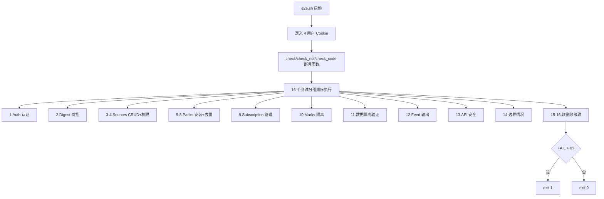
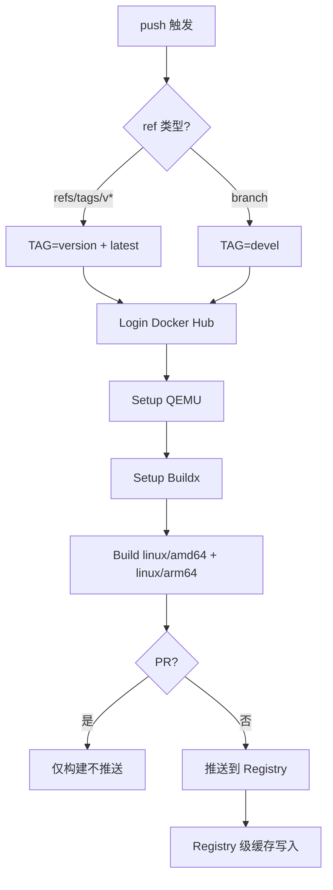

# PD-164.01 ClawFeed — GitHub Actions 三阶段 CI + Docker 多架构构建

> 文档编号：PD-164.01
> 来源：ClawFeed `.github/workflows/ci.yml` `.github/workflows/docker-build.yml` `Dockerfile`
> GitHub：https://github.com/kevinho/clawfeed
> 问题域：PD-164 CI/CD 流水线 CI/CD Pipeline
> 状态：可复用方案

---

## 第 1 章 问题与动机

### 1.1 核心问题

Node.js 全栈项目在持续集成中面临三个典型挑战：

1. **代码质量回归** — 没有自动 lint 检查，风格和低级错误容易混入主分支
2. **E2E 测试环境搭建** — 测试需要真实数据库、种子数据和运行中的服务器，CI 中如何自动化这一切？
3. **多架构容器分发** — 同时支持 amd64（云服务器）和 arm64（Apple Silicon / Raspberry Pi），构建流程如何统一？

ClawFeed 作为一个 SQLite + Node.js 的轻量级 RSS 聚合服务，用两个 GitHub Actions workflow 文件 + 一个 Dockerfile 解决了上述全部问题。

### 1.2 ClawFeed 的解法概述

1. **三阶段并行 CI**（`ci.yml:9-91`）— Lint、Test、Security Audit 三个 job 并行执行，互不阻塞
2. **CI 内自建测试数据库**（`ci.yml:34-47`）— 用 Node.js 内联脚本执行 SQL 迁移创建 DB，再用 `sqlite3` CLI 注入种子数据
3. **Bash E2E 测试套件**（`test/e2e.sh`）— 450 行纯 bash + curl 实现 16 个测试分组、50+ 断言，覆盖认证/CRUD/隔离/安全
4. **Docker 多架构构建**（`docker-build.yml:48-62`）— QEMU + Buildx 交叉编译 amd64/arm64，Registry 级缓存加速
5. **Docker 安全加固**（`Dockerfile:30-43`）— 多阶段构建、非 root 用户、健康检查、最小化镜像

### 1.3 设计思想

| 设计原则 | 具体实现 | 理由 | 替代方案 |
|----------|----------|------|----------|
| 并行优先 | Lint/Test/Audit 三个独立 job | 缩短 CI 总耗时，一个失败不阻塞其他 | 串行 step（慢但简单） |
| 零外部依赖 | SQLite 文件数据库，无需 service container | 无需 PostgreSQL/MySQL 容器，启动快 | `services:` 启动 PG 容器 |
| Bash 原生测试 | curl + grep 断言，无测试框架 | 零依赖，直接测 HTTP 接口 | Jest/Vitest + supertest |
| 智能标签策略 | tag → version+latest，branch → devel | 区分正式发布和开发版本 | 固定 latest 标签 |
| 构建缓存 | Registry 级 cache-from/cache-to | 跨 CI 运行复用层缓存 | GitHub Actions cache |

---

## 第 2 章 源码实现分析

### 2.1 架构概览

ClawFeed 的 CI/CD 由两条独立流水线组成：

```
┌─────────────────────────────────────────────────────────┐
│                    GitHub Actions                        │
│                                                          │
│  push/PR → main,develop                                  │
│  ┌──────────┐  ┌──────────────┐  ┌────────────────┐     │
│  │   Lint   │  │    Test      │  │ Security Audit │     │
│  │ ESLint 9 │  │ DB→Seed→E2E │  │  npm audit     │     │
│  └──────────┘  └──────────────┘  └────────────────┘     │
│       ↓              ↓                  ↓                │
│  [并行执行，互不依赖，任一失败即标红]                      │
├─────────────────────────────────────────────────────────┤
│  push → main, release/**, tags/v*                        │
│  ┌──────────────────────────────────────────────┐       │
│  │           Docker Build & Push                 │       │
│  │  QEMU → Buildx → amd64+arm64 → Docker Hub   │       │
│  │  tag策略: v* → version+latest / branch → dev │       │
│  └──────────────────────────────────────────────┘       │
└─────────────────────────────────────────────────────────┘
```

### 2.2 核心实现

#### 2.2.1 三阶段并行 CI

```mermaid
graph TD
    A[push/PR 触发] --> B[Lint Job]
    A --> C[Test Job]
    A --> D[Audit Job]
    B --> B1[checkout] --> B2[setup-node@v4] --> B3[npm ci] --> B4[npx eslint src/]
    C --> C1[checkout] --> C2[setup-node@v4] --> C3[npm ci]
    C3 --> C4[Node.js 执行 SQL 迁移]
    C4 --> C5[sqlite3 注入种子数据]
    C5 --> C6[后台启动服务器]
    C6 --> C7[轮询健康检查 15s]
    C7 --> C8[bash test/e2e.sh]
    C8 --> C9[kill 服务器]
    D --> D1[checkout] --> D2[setup-node@v4] --> D3[npm audit --omit=dev]
```

对应源码 `.github/workflows/ci.yml:1-91`：

```yaml
name: CI

on:
  push:
    branches: [main, develop]
  pull_request:
    branches: [main, develop]

jobs:
  lint:
    name: Lint
    runs-on: ubuntu-latest
    steps:
      - uses: actions/checkout@v4
      - uses: actions/setup-node@v4
        with:
          node-version: 20
      - run: npm ci
      - run: npx eslint src/

  test:
    name: Test
    runs-on: ubuntu-latest
    steps:
      - uses: actions/checkout@v4
      - uses: actions/setup-node@v4
        with:
          node-version: 20
      - run: npm ci
      - name: Start server & run e2e tests
        run: |
          mkdir -p data
          node -e "
            const { createRequire } = require('module');
            const require2 = createRequire(process.cwd() + '/');
            const Database = require2('better-sqlite3');
            const fs = require('fs');
            const path = require('path');
            const db = new Database('data/test.db');
            const migrationsDir = path.join(process.cwd(), 'migrations');
            const files = fs.readdirSync(migrationsDir)
              .filter(f => f.endsWith('.sql')).sort();
            for (const f of files) {
              db.exec(fs.readFileSync(path.join(migrationsDir, f), 'utf8'));
            }
            db.close();
          "
          sqlite3 data/test.db < test/seed.sql
          DIGEST_DB=data/test.db DIGEST_PORT=8767 API_KEY=test-key-ci \
            SESSION_SECRET=test-secret-ci node src/server.mjs &
          SERVER_PID=$!
          # 轮询健康检查，最多 15 秒
          SERVER_READY=false
          for i in $(seq 1 15); do
            if curl -sf http://localhost:8767/api/health > /dev/null 2>&1; then
              SERVER_READY=true; break
            fi
            sleep 1
          done
          if [ "$SERVER_READY" != "true" ]; then
            echo "ERROR: Server failed to start within 15s"
            kill $SERVER_PID 2>/dev/null || true; exit 1
          fi
          AI_DIGEST_API=http://localhost:8767/api \
            AI_DIGEST_FEED=http://localhost:8767/feed \
            AI_DIGEST_DB=data/test.db API_KEY=test-key-ci \
            bash test/e2e.sh
          kill $SERVER_PID 2>/dev/null || true

  audit:
    name: Security Audit
    runs-on: ubuntu-latest
    steps:
      - uses: actions/checkout@v4
      - uses: actions/setup-node@v4
        with:
          node-version: 20
      - run: npm audit --omit=dev || true
```

关键设计点：
- **三 job 并行**：`lint`、`test`、`audit` 之间无 `needs:` 依赖，GitHub Actions 自动并行调度
- **内联 Node.js 迁移**（`ci.yml:34-47`）：用 `node -e` 直接执行迁移脚本，避免额外的 migration CLI 工具
- **健康检查轮询**（`ci.yml:59-71`）：`for i in $(seq 1 15)` 循环 curl 检测 `/api/health`，15 秒超时自动失败
- **安全审计容错**（`ci.yml:90`）：`npm audit --omit=dev || true` 只审计生产依赖，且不阻塞 CI（信息性检查）

#### 2.2.2 Bash E2E 测试框架



对应源码 `test/e2e.sh:1-57`（断言框架核心）：

```bash
#!/bin/bash
set -e

API="${AI_DIGEST_API:-https://digest.kevinhe.io/api}"
FEED="${AI_DIGEST_FEED:-https://digest.kevinhe.io/feed}"
ALICE="Cookie: session=test-sess-alice"
BOB="Cookie: session=test-sess-bob"
CAROL="Cookie: session=test-sess-carol"
DAVE="Cookie: session=test-sess-dave"
PASS=0; FAIL=0; TOTAL=0; SKIP=0

check() {
  TOTAL=$((TOTAL+1))
  local desc="$1" expected="$2" actual="$3"
  if echo "$actual" | grep -qF "$expected"; then
    PASS=$((PASS+1))
    printf "  ✅ %s\n" "$desc"
  else
    FAIL=$((FAIL+1))
    printf "  ❌ %s\n" "$desc"
    printf "     expected: %s\n" "$expected"
    printf "     got: %.120s\n" "$actual"
  fi
}

check_code() {
  TOTAL=$((TOTAL+1))
  local desc="$1" expected="$2" actual="$3"
  if [ "$actual" = "$expected" ]; then
    PASS=$((PASS+1))
    printf "  ✅ %s → %s\n" "$desc" "$actual"
  else
    FAIL=$((FAIL+1))
    printf "  ❌ %s → got %s, expected %s\n" "$desc" "$actual" "$expected"
  fi
}
```

关键设计点：
- **三种断言函数**（`e2e.sh:20-56`）：`check`（包含匹配）、`check_not`（排除匹配）、`check_code`（HTTP 状态码精确匹配）
- **多用户隔离测试**（`e2e.sh:14-17`）：4 个预设 Cookie 模拟 Alice/Bob/Carol/Dave，验证数据隔离
- **Python 内联 JSON 解析**（`e2e.sh:58-59`）：`jq_val` 和 `jq_len` 用 python3 替代 jq，减少 CI 依赖
- **16 个测试分组**覆盖：认证、CRUD、权限、Pack 安装去重、订阅管理、书签隔离、Feed 输出、API 安全、边界情况、软删除级联

### 2.3 实现细节

#### Docker 多架构构建与智能标签



对应源码 `docker-build.yml:26-62`：

```yaml
- name: Determine Docker Tags
  id: docker_tags
  run: |
    TAGS=""
    if [[ "${{ github.ref }}" == refs/tags/v* ]]; then
      TAG_VERSION=${GITHUB_REF#refs/tags/}
      TAGS="${{ env.REGISTRY }}/${{ env.IMAGE_NAME }}:${TAG_VERSION},${{ env.REGISTRY }}/${{ env.IMAGE_NAME }}:latest"
    else
      TAGS="${{ env.REGISTRY }}/${{ env.IMAGE_NAME }}:devel"
    fi
    echo "TAGS=$TAGS" >> $GITHUB_OUTPUT

- name: Build and push
  uses: docker/build-push-action@v6
  with:
    context: .
    platforms: linux/amd64,linux/arm64
    push: ${{ github.event_name != 'pull_request' }}
    tags: ${{ steps.docker_tags.outputs.TAGS }}
    cache-from: type=registry,ref=${{ env.REGISTRY }}/${{ env.IMAGE_NAME }}:buildcache
    cache-to: type=registry,ref=${{ env.REGISTRY }}/${{ env.IMAGE_NAME }}:buildcache,mode=max
```

#### Dockerfile 多阶段构建

对应源码 `Dockerfile:1-45`：

```dockerfile
# Build stage — 包含编译工具链
FROM node:20-alpine AS builder
WORKDIR /app
RUN apk add --no-cache python3 make g++
COPY package*.json ./
RUN npm ci --only=production
COPY src/ ./src/
COPY migrations/ ./migrations/
COPY templates/ ./templates/
COPY web/ ./web/

# Production stage — 最小化运行时
FROM node:20-alpine
WORKDIR /app
COPY --from=builder /app ./
RUN mkdir -p /app/data && chown -R node:node /app
USER node
ENV NODE_ENV=production
EXPOSE 8767
HEALTHCHECK --interval=30s --timeout=3s --start-period=5s --retries=3 \
    CMD wget -q --spider http://localhost:8767/ || exit 1
CMD ["node", "src/server.mjs"]
```

关键设计点：
- **Builder 阶段安装编译工具**（`Dockerfile:7`）：`python3 make g++` 仅用于编译 `better-sqlite3` 的 native addon
- **Production 阶段无编译工具**（`Dockerfile:22`）：`COPY --from=builder` 只拷贝编译产物，镜像体积大幅缩小
- **非 root 运行**（`Dockerfile:33`）：`USER node` 使用 Alpine 内置的 node 用户
- **健康检查**（`Dockerfile:42-43`）：`wget --spider` 轻量探测，30s 间隔 + 5s 启动宽限期


---

## 第 3 章 迁移指南

### 3.1 迁移清单

**阶段 1：CI 基础（Lint + Audit）**

- [ ] 创建 `.github/workflows/ci.yml`
- [ ] 配置 ESLint flat config（`eslint.config.mjs`）
- [ ] 添加 `npm audit --omit=dev` 安全审计 job
- [ ] 设置触发分支（main + develop）

**阶段 2：E2E 测试集成**

- [ ] 编写 `test/seed.sql` 种子数据（覆盖多用户场景）
- [ ] 编写 `test/e2e.sh` 断言脚本（复用 check/check_not/check_code 三函数模式）
- [ ] CI 中添加 DB 创建 + 迁移 + 种子注入步骤
- [ ] 添加服务器后台启动 + 健康检查轮询
- [ ] 配置环境变量注入（DB 路径、端口、API Key）

**阶段 3：Docker 多架构构建**

- [ ] 编写多阶段 `Dockerfile`（builder + production）
- [ ] 创建 `.dockerignore`（排除 test/、.git/、data/、.env）
- [ ] 创建 `.github/workflows/docker-build.yml`
- [ ] 配置 Docker Hub secrets（`DOCKERHUB_USERNAME`、`DOCKERHUB_TOKEN`）
- [ ] 设置 QEMU + Buildx 交叉编译
- [ ] 配置 Registry 级构建缓存

### 3.2 适配代码模板

#### 模板 1：通用 Bash E2E 断言框架

可直接复用到任何 HTTP API 项目：

```bash
#!/bin/bash
set -e

API="${API_BASE:-http://localhost:3000/api}"
PASS=0; FAIL=0; TOTAL=0

# 包含匹配断言
check() {
  TOTAL=$((TOTAL+1))
  local desc="$1" expected="$2" actual="$3"
  if echo "$actual" | grep -qF "$expected"; then
    PASS=$((PASS+1)); printf "  ✅ %s\n" "$desc"
  else
    FAIL=$((FAIL+1)); printf "  ❌ %s\n" "$desc"
    printf "     expected: %s\n     got: %.120s\n" "$expected" "$actual"
  fi
}

# 排除匹配断言（数据隔离验证）
check_not() {
  TOTAL=$((TOTAL+1))
  local desc="$1" forbidden="$2" actual="$3"
  if echo "$actual" | grep -qF "$forbidden"; then
    FAIL=$((FAIL+1)); printf "  ❌ %s (found: %s)\n" "$desc" "$forbidden"
  else
    PASS=$((PASS+1)); printf "  ✅ %s\n" "$desc"
  fi
}

# HTTP 状态码断言
check_code() {
  TOTAL=$((TOTAL+1))
  local desc="$1" expected="$2" actual="$3"
  if [ "$actual" = "$expected" ]; then
    PASS=$((PASS+1)); printf "  ✅ %s → %s\n" "$desc" "$actual"
  else
    FAIL=$((FAIL+1)); printf "  ❌ %s → got %s, expected %s\n" "$desc" "$actual" "$expected"
  fi
}

# 无 jq 依赖的 JSON 解析
jq_val() { python3 -c "import sys,json; d=json.load(sys.stdin); print($1)" 2>/dev/null; }
jq_len() { python3 -c "import sys,json; print(len(json.load(sys.stdin)))" 2>/dev/null; }

# ── 测试用例 ──
echo "─── Auth ───"
check "Health check" '"status":"ok"' "$(curl -s "$API/health")"
check_code "Unauthorized → 401" "401" \
  "$(curl -s -o /dev/null -w '%{http_code}' "$API/protected")"

# ── 结果汇总 ──
echo ""
printf "Results: %d/%d passed" "$PASS" "$TOTAL"
[ "$FAIL" -gt 0 ] && printf ", %d failed" "$FAIL"
echo ""
[ "$FAIL" -gt 0 ] && exit 1 || exit 0
```

#### 模板 2：CI 中 SQLite 数据库自动创建

```yaml
# .github/workflows/ci.yml — test job 中的 DB 创建步骤
- name: Create test DB and run E2E
  run: |
    mkdir -p data
    # 方式 1：Node.js 执行 SQL 迁移文件
    node -e "
      const Database = require('better-sqlite3');
      const fs = require('fs');
      const path = require('path');
      const db = new Database('data/test.db');
      const files = fs.readdirSync('migrations')
        .filter(f => f.endsWith('.sql')).sort();
      for (const f of files) {
        db.exec(fs.readFileSync(path.join('migrations', f), 'utf8'));
      }
      db.close();
    "
    # 注入种子数据
    sqlite3 data/test.db < test/seed.sql
    # 启动服务器
    DB_PATH=data/test.db PORT=8080 node src/server.mjs &
    # 等待就绪
    for i in $(seq 1 15); do
      curl -sf http://localhost:8080/health > /dev/null 2>&1 && break
      sleep 1
    done
    # 运行测试
    API_BASE=http://localhost:8080/api bash test/e2e.sh
```

#### 模板 3：多架构 Docker 构建 workflow

```yaml
# .github/workflows/docker.yml
name: Docker Build
on:
  push:
    tags: ['v*']
    branches: [main]

env:
  REGISTRY: docker.io
  IMAGE_NAME: ${{ secrets.DOCKERHUB_USERNAME }}/${{ github.event.repository.name }}

jobs:
  docker:
    runs-on: ubuntu-latest
    steps:
      - uses: actions/checkout@v4
      - uses: docker/setup-qemu-action@v3
      - uses: docker/setup-buildx-action@v3
      - uses: docker/login-action@v3
        if: github.event_name != 'pull_request'
        with:
          registry: ${{ env.REGISTRY }}
          username: ${{ secrets.DOCKERHUB_USERNAME }}
          password: ${{ secrets.DOCKERHUB_TOKEN }}
      - uses: docker/build-push-action@v6
        with:
          context: .
          platforms: linux/amd64,linux/arm64
          push: ${{ github.event_name != 'pull_request' }}
          tags: ${{ env.REGISTRY }}/${{ env.IMAGE_NAME }}:latest
          cache-from: type=registry,ref=${{ env.REGISTRY }}/${{ env.IMAGE_NAME }}:buildcache
          cache-to: type=registry,ref=${{ env.REGISTRY }}/${{ env.IMAGE_NAME }}:buildcache,mode=max
```

### 3.3 适用场景

| 场景 | 适用度 | 说明 |
|------|--------|------|
| Node.js + SQLite 全栈项目 | ⭐⭐⭐ | 完美匹配，零外部依赖 CI |
| Node.js + PostgreSQL 项目 | ⭐⭐ | 需改用 `services:` 启动 PG 容器 |
| 纯前端 SPA 项目 | ⭐⭐ | Lint + Audit 可复用，E2E 需改用 Playwright |
| Python/Go 后端项目 | ⭐⭐ | Bash E2E 框架通用，Dockerfile 需重写 |
| 需要 ARM 部署的项目 | ⭐⭐⭐ | QEMU + Buildx 方案直接可用 |
| 微服务多仓库 | ⭐ | 每个仓库需独立配置，无编排能力 |

---

## 第 4 章 测试用例

```python
"""
基于 ClawFeed CI/CD 实现的测试用例
验证 CI 配置正确性和 Docker 构建安全性
"""
import subprocess
import yaml
import json
import os
import pytest


class TestCIWorkflowStructure:
    """验证 ci.yml 的结构正确性"""

    @pytest.fixture
    def ci_config(self):
        with open('.github/workflows/ci.yml') as f:
            return yaml.safe_load(f)

    def test_three_parallel_jobs(self, ci_config):
        """CI 必须包含 lint/test/audit 三个 job"""
        jobs = ci_config['jobs']
        assert 'lint' in jobs
        assert 'test' in jobs
        assert 'audit' in jobs

    def test_no_job_dependencies(self, ci_config):
        """三个 job 之间不应有 needs 依赖（并行执行）"""
        for job_name in ['lint', 'test', 'audit']:
            job = ci_config['jobs'][job_name]
            assert 'needs' not in job, f"{job_name} should not depend on other jobs"

    def test_trigger_branches(self, ci_config):
        """CI 应在 main 和 develop 分支触发"""
        push_branches = ci_config['on']['push']['branches']
        assert 'main' in push_branches
        assert 'develop' in push_branches

    def test_node_version_consistent(self, ci_config):
        """所有 job 使用相同的 Node.js 版本"""
        versions = set()
        for job in ci_config['jobs'].values():
            for step in job['steps']:
                if step.get('uses', '').startswith('actions/setup-node'):
                    versions.add(step['with']['node-version'])
        assert len(versions) == 1, f"Inconsistent Node versions: {versions}"


class TestDockerSecurity:
    """验证 Dockerfile 安全配置"""

    @pytest.fixture
    def dockerfile_content(self):
        with open('Dockerfile') as f:
            return f.read()

    def test_multi_stage_build(self, dockerfile_content):
        """必须使用多阶段构建"""
        assert dockerfile_content.count('FROM ') >= 2

    def test_non_root_user(self, dockerfile_content):
        """生产阶段必须使用非 root 用户"""
        assert 'USER node' in dockerfile_content

    def test_healthcheck_present(self, dockerfile_content):
        """必须包含 HEALTHCHECK 指令"""
        assert 'HEALTHCHECK' in dockerfile_content

    def test_no_secrets_in_dockerfile(self, dockerfile_content):
        """Dockerfile 中不应包含硬编码密钥"""
        for keyword in ['password', 'secret', 'api_key', 'token']:
            assert keyword.lower() not in dockerfile_content.lower(), \
                f"Potential secret found: {keyword}"

    def test_production_env(self, dockerfile_content):
        """生产阶段应设置 NODE_ENV=production"""
        assert 'NODE_ENV=production' in dockerfile_content


class TestDockerignore:
    """验证 .dockerignore 排除敏感文件"""

    @pytest.fixture
    def dockerignore_patterns(self):
        with open('.dockerignore') as f:
            return [l.strip() for l in f if l.strip() and not l.startswith('#')]

    def test_excludes_env(self, dockerignore_patterns):
        """必须排除 .env 文件"""
        assert any('.env' in p for p in dockerignore_patterns)

    def test_excludes_git(self, dockerignore_patterns):
        """必须排除 .git 目录"""
        assert any('.git' in p for p in dockerignore_patterns)

    def test_excludes_test(self, dockerignore_patterns):
        """必须排除测试文件"""
        assert any('test' in p.lower() for p in dockerignore_patterns)

    def test_excludes_data(self, dockerignore_patterns):
        """必须排除数据库文件"""
        assert any('data' in p or '*.db' in p for p in dockerignore_patterns)


class TestE2ETestFramework:
    """验证 E2E 测试脚本的健壮性"""

    def test_e2e_script_executable(self):
        """e2e.sh 应该可执行"""
        result = subprocess.run(
            ['bash', '-n', 'test/e2e.sh'],
            capture_output=True, text=True
        )
        assert result.returncode == 0, f"Syntax error: {result.stderr}"

    def test_e2e_uses_set_e(self):
        """e2e.sh 应使用 set -e 确保错误退出"""
        with open('test/e2e.sh') as f:
            content = f.read()
        assert 'set -e' in content

    def test_e2e_has_exit_code(self):
        """e2e.sh 应根据测试结果返回正确退出码"""
        with open('test/e2e.sh') as f:
            content = f.read()
        assert 'exit 1' in content
        assert 'exit 0' in content

    def test_seed_data_has_multiple_users(self):
        """种子数据应包含多个测试用户"""
        with open('test/seed.sql') as f:
            content = f.read()
        assert content.count('INSERT INTO users') >= 1
        assert 'alice' in content.lower()
        assert 'bob' in content.lower()
```


---

## 第 5 章 跨域关联

| 关联域 | 关系类型 | 说明 |
|--------|----------|------|
| PD-07 质量检查 | 协同 | CI 的 Lint + E2E 是 PD-07 质量保障的自动化落地，E2E 测试覆盖了 CRUD 正确性、数据隔离、权限控制 |
| PD-05 沙箱隔离 | 协同 | Docker 非 root 用户 + 多阶段构建是运行时沙箱隔离的容器化实现 |
| PD-161 E2E 测试 | 依赖 | CI 的 test job 直接调用 `test/e2e.sh`，E2E 测试框架是 CI 的核心依赖 |
| PD-163 软删除 | 协同 | E2E 测试的第 15-16 分组专门验证软删除级联行为，CI 保障软删除逻辑不回归 |
| PD-155 认证会话 | 协同 | E2E 测试通过预设 Cookie 模拟多用户会话，CI 中自动验证认证和权限隔离 |
| PD-158 SSRF 防护 | 协同 | CI 安全审计（npm audit）可发现依赖中的安全漏洞，与 SSRF 防护形成纵深防御 |

---

## 第 6 章 来源文件索引

| 文件 | 行范围 | 关键实现 |
|------|--------|----------|
| `.github/workflows/ci.yml` | L1-L91 | 三阶段并行 CI：Lint + E2E Test + Security Audit |
| `.github/workflows/ci.yml` | L34-L47 | Node.js 内联脚本执行 SQL 迁移创建测试 DB |
| `.github/workflows/ci.yml` | L49-L50 | sqlite3 CLI 注入种子数据 |
| `.github/workflows/ci.yml` | L53-L56 | 后台启动服务器 + 环境变量注入 |
| `.github/workflows/ci.yml` | L59-L71 | 健康检查轮询（15s 超时） |
| `.github/workflows/docker-build.yml` | L1-L63 | Docker 多架构构建 + 智能标签策略 |
| `.github/workflows/docker-build.yml` | L27-L38 | tag/branch 条件标签生成 |
| `.github/workflows/docker-build.yml` | L54-L62 | Buildx 多平台构建 + Registry 缓存 |
| `Dockerfile` | L1-L19 | Builder 阶段：编译工具链 + 依赖安装 |
| `Dockerfile` | L22-L45 | Production 阶段：非 root + 健康检查 |
| `test/e2e.sh` | L1-L57 | Bash E2E 断言框架（check/check_not/check_code） |
| `test/e2e.sh` | L67-L91 | 认证 + 公开浏览测试 |
| `test/e2e.sh` | L93-L143 | Sources CRUD + 权限隔离测试 |
| `test/e2e.sh` | L236-L291 | Marks 书签 CRUD + 用户数据隔离测试 |
| `test/e2e.sh` | L370-L438 | 软删除级联 + Pack 安装跳过已删除源 |
| `test/seed.sql` | L1-L24 | 5 用户 + 4 会话 + 3 摘要种子数据 |
| `.dockerignore` | L1-L40 | 排除 .env/test/data/.git 等敏感文件 |
| `eslint.config.mjs` | L1-L37 | ESLint 9 flat config，7 条规则 |
| `package.json` | L8-L11 | npm scripts：lint/test 命令定义 |

---

## 第 7 章 横向对比维度

```json comparison_data
{
  "project": "ClawFeed",
  "dimensions": {
    "CI 架构": "GitHub Actions 三 job 并行（Lint+E2E+Audit），无 job 间依赖",
    "测试策略": "450 行纯 Bash + curl E2E，16 分组 50+ 断言，零测试框架依赖",
    "DB 测试环境": "CI 内 Node.js 内联迁移 + sqlite3 CLI 种子注入，无 service container",
    "容器构建": "QEMU + Buildx 双架构（amd64+arm64），Registry 级缓存",
    "安全加固": "多阶段构建 + 非 root USER + HEALTHCHECK + npm audit",
    "标签策略": "tag → version+latest，branch → devel，PR 仅构建不推送"
  }
}
```

### 域元数据补充

```json domain_metadata
{
  "solution_summary": "ClawFeed 用 GitHub Actions 三 job 并行 CI（Lint+E2E+Audit）+ QEMU/Buildx 双架构 Docker 构建，CI 内 Node.js 内联迁移创建 SQLite 测试 DB 并运行 450 行 Bash E2E 套件",
  "description": "CI 中零外部依赖的测试环境自建与纯 Bash E2E 断言框架设计",
  "sub_problems": [
    "CI 内服务器健康检查轮询与超时处理",
    "Docker 构建缓存策略（Registry 级 vs GitHub Actions 级）",
    "Docker 标签语义化（release vs development vs PR）"
  ],
  "best_practices": [
    "用 Node.js 内联脚本执行 SQL 迁移避免额外 CLI 工具",
    "Registry 级 cache-from/cache-to 跨 CI 运行复用构建层",
    "PR 触发构建但不推送镜像（push 条件守卫）",
    ".dockerignore 排除 test/.env/.git/data 防止敏感文件泄入镜像"
  ]
}
```

