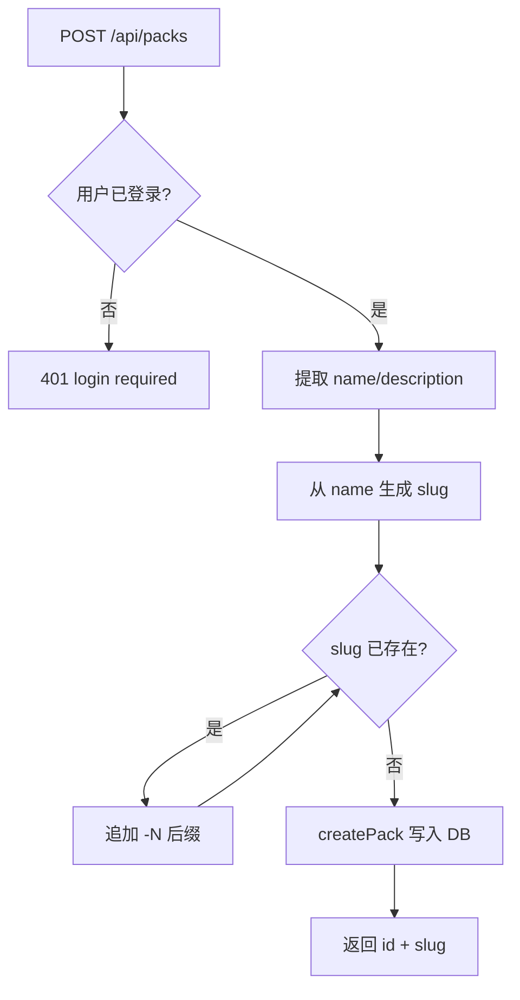
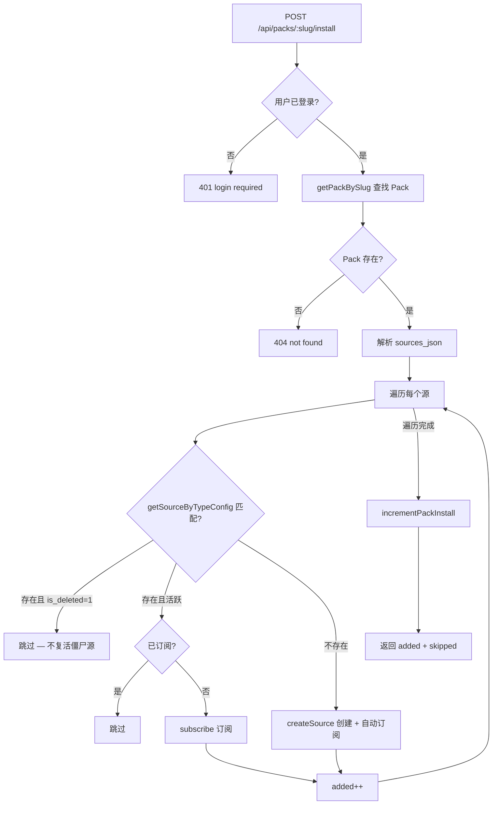

# PD-165.01 ClawFeed — Source Pack 打包分享与一键安装

> 文档编号：PD-165.01
> 来源：ClawFeed `src/server.mjs` `src/db.mjs` `migrations/005_source_packs.sql`
> GitHub：https://github.com/kevinho/clawfeed
> 问题域：PD-165 Source Pack 分享机制 Content Pack Sharing
> 状态：可复用方案

---

## 第 1 章 问题与动机

### 1.1 核心问题

信息聚合类应用中，用户花大量时间手动添加和配置信息源（RSS、Twitter、Reddit 等）。新用户面临"冷启动"困境——不知道该关注哪些源，也没有快速获取高质量源集合的途径。同时，资深用户积累的优质源列表无法便捷地分享给他人。

这个问题的本质是：**用户策展的信息源配置是一种有价值的知识资产，需要打包、分发和复用的机制。**

### 1.2 ClawFeed 的解法概述

ClawFeed 实现了一套完整的 Source Pack 分享机制，核心设计：

1. **JSON 快照打包**：将用户创建的活跃源序列化为 `sources_json` 存入 `source_packs` 表，快照包含 `name/type/config` 三元组（`src/server.mjs:726-740`）
2. **Slug 路由 + 唯一性保证**：Pack 通过人类可读的 slug 访问（如 `/pack/kevins-ai-sources`），slug 冲突时自动追加数字后缀（`src/server.mjs:733-735`）
3. **安装时 type+config 去重**：安装 Pack 时逐源检查 `getSourceByTypeConfig`，已存在的源只做订阅不重复创建（`src/server.mjs:694-716`）
4. **软删源跳过**：安装时遇到已软删除的源直接 skip，不会"复活"僵尸源（`src/server.mjs:700-702`）
5. **安装计数统计**：每次安装原子递增 `install_count`，用于 Pack 市场排序（`src/server.mjs:715`）

### 1.3 设计思想

| 设计原则 | 具体实现 | 理由 | 替代方案 |
|----------|----------|------|----------|
| 快照而非引用 | `sources_json` 存储源的完整副本 | Pack 创建后源可能被删改，快照保证 Pack 内容不变 | 存 source_id 数组（会因源删除而失效） |
| 幂等安装 | type+config 去重 + 已订阅检查 | 用户可多次安装同一 Pack 不产生副作用 | 记录已安装 Pack ID（无法处理跨 Pack 重复源） |
| Slug 路由 | 从 name 生成 slug，冲突追加数字 | 人类可读 URL 便于分享传播 | 用 UUID（不可读，不利于 SEO 和分享） |
| 软删感知 | 安装时跳过 `is_deleted=1` 的源 | 尊重用户删除意图，防止僵尸源复活 | 无视删除状态（违反用户预期） |
| 创建者自动订阅 | `createSource` 内部自动 `INSERT OR IGNORE` 订阅 | 减少安装后的手动操作 | 安装后手动订阅（多一步操作） |

---

## 第 2 章 源码实现分析

### 2.1 架构概览

ClawFeed 的 Source Pack 系统由三层构成：数据层（SQLite + migrations）、业务层（db.mjs CRUD）、API 层（server.mjs REST endpoints）。

```
┌─────────────────────────────────────────────────────┐
│                   Frontend (SPA)                     │
│  PackMarket ─── PackDetail ─── CreatePackModal       │
│       │              │               │               │
│  GET /api/packs  GET /api/packs/:slug  POST /api/packs│
└──────┬───────────────┬───────────────┬───────────────┘
       │               │               │
┌──────▼───────────────▼───────────────▼───────────────┐
│                  server.mjs (API Layer)               │
│  listPacks ── getPackBySlug ── createPack ── install  │
│       │              │               │          │     │
└──────┬───────────────┬───────────────┬──────────┬─────┘
       │               │               │          │
┌──────▼───────────────▼───────────────▼──────────▼─────┐
│                   db.mjs (Data Layer)                  │
│  listPacks ── getPackBySlug ── createPack             │
│  getSourceByTypeConfig ── createSource ── subscribe   │
│  incrementPackInstall ── isSubscribed                 │
└──────┬────────────────────────────────────────────────┘
       │
┌──────▼────────────────────────────────────────────────┐
│              SQLite (source_packs + sources)           │
│  005_source_packs.sql ── 003_sources.sql              │
│  006_subscriptions.sql ── 007_soft_delete.sql         │
└───────────────────────────────────────────────────────┘
```

### 2.2 核心实现

#### 2.2.1 Pack 创建与 Slug 生成



对应源码 `src/server.mjs:726-740`：

```javascript
if (req.method === 'POST' && path === '/api/packs') {
  if (!req.user) return json(res, { error: 'login required' }, 401);
  const body = await parseBody(req);
  const name = (body.name || '').trim();
  if (!name) return json(res, { error: 'name required' }, 400);
  let slug = body.slug || name.toLowerCase().replace(/[^a-z0-9]+/g, '-').replace(/^-|-$/g, '').slice(0, 50);
  // Ensure unique slug
  let candidate = slug;
  let i = 1;
  while (getPackBySlug(db, candidate)) { candidate = slug + '-' + (i++); }
  slug = candidate;
  const sourcesJson = body.sourcesJson || body.sources_json || '[]';
  const result = createPack(db, { name, description: body.description || '', slug, sourcesJson, createdBy: req.user.id });
  return json(res, { ...result, slug }, 201);
}
```

Slug 生成策略：先将 name 转小写，去除非字母数字字符替换为 `-`，截断到 50 字符。冲突时追加 `-1`、`-2`... 直到唯一。这与用户 slug 生成（`db.mjs:110-113`）使用相同模式。

#### 2.2.2 Pack 安装与去重逻辑



对应源码 `src/server.mjs:689-717`：

```javascript
if (req.method === 'POST' && packInstallMatch) {
  if (!req.user) return json(res, { error: 'login required' }, 401);
  const pack = getPackBySlug(db, packInstallMatch[1]);
  if (!pack) return json(res, { error: 'not found' }, 404);
  const sources = JSON.parse(pack.sources_json || '[]');
  let added = 0;
  for (const s of sources) {
    const configStr = typeof s.config === 'string' ? s.config : JSON.stringify(s.config);
    // Check if source already exists (including deleted)
    const existing = getSourceByTypeConfig(db, s.type, configStr);
    if (existing) {
      if (existing.is_deleted) {
        // Soft-deleted → skip, don't resurrect
        continue;
      }
      // Source exists and active — just subscribe if not already
      if (!isSubscribed(db, req.user.id, existing.id)) {
        subscribe(db, req.user.id, existing.id);
        added++;
      }
    } else {
      // Create new source (createSource auto-subscribes)
      createSource(db, { name: s.name, type: s.type, config: configStr, isPublic: 0, createdBy: req.user.id });
      added++;
    }
  }
  incrementPackInstall(db, pack.id);
  return json(res, { ok: true, added, skipped: sources.length - added });
}
```

去重的关键在 `getSourceByTypeConfig`（`db.mjs:322-324`）：

```javascript
export function getSourceByTypeConfig(db, type, config) {
  return db.prepare('SELECT * FROM sources WHERE type = ? AND config = ?').get(type, config);
}
```

这里用 `type + config` 的精确字符串匹配作为源的唯一标识。`config` 是 JSON 字符串，所以字段顺序必须一致才能匹配——这是一个隐含约束。

### 2.3 实现细节

#### 数据库 Schema

`migrations/005_source_packs.sql:1-12` 定义了 Pack 表：

```sql
CREATE TABLE IF NOT EXISTS source_packs (
  id INTEGER PRIMARY KEY AUTOINCREMENT,
  name TEXT NOT NULL,
  description TEXT,
  slug TEXT UNIQUE,
  sources_json TEXT NOT NULL,
  created_by INTEGER REFERENCES users(id),
  is_public INTEGER DEFAULT 1,
  install_count INTEGER DEFAULT 0,
  created_at TEXT DEFAULT (datetime('now')),
  updated_at TEXT DEFAULT (datetime('now'))
);
```

关键设计点：
- `slug TEXT UNIQUE`：数据库层面保证 slug 唯一性，应用层的 while 循环是第一道防线
- `sources_json TEXT`：快照存储，不用关联表，简化查询和导出
- `is_public INTEGER DEFAULT 1`：默认公开，降低分享门槛
- `install_count INTEGER DEFAULT 0`：用于市场排序（`listPacks` 按 `install_count DESC` 排序，`db.mjs:357`）

#### Pack 列表排序与可见性

`db.mjs:343-358` 的 `listPacks` 实现了灵活的可见性控制：

```javascript
export function listPacks(db, { publicOnly, userId } = {}) {
  let sql = 'SELECT sp.*, u.name as creator_name, u.avatar as creator_avatar, u.slug as creator_slug FROM source_packs sp LEFT JOIN users u ON sp.created_by = u.id';
  const conditions = [];
  const params = [];
  if (publicOnly && userId) {
    conditions.push('(sp.is_public = 1 OR sp.created_by = ?)');
    params.push(userId);
  } else if (publicOnly) {
    conditions.push('sp.is_public = 1');
  }
  sql += ' ORDER BY sp.install_count DESC, sp.created_at DESC';
  return db.prepare(sql).all(...params);
}
```

排序策略：安装数降序 → 创建时间降序。热门 Pack 排在前面，同等安装数的按新旧排序。

#### 前端 SPA 路由

`web/index.html:1744-1750` 实现了 `/pack/:slug` 的 SPA 路由：

```javascript
const packPageMatch = location.pathname.match(/\/pack\/([a-z0-9_-]+)/);
if (packPageMatch) {
  renderPackDetailPage(packPageMatch[1]);
} else if (currentPackSlug) {
  renderPackDetailPage(currentPackSlug);
}
```

服务端在 `server.mjs:404-413` 对 `/pack/*` 路径统一返回 `index.html`，由前端 JS 解析 slug 并渲染详情页。


---

## 第 3 章 迁移指南

### 3.1 迁移清单

**阶段 1：数据层（1 个迁移文件）**
- [ ] 创建 `content_packs` 表（name, description, slug UNIQUE, items_json, created_by, is_public, install_count）
- [ ] 确保主实体表有 `type + config` 或等价的唯一标识字段
- [ ] 确保主实体表有 `is_deleted` 软删除字段

**阶段 2：业务层（6 个函数）**
- [ ] `createPack(name, description, slug, itemsJson, createdBy)` — 创建 Pack
- [ ] `getPackBySlug(slug)` — 按 slug 查询（JOIN 创建者信息）
- [ ] `listPacks({ publicOnly, userId })` — 列表查询（按 install_count 排序）
- [ ] `installPack(packId, userId)` — 安装逻辑（去重 + 软删跳过 + 订阅）
- [ ] `incrementPackInstall(id)` — 原子递增安装计数
- [ ] `deletePack(id)` — 删除 Pack

**阶段 3：API 层（5 个端点）**
- [ ] `GET /api/packs` — 列表（公开 + 自己的）
- [ ] `GET /api/packs/:slug` — 详情
- [ ] `POST /api/packs` — 创建（含 slug 生成 + 冲突解决）
- [ ] `POST /api/packs/:slug/install` — 安装
- [ ] `DELETE /api/packs/:id` — 删除（仅创建者）

**阶段 4：前端**
- [ ] Pack 市场浏览页
- [ ] Pack 详情页（`/pack/:slug` 路由）
- [ ] 创建 Pack 弹窗
- [ ] 安装按钮 + 反馈 toast

### 3.2 适配代码模板

以下是可直接复用的 Pack 安装核心逻辑（Node.js + better-sqlite3）：

```javascript
/**
 * 安装 Pack：逐源去重 + 软删跳过 + 自动订阅
 * @param {Database} db - better-sqlite3 实例
 * @param {string} slug - Pack 的 slug
 * @param {number} userId - 安装者的用户 ID
 * @returns {{ ok: boolean, added: number, skipped: number }}
 */
function installPack(db, slug, userId) {
  // 1. 查找 Pack
  const pack = db.prepare(
    'SELECT * FROM content_packs WHERE slug = ?'
  ).get(slug);
  if (!pack) throw new Error('pack not found');

  const items = JSON.parse(pack.items_json || '[]');
  let added = 0;

  // 2. 事务内逐项处理（保证原子性）
  const install = db.transaction(() => {
    for (const item of items) {
      const configStr = typeof item.config === 'string'
        ? item.config
        : JSON.stringify(item.config);

      // 2a. 按 type+config 查找已有实体
      const existing = db.prepare(
        'SELECT id, is_deleted FROM items WHERE type = ? AND config = ?'
      ).get(item.type, configStr);

      if (existing) {
        if (existing.is_deleted) continue; // 跳过软删实体

        // 已存在且活跃 → 仅订阅
        const sub = db.prepare(
          'INSERT OR IGNORE INTO user_subscriptions (user_id, item_id) VALUES (?, ?)'
        ).run(userId, existing.id);
        added += sub.changes;
      } else {
        // 不存在 → 创建 + 自动订阅
        const result = db.prepare(
          'INSERT INTO items (name, type, config, created_by) VALUES (?, ?, ?, ?)'
        ).run(item.name, item.type, configStr, userId);
        db.prepare(
          'INSERT OR IGNORE INTO user_subscriptions (user_id, item_id) VALUES (?, ?)'
        ).run(userId, result.lastInsertRowid);
        added++;
      }
    }

    // 3. 递增安装计数
    db.prepare(
      "UPDATE content_packs SET install_count = install_count + 1, updated_at = datetime('now') WHERE id = ?"
    ).run(pack.id);
  });

  install();
  return { ok: true, added, skipped: items.length - added };
}
```

Slug 生成工具函数：

```javascript
/**
 * 生成唯一 slug，冲突时追加数字后缀
 * @param {Database} db
 * @param {string} name - 原始名称
 * @param {string} table - 表名
 * @returns {string} 唯一 slug
 */
function generateUniqueSlug(db, name, table = 'content_packs') {
  const base = name.toLowerCase()
    .replace(/[^a-z0-9]+/g, '-')
    .replace(/^-|-$/g, '')
    .slice(0, 50);
  let slug = base || 'pack';
  let candidate = slug;
  let i = 1;
  while (db.prepare(`SELECT 1 FROM ${table} WHERE slug = ?`).get(candidate)) {
    candidate = `${slug}-${i++}`;
  }
  return candidate;
}
```

### 3.3 适用场景

| 场景 | 适用度 | 说明 |
|------|--------|------|
| RSS/信息源聚合应用 | ⭐⭐⭐ | 直接适用，ClawFeed 的原始场景 |
| 插件/扩展市场 | ⭐⭐⭐ | 将"源"替换为"插件配置"，逻辑完全复用 |
| 配置模板分享 | ⭐⭐⭐ | 任何可序列化为 JSON 的配置集合 |
| 课程/学习路径分享 | ⭐⭐ | 适用但需扩展排序和分类维度 |
| 大规模内容分发 | ⭐ | JSON 快照不适合频繁更新的大数据量场景 |

---

## 第 4 章 测试用例

```javascript
import { describe, it, expect, beforeEach } from 'vitest';
import Database from 'better-sqlite3';

// 测试基于 ClawFeed 真实函数签名
// db.mjs: createPack, getPackBySlug, listPacks, incrementPackInstall, deletePack
// db.mjs: getSourceByTypeConfig, createSource, isSubscribed, subscribe

describe('Source Pack 核心功能', () => {
  let db;

  beforeEach(() => {
    db = new Database(':memory:');
    db.pragma('foreign_keys = ON');
    // 初始化 schema
    db.exec(`
      CREATE TABLE users (id INTEGER PRIMARY KEY, name TEXT, slug TEXT UNIQUE);
      CREATE TABLE sources (
        id INTEGER PRIMARY KEY AUTOINCREMENT,
        name TEXT NOT NULL, type TEXT NOT NULL, config TEXT DEFAULT '{}',
        is_active INTEGER DEFAULT 1, is_public INTEGER DEFAULT 0,
        is_deleted INTEGER DEFAULT 0, deleted_at TEXT,
        created_by INTEGER REFERENCES users(id),
        created_at TEXT DEFAULT (datetime('now')),
        updated_at TEXT DEFAULT (datetime('now'))
      );
      CREATE TABLE source_packs (
        id INTEGER PRIMARY KEY AUTOINCREMENT,
        name TEXT NOT NULL, description TEXT, slug TEXT UNIQUE,
        sources_json TEXT NOT NULL, created_by INTEGER REFERENCES users(id),
        is_public INTEGER DEFAULT 1, install_count INTEGER DEFAULT 0,
        created_at TEXT DEFAULT (datetime('now')),
        updated_at TEXT DEFAULT (datetime('now'))
      );
      CREATE TABLE user_subscriptions (
        id INTEGER PRIMARY KEY AUTOINCREMENT,
        user_id INTEGER NOT NULL, source_id INTEGER NOT NULL,
        is_active INTEGER DEFAULT 1,
        created_at TEXT DEFAULT (datetime('now')),
        UNIQUE(user_id, source_id)
      );
    `);
    db.exec("INSERT INTO users (id, name, slug) VALUES (1, 'Alice', 'alice'), (2, 'Bob', 'bob')");
  });

  describe('Pack 创建', () => {
    it('应生成唯一 slug 并存储 sources_json 快照', () => {
      const sources = [{ name: 'HN', type: 'hackernews', config: '{"filter":"top"}' }];
      db.prepare('INSERT INTO source_packs (name, slug, sources_json, created_by) VALUES (?, ?, ?, ?)')
        .run('AI Sources', 'ai-sources', JSON.stringify(sources), 1);
      const pack = db.prepare('SELECT * FROM source_packs WHERE slug = ?').get('ai-sources');
      expect(pack).toBeTruthy();
      expect(pack.name).toBe('AI Sources');
      expect(JSON.parse(pack.sources_json)).toHaveLength(1);
    });

    it('slug 冲突时应追加数字后缀', () => {
      db.prepare('INSERT INTO source_packs (name, slug, sources_json, created_by) VALUES (?, ?, ?, ?)')
        .run('Pack A', 'my-pack', '[]', 1);
      // 模拟 slug 冲突解决
      let slug = 'my-pack';
      let candidate = slug;
      let i = 1;
      while (db.prepare('SELECT 1 FROM source_packs WHERE slug = ?').get(candidate)) {
        candidate = slug + '-' + (i++);
      }
      expect(candidate).toBe('my-pack-1');
    });
  });

  describe('Pack 安装去重', () => {
    it('已存在的活跃源应仅订阅不重复创建', () => {
      // 预置一个源
      db.prepare("INSERT INTO sources (name, type, config, created_by) VALUES (?, ?, ?, ?)")
        .run('HN', 'hackernews', '{"filter":"top"}', 1);
      const existingId = db.prepare('SELECT id FROM sources WHERE type = ?').get('hackernews').id;

      // Pack 包含同一源
      const packSources = [{ name: 'HN', type: 'hackernews', config: '{"filter":"top"}' }];
      db.prepare('INSERT INTO source_packs (name, slug, sources_json, created_by) VALUES (?, ?, ?, ?)')
        .run('Test Pack', 'test', JSON.stringify(packSources), 1);

      // Bob 安装
      const existing = db.prepare('SELECT * FROM sources WHERE type = ? AND config = ?')
        .get('hackernews', '{"filter":"top"}');
      expect(existing).toBeTruthy();
      expect(existing.is_deleted).toBe(0);

      // 应订阅而非创建
      db.prepare('INSERT OR IGNORE INTO user_subscriptions (user_id, source_id) VALUES (?, ?)').run(2, existing.id);
      const sub = db.prepare('SELECT * FROM user_subscriptions WHERE user_id = ? AND source_id = ?').get(2, existing.id);
      expect(sub).toBeTruthy();

      // 源总数不变
      const count = db.prepare('SELECT COUNT(*) as c FROM sources WHERE type = ?').get('hackernews').c;
      expect(count).toBe(1);
    });

    it('软删除的源应被跳过不复活', () => {
      db.prepare("INSERT INTO sources (name, type, config, created_by, is_deleted) VALUES (?, ?, ?, ?, 1)")
        .run('Dead Source', 'rss', '{"url":"http://dead.com/feed"}', 1);

      const existing = db.prepare('SELECT * FROM sources WHERE type = ? AND config = ?')
        .get('rss', '{"url":"http://dead.com/feed"}');
      expect(existing.is_deleted).toBe(1);

      // 安装逻辑应跳过
      // 不应创建新源，不应订阅
      const sourcesBefore = db.prepare('SELECT COUNT(*) as c FROM sources').get().c;
      // 模拟跳过逻辑
      if (existing && existing.is_deleted) {
        // skip
      }
      const sourcesAfter = db.prepare('SELECT COUNT(*) as c FROM sources').get().c;
      expect(sourcesAfter).toBe(sourcesBefore);
    });

    it('不存在的源应创建并自动订阅', () => {
      const result = db.prepare("INSERT INTO sources (name, type, config, created_by) VALUES (?, ?, ?, ?)")
        .run('New RSS', 'rss', '{"url":"http://new.com/feed"}', 2);
      db.prepare('INSERT OR IGNORE INTO user_subscriptions (user_id, source_id) VALUES (?, ?)').run(2, result.lastInsertRowid);

      const source = db.prepare('SELECT * FROM sources WHERE id = ?').get(result.lastInsertRowid);
      expect(source.name).toBe('New RSS');
      const sub = db.prepare('SELECT * FROM user_subscriptions WHERE user_id = 2 AND source_id = ?').get(result.lastInsertRowid);
      expect(sub).toBeTruthy();
    });
  });

  describe('安装计数', () => {
    it('每次安装应原子递增 install_count', () => {
      db.prepare('INSERT INTO source_packs (name, slug, sources_json, created_by) VALUES (?, ?, ?, ?)')
        .run('Counter Pack', 'counter', '[]', 1);
      const before = db.prepare('SELECT install_count FROM source_packs WHERE slug = ?').get('counter');
      expect(before.install_count).toBe(0);

      db.prepare("UPDATE source_packs SET install_count = install_count + 1 WHERE slug = ?").run('counter');
      db.prepare("UPDATE source_packs SET install_count = install_count + 1 WHERE slug = ?").run('counter');

      const after = db.prepare('SELECT install_count FROM source_packs WHERE slug = ?').get('counter');
      expect(after.install_count).toBe(2);
    });
  });

  describe('Pack 可见性', () => {
    it('公开 Pack 应对所有人可见', () => {
      db.prepare('INSERT INTO source_packs (name, slug, sources_json, created_by, is_public) VALUES (?, ?, ?, ?, 1)')
        .run('Public Pack', 'public', '[]', 1);
      const packs = db.prepare('SELECT * FROM source_packs WHERE is_public = 1').all();
      expect(packs).toHaveLength(1);
    });

    it('私有 Pack 仅创建者可见', () => {
      db.prepare('INSERT INTO source_packs (name, slug, sources_json, created_by, is_public) VALUES (?, ?, ?, ?, 0)')
        .run('Private Pack', 'private', '[]', 1);
      const forOwner = db.prepare('SELECT * FROM source_packs WHERE is_public = 1 OR created_by = ?').all(1);
      expect(forOwner).toHaveLength(1);
      const forOther = db.prepare('SELECT * FROM source_packs WHERE is_public = 1 OR created_by = ?').all(2);
      expect(forOther).toHaveLength(0);
    });
  });
});
```


---

## 第 5 章 跨域关联

| 关联域 | 关系类型 | 说明 |
|--------|----------|------|
| PD-163 软删除模式 | 依赖 | Pack 安装时依赖 `is_deleted` 字段判断是否跳过僵尸源，软删除是去重逻辑的前置条件 |
| PD-06 记忆持久化 | 协同 | Pack 的 `sources_json` 快照本质是一种配置记忆的持久化形式，与记忆系统共享序列化/反序列化模式 |
| PD-152 Hash ID 防碰撞 | 协同 | Slug 唯一性保证与 ID 防碰撞属于同一类问题，ClawFeed 用数据库 UNIQUE 约束 + 应用层 while 循环双重保障 |
| PD-157 多租户隔离 | 协同 | Pack 的 `created_by` + `is_public` 可见性控制是轻量级多租户隔离的实现，私有 Pack 仅创建者可见 |
| PD-162 Feed 生成 | 协同 | Pack 安装后创建的源会进入 Feed 生成管道，Pack 是 Feed 系统的上游数据入口 |

---

## 第 6 章 来源文件索引

| 文件 | 行范围 | 关键实现 |
|------|--------|----------|
| `migrations/005_source_packs.sql` | L1-12 | source_packs 表定义（slug UNIQUE, sources_json, install_count） |
| `migrations/003_sources.sql` | L1-18 | sources 表定义（type, config, is_public, created_by） |
| `migrations/006_subscriptions.sql` | L1-11 | user_subscriptions 表定义（UNIQUE(user_id, source_id)） |
| `migrations/007_soft_delete.sql` | L1-2 | 软删除字段（is_deleted, deleted_at） |
| `src/db.mjs` | L326-367 | Pack CRUD 函数（createPack, getPack, getPackBySlug, listPacks, incrementPackInstall, deletePack） |
| `src/db.mjs` | L322-324 | `getSourceByTypeConfig` — 按 type+config 查找源（去重核心） |
| `src/db.mjs` | L284-296 | `createSource` — 创建源并自动订阅创建者 |
| `src/db.mjs` | L382-388 | `subscribe` / `unsubscribe` — 订阅管理 |
| `src/db.mjs` | L403-405 | `isSubscribed` — 检查是否已订阅 |
| `src/server.mjs` | L681-684 | `GET /api/packs` — Pack 列表端点 |
| `src/server.mjs` | L686-724 | Pack slug 路由匹配 + 详情/安装端点 |
| `src/server.mjs` | L689-717 | `POST /api/packs/:slug/install` — 安装逻辑（去重 + 软删跳过 + 计数） |
| `src/server.mjs` | L726-740 | `POST /api/packs` — 创建 Pack（slug 生成 + 冲突解决） |
| `src/server.mjs` | L742-750 | `DELETE /api/packs/:id` — 删除 Pack（仅创建者） |
| `src/server.mjs` | L404-413 | SPA 路由：`/pack/:slug` 返回 index.html |
| `web/index.html` | L1341-1516 | 前端 Pack 功能（市场浏览、安装、创建、详情页） |
| `web/index.html` | L1744-1750 | `/pack/:slug` URL 解析与路由 |

---

## 第 7 章 横向对比维度

```json comparison_data
{
  "project": "ClawFeed",
  "dimensions": {
    "打包格式": "JSON 快照存储 sources_json，包含 name/type/config 三元组",
    "去重策略": "type+config 精确字符串匹配，数据库层面查询",
    "安装机制": "逐源遍历：去重→软删跳过→订阅或创建，原子递增安装计数",
    "分享路由": "slug 人类可读 URL（/pack/:slug），冲突自动追加数字后缀",
    "可见性控制": "is_public 字段 + created_by 所有权，默认公开",
    "社区排序": "install_count DESC + created_at DESC 双维度排序"
  }
}
```

### 域元数据补充

```json domain_metadata
{
  "solution_summary": "ClawFeed 用 JSON 快照打包信息源，安装时按 type+config 去重并跳过软删源，slug 路由支持一键分享与安装计数排序",
  "description": "内容聚合应用中用户策展配置的打包分发与社区复用机制",
  "sub_problems": [
    "Pack 内容版本演化（源更新后快照过期）",
    "跨实例 Pack 导入导出（不同部署间迁移）"
  ],
  "best_practices": [
    "安装逻辑包裹在事务中保证原子性",
    "安装计数用于市场排序驱动社区发现"
  ]
}
```

