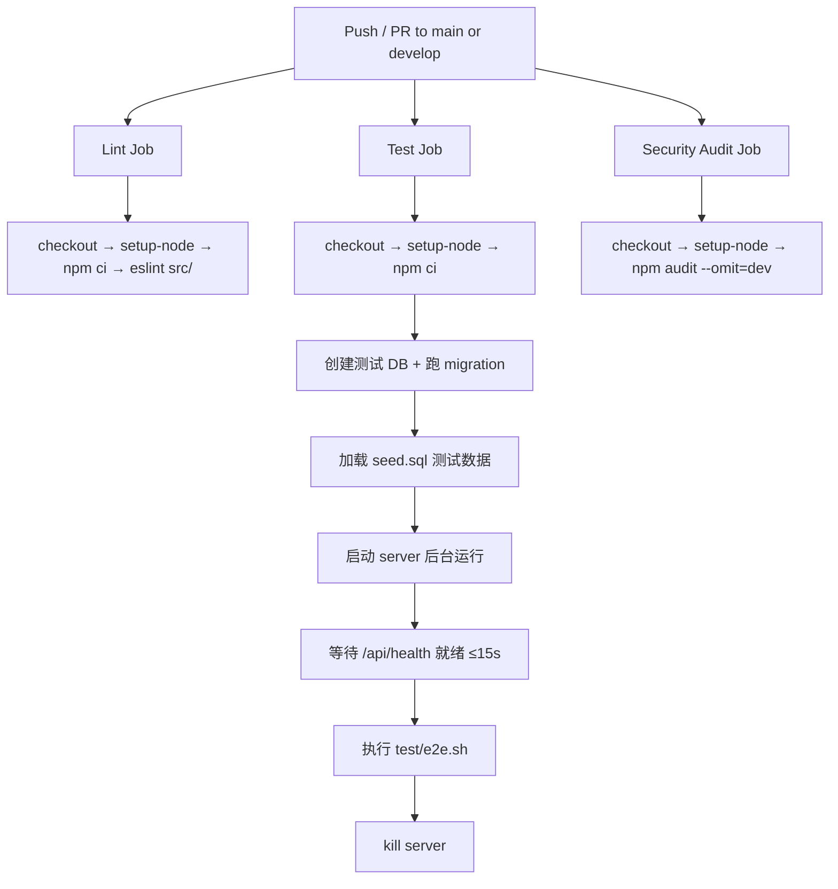
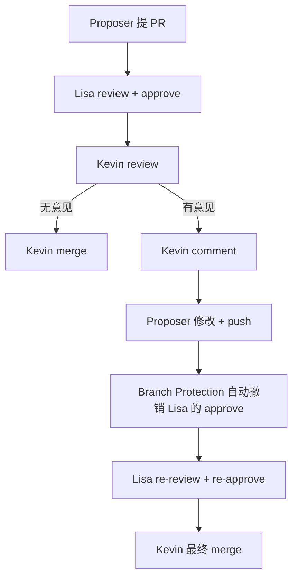
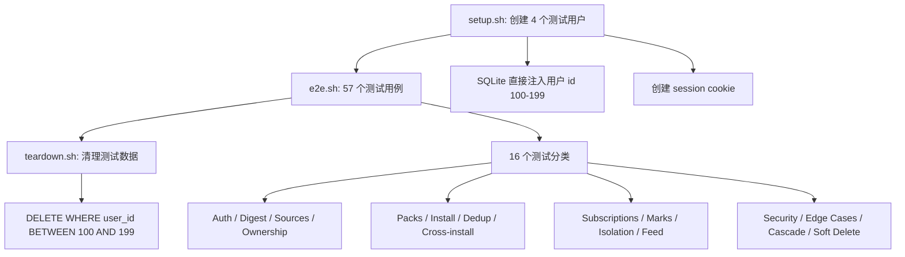

# PD-166.01 ClawFeed — PRD 驱动研发流程与三环境部署

> 文档编号：PD-166.01
> 来源：ClawFeed `docs/PROCESS.md` `CONTRIBUTING.md` `.github/workflows/ci.yml`
> GitHub：https://github.com/kevinho/clawfeed
> 问题域：PD-166 研发流程规范 Development Process Governance
> 状态：可复用方案

---

## 第 1 章 问题与动机

### 1.1 核心问题

小团队（4 人）在快速迭代中如何保证线上稳定？没有流程规范时，常见问题包括：

- 需求口头传达，开发完成后发现与预期不符
- 直接在 main 分支提交，线上随时可能挂
- 没有 staging 环境，代码合并后直接上线，出问题才发现
- 回滚靠手动 revert commit，耗时且容易出错
- 事故发生后没有标准响应流程，全靠个人经验

ClawFeed 作为一个从个人工具升级为公开 SaaS 服务的项目（`docs/PRODUCT.md:1-7`），在 v0.1 到 v0.8 的快速迭代中（10 天内发布 8 个版本，见 `CHANGELOG.md:1-87`），建立了一套完整的研发规范来解决这些问题。

### 1.2 ClawFeed 的解法概述

1. **PRD 驱动开发** — 所有功能以 PRD 文档为基准，PRD 以 PR 形式提交审批，审批通过后才能开发（`docs/PROCESS.md:7-9`）
2. **四角色分工** — PO（Kevin）审批+验收、Lead Dev（Jessie）写 PRD+开发、Dev（Lucy）开发、QA（Lisa）测试+Code Review，职责清晰不重叠（`docs/PROCESS.md:14-19`）
3. **三环境隔离** — feat→develop（staging）→main（production），每层有独立的 Branch Protection 规则（`docs/PROCESS.md:133-157`）
4. **Codex + 人工双重 Code Review** — Lisa 先用 Codex CLI 自动审查，再手动检查，Kevin 最终 merge（`CONTRIBUTING.md:42-46`）
5. **git tag 回滚** — 每个 release 打 tag，回滚 = checkout 上一个 tag + 重新部署，migration 设计为只增不删保证向前兼容（`docs/PROCESS.md:169-174`）

### 1.3 设计思想

| 设计原则 | 具体实现 | 理由 | 替代方案 |
|----------|----------|------|----------|
| PRD 即合同 | PRD 以 PR 提交到 develop，Kevin approve 后才开发 | 避免需求理解偏差，开发/测试/验收都对照同一文档 | Jira ticket（重量级）、口头沟通（无记录） |
| 最小权限 | Kevin 是唯一有 merge 权限的人，develop 需 1 review + CI | 防止未经审查的代码进入集成分支 | 所有人都能 merge（风险高） |
| 环境隔离 | staging 与 production 同配置结构、独立数据库 | staging 验证通过的代码到 production 无惊喜 | 只用 dev + prod 两环境（跳过验收） |
| 向前兼容 migration | 数据库 migration 只增不删，代码回滚不破坏数据 | 回滚时不需要反向 migration | 双向 migration（复杂度高） |
| 自动化兜底 | CI 跑 Lint + E2E Test + Security Audit，Branch Protection 强制 | 人会忘记跑测试，机器不会 | 纯手动检查（不可靠） |

---

## 第 2 章 源码实现分析

### 2.1 架构概览

ClawFeed 的研发流程是一个 8 阶段流水线，从需求到上线每个阶段都有明确的输入、输出和负责人：

```
┌──────────┐    ┌──────────┐    ┌──────────┐    ┌──────────┐
│  需求     │───→│  PRD     │───→│  Kevin   │───→│  开发     │
│ (Kevin)  │    │ (Jessie) │    │  Review  │    │(Jessie/  │
│          │    │ +测试用例 │    │  PRD+TC  │    │  Lucy)   │
└──────────┘    └──────────┘    └──────────┘    └──────────┘
                                                      │
┌──────────┐    ┌──────────┐    ┌──────────┐    ┌─────▼────┐
│  Smoke   │←───│Production│←───│  Kevin   │←───│  Code    │
│  Test    │    │  Deploy  │    │  验收     │    │  Review  │
│ (Lisa)   │    │ (Kevin)  │    │ (staging)│    │(Lisa→    │
└──────────┘    └──────────┘    └──────────┘    │  Kevin)  │
                                                └──────────┘
```

分支与环境映射关系（`docs/PROCESS.md:136-141`）：

```
feat/xxx  ──PR──→  develop  ──auto deploy──→  staging
                      │
                      │  (验收通过后)
                      ▼
                    main  ──release tag──→  production
```

### 2.2 核心实现

#### 2.2.1 CI 流水线：三 Job 并行



对应源码 `.github/workflows/ci.yml:1-91`：

```yaml
name: CI
on:
  push:
    branches: [main, develop]
  pull_request:
    branches: [main, develop]

jobs:
  lint:
    name: Lint
    runs-on: ubuntu-latest
    steps:
      - uses: actions/checkout@v4
      - uses: actions/setup-node@v4
        with:
          node-version: 20
      - run: npm ci
      - run: npx eslint src/

  test:
    name: Test
    runs-on: ubuntu-latest
    steps:
      - uses: actions/checkout@v4
      - uses: actions/setup-node@v4
        with:
          node-version: 20
      - run: npm ci
      - name: Start server & run e2e tests
        run: |
          mkdir -p data
          # 动态执行 migration SQL 文件创建测试数据库
          node -e "
            const Database = require('better-sqlite3');
            const db = new Database('data/test.db');
            const files = fs.readdirSync('migrations').filter(f => f.endsWith('.sql')).sort();
            for (const f of files) { db.exec(fs.readFileSync('migrations/' + f, 'utf8')); }
            db.close();
          "
          sqlite3 data/test.db < test/seed.sql
          DIGEST_DB=data/test.db DIGEST_PORT=8767 API_KEY=test-key-ci \
            node src/server.mjs &
          # 等待 server 就绪（最多 15 秒）
          for i in $(seq 1 15); do
            curl -sf http://localhost:8767/api/health > /dev/null 2>&1 && break
            sleep 1
          done
          bash test/e2e.sh
          kill $SERVER_PID

  audit:
    name: Security Audit
    runs-on: ubuntu-latest
    steps:
      - uses: actions/checkout@v4
      - run: npm audit --omit=dev || true
```

关键设计点：
- CI 中 Test Job 完整模拟生产环境：跑全部 migration → 加载 seed 数据 → 启动真实 server → 跑 E2E（`ci.yml:30-80`）
- Security Audit 用 `|| true` 容错，不阻塞 CI（`ci.yml:90`），但结果可见

#### 2.2.2 Code Review 流程：dismiss stale reviews



对应源码 `docs/PROCESS.md:63-96`：

```markdown
每个 PR 必须经过以下完整流程：

Proposer 提 PR → Lisa review + approve → Kevin review
                                            │
                                  ┌─────────┴─────────┐
                                  │                    │
                            有意见 → comment      无意见 → merge
                                  │
                            Proposer 修改
                                  │
                            Lisa re-review + re-approve
                                  │
                            Kevin 最终 merge

规则：
- 每次 push 新 commit 后，Lisa 必须重新 review + approve
- Kevin 是唯一有 merge 权限的人
- PRD 类 PR 和代码类 PR 遵循相同流程
```

核心机制：GitHub Branch Protection 的 "Dismiss stale pull request approvals when new commits are pushed" 设置（`docs/PROCESS.md:90`），确保每次代码变更后必须重新获得 approve，防止"先 approve 再偷偷改代码"。

#### 2.2.3 E2E 测试框架：纯 Bash + curl



对应源码 `test/e2e.sh:1-57`：

```bash
#!/bin/bash
set -e
API="${AI_DIGEST_API:-https://digest.kevinhe.io/api}"
ALICE="Cookie: session=test-sess-alice"
BOB="Cookie: session=test-sess-bob"
CAROL="Cookie: session=test-sess-carol"
DAVE="Cookie: session=test-sess-dave"
PASS=0; FAIL=0; TOTAL=0; SKIP=0

check() {
  TOTAL=$((TOTAL+1))
  local desc="$1" expected="$2" actual="$3"
  if echo "$actual" | grep -qF "$expected"; then
    PASS=$((PASS+1))
    printf "  ✅ %s\n" "$desc"
  else
    FAIL=$((FAIL+1))
    printf "  ❌ %s\n" "$desc"
    printf "     expected: %s\n" "$expected"
    printf "     got: %.120s\n" "$actual"
  fi
}
```

设计亮点：
- 测试用户 ID 100-199 与真实用户 1-99 隔离，不污染生产数据（`test/setup.sh:12-20`）
- 纯 curl + bash，零额外依赖（python3 仅做 JSON 解析）（`docs/TESTING.md:24`）
- 4 个测试用户模拟完整多租户场景：创建者(Alice)、独立用户(Bob)、纯消费者(Carol)、验证去重(Dave)（`docs/TESTING.md:28-33`）

### 2.3 实现细节

#### Staging 环境配置

staging 与 production 使用相同的代码和配置结构，仅端口和数据库不同（`docs/STAGING.md:1-52`）：

| 配置项 | Staging | Production |
|--------|---------|------------|
| 端口 | 8768 | 8767 |
| 数据库 | `data/digest-staging.db` | `data/digest.db` |
| 认证 | 禁用（无 OAuth） | Google OAuth |
| API Key | `staging-api-key-1234` | 真实 key |
| 进程管理 | launchctl plist | 同 |

启动脚本 `scripts/start-staging.sh:1-4`：

```bash
#!/bin/bash
cd "$(dirname "$0")/.."
export $(grep -v '^#' .env.staging | xargs)
node src/server.mjs
```

极简设计：通过 `.env.staging` 文件切换环境变量，同一份代码跑不同配置。

#### Docker 多阶段构建 + 健康检查

`Dockerfile:1-45` 实现了生产级容器化：

```dockerfile
FROM node:20-alpine AS builder
RUN apk add --no-cache python3 make g++  # better-sqlite3 编译依赖
COPY package*.json ./
RUN npm ci --only=production

FROM node:20-alpine
COPY --from=builder /app ./
RUN mkdir -p /app/data && chown -R node:node /app
USER node  # 非 root 运行
HEALTHCHECK --interval=30s --timeout=3s --start-period=5s --retries=3 \
    CMD wget -q --spider http://localhost:8767/ || exit 1
```

#### PRD 文档实例

`docs/prd/feedback.md` 是一个完整的 PRD 实例（179 行），包含：
- 背景与设计原则（`feedback.md:1-14`）
- 现有实现详细记录（数据模型、API 端点、配置）（`feedback.md:16-78`）
- 验收标准（27 项，含已完成和待实现）（`feedback.md:80-118`）
- 测试用例（21 个场景，表格化）（`feedback.md:122-163`）
- 负责人分配（`feedback.md:174-179`）

#### 回滚机制

回滚策略基于 git tag + 向前兼容 migration（`docs/PROCESS.md:169-174`）：

```
回滚 = checkout 上一个 tag → 重新部署
```

关键约束：
- migration 只增不删（向前兼容），代码回滚不破坏数据
- 如有破坏性 migration，PRD 里必须说明回滚方案
- Docker 构建支持 `v*` tag 触发（`docker-build.yml:9-10`），release tag 自动构建镜像


---

## 第 3 章 迁移指南

### 3.1 迁移清单

#### 阶段 1：基础流程（1-2 天）

- [ ] 创建 `docs/PROCESS.md`，定义角色、工作流程、分支策略
- [ ] 创建 `CONTRIBUTING.md`，定义 PR 规范和 Code Review 流程
- [ ] 创建 `docs/prd/` 目录，放入 PRD 模板
- [ ] 配置 GitHub Branch Protection：
  - `main`：需要 owner approve
  - `develop`：需要 CI 通过 + 1 review

#### 阶段 2：CI/CD（半天）

- [ ] 创建 `.github/workflows/ci.yml`，包含 Lint + Test + Security Audit
- [ ] 创建 E2E 测试框架（setup → test → teardown）
- [ ] 配置 Docker 多阶段构建 + 健康检查

#### 阶段 3：环境隔离（半天）

- [ ] 创建 `.env.staging` 配置文件
- [ ] 创建 `scripts/start-staging.sh` 启动脚本
- [ ] 配置 staging 环境（独立端口 + 独立数据库）
- [ ] 配置 staging 自动部署（develop 分支触发）

#### 阶段 4：回滚机制（持续）

- [ ] 建立 git tag 发版规范（`vX.Y.Z`）
- [ ] 确保所有 migration 向前兼容（只增不删）
- [ ] PRD 模板中加入"回滚方案"章节
- [ ] 创建 `docs/INCIDENTS.md` 事故记录文档

### 3.2 适配代码模板

#### CI 流水线模板（GitHub Actions）

```yaml
# .github/workflows/ci.yml
name: CI
on:
  push:
    branches: [main, develop]
  pull_request:
    branches: [main, develop]

jobs:
  lint:
    name: Lint
    runs-on: ubuntu-latest
    steps:
      - uses: actions/checkout@v4
      - uses: actions/setup-node@v4
        with:
          node-version: 20
      - run: npm ci
      - run: npx eslint src/

  test:
    name: Test
    runs-on: ubuntu-latest
    steps:
      - uses: actions/checkout@v4
      - uses: actions/setup-node@v4
        with:
          node-version: 20
      - run: npm ci
      - name: Setup test DB and run E2E
        run: |
          mkdir -p data
          # 执行所有 migration 文件
          for f in migrations/*.sql; do
            sqlite3 data/test.db < "$f"
          done
          # 加载测试种子数据
          sqlite3 data/test.db < test/seed.sql
          # 启动 server
          DB_PATH=data/test.db PORT=8080 API_KEY=test-key \
            node src/server.mjs &
          # 等待就绪
          for i in $(seq 1 15); do
            curl -sf http://localhost:8080/api/health && break
            sleep 1
          done
          # 跑 E2E
          API_BASE=http://localhost:8080/api bash test/e2e.sh

  audit:
    name: Security Audit
    runs-on: ubuntu-latest
    steps:
      - uses: actions/checkout@v4
      - uses: actions/setup-node@v4
        with:
          node-version: 20
      - run: npm audit --omit=dev || true
```

#### PRD 模板

```markdown
# [功能名称] PRD

## 背景
为什么要做这个功能？解决什么问题？

## 方案
### 设计
具体怎么做？包括数据模型、API、UI 变更等。

### 影响范围
哪些现有功能会受影响？

## 验收标准
1. [ ] 标准 1
2. [ ] 标准 2

## 测试用例
| # | 场景 | 步骤 | 预期结果 |
|---|------|------|----------|
| 1 | ... | ... | ... |

## 回滚方案
如有破坏性变更，说明回滚步骤。

## 负责人
- 开发：xxx
- 测试：xxx
- 审批：xxx
```

#### E2E 测试框架模板（Bash + curl）

```bash
#!/bin/bash
# e2e.sh — 纯 bash E2E 测试框架
set -e
API="${API_BASE:-http://localhost:8080/api}"
PASS=0; FAIL=0; TOTAL=0

check() {
  TOTAL=$((TOTAL+1))
  local desc="$1" expected="$2" actual="$3"
  if echo "$actual" | grep -qF "$expected"; then
    PASS=$((PASS+1)); printf "  ✅ %s\n" "$desc"
  else
    FAIL=$((FAIL+1)); printf "  ❌ %s\n" "$desc"
    printf "     expected: %s\n     got: %.120s\n" "$expected" "$actual"
  fi
}

check_code() {
  TOTAL=$((TOTAL+1))
  local desc="$1" expected="$2" actual="$3"
  if [ "$actual" = "$expected" ]; then
    PASS=$((PASS+1)); printf "  ✅ %s → %s\n" "$desc" "$actual"
  else
    FAIL=$((FAIL+1)); printf "  ❌ %s → got %s, expected %s\n" "$desc" "$actual" "$expected"
  fi
}

# --- 你的测试用例 ---
echo "─── Health Check ───"
check "API health" '200' "$(curl -s -o /dev/null -w '%{http_code}' "$API/health")"

# --- 结果汇总 ---
echo ""
printf "Results: %d/%d passed" "$PASS" "$TOTAL"
[ "$FAIL" -gt 0 ] && printf ", \033[31m%d failed\033[0m" "$FAIL"
echo ""
[ "$FAIL" -gt 0 ] && exit 1 || exit 0
```

#### 测试数据隔离模板

```bash
#!/bin/bash
# setup.sh — 测试用户注入（ID 100-199 隔离区间）
DB="${TEST_DB:-data/test.db}"
sqlite3 "$DB" "
INSERT OR IGNORE INTO users (id, email, name)
VALUES
  (100, 'alice@test.local', 'Alice (Test)'),
  (101, 'bob@test.local',   'Bob (Test)');
INSERT OR REPLACE INTO sessions (id, user_id, expires_at) VALUES
  ('test-sess-alice', 100, datetime('now', '+1 day')),
  ('test-sess-bob',   101, datetime('now', '+1 day'));
"
```

```bash
#!/bin/bash
# teardown.sh — 按 ID 区间清理，不影响真实数据
DB="${TEST_DB:-data/test.db}"
sqlite3 "$DB" "
DELETE FROM sessions WHERE user_id BETWEEN 100 AND 199;
DELETE FROM users WHERE id BETWEEN 100 AND 199;
"
```

### 3.3 适用场景

| 场景 | 适用度 | 说明 |
|------|--------|------|
| 2-6 人小团队 SaaS 项目 | ⭐⭐⭐ | 完美匹配，流程轻量但完整 |
| 个人项目升级为团队协作 | ⭐⭐⭐ | ClawFeed 自身就是这个路径 |
| 需要快速迭代的 MVP | ⭐⭐ | PRD 流程可简化，但 CI + staging 值得保留 |
| 大团队（>10 人） | ⭐ | 需要更复杂的分支策略（如 GitFlow）和权限管理 |
| 开源社区项目 | ⭐⭐ | CONTRIBUTING.md + CI 部分可直接复用，PRD 流程需调整 |

---

## 第 4 章 测试用例

```python
"""
PD-166 研发流程规范 — 测试用例
基于 ClawFeed 的流程设计，验证研发规范的关键约束
"""
import subprocess
import json
import os
import tempfile
import shutil
from pathlib import Path


class TestBranchProtection:
    """分支保护规则验证"""

    def test_main_requires_owner_approve(self):
        """main 分支需要 owner approve 才能 merge"""
        # 模拟：检查 Branch Protection 配置
        protection = {
            "required_pull_request_reviews": {
                "required_approving_review_count": 1,
                "dismiss_stale_reviews": True,
                "require_code_owner_reviews": True
            },
            "required_status_checks": {
                "strict": True,
                "contexts": ["Lint", "Test", "Security Audit"]
            }
        }
        assert protection["required_pull_request_reviews"]["dismiss_stale_reviews"] is True
        assert protection["required_pull_request_reviews"]["require_code_owner_reviews"] is True

    def test_develop_requires_ci_and_review(self):
        """develop 分支需要 CI 通过 + 1 review"""
        protection = {
            "required_status_checks": {
                "contexts": ["Lint", "Test"]
            },
            "required_pull_request_reviews": {
                "required_approving_review_count": 1
            }
        }
        assert protection["required_pull_request_reviews"]["required_approving_review_count"] >= 1
        assert "Lint" in protection["required_status_checks"]["contexts"]

    def test_no_direct_push_to_protected_branches(self):
        """不允许直接 push 到 main 或 develop"""
        protection = {"enforce_admins": True, "allow_force_pushes": False}
        assert protection["enforce_admins"] is True
        assert protection["allow_force_pushes"] is False


class TestCIPipeline:
    """CI 流水线验证"""

    def test_ci_triggers_on_correct_branches(self):
        """CI 在 main 和 develop 的 push/PR 时触发"""
        ci_config = {
            "on": {
                "push": {"branches": ["main", "develop"]},
                "pull_request": {"branches": ["main", "develop"]}
            }
        }
        assert "main" in ci_config["on"]["push"]["branches"]
        assert "develop" in ci_config["on"]["push"]["branches"]

    def test_ci_has_three_jobs(self):
        """CI 包含 Lint + Test + Security Audit 三个 Job"""
        jobs = ["lint", "test", "audit"]
        assert len(jobs) == 3
        assert "lint" in jobs
        assert "test" in jobs
        assert "audit" in jobs

    def test_e2e_test_isolation(self):
        """E2E 测试用户 ID 在 100-199 隔离区间"""
        test_user_ids = [100, 101, 102, 103]
        for uid in test_user_ids:
            assert 100 <= uid <= 199, f"Test user {uid} outside isolation range"

    def test_teardown_only_cleans_test_data(self):
        """teardown 只清理测试数据，不影响真实用户"""
        teardown_sql = "DELETE FROM users WHERE id BETWEEN 100 AND 199"
        assert "BETWEEN 100 AND 199" in teardown_sql
        assert "DELETE FROM users" in teardown_sql
        # 不应该有无条件 DELETE
        assert "DELETE FROM users;" not in teardown_sql


class TestRollbackMechanism:
    """回滚机制验证"""

    def test_release_tag_format(self):
        """release tag 格式为 vX.Y.Z"""
        import re
        tags = ["v0.7.0", "v0.8.0", "v0.8.1"]
        pattern = r'^v\d+\.\d+\.\d+$'
        for tag in tags:
            assert re.match(pattern, tag), f"Tag {tag} doesn't match vX.Y.Z format"

    def test_migration_forward_compatible(self):
        """migration 只增不删（向前兼容）"""
        # 模拟检查 migration 文件中不包含 DROP TABLE 或 DELETE COLUMN
        migration_content = """
        CREATE TABLE IF NOT EXISTS feedback (...);
        ALTER TABLE feedback ADD COLUMN category TEXT;
        """
        forbidden = ["DROP TABLE", "DROP COLUMN", "ALTER TABLE.*DROP"]
        for keyword in forbidden[:2]:
            assert keyword not in migration_content, \
                f"Migration contains forbidden operation: {keyword}"

    def test_docker_tag_triggers_release_build(self):
        """v* tag 触发 Docker release 构建"""
        docker_build_triggers = {
            "push": {
                "branches": ["main", "release/**", "dev/**"],
                "tags": ["v*"]
            }
        }
        assert "v*" in docker_build_triggers["push"]["tags"]


class TestPRDWorkflow:
    """PRD 驱动开发流程验证"""

    def test_prd_template_has_required_sections(self):
        """PRD 模板包含必要章节"""
        required_sections = [
            "背景", "方案", "影响范围",
            "验收标准", "测试用例", "回滚方案", "负责人"
        ]
        prd_template = """
        # 功能 PRD
        ## 背景
        ## 方案
        ### 影响范围
        ## 验收标准
        ## 测试用例
        ## 回滚方案
        ## 负责人
        """
        for section in required_sections:
            assert section in prd_template, f"PRD missing section: {section}"

    def test_prd_submitted_as_pr(self):
        """PRD 以 PR 形式提交到 develop 分支"""
        pr = {"base": "develop", "files": ["docs/prd/feedback.md"]}
        assert pr["base"] == "develop"
        assert any(f.startswith("docs/prd/") for f in pr["files"])
```


---

## 第 5 章 跨域关联

| 关联域 | 关系类型 | 说明 |
|--------|----------|------|
| PD-07 质量检查 | 协同 | ClawFeed 的 Code Review 流程（Codex CLI 自动审查 + 人工 review）是 PD-07 质量检查在研发流程中的具体落地。E2E 测试框架（57 个用例、16 个分类）也是质量保障的核心手段 |
| PD-05 沙箱隔离 | 协同 | staging 环境本质上是一个"部署沙箱"——独立端口、独立数据库、禁用 OAuth，与 production 隔离但配置结构相同。测试用户 ID 100-199 的隔离区间也是数据沙箱思想 |
| PD-11 可观测性 | 依赖 | 事故响应流程（`docs/PROCESS.md:211-216`）依赖可观测性能力来"发现线上异常"。Docker HEALTHCHECK（`Dockerfile:42-43`）和 `/api/health` 端点是最基础的可观测性实现 |
| PD-06 记忆持久化 | 协同 | 向前兼容 migration 策略（只增不删）是数据持久化在研发流程中的约束。DEVOPLOG.md 和 CHANGELOG.md 是研发过程的"记忆"持久化 |
| PD-164 CI/CD 流水线 | 强依赖 | PD-166 的分支保护和 staging 验收机制依赖 CI/CD 流水线的自动化能力。GitHub Actions 的 Lint + Test + Audit 三 Job 是 Branch Protection 的前置条件 |
| PD-163 软删除模式 | 协同 | ClawFeed 的回滚机制要求 migration 向前兼容，软删除（`is_deleted` 标记而非 `DELETE`）是实现这一约束的关键模式。E2E 测试中专门有 Soft Delete 分类（7 个用例）验证此行为 |

---

## 第 6 章 来源文件索引

| 文件 | 行范围 | 关键实现 |
|------|--------|----------|
| `docs/PROCESS.md` | L1-L226 | 完整研发规范：角色定义、8 阶段工作流、分支策略、环境配置、回滚机制、事故响应、上线检查清单 |
| `CONTRIBUTING.md` | L1-L54 | 贡献指南：分支规则、Code Review 四步流程（CI→Codex→Reviewer→Owner） |
| `.github/workflows/ci.yml` | L1-L91 | CI 流水线：Lint + E2E Test（含 server 启动和 migration）+ Security Audit 三 Job 并行 |
| `.github/workflows/docker-build.yml` | L1-L63 | Docker 构建：多平台（amd64+arm64）、tag 触发 release、registry 缓存 |
| `docs/STAGING.md` | L1-L52 | Staging 环境配置：端口 8768、独立 DB、launchctl 管理、API 测试命令 |
| `docs/TESTING.md` | L1-L233 | 测试文档：4 用户设计、16 分类 57 用例测试矩阵、已知问题追踪、手动浏览器测试指南 |
| `test/e2e.sh` | L1-L451 | E2E 测试脚本：check/check_not/check_code 三种断言、16 个测试分类、结果汇总 |
| `test/setup.sh` | L1-L53 | 测试环境搭建：SQLite 注入 4 个测试用户（ID 100-103）+ session cookie |
| `test/teardown.sh` | L1-L19 | 测试清理：按 ID 区间（100-199）级联删除，依赖顺序正确 |
| `test/seed.sql` | L1-L24 | CI 种子数据：5 个用户 + 4 个 session + 3 种类型 digest |
| `scripts/start-staging.sh` | L1-L4 | Staging 启动：加载 .env.staging 环境变量 + 启动 server |
| `Dockerfile` | L1-L45 | 多阶段构建：builder 编译 native 依赖 → production 镜像非 root 运行 + HEALTHCHECK |
| `docs/prd/feedback.md` | L1-L179 | PRD 实例：Feedback 系统完整 PRD，含验收标准 27 项 + 测试用例 21 个 |
| `DEVOPLOG.md` | L1-L28 | 运维日志：记录 staging 验证结果、production 发布状态、基础设施变更 |
| `CHANGELOG.md` | L1-L87 | 变更日志：v0.1-v0.8.1 共 8 个版本，10 天内快速迭代记录 |

---

## 第 7 章 横向对比维度

```json comparison_data
{
  "project": "ClawFeed",
  "dimensions": {
    "需求管理": "PRD 以 PR 提交到 develop，Kevin approve 后才能开发",
    "分支策略": "feat→develop→main 三层，Branch Protection + dismiss stale reviews",
    "环境隔离": "staging（端口 8768 + 独立 DB）与 production 同配置结构",
    "Code Review": "Codex CLI 自动审查 + Lisa 手动 review + Kevin 最终 merge",
    "回滚机制": "git tag 标记 release + 向前兼容 migration（只增不删）",
    "CI 覆盖": "Lint + E2E（57 用例 server 启动）+ Security Audit 三 Job 并行",
    "测试隔离": "测试用户 ID 100-199 隔离区间，setup/teardown 不污染生产数据",
    "事故响应": "发现异常→快速修复或回滚→事后记录到 INCIDENTS.md"
  }
}
```

### 域元数据补充

```json domain_metadata
{
  "solution_summary": "ClawFeed 用 PRD-as-PR 审批 + Codex CLI 自动 Code Review + dismiss stale reviews 强制重审 + staging 同配置隔离验收 + git tag 向前兼容回滚，实现 4 人团队 10 天 8 版本的稳定快速迭代",
  "description": "小团队如何在快速迭代中平衡速度与稳定性的工程实践",
  "sub_problems": [
    "Codex/AI 辅助 Code Review 集成",
    "测试数据隔离与多用户 E2E 框架",
    "上线前检查清单自动化",
    "DEVOPLOG 运维日志规范"
  ],
  "best_practices": [
    "PRD 和代码 PR 遵循相同 review 流程",
    "dismiss stale reviews 防止 approve 后偷改代码",
    "测试用户 ID 区间隔离（100-199）不污染生产数据",
    "migration 只增不删保证代码回滚不破坏数据"
  ]
}
```
