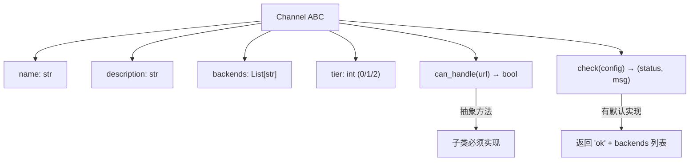
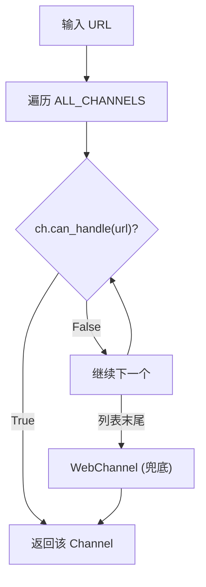

# PD-167.02 Agent Reach — Channel ABC 基类与 Tier 分级注册表

> 文档编号：PD-167.02
> 来源：Agent Reach `agent_reach/channels/base.py`, `agent_reach/channels/__init__.py`
> GitHub：https://github.com/Panniantong/Agent-Reach.git
> 问题域：PD-167 可插拔渠道架构 Pluggable Channel Architecture
> 状态：可复用方案

---

## 第 1 章 问题与动机

### 1.1 核心问题

AI Agent 需要访问互联网上的多种平台（Twitter、YouTube、GitHub、Reddit、小红书、抖音等），但每个平台的访问方式截然不同：有的用 CLI 工具（`gh`、`bird`、`yt-dlp`），有的用 MCP 服务器（`mcporter` 桥接），有的用 HTTP API，有的需要代理才能访问。

核心挑战：
1. **异构后端统一管理** — 12 个平台，至少 6 种不同的后端工具类型
2. **环境感知** — 同一个渠道在不同机器上可能可用/不可用/部分可用
3. **URL 自动路由** — 给定一个 URL，自动识别属于哪个平台
4. **渐进式解锁** — 不是所有渠道都需要配置，零配置也能用基础功能
5. **Agent 自修复** — Agent 能自己诊断哪些渠道有问题并尝试修复

### 1.2 Agent Reach 的解法概述

Agent Reach 设计了一套极简但完备的 Channel 抽象体系：

1. **Channel ABC 基类** (`base.py:18-37`) — 定义 4 个属性 + 2 个方法的最小接口
2. **Tier 分级** (`base.py:24`) — 0/1/2 三级，表示配置复杂度（零配置/免费Key/需安装）
3. **列表式注册表** (`__init__.py:25-38`) — `ALL_CHANNELS` 有序列表，顺序即优先级
4. **URL 路由** — 遍历 `ALL_CHANNELS`，第一个 `can_handle(url)` 返回 True 的渠道胜出
5. **WebChannel 兜底** (`web.py:13-14`) — `can_handle` 永远返回 True，放在列表末尾

### 1.3 设计思想

| 设计原则 | 具体实现 | 理由 | 替代方案 |
|----------|----------|------|----------|
| 最小接口原则 | ABC 只定义 `can_handle` + `check` 两个方法 | 降低新渠道接入门槛，一个文件 20 行即可 | 定义 read/search/write 全套接口（过重） |
| Tier 分级 | 0=零配置, 1=免费Key, 2=需安装 | Doctor 报告按 Tier 分组展示，用户知道优先配什么 | 布尔 required/optional（粒度不够） |
| 有序列表注册 | `ALL_CHANNELS` 列表，WebChannel 放最后 | 列表顺序即路由优先级，简单直观 | 优先级数字/权重系统（过度设计） |
| 后端声明式 | `backends = ["yt-dlp"]` 纯声明 | check() 方法自行验证后端可用性，声明仅用于展示 | 自动依赖注入（复杂度高） |
| 自诊断能力 | 每个 Channel 的 check() 返回 (status, message) | Agent 可读取诊断信息并自行修复 | 集中式健康检查（不了解各渠道细节） |

---

## 第 2 章 源码实现分析

### 2.1 架构概览

Agent Reach 的渠道系统采用经典的策略模式 + 责任链模式组合：

```
┌─────────────────────────────────────────────────────────┐
│                    AgentReach (core.py)                  │
│                    doctor() → check_all()                │
└──────────────────────┬──────────────────────────────────┘
                       │
┌──────────────────────▼──────────────────────────────────┐
│              doctor.py — check_all(config)               │
│   for ch in get_all_channels(): ch.check(config)        │
└──────────────────────┬──────────────────────────────────┘
                       │
┌──────────────────────▼──────────────────────────────────┐
│           channels/__init__.py — ALL_CHANNELS            │
│                                                          │
│  ┌──────────┐ ┌──────────┐ ┌──────────┐ ┌──────────┐   │
│  │ GitHub   │ │ Twitter  │ │ YouTube  │ │ Reddit   │   │
│  │ tier=0   │ │ tier=1   │ │ tier=0   │ │ tier=1   │   │
│  │ gh CLI   │ │ bird CLI │ │ yt-dlp   │ │ JSON API │   │
│  └──────────┘ └──────────┘ └──────────┘ └──────────┘   │
│  ┌──────────┐ ┌──────────┐ ┌──────────┐ ┌──────────┐   │
│  │ Bilibili │ │ XHS      │ │ Douyin   │ │ LinkedIn │   │
│  │ tier=1   │ │ tier=2   │ │ tier=2   │ │ tier=2   │   │
│  │ yt-dlp   │ │ xhs-mcp  │ │ dy-mcp   │ │ li-mcp   │   │
│  └──────────┘ └──────────┘ └──────────┘ └──────────┘   │
│  ┌──────────┐ ┌──────────┐ ┌──────────┐                │
│  │ BossZP   │ │ RSS      │ │ Exa      │                │
│  │ tier=2   │ │ tier=0   │ │ tier=0   │                │
│  │ boss-mcp │ │feedparser│ │ Exa MCP  │                │
│  └──────────┘ └──────────┘ └──────────┘                │
│  ┌──────────┐                                           │
│  │ Web ⬇    │ ← 兜底渠道，can_handle 永远 True          │
│  │ tier=0   │                                           │
│  │Jina Readr│                                           │
│  └──────────┘                                           │
└─────────────────────────────────────────────────────────┘
```

### 2.2 核心实现

#### Channel ABC 基类



对应源码 `agent_reach/channels/base.py:18-37`：

```python
class Channel(ABC):
    """Base class for all channels."""

    name: str = ""                    # e.g. "youtube"
    description: str = ""             # e.g. "YouTube 视频和字幕"
    backends: List[str] = []          # e.g. ["yt-dlp"] — what upstream tool is used
    tier: int = 0                     # 0=zero-config, 1=needs free key, 2=needs setup

    @abstractmethod
    def can_handle(self, url: str) -> bool:
        """Check if this channel can handle this URL."""
        ...

    def check(self, config=None) -> Tuple[str, str]:
        """
        Check if this channel's upstream tool is available.
        Returns (status, message) where status is 'ok'/'warn'/'off'/'error'.
        """
        return "ok", f"{'、'.join(self.backends) if self.backends else '内置'}"
```

关键设计点：
- `can_handle` 是唯一的抽象方法，`check` 有默认实现（返回 ok）
- `backends` 是纯声明式列表，不参与运行时逻辑，仅用于 Doctor 报告展示
- `tier` 是整数而非枚举，方便排序和分组
- `check` 返回 4 种状态：`ok`（可用）、`warn`（部分可用）、`off`（未安装）、`error`（异常）

#### 渠道注册与 URL 路由



对应源码 `agent_reach/channels/__init__.py:25-38`：

```python
ALL_CHANNELS: List[Channel] = [
    GitHubChannel(),      # github.com
    TwitterChannel(),     # x.com, twitter.com
    YouTubeChannel(),     # youtube.com, youtu.be
    RedditChannel(),      # reddit.com, redd.it
    BilibiliChannel(),    # bilibili.com, b23.tv
    XiaoHongShuChannel(), # xiaohongshu.com, xhslink.com
    DouyinChannel(),      # douyin.com, iesdouyin.com
    LinkedInChannel(),    # linkedin.com
    BossZhipinChannel(),  # zhipin.com
    RSSChannel(),         # /feed, /rss, .xml, atom
    ExaSearchChannel(),   # can_handle 永远 False（纯搜索渠道）
    WebChannel(),         # can_handle 永远 True（兜底）
]
```

注册表的顺序至关重要：
- 特定平台渠道在前（GitHub、Twitter 等），通过域名精确匹配
- RSS 在中间，通过 URL 路径特征匹配（`/feed`、`.xml`）
- ExaSearch 的 `can_handle` 永远返回 False（`exa_search.py:16`），它是纯搜索渠道，不处理 URL
- WebChannel 放最后，`can_handle` 永远返回 True（`web.py:14`），作为万能兜底

### 2.3 实现细节

#### 三种后端工具接入模式

Agent Reach 的 12 个渠道使用了三种截然不同的后端工具类型：

| 模式 | 渠道 | 检测方式 | 示例 |
|------|------|----------|------|
| **CLI 工具** | GitHub, Twitter, YouTube, Bilibili | `shutil.which("tool")` | `gh`, `bird`, `yt-dlp` |
| **MCP 服务器** | Exa, 小红书, 抖音, LinkedIn, Boss直聘 | `mcporter list` 检查注册 | `mcporter call xiaohongshu.check_login_status()` |
| **Python 库** | RSS | `import feedparser` | 直接 import 检测 |
| **内置/无依赖** | Web | 无需检测 | Jina Reader（curl 即可） |

#### check() 的四级状态与诊断信息

每个渠道的 `check()` 方法不仅返回状态，还返回可操作的诊断信息。以 Twitter 为例 (`twitter.py:20-38`)：

```python
def check(self, config=None):
    bird = shutil.which("bird") or shutil.which("birdx")
    if not bird:
        return "warn", (
            "bird CLI 未安装。搜索可通过 Exa 替代。安装：\n"
            "  npm install -g @steipete/bird"
        )
    try:
        r = subprocess.run(
            [bird, "whoami"], capture_output=True, text=True, timeout=10
        )
        if r.returncode == 0:
            return "ok", "完整可用（读取、搜索推文）"
        return "warn", (
            "bird CLI 已安装但未配置 Cookie。运行：\n"
            "  agent-reach configure twitter-cookies \"auth_token=xxx; ct0=yyy\""
        )
    except Exception:
        return "warn", "bird CLI 已安装但连接失败"
```

诊断信息的设计原则：
- 告诉 Agent **当前状态**（未安装/已安装未配置/完整可用）
- 给出**具体修复命令**（不是"请安装"，而是 `npm install -g @steipete/bird`）
- 提供**降级方案**（"搜索可通过 Exa 替代"）

#### Doctor 按 Tier 分组报告

`doctor.py:27-91` 的 `format_report` 将所有渠道按 Tier 分组展示：

```python
# Tier 0 — zero config
lines.append("✅ 装好即用：")
for key, r in results.items():
    if r["tier"] == 0: ...

# Tier 1 — needs free key
lines.append("🔍 搜索（mcporter 即可解锁）：")
for key, r in tier1.items(): ...

# Tier 2 — optional setup
lines.append("🔧 配置后可用：")
for key, r in tier2.items(): ...
```

这让用户一眼看出哪些渠道开箱即用、哪些需要简单配置、哪些需要复杂安装。

#### MCP 桥接模式（mcporter）

Agent Reach 的一个独特设计是通过 `mcporter` 统一桥接多个 MCP 服务器。以小红书为例 (`xiaohongshu.py:20-50`)：

检测链路：`shutil.which("mcporter")` → `mcporter list` 检查注册 → `mcporter call xiaohongshu.check_login_status()` 验证登录状态。

这种三级检测确保了诊断的精确性：不是简单的"有/没有"，而是"未安装 mcporter / mcporter 已装但 MCP 未注册 / MCP 已注册但未登录 / 完整可用"。


---

## 第 3 章 迁移指南

### 3.1 迁移清单

#### 阶段 1：基础框架（1 个文件）

- [ ] 创建 `channels/base.py`，定义 Channel ABC
- [ ] 确定你的 Tier 分级标准（建议沿用 0/1/2）
- [ ] 确定 `check()` 的状态码集合（建议沿用 ok/warn/off/error）

#### 阶段 2：渠道实现（每个渠道 1 个文件）

- [ ] 为每个目标平台创建独立文件（如 `channels/twitter.py`）
- [ ] 实现 `can_handle(url)` — 域名匹配逻辑
- [ ] 实现 `check(config)` — 后端工具检测 + 诊断信息
- [ ] 声明 `name`、`description`、`backends`、`tier`

#### 阶段 3：注册表与路由

- [ ] 在 `channels/__init__.py` 中创建 `ALL_CHANNELS` 列表
- [ ] 确保列表顺序：特定平台在前，通用兜底在后
- [ ] 实现 `get_channel_for_url(url)` 路由函数
- [ ] 实现 `get_channel(name)` 按名查找函数

#### 阶段 4：Doctor 集成

- [ ] 创建 `doctor.py`，遍历所有渠道调用 `check()`
- [ ] 按 Tier 分组格式化输出
- [ ] 集成到 CLI 命令

### 3.2 适配代码模板

以下代码可直接复用，只需替换平台列表：

```python
# channels/base.py — 可直接复用
from abc import ABC, abstractmethod
from typing import List, Tuple, Optional

class Channel(ABC):
    """可插拔渠道基类。"""
    name: str = ""
    description: str = ""
    backends: List[str] = []
    tier: int = 0  # 0=零配置, 1=需免费Key, 2=需安装

    @abstractmethod
    def can_handle(self, url: str) -> bool:
        """该 URL 是否属于本渠道？"""
        ...

    def check(self, config=None) -> Tuple[str, str]:
        """检查后端工具是否可用。返回 (status, message)。"""
        return "ok", f"{'、'.join(self.backends) if self.backends else '内置'}"


# channels/__init__.py — 注册表模板
from typing import List, Optional
from .base import Channel

# 导入所有渠道实现
from .github import GitHubChannel
from .web import WebChannel
# ... 更多渠道

ALL_CHANNELS: List[Channel] = [
    GitHubChannel(),
    # ... 特定平台渠道（按优先级排列）
    WebChannel(),  # 兜底，必须放最后
]

def get_channel_for_url(url: str) -> Channel:
    """URL 自动路由：返回第一个能处理该 URL 的渠道。"""
    for ch in ALL_CHANNELS:
        if ch.can_handle(url):
            return ch
    return ALL_CHANNELS[-1]  # 理论上不会到这里（WebChannel 兜底）

def get_channel(name: str) -> Optional[Channel]:
    """按名称查找渠道。"""
    for ch in ALL_CHANNELS:
        if ch.name == name:
            return ch
    return None


# channels/example_platform.py — 新渠道模板
import shutil
from .base import Channel

class ExampleChannel(Channel):
    name = "example"
    description = "示例平台"
    backends = ["example-cli"]
    tier = 1

    def can_handle(self, url: str) -> bool:
        from urllib.parse import urlparse
        return "example.com" in urlparse(url).netloc.lower()

    def check(self, config=None):
        if not shutil.which("example-cli"):
            return "off", "example-cli 未安装。安装：pip install example-cli"
        return "ok", "完整可用"


# doctor.py — Doctor 模板
from typing import Dict

def check_all(config) -> Dict[str, dict]:
    from .channels import get_all_channels
    results = {}
    for ch in get_all_channels():
        status, message = ch.check(config)
        results[ch.name] = {
            "status": status,
            "name": ch.description,
            "message": message,
            "tier": ch.tier,
            "backends": ch.backends,
        }
    return results
```

### 3.3 适用场景

| 场景 | 适用度 | 说明 |
|------|--------|------|
| 多平台内容聚合 Agent | ⭐⭐⭐ | 完美匹配：URL 路由 + 后端检测 + 渐进解锁 |
| MCP 工具编排系统 | ⭐⭐⭐ | mcporter 桥接模式可直接复用 |
| CLI 工具管理器 | ⭐⭐ | Tier 分级 + Doctor 诊断适合管理多个 CLI 工具 |
| 单一平台深度集成 | ⭐ | 过度设计，直接调用即可 |
| 实时流式数据管道 | ⭐ | 该架构面向请求-响应模式，不适合流式 |

---

## 第 4 章 测试用例

基于 Agent Reach 的真实测试模式 (`tests/test_channels.py`)，以下测试可直接运行：

```python
import pytest
from unittest.mock import patch, MagicMock


class TestChannelBase:
    """测试 Channel ABC 基类约束。"""

    def test_cannot_instantiate_abc(self):
        """ABC 不能直接实例化。"""
        from channels.base import Channel
        with pytest.raises(TypeError):
            Channel()

    def test_subclass_must_implement_can_handle(self):
        """子类必须实现 can_handle。"""
        from channels.base import Channel
        class BadChannel(Channel):
            name = "bad"
        with pytest.raises(TypeError):
            BadChannel()

    def test_check_has_default(self):
        """check() 有默认实现，子类可不覆盖。"""
        from channels.base import Channel
        class MinimalChannel(Channel):
            name = "minimal"
            backends = ["tool-a"]
            def can_handle(self, url): return False
        ch = MinimalChannel()
        status, msg = ch.check()
        assert status == "ok"
        assert "tool-a" in msg


class TestURLRouting:
    """测试 URL 自动路由。"""

    def test_github_url(self):
        from channels import get_channel_for_url
        ch = get_channel_for_url("https://github.com/openai/gpt-4")
        assert ch.name == "github"

    def test_twitter_url(self):
        from channels import get_channel_for_url
        ch = get_channel_for_url("https://x.com/elonmusk/status/123")
        assert ch.name == "twitter"

    def test_unknown_url_fallback_to_web(self):
        """未知 URL 应该落到 WebChannel 兜底。"""
        from channels import get_channel_for_url
        ch = get_channel_for_url("https://random-site.example.com/page")
        assert ch.name == "web"

    def test_rss_url_by_path(self):
        """RSS 通过路径特征匹配，不是域名。"""
        from channels import get_channel_for_url
        ch = get_channel_for_url("https://example.com/feed.xml")
        assert ch.name == "rss"


class TestChannelCheck:
    """测试渠道健康检查。"""

    @patch("shutil.which", return_value=None)
    def test_cli_tool_missing(self, mock_which):
        """CLI 工具未安装时返回 off/warn。"""
        from channels.youtube import YouTubeChannel
        ch = YouTubeChannel()
        status, msg = ch.check()
        assert status in ("off", "warn")
        assert "安装" in msg or "install" in msg.lower()

    @patch("shutil.which", return_value="/usr/bin/yt-dlp")
    def test_cli_tool_available(self, mock_which):
        """CLI 工具已安装时返回 ok。"""
        from channels.youtube import YouTubeChannel
        ch = YouTubeChannel()
        status, msg = ch.check()
        assert status == "ok"


class TestTierGrouping:
    """测试 Tier 分级。"""

    def test_all_channels_have_valid_tier(self):
        from channels import get_all_channels
        for ch in get_all_channels():
            assert ch.tier in (0, 1, 2), f"{ch.name} has invalid tier {ch.tier}"

    def test_web_channel_is_tier_0(self):
        from channels import get_channel
        web = get_channel("web")
        assert web.tier == 0

    def test_tier_2_channels_need_setup(self):
        """Tier 2 渠道应该有非空 backends。"""
        from channels import get_all_channels
        for ch in get_all_channels():
            if ch.tier == 2:
                assert len(ch.backends) > 0, f"{ch.name} is tier 2 but has no backends"
```


---

## 第 5 章 跨域关联

| 关联域 | 关系类型 | 说明 |
|--------|----------|------|
| PD-142 凭证与密钥管理 | 依赖 | Channel 的 `check()` 需要读取 config 中的 API Key、Cookie、代理等凭证；`cli.py` 的 `configure` 命令负责安全存储这些凭证 |
| PD-143 环境检测与自动安装 | 协同 | `cli.py:510-548` 的 `_detect_environment()` 自动判断 local/server 环境，决定是否自动导入浏览器 Cookie；`install` 命令按环境自动安装依赖 |
| PD-148 外部系统集成 | 协同 | `mcp_server.py` 将 Doctor 诊断暴露为 MCP 工具，外部 Agent 可通过 MCP 协议查询渠道状态 |
| PD-144 Agent 技能分发 | 协同 | `cli.py:236-274` 的 `_install_skill()` 将 SKILL.md 安装到 `~/.openclaw/skills/` 或 `~/.claude/skills/`，让 Agent 获得渠道使用技能 |
| PD-07 质量检查 | 协同 | Doctor 的 `check_all()` + `format_report()` 本质上是渠道系统的质量检查机制，按 Tier 分组的报告格式可复用到其他质量检查场景 |

---

## 第 6 章 来源文件索引

| 文件 | 行范围 | 关键实现 |
|------|--------|----------|
| `agent_reach/channels/base.py` | L1-L37 | Channel ABC 基类定义：4 属性 + 2 方法 |
| `agent_reach/channels/__init__.py` | L1-L59 | ALL_CHANNELS 注册表 + get_channel/get_all_channels |
| `agent_reach/channels/twitter.py` | L1-L38 | TwitterChannel：bird CLI 检测 + Cookie 验证 |
| `agent_reach/channels/youtube.py` | L1-L22 | YouTubeChannel：yt-dlp 检测（最简实现） |
| `agent_reach/channels/web.py` | L1-L17 | WebChannel：兜底渠道，can_handle 永远 True |
| `agent_reach/channels/exa_search.py` | L1-L36 | ExaSearchChannel：纯搜索渠道，can_handle 永远 False |
| `agent_reach/channels/xiaohongshu.py` | L1-L50 | XiaoHongShuChannel：mcporter MCP 三级检测 |
| `agent_reach/channels/douyin.py` | L1-L52 | DouyinChannel：mcporter + douyin-mcp-server |
| `agent_reach/channels/github.py` | L1-L29 | GitHubChannel：gh CLI + auth 状态检测 |
| `agent_reach/channels/reddit.py` | L1-L26 | RedditChannel：代理配置检测 |
| `agent_reach/channels/bilibili.py` | L1-L26 | BilibiliChannel：yt-dlp + 代理检测 |
| `agent_reach/channels/linkedin.py` | L1-L39 | LinkedInChannel：mcporter + Jina Reader 双后端 |
| `agent_reach/channels/bosszhipin.py` | L1-L41 | BossZhipinChannel：mcporter + boss-mcp |
| `agent_reach/channels/rss.py` | L1-L21 | RSSChannel：feedparser import 检测 |
| `agent_reach/doctor.py` | L1-L91 | check_all + format_report（按 Tier 分组） |
| `agent_reach/core.py` | L1-L43 | AgentReach 主类：doctor() 入口 |
| `agent_reach/cli.py` | L96-L97 | doctor 命令入口 |
| `agent_reach/integrations/mcp_server.py` | L1-L67 | MCP Server：暴露 get_status 工具 |
| `tests/test_channels.py` | L1-L115 | 渠道路由 + ReadResult/SearchResult 测试 |

---

## 第 7 章 横向对比维度

```json comparison_data
{
  "project": "Agent Reach",
  "dimensions": {
    "渠道抽象层级": "Channel ABC 基类，仅 can_handle + check 两个方法，20 行即可接入新渠道",
    "注册与发现": "ALL_CHANNELS 有序列表，实例化注册，列表顺序即路由优先级",
    "URL路由机制": "责任链遍历 can_handle()，WebChannel 兜底永远返回 True",
    "后端工具类型": "4 类：CLI 工具(gh/bird/yt-dlp)、MCP 服务器(mcporter)、Python 库(feedparser)、内置(Jina)",
    "健康检查深度": "四级状态(ok/warn/off/error) + 可操作诊断信息 + 具体修复命令",
    "Tier分级体系": "0=零配置/1=免费Key/2=需安装，Doctor 按 Tier 分组展示",
    "MCP桥接模式": "mcporter 统一桥接多个 MCP 服务器，三级检测(安装→注册→功能验证)"
  }
}
```

### 域元数据补充

```json domain_metadata
{
  "solution_summary": "Agent Reach 用 Channel ABC 基类(can_handle+check) + ALL_CHANNELS 有序列表 + Tier 0/1/2 三级分类，实现 12 渠道可插拔注册与四级健康诊断",
  "description": "渠道系统需要环境感知能力，能诊断后端工具状态并给出修复指引",
  "sub_problems": [
    "渠道健康诊断与自修复指引",
    "MCP 服务器统一桥接与多级检测",
    "Tier 分级与渐进式解锁策略"
  ],
  "best_practices": [
    "check() 返回可操作的诊断信息含具体修复命令，而非简单布尔值",
    "兜底渠道(WebChannel)放列表末尾，can_handle 永远返回 True 保证无遗漏",
    "纯搜索渠道的 can_handle 返回 False，与 URL 路由解耦"
  ]
}
```

