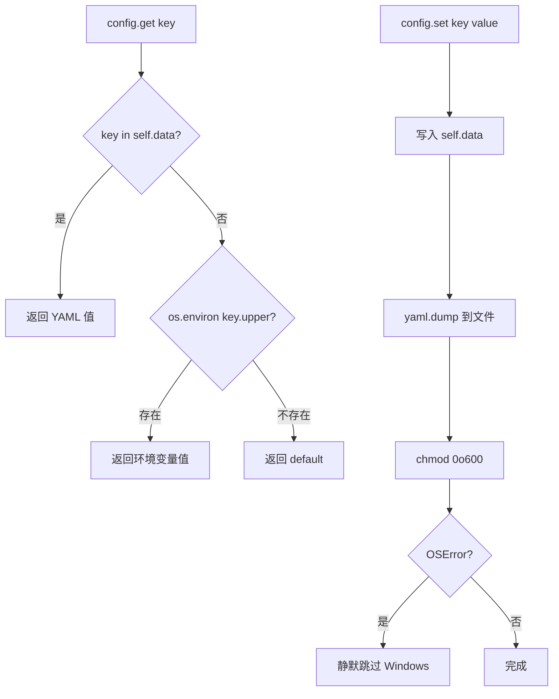
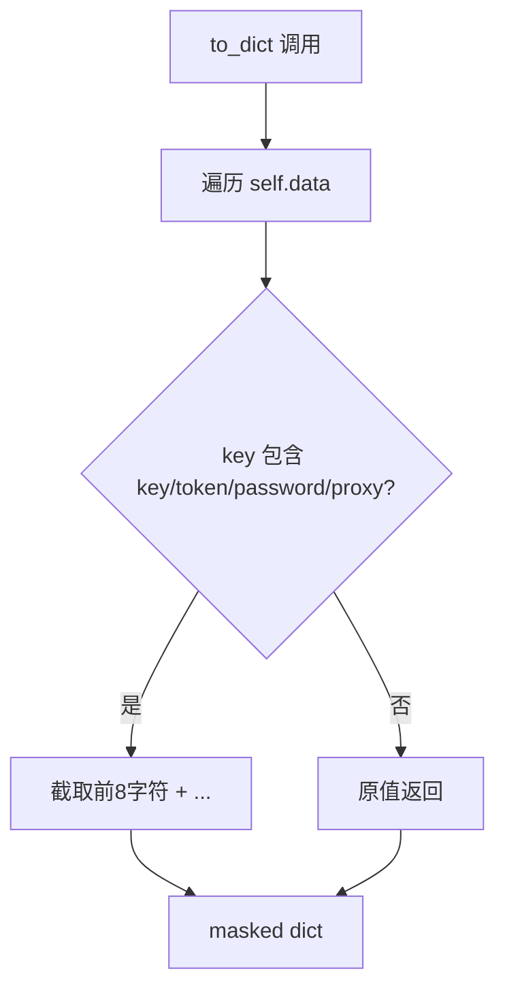
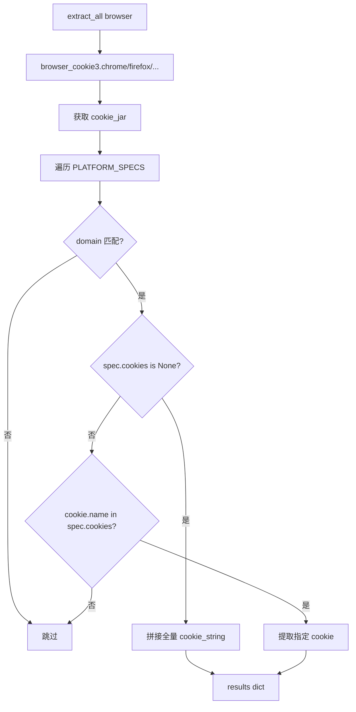

# PD-168.02 Agent-Reach — YAML 凭据管理与浏览器 Cookie 自动提取

> 文档编号：PD-168.02
> 来源：Agent-Reach `agent_reach/config.py`, `agent_reach/cookie_extract.py`, `agent_reach/doctor.py`
> GitHub：https://github.com/Panniantong/Agent-Reach.git
> 问题域：PD-168 凭据与密钥管理 Credential & Secret Management
> 状态：可复用方案

---

## 第 1 章 问题与动机

### 1.1 核心问题

多渠道 Agent 系统需要管理大量异构凭据：API Key（Exa、Groq、GitHub）、浏览器 Cookie（Twitter auth_token/ct0、小红书全量 Cookie、Bilibili SESSDATA）、代理地址（Reddit/Bilibili proxy）等。这些凭据有以下共性挑战：

1. **安全存储**：凭据不能明文暴露在日志、终端输出或版本控制中
2. **多来源获取**：有些凭据需要手动输入，有些可以从浏览器自动提取
3. **特性门控**：不同功能依赖不同凭据组合，缺少某个凭据时应优雅降级而非崩溃
4. **运行时诊断**：用户需要快速了解哪些渠道可用、哪些缺少配置
5. **跨平台兼容**：chmod 600 在 Unix 上有效，Windows 上需要静默跳过

### 1.2 Agent-Reach 的解法概述

Agent-Reach 采用"YAML 单文件 + 环境变量回退 + 浏览器自动提取"三层架构：

1. **Config 类**（`agent_reach/config.py:15-102`）：YAML 文件存储 + chmod 600 权限加固 + 敏感值关键词脱敏 + 环境变量大写回退
2. **FEATURE_REQUIREMENTS 映射**（`agent_reach/config.py:22-28`）：声明式特性→凭据依赖，`is_configured()` 一行判断特性可用性
3. **cookie_extract 模块**（`agent_reach/cookie_extract.py:38-112`）：browser_cookie3 库从 Chrome/Firefox/Edge/Brave/Opera 提取多平台 Cookie
4. **Doctor 安全审计**（`agent_reach/doctor.py:77-89`）：运行时检测配置文件权限是否过宽，提示修复
5. **CLI setup 向导**（`agent_reach/cli.py:704-789`）：交互式引导用户逐项配置凭据，配置后立即验证

### 1.3 设计思想

| 设计原则 | 具体实现 | 理由 | 替代方案 |
|----------|----------|------|----------|
| 配置文件优先于环境变量 | `get()` 先查 YAML 再查 `os.environ` 大写 key | 本地开发用文件，CI/CD 用环境变量，两者兼容 | 纯环境变量（无持久化）/ dotenv（多一个依赖） |
| 写入即加固 | `save()` 每次写入后自动 `chmod 0o600` | 防止用户忘记设置权限，安全默认 | 手动提醒用户 chmod（容易遗忘） |
| 关键词匹配脱敏 | `to_dict()` 检测 key/token/password/proxy 子串 | 无需维护敏感字段白名单，新增凭据自动脱敏 | 显式标记敏感字段（需手动维护列表） |
| 声明式特性门控 | `FEATURE_REQUIREMENTS` 字典映射 feature→keys | 一处定义，`is_configured()` 和 `get_configured_features()` 复用 | 每个 channel 自行检查（分散且不一致） |
| 浏览器 Cookie 自动提取 | `PLATFORM_SPECS` 声明域名+所需 cookie 名 | 新增平台只需加一条 spec，提取逻辑零改动 | 每个平台写独立提取函数（代码重复） |

---

## 第 2 章 源码实现分析

### 2.1 架构概览

```
┌─────────────────────────────────────────────────────────────────┐
│                        CLI Layer                                 │
│  setup 向导 ─── configure 命令 ─── doctor 诊断                    │
└──────┬──────────────┬──────────────────┬────────────────────────┘
       │              │                  │
       ▼              ▼                  ▼
┌──────────┐  ┌───────────────┐  ┌──────────────┐
│  Config   │  │ cookie_extract│  │   Doctor     │
│ (YAML +   │  │ (browser →   │  │ (权限审计 +  │
│  env var) │  │  cookie jar) │  │  渠道状态)   │
└──────┬───┘  └──────┬────────┘  └──────┬───────┘
       │             │                   │
       ▼             ▼                   ▼
  ~/.agent-reach/   browser_cookie3    Channel.check()
   config.yaml      (Chrome/FF/Edge)   (各渠道自检)
```

Config 是整个凭据系统的核心枢纽：cookie_extract 提取后通过 `config.set()` 写入，Doctor 通过 `config.get()` 读取并检查，各 Channel 通过 `config.get()` 获取运行时凭据。

### 2.2 核心实现

#### 2.2.1 Config 类：YAML 存储 + chmod 加固 + 环境变量回退



对应源码 `agent_reach/config.py:15-102`：

```python
class Config:
    """Manages Agent Reach configuration."""

    CONFIG_DIR = Path.home() / ".agent-reach"
    CONFIG_FILE = CONFIG_DIR / "config.yaml"

    # Feature → required config keys
    FEATURE_REQUIREMENTS = {
        "exa_search": ["exa_api_key"],
        "reddit_proxy": ["reddit_proxy"],
        "twitter_bird": ["twitter_auth_token", "twitter_ct0"],
        "groq_whisper": ["groq_api_key"],
        "github_token": ["github_token"],
    }

    def get(self, key: str, default: Any = None) -> Any:
        """Get a config value. Also checks environment variables (uppercase)."""
        if key in self.data:
            return self.data[key]
        env_val = os.environ.get(key.upper())
        if env_val:
            return env_val
        return default

    def save(self):
        """Save config to YAML file."""
        self._ensure_dir()
        with open(self.config_path, "w") as f:
            yaml.dump(self.data, f, default_flow_style=False, allow_unicode=True)
        try:
            import stat
            self.config_path.chmod(stat.S_IRUSR | stat.S_IWUSR)  # 0o600
        except OSError:
            pass  # Windows or permission edge cases
```

关键设计点：
- `get()` 实现两级查找：YAML 文件 → 环境变量（大写转换），文件优先级高于环境变量（`config.py:64-65`）
- `save()` 每次写入后立即 `chmod 0o600`（`config.py:57`），确保凭据文件仅当前用户可读写
- `OSError` 静默捕获（`config.py:58-59`），兼容 Windows 等不支持 Unix 权限的平台

#### 2.2.2 敏感值脱敏显示



对应源码 `agent_reach/config.py:94-102`：

```python
def to_dict(self) -> dict:
    """Return config as dict (masks sensitive values)."""
    masked = {}
    for k, v in self.data.items():
        if any(s in k.lower() for s in ("key", "token", "password", "proxy")):
            masked[k] = f"{str(v)[:8]}..." if v else None
        else:
            masked[k] = v
    return masked
```

脱敏策略基于 key 名称的子串匹配（`config.py:98`），覆盖 `key`、`token`、`password`、`proxy` 四类敏感词。新增凭据只要命名包含这些子串就自动脱敏，无需维护白名单。

#### 2.2.3 浏览器 Cookie 自动提取



对应源码 `agent_reach/cookie_extract.py:16-112`：

```python
PLATFORM_SPECS = [
    {
        "name": "Twitter/X",
        "domains": [".x.com", ".twitter.com"],
        "cookies": ["auth_token", "ct0"],
        "config_key": "twitter",
    },
    {
        "name": "XiaoHongShu",
        "domains": [".xiaohongshu.com"],
        "cookies": None,  # None = grab all cookies as header string
        "config_key": "xhs",
    },
    {
        "name": "Bilibili",
        "domains": [".bilibili.com"],
        "cookies": ["SESSDATA", "bili_jct"],
        "config_key": "bilibili",
    },
]
```

`PLATFORM_SPECS` 是声明式的平台 Cookie 规格表（`cookie_extract.py:16-35`）：
- `cookies: ["auth_token", "ct0"]` — 精确提取指定名称的 cookie
- `cookies: None` — 抓取该域名下所有 cookie 拼成 header 字符串（小红书场景，cookie 名不固定）
- 新增平台只需追加一条 spec，`extract_all()` 的遍历逻辑零改动

`configure_from_browser()`（`cookie_extract.py:115-166`）将提取结果直接写入 Config，并返回 `(platform, success, message)` 三元组供 CLI 展示。

### 2.3 实现细节

**Doctor 权限审计**（`agent_reach/doctor.py:77-89`）：

Doctor 在生成状态报告时，额外检查 config.yaml 的文件权限位。如果 `S_IRGRP | S_IROTH`（组用户或其他用户可读）为真，输出安全警告并提示 `chmod 600` 修复命令。这是一个运行时安全网——即使 `save()` 的自动 chmod 因某种原因失效，Doctor 也能发现并提醒。

**FEATURE_REQUIREMENTS 声明式门控**（`agent_reach/config.py:22-28, 82-91`）：

`is_configured(feature)` 通过查表判断特性是否可用，`get_configured_features()` 一次性返回所有特性状态。这种声明式设计让 CLI setup 向导、Doctor 诊断、Channel check 三处都能复用同一份依赖定义，避免了"Twitter 需要哪些 key"这类知识散落在多处代码中。

**CLI setup 交互式向导**（`agent_reach/cli.py:704-789`）：

setup 命令按 Tier 分层引导用户配置凭据：推荐项（Exa）→ 可选项（GitHub Token、Reddit Proxy、Groq Key）。每项配置后立即 `config.set()` 持久化，已配置的项显示脱敏值并询问是否更换。

---

## 第 3 章 迁移指南

### 3.1 迁移清单

**阶段 1：基础凭据管理（1 个文件）**

- [ ] 创建 `config.py`，实现 Config 类（YAML 读写 + chmod 600 + 环境变量回退）
- [ ] 定义 `FEATURE_REQUIREMENTS` 映射表
- [ ] 实现 `to_dict()` 敏感值脱敏
- [ ] 编写 `test_config.py` 单元测试

**阶段 2：浏览器 Cookie 提取（1 个文件）**

- [ ] 安装 `browser-cookie3` 依赖
- [ ] 创建 `cookie_extract.py`，定义 `PLATFORM_SPECS`
- [ ] 实现 `extract_all()` 和 `configure_from_browser()`
- [ ] 根据自己的目标平台修改 `PLATFORM_SPECS`

**阶段 3：运行时诊断（可选）**

- [ ] 在 Doctor/健康检查模块中加入配置文件权限审计
- [ ] 实现 `is_configured()` 特性门控，各渠道 check 时调用

### 3.2 适配代码模板

#### 最小可用 Config 类

```python
"""Minimal credential manager — YAML + chmod 600 + env fallback."""

import os
import stat
from pathlib import Path
from typing import Any, Optional

import yaml


class CredentialManager:
    """Manages credentials with YAML storage, chmod protection, and env fallback."""

    CONFIG_DIR = Path.home() / ".myapp"
    CONFIG_FILE = CONFIG_DIR / "credentials.yaml"

    # Declare feature → required credential keys
    FEATURE_REQUIREMENTS: dict[str, list[str]] = {
        # "my_feature": ["api_key", "api_secret"],
    }

    SENSITIVE_KEYWORDS = ("key", "token", "password", "secret", "proxy", "cookie")

    def __init__(self, config_path: Optional[Path] = None):
        self.config_path = Path(config_path) if config_path else self.CONFIG_FILE
        self.config_dir = self.config_path.parent
        self.data: dict = {}
        self.config_dir.mkdir(parents=True, exist_ok=True)
        self._load()

    def _load(self):
        if self.config_path.exists():
            with open(self.config_path, "r") as f:
                self.data = yaml.safe_load(f) or {}

    def get(self, key: str, default: Any = None) -> Any:
        """YAML first, then env var (uppercase), then default."""
        if key in self.data:
            return self.data[key]
        env_val = os.environ.get(key.upper())
        return env_val if env_val else default

    def set(self, key: str, value: Any):
        """Set and persist with chmod 600."""
        self.data[key] = value
        self.config_dir.mkdir(parents=True, exist_ok=True)
        with open(self.config_path, "w") as f:
            yaml.dump(self.data, f, default_flow_style=False, allow_unicode=True)
        try:
            self.config_path.chmod(stat.S_IRUSR | stat.S_IWUSR)
        except OSError:
            pass  # Windows compatibility

    def delete(self, key: str):
        self.data.pop(key, None)
        self.set(key="__trigger_save__", value=None)  # trigger save
        self.data.pop("__trigger_save__", None)

    def is_configured(self, feature: str) -> bool:
        required = self.FEATURE_REQUIREMENTS.get(feature, [])
        return all(self.get(k) for k in required)

    def to_safe_dict(self) -> dict:
        """Return dict with sensitive values masked."""
        masked = {}
        for k, v in self.data.items():
            if any(s in k.lower() for s in self.SENSITIVE_KEYWORDS):
                masked[k] = f"{str(v)[:8]}..." if v else None
            else:
                masked[k] = v
        return masked

    def check_file_permissions(self) -> Optional[str]:
        """Return warning message if config file has overly permissive permissions."""
        if not self.config_path.exists():
            return None
        try:
            mode = self.config_path.stat().st_mode
            if mode & (stat.S_IRGRP | stat.S_IROTH):
                return (
                    f"Config file {self.config_path} is readable by other users. "
                    f"Fix: chmod 600 {self.config_path}"
                )
        except OSError:
            pass
        return None
```

#### 浏览器 Cookie 提取模板

```python
"""Browser cookie extraction — declare specs, extract automatically."""

from typing import Dict, List, Tuple

# Declare: platform → domain patterns → needed cookie names
PLATFORM_SPECS = [
    {
        "name": "MyPlatform",
        "domains": [".example.com"],
        "cookies": ["session_id", "csrf_token"],  # None = grab all
        "config_key": "myplatform",
    },
]


def extract_cookies(browser: str = "chrome") -> Dict[str, dict]:
    import browser_cookie3

    browser_funcs = {
        "chrome": browser_cookie3.chrome,
        "firefox": browser_cookie3.firefox,
        "edge": browser_cookie3.edge,
    }
    if browser not in browser_funcs:
        raise ValueError(f"Unsupported: {browser}")

    cookie_jar = browser_funcs[browser]()
    results = {}

    for spec in PLATFORM_SPECS:
        matched = {}
        all_domain_cookies = []

        for cookie in cookie_jar:
            if any(cookie.domain.endswith(d) or cookie.domain == d.lstrip(".")
                   for d in spec["domains"]):
                all_domain_cookies.append(cookie)
                if spec["cookies"] and cookie.name in spec["cookies"]:
                    matched[cookie.name] = cookie.value

        if spec["cookies"] is None and all_domain_cookies:
            results[spec["config_key"]] = {
                "cookie_string": "; ".join(f"{c.name}={c.value}" for c in all_domain_cookies)
            }
        elif matched:
            results[spec["config_key"]] = matched

    return results
```

### 3.3 适用场景

| 场景 | 适用度 | 说明 |
|------|--------|------|
| 多渠道 Agent（需管理 5+ 平台凭据） | ⭐⭐⭐ | 声明式 FEATURE_REQUIREMENTS + Cookie 自动提取，完美匹配 |
| CLI 工具（单用户本地运行） | ⭐⭐⭐ | YAML 文件 + chmod 600 是 CLI 工具的标准做法 |
| 桌面应用（需要浏览器 Cookie） | ⭐⭐⭐ | browser_cookie3 支持主流浏览器，一键提取 |
| Web 服务（多用户共享） | ⭐ | 不适用，需要数据库存储 + 加密 + 用户隔离 |
| CI/CD 环境 | ⭐⭐ | 环境变量回退机制可用，但 YAML 文件在容器中无意义 |

---

## 第 4 章 测试用例

基于 Agent-Reach 真实测试（`tests/test_config.py`）扩展：

```python
"""Tests for credential management — based on Agent-Reach test_config.py patterns."""

import os
import stat
import tempfile
from pathlib import Path

import pytest
import yaml


class TestCredentialManager:
    """Core Config functionality tests."""

    @pytest.fixture
    def tmp_config(self, tmp_path):
        config_file = tmp_path / "config.yaml"
        from config import CredentialManager
        return CredentialManager(config_path=config_file)

    def test_init_creates_dir(self, tmp_path):
        """Config.__init__ auto-creates parent directory."""
        config_file = tmp_path / "subdir" / "config.yaml"
        from config import CredentialManager
        mgr = CredentialManager(config_path=config_file)
        assert config_file.parent.exists()

    def test_set_and_get(self, tmp_config):
        """Basic set/get round-trip."""
        tmp_config.set("test_key", "test_value")
        assert tmp_config.get("test_key") == "test_value"

    def test_get_default(self, tmp_config):
        """Missing key returns default."""
        assert tmp_config.get("nonexistent") is None
        assert tmp_config.get("nonexistent", "fallback") == "fallback"

    def test_env_var_fallback(self, tmp_config, monkeypatch):
        """Environment variable used when YAML key missing."""
        monkeypatch.setenv("MY_API_KEY", "from_env")
        assert tmp_config.get("my_api_key") == "from_env"

    def test_yaml_priority_over_env(self, tmp_config, monkeypatch):
        """YAML value takes precedence over env var."""
        monkeypatch.setenv("MY_KEY", "from_env")
        tmp_config.set("my_key", "from_yaml")
        assert tmp_config.get("my_key") == "from_yaml"

    def test_chmod_600_on_save(self, tmp_config):
        """Save applies chmod 600 to config file."""
        tmp_config.set("secret", "value")
        mode = tmp_config.config_path.stat().st_mode
        assert not (mode & stat.S_IRGRP), "Group should not have read"
        assert not (mode & stat.S_IROTH), "Others should not have read"
        assert mode & stat.S_IRUSR, "Owner should have read"
        assert mode & stat.S_IWUSR, "Owner should have write"

    def test_sensitive_masking(self, tmp_config):
        """to_safe_dict masks keys containing sensitive keywords."""
        tmp_config.set("exa_api_key", "super-secret-key-12345")
        tmp_config.set("normal_setting", "visible")
        masked = tmp_config.to_safe_dict()
        assert masked["exa_api_key"] == "super-se..."
        assert masked["normal_setting"] == "visible"

    def test_is_configured_false_when_missing(self, tmp_config):
        """Feature not configured when required keys missing."""
        tmp_config.FEATURE_REQUIREMENTS["test_feature"] = ["api_key", "api_secret"]
        assert not tmp_config.is_configured("test_feature")

    def test_is_configured_true_when_present(self, tmp_config):
        """Feature configured when all required keys present."""
        tmp_config.FEATURE_REQUIREMENTS["test_feature"] = ["api_key"]
        tmp_config.set("api_key", "test-key")
        assert tmp_config.is_configured("test_feature")

    def test_permission_check_warns_on_open_file(self, tmp_config):
        """check_file_permissions warns when file is world-readable."""
        tmp_config.set("key", "value")
        # Make file world-readable
        tmp_config.config_path.chmod(0o644)
        warning = tmp_config.check_file_permissions()
        assert warning is not None
        assert "chmod 600" in warning

    def test_permission_check_ok_on_restricted_file(self, tmp_config):
        """check_file_permissions returns None for properly restricted file."""
        tmp_config.set("key", "value")
        # Already chmod 600 from save()
        warning = tmp_config.check_file_permissions()
        assert warning is None


class TestCookieExtraction:
    """Tests for browser cookie extraction logic (mocked)."""

    def test_platform_spec_structure(self):
        """PLATFORM_SPECS entries have required fields."""
        from cookie_extract import PLATFORM_SPECS
        for spec in PLATFORM_SPECS:
            assert "name" in spec
            assert "domains" in spec
            assert "config_key" in spec
            assert isinstance(spec["domains"], list)

    def test_domain_matching(self):
        """Cookie domain matching covers both .domain and domain formats."""
        from cookie_extract import PLATFORM_SPECS
        twitter_spec = next(s for s in PLATFORM_SPECS if s["config_key"] == "twitter")
        # Should match both .x.com and x.com
        assert ".x.com" in twitter_spec["domains"]
        assert ".twitter.com" in twitter_spec["domains"]
```

---

## 第 5 章 跨域关联

| 关联域 | 关系类型 | 说明 |
|--------|----------|------|
| PD-141 可插拔渠道架构 | 强依赖 | Channel 基类的 `check(config)` 方法依赖 Config 提供凭据，Tier 分级（0/1/2）本质上是凭据需求等级 |
| PD-143 环境检测与一键安装 | 协同 | Doctor 的权限审计是环境检测的安全子集；setup 向导是一键安装的凭据配置部分 |
| PD-169 环境引导与健康检查 | 协同 | Doctor `format_report()` 输出的安全提示是健康检查的一部分，`check_all()` 遍历所有 Channel 验证凭据可用性 |
| PD-04 工具系统设计 | 间接依赖 | MCP 工具（如 Exa Search）的可用性取决于凭据是否配置，`is_configured("exa_search")` 是工具注册的前置条件 |
| PD-11 可观测性 | 协同 | `to_dict()` 脱敏输出可安全写入日志/追踪系统，不泄露凭据明文 |

---

## 第 6 章 来源文件索引

| 文件 | 行范围 | 关键实现 |
|------|--------|----------|
| `agent_reach/config.py` | L15-L102 | Config 类完整实现：YAML 读写、chmod 600、环境变量回退、敏感值脱敏、特性门控 |
| `agent_reach/config.py` | L22-L28 | FEATURE_REQUIREMENTS 声明式特性→凭据映射 |
| `agent_reach/config.py` | L49-L59 | save() 方法：YAML 写入 + chmod 0o600 权限加固 |
| `agent_reach/config.py` | L61-L70 | get() 方法：YAML 优先 + 环境变量大写回退 |
| `agent_reach/config.py` | L94-L102 | to_dict() 方法：关键词匹配脱敏 |
| `agent_reach/cookie_extract.py` | L16-L35 | PLATFORM_SPECS 声明式平台 Cookie 规格表 |
| `agent_reach/cookie_extract.py` | L38-L112 | extract_all() 浏览器 Cookie 提取核心逻辑 |
| `agent_reach/cookie_extract.py` | L115-L166 | configure_from_browser() 提取→配置一体化 |
| `agent_reach/doctor.py` | L77-L89 | 配置文件权限审计（S_IRGRP/S_IROTH 检测） |
| `agent_reach/cli.py` | L551-L681 | configure 命令：手动配置 + 浏览器自动提取 |
| `agent_reach/cli.py` | L704-L789 | setup 向导：交互式分层凭据配置 |
| `agent_reach/channels/base.py` | L18-L37 | Channel 基类：tier 字段定义凭据需求等级 |
| `agent_reach/channels/twitter.py` | L20-L38 | TwitterChannel.check()：验证 bird CLI + Cookie 配置 |
| `tests/test_config.py` | L1-L81 | Config 单元测试：set/get、env 回退、脱敏、特性门控 |

---

## 第 7 章 横向对比维度

> **重要：** 本章用于自动填充 Butcher Wiki 的横向对比表。

```json comparison_data
{
  "project": "Agent-Reach",
  "dimensions": {
    "存储方式": "YAML 单文件 ~/.agent-reach/config.yaml，yaml.safe_load/dump",
    "权限加固": "save() 自动 chmod 0o600 + Doctor 运行时权限审计双保险",
    "脱敏策略": "key 名子串匹配（key/token/password/proxy），前 8 字符 + 省略号",
    "凭据获取": "三通道：手动输入 + 浏览器 Cookie 自动提取 + 环境变量回退",
    "特性门控": "FEATURE_REQUIREMENTS 声明式映射，is_configured() 一行判断",
    "多平台Cookie": "PLATFORM_SPECS 声明式规格表，支持精确提取和全量抓取两种模式"
  }
}
```

### 域元数据补充

```json domain_metadata
{
  "solution_summary": "Agent-Reach 用 YAML 单文件 + chmod 600 自动加固 + browser_cookie3 多浏览器 Cookie 提取 + FEATURE_REQUIREMENTS 声明式特性门控实现凭据管理",
  "description": "多渠道 Agent 的异构凭据统一管理与自动化获取",
  "sub_problems": [
    "特性级凭据依赖声明与可用性判断",
    "多格式凭据输入解析（Cookie 字符串/键值对/浏览器自动提取）"
  ],
  "best_practices": [
    "FEATURE_REQUIREMENTS 声明式映射避免凭据依赖知识散落多处",
    "Doctor 运行时权限审计作为 chmod 自动加固的安全网"
  ]
}
```
