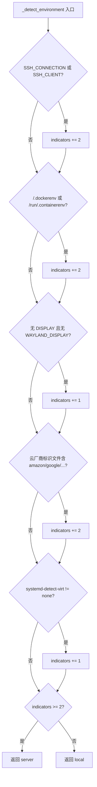
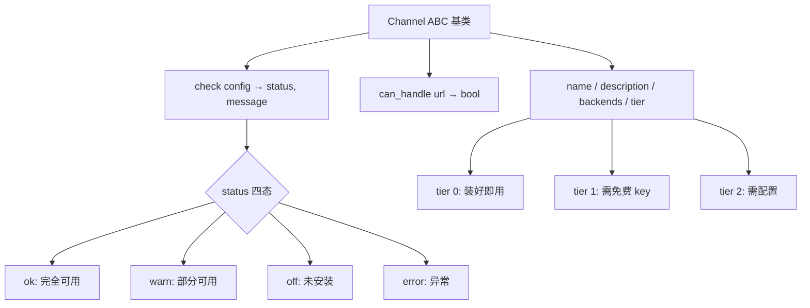

# PD-169.01 Agent Reach — 环境引导与分层健康检查

> 文档编号：PD-169.01
> 来源：Agent Reach `agent_reach/cli.py` `agent_reach/doctor.py` `agent_reach/channels/base.py`
> GitHub：https://github.com/Panniantong/Agent-Reach.git
> 问题域：PD-169 环境引导与健康检查 Environment Bootstrap & Health Check
> 状态：可复用方案

---

## 第 1 章 问题与动机

### 1.1 核心问题

AI Agent 工具链依赖大量外部系统——CLI 工具（gh、bird、yt-dlp、mcporter）、浏览器 Cookie、API Key、代理服务器。这些依赖分散在不同平台，安装方式因操作系统而异，配置格式各不相同。一个 Agent 要正常工作，需要：

1. **环境感知**：判断自己运行在本地开发机还是云服务器，因为两种环境的能力边界完全不同（本地有浏览器可提取 Cookie，服务器需要代理绕过 IP 封锁）
2. **依赖安装**：跨平台自动安装 gh CLI、Node.js、bird CLI、mcporter 等工具，且每个工具的安装方式在 Linux/macOS/Windows 上不同
3. **健康检查**：安装完成后，需要逐一验证每个渠道（GitHub、Twitter、YouTube、Reddit 等 12+ 平台）是否真正可用，而不仅仅是"工具已安装"
4. **安全模式**：在生产环境中，自动安装系统级软件是危险的，需要 dry-run 和 safe mode 让用户预览变更

传统做法是写一个巨大的 `install.sh`，但这无法处理渠道级别的健康检查，也无法给 Agent 提供结构化的状态反馈。

### 1.2 Agent Reach 的解法概述

Agent Reach 实现了一套完整的"安装→检测→诊断→巡检"流水线：

1. **环境自动检测**（`cli.py:510-548`）：通过 SSH_CONNECTION、/.dockerenv、DISPLAY、云厂商标识文件、systemd-detect-virt 等 6 类信号的加权评分，自动判断 local/server 环境
2. **三模式安装器**（`cli.py:113-234`）：normal / safe / dry-run 三种模式，safe 模式只检查不安装并输出手动命令，dry-run 模式完全不做任何变更
3. **Channel 抽象 + Tier 分级**（`channels/base.py:18-37`）：每个平台实现 `check(config)` 方法返回 `(status, message)`，按 tier 0/1/2 分级展示
4. **doctor 聚合报告**（`doctor.py:12-91`）：遍历所有 Channel 的 check() 结果，按 Tier 分层格式化输出，附带安全检查（config 文件权限）
5. **watch 定时巡检**（`cli.py:849-913`）：静默模式，只在发现问题或有更新时输出，适合 cron 定时任务

### 1.3 设计思想

| 设计原则 | 具体实现 | 理由 | 替代方案 |
|----------|----------|------|----------|
| 渠道自治 | 每个 Channel 子类自己实现 check()，doctor 只做聚合 | 新增渠道只需加一个文件，不改 doctor 逻辑 | 集中式 if-else 检查（难维护） |
| 加权评分环境检测 | 6 类信号各有权重（SSH=2, Docker=2, 无显示=1），≥2 判定为 server | 单一信号不可靠（如 SSH 转发到本地），多信号交叉验证更准确 | 只检查 SSH_CONNECTION（误判率高） |
| 三模式安全梯度 | normal→safe→dry-run，逐级降低系统侵入性 | 生产环境不能自动 apt install，但开发环境需要一键搞定 | 只有 install 和 --help（不够灵活） |
| Tier 分级展示 | tier 0 装好即用、tier 1 需免费 key、tier 2 需配置 | 用户一眼看出哪些能力是免费的、哪些需要额外配置 | 平铺所有渠道（信息过载） |
| 配置双源 | Config.get() 先查 YAML 文件再查环境变量 | 支持文件配置和 CI/CD 环境变量两种场景 | 只支持文件或只支持环境变量 |

---

## 第 2 章 源码实现分析

### 2.1 架构概览

Agent Reach 的环境引导系统由四层组成：

```
┌─────────────────────────────────────────────────────────┐
│                    CLI 入口 (cli.py)                     │
│  install / doctor / watch / setup / configure / check   │
├─────────────┬───────────────┬───────────────────────────┤
│ Installer   │   Doctor      │   Watch (定时巡检)         │
│ 三模式安装   │  聚合 check() │  静默模式 + 更新检查       │
├─────────────┴───────────────┴───────────────────────────┤
│              Channel 抽象层 (channels/)                   │
│  base.Channel → check(config) → (status, message)       │
│  ┌────────┬─────────┬─────────┬────────┬──────────┐     │
│  │GitHub  │Twitter  │YouTube  │Reddit  │ ...12个   │     │
│  │tier=0  │tier=1   │tier=0   │tier=1  │          │     │
│  └────────┴─────────┴─────────┴────────┴──────────┘     │
├─────────────────────────────────────────────────────────┤
│           Config 层 (config.py)                          │
│  YAML 文件 + 环境变量双源 / chmod 600 安全存储            │
├─────────────────────────────────────────────────────────┤
│           系统依赖层                                      │
│  gh CLI / Node.js / bird / mcporter / yt-dlp / undici   │
└─────────────────────────────────────────────────────────┘
```

### 2.2 核心实现

#### 2.2.1 环境自动检测：加权评分算法



对应源码 `agent_reach/cli.py:510-548`：
```python
def _detect_environment():
    """Auto-detect if running on local computer or server."""
    import os
    indicators = 0

    # SSH session
    if os.environ.get("SSH_CONNECTION") or os.environ.get("SSH_CLIENT"):
        indicators += 2

    # Docker / container
    if os.path.exists("/.dockerenv") or os.path.exists("/run/.containerenv"):
        indicators += 2

    # No display (headless)
    if not os.environ.get("DISPLAY") and not os.environ.get("WAYLAND_DISPLAY"):
        indicators += 1

    # Cloud VM identifiers
    for cloud_file in ["/sys/hypervisor/uuid", "/sys/class/dmi/id/product_name"]:
        if os.path.exists(cloud_file):
            try:
                content = open(cloud_file).read().lower()
                if any(x in content for x in ["amazon", "google", "microsoft",
                       "digitalocean", "linode", "vultr", "hetzner"]):
                    indicators += 2
            except:
                pass

    # systemd-detect-virt
    try:
        import subprocess
        result = subprocess.run(["systemd-detect-virt"],
                                capture_output=True, text=True, timeout=3)
        if result.returncode == 0 and result.stdout.strip() != "none":
            indicators += 1
    except:
        pass

    return "server" if indicators >= 2 else "local"
```

#### 2.2.2 Channel 抽象基类与 Tier 分级注册



对应源码 `agent_reach/channels/base.py:18-37`：
```python
class Channel(ABC):
    """Base class for all channels."""
    name: str = ""                    # e.g. "youtube"
    description: str = ""             # e.g. "YouTube 视频和字幕"
    backends: List[str] = []          # e.g. ["yt-dlp"]
    tier: int = 0                     # 0=zero-config, 1=needs free key, 2=needs setup

    @abstractmethod
    def can_handle(self, url: str) -> bool:
        """Check if this channel can handle this URL."""
        ...

    def check(self, config=None) -> Tuple[str, str]:
        """Check if this channel's upstream tool is available.
        Returns (status, message) where status is 'ok'/'warn'/'off'/'error'."""
        return "ok", f"{'、'.join(self.backends) if self.backends else '内置'}"
```

渠道注册表 `agent_reach/channels/__init__.py:25-38`：
```python
ALL_CHANNELS: List[Channel] = [
    GitHubChannel(),      # tier=0
    TwitterChannel(),     # tier=1
    YouTubeChannel(),     # tier=0
    RedditChannel(),      # tier=1
    BilibiliChannel(),    # tier=1
    XiaoHongShuChannel(), # tier=2
    DouyinChannel(),      # tier=2
    LinkedInChannel(),    # tier=2
    BossZhipinChannel(),  # tier=2
    RSSChannel(),         # tier=0
    ExaSearchChannel(),   # tier=1
    WebChannel(),         # tier=0
]
```

### 2.3 实现细节

#### 三模式安装器的分支逻辑

`_cmd_install` 函数（`cli.py:113-234`）根据 `--safe` 和 `--dry-run` 标志分发到三套不同的安装函数：

- `_install_system_deps()`（`cli.py:277-371`）：真正执行 apt/brew/npm install
- `_install_system_deps_safe()`（`cli.py:374-401`）：只检查 which，输出手动安装命令
- `_install_system_deps_dryrun()`（`cli.py:404-422`）：只显示"would install via: ..."

每个依赖的安装都遵循相同模式：先 `shutil.which()` 检查是否已安装，已安装则跳过，未安装则按 OS 类型选择安装命令，安装后再次 `shutil.which()` 验证。

#### doctor 分层报告生成

`format_report()`（`doctor.py:27-91`）按 Tier 分组输出：
- Tier 0 标题："✅ 装好即用"
- Tier 1 标题："🔍 搜索（mcporter 即可解锁）"
- Tier 2 标题："🔧 配置后可用"

报告末尾还执行安全检查——检测 `config.yaml` 的文件权限是否过宽（`doctor.py:77-89`），如果 group/other 可读则警告用户 `chmod 600`。

#### Config 双源查找与安全存储

`Config.get()`（`config.py:61-70`）实现了 YAML 文件优先、环境变量兜底的双源查找。`Config.save()`（`config.py:49-59`）在写入后自动 `chmod 0o600`，防止凭据泄露。`Config.to_dict()`（`config.py:94-102`）对含 key/token/password/proxy 的字段自动脱敏，只显示前 8 字符。

---

## 第 3 章 迁移指南

### 3.1 迁移清单

**阶段 1：Channel 抽象层（核心）**
- [ ] 定义 `Channel` 基类，包含 `name`、`description`、`backends`、`tier` 属性和 `check(config)` 抽象方法
- [ ] 为每个外部依赖实现一个 Channel 子类，check() 返回 `(status, message)` 元组
- [ ] 创建 `ALL_CHANNELS` 注册表，按 tier 排序
- [ ] 实现 `check_all(config)` 聚合函数和 `format_report()` 格式化函数

**阶段 2：环境检测**
- [ ] 实现 `_detect_environment()` 加权评分函数
- [ ] 根据环境类型调整安装行为（本地自动导入 Cookie，服务器提示配置代理）

**阶段 3：三模式安装器**
- [ ] 实现 normal 模式：自动安装 + 验证
- [ ] 实现 safe 模式：只检查 + 输出手动命令
- [ ] 实现 dry-run 模式：只显示计划

**阶段 4：巡检与更新**
- [ ] 实现 watch 命令：静默模式，只输出异常
- [ ] 实现 check-update：对比 GitHub Release 版本号

### 3.2 适配代码模板

以下是一个可直接复用的 Channel + Doctor 框架：

```python
"""可复用的 Channel + Doctor 框架"""
import shutil
import subprocess
from abc import ABC, abstractmethod
from typing import Dict, List, Tuple, Optional


class Channel(ABC):
    """平台渠道基类。每个外部依赖实现一个子类。"""
    name: str = ""
    description: str = ""
    backends: List[str] = []
    tier: int = 0  # 0=零配置, 1=需免费key, 2=需付费/复杂配置

    @abstractmethod
    def check(self, config=None) -> Tuple[str, str]:
        """返回 (status, message)。status: ok/warn/off/error"""
        ...


class CLIToolChannel(Channel):
    """通用 CLI 工具检查模板。"""
    binary_names: List[str] = []
    install_hint: str = ""
    verify_cmd: List[str] = []  # 验证命令，如 ["gh", "auth", "status"]

    def check(self, config=None) -> Tuple[str, str]:
        binary = None
        for name in self.binary_names:
            if shutil.which(name):
                binary = name
                break
        if not binary:
            return "off", f"未安装。安装方法：{self.install_hint}"
        if self.verify_cmd:
            try:
                r = subprocess.run(self.verify_cmd, capture_output=True,
                                   text=True, timeout=10)
                if r.returncode == 0:
                    return "ok", "完全可用"
                return "warn", f"已安装但验证失败：{r.stderr[:100]}"
            except subprocess.TimeoutExpired:
                return "warn", "已安装但验证超时"
            except Exception as e:
                return "error", f"检查异常：{e}"
        return "ok", "已安装"


def detect_environment() -> str:
    """加权评分环境检测。返回 'local' 或 'server'。"""
    import os
    indicators = 0
    # SSH 会话
    if os.environ.get("SSH_CONNECTION") or os.environ.get("SSH_CLIENT"):
        indicators += 2
    # 容器环境
    if os.path.exists("/.dockerenv") or os.path.exists("/run/.containerenv"):
        indicators += 2
    # 无图形界面
    if not os.environ.get("DISPLAY") and not os.environ.get("WAYLAND_DISPLAY"):
        indicators += 1
    # 云厂商标识
    for f in ["/sys/hypervisor/uuid", "/sys/class/dmi/id/product_name"]:
        if os.path.exists(f):
            try:
                content = open(f).read().lower()
                if any(v in content for v in ["amazon", "google", "microsoft"]):
                    indicators += 2
            except OSError:
                pass
    return "server" if indicators >= 2 else "local"


def check_all(channels: List[Channel], config=None) -> Dict[str, dict]:
    """聚合所有渠道的健康检查结果。"""
    results = {}
    for ch in channels:
        status, message = ch.check(config)
        results[ch.name] = {
            "status": status, "name": ch.description,
            "message": message, "tier": ch.tier,
        }
    return results


def format_report(results: Dict[str, dict]) -> str:
    """按 Tier 分层格式化报告。"""
    lines = ["状态报告", "=" * 40]
    tier_labels = {0: "✅ 装好即用", 1: "🔍 需要免费配置", 2: "🔧 需要额外配置"}
    icons = {"ok": "✅", "warn": "⚠️", "off": "⬜", "error": "❌"}
    for tier in sorted(tier_labels):
        tier_items = {k: v for k, v in results.items() if v["tier"] == tier}
        if tier_items:
            lines.append(f"\n{tier_labels[tier]}：")
            for key, r in tier_items.items():
                lines.append(f"  {icons.get(r['status'], '?')} {r['name']} — {r['message']}")
    ok = sum(1 for r in results.values() if r["status"] == "ok")
    lines.append(f"\n状态：{ok}/{len(results)} 个渠道可用")
    return "\n".join(lines)
```

### 3.3 适用场景

| 场景 | 适用度 | 说明 |
|------|--------|------|
| 多平台 Agent 工具链 | ⭐⭐⭐ | 核心场景：Agent 依赖多个外部 CLI/API，需要统一安装和检查 |
| MCP Server 集群管理 | ⭐⭐⭐ | 每个 MCP Server 可建模为一个 Channel，doctor 检查连通性 |
| CI/CD 环境预检 | ⭐⭐ | 在 pipeline 开始前检查所有依赖是否就绪 |
| 开发者 onboarding | ⭐⭐ | 新成员 clone 后运行 doctor 即可看到缺什么 |
| 单一工具项目 | ⭐ | 只有 1-2 个依赖时，Channel 抽象过重 |

---

## 第 4 章 测试用例

```python
"""基于 Agent Reach 真实函数签名的测试用例"""
import os
import pytest
from unittest.mock import patch, MagicMock


# ── 环境检测测试 ──

class TestDetectEnvironment:
    """测试 _detect_environment() 加权评分逻辑"""

    @patch.dict(os.environ, {"SSH_CONNECTION": "1.2.3.4 22 5.6.7.8 54321"}, clear=False)
    @patch("os.path.exists", return_value=False)
    def test_ssh_session_detected_as_server(self, mock_exists):
        """SSH 连接（权重 2）应判定为 server"""
        from agent_reach.cli import _detect_environment
        assert _detect_environment() == "server"

    @patch.dict(os.environ, {}, clear=True)
    @patch("os.path.exists", side_effect=lambda p: p == "/.dockerenv")
    def test_docker_detected_as_server(self, mock_exists):
        """Docker 容器（权重 2）应判定为 server"""
        from agent_reach.cli import _detect_environment
        assert _detect_environment() == "server"

    @patch.dict(os.environ, {"DISPLAY": ":0", "WAYLAND_DISPLAY": ""}, clear=False)
    @patch("os.path.exists", return_value=False)
    def test_local_with_display(self, mock_exists):
        """有 DISPLAY 且无其他信号应判定为 local"""
        from agent_reach.cli import _detect_environment
        # 清除可能的 SSH 变量
        os.environ.pop("SSH_CONNECTION", None)
        os.environ.pop("SSH_CLIENT", None)
        assert _detect_environment() == "local"


# ── Channel check 测试 ──

class TestChannelCheck:
    """测试各 Channel 的 check() 方法"""

    @patch("shutil.which", return_value="/usr/bin/gh")
    @patch("subprocess.run")
    def test_github_channel_ok(self, mock_run, mock_which):
        """gh CLI 已安装且已认证"""
        mock_run.return_value = MagicMock(returncode=0)
        from agent_reach.channels.github import GitHubChannel
        ch = GitHubChannel()
        status, msg = ch.check()
        assert status == "ok"

    @patch("shutil.which", return_value=None)
    def test_github_channel_not_installed(self, mock_which):
        """gh CLI 未安装应返回 warn"""
        from agent_reach.channels.github import GitHubChannel
        ch = GitHubChannel()
        status, msg = ch.check()
        assert status == "warn"
        assert "安装" in msg

    @patch("shutil.which", return_value=None)
    def test_youtube_channel_off(self, mock_which):
        """yt-dlp 未安装应返回 off"""
        from agent_reach.channels.youtube import YouTubeChannel
        ch = YouTubeChannel()
        status, msg = ch.check()
        assert status == "off"


# ── Doctor 聚合测试 ──

class TestDoctor:
    """测试 doctor 聚合和报告格式化"""

    def test_format_report_tiers(self):
        """报告应按 tier 分层展示"""
        from agent_reach.doctor import format_report
        results = {
            "github": {"status": "ok", "name": "GitHub", "message": "可用", "tier": 0, "backends": ["gh"]},
            "twitter": {"status": "warn", "name": "Twitter", "message": "未配置", "tier": 1, "backends": ["bird"]},
        }
        report = format_report(results)
        assert "装好即用" in report
        assert "搜索" in report  # tier 1 标题
        assert "1/2" in report or "状态" in report

    def test_check_all_returns_all_channels(self):
        """check_all 应返回所有注册渠道的结果"""
        from agent_reach.doctor import check_all
        from agent_reach.config import Config
        config = Config(config_path="/tmp/test-agent-reach-config.yaml")
        results = check_all(config)
        assert len(results) >= 10  # 至少 10 个渠道
        for key, r in results.items():
            assert "status" in r
            assert r["status"] in ("ok", "warn", "off", "error")


# ── Config 双源测试 ──

class TestConfig:
    """测试 Config 的双源查找和安全存储"""

    def test_env_var_fallback(self):
        """环境变量应作为 YAML 配置的兜底"""
        from agent_reach.config import Config
        config = Config(config_path="/tmp/test-config-fallback.yaml")
        os.environ["TEST_KEY_XYZ"] = "from_env"
        assert config.get("test_key_xyz") == "from_env"
        del os.environ["TEST_KEY_XYZ"]

    def test_yaml_takes_priority(self):
        """YAML 配置应优先于环境变量"""
        from agent_reach.config import Config
        config = Config(config_path="/tmp/test-config-priority.yaml")
        config.set("my_key", "from_yaml")
        os.environ["MY_KEY"] = "from_env"
        assert config.get("my_key") == "from_yaml"
        del os.environ["MY_KEY"]

    def test_to_dict_masks_secrets(self):
        """to_dict 应对敏感字段脱敏"""
        from agent_reach.config import Config
        config = Config(config_path="/tmp/test-config-mask.yaml")
        config.set("github_token", "ghp_1234567890abcdef")
        masked = config.to_dict()
        assert masked["github_token"].endswith("...")
        assert len(masked["github_token"]) < len("ghp_1234567890abcdef")
```

---

## 第 5 章 跨域关联

| 关联域 | 关系类型 | 说明 |
|--------|----------|------|
| PD-04 工具系统 | 依赖 | Channel 的 `backends` 字段本质上是工具注册，check() 验证工具可用性。Agent Reach 的 Channel 抽象可视为工具系统的健康检查层 |
| PD-141 Channel 抽象基类 | 协同 | PD-141 定义了 Channel 的读取/搜索能力，PD-169 定义了 Channel 的健康检查能力。两者共享同一个 Channel 基类 |
| PD-142 凭据管理 | 协同 | Config 类管理 API Key、Cookie、Proxy 等凭据，doctor 检查凭据是否有效。PD-169 的 check() 是 PD-142 凭据配置的验证层 |
| PD-143 环境检测 | 同源 | `_detect_environment()` 是 PD-143 的核心实现，PD-169 在此基础上增加了安装器和 doctor 的完整流程 |
| PD-11 可观测性 | 协同 | watch 命令的定时巡检输出可作为可观测性系统的数据源，接入告警通道 |

---

## 第 6 章 来源文件索引

| 文件 | 行范围 | 关键实现 |
|------|--------|----------|
| `agent_reach/cli.py` | L36-107 | CLI 入口：argparse 定义 install/doctor/watch/setup/configure 子命令 |
| `agent_reach/cli.py` | L113-234 | `_cmd_install()`：三模式安装器主流程 |
| `agent_reach/cli.py` | L277-371 | `_install_system_deps()`：跨平台依赖安装（gh/Node.js/bird/undici） |
| `agent_reach/cli.py` | L374-401 | `_install_system_deps_safe()`：safe 模式只检查不安装 |
| `agent_reach/cli.py` | L404-422 | `_install_system_deps_dryrun()`：dry-run 模式只显示计划 |
| `agent_reach/cli.py` | L424-492 | `_install_mcporter()`：mcporter + Exa + XiaoHongShu MCP 配置 |
| `agent_reach/cli.py` | L510-548 | `_detect_environment()`：加权评分环境检测 |
| `agent_reach/cli.py` | L683-688 | `_cmd_doctor()`：调用 check_all + format_report |
| `agent_reach/cli.py` | L849-913 | `_cmd_watch()`：静默巡检 + 版本更新检查 |
| `agent_reach/doctor.py` | L12-24 | `check_all()`：遍历所有 Channel 聚合 check() 结果 |
| `agent_reach/doctor.py` | L27-91 | `format_report()`：按 Tier 分层格式化 + 安全检查 |
| `agent_reach/channels/base.py` | L18-37 | `Channel` ABC：name/description/backends/tier + check() |
| `agent_reach/channels/__init__.py` | L25-38 | `ALL_CHANNELS` 注册表：12 个渠道实例 |
| `agent_reach/config.py` | L15-102 | `Config` 类：YAML + 环境变量双源、chmod 600、脱敏输出 |
| `agent_reach/cookie_extract.py` | L38-112 | `extract_all()`：从浏览器提取多平台 Cookie |
| `agent_reach/channels/twitter.py` | L9-38 | `TwitterChannel`：bird CLI 检查 + whoami 验证 |
| `agent_reach/channels/github.py` | L9-29 | `GitHubChannel`：gh CLI 检查 + auth status 验证 |
| `agent_reach/channels/youtube.py` | L8-22 | `YouTubeChannel`：yt-dlp which 检查 |
| `agent_reach/channels/reddit.py` | L8-26 | `RedditChannel`：代理配置检查 |

---

## 第 7 章 横向对比维度

> **重要：** 本章用于自动填充 Butcher Wiki 的横向对比表。

```json comparison_data
{
  "project": "Agent-Reach",
  "dimensions": {
    "检测方式": "6 类信号加权评分（SSH/Docker/Display/云标识/virt），≥2 判定 server",
    "安装模式": "三模式梯度：normal 自动安装 / safe 只检查输出命令 / dry-run 零变更预览",
    "健康检查": "Channel.check() 多态，doctor 聚合遍历 12 渠道，按 Tier 0/1/2 分层报告",
    "巡检能力": "watch 命令静默模式，只输出异常和版本更新，适配 cron 定时任务",
    "凭据安全": "Config YAML chmod 600 + 环境变量双源 + to_dict 自动脱敏前 8 字符",
    "修复引导": "check() 返回的 message 包含具体安装命令和 URL，而非仅报错"
  }
}
```

### 域元数据补充

```json domain_metadata
{
  "solution_summary": "Agent Reach 用 6 类信号加权评分检测 local/server 环境，Channel.check() 多态遍历 12 渠道生成 Tier 分层健康报告，支持 normal/safe/dry-run 三模式安装",
  "description": "面向多渠道 Agent 工具链的统一安装、检测、诊断、巡检流水线",
  "sub_problems": [
    "浏览器 Cookie 自动提取与多平台凭据注入",
    "定时巡检与版本更新检测",
    "配置文件权限安全审计"
  ],
  "best_practices": [
    "环境检测用多信号加权评分而非单一判据，避免误判",
    "安装器提供 normal/safe/dry-run 三级安全梯度",
    "watch 巡检采用静默模式，只在异常时输出，适配 cron"
  ]
}
```
