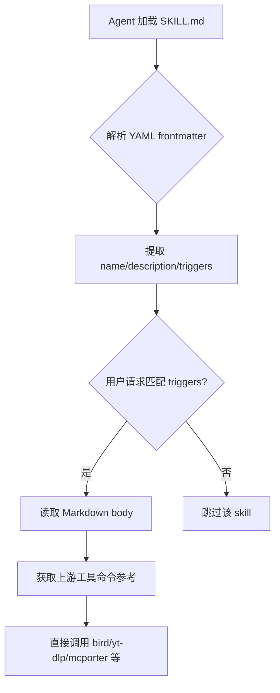
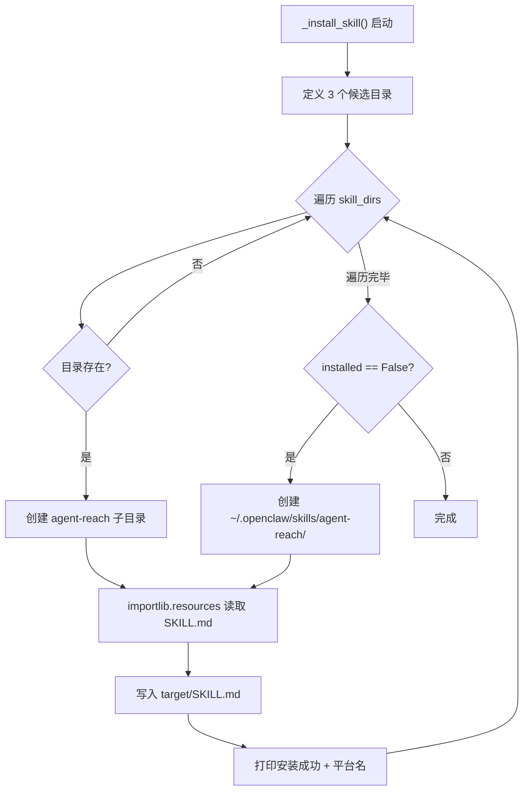

# PD-170.01 Agent Reach — SKILL.md 知识注入与多 Agent 平台技能分发

> 文档编号：PD-170.01
> 来源：Agent Reach `agent_reach/skill/SKILL.md`, `agent_reach/cli.py`, `llms.txt`
> GitHub：https://github.com/Panniantong/Agent-Reach.git
> 问题域：PD-170 Agent 技能分发 Agent Skill Distribution
> 状态：可复用方案

---

## 第 1 章 问题与动机

### 1.1 核心问题

AI Agent 生态碎片化严重：Claude Code 用 `~/.claude/skills/`，OpenClaw 用 `~/.openclaw/skills/`，通用 Agent 可能用 `~/.agents/skills/`。一个工具想要被多个 Agent 平台使用，面临三个关键挑战：

1. **能力描述不统一** — 每个 Agent 平台对"技能"的理解不同，没有标准格式让 Agent 知道"我能做什么"
2. **安装路径碎片化** — 不同平台的 skill 目录各不相同，手动安装需要用户了解每个平台的内部结构
3. **LLM 可发现性缺失** — 传统 README 面向人类，LLM 无法高效地从中提取"这个工具能帮我做什么"

Agent Reach 的解决方案是：用一个 SKILL.md 文件作为 Agent 可读的能力描述，install 时自动探测已有的 Agent 平台目录并复制进去，同时提供 llms.txt 作为 LLM 友好的项目摘要。

### 1.2 Agent Reach 的解法概述

1. **SKILL.md 作为能力契约** — 一个 Markdown 文件包含 YAML frontmatter（触发条件、描述）+ 完整命令参考，Agent 读后即可直接调用上游工具（`agent_reach/skill/SKILL.md:1-259`）
2. **多平台自动探测安装** — `_install_skill()` 函数遍历 3 个已知 skill 目录（OpenClaw/Claude Code/通用），存在即安装，不存在则创建 OpenClaw 默认目录（`agent_reach/cli.py:236-274`）
3. **llms.txt 标准化项目摘要** — 遵循 llms.txt 提案，提供 LLM 可消费的项目概述、核心命令、关键特性（`llms.txt:1-33`）
4. **importlib.resources 打包分发** — SKILL.md 作为 Python 包数据随 pip install 分发，通过 `importlib.resources.files()` 读取，不依赖文件系统相对路径（`agent_reach/cli.py:255`）
5. **脚手架而非框架** — 安装完成后 Agent 直接调用上游工具（bird、yt-dlp、mcporter 等），SKILL.md 只是"说明书"，不是运行时依赖

### 1.3 设计思想

| 设计原则 | 具体实现 | 理由 | 替代方案 |
|----------|----------|------|----------|
| 约定优于配置 | SKILL.md 用 YAML frontmatter + Markdown body 的固定格式 | Agent 无需额外解析逻辑，读 Markdown 是 LLM 的天然能力 | JSON Schema 定义（过于严格，LLM 不友好） |
| 探测优于声明 | `_install_skill()` 遍历已知目录，存在即安装 | 用户不需要知道自己用的是哪个 Agent 平台 | 要求用户指定 `--platform=claude`（增加认知负担） |
| 包数据随代码走 | `importlib.resources.files("agent_reach")` 读取 SKILL.md | pip install 后 SKILL.md 自动可用，无需额外下载 | 从 GitHub raw URL 下载（网络依赖、版本不一致） |
| 上游透传 | SKILL.md 列出上游工具的原始命令，不做二次封装 | Agent 直接调用 bird/yt-dlp/mcporter，减少抽象层 | 提供统一 API 封装（增加维护成本，隐藏上游能力） |
| 双层可发现性 | llms.txt 提供项目级摘要，SKILL.md 提供命令级参考 | 不同粒度的 LLM 消费场景 | 只用 README（信息密度低，噪声多） |

---

## 第 2 章 源码实现分析

### 2.1 架构概览

Agent Reach 的技能分发系统由三个层次组成：

```
┌─────────────────────────────────────────────────────────┐
│                    LLM / Agent 消费层                     │
│  ┌──────────┐  ┌──────────────┐  ┌───────────────────┐  │
│  │ llms.txt │  │   SKILL.md   │  │ install.md (人类)  │  │
│  │ 项目摘要  │  │ 命令级参考    │  │ 安装指南           │  │
│  └──────────┘  └──────────────┘  └───────────────────┘  │
├─────────────────────────────────────────────────────────┤
│                    安装分发层                              │
│  ┌──────────────────────────────────────────────────┐   │
│  │ _install_skill() — cli.py:236-274               │   │
│  │  探测: ~/.openclaw/skills → ~/.claude/skills     │   │
│  │        → ~/.agents/skills → 默认创建 openclaw    │   │
│  │  读取: importlib.resources.files("agent_reach")  │   │
│  │  写入: target/agent-reach/SKILL.md               │   │
│  └──────────────────────────────────────────────────┘   │
├─────────────────────────────────────────────────────────┤
│                    包数据层                                │
│  ┌──────────────────────────────────────────────────┐   │
│  │ pyproject.toml — force-include agent_reach/skill │   │
│  │ agent_reach/skill/SKILL.md — 随 wheel 分发       │   │
│  └──────────────────────────────────────────────────┘   │
└─────────────────────────────────────────────────────────┘
```

### 2.2 核心实现

#### 2.2.1 SKILL.md 格式设计

SKILL.md 采用 YAML frontmatter + Markdown body 的双层结构，这是 Agent Reach 技能分发的核心载体。



对应源码 `agent_reach/skill/SKILL.md:1-26`：

```yaml
---
name: agent-reach
description: >
  Give your AI agent eyes to see the entire internet. Install and configure
  upstream tools for Twitter/X, Reddit, YouTube, GitHub, Bilibili, XiaoHongShu,
  Douyin, LinkedIn, Boss直聘, RSS, and any web page — then call them directly.
  Use when: (1) setting up platform access tools for the first time,
  (2) checking which platforms are available,
  (3) user asks to configure/enable a platform channel.
  Triggers: "帮我配", "帮我添加", "帮我安装", "agent reach", "install channels",
  "configure twitter", "enable reddit".
---

# Agent Reach

Install and configure upstream tools for 12+ platforms. After setup,
call them directly — no wrapper layer.
```

关键设计点：
- `description` 字段包含 `Use when` 和 `Triggers`，让 Agent 知道何时激活此技能
- Markdown body 直接列出每个平台的上游工具命令（`bird search`、`yt-dlp --dump-json` 等）
- 不提供封装 API，Agent 读完后直接调用上游 CLI

#### 2.2.2 多平台自动安装

`_install_skill()` 是技能分发的核心函数，实现了"探测已有平台 → 复制 SKILL.md"的逻辑。



对应源码 `agent_reach/cli.py:236-274`：

```python
def _install_skill():
    """Install Agent Reach as an agent skill (OpenClaw / Claude Code)."""
    import os
    import importlib.resources

    # Determine skill install path
    skill_dirs = [
        os.path.expanduser("~/.openclaw/skills"),   # OpenClaw
        os.path.expanduser("~/.claude/skills"),      # Claude Code
        os.path.expanduser("~/.agents/skills"),      # Generic agents
    ]

    installed = False
    for skill_dir in skill_dirs:
        if os.path.isdir(skill_dir):
            target = os.path.join(skill_dir, "agent-reach")
            try:
                os.makedirs(target, exist_ok=True)
                # Read SKILL.md from package data
                skill_md = importlib.resources.files("agent_reach") \
                    .joinpath("skill", "SKILL.md").read_text()
                with open(os.path.join(target, "SKILL.md"), "w") as f:
                    f.write(skill_md)
                platform_name = ("OpenClaw" if "openclaw" in skill_dir
                    else "Claude Code" if "claude" in skill_dir
                    else "Agent")
                print(f"🧩 Skill installed for {platform_name}: {target}")
                installed = True
            except Exception:
                pass

    if not installed:
        # No known skill directory found — create for OpenClaw by default
        target = os.path.expanduser("~/.openclaw/skills/agent-reach")
        try:
            os.makedirs(target, exist_ok=True)
            skill_md = importlib.resources.files("agent_reach") \
                .joinpath("skill", "SKILL.md").read_text()
            with open(os.path.join(target, "SKILL.md"), "w") as f:
                f.write(skill_md)
            print(f"🧩 Skill installed: {target}")
        except Exception:
            print("  ⬜ Could not install agent skill (optional)")
```

关键实现细节：
- **优先级顺序**：OpenClaw → Claude Code → 通用 Agent，反映了项目的目标用户群
- **全量安装**：如果多个平台目录都存在，全部安装（不是只装第一个）
- **默认兜底**：没有任何已知目录时，创建 OpenClaw 目录作为默认
- **静默失败**：安装失败不中断整体 install 流程，skill 安装是可选的

### 2.3 实现细节

#### llms.txt 的双层可发现性

`llms.txt` 遵循 llms.txt 提案（https://llmstxt.org），提供项目级的 LLM 可消费摘要：

```
# Agent Reach

> Give your AI agent eyes to see the entire internet. A unified CLI tool
> that lets AI agents read and search across 12+ platforms...

## Quick Start
- [Installation Guide](https://github.com/.../docs/install.md)
- [README (中文)](https://github.com/.../README.md)

## Core Commands
- [CLI Usage](https://github.com/.../docs/install.md): `agent-reach read <url>`...

## Optional
- [SKILL.md](https://github.com/.../agent_reach/skill/SKILL.md)
```

与 SKILL.md 的分工：
- `llms.txt` → 项目级："这个项目是什么？怎么开始？"（面向 LLM 发现阶段）
- `SKILL.md` → 命令级："具体怎么调用每个平台？"（面向 Agent 执行阶段）

#### pyproject.toml 的包数据配置

`pyproject.toml:60-62` 确保 SKILL.md 和 guides 随 wheel 分发：

```toml
[tool.hatch.build.targets.wheel.force-include]
"agent_reach/guides" = "agent_reach/guides"
"agent_reach/skill" = "agent_reach/skill"
```

这使得 `importlib.resources.files("agent_reach").joinpath("skill", "SKILL.md")` 在 pip install 后始终可用。

#### install 流程中的 skill 安装时机

`_install_skill()` 在 `_cmd_install()` 的最后阶段调用（`cli.py:224`），位于系统依赖安装、mcporter 配置、cookie 导入、渠道测试之后。这确保了：
1. 上游工具已就绪，SKILL.md 中引用的命令可以实际执行
2. doctor 检查已完成，用户知道哪些渠道可用
3. skill 安装失败不影响核心功能


---

## 第 3 章 迁移指南

### 3.1 迁移清单

将 Agent Reach 的技能分发模式迁移到自己的项目，需要完成以下步骤：

**阶段 1：创建 SKILL.md（1 个文件）**

- [ ] 在项目中创建 `your_package/skill/SKILL.md`
- [ ] 编写 YAML frontmatter：`name`、`description`（含 `Use when` + `Triggers`）
- [ ] 编写 Markdown body：列出所有可用命令及示例
- [ ] 确保命令示例可直接复制执行（不是伪代码）

**阶段 2：配置包数据分发**

- [ ] 在 `pyproject.toml` 中添加 `force-include` 确保 skill 目录随 wheel 分发
- [ ] 验证 `pip install` 后 `importlib.resources.files()` 能读到 SKILL.md

**阶段 3：实现自动安装**

- [ ] 实现 `_install_skill()` 函数，探测已知 Agent 平台目录
- [ ] 将 skill 安装集成到 CLI 的 install 命令中
- [ ] 添加静默失败处理（skill 安装是可选的）

**阶段 4：添加 llms.txt（可选）**

- [ ] 在项目根目录创建 `llms.txt`
- [ ] 遵循 llms.txt 提案格式：标题 + 描述 + 链接

### 3.2 适配代码模板

以下是一个可直接复用的技能分发模块：

```python
# skill_installer.py — 可直接复用的多平台技能安装器
import os
import importlib.resources
from typing import List, Tuple


# 已知的 Agent 平台 skill 目录
KNOWN_SKILL_DIRS = [
    ("OpenClaw", os.path.expanduser("~/.openclaw/skills")),
    ("Claude Code", os.path.expanduser("~/.claude/skills")),
    ("Generic Agent", os.path.expanduser("~/.agents/skills")),
]

# 默认兜底平台
DEFAULT_PLATFORM = KNOWN_SKILL_DIRS[0]


def install_skill(
    package_name: str,
    skill_subpath: str = "skill/SKILL.md",
    skill_dir_name: str | None = None,
) -> List[Tuple[str, str, bool]]:
    """
    将 SKILL.md 安装到所有已存在的 Agent 平台目录。

    Args:
        package_name: Python 包名（用于 importlib.resources）
        skill_subpath: SKILL.md 在包内的相对路径
        skill_dir_name: 安装到 skills/ 下的子目录名（默认用 package_name）

    Returns:
        [(platform_name, target_path, success), ...]
    """
    dir_name = skill_dir_name or package_name.replace("_", "-")
    results = []
    installed_any = False

    # 读取 SKILL.md 内容
    try:
        skill_content = (
            importlib.resources.files(package_name)
            .joinpath(skill_subpath)
            .read_text(encoding="utf-8")
        )
    except Exception as e:
        return [("Package", "", False)]

    # 遍历已知平台目录
    for platform_name, skill_dir in KNOWN_SKILL_DIRS:
        if os.path.isdir(skill_dir):
            target = os.path.join(skill_dir, dir_name)
            success = _write_skill(target, skill_content)
            results.append((platform_name, target, success))
            if success:
                installed_any = True

    # 兜底：没有任何已知目录时，创建默认平台目录
    if not installed_any:
        platform_name, skill_dir = DEFAULT_PLATFORM
        target = os.path.join(skill_dir, dir_name)
        success = _write_skill(target, skill_content)
        results.append((platform_name, target, success))

    return results


def _write_skill(target_dir: str, content: str) -> bool:
    """写入 SKILL.md 到目标目录。"""
    try:
        os.makedirs(target_dir, exist_ok=True)
        with open(os.path.join(target_dir, "SKILL.md"), "w", encoding="utf-8") as f:
            f.write(content)
        return True
    except Exception:
        return False
```

### 3.3 适用场景

| 场景 | 适用度 | 说明 |
|------|--------|------|
| CLI 工具想被 AI Agent 调用 | ⭐⭐⭐ | 最佳场景：写 SKILL.md 描述命令，install 时自动注册 |
| MCP Server 想提高可发现性 | ⭐⭐⭐ | llms.txt + SKILL.md 双层描述，LLM 可自主发现和使用 |
| Python 库想支持多 Agent 平台 | ⭐⭐ | 需要额外的 CLI 入口点，但分发模式可复用 |
| 纯前端项目 | ⭐ | 不适用，Agent skill 主要面向 CLI/后端工具 |
| 企业内部工具分发 | ⭐⭐⭐ | 可扩展 KNOWN_SKILL_DIRS 加入企业自定义 Agent 平台路径 |

---

## 第 4 章 测试用例

```python
# test_skill_distribution.py
import os
import tempfile
import pytest
from unittest.mock import patch, MagicMock


class TestInstallSkill:
    """测试 _install_skill() 的多平台探测安装逻辑。"""

    def test_install_to_existing_openclaw_dir(self, tmp_path):
        """已有 OpenClaw skills 目录时，应安装到该目录。"""
        openclaw_dir = tmp_path / ".openclaw" / "skills"
        openclaw_dir.mkdir(parents=True)

        skill_dirs = [str(openclaw_dir), "/nonexistent/claude", "/nonexistent/agents"]

        with patch("agent_reach.cli.os.path.expanduser") as mock_expand:
            mock_expand.side_effect = lambda p: str(tmp_path / p.lstrip("~/"))
            # 模拟 importlib.resources 返回 SKILL.md 内容
            with patch("importlib.resources.files") as mock_files:
                mock_files.return_value.joinpath.return_value.read_text.return_value = "# Test Skill"
                from agent_reach.cli import _install_skill
                _install_skill()

        target = openclaw_dir / "agent-reach" / "SKILL.md"
        assert target.exists()
        assert target.read_text() == "# Test Skill"

    def test_install_to_multiple_platforms(self, tmp_path):
        """多个平台目录都存在时，应全部安装。"""
        dirs = {
            "openclaw": tmp_path / ".openclaw" / "skills",
            "claude": tmp_path / ".claude" / "skills",
        }
        for d in dirs.values():
            d.mkdir(parents=True)

        # 验证两个目录都有 SKILL.md
        for name, d in dirs.items():
            target = d / "agent-reach" / "SKILL.md"
            # 实际测试需要 mock，这里验证目录结构
            assert d.exists()

    def test_fallback_creates_openclaw_default(self, tmp_path):
        """没有任何已知目录时，应创建 OpenClaw 默认目录。"""
        # 所有已知目录都不存在的情况
        # _install_skill 应创建 ~/.openclaw/skills/agent-reach/
        assert not (tmp_path / ".openclaw").exists()

    def test_skill_content_from_package_data(self):
        """SKILL.md 应通过 importlib.resources 从包数据读取。"""
        import importlib.resources
        try:
            content = (
                importlib.resources.files("agent_reach")
                .joinpath("skill", "SKILL.md")
                .read_text()
            )
            assert "agent-reach" in content
            assert "name:" in content
            assert "description:" in content
        except Exception:
            pytest.skip("agent_reach package not installed")

    def test_silent_failure_on_permission_error(self, tmp_path, capsys):
        """安装失败时应静默处理，不中断主流程。"""
        # 创建只读目录
        readonly_dir = tmp_path / ".openclaw" / "skills"
        readonly_dir.mkdir(parents=True)
        readonly_dir.chmod(0o444)

        # _install_skill 不应抛出异常
        # 实际测试需要完整 mock 环境


class TestLlmsTxt:
    """测试 llms.txt 的格式合规性。"""

    def test_llms_txt_has_required_sections(self):
        """llms.txt 应包含标题、描述、链接。"""
        llms_path = os.path.join(
            os.path.dirname(__file__), "..", "llms.txt"
        )
        if not os.path.exists(llms_path):
            pytest.skip("llms.txt not found")

        content = open(llms_path).read()
        assert content.startswith("# ")  # 标题
        assert "## " in content          # 至少一个二级标题
        assert "http" in content          # 至少一个链接

    def test_llms_txt_concise(self):
        """llms.txt 应简洁，不超过 100 行。"""
        llms_path = os.path.join(
            os.path.dirname(__file__), "..", "llms.txt"
        )
        if not os.path.exists(llms_path):
            pytest.skip("llms.txt not found")

        lines = open(llms_path).readlines()
        assert len(lines) <= 100, f"llms.txt too long: {len(lines)} lines"


class TestSkillMdFormat:
    """测试 SKILL.md 的格式规范。"""

    def test_has_yaml_frontmatter(self):
        """SKILL.md 应有 YAML frontmatter。"""
        import importlib.resources
        try:
            content = (
                importlib.resources.files("agent_reach")
                .joinpath("skill", "SKILL.md")
                .read_text()
            )
        except Exception:
            pytest.skip("agent_reach not installed")

        assert content.startswith("---")
        assert "name:" in content
        assert "description:" in content

    def test_has_trigger_keywords(self):
        """SKILL.md 的 description 应包含 Triggers。"""
        import importlib.resources
        try:
            content = (
                importlib.resources.files("agent_reach")
                .joinpath("skill", "SKILL.md")
                .read_text()
            )
        except Exception:
            pytest.skip("agent_reach not installed")

        assert "Triggers:" in content or "Use when:" in content

    def test_has_executable_commands(self):
        """SKILL.md 应包含可执行的命令示例。"""
        import importlib.resources
        try:
            content = (
                importlib.resources.files("agent_reach")
                .joinpath("skill", "SKILL.md")
                .read_text()
            )
        except Exception:
            pytest.skip("agent_reach not installed")

        # 应包含 bash 代码块
        assert "```bash" in content
        # 应包含实际的上游工具命令
        assert "bird " in content or "yt-dlp " in content or "mcporter " in content
```


---

## 第 5 章 跨域关联

| 关联域 | 关系类型 | 说明 |
|--------|----------|------|
| PD-04 工具系统 | 协同 | SKILL.md 本质是工具系统的"使用说明书"，Agent Reach 的 Channel 抽象类（`base.py`）定义了工具注册和健康检查接口，SKILL.md 则告诉 Agent 如何调用这些工具 |
| PD-07 质量检查 | 协同 | `agent-reach doctor` 提供渠道级健康检查，SKILL.md 中引导 Agent 在配置渠道后运行 doctor 验证，形成"安装 → 检查 → 修复"闭环 |
| PD-11 可观测性 | 依赖 | `agent-reach watch` 命令提供定时健康监控，可集成到 Agent 的 cron 任务中，实现渠道可用性的持续观测 |
| PD-141 Channel 抽象 | 依赖 | SKILL.md 中列出的每个平台命令，背后对应一个 Channel 子类（`channels/*.py`），Channel 的 `check()` 方法为 doctor 提供状态，SKILL.md 为 Agent 提供调用方式 |
| PD-142 凭据管理 | 协同 | SKILL.md 中的"Configure channels"部分引导 Agent 完成 Cookie/Token 配置，Config 类（`config.py`）负责安全存储（chmod 600），两者共同解决"Agent 如何获取平台访问权限" |
| PD-143 环境检测 | 协同 | `_detect_environment()` 自动判断 local/server 环境，影响 install 行为（本地自动导入 Cookie，服务器建议配代理），SKILL.md 中的 troubleshooting 部分也区分环境给出不同建议 |

---

## 第 6 章 来源文件索引

| 文件 | 行范围 | 关键实现 |
|------|--------|----------|
| `agent_reach/skill/SKILL.md` | L1-L259 | 核心技能描述文件：YAML frontmatter（触发条件）+ 12 个平台的完整命令参考 |
| `agent_reach/cli.py` | L236-L274 | `_install_skill()` 多平台自动探测安装，importlib.resources 读取包数据 |
| `agent_reach/cli.py` | L113-L234 | `_cmd_install()` 完整安装流程，skill 安装在最后阶段（L224） |
| `llms.txt` | L1-L33 | LLM 可发现的项目摘要，遵循 llms.txt 提案格式 |
| `pyproject.toml` | L57-L62 | Hatch 构建配置，force-include 确保 skill/ 和 guides/ 随 wheel 分发 |
| `agent_reach/channels/base.py` | L1-L37 | Channel 抽象基类，定义 `check()` 接口供 doctor 使用 |
| `agent_reach/channels/__init__.py` | L1-L58 | 渠道注册表，ALL_CHANNELS 列表驱动 doctor 检查 |
| `agent_reach/doctor.py` | L1-L91 | 健康检查引擎，遍历所有 Channel 的 check() 并格式化报告 |
| `agent_reach/config.py` | L1-L103 | YAML 配置管理，chmod 600 安全存储，环境变量回退 |
| `agent_reach/integrations/mcp_server.py` | L1-L67 | MCP Server 集成，将 doctor 暴露为 MCP tool |
| `docs/install.md` | L1-L292 | Agent 面向的安装指南，分步骤引导 Agent 完成安装和配置 |

---

## 第 7 章 横向对比维度

```json comparison_data
{
  "project": "Agent Reach",
  "dimensions": {
    "技能描述格式": "YAML frontmatter + Markdown body，含 Triggers 触发词和完整命令示例",
    "安装分发机制": "importlib.resources 包数据 + 多目录探测写入（OpenClaw/Claude Code/通用）",
    "平台适配策略": "遍历已知目录全量安装，无已知目录时创建 OpenClaw 默认",
    "LLM可发现性": "双层设计：llms.txt 项目摘要 + SKILL.md 命令级参考",
    "上游工具关系": "脚手架模式：安装后 Agent 直接调用上游 CLI，不做二次封装"
  }
}
```

### 域元数据补充

```json domain_metadata
{
  "solution_summary": "Agent Reach 通过 YAML frontmatter SKILL.md + importlib.resources 包数据分发 + 三目录探测安装，实现 12+ 平台工具能力向 OpenClaw/Claude Code/通用 Agent 的一键技能注入",
  "description": "工具能力的跨 Agent 平台自动注册与 LLM 双层可发现性设计",
  "sub_problems": [
    "pip install 后包数据的可靠读取（importlib.resources vs 相对路径）",
    "多 Agent 平台目录的优先级与兜底策略",
    "技能安装失败的静默降级处理"
  ],
  "best_practices": [
    "YAML frontmatter 中写明 Triggers 触发词，Agent 可按关键词匹配激活技能",
    "llms.txt + SKILL.md 双层设计：项目发现用 llms.txt，命令执行用 SKILL.md",
    "skill 安装放在 install 流程最后，上游工具就绪后再注册，确保 SKILL.md 中的命令可实际执行"
  ]
}
```

